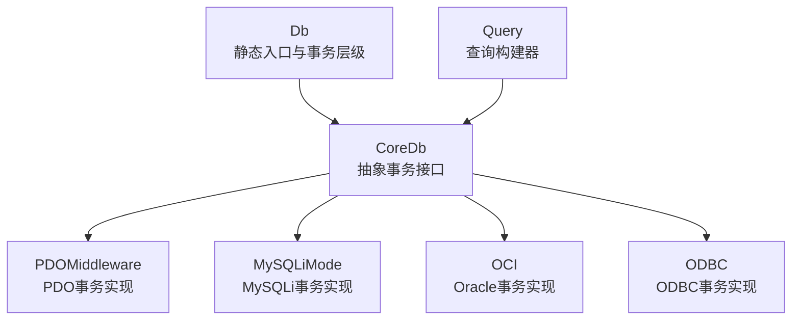
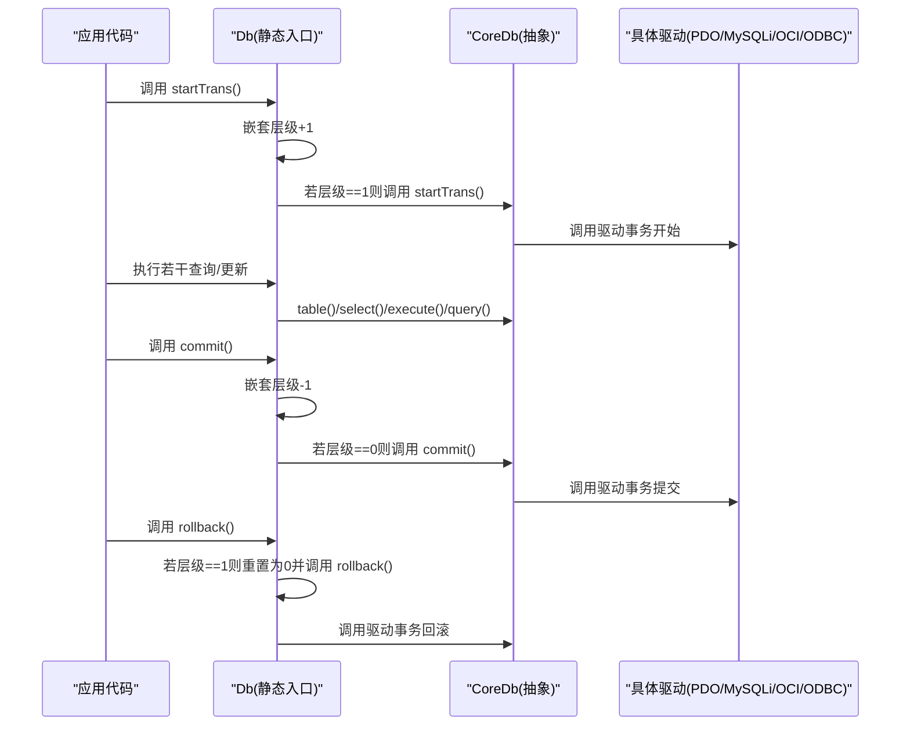
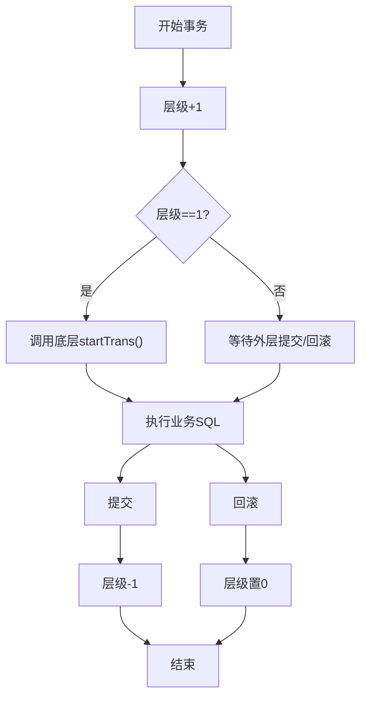
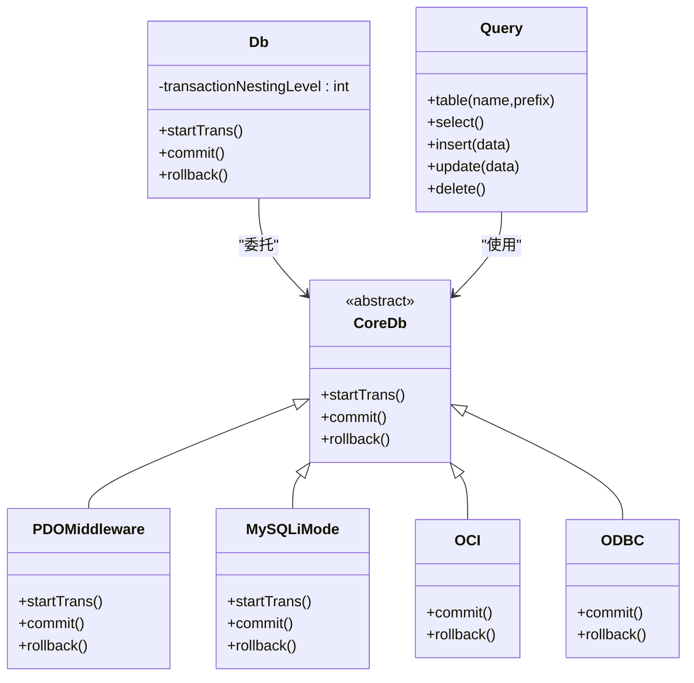
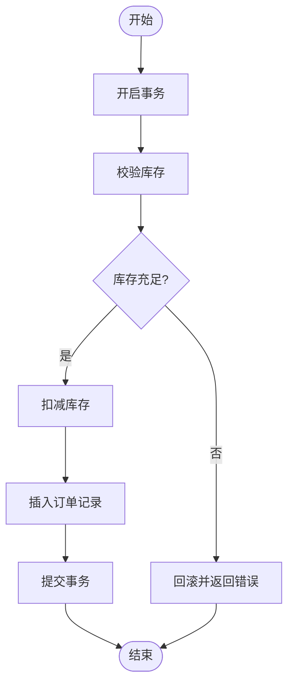
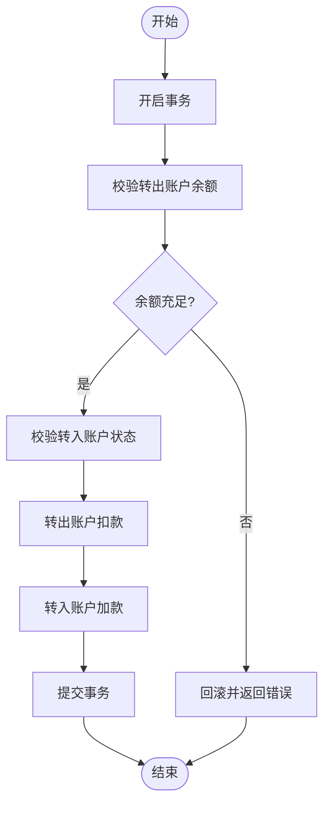

# 事务管理

<cite>
**本文引用的文件**
- [src/Db.php](file://src/Db.php)
- [src/Core/Db.php](file://src/Core/Db.php)
- [src/Middleware/PDOMiddleware.php](file://src/Middleware/PDOMiddleware.php)
- [src/Extend/MySQL/Mode/MySQLiMode.php](file://src/Extend/MySQL/Mode/MySQLiMode.php)
- [src/Extend/Oracle/Driver/OCI.php](file://src/Extend/Oracle/Driver/OCI.php)
- [src/Driver/ODBC/ODBC.php](file://src/Driver/ODBC/ODBC.php)
- [tests/Extend/MySQL/Mode/TestPDOMode.php](file://tests/Extend/MySQL/Mode/TestPDOMode.php)
- [tests/Extend/MySQL/Mode/TestMySQLiMode.php](file://tests/Extend/MySQL/Mode/TestMySQLiMode.php)
- [tests/Extend/SQLite/Mode/TestPDOMode.php](file://tests/Extend/SQLite/Mode/TestPDOMode.php)
- [tests/Extend/Oracle/Mode/TestOCIMode.php](file://tests/Extend/Oracle/Mode/TestOCIMode.php)
- [tests/Extend/SQLSRV/Mode/TestPDOMode.php](file://tests/Extend/SQLSRV/Mode/TestPDOMode.php)
- [examples/db_connect.php](file://examples/db_connect.php)
</cite>

## 目录
1. [简介](#简介)
2. [项目结构](#项目结构)
3. [核心组件](#核心组件)
4. [架构总览](#架构总览)
5. [详细组件分析](#详细组件分析)
6. [依赖关系分析](#依赖关系分析)
7. [性能考量](#性能考量)
8. [故障排查指南](#故障排查指南)
9. [结论](#结论)
10. [附录](#附录)

## 简介
本章节聚焦于 FizeDatabase 的事务管理能力，系统性阐述事务的开启、提交与回滚机制，覆盖嵌套事务计数、自动事务控制、与查询构建器的协同使用、错误处理与回滚策略，并结合测试用例与驱动实现，给出最佳实践与常见陷阱的规避方法。同时提供订单处理、转账等典型业务场景的实现思路与流程图。

## 项目结构
围绕事务管理的关键代码分布在以下层次：
- 公共入口与静态封装：Db 类负责对外暴露静态接口，维护事务嵌套层级，并委托底层 CoreDb 实现具体事务操作。
- 抽象层：CoreDb 定义事务抽象方法，确保各驱动实现一致性。
- 中间件与驱动：PDOMiddleware、MySQLiMode、OCI、ODBC 等分别对接 PDO/MySQLi/OCI/ODBC 的事务 API。
- 查询构建器：与事务配合使用，保证同一事务上下文内的查询与执行在同一连接/会话内完成。

图表来源
- [src/Db.php:84-114](file://src/Db.php#L84-L114)
- [src/Core/Db.php:122-134](file://src/Core/Db.php#L122-L134)
- [src/Middleware/PDOMiddleware.php:98-117](file://src/Middleware/PDOMiddleware.php#L98-L117)
- [src/Extend/MySQL/Mode/MySQLiMode.php:219-239](file://src/Extend/MySQL/Mode/MySQLiMode.php#L219-L239)
- [src/Extend/Oracle/Driver/OCI.php:105-109](file://src/Extend/Oracle/Driver/OCI.php#L105-L109)
- [src/Driver/ODBC/ODBC.php:135-137](file://src/Driver/ODBC/ODBC.php#L135-L137)

章节来源
- [src/Db.php:84-114](file://src/Db.php#L84-L114)
- [src/Core/Db.php:122-134](file://src/Core/Db.php#L122-L134)

## 核心组件
- 事务静态入口与嵌套计数
  - Db 维护事务嵌套层级，仅在最外层开启/提交/回滚时真正调用底层 CoreDb 的事务方法。
  - 提供 startTrans、commit、rollback 三个静态方法，简化业务侧调用。
- 抽象事务接口
  - CoreDb 在抽象层声明 startTrans、commit、rollback，确保不同驱动实现一致。
- 驱动事务实现
  - PDO：通过 PDOMiddleware 调用 PDO 的 beginTransaction/commit/rollBack。
  - MySQLi：通过 MySQLiMode 调用 begin_transaction/commit/rollback。
  - Oracle：通过 OCI 调用 oci_commit/oci_rollback。
  - ODBC：通过 ODBC 驱动封装的 commit/rollback。
- 查询构建器集成
  - 通过 Db::table(...) 选择表，随后的 select/insert/update/delete/execute/query 均在当前事务上下文中执行，保证原子性与一致性。

章节来源
- [src/Db.php:22-24](file://src/Db.php#L22-L24)
- [src/Db.php:84-114](file://src/Db.php#L84-L114)
- [src/Core/Db.php:122-134](file://src/Core/Db.php#L122-L134)
- [src/Middleware/PDOMiddleware.php:98-117](file://src/Middleware/PDOMiddleware.php#L98-L117)
- [src/Extend/MySQL/Mode/MySQLiMode.php:219-239](file://src/Extend/MySQL/Mode/MySQLiMode.php#L219-L239)
- [src/Extend/Oracle/Driver/OCI.php:105-109](file://src/Extend/Oracle/Driver/OCI.php#L105-L109)
- [src/Driver/ODBC/ODBC.php:135-137](file://src/Driver/ODBC/ODBC.php#L135-L137)

## 架构总览
事务从应用层到驱动层的调用链如下：

图表来源
- [src/Db.php:84-114](file://src/Db.php#L84-L114)
- [src/Core/Db.php:122-134](file://src/Core/Db.php#L122-L134)
- [src/Middleware/PDOMiddleware.php:98-117](file://src/Middleware/PDOMiddleware.php#L98-L117)
- [src/Extend/MySQL/Mode/MySQLiMode.php:219-239](file://src/Extend/MySQL/Mode/MySQLiMode.php#L219-L239)
- [src/Extend/Oracle/Driver/OCI.php:105-109](file://src/Extend/Oracle/Driver/OCI.php#L105-L109)
- [src/Driver/ODBC/ODBC.php:135-137](file://src/Driver/ODBC/ODBC.php#L135-L137)

## 详细组件分析

### 事务嵌套与自动控制
- 嵌套计数：Db 内部维护 transactionNestingLevel，每次 startTrans 增加，commit/rollback 减少。
- 自动控制：仅当层级从 0 变为 1 时才真正开启事务；仅当层级从 1 变为 0 时才真正提交或回滚。
- 设计动机：允许业务在多层调用中统一管理事务，避免重复开启导致的异常。

图表来源
- [src/Db.php:84-114](file://src/Db.php#L84-L114)

章节来源
- [src/Db.php:22-24](file://src/Db.php#L22-L24)
- [src/Db.php:84-114](file://src/Db.php#L84-L114)

### 驱动层事务实现对比
- PDO（PDOMiddleware）
  - startTrans 调用 beginTransaction
  - commit 调用 commit
  - rollback 调用 rollBack
- MySQLi（MySQLiMode）
  - startTrans 调用 begin_transaction
  - commit 调用 commit
  - rollback 调用 rollback
- Oracle（OCI）
  - commit 调用 oci_commit
  - rollback 调用 oci_rollback
- ODBC（ODBC.php）
  - commit 调用 odbc_commit
  - rollback 调用 odbc_rollback

章节来源
- [src/Middleware/PDOMiddleware.php:98-117](file://src/Middleware/PDOMiddleware.php#L98-L117)
- [src/Extend/MySQL/Mode/MySQLiMode.php:219-239](file://src/Extend/MySQL/Mode/MySQLiMode.php#L219-L239)
- [src/Extend/Oracle/Driver/OCI.php:105-109](file://src/Extend/Oracle/Driver/OCI.php#L105-L109)
- [src/Driver/ODBC/ODBC.php:135-137](file://src/Driver/ODBC/ODBC.php#L135-L137)

### 与查询构建器的集成
- 通过 Db::table(...) 指定表，后续 select/insert/update/delete/execute/query 将在当前事务上下文中执行。
- 查询构建器在 build(...) 阶段拼装 SQL 并绑定参数，随后由底层驱动执行，确保事务边界内的一致性。

章节来源
- [src/Db.php:124-127](file://src/Db.php#L124-L127)
- [src/Core/Db.php:583-637](file://src/Core/Db.php#L583-L637)

### 错误处理与回滚策略
- PDO/MySQLi/OCI/ODBC 在执行异常时抛出数据库异常，业务应在 try/catch 中捕获并在异常时触发回滚。
- 建议策略：
  - 优先使用 try-finally 或 try-catch 包裹事务块，确保异常时回滚。
  - 对于幂等性要求高的操作，先读取状态再写入，失败即回滚。
  - 对于跨服务/跨数据库的分布式事务，需引入补偿机制或消息队列，不在本库范围内。

章节来源
- [src/Middleware/PDOMiddleware.php:69-92](file://src/Middleware/PDOMiddleware.php#L69-L92)
- [src/Extend/MySQL/Mode/MySQLiMode.php:115-215](file://src/Extend/MySQL/Mode/MySQLiMode.php#L115-L215)
- [src/Extend/Oracle/Driver/OCI.php:105-109](file://src/Extend/Oracle/Driver/OCI.php#L105-L109)

### 事务隔离级别、并发控制与死锁处理
- 隔离级别与并发控制
  - 本库未在公共 API 中暴露隔离级别的设置。若需设置，请在驱动层或连接初始化阶段自行配置（例如 PDO 的 ATTR_ERRMODE、驱动特定的隔离级别设置）。
- 死锁处理
  - 本库未内置死锁检测与自动重试。建议在业务层增加指数退避重试与最大重试次数限制，并在关键路径上记录死锁事件以便定位。

章节来源
- [src/Middleware/PDOMiddleware.php:26-34](file://src/Middleware/PDOMiddleware.php#L26-L34)

### 嵌套事务支持
- 通过嵌套层级计数实现“伪嵌套事务”。外层开启事务后，内层多次 startTrans 不会重复开启底层事务，仅在最外层 commit/rollback 时才真正提交或回滚。
- 适用场景：多层业务方法共享同一事务上下文，避免重复开启事务带来的资源浪费。

章节来源
- [src/Db.php:84-114](file://src/Db.php#L84-L114)

### 与查询构建器的协同使用
- 示例：在事务中使用查询构建器进行多表更新与校验，确保原子性。
- 注意：查询构建器的 select/insert/update/delete/execute/query 均在当前事务上下文中执行，无需额外关注连接。

章节来源
- [src/Db.php:124-127](file://src/Db.php#L124-L127)
- [src/Core/Db.php:644-711](file://src/Core/Db.php#L644-L711)

## 依赖关系分析
- Db 依赖 CoreDb 的抽象事务接口，具体实现由各驱动提供。
- PDOMiddleware/MySQLiMode/OCI/ODBC 分别封装对应数据库的事务 API。
- 查询构建器与事务解耦，通过 CoreDb 的 query/execute 实现与事务协作。

图表来源
- [src/Db.php:84-114](file://src/Db.php#L84-L114)
- [src/Core/Db.php:122-134](file://src/Core/Db.php#L122-L134)
- [src/Middleware/PDOMiddleware.php:98-117](file://src/Middleware/PDOMiddleware.php#L98-L117)
- [src/Extend/MySQL/Mode/MySQLiMode.php:219-239](file://src/Extend/MySQL/Mode/MySQLiMode.php#L219-L239)
- [src/Extend/Oracle/Driver/OCI.php:105-109](file://src/Extend/Oracle/Driver/OCI.php#L105-L109)
- [src/Driver/ODBC/ODBC.php:135-137](file://src/Driver/ODBC/ODBC.php#L135-L137)

## 性能考量
- 嵌套事务减少底层事务开关次数，降低开销。
- 合理使用查询构建器批量操作，减少往返次数。
- 避免在事务中执行长时间阻塞操作（如大结果集导出），必要时拆分为多个短事务。
- 对高并发场景，注意连接池与超时设置，避免长时间占用连接。

## 故障排查指南
- 常见问题
  - 未提交/未回滚：确认业务逻辑在异常分支也调用 rollback。
  - 嵌套层级错误：避免在事务外层多次 startTrans，确保 commit/rollback 成对出现。
  - 驱动差异：不同驱动的事务行为略有差异，需在测试环境验证。
- 测试验证
  - 使用测试用例验证事务的开启、提交与回滚是否生效，覆盖 PDO/MySQLi/OCI/ODBC 等驱动。

章节来源
- [tests/Extend/MySQL/Mode/TestPDOMode.php:87-129](file://tests/Extend/MySQL/Mode/TestPDOMode.php#L87-L129)
- [tests/Extend/MySQL/Mode/TestMySQLiMode.php:87-139](file://tests/Extend/MySQL/Mode/TestMySQLiMode.php#L87-L139)
- [tests/Extend/SQLite/Mode/TestPDOMode.php:90-122](file://tests/Extend/SQLite/Mode/TestPDOMode.php#L90-L122)
- [tests/Extend/Oracle/Mode/TestOCIMode.php:55-107](file://tests/Extend/Oracle/Mode/TestOCIMode.php#L55-L107)
- [tests/Extend/SQLSRV/Mode/TestPDOMode.php:88-125](file://tests/Extend/SQLSRV/Mode/TestPDOMode.php#L88-L125)

## 结论
FizeDatabase 的事务管理通过静态入口与嵌套计数实现了简洁可靠的自动控制，结合查询构建器可在同一事务上下文中完成复杂的多表操作。驱动层对事务 API 的封装保证了跨数据库的一致体验。对于隔离级别、并发控制与死锁处理，建议在业务层补充策略与监控，以满足生产级需求。

## 附录

### 事务使用最佳实践
- 明确事务边界：尽量将相关联的操作放在同一事务中，避免跨事务一致性问题。
- 异常即回滚：在 try/catch 中捕获异常并立即回滚，确保数据一致性。
- 避免长事务：减少事务内的阻塞操作，缩短持有锁的时间。
- 嵌套事务谨慎使用：仅在必要时使用，确保 commit/rollback 成对出现。
- 幂等设计：对外暴露的事务接口应具备幂等性，便于重试与补偿。

### 常见陷阱与规避
- 忘记回滚：在异常分支显式调用 rollback。
- 嵌套层级不匹配：确保每层 startTrans 都有对应的 commit/rollback。
- 驱动差异：针对不同驱动编写独立测试，验证事务行为。
- 死锁与超时：在业务层增加重试与告警，避免长时间阻塞。

### 业务场景示例

#### 场景一：订单处理（下单-扣库存-生成订单）

实现要点
- 使用 Db::table(...) 指定商品与订单表。
- 在事务中先校验库存，再扣减库存，最后插入订单记录。
- 异常时回滚，成功时提交。

章节来源
- [src/Db.php:124-127](file://src/Db.php#L124-L127)
- [src/Core/Db.php:644-711](file://src/Core/Db.php#L644-L711)

#### 场景二：转账操作（账户余额变更）

实现要点
- 使用 Db::table(...) 指定账户表。
- 先校验余额，再执行两笔更新，最后提交。

章节来源
- [src/Db.php:124-127](file://src/Db.php#L124-L127)
- [src/Core/Db.php:644-711](file://src/Core/Db.php#L644-L711)

### 示例参考
- 连接与查询示例：展示如何设置默认连接并使用查询构建器。
  
章节来源
- [examples/db_connect.php:14-38](file://examples/db_connect.php#L14-L38)