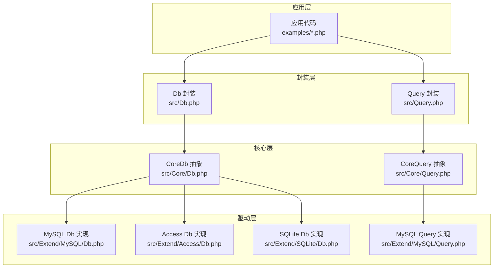
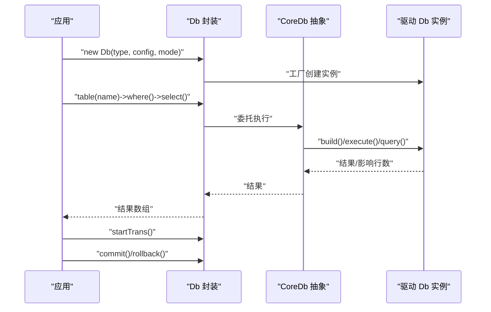
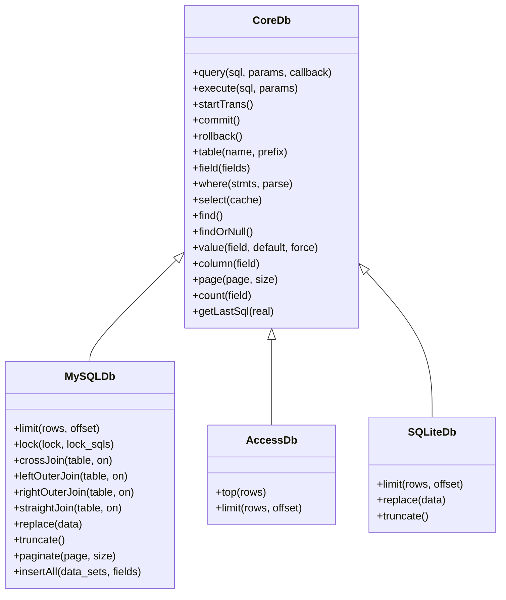
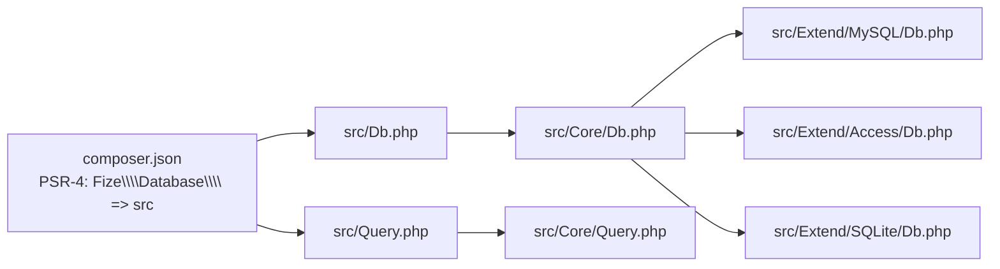

# 使用示例

<cite>
**本文引用的文件**   
- [composer.json](file://composer.json)
- [src/Db.php](file://src/Db.php)
- [src/Query.php](file://src/Query.php)
- [src/Core/Db.php](file://src/Core/Db.php)
- [src/Core/Query.php](file://src/Core/Query.php)
- [src/Extend/MySQL/Db.php](file://src/Extend/MySQL/Db.php)
- [src/Extend/MySQL/Query.php](file://src/Extend/MySQL/Query.php)
- [src/Extend/Access/Db.php](file://src/Extend/Access/Db.php)
- [src/Extend/Access/Query.php](file://src/Extend/Access/Query.php)
- [src/Extend/SQLite/Db.php](file://src/Extend/SQLite/Db.php)
- [examples/db_connect.php](file://examples/db_connect.php)
- [examples/db_insert.php](file://examples/db_insert.php)
- [examples/db_select.php](file://examples/db_select.php)
- [examples/db_update.php](file://examples/db_update.php)
- [examples/db_delete.php](file://examples/db_delete.php)
- [examples/db_paginate.php](file://examples/db_paginate.php)
</cite>

## 目录
1. [简介](#简介)
2. [项目结构](#项目结构)
3. [核心组件](#核心组件)
4. [架构总览](#架构总览)
5. [详细组件与示例](#详细组件与示例)
6. [依赖关系分析](#依赖关系分析)
7. [性能考量](#性能考量)
8. [故障排查指南](#故障排查指南)
9. [结论](#结论)
10. [附录](#附录)

## 简介
本文件面向希望系统掌握 FizeDatabase 的开发者，提供从基础 CRUD 到复杂查询、事务处理与性能优化的完整使用示例集合，并对不同数据库类型（MySQL、Access、SQLite）进行对比说明，帮助你快速完成用户管理、商品查询、订单处理等常见业务场景。

## 项目结构
- 核心入口与封装
  - 顶层封装类：Db、Query，负责对外提供静态便捷 API 与查询器构造。
  - 核心抽象类：Core/Db、Core/Query，定义通用 SQL 组装、条件解析、事务与分页等能力。
- 驱动扩展
  - 通过 Extend/<数据库>/Db、Extend/<数据库>/Query 提供具体数据库方言实现。
  - 示例中涉及 MySQL、Access、SQLite 的差异点。
- 示例
  - examples 下提供连接、增删改查、分页等示例脚本。

图表来源
- [src/Db.php:1-141](file://src/Db.php#L1-L141)
- [src/Query.php:1-130](file://src/Query.php#L1-L130)
- [src/Core/Db.php:1-800](file://src/Core/Db.php#L1-L800)
- [src/Core/Query.php:1-621](file://src/Core/Query.php#L1-L621)
- [src/Extend/MySQL/Db.php:1-246](file://src/Extend/MySQL/Db.php#L1-L246)
- [src/Extend/MySQL/Query.php:1-91](file://src/Extend/MySQL/Query.php#L1-L91)
- [src/Extend/Access/Db.php:1-73](file://src/Extend/Access/Db.php#L1-L73)
- [src/Extend/SQLite/Db.php:1-69](file://src/Extend/SQLite/Db.php#L1-L69)

章节来源
- [composer.json:1-47](file://composer.json#L1-L47)
- [src/Db.php:1-141](file://src/Db.php#L1-L141)
- [src/Query.php:1-130](file://src/Query.php#L1-L130)

## 核心组件
- Db 封装
  - 提供静态连接、默认连接、事务控制、表级操作与 SQL 日志查看。
  - 通过工厂模式按数据库类型加载对应驱动。
- Query 封装
  - 提供链式条件构造、数组条件解析、AND/OR/XOR 组合等。
- CoreDb/Query
  - 定义 SQL 组装骨架、WHERE/HAVING/JOIN/GROUP/ORDER/UNION、分页、缓存、遍历等。
- 驱动差异
  - MySQL：支持 REPLACE、TRUNCATE、LIMIT、LOCK、分页计算等。
  - Access：使用 TOP/模拟 LIMIT、值转义策略不同。
  - SQLite：支持 REPLACE、TRUNCATE、LIMIT。

章节来源
- [src/Db.php:26-140](file://src/Db.php#L26-L140)
- [src/Query.php:24-129](file://src/Query.php#L24-L129)
- [src/Core/Db.php:104-800](file://src/Core/Db.php#L104-L800)
- [src/Core/Query.php:38-621](file://src/Core/Query.php#L38-L621)
- [src/Extend/MySQL/Db.php:36-246](file://src/Extend/MySQL/Db.php#L36-L246)
- [src/Extend/Access/Db.php:22-73](file://src/Extend/Access/Db.php#L22-L73)
- [src/Extend/SQLite/Db.php:27-69](file://src/Extend/SQLite/Db.php#L27-L69)

## 架构总览
下面的时序图展示了典型“连接—查询—取 SQL”的流程，以及事务控制的嵌套机制。

图表来源
- [src/Db.php:32-114](file://src/Db.php#L32-L114)
- [src/Core/Db.php:583-711](file://src/Core/Db.php#L583-L711)

## 详细组件与示例

### 基础连接与查询
- 场景
  - 快速建立默认连接与新连接；基于表、条件、分页进行查询。
- 关键点
  - 默认连接与新连接可并存；表前缀、字段别名、LIMIT/分页均可链式设置。
- 示例路径
  - [examples/db_connect.php:1-39](file://examples/db_connect.php#L1-L39)
  - [examples/db_select.php:1-22](file://examples/db_select.php#L1-L22)
- 预期输出
  - 查询结果数组；可通过 getLastSql(true) 输出最终 SQL。

章节来源
- [examples/db_connect.php:6-39](file://examples/db_connect.php#L6-L39)
- [examples/db_select.php:6-22](file://examples/db_select.php#L6-L22)
- [src/Db.php:124-139](file://src/Db.php#L124-L139)

### 插入与自增
- 场景
  - 插入单条记录并获取自增 ID；查看最终 SQL。
- 关键点
  - insertGetId 返回自增 ID 或序列号；getLastSql(true) 输出真实 SQL。
- 示例路径
  - [examples/db_insert.php:1-29](file://examples/db_insert.php#L1-L29)
- 预期输出
  - 受影响行数（1）；自增 ID；最终 SQL。

章节来源
- [examples/db_insert.php:6-29](file://examples/db_insert.php#L6-L29)
- [src/Core/Db.php:644-660](file://src/Core/Db.php#L644-L660)

### 更新与原值写入
- 场景
  - 更新字段值，或使用原样 SQL 片段（如表达式）。
- 关键点
  - 原值写入通过数组包装传入；支持表达式直接拼接。
- 示例路径
  - [examples/db_update.php:1-22](file://examples/db_update.php#L1-L22)
- 预期输出
  - 受影响行数；最终 SQL（含原样表达式）。

章节来源
- [examples/db_update.php:6-22](file://examples/db_update.php#L6-L22)
- [src/Core/Db.php:528-543](file://src/Core/Db.php#L528-L543)

### 删除与条件
- 场景
  - 按条件删除记录并查看最终 SQL。
- 示例路径
  - [examples/db_delete.php:1-18](file://examples/db_delete.php#L1-L18)
- 预期输出
  - 受影响行数；最终 SQL。

章节来源
- [examples/db_delete.php:6-18](file://examples/db_delete.php#L6-L18)
- [src/Core/Db.php:677-682](file://src/Core/Db.php#L677-L682)

### 复杂查询与分页
- 场景
  - 多字段查询、条件数组、分页；使用 paginate 获取总数、页数与记录。
- 示例路径
  - [examples/db_paginate.php:1-22](file://examples/db_paginate.php#L1-L22)
- 预期输出
  - 总记录数、分页记录、总页数；最终 SQL。

章节来源
- [examples/db_paginate.php:15-22](file://examples/db_paginate.php#L15-L22)
- [src/Extend/MySQL/Db.php:187-203](file://src/Extend/MySQL/Db.php#L187-L203)

### 事务处理（嵌套事务）
- 场景
  - 在业务中嵌套开启事务，确保一致性；支持回滚与提交。
- 关键点
  - startTrans/commit/rollback 支持嵌套计数，仅在最外层开启/提交/回滚。
- 示例路径
  - [src/Db.php:84-114](file://src/Db.php#L84-L114)
- 预期输出
  - 嵌套层级正确管理；最终提交或回滚。

章节来源
- [src/Db.php:84-114](file://src/Db.php#L84-L114)

### 不同数据库类型的对比与选择
- MySQL
  - 支持 REPLACE、TRUNCATE、LIMIT、LOCK、分页计算（SQL_CALC_FOUND_ROWS/FOUND_ROWS）。
  - 查询器支持 REGEXP/RLIKE/XOR 组合。
- Access
  - 使用 TOP 与 offset/size 模拟分页；值转义策略不同。
- SQLite
  - 支持 REPLACE、TRUNCATE、LIMIT；与 MySQL 差异较小。

图表来源
- [src/Core/Db.php:104-800](file://src/Core/Db.php#L104-L800)
- [src/Extend/MySQL/Db.php:36-246](file://src/Extend/MySQL/Db.php#L36-L246)
- [src/Extend/Access/Db.php:54-73](file://src/Extend/Access/Db.php#L54-L73)
- [src/Extend/SQLite/Db.php:27-69](file://src/Extend/SQLite/Db.php#L27-L69)

章节来源
- [src/Extend/MySQL/Db.php:36-246](file://src/Extend/MySQL/Db.php#L36-L246)
- [src/Extend/MySQL/Query.php:21-90](file://src/Extend/MySQL/Query.php#L21-L90)
- [src/Extend/Access/Db.php:22-73](file://src/Extend/Access/Db.php#L22-L73)
- [src/Extend/SQLite/Db.php:27-69](file://src/Extend/SQLite/Db.php#L27-L69)

### 查询器与复杂条件
- 场景
  - 使用数组条件、表达式、EXISTS/NOT EXISTS、IN/BETWEEN/LIKE 等。
- 关键点
  - analyze 支持多种简写与组合逻辑；qMerge/qAnd/qOr 组合多个条件。
- 示例路径
  - [src/Query.php:70-129](file://src/Query.php#L70-L129)
  - [src/Core/Query.php:521-568](file://src/Core/Query.php#L521-L568)
- 预期输出
  - 组合后的 SQL 片段与绑定参数数组。

章节来源
- [src/Query.php:70-129](file://src/Query.php#L70-L129)
- [src/Core/Query.php:521-568](file://src/Core/Query.php#L521-L568)

### 性能优化实践
- 使用 select(false) 关闭缓存，避免重复查询命中缓存导致的内存占用。
- 使用 fetch(func) 遍历回调，减少中间数组转换开销。
- 使用 field 指定必要字段，避免 SELECT *。
- 使用 limit/page 控制返回规模。
- 使用 getLastSql(true) 审核最终 SQL，定位潜在性能问题。

章节来源
- [src/Core/Db.php:699-711](file://src/Core/Db.php#L699-L711)
- [src/Core/Db.php:668-672](file://src/Core/Db.php#L668-L672)
- [src/Core/Db.php:228-244](file://src/Core/Db.php#L228-L244)
- [src/Core/Db.php:784-789](file://src/Core/Db.php#L784-L789)

## 依赖关系分析
- Composer 自动加载
  - PSR-4 映射 Fize\Database\* → src/。
- 运行时依赖
  - 需要 PHP >= 7.1；建议 PHP >= 7.2。
  - 各数据库扩展需安装对应 PHP 扩展（PDO/ODBC/MySQLi/SQLite3/SQLSRV/Oci8 等）。
- 示例依赖
  - examples 通过 vendor/autoload.php 引导加载。

图表来源
- [composer.json:11-18](file://composer.json#L11-L18)
- [src/Db.php:5-6](file://src/Db.php#L5-L6)
- [src/Query.php:5-6](file://src/Query.php#L5-L6)

章节来源
- [composer.json:11-47](file://composer.json#L11-L47)

## 性能考量
- 查询缓存
  - select() 默认缓存查询结果，适合重复查询同一 SQL 的场景；若需要关闭缓存，使用 select(false)。
- 结果遍历
  - fetch(callback) 逐条回调，避免一次性构建大数组，降低内存峰值。
- 字段裁剪
  - 明确指定 field，避免 SELECT *。
- 分页策略
  - MySQL 支持 SQL_CALC_FOUND_ROWS/FOUND_ROWS 的完整分页；Access/SQLite 使用 LIMIT/OFFSET。
- SQL 审核
  - 使用 getLastSql(true) 输出最终 SQL，结合 EXPLAIN 分析执行计划。

章节来源
- [src/Core/Db.php:699-711](file://src/Core/Db.php#L699-L711)
- [src/Core/Db.php:668-672](file://src/Core/Db.php#L668-L672)
- [src/Core/Db.php:228-244](file://src/Core/Db.php#L228-L244)
- [src/Extend/MySQL/Db.php:187-203](file://src/Extend/MySQL/Db.php#L187-L203)

## 故障排查指南
- SQL 注入与日志
  - getLastSql(true) 输出最终 SQL，便于审计与调试；注意该 SQL 存在注入风险，仅用于日志输出。
- 记录不存在
  - find() 未找到记录会抛出异常；findOrNull() 返回 null，适合容错处理。
- 事务嵌套
  - startTrans/commit/rollback 采用嵌套计数，确保只在最外层生效。
- 值转义差异
  - Access 使用不同的值转义策略，注意字符串包含单引号的处理。
- 事务与分页
  - 在事务中使用分页时，确保分页 SQL 在同一事务上下文中执行。

章节来源
- [src/Core/Db.php:199-206](file://src/Core/Db.php#L199-L206)
- [src/Core/Db.php:733-740](file://src/Core/Db.php#L733-L740)
- [src/Db.php:84-114](file://src/Db.php#L84-L114)
- [src/Extend/Access/Db.php:22-32](file://src/Extend/Access/Db.php#L22-L32)

## 结论
FizeDatabase 提供了统一的数据库访问与查询器抽象，配合多数据库驱动实现，能够覆盖从基础 CRUD 到复杂查询、事务与分页的常见业务需求。通过合理使用查询器、分页与事务控制，并结合性能优化手段，可在不同数据库类型间灵活切换并获得稳定表现。

## 附录
- 常见业务场景建议
  - 用户管理：使用 where 条件、分页、字段裁剪；敏感信息避免 SELECT *。
  - 商品查询：利用 LIKE/IN/BETWEEN 组合；必要时使用原样表达式。
  - 订单处理：使用事务包裹多步写入；嵌套事务时注意层级管理。
- 数据库选型建议
  - MySQL：功能丰富、生态完善，适合大多数 Web 场景。
  - Access：轻量本地存储或历史系统集成。
  - SQLite：移动端或小型应用、无需独立服务端。