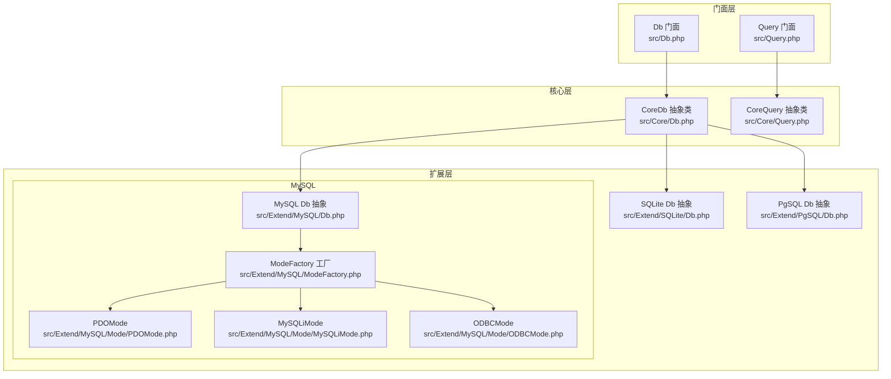
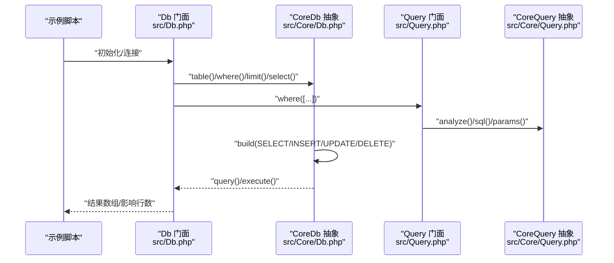
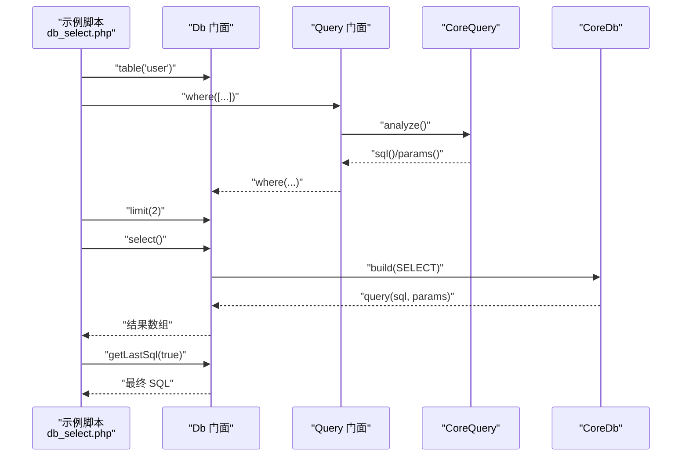
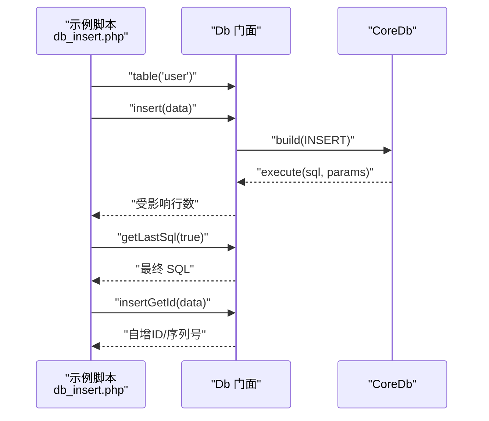
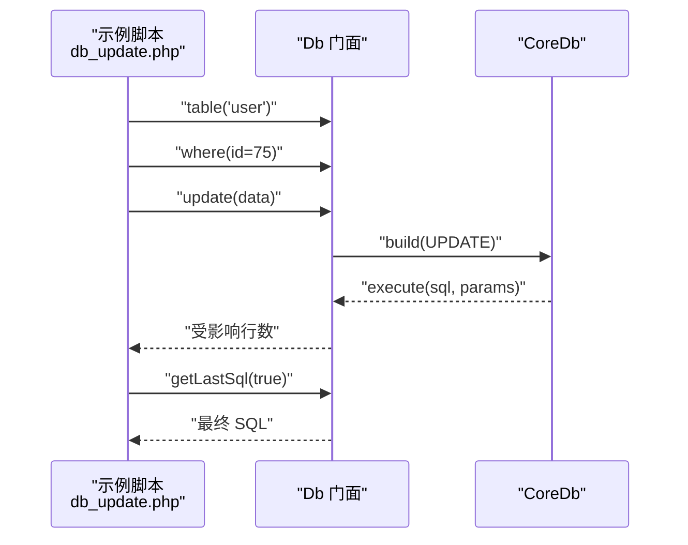
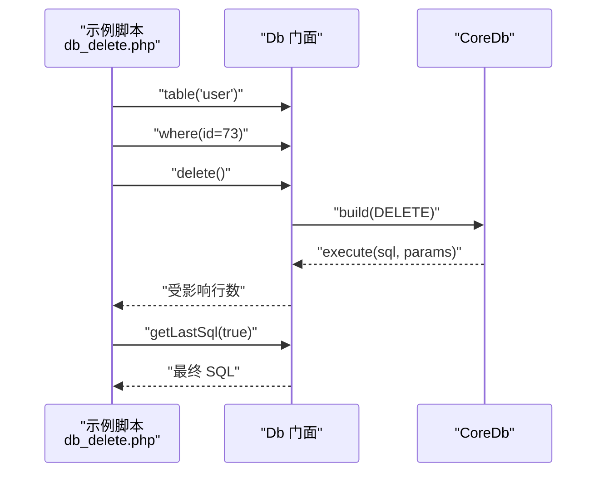
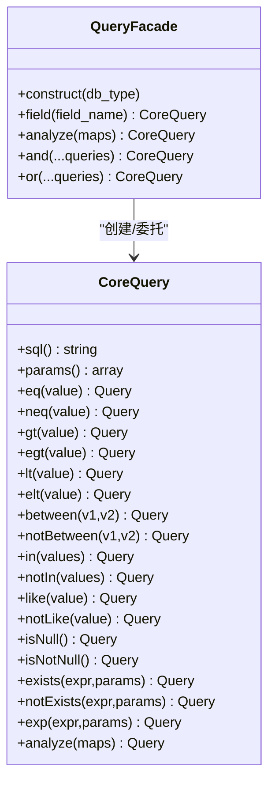
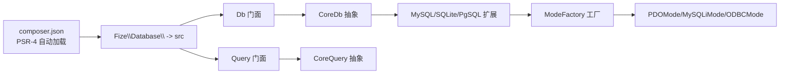

# 基础CRUD操作示例

<cite>
**本文引用的文件**
- [examples/db_connect.php](file://examples/db_connect.php)
- [examples/db_select.php](file://examples/db_select.php)
- [examples/db_insert.php](file://examples/db_insert.php)
- [examples/db_update.php](file://examples/db_update.php)
- [examples/db_delete.php](file://examples/db_delete.php)
- [src/Db.php](file://src/Db.php)
- [src/Query.php](file://src/Query.php)
- [src/Core/Db.php](file://src/Core/Db.php)
- [src/Core/Query.php](file://src/Core/Query.php)
- [src/Extend/MySQL/Db.php](file://src/Extend/MySQL/Db.php)
- [src/Extend/MySQL/ModeFactory.php](file://src/Extend/MySQL/ModeFactory.php)
- [src/Extend/MySQL/Mode/PDOMode.php](file://src/Extend/MySQL/Mode/PDOMode.php)
- [src/Extend/MySQL/Mode/MySQLiMode.php](file://src/Extend/MySQL/Mode/MySQLiMode.php)
- [src/Extend/MySQL/Mode/ODBCMode.php](file://src/Extend/MySQL/Mode/ODBCMode.php)
- [src/Extend/SQLite/Db.php](file://src/Extend/SQLite/Db.php)
- [src/Extend/PgSQL/Db.php](file://src/Extend/PgSQL/Db.php)
- [composer.json](file://composer.json)
</cite>

## 目录
1. [简介](#简介)
2. [项目结构](#项目结构)
3. [核心组件](#核心组件)
4. [架构总览](#架构总览)
5. [详细组件分析](#详细组件分析)
6. [依赖关系分析](#依赖关系分析)
7. [性能考量](#性能考量)
8. [故障排查指南](#故障排查指南)
9. [结论](#结论)
10. [附录](#附录)

## 简介
本文件面向初学者与进阶开发者，系统讲解 FizeDatabase 的基础 CRUD（增删改查）操作，结合仓库中的示例脚本与核心源码，给出数据库连接配置、SELECT 查询、INSERT 插入、UPDATE 更新、DELETE 删除的完整实践路径。内容覆盖：
- 多数据库类型与多种连接模式的配置差异
- 链式查询构建器的使用方法
- 错误处理与调试技巧
- 预期输出与常见问题定位

## 项目结构
FizeDatabase 采用“门面 + 抽象 + 扩展”的分层设计：
- 门面层：对外暴露静态 API，简化使用
- 核心层：抽象数据库能力与查询构建器
- 扩展层：按数据库类型细分，按连接模式细分具体实现
- 示例层：演示典型场景

图表来源
- [src/Db.php:1-141](file://src/Db.php#L1-L141)
- [src/Query.php:1-130](file://src/Query.php#L1-L130)
- [src/Core/Db.php:1-800](file://src/Core/Db.php#L1-L800)
- [src/Core/Query.php:1-621](file://src/Core/Query.php#L1-L621)
- [src/Extend/MySQL/Db.php:1-246](file://src/Extend/MySQL/Db.php#L1-L246)
- [src/Extend/MySQL/ModeFactory.php:1-82](file://src/Extend/MySQL/ModeFactory.php#L1-L82)
- [src/Extend/MySQL/Mode/PDOMode.php:1-53](file://src/Extend/MySQL/Mode/PDOMode.php#L1-L53)
- [src/Extend/MySQL/Mode/MySQLiMode.php:1-251](file://src/Extend/MySQL/Mode/MySQLiMode.php#L1-L251)
- [src/Extend/MySQL/Mode/ODBCMode.php:1-61](file://src/Extend/MySQL/Mode/ODBCMode.php#L1-L61)
- [src/Extend/SQLite/Db.php:1-69](file://src/Extend/SQLite/Db.php#L1-L69)
- [src/Extend/PgSQL/Db.php:1-37](file://src/Extend/PgSQL/Db.php#L1-L37)

章节来源
- [composer.json:1-47](file://composer.json#L1-L47)

## 核心组件
- 门面 Db：提供静态入口，封装连接、表选择、查询、执行、事务、SQL 日志等常用能力
- 门面 Query：提供链式条件构建器，支持数组条件解析、AND/OR 组合、表达式、范围、存在性等
- 核心 CoreDb：抽象 SQL 组装、参数绑定、CRUD 操作、缓存、分页等
- 核心 CoreQuery：抽象条件解析与 SQL 片段拼装
- 扩展 MySQL Db：针对 MySQL 的 LIMIT/LOCK/REPLACE/TRUNCATE 等增强
- 扩展 ModeFactory：根据数据库类型与模式创建具体驱动实例
- 具体模式：PDO、MySQLi、ODBC 等

章节来源
- [src/Db.php:1-141](file://src/Db.php#L1-L141)
- [src/Query.php:1-130](file://src/Query.php#L1-L130)
- [src/Core/Db.php:1-800](file://src/Core/Db.php#L1-L800)
- [src/Core/Query.php:1-621](file://src/Core/Query.php#L1-L621)
- [src/Extend/MySQL/Db.php:1-246](file://src/Extend/MySQL/Db.php#L1-L246)

## 架构总览
下面的时序图展示了从示例脚本到核心实现的关键调用链。

图表来源
- [src/Db.php:114-141](file://src/Db.php#L114-L141)
- [src/Core/Db.php:583-711](file://src/Core/Db.php#L583-L711)
- [src/Query.php:69-129](file://src/Query.php#L69-L129)
- [src/Core/Query.php:521-568](file://src/Core/Query.php#L521-L568)

## 详细组件分析

### 数据库连接配置与差异
- 默认连接与新连接
  - 默认连接：通过构造函数设置全局默认连接，后续可通过静态方法直接使用
  - 新连接：通过 connect 获取独立连接实例，适合多库或多表前缀场景
- 连接配置项
  - 通用项：host、user、password、dbname、prefix（表前缀）
  - MySQL 专属：port、charset、opts、real、socket、ssl_set、flags、driver
- 连接模式差异
  - PDO：推荐，跨平台，支持丰富的 DSN 选项
  - MySQLi：原生命令，支持多语句查询、SSL 设置等
  - ODBC：通过驱动名与 DSN 组装，返回类型为字符串（需注意）

示例参考
- 默认连接与链式查询：[examples/db_connect.php:16-21](file://examples/db_connect.php#L16-L21)
- 新连接与表前缀：[examples/db_connect.php:24-38](file://examples/db_connect.php#L24-L38)
- MySQL 模式工厂默认配置：[src/Extend/MySQL/ModeFactory.php:24-34](file://src/Extend/MySQL/ModeFactory.php#L24-L34)
- PDO 模式 DSN 组装：[src/Extend/MySQL/Mode/PDOMode.php:31-41](file://src/Extend/MySQL/Mode/PDOMode.php#L31-L41)
- MySQLi 模式 SSL/选项：[src/Extend/MySQL/Mode/MySQLiMode.php:42-65](file://src/Extend/MySQL/Mode/MySQLiMode.php#L42-L65)
- ODBC 模式 DSN 组装：[src/Extend/MySQL/Mode/ODBCMode.php:31-38](file://src/Extend/MySQL/Mode/ODBCMode.php#L31-L38)

章节来源
- [examples/db_connect.php:1-39](file://examples/db_connect.php#L1-L39)
- [src/Extend/MySQL/ModeFactory.php:1-82](file://src/Extend/MySQL/ModeFactory.php#L1-L82)
- [src/Extend/MySQL/Mode/PDOMode.php:1-53](file://src/Extend/MySQL/Mode/PDOMode.php#L1-L53)
- [src/Extend/MySQL/Mode/MySQLiMode.php:1-251](file://src/Extend/MySQL/Mode/MySQLiMode.php#L1-L251)
- [src/Extend/MySQL/Mode/ODBCMode.php:1-61](file://src/Extend/MySQL/Mode/ODBCMode.php#L1-L61)

### SELECT 查询示例
- 步骤
  1) 初始化连接
  2) 选择表：table('user')
  3) 设置条件：where([...]) 支持 LIKE、IN、BETWEEN 等
  4) 限制结果：limit(n)
  5) 执行查询：select()
  6) 查看 SQL：getDb::getLastSql() / getLastSql(true)
- 参数配置
  - where 支持数组条件、Query 对象、原生 SQL 预处理
  - 字段、排序、分组、联接、UNION 等均可链式叠加
- 预期输出
  - 返回二维数组；若无记录返回空数组
  - 最后 SQL 可用于日志与调试

图表来源
- [examples/db_select.php:15-21](file://examples/db_select.php#L15-L21)
- [src/Query.php:69-77](file://src/Query.php#L69-L77)
- [src/Core/Query.php:521-568](file://src/Core/Query.php#L521-L568)
- [src/Core/Db.php:583-711](file://src/Core/Db.php#L583-L711)

章节来源
- [examples/db_select.php:1-22](file://examples/db_select.php#L1-L22)
- [src/Query.php:1-130](file://src/Query.php#L1-L130)
- [src/Core/Query.php:1-621](file://src/Core/Query.php#L1-L621)
- [src/Core/Db.php:1-800](file://src/Core/Db.php#L1-L800)

### INSERT 插入示例
- 步骤
  1) 初始化连接
  2) 选择表：table('user')
  3) 准备数据：关联数组（支持原样 SQL 表达式写入）
  4) 执行插入：insert($data)
  5) 获取影响行数与最终 SQL
  6) 自增主键：insertGetId($data)
- 参数配置
  - 原样表达式：值为数组时取其第一个元素作为原样 SQL 片段
  - 字段与占位符自动映射，参数按序绑定
- 预期输出
  - insert 返回受影响行数
  - insertGetId 返回自增 ID 或序列号

图表来源
- [examples/db_insert.php:16-28](file://examples/db_insert.php#L16-L28)
- [src/Core/Db.php:583-660](file://src/Core/Db.php#L583-L660)

章节来源
- [examples/db_insert.php:1-29](file://examples/db_insert.php#L1-L29)
- [src/Core/Db.php:1-800](file://src/Core/Db.php#L1-L800)

### UPDATE 更新示例
- 步骤
  1) 初始化连接
  2) 选择表：table('user')
  3) 设置条件：where([...])
  4) 准备更新数据：关联数组（支持原样表达式）
  5) 执行更新：update($data)
  6) 查看 SQL：getLastSql(true)
- 参数配置
  - 原样表达式：值为数组时原样写入（如 sex = sex + 110）
  - 支持链式 field/order/group/having/join 等
- 预期输出
  - 返回受影响行数

图表来源
- [examples/db_update.php:15-21](file://examples/db_update.php#L15-L21)
- [src/Core/Db.php:583-693](file://src/Core/Db.php#L583-L693)

章节来源
- [examples/db_update.php:1-22](file://examples/db_update.php#L1-L22)
- [src/Core/Db.php:1-800](file://src/Core/Db.php#L1-L800)

### DELETE 删除示例
- 步骤
  1) 初始化连接
  2) 选择表：table('user')
  3) 设置条件：where([...])
  4) 执行删除：delete()
  5) 查看 SQL：getLastSql(true)
- 参数配置
  - 仅支持 WHERE 条件，不支持 HAVING
- 预期输出
  - 返回受影响行数

图表来源
- [examples/db_delete.php:15-17](file://examples/db_delete.php#L15-L17)
- [src/Core/Db.php:583-682](file://src/Core/Db.php#L583-L682)

章节来源
- [examples/db_delete.php:1-18](file://examples/db_delete.php#L1-L18)
- [src/Core/Db.php:1-800](file://src/Core/Db.php#L1-L800)

### 链式查询构建器使用
- Query 门面
  - analyze：解析数组条件，生成 SQL 片段与参数
  - and/or/qMerge：多条件 AND/OR 组合
  - field/object：设置操作对象（字段）
- CoreQuery 支持
  - 比较运算：eq/neq/gt/egt/lt/elt
  - 范围：between/notBetween
  - 存在性：in/notIn/like/notLike/isNull/isNotNull
  - 表达式：exp
  - 子查询：exists/notExists
- 使用建议
  - 复杂条件优先使用 Query 对象或原生 SQL
  - 数组条件简洁直观，适合简单场景

图表来源
- [src/Query.php:24-129](file://src/Query.php#L24-L129)
- [src/Core/Query.php:13-621](file://src/Core/Query.php#L13-L621)

章节来源
- [src/Query.php:1-130](file://src/Query.php#L1-L130)
- [src/Core/Query.php:1-621](file://src/Core/Query.php#L1-L621)

## 依赖关系分析
- Composer 自动加载
  - PSR-4 映射：Fize\Database\ -> src
- 扩展建议
  - 根据目标数据库启用相应扩展（PDO/MySQLi/ODBC/PG/SQLSRV/SQLite 等）
- 依赖耦合
  - 门面层仅依赖核心接口，扩展层通过工厂与模式类解耦
  - CoreDb 与 CoreQuery 通过 trait 注入通用能力

图表来源
- [composer.json:11-15](file://composer.json#L11-L15)
- [src/Db.php:37-39](file://src/Db.php#L37-L39)
- [src/Query.php:26](file://src/Query.php#L26)

章节来源
- [composer.json:1-47](file://composer.json#L1-L47)
- [src/Db.php:1-141](file://src/Db.php#L1-L141)
- [src/Query.php:1-130](file://src/Query.php#L1-L130)

## 性能考量
- 查询缓存
  - select 支持缓存，相同 SQL 的结果会被缓存复用
- 遍历回调
  - fetch 接受回调，避免中间数组转换，适合大数据量遍历
- 分页
  - MySQL 提供 SQL_CALC_FOUND_ROWS + FOUND_ROWS 的完整分页方案
- 参数绑定
  - 严格使用占位符与参数绑定，避免字符串拼接带来的性能与安全问题

章节来源
- [src/Core/Db.php:668-711](file://src/Core/Db.php#L668-L711)
- [src/Extend/MySQL/Db.php:187-203](file://src/Extend/MySQL/Db.php#L187-L203)

## 故障排查指南
- 常见异常
  - 非法 SQL 动作：build 仅支持 DELETE/INSERT/REPLACE/SELECT/UPDATE
  - 记录不存在：find 会在无记录时抛出异常
- 调试技巧
  - 使用 getLastSql(false/true) 输出预处理 SQL 或最终 SQL
  - 在 where 中使用原生 SQL 时确保参数绑定正确
  - MySQLi 模式下多语句查询需注意返回结构与异常抛出
- 错误定位
  - INSERT/UPDATE/DELETE：核对 where/having 绑定参数顺序
  - LIMIT/分页：确认扩展 Db 的 limit 实现与数据库方言
  - ODBC：注意返回类型均为字符串，必要时做类型转换

章节来源
- [src/Core/Db.php:608-610](file://src/Core/Db.php#L608-L610)
- [src/Core/Db.php:733-740](file://src/Core/Db.php#L733-L740)
- [src/Extend/MySQL/Mode/MySQLiMode.php:85-106](file://src/Extend/MySQL/Mode/MySQLiMode.php#L85-L106)

## 结论
通过本示例文档，你可以：
- 快速完成多数据库、多模式的连接配置
- 使用链式查询构建器高效表达复杂条件
- 完成基础 CRUD 操作，并掌握调试与排错方法
- 在实际项目中以最小成本集成与扩展

## 附录
- 示例脚本清单
  - 连接与默认连接：[examples/db_connect.php](file://examples/db_connect.php)
  - 查询示例：[examples/db_select.php](file://examples/db_select.php)
  - 插入示例：[examples/db_insert.php](file://examples/db_insert.php)
  - 更新示例：[examples/db_update.php](file://examples/db_update.php)
  - 删除示例：[examples/db_delete.php](file://examples/db_delete.php)
- 关键源码路径
  - 门面与查询：[src/Db.php](file://src/Db.php)、[src/Query.php](file://src/Query.php)
  - 核心抽象：[src/Core/Db.php](file://src/Core/Db.php)、[src/Core/Query.php](file://src/Core/Query.php)
  - MySQL 扩展与模式：[src/Extend/MySQL/Db.php](file://src/Extend/MySQL/Db.php)、[src/Extend/MySQL/ModeFactory.php](file://src/Extend/MySQL/ModeFactory.php)、[src/Extend/MySQL/Mode/PDOMode.php](file://src/Extend/MySQL/Mode/PDOMode.php)、[src/Extend/MySQL/Mode/MySQLiMode.php](file://src/Extend/MySQL/Mode/MySQLiMode.php)、[src/Extend/MySQL/Mode/ODBCMode.php](file://src/Extend/MySQL/Mode/ODBCMode.php)
  - SQLite/PgSQL 扩展：[src/Extend/SQLite/Db.php](file://src/Extend/SQLite/Db.php)、[src/Extend/PgSQL/Db.php](file://src/Extend/PgSQL/Db.php)