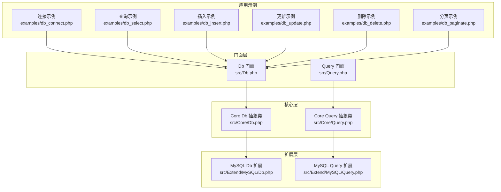
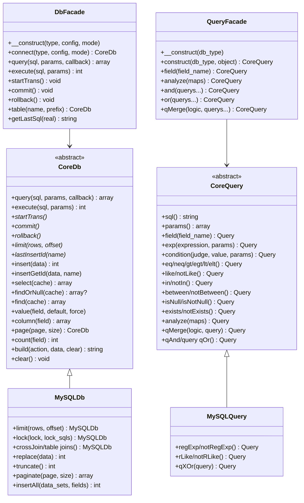
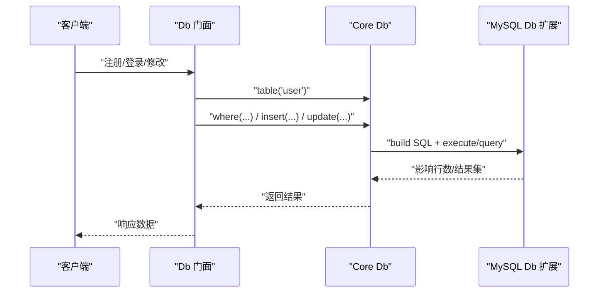
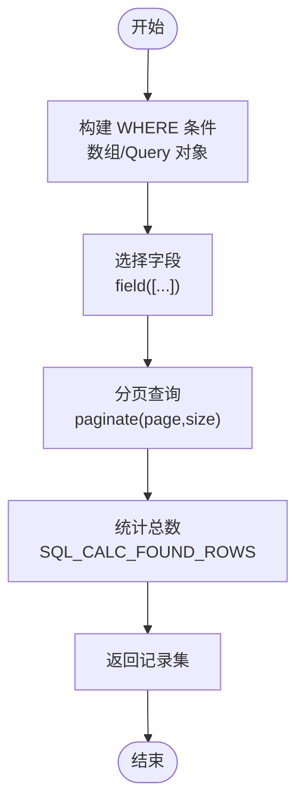
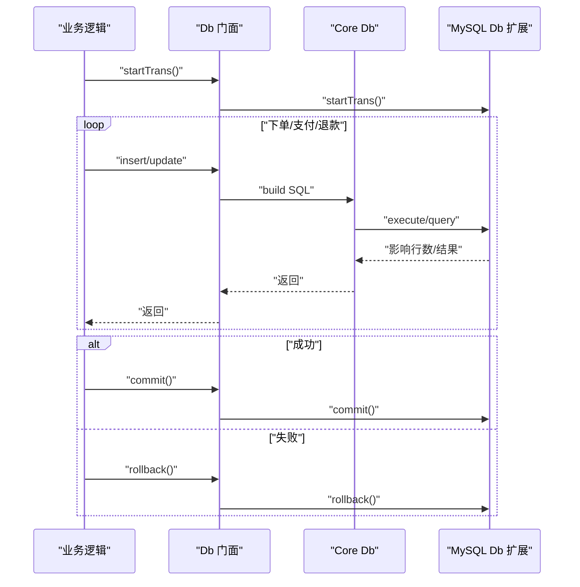
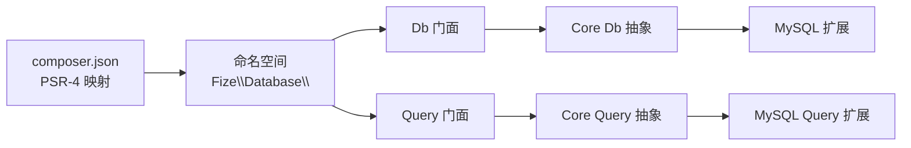

# 实际业务场景示例

<cite>
**本文引用的文件**
- [composer.json](file://composer.json)
- [src/Db.php](file://src/Db.php)
- [src/Query.php](file://src/Query.php)
- [src/Core/Db.php](file://src/Core/Db.php)
- [src/Core/Query.php](file://src/Core/Query.php)
- [src/Extend/MySQL/Db.php](file://src/Extend/MySQL/Db.php)
- [src/Extend/MySQL/Query.php](file://src/Extend/MySQL/Query.php)
- [examples/db_connect.php](file://examples/db_connect.php)
- [examples/db_select.php](file://examples/db_select.php)
- [examples/db_insert.php](file://examples/db_insert.php)
- [examples/db_update.php](file://examples/db_update.php)
- [examples/db_delete.php](file://examples/db_delete.php)
- [examples/db_paginate.php](file://examples/db_paginate.php)
</cite>

## 目录
1. [简介](#简介)
2. [项目结构](#项目结构)
3. [核心组件](#核心组件)
4. [架构总览](#架构总览)
5. [详细组件分析](#详细组件分析)
6. [依赖分析](#依赖分析)
7. [性能考虑](#性能考虑)
8. [故障排查指南](#故障排查指南)
9. [结论](#结论)
10. [附录](#附录)

## 简介
本文件面向真实业务场景，围绕用户管理系统、商品信息查询、订单处理流程、内容管理等常见应用，提供基于 FizeDatabase 的完整落地方案。内容涵盖需求分析、数据库设计思路、代码实现与测试验证，帮助开发者在实际项目中高效应用 FizeDatabase 的连接、查询、更新、删除、分页、事务等能力。

## 项目结构
FizeDatabase 采用分层与扩展架构：
- 核心层（Core）：抽象数据库与查询器基类，定义通用行为与构建 SQL 的流程。
- 扩展层（Extend）：针对不同数据库类型（如 MySQL、PgSQL、SQLSRV、Oracle、Access、SQLite）提供具体实现与特性增强。
- 门面层（Db、Query）：对外提供静态便捷方法与链式调用接口，屏蔽底层差异。
- 示例层（examples）：展示连接、查询、插入、更新、删除、分页等典型用法。
- 自动加载与依赖（composer.json）：PSR-4 命名空间映射与扩展 PHP 扩展建议。

图表来源
- [src/Db.php:1-141](file://src/Db.php#L1-L141)
- [src/Query.php:1-130](file://src/Query.php#L1-L130)
- [src/Core/Db.php:1-800](file://src/Core/Db.php#L1-L800)
- [src/Core/Query.php:1-621](file://src/Core/Query.php#L1-L621)
- [src/Extend/MySQL/Db.php:1-246](file://src/Extend/MySQL/Db.php#L1-L246)
- [src/Extend/MySQL/Query.php:1-91](file://src/Extend/MySQL/Query.php#L1-L91)
- [examples/db_connect.php:1-39](file://examples/db_connect.php#L1-L39)
- [examples/db_select.php:1-22](file://examples/db_select.php#L1-L22)
- [examples/db_insert.php:1-29](file://examples/db_insert.php#L1-L29)
- [examples/db_update.php:1-22](file://examples/db_update.php#L1-L22)
- [examples/db_delete.php:1-18](file://examples/db_delete.php#L1-L18)
- [examples/db_paginate.php:1-22](file://examples/db_paginate.php#L1-L22)

章节来源
- [composer.json:1-47](file://composer.json#L1-L47)
- [src/Db.php:1-141](file://src/Db.php#L1-L141)
- [src/Query.php:1-130](file://src/Query.php#L1-L130)
- [src/Core/Db.php:1-800](file://src/Core/Db.php#L1-L800)
- [src/Core/Query.php:1-621](file://src/Core/Query.php#L1-L621)
- [src/Extend/MySQL/Db.php:1-246](file://src/Extend/MySQL/Db.php#L1-L246)
- [src/Extend/MySQL/Query.php:1-91](file://src/Extend/MySQL/Query.php#L1-L91)
- [examples/db_connect.php:1-39](file://examples/db_connect.php#L1-L39)
- [examples/db_select.php:1-22](file://examples/db_select.php#L1-L22)
- [examples/db_insert.php:1-29](file://examples/db_insert.php#L1-L29)
- [examples/db_update.php:1-22](file://examples/db_update.php#L1-L22)
- [examples/db_delete.php:1-18](file://examples/db_delete.php#L1-L18)
- [examples/db_paginate.php:1-22](file://examples/db_paginate.php#L1-L22)

## 核心组件
- 门面 Db：提供静态入口，负责初始化数据库连接、事务控制、表选择与 SQL 日志查看；内部委派给具体驱动的 CoreDb 实例。
- 门面 Query：提供静态入口，构造特定数据库类型的 Query 实例，支持条件数组解析、AND/OR/XOR 组合、原生表达式等。
- Core Db：抽象数据库基类，定义字段、WHERE、JOIN、GROUP/HAVING、ORDER/LIMIT/UNION 等构建流程，提供 insert/select/update/delete/find/value 等常用方法，并内置 SQL 预处理与真实 SQL 输出能力。
- Core Query：抽象查询器基类，支持条件表达式、比较运算符、IN/BETWEEN/EXISTS、LIKE/NULL 等，提供 analyze 数组解析与多条件合并。
- MySQL 扩展 Db/Query：在 Core 基础上增加 LIMIT、LOCK、多种 JOIN、REPLACE/TRUNCATE、分页计算、批量插入等特性。

章节来源
- [src/Db.php:1-141](file://src/Db.php#L1-L141)
- [src/Query.php:1-130](file://src/Query.php#L1-L130)
- [src/Core/Db.php:1-800](file://src/Core/Db.php#L1-L800)
- [src/Core/Query.php:1-621](file://src/Core/Query.php#L1-L621)
- [src/Extend/MySQL/Db.php:1-246](file://src/Extend/MySQL/Db.php#L1-L246)
- [src/Extend/MySQL/Query.php:1-91](file://src/Extend/MySQL/Query.php#L1-L91)

## 架构总览
FizeDatabase 通过“门面 + 核心 + 扩展”的分层设计，实现对多数据库的统一抽象与差异化增强。Db/Query 门面负责对外暴露统一 API，Core 层封装通用 SQL 构建与执行，扩展层针对具体数据库提供方言适配与特性增强。

图表来源
- [src/Db.php:1-141](file://src/Db.php#L1-L141)
- [src/Query.php:1-130](file://src/Query.php#L1-L130)
- [src/Core/Db.php:1-800](file://src/Core/Db.php#L1-L800)
- [src/Core/Query.php:1-621](file://src/Core/Query.php#L1-L621)
- [src/Extend/MySQL/Db.php:1-246](file://src/Extend/MySQL/Db.php#L1-L246)
- [src/Extend/MySQL/Query.php:1-91](file://src/Extend/MySQL/Query.php#L1-L91)

## 详细组件分析

### 用户管理系统（用户登录、注册、信息修改）
- 业务需求
  - 用户注册：校验用户名唯一，写入用户基本信息。
  - 用户登录：按用户名查找用户，校验密码（示例中仅演示查询与更新）。
  - 修改资料：根据用户 ID 更新昵称、性别等字段。
- 数据库设计思路
  - 表：user(id, name, sex, add_time)
  - 关键点：使用预处理绑定参数，避免注入；使用链式调用构建 WHERE/UPDATE/SELECT。
- 代码实现方案
  - 注册：使用 Db::table('user')->insert([...]) 写入；可结合 insertGetId 获取自增 ID。
  - 登录：Db::table('user')->where([...])->find() 获取单条记录。
  - 修改：Db::table('user')->where(['id' => ?])->update([...])。
- 测试验证
  - 使用 examples/db_insert.php、db_select.php、db_update.php 验证基本 CRUD 与 SQL 日志输出。
  - 使用事务封装多步操作，确保一致性（见事务章节）。

图表来源
- [src/Db.php:114-127](file://src/Db.php#L114-L127)
- [src/Core/Db.php:644-711](file://src/Core/Db.php#L644-L711)
- [src/Extend/MySQL/Db.php:129-152](file://src/Extend/MySQL/Db.php#L129-L152)

章节来源
- [examples/db_insert.php:1-29](file://examples/db_insert.php#L1-L29)
- [examples/db_select.php:1-22](file://examples/db_select.php#L1-L22)
- [examples/db_update.php:1-22](file://examples/db_update.php#L1-L22)
- [src/Db.php:114-127](file://src/Db.php#L114-L127)
- [src/Core/Db.php:644-711](file://src/Core/Db.php#L644-L711)
- [src/Extend/MySQL/Db.php:129-152](file://src/Extend/MySQL/Db.php#L129-L152)

### 商品信息查询（分类筛选、模糊匹配、分页）
- 业务需求
  - 按分类、品牌、价格区间筛选商品。
  - 支持关键词模糊搜索。
  - 分页展示，统计总数。
- 数据库设计思路
  - 表：product(id, name, category, brand, price, create_time)
  - 关键点：使用 Query::analyze 将数组条件映射为 SQL；使用 LIKE/BETWEEN/IN 组合；使用 paginate 获取总数与分页数据。
- 代码实现方案
  - 构建条件：Db::table('product')->where([...])->field([...])
  - 模糊搜索：Query::field('name')->like('%关键词%')
  - 分页：Db::table('product')->where([...])->field([...])->paginate($page, $size)
- 测试验证
  - 使用 examples/db_paginate.php 验证分页返回的记录数、页码与 SQL。

图表来源
- [src/Extend/MySQL/Db.php:187-203](file://src/Extend/MySQL/Db.php#L187-L203)
- [src/Core/Db.php:696-711](file://src/Core/Db.php#L696-L711)

章节来源
- [examples/db_paginate.php:1-22](file://examples/db_paginate.php#L1-L22)
- [src/Extend/MySQL/Db.php:187-203](file://src/Extend/MySQL/Db.php#L187-L203)
- [src/Core/Db.php:696-711](file://src/Core/Db.php#L696-L711)

### 订单处理流程（下单、支付状态变更、退款）
- 业务需求
  - 下单：写入订单主表与明细表。
  - 支付：更新订单状态与支付时间。
  - 退款：回滚库存与资金流水。
- 数据库设计思路
  - 主表：order(id, user_id, amount, status, pay_time)
  - 明细表：order_item(id, order_id, product_id, quantity)
  - 关键点：使用事务包裹多表写入；使用原生表达式更新字段（如 sex = sex + 110 的示例）。
- 代码实现方案
  - 事务：Db::startTrans() -> 多次 insert/update -> Db::commit()/rollback()
  - 原生表达式：Db::table('user')->where(['id' => ?])->update(['sex' => ['`sex` + ?']])
- 测试验证
  - 使用事务相关测试用例验证提交与回滚行为（参考扩展层测试文件）。

图表来源
- [src/Db.php:84-114](file://src/Db.php#L84-L114)
- [src/Core/Db.php:122-134](file://src/Core/Db.php#L122-L134)
- [src/Extend/MySQL/Db.php:129-152](file://src/Extend/MySQL/Db.php#L129-L152)

章节来源
- [src/Db.php:84-114](file://src/Db.php#L84-L114)
- [src/Core/Db.php:122-134](file://src/Core/Db.php#L122-L134)
- [examples/db_update.php:1-22](file://examples/db_update.php#L1-L22)

### 内容管理（文章发布、标签关联、回收站）
- 业务需求
  - 发布文章：写入文章表与标签中间表。
  - 标签关联：使用 JOIN 查询文章与标签。
  - 回收站：软删除标记 status=0，查询时排除。
- 数据库设计思路
  - 文章表：article(id, title, content, status, create_time)
  - 标签表：tag(id, name)
  - 中间表：article_tag(article_id, tag_id)
  - 关键点：使用 join/leftJoin/rightJoin 组合查询；使用 where(['status' => 1]) 排除回收站。
- 代码实现方案
  - 关联查询：Db::table('article')->leftJoin(['article_tag', 'at'], 'article.id = at.article_id')->leftJoin(['tag', 't'], 'at.tag_id = t.id')
  - 软删除：Db::table('article')->where(['id' => ?])->update(['status' => 0])

章节来源
- [src/Core/Db.php:408-463](file://src/Core/Db.php#L408-L463)
- [src/Core/Db.php:335-359](file://src/Core/Db.php#L335-L359)

## 依赖分析
- 自动加载与命名空间
  - PSR-4 映射 Fize\Database\ → src，便于统一引入 Db/Query 与扩展类。
- 扩展 PHP 扩展
  - 建议安装 PDO/MySQLi/SQLSRV/PgSQL/SQLite/ODBC 等扩展以启用对应驱动模式。
- 门面与核心耦合
  - Db/Query 门面通过扩展工厂创建具体 Core 实例，降低对具体驱动的耦合。
- 查询器与条件数组
  - Core Query 的 analyze 支持多维数组条件，简化复杂查询拼装。

图表来源
- [composer.json:11-18](file://composer.json#L11-L18)
- [src/Db.php:32-40](file://src/Db.php#L32-L40)
- [src/Query.php:24-39](file://src/Query.php#L24-L39)
- [src/Core/Db.php:13](file://src/Core/Db.php#L13)
- [src/Core/Query.php:13](file://src/Core/Query.php#L13)

章节来源
- [composer.json:11-18](file://composer.json#L11-L18)
- [src/Db.php:32-40](file://src/Db.php#L32-L40)
- [src/Query.php:24-39](file://src/Query.php#L24-L39)
- [src/Core/Db.php:13](file://src/Core/Db.php#L13)
- [src/Core/Query.php:13](file://src/Core/Query.php#L13)

## 性能考虑
- 查询缓存
  - Core Db::select 支持缓存，相同 SQL 的结果会被缓存，减少重复查询开销。
- 预处理绑定
  - 所有参数均通过预处理绑定，避免字符串拼接带来的性能与安全问题。
- 分页策略
  - MySQL 扩展提供 SQL_CALC_FOUND_ROWS + FOUND_ROWS 的分页统计方案，减少二次 COUNT 查询成本。
- 原生表达式
  - 在允许的场景使用原生表达式（如字段自增），减少额外查询。

章节来源
- [src/Core/Db.php:700-711](file://src/Core/Db.php#L700-L711)
- [src/Extend/MySQL/Db.php:187-203](file://src/Extend/MySQL/Db.php#L187-L203)

## 故障排查指南
- SQL 注入与日志
  - 使用 Db::getLastSql(true) 输出真实 SQL，定位参数绑定与拼装问题。
- 事务嵌套
  - 注意嵌套事务计数，确保外层提交/回滚正确释放。
- 条件数组解析
  - 使用 Query::analyze 将数组映射为 SQL 片段，检查组合逻辑与字段格式。
- 错误异常
  - Core Db 抛出数据库异常，Query 找不到记录时抛出数据未找到异常，需捕获处理。

章节来源
- [src/Core/Db.php:199-206](file://src/Core/Db.php#L199-L206)
- [src/Db.php:84-114](file://src/Db.php#L84-L114)
- [src/Core/Query.php:521-568](file://src/Core/Query.php#L521-L568)

## 结论
通过本示例文档，开发者可以在真实业务场景中快速落地 FizeDatabase：以门面 API 快速完成连接与 CRUD，借助 Core 与扩展层实现复杂查询与分页、事务与批量写入。配合查询器的数组解析与原生表达式，既能保证安全性又能灵活应对多样化需求。

## 附录
- 示例文件清单与用途
  - 连接与查询：examples/db_connect.php、examples/db_select.php
  - 写入与更新：examples/db_insert.php、examples/db_update.php
  - 删除与事务：examples/db_delete.php
  - 分页：examples/db_paginate.php
- 扩展驱动说明
  - 通过 Db('mysql', ...) 初始化，底层由扩展工厂创建具体驱动实例，支持 PDO/MySQLi/ODBC 等模式。

章节来源
- [examples/db_connect.php:1-39](file://examples/db_connect.php#L1-L39)
- [examples/db_select.php:1-22](file://examples/db_select.php#L1-L22)
- [examples/db_insert.php:1-29](file://examples/db_insert.php#L1-L29)
- [examples/db_update.php:1-22](file://examples/db_update.php#L1-L22)
- [examples/db_delete.php:1-18](file://examples/db_delete.php#L1-L18)
- [examples/db_paginate.php:1-22](file://examples/db_paginate.php#L1-L22)