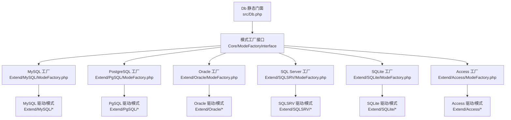
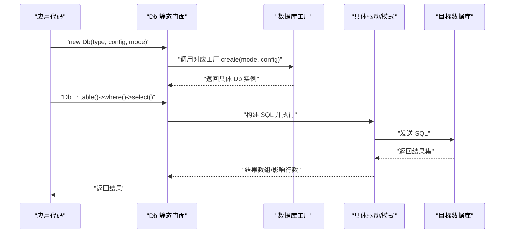
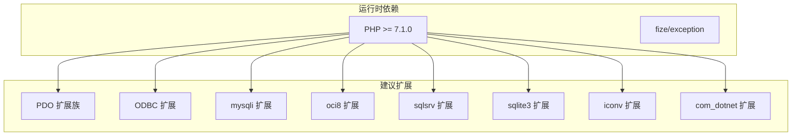

# 数据库特定示例

<cite>
**本文引用的文件**
- [src/Db.php](file://src/Db.php)
- [src/Core/Db.php](file://src/Core/Db.php)
- [composer.json](file://composer.json)
- [examples/db_connect.php](file://examples/db_connect.php)
- [examples/db_select.php](file://examples/db_select.php)
- [examples/db_insert.php](file://examples/db_insert.php)
- [examples/db_update.php](file://examples/db_update.php)
- [examples/db_delete.php](file://examples/db_delete.php)
- [examples/db_paginate.php](file://examples/db_paginate.php)
- [src/Extend/MySQL/ModeFactory.php](file://src/Extend/MySQL/ModeFactory.php)
- [src/Extend/Oracle/ModeFactory.php](file://src/Extend/Oracle/ModeFactory.php)
- [src/Extend/SQLSRV/ModeFactory.php](file://src/Extend/SQLSRV/ModeFactory.php)
- [src/Extend/PgSQL/ModeFactory.php](file://src/Extend/PgSQL/ModeFactory.php)
- [src/Extend/SQLite/ModeFactory.php](file://src/Extend/SQLite/ModeFactory.php)
- [src/Extend/Access/ModeFactory.php](file://src/Extend/Access/ModeFactory.php)
</cite>

## 目录
1. [简介](#简介)
2. [项目结构](#项目结构)
3. [核心组件](#核心组件)
4. [架构总览](#架构总览)
5. [详细组件分析](#详细组件分析)
6. [依赖关系分析](#依赖关系分析)
7. [性能考量](#性能考量)
8. [故障排查指南](#故障排查指南)
9. [结论](#结论)
10. [附录](#附录)

## 简介
本文件面向不同数据库类型（MySQL、PostgreSQL、Oracle、SQL Server、SQLite、Access）提供“特定使用示例”。内容涵盖：
- 各数据库的连接配置要点与可用模式（PDO、ODBC、特定驱动）
- 特有功能演示与注意事项
- 语法差异与性能特点对比
- 适用场景推荐

目标是帮助开发者基于本库快速完成多数据库适配，并在真实项目中做出合理选型。

## 项目结构
本库采用“核心抽象 + 扩展驱动 + 工厂模式”的分层设计：
- 核心层：统一的查询构造与事务接口（Core/Db 抽象类）
- 扩展层：各数据库的驱动实现与模式工厂（Extend/*）
- 入口层：Db 静态门面，负责路由到对应数据库的工厂与模式

图表来源
- [src/Db.php:1-141](file://src/Db.php#L1-L141)
- [src/Core/Db.php:1-800](file://src/Core/Db.php#L1-L800)
- [src/Extend/MySQL/ModeFactory.php:1-82](file://src/Extend/MySQL/ModeFactory.php#L1-L82)
- [src/Extend/PgSQL/ModeFactory.php:1-57](file://src/Extend/PgSQL/ModeFactory.php#L1-L57)
- [src/Extend/Oracle/ModeFactory.php:1-76](file://src/Extend/Oracle/ModeFactory.php#L1-L76)
- [src/Extend/SQLSRV/ModeFactory.php:1-56](file://src/Extend/SQLSRV/ModeFactory.php#L1-L56)
- [src/Extend/SQLite/ModeFactory.php:1-62](file://src/Extend/SQLite/ModeFactory.php#L1-L62)
- [src/Extend/Access/ModeFactory.php:1-49](file://src/Extend/Access/ModeFactory.php#L1-L49)

章节来源
- [src/Db.php:1-141](file://src/Db.php#L1-L141)
- [src/Core/Db.php:1-800](file://src/Core/Db.php#L1-L800)

## 核心组件
- Db 静态门面
  - 提供连接、查询、执行、事务、表选择、SQL 日志等统一入口
  - 通过工厂类按数据库类型与模式动态创建具体驱动实例
- Core/Db 抽象类
  - 统一的查询构造器：field、table、alias、join、where、group、having、order、union、limit
  - 统一的 CRUD 接口：insert、insertGetId、select、fetch、find、findOrNull、value、column、count、page、update、delete
  - 统一的事务接口：startTrans、commit、rollback
  - SQL 安全化与日志：getLastSql、getRealSql、parseValue

章节来源
- [src/Db.php:1-141](file://src/Db.php#L1-L141)
- [src/Core/Db.php:1-800](file://src/Core/Db.php#L1-L800)

## 架构总览
下图展示了从应用到数据库的典型调用链路与工厂分发机制：

图表来源
- [src/Db.php:26-56](file://src/Db.php#L26-L56)
- [src/Extend/MySQL/ModeFactory.php:21-80](file://src/Extend/MySQL/ModeFactory.php#L21-L80)
- [src/Extend/PgSQL/ModeFactory.php:21-55](file://src/Extend/PgSQL/ModeFactory.php#L21-L55)
- [src/Extend/Oracle/ModeFactory.php:21-74](file://src/Extend/Oracle/ModeFactory.php#L21-L74)
- [src/Extend/SQLSRV/ModeFactory.php:23-54](file://src/Extend/SQLSRV/ModeFactory.php#L23-L54)
- [src/Extend/SQLite/ModeFactory.php:21-60](file://src/Extend/SQLite/ModeFactory.php#L21-L60)
- [src/Extend/Access/ModeFactory.php:23-47](file://src/Extend/Access/ModeFactory.php#L23-L47)

## 详细组件分析

### MySQL
- 连接配置与模式
  - 支持模式：mysqli、odbc、pdo
  - 关键配置项：host、user、password、dbname、port、charset、prefix、opts、real、socket、ssl_set、flags、driver
  - 示例入口：[examples/db_connect.php:14](file://examples/db_connect.php#L14)
- 特性与示例
  - 基本 CRUD：[examples/db_insert.php:14](file://examples/db_insert.php#L14)、[examples/db_update.php:13](file://examples/db_update.php#L13)、[examples/db_delete.php:13](file://examples/db_delete.php#L13)
  - 查询与日志：[examples/db_select.php:13](file://examples/db_select.php#L13)
  - 分页：[examples/db_paginate.php:13](file://examples/db_paginate.php#L13)
- 注意事项
  - charset 默认 utf8；如需 utf8mb4，请在 opts 中配置
  - mysqli 模式下可启用 socket、ssl_set、flags 等高级特性
  - ODBC 模式需确保系统已安装 MySQL ODBC 驱动

章节来源
- [src/Extend/MySQL/ModeFactory.php:21-80](file://src/Extend/MySQL/ModeFactory.php#L21-L80)
- [examples/db_connect.php:14](file://examples/db_connect.php#L14)
- [examples/db_select.php:13](file://examples/db_select.php#L13)
- [examples/db_insert.php:14](file://examples/db_insert.php#L14)
- [examples/db_update.php:13](file://examples/db_update.php#L13)
- [examples/db_delete.php:13](file://examples/db_delete.php#L13)
- [examples/db_paginate.php:13](file://examples/db_paginate.php#L13)

### PostgreSQL
- 连接配置与模式
  - 支持模式：odbc、pgsql、pdo
  - 关键配置项：host、user、password、dbname、port、charset、prefix、driver、pconnect、connect_type、opts
  - 注意：pgsql 模式通过连接字符串 host/port/dbname/user/password 组装
- 特性与示例
  - 基本 CRUD 与查询同通用接口一致
  - 分页与日志示例可复用通用示例
- 注意事项
  - charset 默认 UTF8；如使用非 UTF8 字符集需明确设置
  - pconnect 控制持久连接；connect_type 可控制连接类型
  - ODBC 模式需确保已安装 PostgreSQL ODBC 驱动

章节来源
- [src/Extend/PgSQL/ModeFactory.php:21-55](file://src/Extend/PgSQL/ModeFactory.php#L21-L55)
- [examples/db_select.php:13](file://examples/db_select.php#L13)
- [examples/db_paginate.php:13](file://examples/db_paginate.php#L13)

### Oracle
- 连接配置与模式
  - 支持模式：oci、odbc、pdo
  - 关键配置项：host、username（注意字段名）、password、dbname、port、charset、prefix、session_mode、connect_type、opts、driver
  - 注意：oci 模式通过 host:port/dbname 组装连接串
- 特性与示例
  - 基本 CRUD 与查询同通用接口一致
  - 分页与日志示例可复用通用示例
- 注意事项
  - oci 模式对连接串格式要求严格
  - session_mode、connect_type 可按 Oracle 会话策略调整
  - ODBC 模式需确保已安装 Oracle ODBC 驱动

章节来源
- [src/Extend/Oracle/ModeFactory.php:21-74](file://src/Extend/Oracle/ModeFactory.php#L21-L74)
- [examples/db_select.php:13](file://examples/db_select.php#L13)
- [examples/db_paginate.php:13](file://examples/db_paginate.php#L13)

### SQL Server
- 连接配置与模式
  - 支持模式：adodb、odbc、pdo、sqlsrv
  - 关键配置项：host、user、password、dbname、port、charset、prefix、new_feature、driver、opts
  - 注意：sqlsrv 模式需 PHP sqlsrv 扩展；adodb 模式需 PHP com_dotnet 扩展
- 特性与示例
  - 基本 CRUD 与查询同通用接口一致
  - 分页与日志示例可复用通用示例
- 注意事项
  - new_feature 控制新特性开关
  - charset 默认 GBK；如使用 UTF-8 需显式配置
  - 不同模式对扩展依赖不同，需按环境选择

章节来源
- [src/Extend/SQLSRV/ModeFactory.php:23-54](file://src/Extend/SQLSRV/ModeFactory.php#L23-L54)
- [examples/db_select.php:13](file://examples/db_select.php#L13)
- [examples/db_paginate.php:13](file://examples/db_paginate.php#L13)

### SQLite
- 连接配置与模式
  - 支持模式：odbc、sqlite3、pdo
  - 关键配置项：file、prefix、long_names、time_out、no_txn、sync_pragma、step_api、driver、flags、encryption_key、busy_timeout
  - 注意：sqlite3 模式直接使用本地文件路径
- 特性与示例
  - 基本 CRUD 与查询同通用接口一致
  - 分页与日志示例可复用通用示例
- 注意事项
  - encryption_key 可启用加密；busy_timeout 控制锁等待
  - ODBC 模式需确保已安装 SQLite ODBC 驱动

章节来源
- [src/Extend/SQLite/ModeFactory.php:21-60](file://src/Extend/SQLite/ModeFactory.php#L21-L60)
- [examples/db_select.php:13](file://examples/db_select.php#L13)
- [examples/db_paginate.php:13](file://examples/db_paginate.php#L13)

### Access
- 连接配置与模式
  - 支持模式：adodb、odbc、pdo
  - 关键配置项：file、password、prefix、driver
  - 注意：adodb 模式依赖 PHP com_dotnet 扩展
- 特性与示例
  - 基本 CRUD 与查询同通用接口一致
  - 分页与日志示例可复用通用示例
- 注意事项
  - adodb 模式仅在 Windows 环境可用
  - ODBC 模式需确保已安装 Microsoft Access ODBC 驱动

章节来源
- [src/Extend/Access/ModeFactory.php:23-47](file://src/Extend/Access/ModeFactory.php#L23-L47)
- [examples/db_select.php:13](file://examples/db_select.php#L13)
- [examples/db_paginate.php:13](file://examples/db_paginate.php#L13)

## 依赖关系分析
- Composer 依赖
  - 运行时依赖：PHP >= 7.1.0，fize/exception
  - 开发测试：phpunit/phpunit
  - 建议扩展：各数据库 PDO/驱动扩展、ODBC、mysqli、oci8、sqlsrv、sqlite3、iconv、com_dotnet
- 模式依赖
  - MySQL：mysqli、odbc、pdo
  - PostgreSQL：odbc、pgsql、pdo
  - Oracle：oci、odbc、pdo
  - SQL Server：adodb、odbc、pdo、sqlsrv
  - SQLite：odbc、sqlite3、pdo
  - Access：adodb、odbc、pdo

图表来源
- [composer.json:16-37](file://composer.json#L16-L37)

章节来源
- [composer.json:16-46](file://composer.json#L16-L46)

## 性能考量
- 查询缓存
  - Core/Db 提供 select(cache=true) 的简单缓存，基于最终 SQL 文本作为键
  - 适合重复查询相同 SQL 的场景，避免重复解析与网络往返
- 预处理与绑定
  - 统一使用“?”占位符与参数绑定，降低 SQL 注入风险并提升执行计划复用
- 事务嵌套
  - Db 提供嵌套事务计数，仅在最外层开启/提交/回滚，减少误操作
- 限制与分页
  - Core/Db::page(page,size) 提供简易分页；生产环境建议结合数据库原生分页与索引优化

章节来源
- [src/Core/Db.php:699-711](file://src/Core/Db.php#L699-L711)
- [src/Db.php:84-114](file://src/Db.php#L84-L114)
- [src/Core/Db.php:784-789](file://src/Core/Db.php#L784-L789)

## 故障排查指南
- 常见异常
  - 非法 SQL 语句：当传入非 INSERT/SELECT/UPDATE/DELETE 的动作时抛出异常
  - 记录不存在：find() 在无记录时抛出“记录不存在”异常
- 错误定位
  - 使用 getLastSql(true) 输出最终 SQL 与绑定参数，便于核对
  - 使用 getLastSql(false) 输出预处理 SQL，便于检查占位符与字段格式
- 模式选择问题
  - 若报错“不支持的数据库模式”，请检查工厂中是否提供了该模式或对应扩展是否已安装
- 连接失败
  - 检查 host、port、user、password、dbname、charset、socket/driver 等配置
  - 确认对应 PDO/驱动/ODBC 驱动已启用

章节来源
- [src/Core/Db.php:607-610](file://src/Core/Db.php#L607-L610)
- [src/Core/Db.php:733-740](file://src/Core/Db.php#L733-L740)
- [src/Db.php:136-139](file://src/Db.php#L136-L139)
- [src/Extend/MySQL/ModeFactory.php:75-77](file://src/Extend/MySQL/ModeFactory.php#L75-L77)
- [src/Extend/Oracle/ModeFactory.php:69-71](file://src/Extend/Oracle/ModeFactory.php#L69-L71)
- [src/Extend/SQLSRV/ModeFactory.php:48-50](file://src/Extend/SQLSRV/ModeFactory.php#L48-L50)
- [src/Extend/PgSQL/ModeFactory.php:50-52](file://src/Extend/PgSQL/ModeFactory.php#L50-L52)
- [src/Extend/SQLite/ModeFactory.php:55-57](file://src/Extend/SQLite/ModeFactory.php#L55-L57)
- [src/Extend/Access/ModeFactory.php:42-44](file://src/Extend/Access/ModeFactory.php#L42-L44)

## 结论
- 本库通过统一的门面与工厂模式，屏蔽了不同数据库与驱动之间的差异，使开发者可以用同一套 API 操作多种数据库
- 不同数据库的差异主要体现在连接参数与可用模式上；通过 ModeFactory 的配置项即可覆盖常见场景
- 建议在开发阶段先用 PDO 模式验证逻辑，再根据部署环境选择更贴近性能与运维的模式（如 MySQL 的 mysqli、PostgreSQL 的 pgsql、SQL Server 的 sqlsrv）

## 附录

### 各数据库模式与配置要点速查
- MySQL
  - 模式：mysqli、odbc、pdo
  - 关键配置：host、user、password、dbname、port、charset、prefix、opts、real、socket、ssl_set、flags、driver
- PostgreSQL
  - 模式：odbc、pgsql、pdo
  - 关键配置：host、user、password、dbname、port、charset、prefix、driver、pconnect、connect_type、opts
- Oracle
  - 模式：oci、odbc、pdo
  - 关键配置：host、username、password、dbname、port、charset、prefix、session_mode、connect_type、opts、driver
- SQL Server
  - 模式：adodb、odbc、pdo、sqlsrv
  - 关键配置：host、user、password、dbname、port、charset、prefix、new_feature、driver、opts
- SQLite
  - 模式：odbc、sqlite3、pdo
  - 关键配置：file、prefix、long_names、time_out、no_txn、sync_pragma、step_api、driver、flags、encryption_key、busy_timeout
- Access
  - 模式：adodb、odbc、pdo
  - 关键配置：file、password、prefix、driver

章节来源
- [src/Extend/MySQL/ModeFactory.php:21-80](file://src/Extend/MySQL/ModeFactory.php#L21-L80)
- [src/Extend/PgSQL/ModeFactory.php:21-55](file://src/Extend/PgSQL/ModeFactory.php#L21-L55)
- [src/Extend/Oracle/ModeFactory.php:21-74](file://src/Extend/Oracle/ModeFactory.php#L21-L74)
- [src/Extend/SQLSRV/ModeFactory.php:23-54](file://src/Extend/SQLSRV/ModeFactory.php#L23-L54)
- [src/Extend/SQLite/ModeFactory.php:21-60](file://src/Extend/SQLite/ModeFactory.php#L21-L60)
- [src/Extend/Access/ModeFactory.php:23-47](file://src/Extend/Access/ModeFactory.php#L23-L47)

### 语法差异与适用场景
- 语法差异
  - 连接串格式：Oracle 的 oci 与 pgsql 的连接字符串风格不同；SQL Server 的 sqlsrv 与 adodb 对连接参数要求不同
  - 字符集：各数据库默认字符集不同，需显式配置以避免乱码
  - 事务与序列：不同数据库的自增/序列行为不同，需在 insertGetId 与序列名参数处留意
- 性能特点
  - PDO 通用性强，易移植；特定驱动（如 mysqli、sqlsrv、sqlite3）在某些场景下具备更高性能
  - ODBC 适配广泛但可能引入额外开销
- 场景推荐
  - MySQL：Web 应用、中小规模数据、PHP 生态优先
  - PostgreSQL：复杂查询、地理空间、强一致性需求
  - Oracle：企业级系统、严格的审计与合规
  - SQL Server：Windows 生态、.NET 集成、企业级 OLTP
  - SQLite：轻量应用、嵌入式、离线/原型
  - Access：Windows 办公场景、简单报表与数据管理

[本节为概念性总结，无需列出来源]