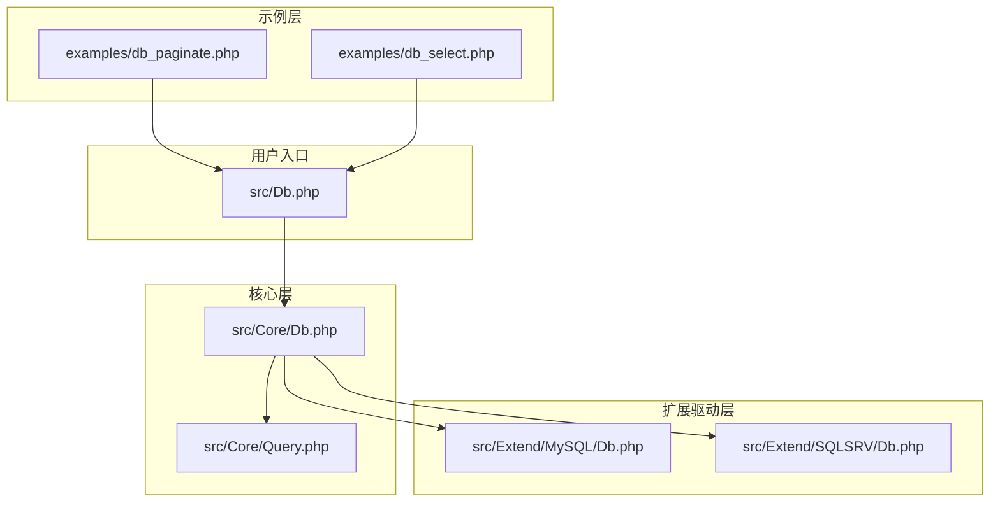
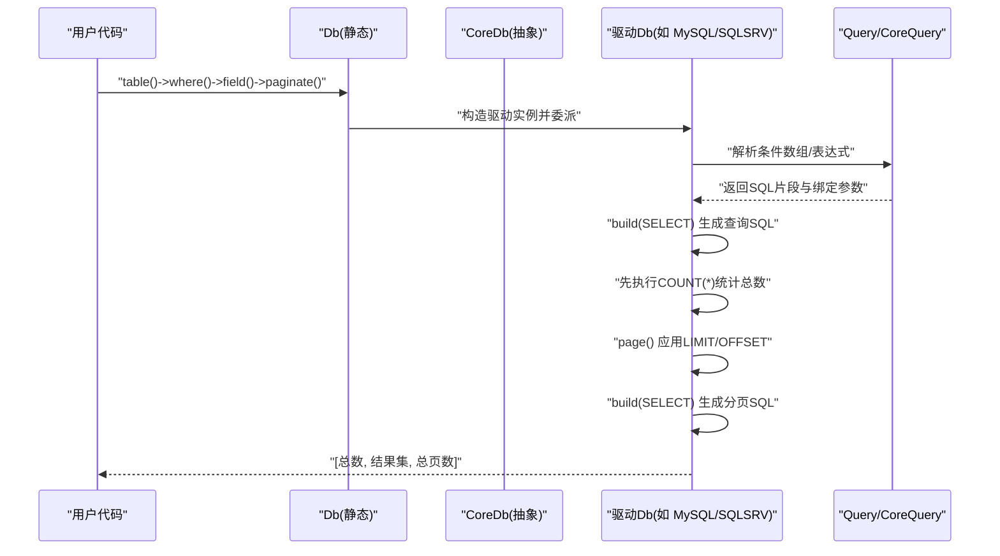
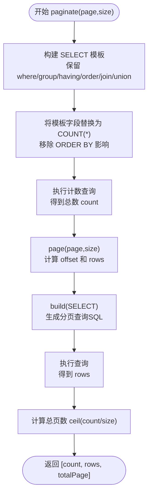
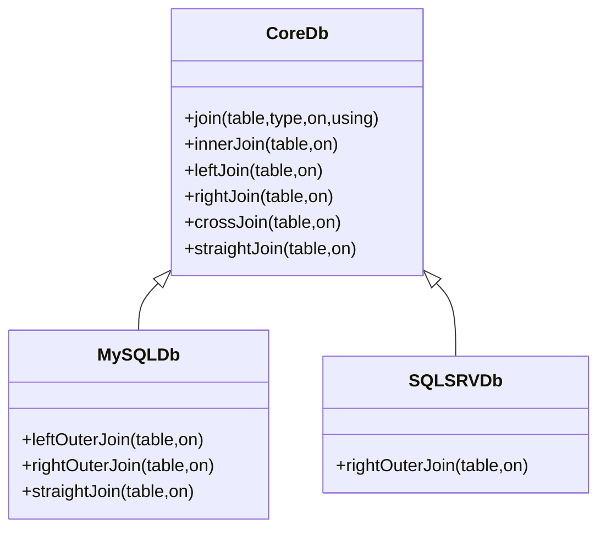
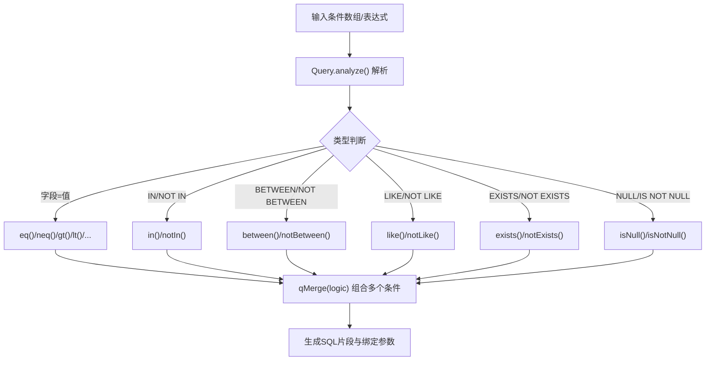
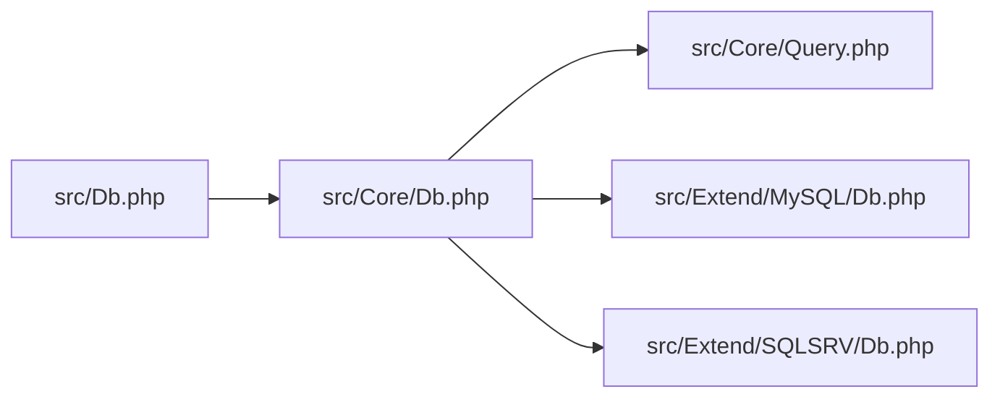

# 高级查询示例

<cite>
**本文引用的文件**
- [examples/db_paginate.php](file://examples/db_paginate.php)
- [examples/db_select.php](file://examples/db_select.php)
- [src/Db.php](file://src/Db.php)
- [src/Core/Db.php](file://src/Core/Db.php)
- [src/Query.php](file://src/Query.php)
- [src/Core/Query.php](file://src/Core/Query.php)
- [src/Extend/MySQL/Db.php](file://src/Extend/MySQL/Db.php)
- [src/Extend/SQLSRV/Db.php](file://src/Extend/SQLSRV/Db.php)
- [composer.json](file://composer.json)
</cite>

## 目录
1. [简介](#简介)
2. [项目结构](#项目结构)
3. [核心组件](#核心组件)
4. [架构总览](#架构总览)
5. [详细组件分析](#详细组件分析)
6. [依赖关系分析](#依赖关系分析)
7. [性能考量](#性能考量)
8. [故障排查指南](#故障排查指南)
9. [结论](#结论)
10. [附录](#附录)

## 简介
本示例文档围绕 FizeDatabase 的高级查询能力，系统展示分页查询的完整实现流程，包括分页参数配置、分页结果处理、总记录数统计等；同时提供复杂查询条件的构建示例（多表连接、条件组合、排序与分组），并结合不同数据库驱动的差异给出优化策略与性能建议。文档面向具备基础 PHP 与 SQL 知识的读者，通过路径引用的方式帮助快速定位源码位置与实现细节。

## 项目结构
仓库采用按“核心层 + 扩展驱动层 + 示例层”的组织方式：
- 核心层位于 src/Core，提供通用的查询构建、条件解析、分页与 SQL 组装逻辑
- 扩展驱动层位于 src/Extend/<DBType>，针对不同数据库（如 MySQL、SQLSRV、PgSQL 等）实现差异化行为（如 LIMIT、分页优化）
- 示例层位于 examples，提供分页与简单查询的使用示例

**图表来源**
- [examples/db_paginate.php:1-22](file://examples/db_paginate.php#L1-L22)
- [examples/db_select.php:1-22](file://examples/db_select.php#L1-L22)
- [src/Db.php:1-141](file://src/Db.php#L1-L141)
- [src/Core/Db.php:1-941](file://src/Core/Db.php#L1-L941)
- [src/Core/Query.php:1-621](file://src/Core/Query.php#L1-L621)
- [src/Extend/MySQL/Db.php:1-200](file://src/Extend/MySQL/Db.php#L1-L200)
- [src/Extend/SQLSRV/Db.php:144-205](file://src/Extend/SQLSRV/Db.php#L144-L205)

**章节来源**
- [composer.json:1-47](file://composer.json#L1-L47)

## 核心组件
- Db 静态入口：负责初始化数据库连接、创建具体驱动实例、提供静态查询与事务控制
- CoreDb 抽象类：封装 SQL 组装、条件解析、分页、聚合查询等通用逻辑
- Query 与 CoreQuery：提供条件数组解析、表达式拼接、条件合并与组合逻辑
- 具体驱动 Db：根据数据库方言实现 LIMIT、分页优化、锁表等差异化行为

**章节来源**
- [src/Db.php:1-141](file://src/Db.php#L1-L141)
- [src/Core/Db.php:1-941](file://src/Core/Db.php#L1-L941)
- [src/Query.php:1-130](file://src/Query.php#L1-L130)
- [src/Core/Query.php:1-621](file://src/Core/Query.php#L1-L621)

## 架构总览
FizeDatabase 的查询执行链路如下：
- 用户通过 Db 静态入口发起查询
- Db 将请求委派给具体驱动的 CoreDb 实例
- CoreDb 负责将链式条件（where、join、group、order、limit 等）组装为最终 SQL
- 分页查询通过先执行 COUNT(*) 再执行 SELECT 的两步法完成，或由驱动实现优化方案（如 MySQL 的 SQL_CALC_FOUND_ROWS）

**图表来源**
- [src/Db.php:114-127](file://src/Db.php#L114-L127)
- [src/Core/Db.php:573-637](file://src/Core/Db.php#L573-L637)
- [src/Core/Db.php:883-908](file://src/Core/Db.php#L883-L908)
- [src/Core/Query.php:521-568](file://src/Core/Query.php#L521-L568)

## 详细组件分析

### 分页查询完整实现
- 入口与示例
  - 示例文件展示了如何通过 Db::table()->where()->field()->paginate() 获取总数、结果集与总页数，并打印最终 SQL
  - 示例路径：[examples/db_paginate.php:17](file://examples/db_paginate.php#L17)
- 核心逻辑
  - CoreDb::paginate 先基于当前查询模板替换字段为 COUNT(*)，去除 ORDER BY 对 COUNT 的影响，执行计数查询，再应用 page() 限制并执行查询，返回 [count, rows, totalPage]
  - MySQL 驱动实现使用 SQL_CALC_FOUND_ROWS 与 FOUND_ROWS() 的优化方案，避免二次扫描
  - SQLSRV 驱动实现兼容旧版与新版本语法，必要时通过窗口函数与临时表实现分页
- 关键实现位置
  - CoreDb::paginate：[src/Core/Db.php:883-908](file://src/Core/Db.php#L883-L908)
  - MySQL::paginate：[src/Extend/MySQL/Db.php:179-205](file://src/Extend/MySQL/Db.php#L179-L205)
  - SQLSRV::paginate：[src/Extend/SQLSRV/Db.php:207-230](file://src/Extend/SQLSRV/Db.php#L207-L230)

**图表来源**
- [src/Core/Db.php:883-908](file://src/Core/Db.php#L883-L908)
- [src/Extend/MySQL/Db.php:179-205](file://src/Extend/MySQL/Db.php#L179-L205)
- [src/Extend/SQLSRV/Db.php:207-230](file://src/Extend/SQLSRV/Db.php#L207-L230)

**章节来源**
- [examples/db_paginate.php:15-21](file://examples/db_paginate.php#L15-L21)
- [src/Core/Db.php:883-908](file://src/Core/Db.php#L883-L908)
- [src/Extend/MySQL/Db.php:179-205](file://src/Extend/MySQL/Db.php#L179-L205)
- [src/Extend/SQLSRV/Db.php:207-230](file://src/Extend/SQLSRV/Db.php#L207-L230)

### 复杂查询条件构建示例

#### 多表连接查询
- 支持 JOIN、INNER JOIN、LEFT JOIN、RIGHT JOIN、CROSS JOIN、STRAIGHT_JOIN 等多种连接方式
- on 条件与 using 字段支持
- 示例路径：[src/Core/Db.php:408-463](file://src/Core/Db.php#L408-L463)

**图表来源**
- [src/Core/Db.php:408-463](file://src/Core/Db.php#L408-L463)
- [src/Extend/MySQL/Db.php:73-109](file://src/Extend/MySQL/Db.php#L73-L109)
- [src/Extend/SQLSRV/Db.php:115-124](file://src/Extend/SQLSRV/Db.php#L115-L124)

**章节来源**
- [src/Core/Db.php:408-463](file://src/Core/Db.php#L408-L463)
- [src/Extend/MySQL/Db.php:73-109](file://src/Extend/MySQL/Db.php#L73-L109)
- [src/Extend/SQLSRV/Db.php:115-124](file://src/Extend/SQLSRV/Db.php#L115-L124)

#### 条件组合查询
- 支持数组条件解析、表达式条件、EXISTS/NOT EXISTS、IN/NOT IN、BETWEEN/NOT BETWEEN、LIKE/NOT LIKE、IS NULL/IS NOT NULL 等
- Query::and()/or() 与 Query::qMerge() 支持多条件组合
- 示例路径：[src/Core/Query.php:521-620](file://src/Core/Query.php#L521-L620)

**图表来源**
- [src/Core/Query.php:521-620](file://src/Core/Query.php#L521-L620)

**章节来源**
- [src/Core/Query.php:521-620](file://src/Core/Query.php#L521-L620)

#### 排序与分组查询
- 支持 field()、group()、having()、order() 等链式调用
- CoreDb::build() 将这些子句按标准顺序拼接
- 示例路径：[src/Core/Db.php:228-325](file://src/Core/Db.php#L228-L325)

**章节来源**
- [src/Core/Db.php:228-325](file://src/Core/Db.php#L228-L325)

### 查询入口与条件注入
- Db::table() 与 Db::connect() 提供默认连接与新连接创建
- where() 支持数组、Query 对象与原生 SQL 预处理语句
- 示例路径：[src/Db.php:114-127](file://src/Db.php#L114-L127)、[src/Core/Db.php:335-393](file://src/Core/Db.php#L335-L393)

**章节来源**
- [src/Db.php:114-127](file://src/Db.php#L114-L127)
- [src/Core/Db.php:335-393](file://src/Core/Db.php#L335-L393)

## 依赖关系分析
- Db 静态类依赖扩展驱动工厂创建具体 CoreDb 实例
- CoreDb 依赖 Query/CoreQuery 进行条件解析
- 不同数据库驱动对 LIMIT、分页与 SQL 方言进行差异化实现

**图表来源**
- [src/Db.php:1-141](file://src/Db.php#L1-L141)
- [src/Core/Db.php:1-941](file://src/Core/Db.php#L1-L941)
- [src/Core/Query.php:1-621](file://src/Core/Query.php#L1-L621)
- [src/Extend/MySQL/Db.php:1-200](file://src/Extend/MySQL/Db.php#L1-L200)
- [src/Extend/SQLSRV/Db.php:144-205](file://src/Extend/SQLSRV/Db.php#L144-L205)

**章节来源**
- [src/Db.php:1-141](file://src/Db.php#L1-L141)
- [src/Core/Db.php:1-941](file://src/Core/Db.php#L1-L941)
- [src/Core/Query.php:1-621](file://src/Core/Query.php#L1-L621)
- [src/Extend/MySQL/Db.php:1-200](file://src/Extend/MySQL/Db.php#L1-L200)
- [src/Extend/SQLSRV/Db.php:144-205](file://src/Extend/SQLSRV/Db.php#L144-L205)

## 性能考量
- 分页优化
  - MySQL：优先使用 SQL_CALC_FOUND_ROWS 与 FOUND_ROWS()，避免重复扫描
  - SQLSRV：新版本使用 OFFSET/FETCH，旧版本通过窗口函数与临时表实现
  - 通用策略：移除 ORDER BY 对 COUNT 的影响，避免不必要的排序开销
- 条件与索引
  - LIKE 通配符前缀可能导致全表扫描，尽量使用后缀匹配或全文索引
  - IN 列表过大时建议拆分或使用临时表
- 字段选择
  - 明确 field() 仅取必要字段，避免 SELECT *
- 缓存与遍历
  - select() 支持缓存，适合重复查询；大结果集建议使用 fetch() 流式遍历以降低内存占用

**章节来源**
- [src/Extend/MySQL/Db.php:179-205](file://src/Extend/MySQL/Db.php#L179-L205)
- [src/Extend/SQLSRV/Db.php:144-205](file://src/Extend/SQLSRV/Db.php#L144-L205)
- [src/Core/Db.php:700-711](file://src/Core/Db.php#L700-L711)
- [src/Core/Db.php:668-672](file://src/Core/Db.php#L668-L672)

## 故障排查指南
- SQL 注入与日志
  - getLastSql(real) 可输出最终 SQL，便于调试；注意不要直接执行日志 SQL
  - getRealSql() 将预处理 SQL 与参数拼接为真实 SQL
- 常见问题
  - 分页总数异常：确认 ORDER BY 已被正确移除或替换为 COUNT
  - SQLSRV 分页错位：检查是否启用新特性（OFFSET/FETCH），否则需确保有明确 ORDER BY
  - 条件解析失败：核对条件数组格式与组合逻辑参数

**章节来源**
- [src/Core/Db.php:199-206](file://src/Core/Db.php#L199-L206)
- [src/Core/Db.php:178-190](file://src/Core/Db.php#L178-L190)
- [src/Core/Db.php:883-908](file://src/Core/Db.php#L883-L908)
- [src/Extend/SQLSRV/Db.php:144-205](file://src/Extend/SQLSRV/Db.php#L144-L205)

## 结论
FizeDatabase 在核心层提供了统一的查询构建与条件解析能力，在扩展层针对不同数据库实现了差异化优化。分页查询通过两步法或驱动特定优化实现高效统计与分页读取；复杂查询通过 Query 对象与数组条件解析，支持多表连接、条件组合、排序与分组等高级特性。结合合理的索引设计与字段选择，可在大数据量场景下获得稳定性能表现。

## 附录
- 示例入口
  - 分页示例：[examples/db_paginate.php:17](file://examples/db_paginate.php#L17)
  - 简单查询示例：[examples/db_select.php:18](file://examples/db_select.php#L18)
- 关键实现位置
  - 分页：[src/Core/Db.php:883-908](file://src/Core/Db.php#L883-L908)
  - 条件解析：[src/Core/Query.php:521-620](file://src/Core/Query.php#L521-L620)
  - JOIN 与排序：[src/Core/Db.php:408-463](file://src/Core/Db.php#L408-L463)、[src/Core/Db.php:307-325](file://src/Core/Db.php#L307-L325)