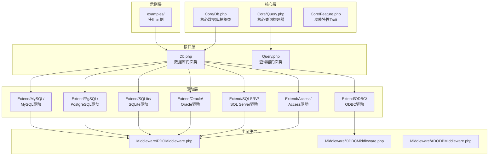
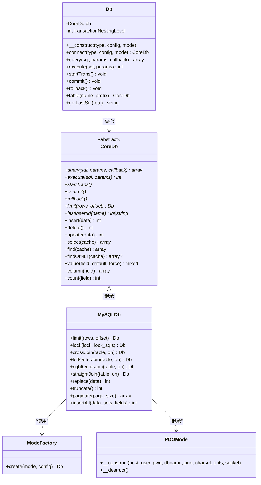
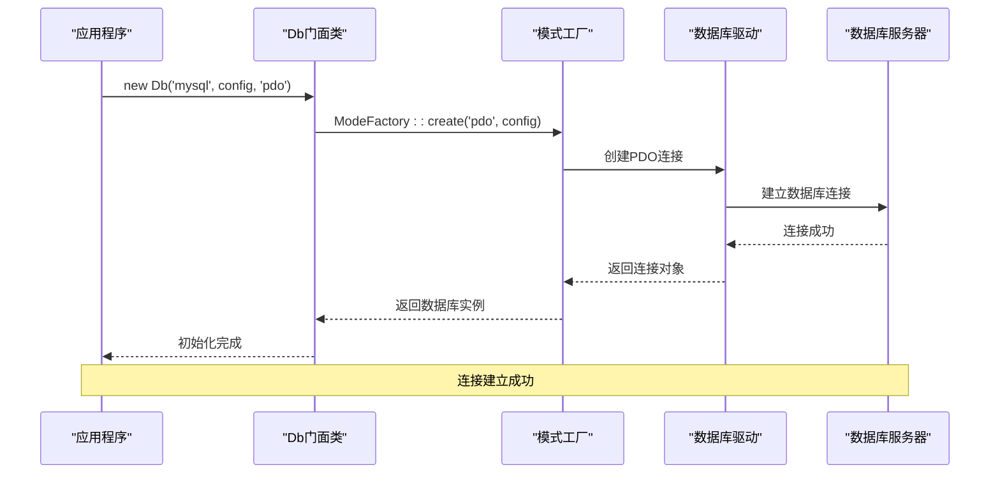
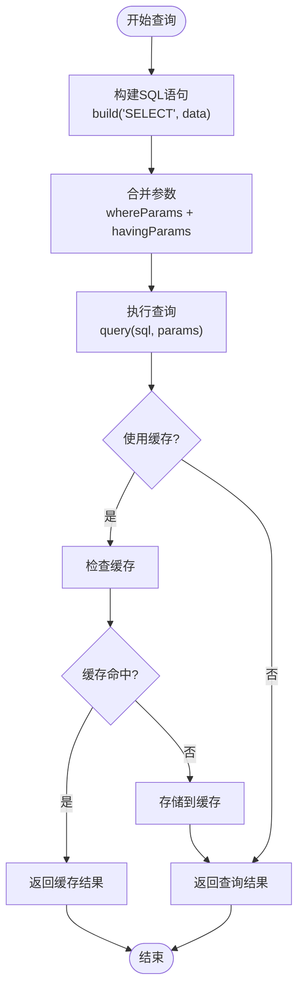
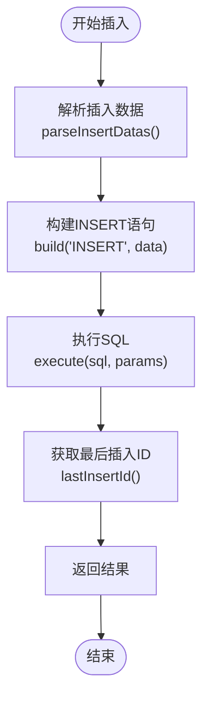
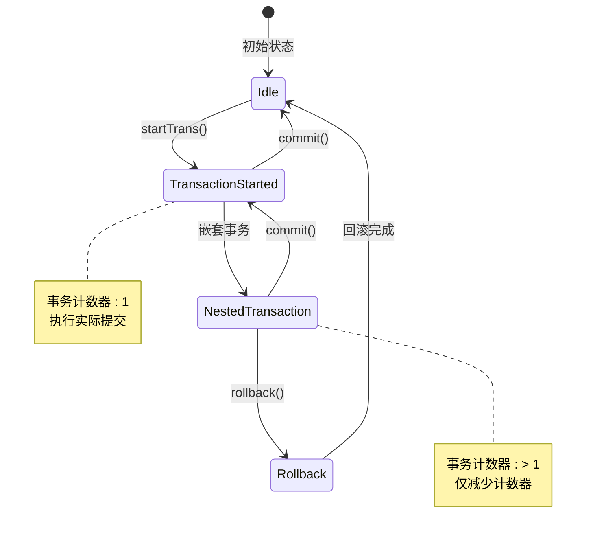
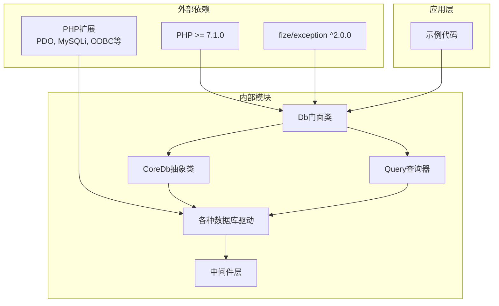

# 快速开始

<cite>
**本文引用的文件**
- [composer.json](file://composer.json)
- [src/Db.php](file://src/Db.php)
- [src/Core/Db.php](file://src/Core/Db.php)
- [src/Query.php](file://src/Query.php)
- [src/Extend/MySQL/ModeFactory.php](file://src/Extend/MySQL/ModeFactory.php)
- [src/Extend/MySQL/Db.php](file://src/Extend/MySQL/Db.php)
- [src/Extend/MySQL/Mode/PDOMode.php](file://src/Extend/MySQL/Mode/PDOMode.php)
- [examples/db_connect.php](file://examples/db_connect.php)
- [examples/db_select.php](file://examples/db_select.php)
- [examples/db_insert.php](file://examples/db_insert.php)
- [examples/db_update.php](file://examples/db_update.php)
- [examples/db_delete.php](file://examples/db_delete.php)
</cite>

## 目录
1. [简介](#简介)
2. [项目结构](#项目结构)
3. [核心组件](#核心组件)
4. [架构概览](#架构概览)
5. [详细组件分析](#详细组件分析)
6. [依赖关系分析](#依赖关系分析)
7. [性能考虑](#性能考虑)
8. [故障排除指南](#故障排除指南)
9. [结论](#结论)
10. [附录](#附录)

## 简介
FizeDatabase 是一个全功能、易于扩展的数据库类库，提供了统一的数据库访问接口，支持多种数据库类型和连接模式。它采用面向对象的设计，通过工厂模式和中间件机制实现了良好的可扩展性和易用性。

## 项目结构
FizeDatabase 采用清晰的分层架构设计，主要包含以下核心目录：



**图表来源**
- [src/Db.php:1-141](file://src/Db.php#L1-L141)
- [src/Core/Db.php:1-941](file://src/Core/Db.php#L1-L941)
- [src/Query.php:1-130](file://src/Query.php#L1-L130)

**章节来源**
- [composer.json:1-47](file://composer.json#L1-L47)
- [src/Db.php:1-141](file://src/Db.php#L1-L141)

## 核心组件
FizeDatabase 的核心组件包括门面类、核心抽象类和查询构建器，它们共同构成了整个数据库访问的基础框架。

### 门面类 Db
门面类提供了静态方法，简化了数据库操作的使用方式：

- **连接管理**: 支持多种数据库类型和连接模式
- **查询执行**: 提供静态方法执行 SQL 查询和更新
- **事务控制**: 支持嵌套事务处理
- **表操作**: 通过链式调用实现表选择和条件设置

### 核心抽象类 CoreDb
核心抽象类定义了数据库操作的基本接口和通用功能：

- **SQL 构建**: 统一的 SQL 语句构建机制
- **条件处理**: 支持多种 WHERE 条件和 JOIN 操作
- **CRUD 操作**: 标准的增删改查方法
- **缓存机制**: 查询结果缓存优化

### 查询构建器 Query
查询构建器提供了灵活的条件构建能力：

- **条件数组**: 支持数组形式的条件定义
- **逻辑组合**: AND/OR 逻辑运算符支持
- **动态生成**: 根据数据库类型动态生成查询器

**章节来源**
- [src/Db.php:13-141](file://src/Db.php#L13-L141)
- [src/Core/Db.php:13-941](file://src/Core/Db.php#L13-L941)
- [src/Query.php:12-130](file://src/Query.php#L12-L130)

## 架构概览
FizeDatabase 采用了典型的三层架构设计，通过工厂模式和中间件机制实现松耦合的系统结构。



**图表来源**
- [src/Db.php:13-141](file://src/Db.php#L13-L141)
- [src/Core/Db.php:13-941](file://src/Core/Db.php#L13-L941)
- [src/Extend/MySQL/Db.php:11-246](file://src/Extend/MySQL/Db.php#L11-L246)
- [src/Extend/MySQL/ModeFactory.php:11-82](file://src/Extend/MySQL/ModeFactory.php#L11-L82)
- [src/Extend/MySQL/Mode/PDOMode.php:14-53](file://src/Extend/MySQL/Mode/PDOMode.php#L14-L53)

## 详细组件分析

### 数据库连接组件
数据库连接是整个系统的核心，负责建立与数据库的通信通道。



**图表来源**
- [src/Db.php:32-56](file://src/Db.php#L32-L56)
- [src/Extend/MySQL/ModeFactory.php:21-80](file://src/Extend/MySQL/ModeFactory.php#L21-L80)
- [src/Extend/MySQL/Mode/PDOMode.php:29-42](file://src/Extend/MySQL/Mode/PDOMode.php#L29-L42)

### CRUD 操作流程
FizeDatabase 提供了完整的 CRUD 操作支持，每种操作都遵循统一的处理流程。

#### 查询操作流程


**图表来源**
- [src/Core/Db.php:583-637](file://src/Core/Db.php#L583-L637)
- [src/Core/Db.php:700-711](file://src/Core/Db.php#L700-L711)

#### 插入操作流程


**图表来源**
- [src/Core/Db.php:506-520](file://src/Core/Db.php#L506-L520)
- [src/Core/Db.php:583-637](file://src/Core/Db.php#L583-L637)
- [src/Core/Db.php:644-660](file://src/Core/Db.php#L644-L660)

**章节来源**
- [src/Core/Db.php:644-711](file://src/Core/Db.php#L644-L711)
- [src/Extend/MySQL/Db.php:159-177](file://src/Extend/MySQL/Db.php#L159-L177)

### 事务处理机制
FizeDatabase 支持嵌套事务处理，通过计数器管理事务层级。



**图表来源**
- [src/Db.php:84-114](file://src/Db.php#L84-L114)

**章节来源**
- [src/Db.php:84-114](file://src/Db.php#L84-L114)

## 依赖关系分析
FizeDatabase 的依赖关系清晰明确，遵循了依赖倒置原则和开闭原则。



**图表来源**
- [composer.json:16-37](file://composer.json#L16-L37)
- [src/Db.php:5-6](file://src/Db.php#L5-L6)

**章节来源**
- [composer.json:16-37](file://composer.json#L16-L37)

## 性能考虑
FizeDatabase 在设计时充分考虑了性能优化，主要体现在以下几个方面：

### 查询缓存机制
- **缓存键生成**: 基于最终 SQL 语句生成唯一缓存键
- **内存缓存**: 使用静态数组存储查询结果
- **缓存失效**: 每次查询都会重新生成缓存键，确保数据一致性

### 参数绑定优化
- **预处理语句**: 所有查询都使用预处理语句防止 SQL 注入
- **参数合并**: WHERE 和 HAVING 条件参数自动合并
- **类型安全**: 自动处理不同数据类型的参数绑定

### 连接池管理
- **延迟连接**: 仅在需要时建立数据库连接
- **资源释放**: 析构函数自动释放数据库连接
- **中间件模式**: 通过中间件统一管理连接生命周期

## 故障排除指南

### 安装问题排查

#### Composer 安装失败
**问题症状**: Composer 安装时报错，提示依赖冲突
**解决方法**:
1. 检查 PHP 版本是否满足要求 (>= 7.1.0)
2. 确认网络连接正常
3. 尝试使用国内镜像源
4. 清理 Composer 缓存

#### PHP 扩展缺失
**问题症状**: 运行时报错，提示缺少必要的 PHP 扩展
**解决方法**:
1. 安装对应的数据库扩展
2. 重启 Web 服务器
3. 验证扩展是否正确加载

### 连接问题排查

#### 数据库连接失败
**问题症状**: 连接数据库时报错
**排查步骤**:
1. 检查数据库服务器是否启动
2. 验证连接参数是否正确
3. 确认网络连通性
4. 检查防火墙设置

#### 权限不足
**问题症状**: 连接成功但执行 SQL 失败
**解决方法**:
1. 检查用户权限配置
2. 确认数据库存在
3. 验证字符集设置

### 常见错误及解决方案

#### SQL 注入防护
**问题症状**: 查询结果异常或报错
**解决方法**:
1. 使用参数绑定而不是字符串拼接
2. 避免直接使用用户输入构造 SQL
3. 使用查询器提供的安全方法

#### 事务处理问题
**问题症状**: 事务提交失败或回滚异常
**解决方法**:
1. 确保嵌套事务正确配对
2. 检查事务层级计数器
3. 避免在事务中执行长时间操作

**章节来源**
- [src/Db.php:84-114](file://src/Db.php#L84-L114)
- [src/Core/Db.php:178-190](file://src/Core/Db.php#L178-L190)

## 结论
FizeDatabase 提供了一个功能完整、易于使用的数据库访问解决方案。其设计特点包括：

- **统一接口**: 通过门面类提供简单易用的 API
- **可扩展性**: 支持多种数据库类型和连接模式
- **安全性**: 内置 SQL 注入防护机制
- **性能优化**: 查询缓存和参数绑定优化
- **易维护**: 清晰的代码结构和完善的文档

对于新手开发者来说，FizeDatabase 提供了友好的学习曲线，可以在短时间内掌握基本的数据库操作技能。

## 附录

### 快速开始示例

#### 最简单的连接示例
```php
<?php
require_once "vendor/autoload.php";

use Fize\Database\Db;

// 基本连接配置
$config = [
    'host'     => 'localhost',
    'user'     => 'root',
    'password' => '123456',
    'dbname'   => 'test_db'
];

// 创建数据库连接
new Db('mysql', $config);

// 执行查询
$result = Db::table('users')->select();
```

#### 基本 CRUD 操作
```php
<?php
require_once "vendor/autoload.php";

use Fize\Database\Db;

$config = [
    'host'     => 'localhost',
    'user'     => 'root',
    'password' => '123456',
    'dbname'   => 'test_db'
];

new Db('mysql', $config);

// 插入数据
$insertData = [
    'name' => '张三',
    'email' => 'zhangsan@example.com'
];
Db::table('users')->insert($insertData);

// 查询数据
$users = Db::table('users')
    ->where(['name' => '张三'])
    ->select();

// 更新数据
Db::table('users')
    ->where(['name' => '张三'])
    ->update(['email' => 'newemail@example.com']);

// 删除数据
Db::table('users')
    ->where(['name' => '张三'])
    ->delete();
```

### 环境要求清单

#### PHP 版本要求
- **最低要求**: PHP 7.1.0 或更高版本
- **推荐版本**: PHP 7.2.0 或更高版本

#### 必需 PHP 扩展
- **PDO 扩展**: 所有数据库驱动的基础
- **MySQLi 扩展**: MySQL 连接支持
- **ODBC 扩展**: ODBC 兼容数据库支持

#### 可选 PHP 扩展
- **iconv 扩展**: 字符编码转换支持
- **oci8 扩展**: Oracle 数据库支持
- **pgsql 扩展**: PostgreSQL 数据库支持
- **sqlite3 扩展**: SQLite 数据库支持
- **sqlsrv 扩展**: SQL Server 数据库支持

### 支持的数据库类型
- **MySQL**: 通过 PDO、MySQLi、ODBC 三种模式支持
- **PostgreSQL**: 通过 PDO 模式支持
- **SQLite**: 通过 PDO 模式支持
- **Oracle**: 通过 OCI、PDO、ODBC 三种模式支持
- **SQL Server**: 通过 PDO、ODBC、ADODB 三种模式支持
- **Access**: 通过 PDO、ODBC、ADODB 三种模式支持
- **ODBC**: 通用 ODBC 接口支持

### 配置参数说明

#### 基础连接参数
- **host**: 数据库服务器地址
- **user**: 数据库用户名
- **password**: 数据库密码
- **dbname**: 数据库名称

#### 可选配置参数
- **port**: 数据库端口号
- **charset**: 字符集设置
- **prefix**: 表前缀
- **opts**: PDO 连接选项
- **socket**: Unix Socket 路径
- **ssl_set**: SSL 连接设置
- **flags**: 连接标志

### 最佳实践建议

#### 连接管理
- 使用门面类进行全局连接管理
- 合理设置连接超时时间
- 在应用结束时及时释放连接

#### 查询优化
- 使用参数绑定防止 SQL 注入
- 合理使用索引提高查询性能
- 避免 N+1 查询问题

#### 错误处理
- 捕获并处理数据库异常
- 记录详细的错误日志
- 提供友好的错误信息给用户