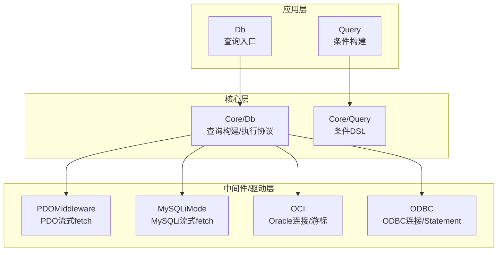
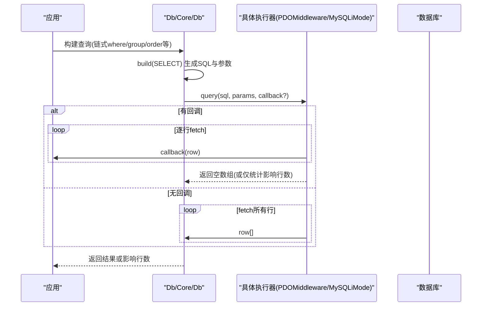
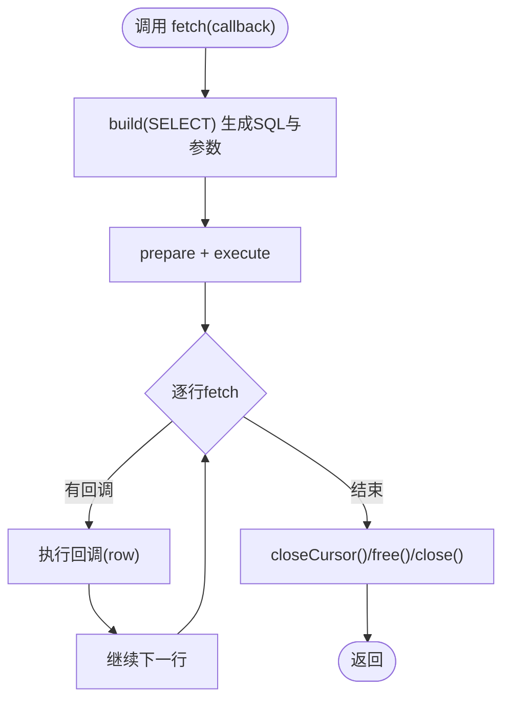
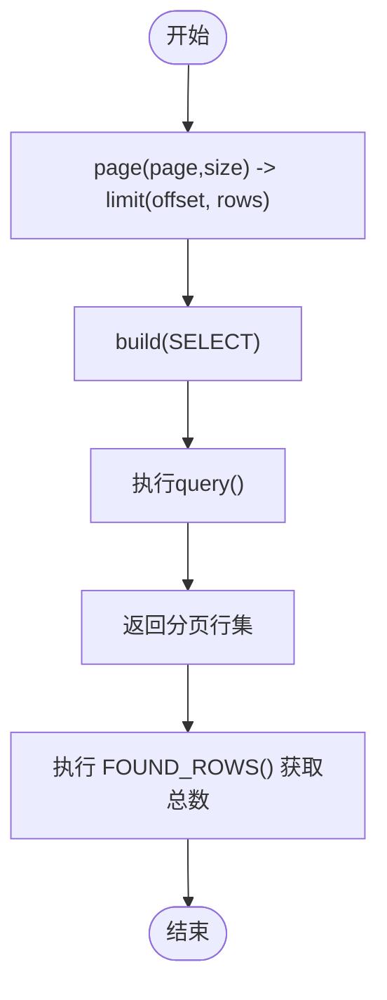
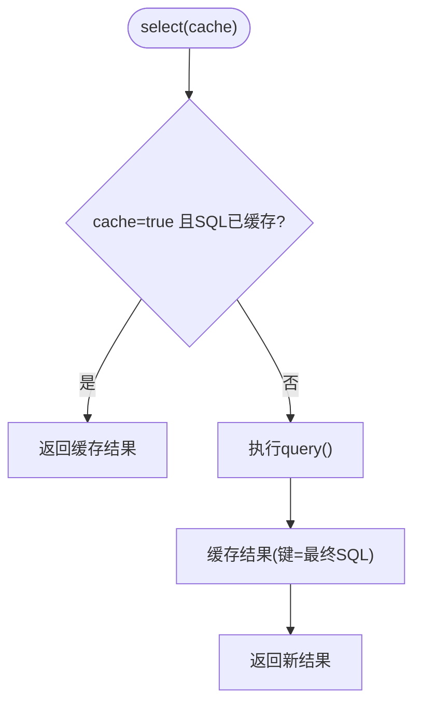
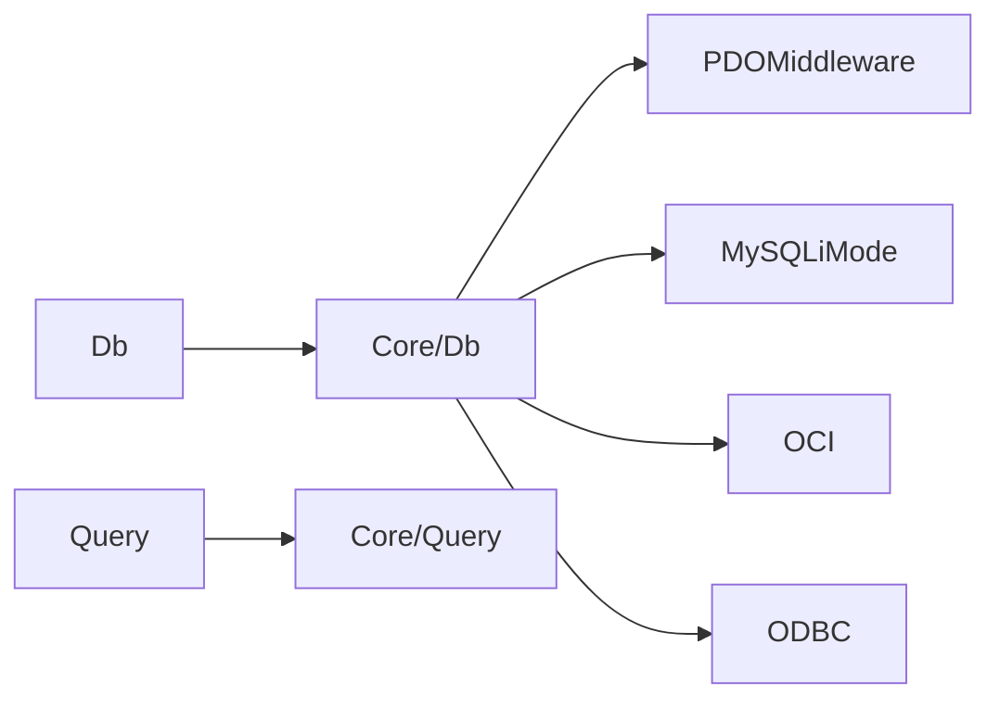

# 内存管理

<cite>
**本文引用的文件**
- [src/Db.php](file://src/Db.php)
- [src/Query.php](file://src/Query.php)
- [src/Core/Db.php](file://src/Core/Db.php)
- [src/Core/Query.php](file://src/Core/Query.php)
- [src/Middleware/PDOMiddleware.php](file://src/Middleware/PDOMiddleware.php)
- [src/Extend/MySQL/Mode/PDOMode.php](file://src/Extend/MySQL/Mode/PDOMode.php)
- [src/Extend/MySQL/Mode/MySQLiMode.php](file://src/Extend/MySQL/Mode/MySQLiMode.php)
- [src/Extend/Oracle/Driver/OCI.php](file://src/Extend/Oracle/Driver/OCI.php)
- [src/Driver/ODBC/ODBC.php](file://src/Driver/ODBC/ODBC.php)
- [examples/db_select.php](file://examples/db_select.php)
- [composer.json](file://composer.json)
</cite>

## 目录
1. [简介](#简介)
2. [项目结构](#项目结构)
3. [核心组件](#核心组件)
4. [架构总览](#架构总览)
5. [详细组件分析](#详细组件分析)
6. [依赖关系分析](#依赖关系分析)
7. [性能考量](#性能考量)
8. [故障排查指南](#故障排查指南)
9. [结论](#结论)
10. [附录](#附录)

## 简介
本文件聚焦于FizeDatabase在大数据量查询场景下的内存使用优化与管理策略，围绕以下主题展开：
- fetch()方法的流式处理机制与回调驱动的逐行消费
- 分批处理策略与LIMIT/OFFSET的配合
- 查询结果集的内存占用与缓存机制对内存的影响
- 缓存大小控制与内存清理策略
- 内存泄漏的预防与检测方法（资源释放、长连接管理）
- 内存使用监控工具与性能分析建议

## 项目结构
FizeDatabase采用分层+适配器模式组织代码：
- 顶层封装：Db、Query对外提供便捷入口与链式查询DSL
- 核心抽象：Core/Db、Core/Query定义查询构建与执行协议
- 中间件与驱动：Middleware/PDOMiddleware、MySQLiMode、OCI、ODBC等具体实现
- 扩展适配：Extend/* 下按数据库类型划分的模式与特性

图示来源
- [src/Db.php:1-141](file://src/Db.php#L1-L141)
- [src/Query.php:1-130](file://src/Query.php#L1-L130)
- [src/Core/Db.php:1-941](file://src/Core/Db.php#L1-L941)
- [src/Core/Query.php:1-621](file://src/Core/Query.php#L1-L621)
- [src/Middleware/PDOMiddleware.php:1-129](file://src/Middleware/PDOMiddleware.php#L1-L129)
- [src/Extend/MySQL/Mode/MySQLiMode.php:1-251](file://src/Extend/MySQL/Mode/MySQLiMode.php#L1-L251)
- [src/Extend/Oracle/Driver/OCI.php:1-396](file://src/Extend/Oracle/Driver/OCI.php#L1-L396)
- [src/Driver/ODBC/ODBC.php:1-341](file://src/Driver/ODBC/ODBC.php#L1-L341)

章节来源
- [src/Db.php:1-141](file://src/Db.php#L1-L141)
- [src/Query.php:1-130](file://src/Query.php#L1-L130)
- [src/Core/Db.php:1-941](file://src/Core/Db.php#L1-L941)
- [src/Core/Query.php:1-621](file://src/Core/Query.php#L1-L621)
- [composer.json:1-47](file://composer.json#L1-L47)

## 核心组件
- Db/Query：对外静态入口与链式查询DSL，负责将业务条件转换为SQL与参数
- Core/Db：抽象查询构建器，定义query()/execute()协议；内置select()缓存与fetch()流式遍历
- Core/Query：条件DSL，支持多种比较、集合、存在性、表达式等条件，并生成SQL与参数
- PDOMiddleware/MySQLiMode：PDO与MySQLi的具体执行实现，提供流式fetch与资源释放
- Oracle/OCI、ODBC：第三方驱动适配，关注连接生命周期与资源释放

章节来源
- [src/Db.php:1-141](file://src/Db.php#L1-L141)
- [src/Query.php:1-130](file://src/Query.php#L1-L130)
- [src/Core/Db.php:1-941](file://src/Core/Db.php#L1-L941)
- [src/Core/Query.php:1-621](file://src/Core/Query.php#L1-L621)
- [src/Middleware/PDOMiddleware.php:1-129](file://src/Middleware/PDOMiddleware.php#L1-L129)
- [src/Extend/MySQL/Mode/MySQLiMode.php:1-251](file://src/Extend/MySQL/Mode/MySQLiMode.php#L1-L251)
- [src/Extend/Oracle/Driver/OCI.php:1-396](file://src/Extend/Oracle/Driver/OCI.php#L1-L396)
- [src/Driver/ODBC/ODBC.php:1-341](file://src/Driver/ODBC/ODBC.php#L1-L341)

## 架构总览
FizeDatabase在查询执行路径上，遵循“条件构建 -> SQL生成 -> 预处理执行 -> 结果消费”的流程。为降低内存峰值，核心在Core/Db中提供两种消费模式：
- select(cache=true)：基于SQL指纹的进程内缓存，适合重复查询去重
- fetch(callback)：逐行回调消费，避免一次性将全部结果载入内存

图示来源
- [src/Core/Db.php:668-711](file://src/Core/Db.php#L668-L711)
- [src/Middleware/PDOMiddleware.php:51-72](file://src/Middleware/PDOMiddleware.php#L51-L72)
- [src/Extend/MySQL/Mode/MySQLiMode.php:115-164](file://src/Extend/MySQL/Mode/MySQLiMode.php#L115-L164)

## 详细组件分析

### 1) fetch()流式处理机制
- 触发点：Core/Db::fetch()先build SELECT，再调用具体执行器的query()，并将回调函数传入
- 执行器差异：
  - PDOMiddleware：prepare + execute后，逐行fetch(PDO::FETCH_ASSOC)，在回调中处理后立即丢弃行变量，随后closeCursor()释放游标
  - MySQLiMode：prepare + execute后，逐行fetch_assoc()，回调处理后立即丢弃行，free()释放结果集，close()关闭语句
- 优势：避免将全部结果集保存在内存中，显著降低峰值内存

图示来源
- [src/Core/Db.php:668-672](file://src/Core/Db.php#L668-L672)
- [src/Middleware/PDOMiddleware.php:51-72](file://src/Middleware/PDOMiddleware.php#L51-L72)
- [src/Extend/MySQL/Mode/MySQLiMode.php:115-164](file://src/Extend/MySQL/Mode/MySQLiMode.php#L115-L164)

章节来源
- [src/Core/Db.php:668-672](file://src/Core/Db.php#L668-L672)
- [src/Middleware/PDOMiddleware.php:51-72](file://src/Middleware/PDOMiddleware.php#L51-L72)
- [src/Extend/MySQL/Mode/MySQLiMode.php:115-164](file://src/Extend/MySQL/Mode/MySQLiMode.php#L115-L164)

### 2) 分批处理策略与LIMIT/OFFSET
- Core/Db::page()：将页码与每页大小映射为limit(rows, offset)
- MySQL/Db::paginate()：通过SQL_CALC_FOUND_ROWS与FOUND_ROWS()实现“先取分页数据，再取总数”的两步分页，避免全量扫描
- 建议：
  - 大数据量优先使用page()分页，结合合适的索引
  - 避免一次性select()全量数据，优先使用fetch()回调或分页

图示来源
- [src/Core/Db.php:784-789](file://src/Core/Db.php#L784-L789)
- [src/Extend/MySQL/Db.php:187-203](file://src/Extend/MySQL/Db.php#L187-L203)

章节来源
- [src/Core/Db.php:784-789](file://src/Core/Db.php#L784-L789)
- [src/Extend/MySQL/Db.php:187-203](file://src/Extend/MySQL/Db.php#L187-L203)

### 3) 查询结果集的内存占用与缓存机制
- 进程内缓存：Core/Db::$cacheRows以“最终SQL字符串”为键缓存查询结果，适合重复查询去重
- 内存影响：
  - select(true)命中缓存：避免再次执行SQL与构建结果集，节省CPU与内存
  - select(false)或无缓存：每次执行均构建完整数组，内存峰值较高
- 缓存清理：
  - 代码未提供主动清理接口，建议在业务层控制缓存键粒度或在长生命周期任务中避免滥用全局缓存

图示来源
- [src/Core/Db.php:697-711](file://src/Core/Db.php#L697-L711)

章节来源
- [src/Core/Db.php:697-711](file://src/Core/Db.php#L697-L711)

### 4) 缓存大小控制与内存清理策略
- 缓存大小控制建议：
  - 业务侧尽量避免对高基数SQL做全局缓存，或在缓存键中加入必要上下文
  - 对热点小结果集使用缓存，对大结果集禁用缓存
- 清理策略：
  - 代码未暴露清理接口，可在业务层通过弱引用或LRU包装器实现淘汰
  - 在长时间运行的任务中，定期重建Db实例以隔离缓存

章节来源
- [src/Core/Db.php:95-95](file://src/Core/Db.php#L95-L95)

### 5) 内存泄漏的预防与检测
- 资源释放最佳实践：
  - PDO：PDOMiddleware在fetch完成后调用closeCursor()，确保游标资源释放
  - MySQLi：MySQLiMode在fetch后free()结果集并close()语句
  - Oracle：OCI连接在析构时close()，避免长连接泄漏
  - ODBC：ODBC类提供close/closeAll，需在业务中显式关闭
- 长连接的内存管理：
  - MySQLiMode/OCI/ODBC支持长连接参数，长连接可减少握手开销，但需谨慎管理生命周期
  - 建议：在任务结束或请求结束时显式关闭连接或游标
- 检测方法：
  - 使用PHP内置内存监控函数（如memory_get_usage/memory_get_peak_usage）在关键节点打印
  - 结合Xdebug/Blackfire等工具定位内存增长点
  - 对大数据量查询，优先使用fetch()回调与分页

章节来源
- [src/Middleware/PDOMiddleware.php:67-67](file://src/Middleware/PDOMiddleware.php#L67-L67)
- [src/Extend/MySQL/Mode/MySQLiMode.php:161-161](file://src/Extend/MySQL/Mode/MySQLiMode.php#L161-L161)
- [src/Extend/Oracle/Driver/OCI.php:69-72](file://src/Extend/Oracle/Driver/OCI.php#L69-L72)
- [src/Driver/ODBC/ODBC.php:87-93](file://src/Driver/ODBC/ODBC.php#L87-L93)

### 6) 内存使用监控与性能分析
- 监控工具与方法：
  - PHP内置：在查询前后打印memory_get_usage/peak_usage，观察增量
  - Xdebug：分析调用栈与内存分配热点
  - Blackfire：针对大数据量查询进行火焰图分析
- 优化建议：
  - 优先使用fetch()回调处理超大结果集
  - 使用分页与LIMIT/OFFSET，避免一次性加载
  - 控制缓存范围与键粒度，避免缓存膨胀
  - 对长连接场景，明确生命周期并在合适时机关闭

章节来源
- [src/Core/Db.php:668-711](file://src/Core/Db.php#L668-L711)
- [src/Extend/MySQL/Db.php:187-203](file://src/Extend/MySQL/Db.php#L187-L203)

## 依赖关系分析
- Db/Query依赖Core层的Db/Query，形成稳定的抽象边界
- 具体执行器通过Trait（PDOMiddleware）或类继承实现query/execute协议
- Composer自动加载PSR-4映射至src目录，便于按数据库类型选择性引入

图示来源
- [src/Db.php:1-141](file://src/Db.php#L1-L141)
- [src/Query.php:1-130](file://src/Query.php#L1-L130)
- [src/Core/Db.php:1-941](file://src/Core/Db.php#L1-L941)
- [src/Core/Query.php:1-621](file://src/Core/Query.php#L1-L621)
- [src/Middleware/PDOMiddleware.php:1-129](file://src/Middleware/PDOMiddleware.php#L1-L129)
- [src/Extend/MySQL/Mode/MySQLiMode.php:1-251](file://src/Extend/MySQL/Mode/MySQLiMode.php#L1-L251)
- [src/Extend/Oracle/Driver/OCI.php:1-396](file://src/Extend/Oracle/Driver/OCI.php#L1-L396)
- [src/Driver/ODBC/ODBC.php:1-341](file://src/Driver/ODBC/ODBC.php#L1-L341)
- [composer.json:11-14](file://composer.json#L11-L14)

章节来源
- [composer.json:11-14](file://composer.json#L11-L14)

## 性能考量
- fetch()回调模式：逐行消费，内存峰值低，适合超大数据量导出/迁移
- 分页与LIMIT：避免全表扫描与大结果集内存占用
- 缓存策略：对重复小结果集有效，对大结果集应谨慎使用
- 驱动差异：PDO与MySQLi在资源释放与fetch行为上一致，均提供closeCursor/free/close，确保及时释放

章节来源
- [src/Core/Db.php:668-711](file://src/Core/Db.php#L668-L711)
- [src/Middleware/PDOMiddleware.php:51-72](file://src/Middleware/PDOMiddleware.php#L51-L72)
- [src/Extend/MySQL/Mode/MySQLiMode.php:115-164](file://src/Extend/MySQL/Mode/MySQLiMode.php#L115-L164)

## 故障排查指南
- 症状：内存持续增长
  - 检查是否遗漏关闭游标/结果集（PDO：closeCursor；MySQLi：free/close；OCI：close；ODBC：close/closeAll）
  - 确认是否使用了select()缓存大结果集，必要时禁用缓存或缩短缓存键范围
- 症状：查询缓慢
  - 使用page()分页，确保索引覆盖
  - 避免在回调中进行阻塞IO或深拷贝
- 症状：长连接异常
  - 明确长连接生命周期，请求/任务结束后主动关闭
  - 对ODBC/OCI等第三方驱动，确认连接池与超时配置

章节来源
- [src/Middleware/PDOMiddleware.php:67-67](file://src/Middleware/PDOMiddleware.php#L67-L67)
- [src/Extend/MySQL/Mode/MySQLiMode.php:161-161](file://src/Extend/MySQL/Mode/MySQLiMode.php#L161-L161)
- [src/Extend/Oracle/Driver/OCI.php:69-72](file://src/Extend/Oracle/Driver/OCI.php#L69-L72)
- [src/Driver/ODBC/ODBC.php:87-93](file://src/Driver/ODBC/ODBC.php#L87-L93)

## 结论
FizeDatabase在内存管理方面提供了两条关键路径：
- 流式fetch()回调：逐行消费，显著降低内存峰值
- 分页与LIMIT：控制单次结果集规模
同时，select()缓存提升了重复查询效率，但需注意缓存键设计与内存占用。结合资源释放与长连接管理，可在大数据量查询场景下获得稳定、可控的内存表现。

## 附录
- 示例入口：examples/db_select.php展示了基本的链式查询与select()使用
- 自动加载：composer.json定义了PSR-4自动加载规则，确保按需引入

章节来源
- [examples/db_select.php:1-22](file://examples/db_select.php#L1-L22)
- [composer.json:11-14](file://composer.json#L11-L14)