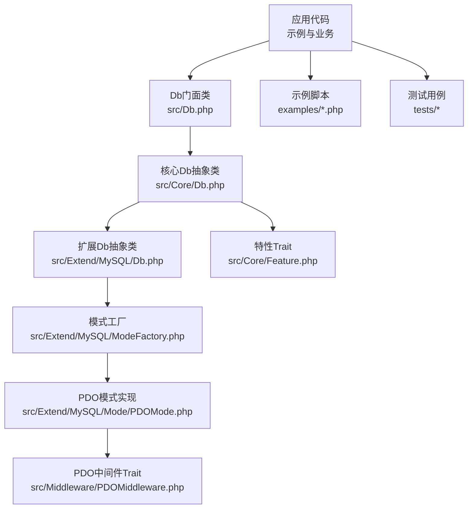
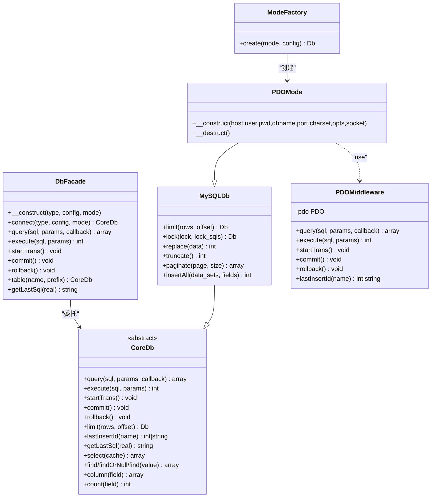
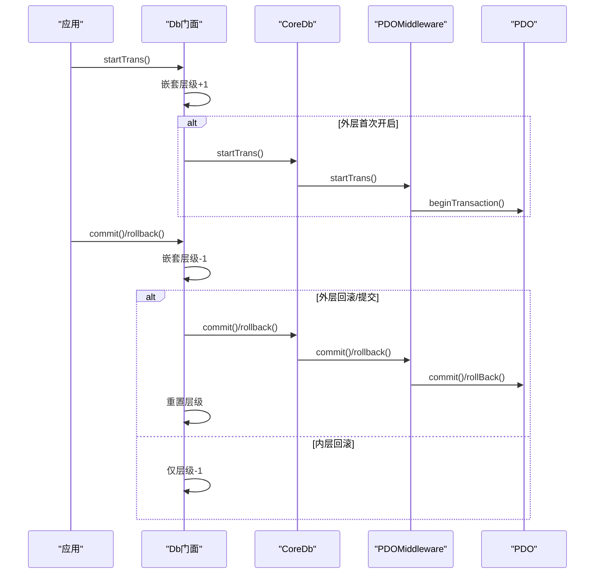
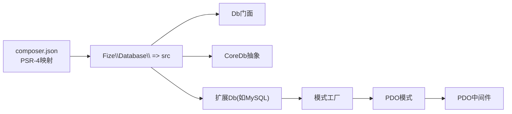

# 并发访问优化

<cite>
**本文引用的文件**
- [src/Db.php](file://src/Db.php)
- [src/Core/Db.php](file://src/Core/Db.php)
- [src/Core/Feature.php](file://src/Core/Feature.php)
- [src/Extend/MySQL/ModeFactory.php](file://src/Extend/MySQL/ModeFactory.php)
- [src/Extend/MySQL/Mode/PDOMode.php](file://src/Extend/MySQL/Mode/PDOMode.php)
- [src/Middleware/PDOMiddleware.php](file://src/Middleware/PDOMiddleware.php)
- [src/Extend/MySQL/Db.php](file://src/Extend/MySQL/Db.php)
- [src/Extend/PgSQL/Driver/PgSQL.php](file://src/Extend/PgSQL/Driver/PgSQL.php)
- [composer.json](file://composer.json)
- [examples/db_connect.php](file://examples/db_connect.php)
- [examples/db_select.php](file://examples/db_select.php)
- [tests/Extend/Oracle/Mode/TestOCIMode.php](file://tests/Extend/Oracle/Mode/TestOCIMode.php)
- [tests/Extend/SQLSRV/Mode/TestPDOMode.php](file://tests/Extend/SQLSRV/Mode/TestPDOMode.php)
</cite>

## 目录
1. [引言](#引言)
2. [项目结构](#项目结构)
3. [核心组件](#核心组件)
4. [架构总览](#架构总览)
5. [详细组件分析](#详细组件分析)
6. [依赖关系分析](#依赖关系分析)
7. [性能考量](#性能考量)
8. [故障排查指南](#故障排查指南)
9. [结论](#结论)
10. [附录](#附录)

## 引言
本文件聚焦于FizeDatabase在高并发环境下的性能优化与并发控制策略，围绕事务处理的并发优化（含嵌套事务）、锁机制与死锁预防、多线程环境下的连接管理与资源共享、以及连接池的线程安全性与并发访问控制展开。同时提供高并发场景下的性能调优建议、并发性能测试方法、瓶颈识别与解决方案。

## 项目结构
FizeDatabase采用分层+扩展模式：
- 核心层：抽象数据库接口与通用查询构建能力
- 扩展层：按数据库类型划分（MySQL、PgSQL、Oracle、SQLSRV等），每类提供多种连接模式（PDO、MySQLi、ODBC等）
- 中间件层：统一封装PDO相关操作（准备、执行、事务、回滚等）
- 示例与测试：演示连接、查询、事务等典型用法，并验证事务行为

图表来源
- [src/Db.php:1-141](file://src/Db.php#L1-L141)
- [src/Core/Db.php:1-800](file://src/Core/Db.php#L1-L800)
- [src/Extend/MySQL/Db.php:1-246](file://src/Extend/MySQL/Db.php#L1-L246)
- [src/Extend/MySQL/ModeFactory.php:1-82](file://src/Extend/MySQL/ModeFactory.php#L1-L82)
- [src/Extend/MySQL/Mode/PDOMode.php:1-53](file://src/Extend/MySQL/Mode/PDOMode.php#L1-L53)
- [src/Middleware/PDOMiddleware.php:1-129](file://src/Middleware/PDOMiddleware.php#L1-L129)
- [src/Core/Feature.php:1-33](file://src/Core/Feature.php#L1-L33)
- [examples/db_connect.php:1-39](file://examples/db_connect.php#L1-L39)
- [examples/db_select.php:1-22](file://examples/db_select.php#L1-L22)

章节来源
- [src/Db.php:1-141](file://src/Db.php#L1-L141)
- [src/Core/Db.php:1-800](file://src/Core/Db.php#L1-L800)
- [src/Extend/MySQL/Db.php:1-246](file://src/Extend/MySQL/Db.php#L1-L246)
- [src/Extend/MySQL/ModeFactory.php:1-82](file://src/Extend/MySQL/ModeFactory.php#L1-L82)
- [src/Extend/MySQL/Mode/PDOMode.php:1-53](file://src/Extend/MySQL/Mode/PDOMode.php#L1-L53)
- [src/Middleware/PDOMiddleware.php:1-129](file://src/Middleware/PDOMiddleware.php#L1-L129)
- [src/Core/Feature.php:1-33](file://src/Core/Feature.php#L1-L33)
- [examples/db_connect.php:1-39](file://examples/db_connect.php#L1-L39)
- [examples/db_select.php:1-22](file://examples/db_select.php#L1-L22)

## 核心组件
- 门面Db：提供静态入口，负责初始化默认连接、创建新连接、事务计数与委托核心Db执行SQL
- 核心Db：抽象数据库操作，提供查询构建、SQL组装、缓存、事务抽象接口
- 扩展Db（MySQL）：在核心基础上增加LIMIT、LOCK、批量插入、分页等MySQL特有能力
- 模式工厂：根据配置选择具体连接模式（PDO/MySQLi/ODBC）
- PDO模式：基于PDO的实现，封装连接、执行、事务、回滚、lastInsertId
- PDO中间件：统一的PDO操作封装，包含prepare/execute、fetch、事务控制
- 特性Trait：提供表名/字段名格式化钩子
- 示例与测试：展示连接、查询、事务的典型用法

章节来源
- [src/Db.php:1-141](file://src/Db.php#L1-L141)
- [src/Core/Db.php:1-800](file://src/Core/Db.php#L1-L800)
- [src/Extend/MySQL/Db.php:1-246](file://src/Extend/MySQL/Db.php#L1-L246)
- [src/Extend/MySQL/ModeFactory.php:1-82](file://src/Extend/MySQL/ModeFactory.php#L1-L82)
- [src/Extend/MySQL/Mode/PDOMode.php:1-53](file://src/Extend/MySQL/Mode/PDOMode.php#L1-L53)
- [src/Middleware/PDOMiddleware.php:1-129](file://src/Middleware/PDOMiddleware.php#L1-L129)
- [src/Core/Feature.php:1-33](file://src/Core/Feature.php#L1-L33)

## 架构总览
FizeDatabase通过“门面 + 抽象核心 + 扩展实现 + 模式工厂 + 中间件”的分层设计，在保证跨数据库兼容的同时，将并发相关的控制点集中在PDO中间件与核心Db的事务接口中。

图表来源
- [src/Db.php:1-141](file://src/Db.php#L1-L141)
- [src/Core/Db.php:1-800](file://src/Core/Db.php#L1-L800)
- [src/Extend/MySQL/Db.php:1-246](file://src/Extend/MySQL/Db.php#L1-L246)
- [src/Extend/MySQL/ModeFactory.php:1-82](file://src/Extend/MySQL/ModeFactory.php#L1-L82)
- [src/Extend/MySQL/Mode/PDOMode.php:1-53](file://src/Extend/MySQL/Mode/PDOMode.php#L1-L53)
- [src/Middleware/PDOMiddleware.php:1-129](file://src/Middleware/PDOMiddleware.php#L1-L129)

## 详细组件分析

### 事务处理与嵌套事务的并发优化
- 嵌套事务计数：门面Db维护事务嵌套层级，仅在最外层开启/提交/回滚事务，避免重复提交或过早释放连接
- 事务边界控制：核心Db提供抽象事务接口；PDO中间件通过底层PDO事务API实现
- 测试验证：Oracle与SQLSRV测试覆盖了startTrans/commit/rollback的基本流程，确保不同驱动的一致性

图表来源
- [src/Db.php:84-114](file://src/Db.php#L84-L114)
- [src/Middleware/PDOMiddleware.php:98-117](file://src/Middleware/PDOMiddleware.php#L98-L117)

章节来源
- [src/Db.php:84-114](file://src/Db.php#L84-L114)
- [src/Middleware/PDOMiddleware.php:98-117](file://src/Middleware/PDOMiddleware.php#L98-L117)
- [tests/Extend/Oracle/Mode/TestOCIMode.php:55-107](file://tests/Extend/Oracle/Mode/TestOCIMode.php#L55-L107)
- [tests/Extend/SQLSRV/Mode/TestPDOMode.php:88-125](file://tests/Extend/SQLSRV/Mode/TestPDOMode.php#L88-L125)

### 锁机制与死锁预防
- MySQL扩展Db提供lock方法，允许显式指定表级写锁，适用于需要强一致性的写操作
- 建议在高并发写场景中配合事务使用，尽量缩短事务时间，减少锁持有窗口
- 死锁预防原则：
  - 统一锁顺序：对多表更新时按固定顺序加锁
  - 缩短事务：尽早提交或回滚，避免长时间持有锁
  - 重试策略：对可重试的死锁错误进行指数退避重试

章节来源
- [src/Extend/MySQL/Db.php:47-65](file://src/Extend/MySQL/Db.php#L47-L65)

### 多线程环境下的连接管理与资源共享
- 连接生命周期：PDO模式在析构时释放PDO资源，避免资源泄漏
- 连接复用：通过门面Db的静态存储与工厂模式，可在进程内复用连接配置
- 跨线程注意：PDO连接非线程安全，多线程环境下应避免共享同一PDO实例；建议每个线程独立创建连接或使用线程本地存储

章节来源
- [src/Extend/MySQL/Mode/PDOMode.php:47-51](file://src/Extend/MySQL/Mode/PDOMode.php#L47-L51)
- [src/Middleware/PDOMiddleware.php:39-42](file://src/Middleware/PDOMiddleware.php#L39-L42)

### 查询缓存与并发一致性
- 核心Db提供查询结果缓存：以最终SQL为键缓存结果集，避免重复查询
- 并发一致性：缓存作用域为进程内静态变量，多线程共享同一缓存可能引发竞态；建议在多线程环境中禁用或隔离缓存

章节来源
- [src/Core/Db.php:94-95](file://src/Core/Db.php#L94-L95)
- [src/Core/Db.php:699-711](file://src/Core/Db.php#L699-L711)

### PostgreSQL异步与连接状态管理
- PgSQL驱动提供连接轮询、忙碌状态、连接重置、事务状态等能力，便于在高并发下检测连接健康与状态
- 建议结合连接池与心跳检测，及时剔除异常连接

章节来源
- [src/Extend/PgSQL/Driver/PgSQL.php:67-120](file://src/Extend/PgSQL/Driver/PgSQL.php#L67-L120)
- [src/Extend/PgSQL/Driver/PgSQL.php:608-611](file://src/Extend/PgSQL/Driver/PgSQL.php#L608-L611)

## 依赖关系分析
- Composer自动加载PSR-4映射至src目录，确保模块化组织清晰
- 扩展模块按数据库类型与模式拆分，降低耦合度
- PDO中间件作为PDO能力的统一出口，屏蔽不同驱动差异

图表来源
- [composer.json:11-18](file://composer.json#L11-L18)
- [src/Db.php:1-141](file://src/Db.php#L1-L141)
- [src/Core/Db.php:1-800](file://src/Core/Db.php#L1-L800)
- [src/Extend/MySQL/Db.php:1-246](file://src/Extend/MySQL/Db.php#L1-L246)
- [src/Extend/MySQL/ModeFactory.php:1-82](file://src/Extend/MySQL/ModeFactory.php#L1-L82)
- [src/Extend/MySQL/Mode/PDOMode.php:1-53](file://src/Extend/MySQL/Mode/PDOMode.php#L1-L53)
- [src/Middleware/PDOMiddleware.php:1-129](file://src/Middleware/PDOMiddleware.php#L1-L129)

章节来源
- [composer.json:11-18](file://composer.json#L11-L18)

## 性能考量
- 连接池与并发访问控制
  - 建议在应用层实现连接池，限制最大连接数，避免数据库连接耗尽
  - 对热点查询启用查询缓存（谨慎用于多线程环境）
- 事务与锁
  - 嵌套事务仅在最外层提交/回滚，减少无效提交
  - 写操作使用显式锁时需配合事务，缩短事务窗口
- 查询优化
  - 使用参数化查询，避免拼接SQL
  - 合理使用LIMIT与索引，避免全表扫描
- 超时与重试
  - 设置合理的查询超时与连接超时
  - 对可重试的网络/锁冲突错误进行指数退避重试
- 监控与测试
  - 压测工具：ab、wrk、JMeter等
  - 关注指标：QPS、P95/P99延迟、连接池命中率、锁等待时间、死锁次数

## 故障排查指南
- 事务相关
  - 确认嵌套事务层级是否正确，避免提前提交或回滚
  - 不同驱动的事务行为需通过测试验证（见测试用例）
- 连接问题
  - PDO析构释放资源，避免资源泄漏
  - 多线程共享PDO会导致不可预期行为，应避免
- 缓存一致性
  - 多线程共享静态缓存可能导致竞态，必要时禁用或隔离
- PostgreSQL连接状态
  - 使用轮询与状态检测，及时发现并剔除异常连接

章节来源
- [src/Middleware/PDOMiddleware.php:39-42](file://src/Middleware/PDOMiddleware.php#L39-L42)
- [src/Extend/PgSQL/Driver/PgSQL.php:67-120](file://src/Extend/PgSQL/Driver/PgSQL.php#L67-L120)
- [tests/Extend/Oracle/Mode/TestOCIMode.php:55-107](file://tests/Extend/Oracle/Mode/TestOCIMode.php#L55-L107)
- [tests/Extend/SQLSRV/Mode/TestPDOMode.php:88-125](file://tests/Extend/SQLSRV/Mode/TestPDOMode.php#L88-L125)

## 结论
FizeDatabase通过门面+抽象+中间件的分层设计，将并发控制的关键点集中在PDO中间件与核心Db的事务接口中。在高并发场景下，建议结合连接池、缩短事务窗口、合理使用锁与缓存、设置超时与重试策略，并通过压测与监控持续优化。

## 附录
- 快速开始示例
  - 连接与查询：参见示例脚本
  - 事务基本流程：参见测试用例

章节来源
- [examples/db_connect.php:1-39](file://examples/db_connect.php#L1-L39)
- [examples/db_select.php:1-22](file://examples/db_select.php#L1-L22)
- [tests/Extend/Oracle/Mode/TestOCIMode.php:55-107](file://tests/Extend/Oracle/Mode/TestOCIMode.php#L55-L107)
- [tests/Extend/SQLSRV/Mode/TestPDOMode.php:88-125](file://tests/Extend/SQLSRV/Mode/TestPDOMode.php#L88-L125)