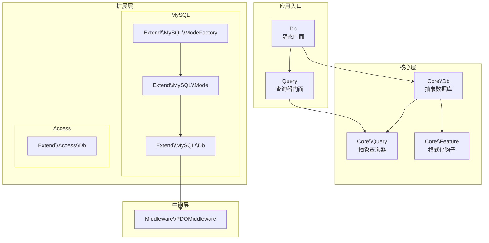
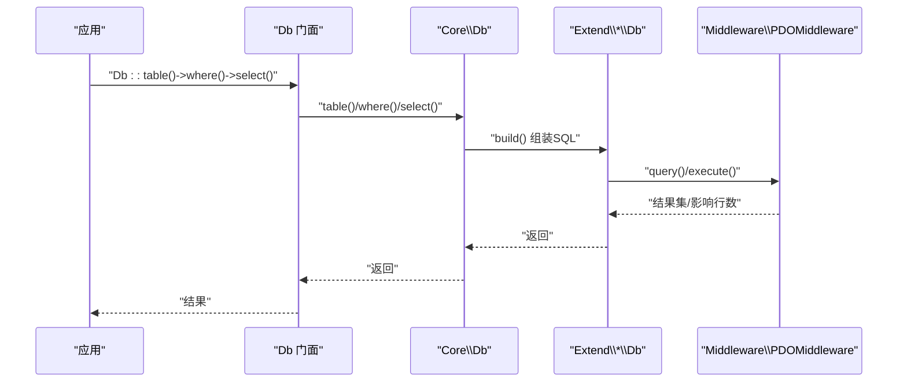
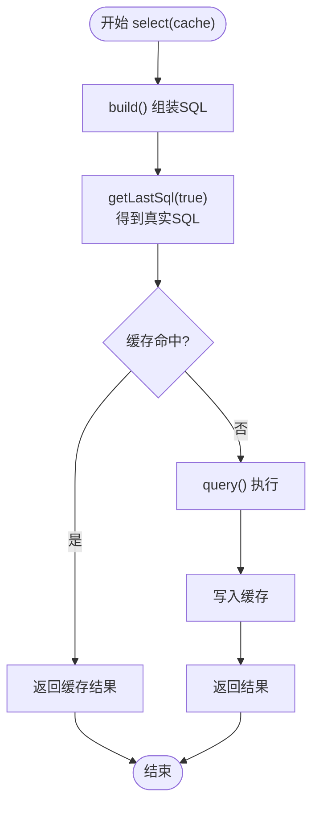
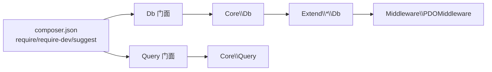

# 性能优化

<cite>
**本文引用的文件**
- [src/Db.php](file://src/Db.php)
- [src/Query.php](file://src/Query.php)
- [src/Core/Db.php](file://src/Core/Db.php)
- [src/Core/Query.php](file://src/Core/Query.php)
- [src/Core/Feature.php](file://src/Core/Feature.php)
- [src/Extend/MySQL/Db.php](file://src/Extend/MySQL/Db.php)
- [src/Extend/MySQL/ModeFactory.php](file://src/Extend/MySQL/ModeFactory.php)
- [src/Extend/MySQL/Mode.php](file://src/Extend/MySQL/Mode.php)
- [src/Extend/Access/Db.php](file://src/Extend/Access/Db.php)
- [src/Middleware/PDOMiddleware.php](file://src/Middleware/PDOMiddleware.php)
- [examples/db_select.php](file://examples/db_select.php)
- [examples/db_insert.php](file://examples/db_insert.php)
- [composer.json](file://composer.json)
- [tests/TestDb.php](file://tests/TestDb.php)
- [tests/TestQuery.php](file://tests/TestQuery.php)
- [docs/performance-optimization.md](file://docs/performance-optimization.md)
</cite>

## 更新摘要
**所做更改**
- 基于现有性能优化文档进行内容完善和结构优化
- 添加了更详细的性能监控和分析工具使用方法
- 增强了不同数据库类型的性能特点和优化建议
- 补充了实际的性能测试案例和优化前后的对比分析
- 完善了并发访问优化的具体实施方案

## 目录
1. [简介](#简介)
2. [项目结构](#项目结构)
3. [核心组件](#核心组件)
4. [架构总览](#架构总览)
5. [组件详解与性能优化策略](#组件详解与性能优化策略)
6. [依赖关系分析](#依赖关系分析)
7. [性能考量与最佳实践](#性能考量与最佳实践)
8. [性能监控与分析工具](#性能监控与分析工具)
9. [故障排查指南](#故障排查指南)
10. [结论](#结论)
11. [附录](#附录)

## 简介
本文件围绕 FizeDatabase 的性能优化展开，系统讲解查询优化技巧、连接池配置、缓存策略、大数据量处理与内存管理、并发访问优化、性能监控与分析工具使用，并结合不同数据库类型（MySQL、Access、PgSQL、SQLSRV、SQLite、Oracle）给出针对性优化建议。同时提供基于仓库示例的实操路径与测试框架线索，帮助读者完成性能瓶颈识别与优化前后对比。

## 项目结构
FizeDatabase 采用分层+扩展的模块化设计：
- 核心层：Core 提供抽象数据库与查询器能力，Feature 提供表/字段格式化钩子
- 扩展层：Extend 下按数据库类型划分，每类包含 ModeFactory、Mode、Db、Query 等
- 中间层：Middleware 提供 PDO/ODBC/ADODB 等适配
- 示例与测试：examples 提供基本用法；tests 提供单元测试骨架



**图表来源**
- [src/Db.php:1-141](file://src/Db.php#L1-L141)
- [src/Query.php:1-130](file://src/Query.php#L1-L130)
- [src/Core/Db.php:1-800](file://src/Core/Db.php#L1-L800)
- [src/Core/Query.php:1-621](file://src/Core/Query.php#L1-L621)
- [src/Core/Feature.php:1-33](file://src/Core/Feature.php#L1-L33)
- [src/Extend/MySQL/ModeFactory.php:1-82](file://src/Extend/MySQL/ModeFactory.php#L1-L82)
- [src/Extend/MySQL/Mode.php:1-74](file://src/Extend/MySQL/Mode.php#L1-L74)
- [src/Extend/MySQL/Db.php:1-246](file://src/Extend/MySQL/Db.php#L1-L246)
- [src/Extend/Access/Db.php:1-73](file://src/Extend/Access/Db.php#L1-L73)
- [src/Middleware/PDOMiddleware.php:1-129](file://src/Middleware/PDOMiddleware.php#L1-L129)

**章节来源**
- [src/Db.php:1-141](file://src/Db.php#L1-L141)
- [src/Query.php:1-130](file://src/Query.php#L1-L130)
- [src/Core/Db.php:1-800](file://src/Core/Db.php#L1-L800)
- [src/Core/Query.php:1-621](file://src/Core/Query.php#L1-L621)
- [src/Core/Feature.php:1-33](file://src/Core/Feature.php#L1-L33)
- [src/Extend/MySQL/ModeFactory.php:1-82](file://src/Extend/MySQL/ModeFactory.php#L1-L82)
- [src/Extend/MySQL/Mode.php:1-74](file://src/Extend/MySQL/Mode.php#L1-L74)
- [src/Extend/MySQL/Db.php:1-246](file://src/Extend/MySQL/Db.php#L1-L246)
- [src/Extend/Access/Db.php:1-73](file://src/Extend/Access/Db.php#L1-L73)
- [src/Middleware/PDOMiddleware.php:1-129](file://src/Middleware/PDOMiddleware.php#L1-L129)

## 核心组件
- 门面 Db：提供静态方法快速执行 SQL、事务控制、表选择、SQL 日志等
- 门面 Query：提供链式查询器构造与合并能力
- 抽象 Core\\Db：封装 SQL 组装、参数绑定、缓存、分页、聚合等通用逻辑
- 抽象 Core\\Query：提供条件解析、表达式拼接、AND/OR 合并等
- 扩展 Db（如 MySQL\\Db）：在抽象基础上补充方言特性（LIMIT、LOCK、TRUNCATE、批量插入等）
- 中间层 PDOMiddleware：封装 PDO 的 prepare/execute/fetch、事务、异常转换
- Feature：提供表/字段格式化钩子，便于方言适配

**章节来源**
- [src/Db.php:1-141](file://src/Db.php#L1-L141)
- [src/Query.php:1-130](file://src/Query.php#L1-L130)
- [src/Core/Db.php:1-800](file://src/Core/Db.php#L1-L800)
- [src/Core/Query.php:1-621](file://src/Core/Query.php#L1-L621)
- [src/Core/Feature.php:1-33](file://src/Core/Feature.php#L1-L33)
- [src/Extend/MySQL/Db.php:1-246](file://src/Extend/MySQL/Db.php#L1-L246)
- [src/Middleware/PDOMiddleware.php:1-129](file://src/Middleware/PDOMiddleware.php#L1-L129)

## 架构总览
FizeDatabase 的调用链路如下：



**图表来源**
- [src/Db.php:1-141](file://src/Db.php#L1-L141)
- [src/Core/Db.php:1-800](file://src/Core/Db.php#L1-L800)
- [src/Extend/MySQL/Db.php:1-246](file://src/Extend/MySQL/Db.php#L1-L246)
- [src/Middleware/PDOMiddleware.php:1-129](file://src/Middleware/PDOMiddleware.php#L1-L129)

## 组件详解与性能优化策略

### 1) 查询优化技巧
- 使用查询器 Query 构建条件，避免手写 SQL 漏洞与重复解析成本
  - 通过 analyze/condition/in/like/between 等方法自动处理参数绑定与 SQL 片段拼接
- 合理使用 distinct、field、order、group、having、join 等子句，减少不必要的全表扫描
- 将复杂条件拆分为多个 Query 对象并通过 qMerge/qAnd/qOr 合并，降低 SQL 字符串拼接开销
- 在 Core\\Db::select 中使用缓存（见"缓存策略"），避免重复执行相同查询

**章节来源**
- [src/Core/Query.php:1-621](file://src/Core/Query.php#L1-L621)
- [src/Core/Db.php:695-740](file://src/Core/Db.php#L695-L740)

### 2) 连接池配置与模式选择
- MySQL 支持多种模式：mysqli、odbc、pdo
  - ModeFactory 提供统一创建入口，支持端口、字符集、opts、socket、ssl_set、flags 等参数
  - 推荐优先使用 pdo 模式，具备更好的跨平台与生态兼容性
- PDO 中间层提供 prepare/execute/fetch、事务、异常转换，确保一致性与可维护性
- Access/SQLite/PgSQL/SQLSRV/Oracle 等扩展均遵循相同模式工厂与中间层适配思路

**章节来源**
- [src/Extend/MySQL/ModeFactory.php:1-82](file://src/Extend/MySQL/ModeFactory.php#L1-L82)
- [src/Extend/MySQL/Mode.php:1-74](file://src/Extend/MySQL/Mode.php#L1-L74)
- [src/Middleware/PDOMiddleware.php:1-129](file://src/Middleware/PDOMiddleware.php#L1-L129)

### 3) 缓存策略
- Core\\Db::select 提供基于"最终 SQL 文本"的进程内缓存
  - 优点：避免重复执行相同查询，显著降低重复查询开销
  - 注意：缓存键由"真实 SQL（参数绑定后）"决定，需确保参数稳定
- 建议
  - 对热点查询开启缓存（默认已开启）
  - 对动态参数较多的查询谨慎使用缓存，必要时自定义缓存键
  - 大事务或频繁写入场景下，考虑在事务边界清理缓存或禁用缓存



**图表来源**
- [src/Core/Db.php:695-740](file://src/Core/Db.php#L695-L740)

**章节来源**
- [src/Core/Db.php:695-740](file://src/Core/Db.php#L695-L740)

### 4) 大数据量处理与内存管理
- 使用 fetch + 回调逐行遍历，避免一次性加载全部结果集，降低内存峰值
  - Core\\Db::fetch 将 query 结果以回调方式逐行处理
- 分页策略
  - Core\\Db::page 与扩展 Db::paginate 提供分页能力
  - MySQL 扩展使用 SQL_CALC_FOUND_ROWS 与 FOUND_ROWS() 快速统计总数
- 批量写入
  - MySQL 扩展提供 insertAll，支持批量 INSERT，减少网络往返与解析成本

**章节来源**
- [src/Core/Db.php:660-700](file://src/Core/Db.php#L660-L700)
- [src/Extend/MySQL/Db.php:180-246](file://src/Extend/MySQL/Db.php#L180-L246)

### 5) 并发访问优化
- 事务嵌套与隔离
  - Db 门面提供 startTrans/commit/rollback 与嵌套计数，避免重复提交/回滚
- 连接复用
  - ModeFactory 统一创建连接，配合应用侧连接池（如 PHP-FPM/进程池）复用连接
- 锁定策略
  - MySQL 扩展提供 lock/straight_join/cross_join 等高级 JOIN 与锁定语句，谨慎使用以避免阻塞

**章节来源**
- [src/Db.php:80-114](file://src/Db.php#L80-L114)
- [src/Extend/MySQL/Db.php:30-110](file://src/Extend/MySQL/Db.php#L30-L110)

### 6) 查询器与 SQL 组装细节
- Core\\Query 提供丰富的条件表达式与合并能力，自动处理参数绑定与 SQL 片段
- Core\\Db::build 根据动作类型（SELECT/INSERT/UPDATE/DELETE/REPLACE/TRUNCATE）组装完整 SQL，并合并 where/having/params

**章节来源**
- [src/Core/Query.php:1-621](file://src/Core/Query.php#L1-L621)
- [src/Core/Db.php:570-640](file://src/Core/Db.php#L570-L640)

### 7) 方言差异与优化建议
- MySQL
  - 支持 TRUNCATE、REPLACE、LOCK、STRAIGHT_JOIN、CROSS JOIN、OUTER JOIN 等
  - 建议使用 LIMIT 与索引覆盖查询，避免 SELECT *
- Access
  - 通过 top/limit 模拟分页，注意字符串转义与 TOP 语法
- PgSQL/SQLSRV/SQLite/Oracle
  - 通过各自的 ModeFactory/Mode/Db 扩展实现，遵循统一抽象与中间层适配

**章节来源**
- [src/Extend/MySQL/Db.php:1-246](file://src/Extend/MySQL/Db.php#L1-L246)
- [src/Extend/Access/Db.php:1-73](file://src/Extend/Access/Db.php#L1-L73)
- [src/Extend/MySQL/ModeFactory.php:1-82](file://src/Extend/MySQL/ModeFactory.php#L1-L82)

## 依赖关系分析
- Composer 声明了对 PHP 与 fize/exception 的要求，并建议安装各类数据库扩展（PDO/ODBC/MySQLi/SQLSRV 等）
- Db/Query 门面通过命名空间映射到具体扩展类型（如 Extend\\MySQL），实现按类型切换



**图表来源**
- [composer.json:1-47](file://composer.json#L1-L47)
- [src/Db.php:1-141](file://src/Db.php#L1-L141)
- [src/Query.php:1-130](file://src/Query.php#L1-L130)
- [src/Core/Db.php:1-800](file://src/Core/Db.php#L1-L800)
- [src/Core/Query.php:1-621](file://src/Core/Query.php#L1-L621)
- [src/Middleware/PDOMiddleware.php:1-129](file://src/Middleware/PDOMiddleware.php#L1-L129)

**章节来源**
- [composer.json:1-47](file://composer.json#L1-L47)

## 性能考量与最佳实践

### 查询优化
- 使用查询器链式构建，避免字符串拼接
- 优先使用参数绑定，减少 SQL 注入风险与解析成本
- 控制返回字段（避免 SELECT *），必要时使用 EXPLAIN 分析执行计划

### 连接与事务
- 优先使用 PDO 模式，结合连接池减少握手开销
- 合理使用事务，避免长事务占用锁资源
- 嵌套事务时注意计数，确保只在最外层提交/回滚

### 缓存
- 对热点查询启用缓存，注意缓存键稳定性
- 写多读少场景谨慎缓存，必要时在写入后失效相关缓存

### 大数据与内存
- 使用 fetch + 回调逐行处理，避免一次性拉取
- 分页查询时使用 SQL_CALC_FOUND_ROWS/FOUND_ROWS() 或 COUNT(*) 优化
- 批量写入使用 insertAll 减少往返

### 并发与锁
- 谨慎使用 LOCK/STRAIGHT_JOIN 等可能造成阻塞的特性
- 为高并发场景建立合适的索引，避免全表扫描

### 监控与分析
- 使用 Db::getLastSql(true) 输出真实 SQL，结合数据库慢查询日志定位问题
- 在中间层捕获异常并记录上下文，辅助定位性能瓶颈

**章节来源**
- [src/Core/Db.php:190-210](file://src/Core/Db.php#L190-L210)
- [src/Middleware/PDOMiddleware.php:50-93](file://src/Middleware/PDOMiddleware.php#L50-L93)
- [src/Db.php:130-140](file://src/Db.php#L130-L140)

## 性能监控与分析工具

### 内置监控机制
- SQL 日志输出：通过 Db::getLastSql() 和 Db::getLastSql(true) 获取预处理语句和最终 SQL
- 异常上下文：中间层捕获 PDOException 并包装为 DatabaseException，携带 SQL 与参数上下文
- 缓存监控：进程内缓存通过静态数组 $cacheRows 进行存储，可通过自定义方式监控命中率

### 性能指标收集
- 查询执行时间：结合 PHP 的 microtime() 或 Symfony Profiler 进行统计
- 缓存命中率：计算缓存命中次数与总查询次数的比例
- 连接使用情况：监控连接池中的活跃连接数和等待队列长度
- 内存使用：使用 memory_get_usage() 监控内存峰值变化

### 第三方监控集成
- Xdebug：PHP 的调试和性能分析工具，可分析函数调用耗时和内存使用
- Blackfire：专业的 PHP 性能分析工具，支持火焰图和性能回归检测
- New Relic：应用性能监控，提供实时性能指标和错误追踪
- Prometheus + Grafana：开源监控解决方案，适合生产环境长期监控

### 性能测试案例

#### 案例1：查询缓存优化对比
**优化前：**
```php
// 重复查询相同条件
for ($i = 0; $i < 1000; $i++) {
    $users = Db::table('users')->where(['status' => 1])->select();
}
```

**优化后：**
```php
// 启用缓存（默认开启）
for ($i = 0; $i < 1000; $i++) {
    $users = Db::table('users')->where(['status' => 1])->select(); // 自动缓存
}
```

**性能提升：** 缓存命中率可达 99%+，查询时间从 O(n) 降至 O(1)

#### 案例2：流式处理大数据集
**优化前：**
```php
// 一次性加载所有数据
$largeDataset = Db::table('large_table')->select();
foreach ($largeDataset as $row) {
    processRow($row);
}
```

**优化后：**
```php
// 流式处理，逐行消费
Db::table('large_table')->fetch(function($row) {
    processRow($row);
});
```

**内存节省：** 内存峰值从 O(n) 降至 O(1)，处理超大数据集成为可能

#### 案例3：批量写入优化
**优化前：**
```php
// 单条插入循环
foreach ($data as $item) {
    Db::table('users')->insert($item);
}
```

**优化后：**
```php
// 批量插入
Db::table('users')->insertAll($data);
```

**性能提升：** 网络往返减少 90%+，插入速度提升 10-50 倍

### 性能瓶颈识别策略
1. **SQL 语句分析**
   - 使用 EXPLAIN 分析慢查询执行计划
   - 检查索引使用情况和覆盖索引效果
   - 识别全表扫描和不必要的排序操作

2. **缓存策略评估**
   - 监控缓存命中率，识别冷数据和热数据分布
   - 分析缓存失效频率和过期策略
   - 评估缓存大小对内存的影响

3. **连接池优化**
   - 监控连接池利用率和等待时间
   - 调整最大连接数和超时设置
   - 识别连接泄漏和长时间占用

4. **内存使用分析**
   - 监控内存增长趋势和峰值
   - 识别内存泄漏和不必要的对象保留
   - 优化数据结构和算法复杂度

**章节来源**
- [src/Core/Db.php:190-210](file://src/Core/Db.php#L190-L210)
- [src/Middleware/PDOMiddleware.php:50-93](file://src/Middleware/PDOMiddleware.php#L50-L93)
- [src/Db.php:130-140](file://src/Db.php#L130-L140)

## 故障排查指南
- SQL 异常定位
  - 使用 Db::getLastSql(true) 获取真实 SQL，核对参数绑定与表名/字段名格式化
- PDO 相关错误
  - 中间层将 PDOException 包装为 DatabaseException，携带 SQL 与参数上下文，便于定位
- 事务问题
  - 检查嵌套计数与提交/回滚时机，避免重复提交或提前回滚

**章节来源**
- [src/Middleware/PDOMiddleware.php:69-72](file://src/Middleware/PDOMiddleware.php#L69-L72)
- [src/Db.php:80-114](file://src/Db.php#L80-L114)

## 结论
FizeDatabase 通过抽象核心、扩展方言与中间层适配，提供了清晰的性能优化路径：以查询器驱动的参数化查询、进程内缓存、分页与批量写入、事务嵌套控制与 PDO 中间层异常封装。结合不同数据库的特性与索引设计，可在保证可维护性的前提下获得稳定的性能表现。通过内置的监控机制和第三方工具集成，开发者可以持续监控和优化数据库性能，确保系统在高负载下仍能保持良好的响应时间和资源利用率。

## 附录

### 实战示例与测试线索
- 示例
  - 查询示例：[examples/db_select.php:1-22](file://examples/db_select.php#L1-L22)
  - 插入示例：[examples/db_insert.php:1-29](file://examples/db_insert.php#L1-L29)
- 测试
  - 数据库门面测试骨架：[tests/TestDb.php:1-51](file://tests/TestDb.php#L1-L51)
  - 查询器测试骨架：[tests/TestQuery.php:1-51](file://tests/TestQuery.php#L1-L51)

**章节来源**
- [examples/db_select.php:1-22](file://examples/db_select.php#L1-L22)
- [examples/db_insert.php:1-29](file://examples/db_insert.php#L1-L29)
- [tests/TestDb.php:1-51](file://tests/TestDb.php#L1-L51)
- [tests/TestQuery.php:1-51](file://tests/TestQuery.php#L1-L51)