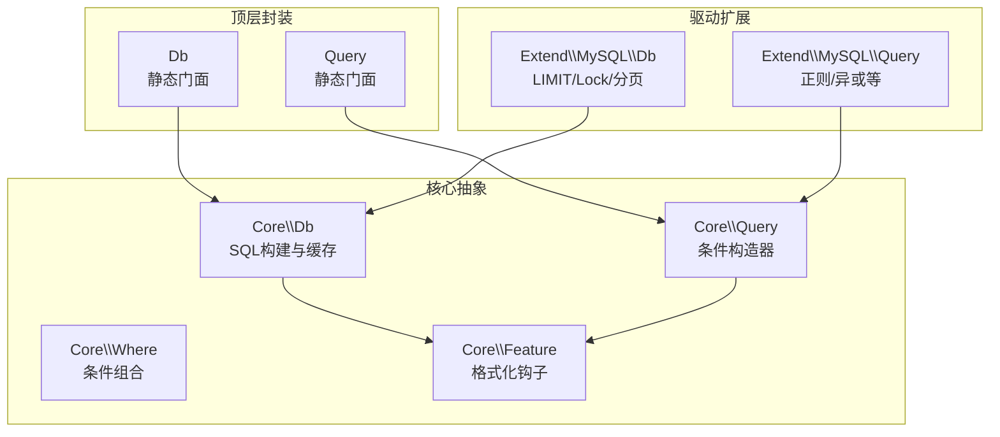
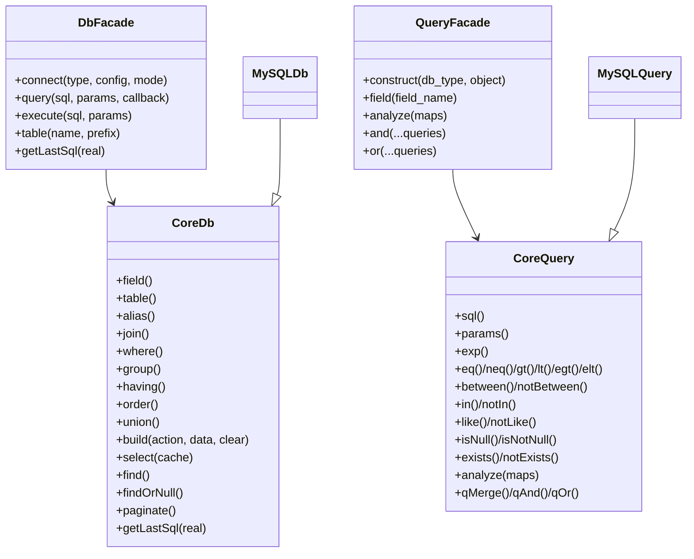
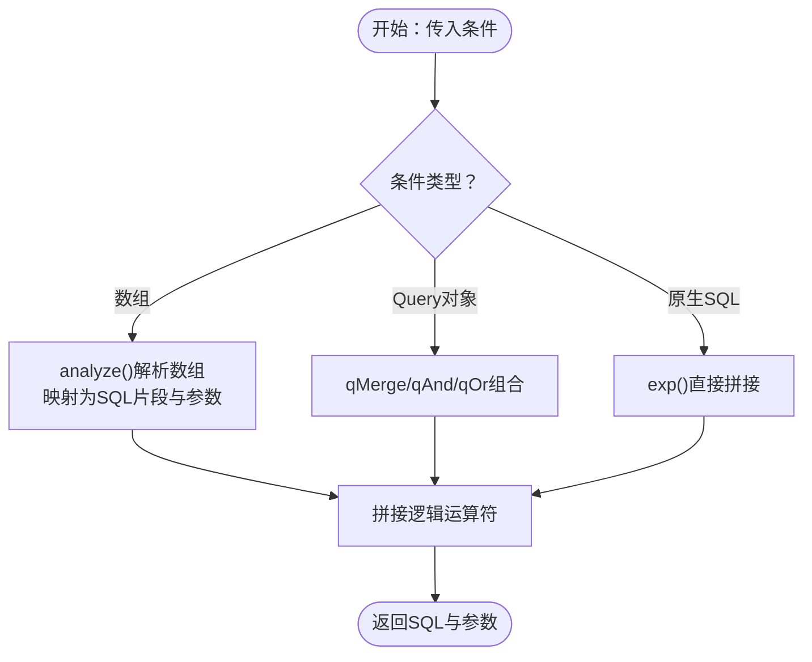
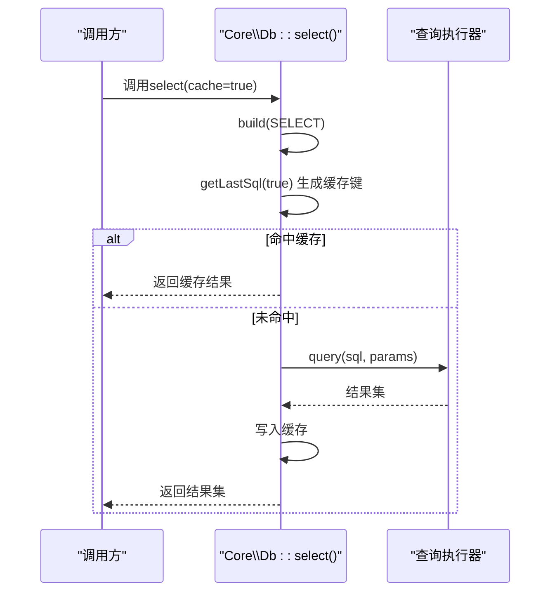

# 查询优化

<cite>
**本文引用的文件**
- [src/Db.php](file://src/Db.php)
- [src/Query.php](file://src/Query.php)
- [src/Core/Db.php](file://src/Core/Db.php)
- [src/Core/Query.php](file://src/Core/Query.php)
- [src/Core/Where.php](file://src/Core/Where.php)
- [src/Core/Feature.php](file://src/Core/Feature.php)
- [src/Extend/MySQL/Db.php](file://src/Extend/MySQL/Db.php)
- [src/Extend/MySQL/Query.php](file://src/Extend/MySQL/Query.php)
- [examples/db_select.php](file://examples/db_select.php)
- [examples/db_paginate.php](file://examples/db_paginate.php)
- [tests/Core/TestQuery.php](file://tests/Core/TestQuery.php)
- [composer.json](file://composer.json)
</cite>

## 目录
1. [简介](#简介)
2. [项目结构](#项目结构)
3. [核心组件](#核心组件)
4. [架构总览](#架构总览)
5. [详细组件分析](#详细组件分析)
6. [依赖关系分析](#依赖关系分析)
7. [性能考量与优化建议](#性能考量与优化建议)
8. [故障排查指南](#故障排查指南)
9. [结论](#结论)
10. [附录](#附录)

## 简介
本文件聚焦于FizeDatabase的查询优化策略与最佳实践，系统阐述SQL语句构建过程中的性能优化技巧，覆盖WHERE条件高效构建、JOIN查询优化、GROUP BY与HAVING的性能考虑；详解查询缓存机制（select()方法中的缓存策略、缓存失效与容量控制）；并结合实际示例与测试用例，给出避免N+1查询、优化复杂嵌套查询、合理使用索引提示的方法，以及查询执行计划分析、慢查询识别与优化建议。

## 项目结构
FizeDatabase采用分层与扩展架构：
- 顶层封装：Db与Query静态门面，面向业务快速调用
- 核心抽象：Core层定义Db、Query、Where、Feature等抽象与通用能力
- 驱动扩展：Extend层按数据库类型（MySQL、PgSQL、Oracle、SQLSRV、SQLite、Access/ODBC）提供具体实现
- 示例与测试：examples演示典型查询，tests验证查询器行为

**图示来源**
- [src/Db.php:1-141](file://src/Db.php#L1-L141)
- [src/Query.php:1-130](file://src/Query.php#L1-L130)
- [src/Core/Db.php:1-941](file://src/Core/Db.php#L1-L941)
- [src/Core/Query.php:1-621](file://src/Core/Query.php#L1-L621)
- [src/Core/Where.php:1-66](file://src/Core/Where.php#L1-L66)
- [src/Core/Feature.php:1-33](file://src/Core/Feature.php#L1-L33)
- [src/Extend/MySQL/Db.php:1-246](file://src/Extend/MySQL/Db.php#L1-L246)
- [src/Extend/MySQL/Query.php:1-91](file://src/Extend/MySQL/Query.php#L1-L91)

**章节来源**
- [src/Db.php:1-141](file://src/Db.php#L1-L141)
- [src/Query.php:1-130](file://src/Query.php#L1-L130)
- [src/Core/Db.php:1-941](file://src/Core/Db.php#L1-L941)
- [src/Core/Query.php:1-621](file://src/Core/Query.php#L1-L621)
- [src/Core/Where.php:1-66](file://src/Core/Where.php#L1-L66)
- [src/Core/Feature.php:1-33](file://src/Core/Feature.php#L1-L33)
- [src/Extend/MySQL/Db.php:1-246](file://src/Extend/MySQL/Db.php#L1-L246)
- [src/Extend/MySQL/Query.php:1-91](file://src/Extend/MySQL/Query.php#L1-L91)

## 核心组件
- Db与Query静态门面：提供便捷的SQL操作入口与查询器构造
- Core\\Db：负责SQL构建、参数绑定、缓存、分页、聚合等
- Core\\Query：条件构造器，支持多种比较、集合、范围、EXISTS/HAVING等
- Extend\\MySQL\\Db/Query：MySQL特有能力（LIMIT、Lock、正则、XOR等）
- Feature：格式化表/字段名的钩子，便于适配不同数据库

关键点：
- select()方法内置查询缓存，基于最终真实SQL作为缓存键
- where()/having()支持数组、Query对象与原生SQL三种输入，统一解析为占位符SQL与参数数组
- build()按SELECT/INSERT/UPDATE/DELETE组装完整SQL，拼接JOIN/GROUP/HAVING/ORDER/UNION等子句

**章节来源**
- [src/Db.php:1-141](file://src/Db.php#L1-L141)
- [src/Query.php:1-130](file://src/Query.php#L1-L130)
- [src/Core/Db.php:696-740](file://src/Core/Db.php#L696-L740)
- [src/Core/Query.php:1-621](file://src/Core/Query.php#L1-L621)
- [src/Extend/MySQL/Db.php:1-246](file://src/Extend/MySQL/Db.php#L1-L246)
- [src/Extend/MySQL/Query.php:1-91](file://src/Extend/MySQL/Query.php#L1-L91)

## 架构总览

**图示来源**
- [src/Db.php:1-141](file://src/Db.php#L1-L141)
- [src/Query.php:1-130](file://src/Query.php#L1-L130)
- [src/Core/Db.php:1-941](file://src/Core/Db.php#L1-L941)
- [src/Core/Query.php:1-621](file://src/Core/Query.php#L1-L621)
- [src/Extend/MySQL/Db.php:1-246](file://src/Extend/MySQL/Db.php#L1-L246)
- [src/Extend/MySQL/Query.php:1-91](file://src/Extend/MySQL/Query.php#L1-L91)

## 详细组件分析

### 查询器（Core\\Query）与条件构建
- 支持多种比较运算符与集合/范围/模糊匹配，自动决定是否使用占位符与参数绑定
- analyze()将数组条件映射为SQL片段与参数数组，兼容多种参数形态
- qMerge/qAnd/qOr支持复杂条件组合，逻辑AND/OR可灵活切换

**图示来源**
- [src/Core/Query.php:383-568](file://src/Core/Query.php#L383-L568)
- [src/Core/Query.php:585-619](file://src/Core/Query.php#L585-L619)

**章节来源**
- [src/Core/Query.php:1-621](file://src/Core/Query.php#L1-L621)

### WHERE条件高效构建与参数绑定
- 字符串值自动判定是否需要参数绑定，避免不必要的转义与注入风险
- IN/BETWEEN等集合/范围条件根据值是否包含特殊字符决定使用占位符或直接拼接
- EXISTS/NOT EXISTS独立于字段对象，适合复杂子查询场景

最佳实践：
- 优先使用Query对象或数组条件，避免手写原生SQL导致的注入与性能问题
- 对LIKE等模糊匹配，尽量使用参数绑定并限制前缀匹配
- 复杂条件使用qAnd/qOr组合，明确逻辑运算符，减少括号嵌套

**章节来源**
- [src/Core/Query.php:145-164](file://src/Core/Query.php#L145-L164)
- [src/Core/Query.php:295-328](file://src/Core/Query.php#L295-L328)
- [src/Core/Query.php:233-245](file://src/Core/Query.php#L233-L245)
- [src/Core/Query.php:267-287](file://src/Core/Query.php#L267-L287)

### JOIN查询优化策略
- 支持CROSS/INNER/LEFT/RIGHT/OUTER/STRAIGHT等JOIN变体
- MySQL扩展提供straightJoin等非标准SQL提示，谨慎使用
- 建议：
  - 明确ON条件，避免笛卡尔积
  - 将过滤条件尽可能前置到JOIN子句之前，减少中间结果集
  - 使用EXISTS替代某些子查询，降低重复计算

**章节来源**
- [src/Core/Db.php:408-463](file://src/Core/Db.php#L408-L463)
- [src/Extend/MySQL/Db.php:73-109](file://src/Extend/MySQL/Db.php#L73-L109)

### GROUP BY与HAVING性能考虑
- group()/having()分别构建GROUP/HAVING子句，参数与条件构造一致
- HAVING常用于聚合后的过滤，建议配合合适的索引与分组字段
- 注意：ORDER BY对COUNT语句的影响已在分页实现中规避

**章节来源**
- [src/Core/Db.php:288-300](file://src/Core/Db.php#L288-L300)
- [src/Core/Db.php:369-393](file://src/Core/Db.php#L369-L393)
- [src/Core/Db.php:894-897](file://src/Core/Db.php#L894-L897)

### 查询缓存机制（select()）
- select()默认启用缓存，缓存键为最终真实SQL（包含参数替换后的SQL）
- 缓存存储于静态数组，命中则直接返回，未命中则执行查询并写入缓存
- 缓存失效：当前实现未提供显式的缓存清理接口，可通过重建Db实例或调整查询条件改变缓存键
- 缓存大小控制：当前实现未提供容量上限或LRU淘汰策略，建议在业务侧控制查询稳定性与复用度

**图示来源**
- [src/Core/Db.php:696-711](file://src/Core/Db.php#L696-L711)

**章节来源**
- [src/Core/Db.php:696-711](file://src/Core/Db.php#L696-L711)

### 分页与COUNT优化
- paginate()先构造COUNT语句，去除ORDER BY影响，再执行分页查询
- MySQL扩展提供SQL_CALC_FOUND_ROWS与FOUND_ROWS()的分页方案（示例可见MySQL扩展）

**章节来源**
- [src/Core/Db.php:891-908](file://src/Core/Db.php#L891-L908)
- [src/Extend/MySQL/Db.php:187-203](file://src/Extend/MySQL/Db.php#L187-L203)

### 示例与测试中的查询优化要点
- 示例db_select.php展示了使用where()与limit()组合查询，并打印最终SQL
- 测试tests/Core/TestQuery.php覆盖了Query对象的多种条件构造与SQL生成

**章节来源**
- [examples/db_select.php:1-22](file://examples/db_select.php#L1-L22)
- [tests/Core/TestQuery.php:1-787](file://tests/Core/TestQuery.php#L1-L787)

## 依赖关系分析
- Composer自动加载PSR-4命名空间，确保Db/Query与Core/Extend模块正确加载
- Db静态门面通过扩展工厂创建具体驱动实例，Query静态门面按数据库类型选择对应Query实现

**图示来源**
- [composer.json:11-14](file://composer.json#L11-L14)

**章节来源**
- [composer.json:1-47](file://composer.json#L1-L47)

## 性能考量与优化建议

### WHERE条件优化
- 优先使用Query对象或数组条件，避免手写原生SQL
- LIKE前缀匹配优于通配符开头，必要时使用参数绑定
- IN列表过大时，考虑临时表或批量插入后JOIN

### JOIN优化
- 明确ON条件，避免笛卡尔积
- 将过滤条件前置，减少中间结果集
- 使用EXISTS替代某些子查询，降低重复计算

### GROUP BY与HAVING
- 合理设计索引，使GROUP字段与过滤条件走索引
- HAVING尽量使用聚合函数与简单比较，避免复杂表达式

### 查询缓存
- select()默认缓存，适用于稳定查询
- 若业务要求强一致性，可禁用缓存或在关键路径上避免重复相同查询
- 建议在业务层控制查询稳定性，减少缓存键抖动

### 索引提示与执行计划
- MySQL扩展提供STRAIGHT_JOIN等提示，谨慎使用
- 建议结合EXPLAIN分析执行计划，定位慢查询
- 通过示例与测试用例验证SQL生成与参数绑定，确保SQL可解释性

### N+1查询避免
- 使用JOIN或子查询一次性拉取关联数据，避免循环逐条查询
- 对于分页场景，优先使用paginate()等内置分页方案

### 复杂嵌套查询优化
- 将子查询物化或改写为JOIN
- 合理使用EXISTS/NOT EXISTS替代IN/NOT IN的子查询

**章节来源**
- [src/Extend/MySQL/Db.php:106-109](file://src/Extend/MySQL/Db.php#L106-L109)
- [src/Core/Db.php:894-897](file://src/Core/Db.php#L894-L897)

## 故障排查指南
- SQL注入与参数绑定
  - Query对象自动判定字符串值是否需要绑定，避免手动拼接
  - 如需原生SQL，请确认占位符与参数数组一一对应
- 缓存命中异常
  - 确认查询条件变化是否导致最终SQL不同（例如参数值变化）
  - 若需强制刷新，可在业务层调整查询或更换查询键
- 分页计数异常
  - 确认ORDER BY未影响COUNT语句（框架已去除ORDER BY对COUNT的影响）
- EXPLAIN与执行计划
  - 使用数据库EXPLAIN分析慢查询，结合Query对象生成的SQL进行优化

**章节来源**
- [src/Core/Query.php:145-164](file://src/Core/Query.php#L145-L164)
- [src/Core/Db.php:696-711](file://src/Core/Db.php#L696-L711)
- [src/Core/Db.php:894-897](file://src/Core/Db.php#L894-L897)

## 结论
FizeDatabase通过清晰的门面层与强大的Core\\Query/Db抽象，提供了高性能、易扩展的查询构建能力。结合WHERE条件高效构建、JOIN优化、GROUP BY/HAVING的合理使用、select()缓存策略与分页优化，能够在保证安全性的同时显著提升查询性能。建议在实际项目中遵循参数绑定、索引优化、执行计划分析与N+1避免等最佳实践，持续优化查询质量。

## 附录
- 示例与测试文件可作为查询优化实践的参考模板
- 如需特定数据库的高级特性（如正则、XOR、STRAIGHT_JOIN），可参考对应扩展实现

**章节来源**
- [examples/db_select.php:1-22](file://examples/db_select.php#L1-L22)
- [examples/db_paginate.php:1-22](file://examples/db_paginate.php#L1-L22)
- [tests/Core/TestQuery.php:1-787](file://tests/Core/TestQuery.php#L1-L787)
- [src/Extend/MySQL/Query.php:82-89](file://src/Extend/MySQL/Query.php#L82-L89)
- [src/Extend/MySQL/Db.php:106-109](file://src/Extend/MySQL/Db.php#L106-L109)