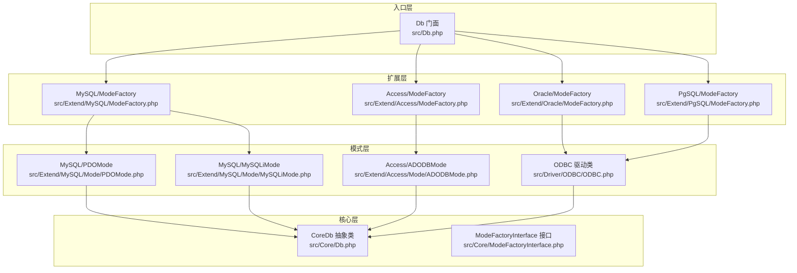
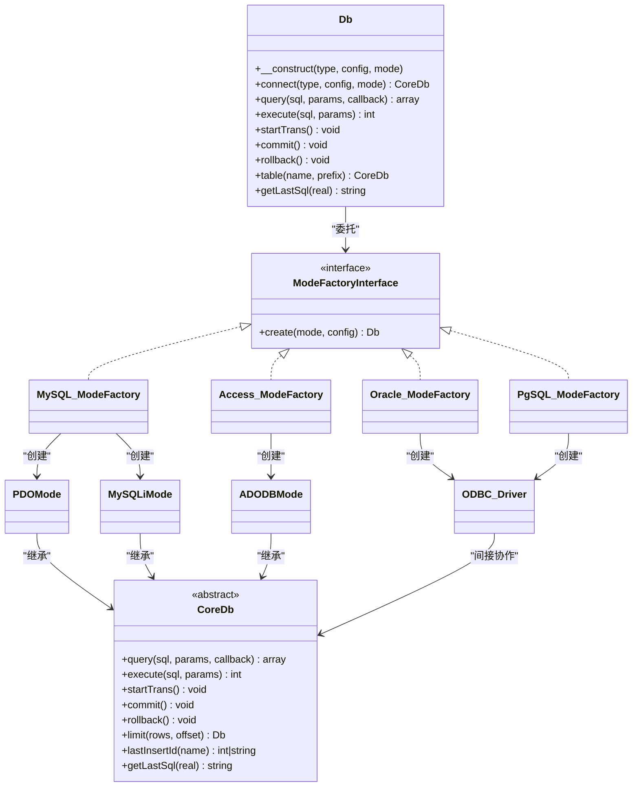
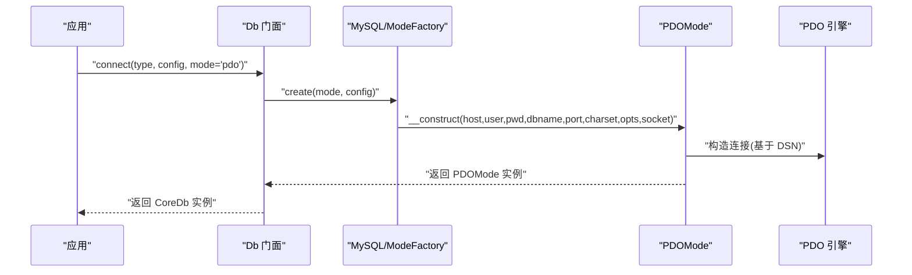
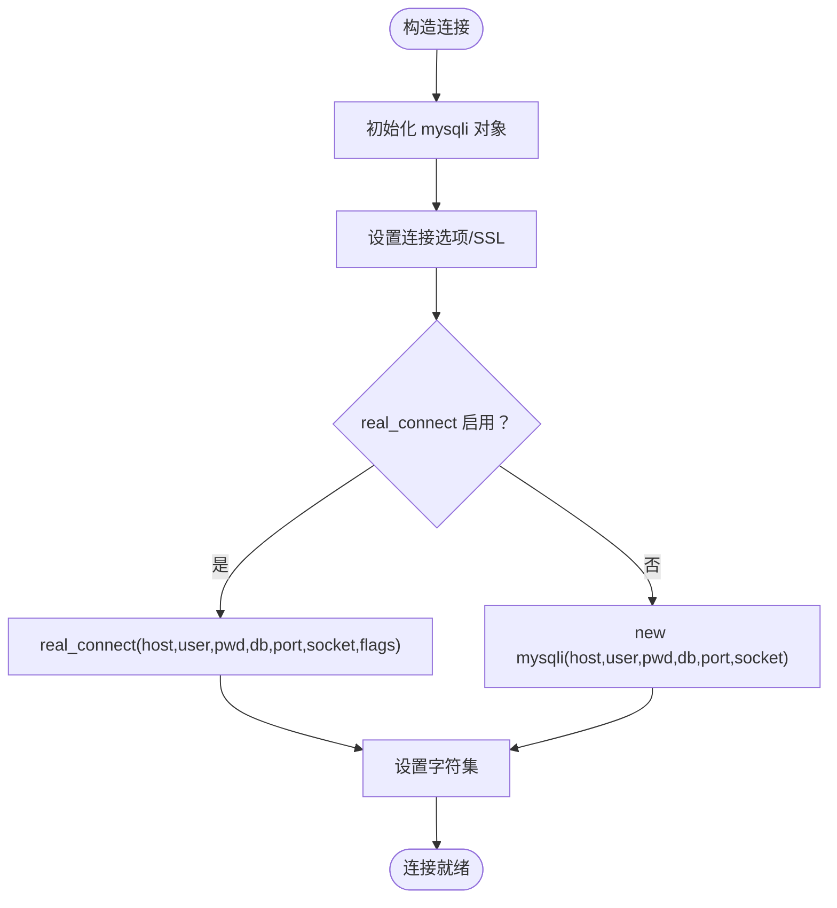
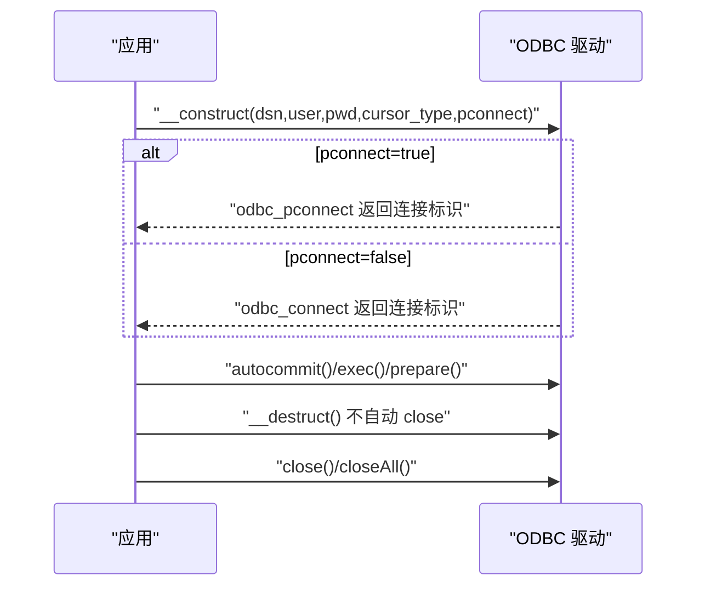
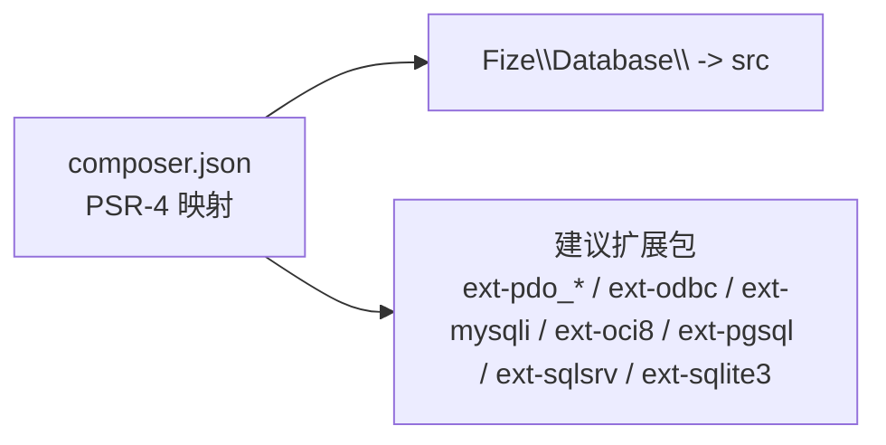

# 连接池管理

<cite>
**本文引用的文件**
- [src/Db.php](file://src/Db.php)
- [src/Core/Db.php](file://src/Core/Db.php)
- [src/Core/ModeFactoryInterface.php](file://src/Core/ModeFactoryInterface.php)
- [src/Extend/MySQL/ModeFactory.php](file://src/Extend/MySQL/ModeFactory.php)
- [src/Extend/Access/ModeFactory.php](file://src/Extend/Access/ModeFactory.php)
- [src/Extend/Oracle/ModeFactory.php](file://src/Extend/Oracle/ModeFactory.php)
- [src/Extend/PgSQL/ModeFactory.php](file://src/Extend/PgSQL/ModeFactory.php)
- [src/Extend/MySQL/Mode/PDOMode.php](file://src/Extend/MySQL/Mode/PDOMode.php)
- [src/Extend/MySQL/Mode/MySQLiMode.php](file://src/Extend/MySQL/Mode/MySQLiMode.php)
- [src/Extend/Access/Mode/ADODBMode.php](file://src/Extend/Access/Mode/ADODBMode.php)
- [src/Driver/ODBC/ODBC.php](file://src/Driver/ODBC/ODBC.php)
- [composer.json](file://composer.json)
</cite>

## 目录
1. [简介](#简介)
2. [项目结构](#项目结构)
3. [核心组件](#核心组件)
4. [架构总览](#架构总览)
5. [详细组件分析](#详细组件分析)
6. [依赖关系分析](#依赖关系分析)
7. [性能考量](#性能考量)
8. [故障排查指南](#故障排查指南)
9. [结论](#结论)
10. [附录](#附录)

## 简介
本文件围绕 FizeDatabase 的数据库连接池管理与连接优化策略展开，系统梳理 PDO、ODBC、ADODB 三种连接模式的实现差异、适用场景与性能特征，并结合项目代码解析连接生命周期、连接复用与超时处理、以及连接泄漏防护机制。同时给出针对 MySQL、PostgreSQL、Oracle 等主流数据库的连接优化参数建议与监控指标、调优与排障方法。

## 项目结构
FizeDatabase 采用“核心抽象 + 分数据库类型扩展 + 模式工厂 + 中间件”的分层设计：
- 核心层：统一的查询构建与事务接口（Core/Db），定义抽象方法供具体驱动实现。
- 扩展层：按数据库类型划分目录（如 Extend/MySQL、Extend/Oracle、Extend/PgSQL、Extend/Access），每类提供 ModeFactory 与多种 Mode 实现（PDO、ODBC、MySQLi/OCI/PgSQL/ADODB 等）。
- 中间件层：各模式通过混入中间件封装底层连接细节（如 PDOMiddleware、ADODBMiddleware、ODBCMiddleware）。
- 入口层：Db 门面类提供静态便捷方法与事务嵌套控制。

图表来源
- [src/Db.php:1-141](file://src/Db.php#L1-L141)
- [src/Core/Db.php:1-800](file://src/Core/Db.php#L1-L800)
- [src/Core/ModeFactoryInterface.php:1-18](file://src/Core/ModeFactoryInterface.php#L1-L18)
- [src/Extend/MySQL/ModeFactory.php:1-82](file://src/Extend/MySQL/ModeFactory.php#L1-L82)
- [src/Extend/Oracle/ModeFactory.php:1-76](file://src/Extend/Oracle/ModeFactory.php#L1-L76)
- [src/Extend/PgSQL/ModeFactory.php:1-57](file://src/Extend/PgSQL/ModeFactory.php#L1-L57)
- [src/Extend/MySQL/Mode/PDOMode.php:1-53](file://src/Extend/MySQL/Mode/PDOMode.php#L1-L53)
- [src/Extend/MySQL/Mode/MySQLiMode.php:1-251](file://src/Extend/MySQL/Mode/MySQLiMode.php#L1-L251)
- [src/Extend/Access/Mode/ADODBMode.php:1-60](file://src/Extend/Access/Mode/ADODBMode.php#L1-L60)
- [src/Driver/ODBC/ODBC.php:1-341](file://src/Driver/ODBC/ODBC.php#L1-L341)

章节来源
- [src/Db.php:1-141](file://src/Db.php#L1-L141)
- [src/Core/Db.php:1-800](file://src/Core/Db.php#L1-L800)
- [src/Core/ModeFactoryInterface.php:1-18](file://src/Core/ModeFactoryInterface.php#L1-L18)
- [src/Extend/MySQL/ModeFactory.php:1-82](file://src/Extend/MySQL/ModeFactory.php#L1-L82)
- [src/Extend/Oracle/ModeFactory.php:1-76](file://src/Extend/Oracle/ModeFactory.php#L1-L76)
- [src/Extend/PgSQL/ModeFactory.php:1-57](file://src/Extend/PgSQL/ModeFactory.php#L1-L57)
- [src/Extend/MySQL/Mode/PDOMode.php:1-53](file://src/Extend/MySQL/Mode/PDOMode.php#L1-L53)
- [src/Extend/MySQL/Mode/MySQLiMode.php:1-251](file://src/Extend/MySQL/Mode/MySQLiMode.php#L1-L251)
- [src/Extend/Access/Mode/ADODBMode.php:1-60](file://src/Extend/Access/Mode/ADODBMode.php#L1-L60)
- [src/Driver/ODBC/ODBC.php:1-341](file://src/Driver/ODBC/ODBC.php#L1-L341)

## 核心组件
- 门面类 Db：提供静态便捷方法（连接、查询、执行、事务），内部委托具体模式实例完成实际操作。
- 核心抽象类 CoreDb：定义统一的查询构建器与事务接口，派生类负责具体数据库方言实现。
- 模式工厂接口 ModeFactoryInterface 与各数据库的 ModeFactory：根据传入的 mode 选择 PDO/ODBC/MySQLi/OCI/PgSQL/ADODB 等实现，并合并默认配置。
- 模式类（如 PDOMode、MySQLiMode、ADODBMode）：封装底层连接与语句执行，混入对应中间件以统一行为。
- ODBC 驱动类：提供 ODBC 连接、预处理、事务等能力，支持持久连接开关。

章节来源
- [src/Db.php:1-141](file://src/Db.php#L1-L141)
- [src/Core/Db.php:1-800](file://src/Core/Db.php#L1-L800)
- [src/Core/ModeFactoryInterface.php:1-18](file://src/Core/ModeFactoryInterface.php#L1-L18)
- [src/Extend/MySQL/ModeFactory.php:1-82](file://src/Extend/MySQL/ModeFactory.php#L1-L82)
- [src/Extend/Access/ModeFactory.php:1-49](file://src/Extend/Access/ModeFactory.php#L1-L49)
- [src/Extend/Oracle/ModeFactory.php:1-76](file://src/Extend/Oracle/ModeFactory.php#L1-L76)
- [src/Extend/PgSQL/ModeFactory.php:1-57](file://src/Extend/PgSQL/ModeFactory.php#L1-L57)
- [src/Extend/MySQL/Mode/PDOMode.php:1-53](file://src/Extend/MySQL/Mode/PDOMode.php#L1-L53)
- [src/Extend/MySQL/Mode/MySQLiMode.php:1-251](file://src/Extend/MySQL/Mode/MySQLiMode.php#L1-L251)
- [src/Extend/Access/Mode/ADODBMode.php:1-60](file://src/Extend/Access/Mode/ADODBMode.php#L1-L60)
- [src/Driver/ODBC/ODBC.php:1-341](file://src/Driver/ODBC/ODBC.php#L1-L341)

## 架构总览
FizeDatabase 的连接池与优化策略由“模式工厂 + 模式实现 + 中间件 + 驱动”协同完成。不同数据库类型通过各自的 ModeFactory 注入默认配置与模式选择逻辑；模式类通过混入中间件实现统一的连接生命周期管理；ODBC 驱动提供持久连接开关与事务控制。

图表来源
- [src/Db.php:1-141](file://src/Db.php#L1-L141)
- [src/Core/Db.php:1-800](file://src/Core/Db.php#L1-L800)
- [src/Core/ModeFactoryInterface.php:1-18](file://src/Core/ModeFactoryInterface.php#L1-L18)
- [src/Extend/MySQL/ModeFactory.php:1-82](file://src/Extend/MySQL/ModeFactory.php#L1-L82)
- [src/Extend/Access/ModeFactory.php:1-49](file://src/Extend/Access/ModeFactory.php#L1-L49)
- [src/Extend/Oracle/ModeFactory.php:1-76](file://src/Extend/Oracle/ModeFactory.php#L1-L76)
- [src/Extend/PgSQL/ModeFactory.php:1-57](file://src/Extend/PgSQL/ModeFactory.php#L1-L57)
- [src/Extend/MySQL/Mode/PDOMode.php:1-53](file://src/Extend/MySQL/Mode/PDOMode.php#L1-L53)
- [src/Extend/MySQL/Mode/MySQLiMode.php:1-251](file://src/Extend/MySQL/Mode/MySQLiMode.php#L1-L251)
- [src/Extend/Access/Mode/ADODBMode.php:1-60](file://src/Extend/Access/Mode/ADODBMode.php#L1-L60)
- [src/Driver/ODBC/ODBC.php:1-341](file://src/Driver/ODBC/ODBC.php#L1-L341)

## 详细组件分析

### PDO 模式（MySQL/PgSQL/Oracle）
- 连接实现：通过 DSN 组装（含 host、port、dbname、charset 等），调用底层 PDO 构造并注入选项。
- 生命周期：析构时统一释放资源，确保连接及时回收。
- 适用场景：跨数据库兼容性好、生态完善、性能稳定，推荐作为首选模式。
- 连接池特性：PDO 层未内置连接池，需依赖 PHP-FPM/进程管理器或应用侧复用连接实例。

图表来源
- [src/Db.php:32-56](file://src/Db.php#L32-L56)
- [src/Extend/MySQL/ModeFactory.php:21-80](file://src/Extend/MySQL/ModeFactory.php#L21-L80)
- [src/Extend/MySQL/Mode/PDOMode.php:29-42](file://src/Extend/MySQL/Mode/PDOMode.php#L29-L42)

章节来源
- [src/Extend/MySQL/Mode/PDOMode.php:1-53](file://src/Extend/MySQL/Mode/PDOMode.php#L1-L53)
- [src/Extend/MySQL/ModeFactory.php:1-82](file://src/Extend/MySQL/ModeFactory.php#L1-L82)
- [src/Extend/PgSQL/ModeFactory.php:1-57](file://src/Extend/PgSQL/ModeFactory.php#L1-L57)
- [src/Extend/Oracle/ModeFactory.php:1-76](file://src/Extend/Oracle/ModeFactory.php#L1-L76)

### MySQLi 模式（MySQL）
- 连接实现：支持 real_connect 与 SSL 参数配置，可选择 socket、端口、字符集与连接标志。
- 生命周期：析构时主动 kill 当前线程并 close 连接，避免僵尸线程。
- 适用场景：对 MySQL 性能敏感、需要细粒度连接参数控制。
- 连接池特性：未内置连接池，适合在应用层复用实例或配合进程管理器。

图表来源
- [src/Extend/MySQL/Mode/MySQLiMode.php:42-65](file://src/Extend/MySQL/Mode/MySQLiMode.php#L42-L65)

章节来源
- [src/Extend/MySQL/Mode/MySQLiMode.php:1-251](file://src/Extend/MySQL/Mode/MySQLiMode.php#L1-L251)

### ADODB 模式（Access）
- 连接实现：通过 Provider 与数据源拼接 DSN，支持密码参数。
- 生命周期：析构时统一释放资源。
- 适用场景：Access 数据库访问，结合 Windows 环境下的 OLE DB 驱动。
- 连接池特性：未内置连接池，建议应用层复用实例。

章节来源
- [src/Extend/Access/Mode/ADODBMode.php:1-60](file://src/Extend/Access/Mode/ADODBMode.php#L1-L60)
- [src/Extend/Access/ModeFactory.php:1-49](file://src/Extend/Access/ModeFactory.php#L1-L49)

### ODBC 模式（通用）
- 连接实现：支持持久连接（odbc_pconnect）与普通连接（odbc_connect），提供事务、预处理、元数据等能力。
- 生命周期：析构未自动关闭，需显式 close；提供 closeAll 用于全局关闭。
- 适用场景：跨数据库统一访问（如 MySQL、PostgreSQL、Oracle、SQL Server），需注意驱动对中文支持的影响。
- 连接池特性：可通过 pconnect 参数启用持久连接，减少频繁握手开销。

图表来源
- [src/Driver/ODBC/ODBC.php:33-93](file://src/Driver/ODBC/ODBC.php#L33-L93)

章节来源
- [src/Driver/ODBC/ODBC.php:1-341](file://src/Driver/ODBC/ODBC.php#L1-L341)
- [src/Extend/Oracle/ModeFactory.php:34-73](file://src/Extend/Oracle/ModeFactory.php#L34-L73)
- [src/Extend/PgSQL/ModeFactory.php:35-54](file://src/Extend/PgSQL/ModeFactory.php#L35-L54)

## 依赖关系分析
- Composer 自动加载映射了 Fize\Database 命名空间至 src 目录。
- 建议扩展包（PDO/ODBC/MySQLi/OCI/PgSQL/SQLSRV/SQLite 等）按需安装，避免不必要的依赖。

图表来源
- [composer.json:11-37](file://composer.json#L11-L37)

章节来源
- [composer.json:1-47](file://composer.json#L1-L47)

## 性能考量
- 模式选择
  - PDO：跨数据库兼容性好，生态成熟，推荐优先使用；注意 DSN 参数与 PDO 选项的合理配置。
  - MySQLi：对 MySQL 性能敏感场景可用，支持丰富的连接参数与 SSL 配置。
  - ODBC：统一访问多数据库，需关注驱动版本与中文支持；可启用持久连接降低握手成本。
  - ADODB：Access 数据库专用，注意 Provider 与密码参数。
- 连接复用
  - 项目未内置连接池，建议在应用层复用 Db/模式实例，避免频繁创建销毁。
  - ODBC 可通过 pconnect 参数启用持久连接，减少重复握手。
- 超时与稳定性
  - PDO/MySQLi/ODBC 均未内置超时参数注入点，可在各自 DSN/选项中配置（如 PDO 选项、MySQLi 连接超时参数）。
- 监控指标建议
  - 连接命中率：应用层统计复用次数与新建次数。
  - 事务成功率：统计 startTrans/commit/rollback 成功与失败次数。
  - 查询耗时分布：记录 query/execute 的耗时直方图。
  - 连接泄漏检测：跟踪连接实例的创建与销毁配对情况。

[本节为通用性能指导，不直接分析具体文件]

## 故障排查指南
- 连接失败
  - 检查 DSN/主机/端口/用户名/密码是否正确。
  - 确认所需扩展已安装（PDO/ODBC/MySQLi/OCI/PgSQL/SQLSRV/SQLite）。
- 中文乱码
  - ODBC 驱动需选择支持 Unicode 的驱动（如 MySQL ODBC Unicode Driver）。
- 事务异常
  - 确认 autocommit 状态与事务边界；ODBC 提供 autocommit/commit/rollback 方法。
- 连接泄漏
  - ODBC 析构不自动关闭，需显式调用 close/closeAll。
  - MySQLi 在析构中主动 kill 线程并 close，确保无僵尸线程残留。
- 事务嵌套
  - Db 门面维护事务嵌套层级，确保嵌套提交/回滚正确。

章节来源
- [src/Driver/ODBC/ODBC.php:33-93](file://src/Driver/ODBC/ODBC.php#L33-L93)
- [src/Db.php:84-114](file://src/Db.php#L84-L114)
- [src/Extend/MySQL/Mode/MySQLiMode.php:69-76](file://src/Extend/MySQL/Mode/MySQLiMode.php#L69-L76)

## 结论
FizeDatabase 通过模式工厂与多模式实现，为不同数据库提供了统一的 ORM/查询接口与连接管理能力。PDO/ODBC/ADODB/MySQLi 各具优势：PDO 兼容性与生态最佳；MySQLi 针对 MySQL 的性能与参数控制；ODBC 提供跨数据库统一访问；ADODB 适配 Access。项目未内置连接池，建议在应用层复用连接实例或启用 ODBC 持久连接，并结合监控指标持续优化。

[本节为总结性内容，不直接分析具体文件]

## 附录

### 不同数据库类型的连接优化参数（实践建议）
- MySQL（PDO/MySQLi）
  - DSN 参数：host、port、dbname、charset
  - PDO 选项：如持久化、超时、错误模式等
  - MySQLi：real_connect、socket、SSL 参数、flags
- PostgreSQL（PDO/ODBC/PgSQL）
  - DSN 参数：host、port、dbname、user、password
  - ODBC：pconnect、driver
  - PgSQL：连接字符串与连接类型参数
- Oracle（PDO/ODBC/OCI）
  - DSN/连接字符串：host/port/dbname、用户名/密码、字符集、会话模式、连接类型
  - ODBC：sid/host:port/dbname
- Access（ADODB）
  - Provider、数据源、密码参数

[本节为通用实践建议，不直接分析具体文件]