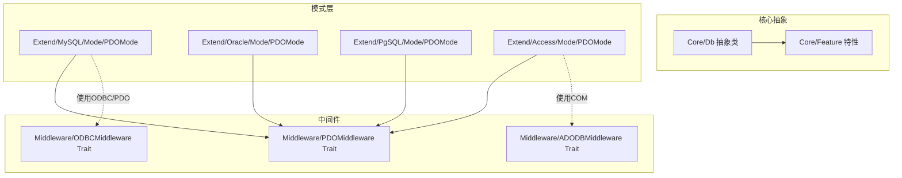
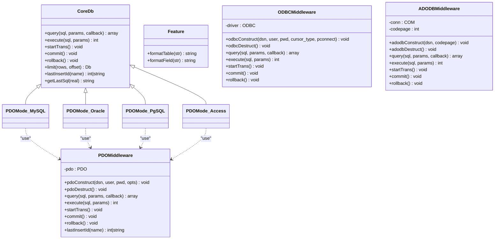
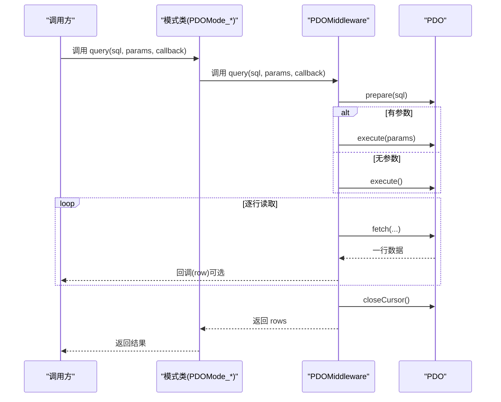
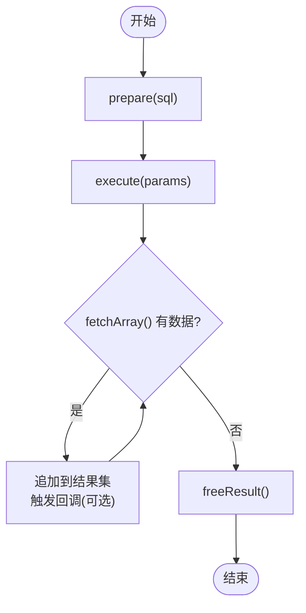
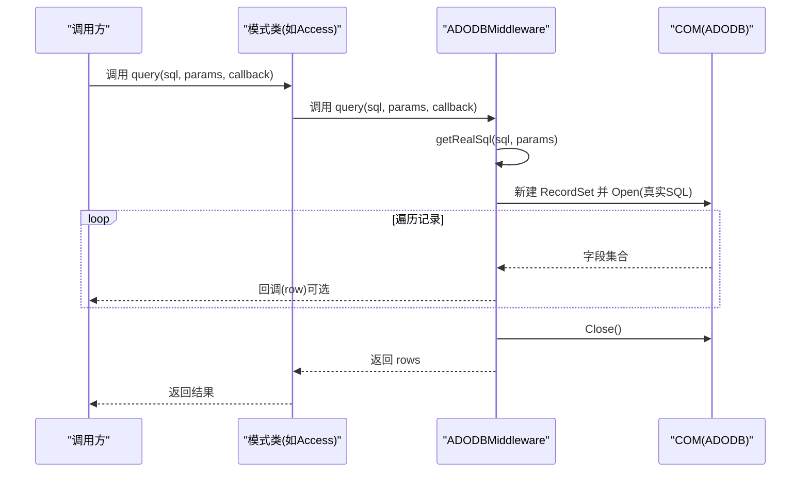
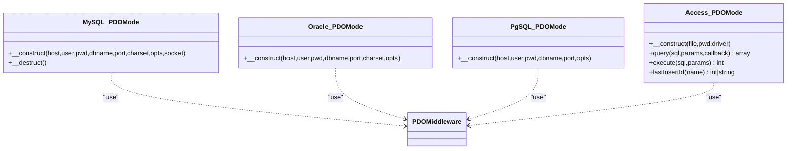
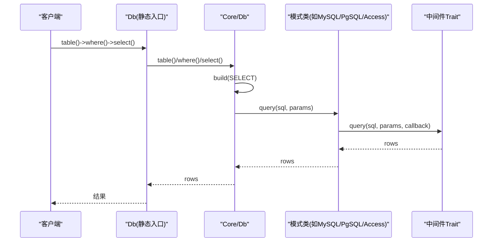
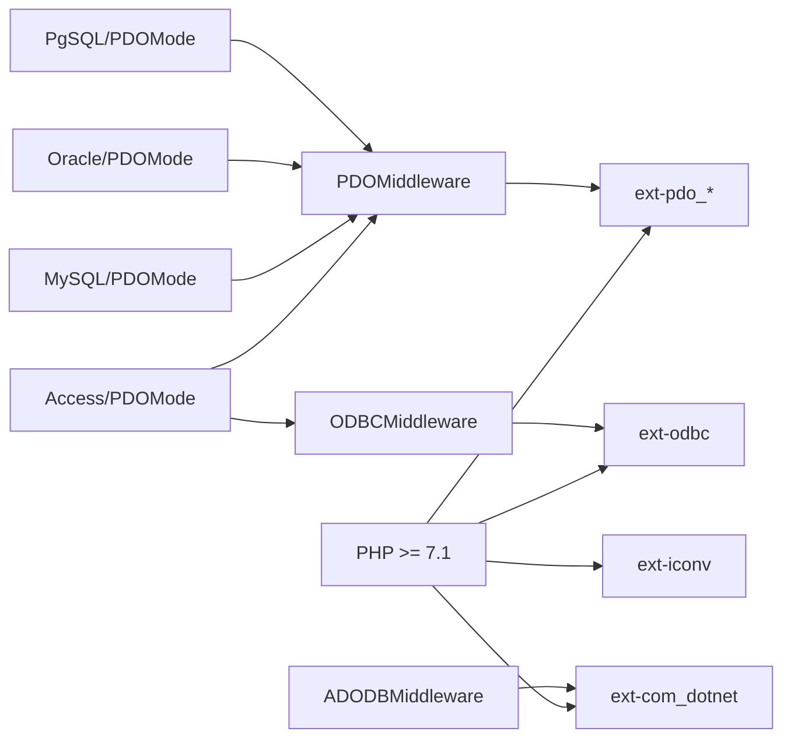

# 中间件开发

<cite>
**本文引用的文件**
- [PDOMiddleware.php](file://src/Middleware/PDOMiddleware.php)
- [ODBCMiddleware.php](file://src/Middleware/ODBCMiddleware.php)
- [ADODBMiddleware.php](file://src/Middleware/ADODBMiddleware.php)
- [Db.php](file://src/Core/Db.php)
- [Feature.php](file://src/Core/Feature.php)
- [Db.php](file://src/Db.php)
- [PDOMode.php（Access）](file://src/Extend/Access/Mode/PDOMode.php)
- [PDOMode.php（MySQL）](file://src/Extend/MySQL/Mode/PDOMode.php)
- [PDOMode.php（Oracle）](file://src/Extend/Oracle/Mode/PDOMode.php)
- [PDOMode.php（PgSQL）](file://src/Extend/PgSQL/Mode/PDOMode.php)
- [Db.php（Access）](file://src/Extend/Access/Db.php)
- [Db.php（MySQL）](file://src/Extend/MySQL/Db.php)
- [Db.php（Oracle）](file://src/Extend/Oracle/Db.php)
- [composer.json](file://composer.json)
</cite>

## 目录
1. [引言](#引言)
2. [项目结构](#项目结构)
3. [核心组件](#核心组件)
4. [架构总览](#架构总览)
5. [详细组件分析](#详细组件分析)
6. [依赖分析](#依赖分析)
7. [性能考虑](#性能考虑)
8. [故障排查指南](#故障排查指南)
9. [结论](#结论)
10. [附录](#附录)

## 引言
本指南面向希望基于现有中间件框架开发自定义数据库中间件的工程师。文档聚焦于中间件在数据库连接管理中的作用与设计原理，覆盖连接建立、查询执行、结果处理等中间层逻辑；并系统讲解如何实现Trait、管理连接状态、处理错误；同时通过PDO、ODBC、ADODB三种中间件的实现进行对比分析，总结通用模式与特殊处理点，并给出生命周期管理、性能监控与日志记录的扩展建议，以及中间件与数据库驱动之间的协作与解耦思路。

## 项目结构
该项目采用“核心抽象 + 驱动中间件 + 具体数据库模式”的分层组织方式：
- 核心抽象层：提供统一的查询DSL、SQL构建、事务控制与公共工具方法
- 中间件层：封装具体驱动的连接、执行、事务与错误处理细节
- 模式层：针对不同数据库（如MySQL、Oracle、PgSQL、Access等）组合中间件与各自特性
- 工具与入口：提供静态便捷入口与工厂创建模式

图表来源
- [Db.php:13-151](file://src/Core/Db.php#L13-L151)
- [Feature.php:10-32](file://src/Core/Feature.php#L10-L32)
- [PDOMiddleware.php:12-128](file://src/Middleware/PDOMiddleware.php#L12-L128)
- [ODBCMiddleware.php:11-99](file://src/Middleware/ODBCMiddleware.php#L11-L99)
- [ADODBMiddleware.php:11-115](file://src/Middleware/ADODBMiddleware.php#L11-L115)
- [PDOMode.php（MySQL）:14-52](file://src/Extend/MySQL/Mode/PDOMode.php#L14-L52)
- [PDOMode.php（Oracle）:13-48](file://src/Extend/Oracle/Mode/PDOMode.php#L13-L48)
- [PDOMode.php（PgSQL）:13-42](file://src/Extend/PgSQL/Mode/PDOMode.php#L13-L42)
- [PDOMode.php（Access）:15-144](file://src/Extend/Access/Mode/PDOMode.php#L15-L144)

章节来源
- [Db.php:13-151](file://src/Core/Db.php#L13-L151)
- [Feature.php:10-32](file://src/Core/Feature.php#L10-L32)
- [PDOMiddleware.php:12-128](file://src/Middleware/PDOMiddleware.php#L12-L128)
- [ODBCMiddleware.php:11-99](file://src/Middleware/ODBCMiddleware.php#L11-L99)
- [ADODBMiddleware.php:11-115](file://src/Middleware/ADODBMiddleware.php#L11-L115)
- [PDOMode.php（MySQL）:14-52](file://src/Extend/MySQL/Mode/PDOMode.php#L14-L52)
- [PDOMode.php（Oracle）:13-48](file://src/Extend/Oracle/Mode/PDOMode.php#L13-L48)
- [PDOMode.php（PgSQL）:13-42](file://src/Extend/PgSQL/Mode/PDOMode.php#L13-L42)
- [PDOMode.php（Access）:15-144](file://src/Extend/Access/Mode/PDOMode.php#L15-L144)

## 核心组件
- 中间件Trait（PDO/ODBC/ADODB）：封装连接构造、执行、事务、错误转换等通用逻辑
- 核心Db抽象类：定义查询DSL、SQL构建、事务接口、常用查询方法（select/find/value等）
- 模式类（各数据库）：组合中间件与数据库特定特性，覆盖差异点（如字符集、LIMIT、lastInsertId等）
- 静态入口Db：提供便捷的静态方法与事务嵌套计数

章节来源
- [Db.php:13-151](file://src/Core/Db.php#L13-L151)
- [Db.php:32-140](file://src/Db.php#L32-L140)
- [PDOMiddleware.php:12-128](file://src/Middleware/PDOMiddleware.php#L12-L128)
- [ODBCMiddleware.php:11-99](file://src/Middleware/ODBCMiddleware.php#L11-L99)
- [ADODBMiddleware.php:11-115](file://src/Middleware/ADODBMiddleware.php#L11-L115)

## 架构总览
中间件作为“驱动适配层”，向上提供统一接口，向下屏蔽不同驱动的差异。核心Db负责SQL构建与高层API，模式类负责组合中间件与数据库方言特性，静态入口负责事务嵌套与便捷访问。

图表来源
- [Db.php:13-151](file://src/Core/Db.php#L13-L151)
- [Feature.php:10-32](file://src/Core/Feature.php#L10-L32)
- [PDOMiddleware.php:12-128](file://src/Middleware/PDOMiddleware.php#L12-L128)
- [ODBCMiddleware.php:11-99](file://src/Middleware/ODBCMiddleware.php#L11-L99)
- [ADODBMiddleware.php:11-115](file://src/Middleware/ADODBMiddleware.php#L11-L115)
- [PDOMode.php（MySQL）:14-52](file://src/Extend/MySQL/Mode/PDOMode.php#L14-L52)
- [PDOMode.php（Oracle）:13-48](file://src/Extend/Oracle/Mode/PDOMode.php#L13-L48)
- [PDOMode.php（PgSQL）:13-42](file://src/Extend/PgSQL/Mode/PDOMode.php#L13-L42)
- [PDOMode.php（Access）:15-144](file://src/Extend/Access/Mode/PDOMode.php#L15-L144)

## 详细组件分析

### PDO中间件（PDOMiddleware）
- 连接建立：通过pdoConstruct构造PDO对象，设置错误模式为异常
- 查询执行：query支持参数绑定与逐行回调；execute返回受影响行数
- 事务管理：封装beginTransaction、commit、rollback
- 错误处理：捕获驱动异常并包装为统一的数据库异常
- 结果处理：fetch使用关联数组，closeCursor释放游标

图表来源
- [PDOMiddleware.php:51-72](file://src/Middleware/PDOMiddleware.php#L51-L72)
- [PDOMode.php（MySQL）:14-52](file://src/Extend/MySQL/Mode/PDOMode.php#L14-L52)

章节来源
- [PDOMiddleware.php:12-128](file://src/Middleware/PDOMiddleware.php#L12-L128)
- [PDOMode.php（MySQL）:14-52](file://src/Extend/MySQL/Mode/PDOMode.php#L14-L52)

### ODBC中间件（ODBCMiddleware）
- 连接建立：通过odbcConstruct创建ODBC驱动实例
- 查询执行：query使用prepare+execute+fetchArray循环读取；execute返回受影响行数
- 事务管理：autocommit(false)/commit/rollback
- 资源管理：odbcDestruct中显式close释放

图表来源
- [ODBCMiddleware.php:48-61](file://src/Middleware/ODBCMiddleware.php#L48-L61)

章节来源
- [ODBCMiddleware.php:11-99](file://src/Middleware/ODBCMiddleware.php#L11-L99)

### ADODB中间件（ADODBMiddleware）
- 连接建立：通过COM("ADODB.Connection")创建连接，支持codepage
- 查询执行：query将占位符SQL转换为真实SQL后执行，遍历RecordSet
- 事务管理：BeginTrans/CommitTrans/RollbackTrans
- 错误处理：执行失败抛出统一异常
- 资源管理：adodbDestruct中Close并置空

图表来源
- [ADODBMiddleware.php:53-74](file://src/Middleware/ADODBMiddleware.php#L53-L74)

章节来源
- [ADODBMiddleware.php:11-115](file://src/Middleware/ADODBMiddleware.php#L11-L115)

### 模式类与中间件组合
- MySQL/Oracle/PgSQL：均继承Db并use PDOMiddleware，仅在构造时拼装不同DSN与可选参数
- Access：继承Db并use PDOMiddleware，但需额外处理字符集（UTF-8↔GBK）与lastInsertId兼容性

图表来源
- [PDOMode.php（MySQL）:14-52](file://src/Extend/MySQL/Mode/PDOMode.php#L14-L52)
- [PDOMode.php（Oracle）:13-48](file://src/Extend/Oracle/Mode/PDOMode.php#L13-L48)
- [PDOMode.php（PgSQL）:13-42](file://src/Extend/PgSQL/Mode/PDOMode.php#L13-L42)
- [PDOMode.php（Access）:15-144](file://src/Extend/Access/Mode/PDOMode.php#L15-L144)

章节来源
- [PDOMode.php（MySQL）:14-52](file://src/Extend/MySQL/Mode/PDOMode.php#L14-L52)
- [PDOMode.php（Oracle）:13-48](file://src/Extend/Oracle/Mode/PDOMode.php#L13-L48)
- [PDOMode.php（PgSQL）:13-42](file://src/Extend/PgSQL/Mode/PDOMode.php#L13-L42)
- [PDOMode.php（Access）:15-144](file://src/Extend/Access/Mode/PDOMode.php#L15-L144)

### 核心Db与模式类的协作
- 核心Db提供SQL构建、事务接口、高层查询方法（select/find/value等），模式类实现具体驱动的query/execute/lastInsertId
- 模式类通过use中间件Trait获得统一的执行与事务能力，再根据数据库方言覆盖差异点

图表来源
- [Db.php:644-711](file://src/Core/Db.php#L644-L711)
- [Db.php:124-127](file://src/Db.php#L124-L127)
- [PDOMiddleware.php:51-72](file://src/Middleware/PDOMiddleware.php#L51-L72)

章节来源
- [Db.php:644-711](file://src/Core/Db.php#L644-L711)
- [Db.php:124-127](file://src/Db.php#L124-L127)

## 依赖分析
- PHP扩展依赖：通过composer.json声明了对PDO系列、ODBC、COM等扩展的建议与要求
- 组件耦合：模式类与中间件通过Trait组合，核心Db与模式类通过继承关系解耦；静态入口仅持有CoreDb实例
- 外部集成点：COM用于ADODB；ODBC用于Access；PDO用于MySQL/Oracle/PgSQL

图表来源
- [composer.json:16-37](file://composer.json#L16-L37)

章节来源
- [composer.json:16-37](file://composer.json#L16-L37)

## 性能考虑
- 查询性能
  - 使用参数绑定避免字符串拼接，降低SQL注入风险并提升解析缓存命中率
  - 合理使用回调逐行处理，避免一次性加载大结果集导致内存峰值过高
- 事务与并发
  - 通过静态入口的事务嵌套计数避免重复提交/回滚
  - 在高并发场景下结合驱动的连接池与长连接策略（如ODBC的pconnect）
- 结果集处理
  - 及时释放游标/结果集（PDO的closeCursor、ODBC的freeResult）
  - 对Access等驱动注意字符集转换成本，尽量批量处理

## 故障排查指南
- 统一异常
  - PDO中间件在执行异常时将底层异常包装为统一的数据库异常，便于上层捕获与日志记录
- Access字符集问题
  - Access通过ODBC/PDO连接时需进行UTF-8与GBK互转，若出现乱码，检查参数与返回值的转换位置
- COM/ADODB错误
  - ADODBMiddleware在执行失败时抛出统一异常，确认连接字符串与codepage配置正确
- 日志记录
  - 使用CoreDb的getLastSql(real)输出最终SQL（仅日志用途，避免直接执行）

章节来源
- [PDOMiddleware.php:69-71](file://src/Middleware/PDOMiddleware.php#L69-L71)
- [PDOMode.php（Access）:55-94](file://src/Extend/Access/Mode/PDOMode.php#L55-L94)
- [ADODBMiddleware.php:84-89](file://src/Middleware/ADODBMiddleware.php#L84-L89)
- [Db.php:199-206](file://src/Core/Db.php#L199-L206)

## 结论
中间件层通过Trait将连接、执行、事务、错误处理等通用逻辑抽象出来，配合模式类实现对不同数据库驱动的适配。核心Db提供统一的SQL构建与高层API，静态入口负责事务嵌套与便捷访问。遵循本指南的实现原则与扩展建议，可在保证解耦的前提下快速开发新的数据库中间件与模式类。

## 附录

### 开发自定义中间件的步骤清单
- 设计Trait接口
  - 明确连接构造/析构、query/execute、事务、lastInsertId等方法签名
- 实现连接与执行
  - 在pdo/odbc/adodb等分支中分别实现prepare/execute/closeCursor/freeResult等
- 错误处理
  - 捕获驱动异常并转换为统一的数据库异常
- 生命周期管理
  - 在析构中释放资源，确保无泄漏
- 与模式类组合
  - 在模式类中use该Trait，并在构造中完成DSN与选项拼装
- 性能与日志
  - 提供获取最终SQL的方法用于日志；在回调中处理大数据集；及时释放资源

### 通用模式与特殊处理要点
- 通用模式
  - 统一的参数绑定、逐行回调、事务封装、异常转换
- 特殊处理
  - Access需字符集转换与lastInsertId兼容
  - ODBC返回类型多为字符串，需统一处理
  - ADODB通过COM对象管理连接与结果集

章节来源
- [PDOMiddleware.php:12-128](file://src/Middleware/PDOMiddleware.php#L12-L128)
- [ODBCMiddleware.php:11-99](file://src/Middleware/ODBCMiddleware.php#L11-L99)
- [ADODBMiddleware.php:11-115](file://src/Middleware/ADODBMiddleware.php#L11-L115)
- [PDOMode.php（Access）:55-144](file://src/Extend/Access/Mode/PDOMode.php#L55-L144)