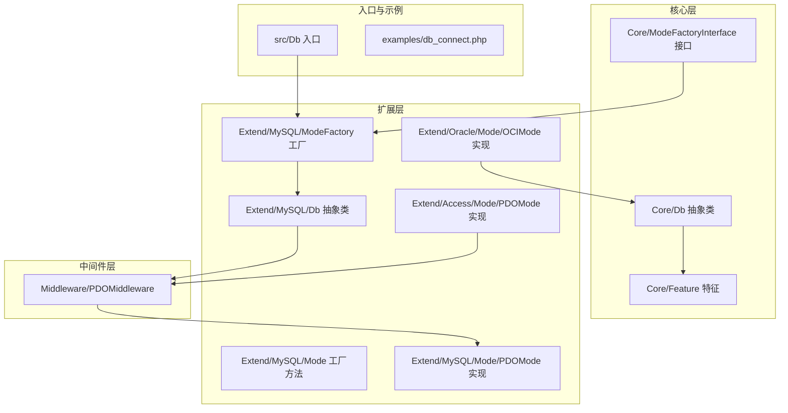
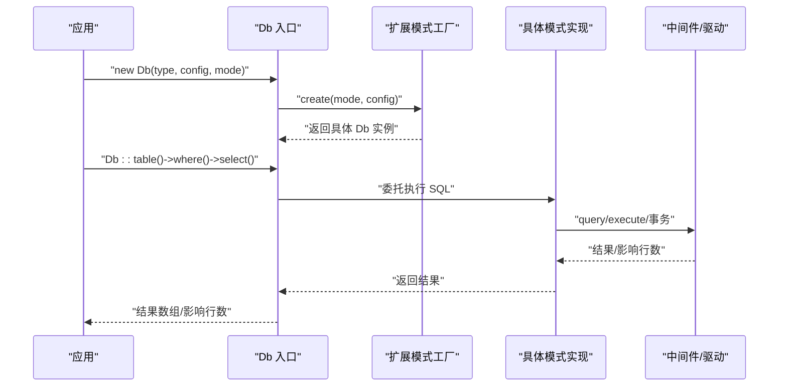
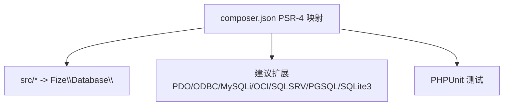

# 扩展开发

<cite>
**本文引用的文件**
- [composer.json](file://composer.json)
- [Db.php](file://src/Db.php)
- [Core/Db.php](file://src/Core/Db.php)
- [Core/Feature.php](file://src/Core/Feature.php)
- [Core/ModeFactoryInterface.php](file://src/Core/ModeFactoryInterface.php)
- [Extend/MySQL/ModeFactory.php](file://src/Extend/MySQL/ModeFactory.php)
- [Extend/MySQL/Db.php](file://src/Extend/MySQL/Db.php)
- [Extend/MySQL/Mode.php](file://src/Extend/MySQL/Mode.php)
- [Extend/MySQL/Mode/PDOMode.php](file://src/Extend/MySQL/Mode/PDOMode.php)
- [Extend/Access/Mode/PDOMode.php](file://src/Extend/Access/Mode/PDOMode.php)
- [Extend/Oracle/Mode/OCIMode.php](file://src/Extend/Oracle/Mode/OCIMode.php)
- [Middleware/PDOMiddleware.php](file://src/Middleware/PDOMiddleware.php)
- [examples/db_connect.php](file://examples/db_connect.php)
- [tests/Extend/MySQL/TestDb.php](file://tests/Extend/MySQL/TestDb.php)
- [tests/Extend/MySQL/TestModeFactory.php](file://tests/Extend/MySQL/TestModeFactory.php)
</cite>

## 目录
1. [简介](#简介)
2. [项目结构](#项目结构)
3. [核心组件](#核心组件)
4. [架构总览](#架构总览)
5. [详细组件分析](#详细组件分析)
6. [依赖分析](#依赖分析)
7. [性能考量](#性能考量)
8. [故障排查指南](#故障排查指南)
9. [结论](#结论)
10. [附录](#附录)

## 简介
本指南面向希望基于 FizeDatabase 框架进行扩展开发的工程师，系统讲解如何：
- 开发自定义数据库驱动（新增数据库类型）
- 扩展新的连接模式（如新增 PDO/ODBC/原生驱动等）
- 创建自定义中间件（封装通用能力，如连接池、日志、重试等）
- 遵循设计原则、接口规范、命名约定与代码结构要求
- 提供从简单驱动扩展到复杂业务功能扩展的完整示例
- 明确测试方法、发布与维护策略，以及与核心框架的集成与兼容性注意事项

## 项目结构
FizeDatabase 采用“核心抽象 + 扩展实现 + 中间件”的分层架构：
- 核心层：定义统一的 Db 抽象、特征 trait、模式工厂接口
- 扩展层：按数据库类型组织，每个类型包含 Db 抽象类、Mode 工厂、具体模式（PDO/ODBC/OCI 等）及对应 Query/Feature 扩展
- 中间件层：封装底层驱动交互（如 PDO 中间件），通过 trait 复用
- 示例与测试：覆盖典型用法与单元测试

**图表来源**
- [Db.php:13-56](file://src/Db.php#L13-L56)
- [Core/Db.php:13-135](file://src/Core/Db.php#L13-L135)
- [Core/Feature.php:10-32](file://src/Core/Feature.php#L10-L32)
- [Core/ModeFactoryInterface.php:8-17](file://src/Core/ModeFactoryInterface.php#L8-L17)
- [Extend/MySQL/ModeFactory.php:11-82](file://src/Extend/MySQL/ModeFactory.php#L11-L82)
- [Extend/MySQL/Db.php:11-152](file://src/Extend/MySQL/Db.php#L11-L152)
- [Extend/MySQL/Mode.php:14-74](file://src/Extend/MySQL/Mode.php#L14-L74)
- [Extend/MySQL/Mode/PDOMode.php:14-53](file://src/Extend/MySQL/Mode/PDOMode.php#L14-L53)
- [Extend/Access/Mode/PDOMode.php:15-146](file://src/Extend/Access/Mode/PDOMode.php#L15-L146)
- [Extend/Oracle/Mode/OCIMode.php:13-155](file://src/Extend/Oracle/Mode/OCIMode.php#L13-L155)
- [Middleware/PDOMiddleware.php:12-129](file://src/Middleware/PDOMiddleware.php#L12-L129)

**章节来源**
- [Db.php:13-56](file://src/Db.php#L13-L56)
- [Core/Db.php:13-135](file://src/Core/Db.php#L13-L135)
- [Core/Feature.php:10-32](file://src/Core/Feature.php#L10-L32)
- [Core/ModeFactoryInterface.php:8-17](file://src/Core/ModeFactoryInterface.php#L8-L17)
- [Extend/MySQL/ModeFactory.php:11-82](file://src/Extend/MySQL/ModeFactory.php#L11-L82)
- [Extend/MySQL/Db.php:11-152](file://src/Extend/MySQL/Db.php#L11-L152)
- [Extend/MySQL/Mode.php:14-74](file://src/Extend/MySQL/Mode.php#L14-L74)
- [Extend/MySQL/Mode/PDOMode.php:14-53](file://src/Extend/MySQL/Mode/PDOMode.php#L14-L53)
- [Extend/Access/Mode/PDOMode.php:15-146](file://src/Extend/Access/Mode/PDOMode.php#L15-L146)
- [Extend/Oracle/Mode/OCIMode.php:13-155](file://src/Extend/Oracle/Mode/OCIMode.php#L13-L155)
- [Middleware/PDOMiddleware.php:12-129](file://src/Middleware/PDOMiddleware.php#L12-L129)

## 核心组件
- 统一入口 Db：负责根据类型与模式创建连接，暴露静态便捷方法
- 核心抽象 Db：定义 SQL 组装、CRUD、事务、分页等通用能力
- 特征 Feature：提供表/字段格式化钩子，便于方言适配
- 模式工厂接口 ModeFactoryInterface：约束工厂 create 方法签名
- 扩展 Db：在核心基础上增加方言特性（如 MySQL 的 LIMIT、锁表、批量插入、分页统计等）
- 模式工厂 ModeFactory：解析模式字符串，选择具体驱动实现
- 模式 Mode：提供静态工厂方法，屏蔽具体驱动差异
- 中间件 PDOMiddleware：封装 PDO 通用交互（prepare/execute/fetch/事务/异常转换）

**章节来源**
- [Db.php:13-141](file://src/Db.php#L13-L141)
- [Core/Db.php:13-800](file://src/Core/Db.php#L13-L800)
- [Core/Feature.php:10-32](file://src/Core/Feature.php#L10-L32)
- [Core/ModeFactoryInterface.php:8-17](file://src/Core/ModeFactoryInterface.php#L8-L17)
- [Extend/MySQL/Db.php:11-246](file://src/Extend/MySQL/Db.php#L11-L246)
- [Extend/MySQL/ModeFactory.php:11-82](file://src/Extend/MySQL/ModeFactory.php#L11-L82)
- [Extend/MySQL/Mode.php:14-74](file://src/Extend/MySQL/Mode.php#L14-L74)
- [Middleware/PDOMiddleware.php:12-129](file://src/Middleware/PDOMiddleware.php#L12-L129)

## 架构总览
FizeDatabase 的扩展点主要集中在“扩展 Db + 模式工厂 + 模式实现 + 中间件”四层。核心流程如下：

**图表来源**
- [Db.php:32-56](file://src/Db.php#L32-L56)
- [Extend/MySQL/ModeFactory.php:21-80](file://src/Extend/MySQL/ModeFactory.php#L21-L80)
- [Extend/MySQL/Mode/PDOMode.php:29-42](file://src/Extend/MySQL/Mode/PDOMode.php#L29-L42)
- [Middleware/PDOMiddleware.php:51-93](file://src/Middleware/PDOMiddleware.php#L51-L93)

**章节来源**
- [Db.php:32-56](file://src/Db.php#L32-L56)
- [Extend/MySQL/ModeFactory.php:21-80](file://src/Extend/MySQL/ModeFactory.php#L21-L80)
- [Extend/MySQL/Mode/PDOMode.php:29-42](file://src/Extend/MySQL/Mode/PDOMode.php#L29-L42)
- [Middleware/PDOMiddleware.php:51-93](file://src/Middleware/PDOMiddleware.php#L51-L93)

## 详细组件分析

### 设计原则与接口规范
- 单一职责：核心 Db 负责 SQL 组装与通用 CRUD；扩展 Db 负责方言特性；模式实现负责具体驱动；中间件负责通用交互
- 开闭原则：通过模式工厂与扩展 Db，新增数据库类型无需修改核心
- 接口契约：模式工厂必须实现 create(mode, config)；扩展 Db 必须实现核心抽象的抽象方法
- 可插拔：中间件以 trait 形式复用，降低耦合

**章节来源**
- [Core/ModeFactoryInterface.php:8-17](file://src/Core/ModeFactoryInterface.php#L8-L17)
- [Core/Db.php:111-135](file://src/Core/Db.php#L111-L135)
- [Extend/MySQL/ModeFactory.php:21-80](file://src/Extend/MySQL/ModeFactory.php#L21-L80)

### 命名约定与代码结构要求
- 命名空间：扩展目录遵循 Fize\Database\Extend\<Type>\... 结构
- 类名与文件：扩展 Db 类名为 Db；模式工厂为 ModeFactory；模式实现为具体模式类
- 中间件：以 Middleware 命名空间下的 trait 封装通用能力
- 配置项：模式工厂内部合并默认配置，支持 host/user/password/dbname/port/charset/prefix/opts/socket 等

**章节来源**
- [Extend/MySQL/ModeFactory.php:24-34](file://src/Extend/MySQL/ModeFactory.php#L24-L34)
- [Extend/MySQL/Mode.php:33-72](file://src/Extend/MySQL/Mode.php#L33-L72)

### 扩展开发步骤（以新增数据库类型为例）

#### 步骤一：创建扩展目录与核心类
- 在 src/Extend/<NewType>/ 下创建 Db 抽象类，继承 Core/Db 并 use Core/Feature
- 如需方言特性，在 Db 中覆写 build/clear 或新增方法

**章节来源**
- [Extend/MySQL/Db.php:11-152](file://src/Extend/MySQL/Db.php#L11-L152)
- [Core/Db.php:583-637](file://src/Core/Db.php#L583-L637)
- [Core/Feature.php:10-32](file://src/Core/Feature.php#L10-L32)

#### 步骤二：实现模式工厂
- 创建 ModeFactory，实现 ModeFactoryInterface::create
- 解析模式字符串，按模式分支创建具体模式实例
- 合并默认配置，设置表前缀

**章节来源**
- [Extend/MySQL/ModeFactory.php:21-80](file://src/Extend/MySQL/ModeFactory.php#L21-L80)

#### 步骤三：实现具体模式
- 选择一种或多种模式（如 PDO/ODBC/OCI 等）
- 模式类继承扩展 Db，使用中间件 trait 或直接实现核心抽象方法
- 在构造函数中拼装 DSN/连接参数，必要时设置 PDO 属性

**章节来源**
- [Extend/MySQL/Mode/PDOMode.php:29-42](file://src/Extend/MySQL/Mode/PDOMode.php#L29-L42)
- [Extend/Access/Mode/PDOMode.php:25-35](file://src/Extend/Access/Mode/PDOMode.php#L25-L35)
- [Extend/Oracle/Mode/OCIMode.php:35-46](file://src/Extend/Oracle/Mode/OCIMode.php#L35-L46)

#### 步骤四：可选的中间件
- 若使用 PDO，可复用 PDOMiddleware trait，封装 prepare/execute/fetch/事务
- 若使用原生驱动，直接实现核心抽象方法

**章节来源**
- [Middleware/PDOMiddleware.php:12-129](file://src/Middleware/PDOMiddleware.php#L12-L129)

#### 步骤五：在入口中接入
- 入口 Db 通过拼接命名空间调用扩展模式工厂
- 示例中演示了默认连接与新连接的创建方式

**章节来源**
- [Db.php:32-56](file://src/Db.php#L32-L56)
- [examples/db_connect.php:14-38](file://examples/db_connect.php#L14-L38)

### 扩展示例

#### 示例一：新增数据库类型（以“NewDB”为例）
- 新建目录：src/Extend/NewDB/
- 在 NewDB/ 下创建 Db.php（继承 Core/Db）、ModeFactory.php（实现 create）、Mode.php（静态工厂方法）
- 在 Mode.php 中提供若干模式构造方法（如 pdo/odbc/oci 等）
- 在各模式实现类中实现 query/execute/startTrans/commit/rollback/lastInsertId 等核心方法
- 在入口 Db 中即可通过 Db::connect('newdb', $config, 'pdo') 使用

**章节来源**
- [Extend/MySQL/ModeFactory.php:21-80](file://src/Extend/MySQL/ModeFactory.php#L21-L80)
- [Extend/MySQL/Mode.php:33-72](file://src/Extend/MySQL/Mode.php#L33-L72)
- [Db.php:32-56](file://src/Db.php#L32-L56)

#### 示例二：为现有 MySQL 增加新模式（如自研驱动）
- 在 Extend/MySQL/Mode/ 下新增 MyDrvMode.php，继承 Extend/MySQL/Db
- 在 MyDrvMode::__construct 中初始化自研驱动
- 实现 query/execute/startTrans/commit/rollback/lastInsertId
- 在 Extend/MySQL/ModeFactory 中增加 case 分支，返回 MyDrvMode 实例

**章节来源**
- [Extend/MySQL/ModeFactory.php:36-77](file://src/Extend/MySQL/ModeFactory.php#L36-L77)
- [Extend/MySQL/Db.php:129-152](file://src/Extend/MySQL/Db.php#L129-L152)

#### 示例三：创建自定义中间件（如带重试/日志）
- 在 Middleware/ 下新增 RetryLogMiddleware.php，定义 trait
- 在需要的模式实现类中 use 该 trait
- 在 trait 中封装 prepare/execute 的重试与日志记录逻辑

（本小节为概念性说明，未直接分析具体文件）

### 与核心框架的集成方式与兼容性
- 入口 Db 通过命名空间拼接自动发现扩展工厂，保持对核心的最小侵入
- 扩展 Db 通过继承 Core/Db 保证 CRUD/事务/SQL 组装行为一致
- 模式工厂与模式实现解耦，便于版本升级与替换
- 中间件以 trait 复用，避免重复实现

**章节来源**
- [Db.php:32-56](file://src/Db.php#L32-L56)
- [Core/Db.php:111-135](file://src/Core/Db.php#L111-L135)

## 依赖分析
- 自动加载：PSR-4 命名空间映射至 src 目录
- 运行时依赖：PHP 版本要求、各类扩展（PDO/ODBC/MySQLi/OCI/SQLSRV/PGSQL/SQLite3 等）
- 开发依赖：PHPUnit 用于测试

**图表来源**
- [composer.json:11-46](file://composer.json#L11-L46)

**章节来源**
- [composer.json:11-46](file://composer.json#L11-L46)

## 性能考量
- 查询缓存：核心 Db 提供 select 的缓存机制，建议在高频查询场景合理使用
- 预处理绑定：统一使用问号占位符与参数绑定，避免字符串拼接
- 批量插入：扩展 Db 提供批量插入方法，减少多次往返
- 分页统计：MySQL 扩展提供分页统计方法，结合 SQL_CALC_FOUND_ROWS 与 FOUND_ROWS 提升效率

**章节来源**
- [Core/Db.php:700-711](file://src/Core/Db.php#L700-L711)
- [Extend/MySQL/Db.php:187-203](file://src/Extend/MySQL/Db.php#L187-L203)
- [Extend/MySQL/Db.php:237-244](file://src/Extend/MySQL/Db.php#L237-L244)

## 故障排查指南
- 模式错误：当传入的模式不在工厂支持列表时会抛出异常
- PDO 错误：中间件在执行失败时会抛出数据库异常，包含 SQL 与参数信息
- Oracle 占位符：OCIMode 将 ? 占位符转换为 :$n，确保绑定正确
- ACCESS 字符集：ACCESS 模式通过字符集转换处理中文问题

**章节来源**
- [Extend/MySQL/ModeFactory.php:75-77](file://src/Extend/MySQL/ModeFactory.php#L75-L77)
- [Middleware/PDOMiddleware.php:69-72](file://src/Middleware/PDOMiddleware.php#L69-L72)
- [Extend/Oracle/Mode/OCIMode.php:57-64](file://src/Extend/Oracle/Mode/OCIMode.php#L57-L64)
- [Extend/Access/Mode/PDOMode.php:55-94](file://src/Extend/Access/Mode/PDOMode.php#L55-L94)

## 结论
通过“扩展 Db + 模式工厂 + 模式实现 + 中间件”的分层设计，FizeDatabase 为数据库扩展提供了清晰、可演进的路径。开发者只需遵循命名约定与接口规范，即可快速完成从简单驱动扩展到复杂业务功能扩展的全流程。

## 附录

### 测试方法
- 单元测试：使用 PHPUnit，覆盖模式工厂创建、分页、批量插入等关键路径
- 示例验证：通过 examples/db_connect.php 验证基本连接与查询流程

**章节来源**
- [tests/Extend/MySQL/TestModeFactory.php:11-22](file://tests/Extend/MySQL/TestModeFactory.php#L11-L22)
- [tests/Extend/MySQL/TestDb.php:11-23](file://tests/Extend/MySQL/TestDb.php#L11-L23)
- [examples/db_connect.php:14-38](file://examples/db_connect.php#L14-L38)

### 发布与维护策略
- 版本管理：遵循语义化版本，变更核心接口时注意向后兼容
- 文档同步：随扩展新增完善 README 与示例
- 兼容矩阵：在 composer.json 中明确 PHP 版本与扩展建议

**章节来源**
- [composer.json:16-46](file://composer.json#L16-L46)