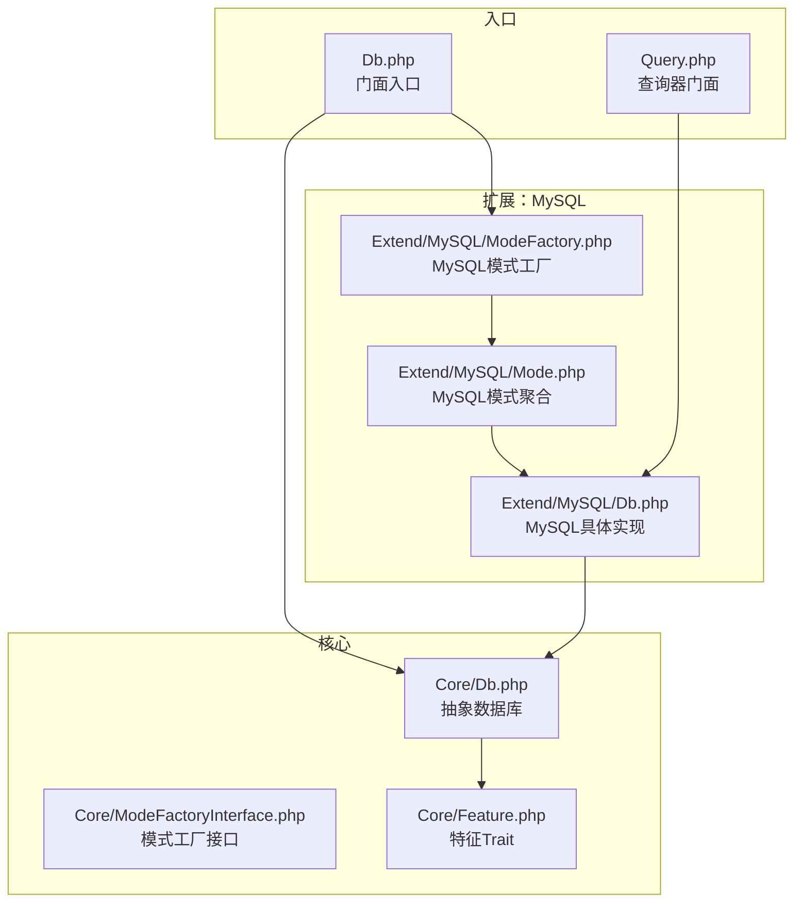
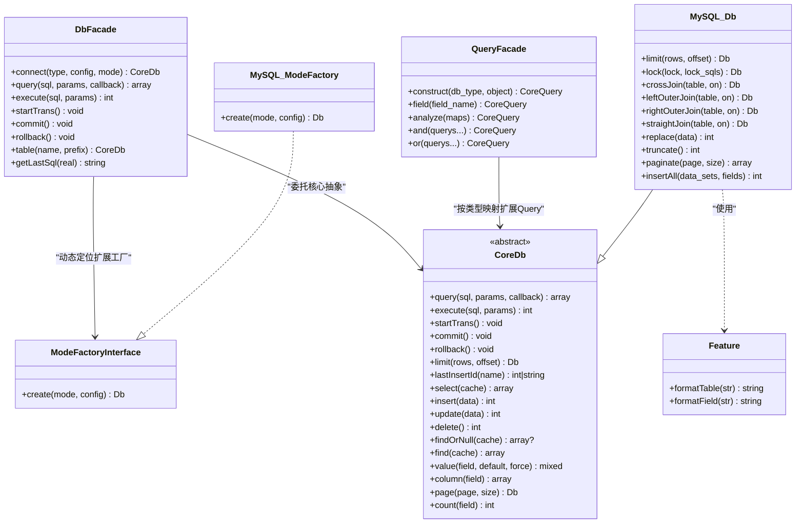
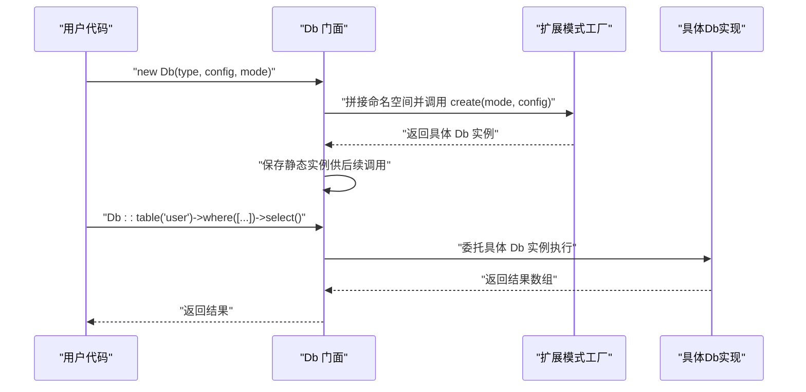
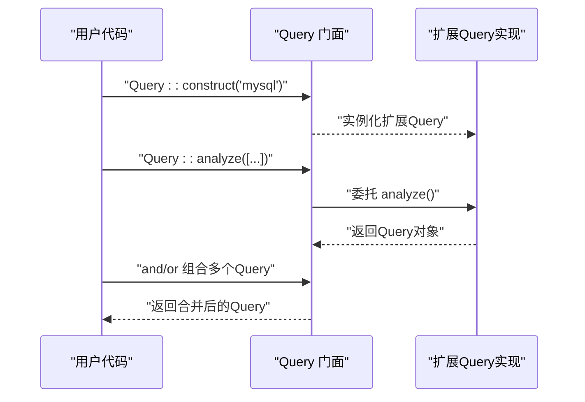
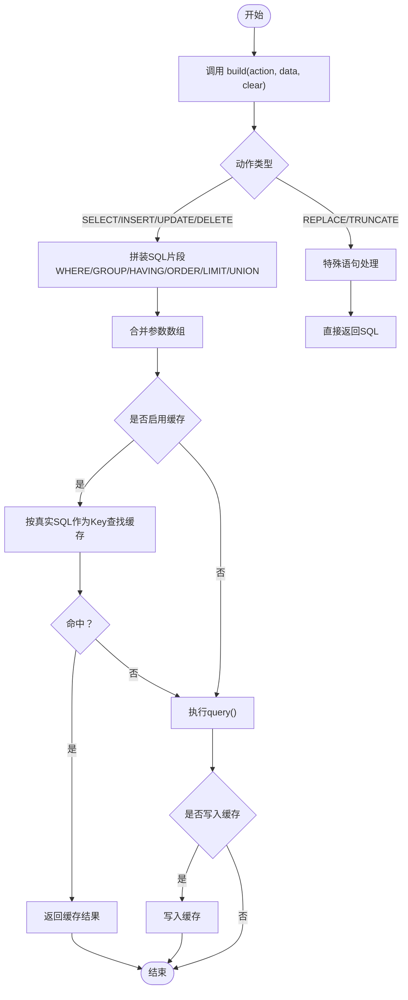
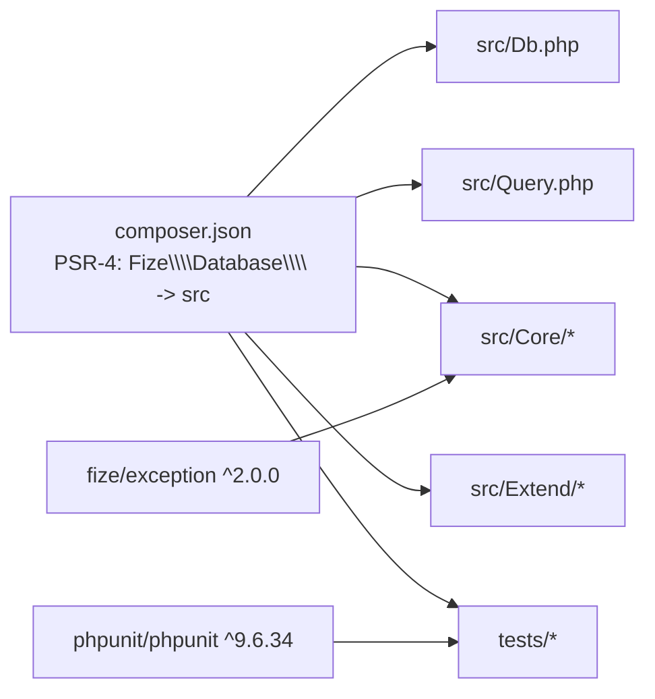

# 插件开发指南

<cite>
**本文引用的文件**
- [composer.json](file://composer.json)
- [Db.php](file://src/Db.php)
- [Core/Db.php](file://src/Core/Db.php)
- [Core/ModeFactoryInterface.php](file://src/Core/ModeFactoryInterface.php)
- [Model.php](file://src/Model.php)
- [Query.php](file://src/Query.php)
- [Extend/MySQL/ModeFactory.php](file://src/Extend/MySQL/ModeFactory.php)
- [Extend/MySQL/Db.php](file://src/Extend/MySQL/Db.php)
- [Extend/MySQL/Mode.php](file://src/Extend/MySQL/Mode.php)
- [Core/Feature.php](file://src/Core/Feature.php)
- [examples/db_connect.php](file://examples/db_connect.php)
- [examples/db_select.php](file://examples/db_select.php)
- [tests/TestDb.php](file://tests/TestDb.php)
- [tests/Extend/MySQL/TestDb.php](file://tests/Extend/MySQL/TestDb.php)
</cite>

## 目录
1. [简介](#简介)
2. [项目结构](#项目结构)
3. [核心组件](#核心组件)
4. [架构总览](#架构总览)
5. [详细组件分析](#详细组件分析)
6. [依赖关系分析](#依赖关系分析)
7. [性能考量](#性能考量)
8. [故障排查指南](#故障排查指南)
9. [结论](#结论)
10. [附录](#附录)

## 简介
本指南面向希望基于 FizeDatabase 开发“插件”的开发者，目标是帮助你快速理解并实现数据库驱动与模式的扩展（如新增数据库类型、新增连接模式），以及如何通过 Composer 包管理与自动加载机制将你的扩展作为独立插件发布。文档覆盖从项目初始化、接口实现、配置文件编写、测试用例编写，到发布流程、版本管理、依赖声明与文档编写的全流程，并给出与核心框架的集成方式、向后兼容性保证与性能影响评估建议。

## 项目结构
FizeDatabase 采用“核心抽象 + 扩展实现”的分层设计：
- 核心层位于 src/Core，定义抽象接口与通用能力（如查询构建、事务、分页等）。
- 扩展层位于 src/Extend/<Driver>，按数据库类型组织，每个扩展包含 ModeFactory、Mode、Db、Query 等配套实现。
- 入口门面位于 src/Db.php 与 src/Query.php，提供静态便捷调用。
- 示例与测试分别位于 examples 与 tests，便于验证与演示。

图表来源
- [Db.php:13-140](file://src/Db.php#L13-L140)
- [Query.php:12-129](file://src/Query.php#L12-L129)
- [Core/Db.php:13-800](file://src/Core/Db.php#L13-L800)
- [Core/ModeFactoryInterface.php:8-17](file://src/Core/ModeFactoryInterface.php#L8-L17)
- [Core/Feature.php:10-32](file://src/Core/Feature.php#L10-L32)
- [Extend/MySQL/ModeFactory.php:11-81](file://src/Extend/MySQL/ModeFactory.php#L11-L81)
- [Extend/MySQL/Mode.php:14-73](file://src/Extend/MySQL/Mode.php#L14-L73)
- [Extend/MySQL/Db.php:11-245](file://src/Extend/MySQL/Db.php#L11-L245)

章节来源
- [Db.php:13-140](file://src/Db.php#L13-L140)
- [Query.php:12-129](file://src/Query.php#L12-L129)
- [Core/Db.php:13-800](file://src/Core/Db.php#L13-L800)
- [Core/ModeFactoryInterface.php:8-17](file://src/Core/ModeFactoryInterface.php#L8-L17)
- [Core/Feature.php:10-32](file://src/Core/Feature.php#L10-L32)
- [Extend/MySQL/ModeFactory.php:11-81](file://src/Extend/MySQL/ModeFactory.php#L11-L81)
- [Extend/MySQL/Mode.php:14-73](file://src/Extend/MySQL/Mode.php#L14-L73)
- [Extend/MySQL/Db.php:11-245](file://src/Extend/MySQL/Db.php#L11-L245)

## 核心组件
- 门面入口
  - Db 门面：提供静态便捷方法（连接、查询、执行、事务、表选择、SQL 日志等），内部通过扩展的 ModeFactory 动态创建具体 Db 实例。
  - Query 门面：根据数据库类型动态定位对应扩展的 Query 实现，提供条件解析与组合能力。
- 核心抽象
  - Core\Db 抽象类：定义统一的 CRUD、事务、查询构建、分页等接口；子类按数据库类型实现差异行为。
  - ModeFactoryInterface：定义模式工厂接口，要求实现 create(mode, config)。
  - Feature trait：提供表名/字段名格式化钩子，便于不同数据库差异化处理。
- 扩展示例（MySQL）
  - ModeFactory：根据 mode（如 pdo、mysqli、odbc）创建具体 Db 实例，并合并默认配置。
  - Mode：聚合多种连接模式（PDOMode、MySQLiMode、ODBCMode）的构造入口。
  - Db：在 Core\Db 基础上增加 MySQL 特有语法（LIMIT、LOCK、TRUNCATE、REPLACE、分页统计等）。

章节来源
- [Db.php:13-140](file://src/Db.php#L13-L140)
- [Query.php:12-129](file://src/Query.php#L12-L129)
- [Core/Db.php:13-800](file://src/Core/Db.php#L13-L800)
- [Core/ModeFactoryInterface.php:8-17](file://src/Core/ModeFactoryInterface.php#L8-L17)
- [Core/Feature.php:10-32](file://src/Core/Feature.php#L10-L32)
- [Extend/MySQL/ModeFactory.php:11-81](file://src/Extend/MySQL/ModeFactory.php#L11-L81)
- [Extend/MySQL/Mode.php:14-73](file://src/Extend/MySQL/Mode.php#L14-L73)
- [Extend/MySQL/Db.php:11-245](file://src/Extend/MySQL/Db.php#L11-L245)

## 架构总览
FizeDatabase 的插件式扩展遵循“门面 + 工厂 + 抽象 + 具体实现”的分层架构。插件开发者只需在 src/Extend 下新增目录与实现，即可无缝接入现有 API。

图表来源
- [Db.php:13-140](file://src/Db.php#L13-L140)
- [Query.php:12-129](file://src/Query.php#L12-L129)
- [Core/Db.php:13-800](file://src/Core/Db.php#L13-L800)
- [Core/ModeFactoryInterface.php:8-17](file://src/Core/ModeFactoryInterface.php#L8-L17)
- [Core/Feature.php:10-32](file://src/Core/Feature.php#L10-L32)
- [Extend/MySQL/ModeFactory.php:11-81](file://src/Extend/MySQL/ModeFactory.php#L11-L81)
- [Extend/MySQL/Db.php:11-245](file://src/Extend/MySQL/Db.php#L11-L245)

## 详细组件分析

### 门面与工厂协作流程
下面以“连接并查询”为例，展示从门面到工厂再到具体实现的调用链路。

图表来源
- [Db.php:32-56](file://src/Db.php#L32-L56)
- [Extend/MySQL/ModeFactory.php:21-80](file://src/Extend/MySQL/ModeFactory.php#L21-L80)
- [Extend/MySQL/Db.php:11-245](file://src/Extend/MySQL/Db.php#L11-L245)

章节来源
- [Db.php:32-56](file://src/Db.php#L32-L56)
- [Extend/MySQL/ModeFactory.php:21-80](file://src/Extend/MySQL/ModeFactory.php#L21-L80)
- [Extend/MySQL/Db.php:11-245](file://src/Extend/MySQL/Db.php#L11-L245)

### 查询器工作流
查询器门面根据数据库类型动态定位扩展 Query 实现，支持数组条件解析与 AND/OR 组合。

图表来源
- [Query.php:24-108](file://src/Query.php#L24-L108)
- [Core/Db.php:335-393](file://src/Core/Db.php#L335-L393)

章节来源
- [Query.php:24-108](file://src/Query.php#L24-L108)
- [Core/Db.php:335-393](file://src/Core/Db.php#L335-L393)

### 复杂逻辑：查询构建与缓存
查询构建涉及条件拼装、参数绑定、SQL 生成与缓存命中逻辑。

图表来源
- [Core/Db.php:583-637](file://src/Core/Db.php#L583-L637)
- [Core/Db.php:700-711](file://src/Core/Db.php#L700-L711)

章节来源
- [Core/Db.php:583-637](file://src/Core/Db.php#L583-L637)
- [Core/Db.php:700-711](file://src/Core/Db.php#L700-L711)

### 组件：MySQL 扩展实现要点
- 模式工厂：根据 mode 分派到不同连接模式（pdo/mysqli/odbc），合并默认配置并设置表前缀。
- 模式聚合：提供 mysqli/pdo/odbc 三种构造入口。
- 具体实现：在 Core\Db 基础上增加 MySQL 特有语法（LIMIT、LOCK、TRUNCATE、REPLACE、分页统计、批量插入等）。

章节来源
- [Extend/MySQL/ModeFactory.php:21-80](file://src/Extend/MySQL/ModeFactory.php#L21-L80)
- [Extend/MySQL/Mode.php:33-72](file://src/Extend/MySQL/Mode.php#L33-L72)
- [Extend/MySQL/Db.php:36-244](file://src/Extend/MySQL/Db.php#L36-L244)

## 依赖关系分析
- 自动加载
  - PSR-4 映射：Fize\Database\ -> src，Tests\ -> tests，确保扩展包可被 Composer 正确加载。
- 运行时依赖
  - PHP >= 7.1.0，fize/exception ^2.0.0。
- 建议扩展依赖
  - 针对不同数据库驱动的 PHP 扩展（如 pdo_mysql、pdo_pgsql、pdo_sqlite、mysqli、oci8、sqlsrv、pgsql、sqlite3 等）。
- 开发依赖
  - phpunit/phpunit ^9.6.34，用于测试。

图表来源
- [composer.json:11-46](file://composer.json#L11-L46)
- [Db.php:3-7](file://src/Db.php#L3-L7)
- [Query.php:3-6](file://src/Query.php#L3-L6)

章节来源
- [composer.json:11-46](file://composer.json#L11-L46)
- [Db.php:3-7](file://src/Db.php#L3-L7)
- [Query.php:3-6](file://src/Query.php#L3-L6)

## 性能考量
- 查询缓存
  - Core\Db 在 select 中提供按“真实 SQL + 参数”作为 Key 的简单缓存，可减少重复查询开销，但需注意缓存 Key 的唯一性与内存占用。
- 参数绑定
  - 优先使用预处理与参数绑定，避免字符串拼接带来的性能与安全问题。
- LIMIT 与分页
  - MySQL 扩展提供 paginate，内部使用 SQL_CALC_FOUND_ROWS 与 FOUND_ROWS()，减少一次 COUNT 查询，适合中小规模数据集；大规模数据建议结合索引与分页策略优化。
- 批量插入
  - MySQL 扩展提供 insertAll，支持多值一次插入，显著降低网络往返与解析成本。
- 锁定与 TRUNCATE
  - TRUNCATE 不允许带条件，且会清空表，注意在事务与并发场景下的影响。

章节来源
- [Core/Db.php:700-711](file://src/Core/Db.php#L700-L711)
- [Extend/MySQL/Db.php:187-203](file://src/Extend/MySQL/Db.php#L187-L203)
- [Extend/MySQL/Db.php:237-244](file://src/Extend/MySQL/Db.php#L237-L244)
- [Extend/MySQL/Db.php:170-177](file://src/Extend/MySQL/Db.php#L170-L177)

## 故障排查指南
- 连接失败或模式不支持
  - 检查 ModeFactory 的 mode 参数是否合法；若传入未知模式，将抛出异常。
- SQL 注入与日志
  - getLastSql(true) 可输出“真实 SQL”，仅用于日志与调试，请勿直接执行。
- 事务嵌套
  - startTrans/commit/rollback 通过计数器实现嵌套事务，确保配对调用。
- 测试用例
  - 使用 tests 目录下的示例，结合 phpunit 运行测试，验证扩展行为。

章节来源
- [Extend/MySQL/ModeFactory.php:75-77](file://src/Extend/MySQL/ModeFactory.php#L75-L77)
- [Db.php:84-114](file://src/Db.php#L84-L114)
- [Core/Db.php:199-206](file://src/Core/Db.php#L199-L206)
- [tests/TestDb.php:1-51](file://tests/TestDb.php#L1-L51)
- [tests/Extend/MySQL/TestDb.php:1-70](file://tests/Extend/MySQL/TestDb.php#L1-L70)

## 结论
FizeDatabase 的插件式扩展体系清晰、边界明确：通过 ModeFactoryInterface 与扩展目录约定，开发者可在不改动核心的前提下快速实现新的数据库类型与连接模式。配合 Composer 的 PSR-4 自动加载与完善的测试体系，可以高效完成从开发到发布的全流程。

## 附录

### 插件开发流程（基于现有架构）
- 项目初始化
  - 新建 Composer 包，设置命名空间与 PSR-4 映射，确保与 src/Extend/<YourDriver> 目录结构一致。
- 接口实现
  - 实现 ModeFactoryInterface 的 create(mode, config)。
  - 在 src/Extend/<YourDriver>/ 下提供 Db、Mode、Query 等实现，必要时复用 Core/Feature 的格式化能力。
- 配置文件编写
  - 在 ModeFactory 中合并默认配置，支持 host、user、password、dbname、port、charset、opts、prefix 等常见键。
- 测试用例编写
  - 在 tests/Extend/<YourDriver> 下补充单元测试，覆盖连接、CRUD、事务、分页、特殊语法等场景。
- 发布与文档
  - 在 composer.json 中声明 require/require-dev 与建议扩展，编写 README 并提供最小可运行示例。
- 集成与兼容
  - 保持与 Db 门面与 Query 门面的调用一致性，避免破坏既有 API。
- 性能评估
  - 关注查询缓存、批量操作、分页策略与参数绑定的使用，避免不必要的 SQL 生成与网络往返。

章节来源
- [composer.json:11-46](file://composer.json#L11-L46)
- [Core/ModeFactoryInterface.php:8-17](file://src/Core/ModeFactoryInterface.php#L8-L17)
- [Extend/MySQL/ModeFactory.php:21-80](file://src/Extend/MySQL/ModeFactory.php#L21-L80)
- [tests/Extend/MySQL/TestDb.php:11-23](file://tests/Extend/MySQL/TestDb.php#L11-L23)

### 示例与测试参考
- 示例
  - 连接与查询示例展示了 Db 门面的典型用法与 SQL 日志输出。
- 测试
  - 单元测试模板提供了断言与测试骨架，便于扩展验证。

章节来源
- [examples/db_connect.php:14-38](file://examples/db_connect.php#L14-L38)
- [examples/db_select.php:13-21](file://examples/db_select.php#L13-L21)
- [tests/TestDb.php:11-49](file://tests/TestDb.php#L11-L49)
- [tests/Extend/MySQL/TestDb.php:11-23](file://tests/Extend/MySQL/TestDb.php#L11-L23)