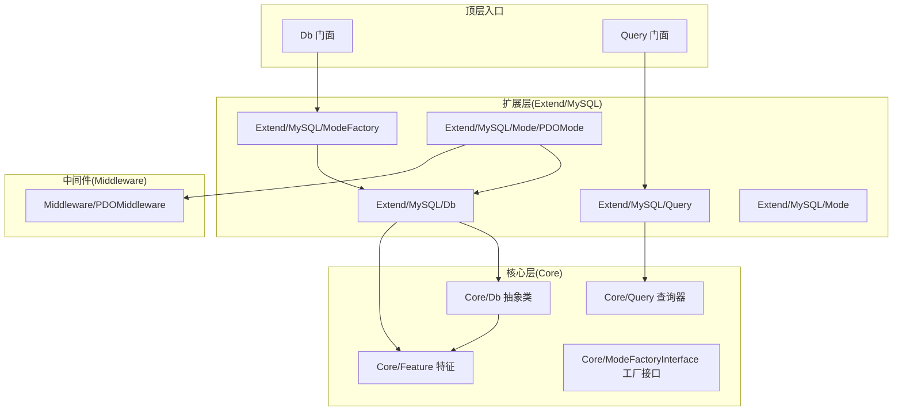
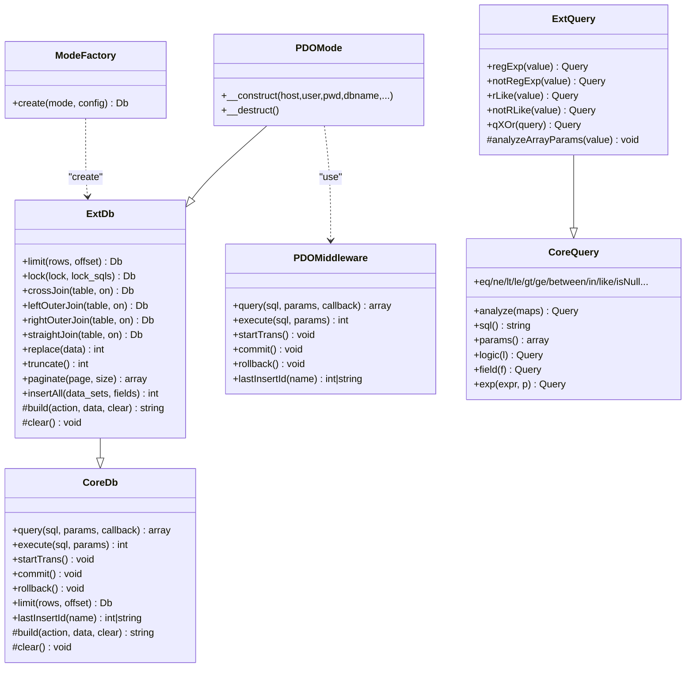
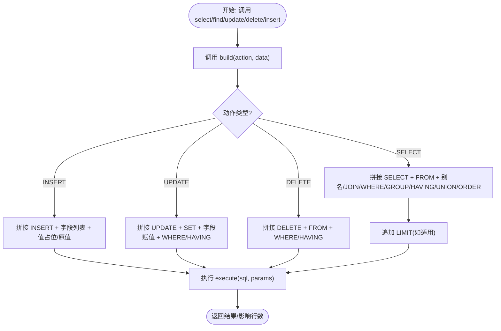
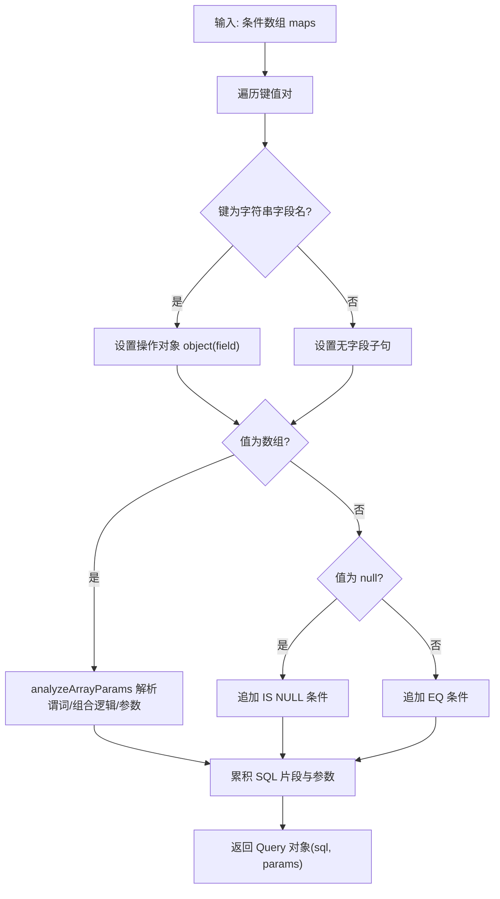
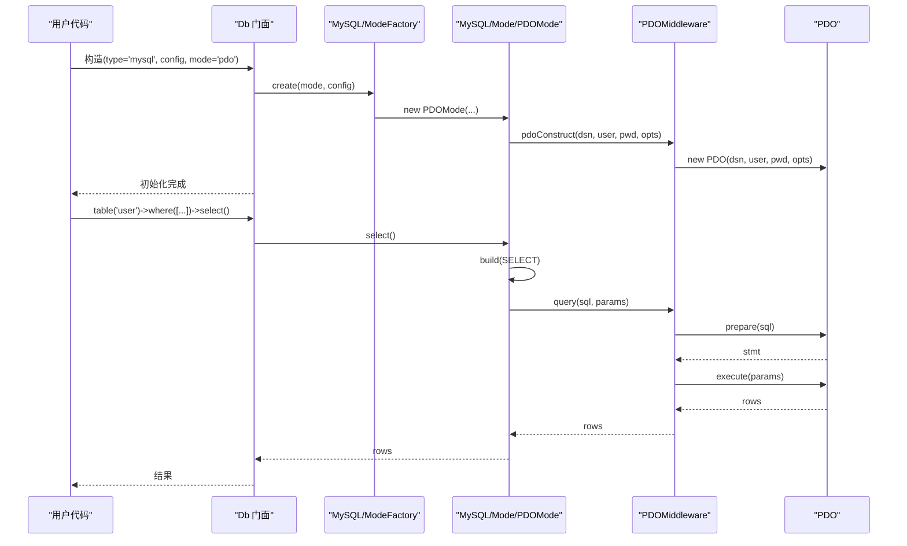
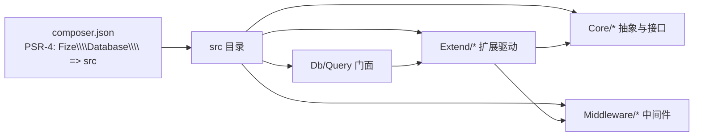

# 自定义数据库驱动开发

<cite>
**本文引用的文件**
- [src/Core/Db.php](file://src/Core/Db.php)
- [src/Core/Query.php](file://src/Core/Query.php)
- [src/Core/Feature.php](file://src/Core/Feature.php)
- [src/Core/ModeFactoryInterface.php](file://src/Core/ModeFactoryInterface.php)
- [src/Db.php](file://src/Db.php)
- [src/Query.php](file://src/Query.php)
- [src/Middleware/PDOMiddleware.php](file://src/Middleware/PDOMiddleware.php)
- [src/Extend/MySQL/Db.php](file://src/Extend/MySQL/Db.php)
- [src/Extend/MySQL/Query.php](file://src/Extend/MySQL/Query.php)
- [src/Extend/MySQL/Mode.php](file://src/Extend/MySQL/Mode.php)
- [src/Extend/MySQL/ModeFactory.php](file://src/Extend/MySQL/ModeFactory.php)
- [src/Extend/MySQL/Mode/PDOMode.php](file://src/Extend/MySQL/Mode/PDOMode.php)
- [composer.json](file://composer.json)
- [examples/db_connect.php](file://examples/db_connect.php)
- [tests/Extend/MySQL/TestDb.php](file://tests/Extend/MySQL/TestDb.php)
- [tests/Extend/MySQL/TestModeFactory.php](file://tests/Extend/MySQL/TestModeFactory.php)
</cite>

## 目录
1. [简介](#简介)
2. [项目结构](#项目结构)
3. [核心组件](#核心组件)
4. [架构总览](#架构总览)
5. [详细组件分析](#详细组件分析)
6. [依赖关系分析](#依赖关系分析)
7. [性能考量](#性能考量)
8. [故障排查指南](#故障排查指南)
9. [结论](#结论)
10. [附录](#附录)

## 简介
本指南面向希望基于 Core 层接口开发自定义数据库驱动的工程师，系统讲解如何继承 Db 抽象类、重写 Query 类、实现 Feature Trait，并完成接口实现、配置解析、SQL 构建与结果处理的全流程。文档以标准的 MySQL 驱动为参考实现，展示完整的驱动开发模式，同时给出测试方法、性能优化建议与兼容性注意事项，以及驱动与核心框架的集成方式与扩展点。

## 项目结构
该项目采用“核心层 + 扩展层 + 中间件”的分层设计：
- 核心层（Core）：定义 Db、Query、Feature、ModeFactoryInterface 等抽象与契约。
- 扩展层（Extend）：按数据库类型组织，如 MySQL、PgSQL、Oracle、SQLSRV、SQLite 等，每个类型包含 Db、Query、Mode、ModeFactory、若干 Mode 实现（如 PDO、ODBC、MySQLi）。
- 中间件层（Middleware）：封装具体驱动的底层交互，如 PDO、ODBC、ADODB 等，通过 trait 注入能力。
- 顶层入口（src/Db.php、src/Query.php）：对外提供静态便捷 API，并根据数据库类型动态绑定对应的扩展实现。

**图表来源**
- [src/Db.php:1-141](file://src/Db.php#L1-L141)
- [src/Query.php:1-130](file://src/Query.php#L1-L130)
- [src/Core/Db.php:1-941](file://src/Core/Db.php#L1-L941)
- [src/Core/Query.php:1-621](file://src/Core/Query.php#L1-L621)
- [src/Core/Feature.php:1-33](file://src/Core/Feature.php#L1-L33)
- [src/Core/ModeFactoryInterface.php:1-18](file://src/Core/ModeFactoryInterface.php#L1-L18)
- [src/Extend/MySQL/Db.php:1-246](file://src/Extend/MySQL/Db.php#L1-L246)
- [src/Extend/MySQL/Query.php:1-91](file://src/Extend/MySQL/Query.php#L1-L91)
- [src/Extend/MySQL/ModeFactory.php:1-82](file://src/Extend/MySQL/ModeFactory.php#L1-L82)
- [src/Extend/MySQL/Mode.php:1-74](file://src/Extend/MySQL/Mode.php#L1-L74)
- [src/Extend/MySQL/Mode/PDOMode.php:1-53](file://src/Extend/MySQL/Mode/PDOMode.php#L1-L53)
- [src/Middleware/PDOMiddleware.php:1-129](file://src/Middleware/PDOMiddleware.php#L1-L129)

**章节来源**
- [src/Db.php:1-141](file://src/Db.php#L1-L141)
- [src/Query.php:1-130](file://src/Query.php#L1-L130)
- [composer.json:1-47](file://composer.json#L1-L47)

## 核心组件
- Db 抽象类：定义统一的 CRUD 接口与 SQL 构建流程，提供链式 API（where、join、group、order、limit 等），并内置参数绑定与 SQL 日志能力。
- Query 查询器：将数组条件解析为 SQL 片段与参数数组，支持多种比较、集合、区间、存在性、正则等谓词。
- Feature 特征：提供 formatTable/formatField 等格式化钩子，供具体驱动覆盖以适配方言。
- ModeFactoryInterface：工厂接口，约束扩展驱动的工厂实现。
- 顶层 Db/Query 门面：负责根据数据库类型动态绑定扩展实现，提供静态便捷 API。

**章节来源**
- [src/Core/Db.php:1-941](file://src/Core/Db.php#L1-L941)
- [src/Core/Query.php:1-621](file://src/Core/Query.php#L1-L621)
- [src/Core/Feature.php:1-33](file://src/Core/Feature.php#L1-L33)
- [src/Core/ModeFactoryInterface.php:1-18](file://src/Core/ModeFactoryInterface.php#L1-L18)
- [src/Db.php:1-141](file://src/Db.php#L1-L141)
- [src/Query.php:1-130](file://src/Query.php#L1-L130)

## 架构总览
驱动开发遵循“扩展层 + 工厂 + 中间件”的模式：
- 扩展层 Db/Query：继承 Core 并覆盖差异化行为（如 MySQL 的 LIMIT、LOCK、REPLACE、TRUNCATE、分页统计等）。
- 工厂 ModeFactory：解析配置，按模式（pdo/odbc/mysqli）创建具体驱动实例。
- 中间件 PDOMiddleware：封装 PDO 底层交互，提供 query/execute/事务/lastInsertId 等能力。
- 顶层门面：Db/Query 根据类型动态绑定扩展实现，屏蔽上层差异。

**图表来源**
- [src/Core/Db.php:1-941](file://src/Core/Db.php#L1-L941)
- [src/Extend/MySQL/Db.php:1-246](file://src/Extend/MySQL/Db.php#L1-L246)
- [src/Core/Query.php:1-621](file://src/Core/Query.php#L1-L621)
- [src/Extend/MySQL/Query.php:1-91](file://src/Extend/MySQL/Query.php#L1-L91)
- [src/Extend/MySQL/ModeFactory.php:1-82](file://src/Extend/MySQL/ModeFactory.php#L1-L82)
- [src/Extend/MySQL/Mode/PDOMode.php:1-53](file://src/Extend/MySQL/Mode/PDOMode.php#L1-L53)
- [src/Middleware/PDOMiddleware.php:1-129](file://src/Middleware/PDOMiddleware.php#L1-L129)

## 详细组件分析

### Db 抽象类（接口与 SQL 构建）
- 关键职责
  - 定义 query/execute/startTrans/commit/rollback/limit/lastInsertId 等抽象方法。
  - 提供链式 API：where/join/group/order/union/field/alias 等。
  - build(action, data, clear) 统一构建 SELECT/INSERT/UPDATE/DELETE，并拼接 JOIN/GROUP/HAVING/ORDER/UNION/LIMIT 等子句。
  - select/find/findOrNull/value/column/page/count 等高层封装。
- 实现要点
  - 子类需覆盖 limit/build/clear 等以适配方言。
  - 使用 Feature 的 formatTable/formatField 钩子进行标识符格式化。
  - 参数绑定统一使用“?”占位符，避免 SQL 注入。

**图表来源**
- [src/Core/Db.php:583-637](file://src/Core/Db.php#L583-L637)
- [src/Core/Db.php:644-711](file://src/Core/Db.php#L644-L711)
- [src/Core/Db.php:718-800](file://src/Core/Db.php#L718-L800)

**章节来源**
- [src/Core/Db.php:1-941](file://src/Core/Db.php#L1-L941)

### Query 查询器（条件解析与 SQL 片段生成）
- 关键职责
  - analyze(maps) 将数组条件解析为 SQL 片段与参数数组。
  - 支持比较（= <> < > >= <=）、区间（BETWEEN/NOT BETWEEN）、集合（IN/NOT IN）、存在性（EXISTS/NOT EXISTS）、模糊（LIKE/NOT LIKE）、空值（IS NULL/IS NOT NULL）、正则（REGEXP/RLIKE 等，MySQL 扩展）。
  - qMerge/qAnd/qOr/qXOr 等组合能力。
- 实现要点
  - 子类可通过重写 analyzeArrayParams 扩展方言谓词。
  - 参数绑定策略：字符串或含特殊字符时使用“?”占位并加入 params；纯数值可直接拼接。

**图表来源**
- [src/Core/Query.php:521-568](file://src/Core/Query.php#L521-L568)
- [src/Core/Query.php:383-512](file://src/Core/Query.php#L383-L512)

**章节来源**
- [src/Core/Query.php:1-621](file://src/Core/Query.php#L1-L621)

### Feature 特征（方言格式化钩子）
- 关键职责
  - formatTable(str)：格式化表名（如加反引号、双引号等）。
  - formatField(str)：格式化字段名。
- 实现要点
  - 具体驱动可覆盖以适配方言（如 MySQL 反引号、SQL Server 方括号）。

**章节来源**
- [src/Core/Feature.php:1-33](file://src/Core/Feature.php#L1-L33)

### 工厂与模式（ModeFactoryInterface）
- 关键职责
  - ModeFactoryInterface：create(mode, config) 规范。
  - 具体驱动工厂（如 MySQL/ModeFactory）：解析配置，按模式创建 Db 实例，并设置表前缀等。
- 实现要点
  - 默认模式可设为 pdo；支持 mysqli/odbc/pdo 等。
  - 将通用配置（host/user/password/dbname/port/charset/prefix/socket/ssl/opts 等）透传给具体模式。

**章节来源**
- [src/Core/ModeFactoryInterface.php:1-18](file://src/Core/ModeFactoryInterface.php#L1-L18)
- [src/Extend/MySQL/ModeFactory.php:1-82](file://src/Extend/MySQL/ModeFactory.php#L1-L82)

### 中间件（以 PDO 为例）
- 关键职责
  - PDOMiddleware：封装 PDO 的 prepare/execute/fetch/事务/lastInsertId 等。
  - 统一异常包装为 DatabaseException，便于上层捕获与定位。
- 实现要点
  - query 支持回调逐行处理，减少内存占用。
  - execute 返回受影响行数。
  - 事务嵌套计数由顶层 Db 管理。

**章节来源**
- [src/Middleware/PDOMiddleware.php:1-129](file://src/Middleware/PDOMiddleware.php#L1-L129)

### 顶层门面（Db/Query）
- 关键职责
  - Db：静态入口，负责初始化/连接/事务/查询/执行/表选择/日志。
  - Query：根据数据库类型动态绑定扩展 Query，提供便捷静态方法。
- 实现要点
  - 通过反射式命名空间拼装扩展类，确保上层无感知切换。

**章节来源**
- [src/Db.php:1-141](file://src/Db.php#L1-L141)
- [src/Query.php:1-130](file://src/Query.php#L1-L130)

### MySQL 驱动参考实现
- 扩展 Db（MySQL/Db）
  - 覆盖 limit/build/clear：支持 MySQL 特有的 LIMIT offset,row 语法与 REPLACE/TRUNCATE/LOCK 等。
  - 新增 paginate：使用 SQL_CALC_FOUND_ROWS 与 FOUND_ROWS() 实现高效分页统计。
  - 新增 insertAll：批量插入多组数据。
- 扩展 Query（MySQL/Query）
  - 新增正则谓词：REGEXP/RLIKE 及其否定形式。
  - 新增 qXOr：异或组合。
- 模式工厂（MySQL/ModeFactory）
  - create：根据模式创建 MySQLi/ODBC/PDO 实例，设置表前缀。
- 模式（MySQL/Mode）
  - 提供 mysqli/odbc/pdo 工厂方法，便于不同环境选择。
- PDO 模式（MySQL/Mode/PDOMode）
  - 组装 DSN（host/dbname/port/socket/charset），注入 PDOMiddleware。

**图表来源**
- [src/Db.php:32-56](file://src/Db.php#L32-L56)
- [src/Extend/MySQL/ModeFactory.php:21-80](file://src/Extend/MySQL/ModeFactory.php#L21-L80)
- [src/Extend/MySQL/Mode/PDOMode.php:29-42](file://src/Extend/MySQL/Mode/PDOMode.php#L29-L42)
- [src/Middleware/PDOMiddleware.php:51-72](file://src/Middleware/PDOMiddleware.php#L51-L72)

**章节来源**
- [src/Extend/MySQL/Db.php:1-246](file://src/Extend/MySQL/Db.php#L1-L246)
- [src/Extend/MySQL/Query.php:1-91](file://src/Extend/MySQL/Query.php#L1-L91)
- [src/Extend/MySQL/Mode.php:1-74](file://src/Extend/MySQL/Mode.php#L1-L74)
- [src/Extend/MySQL/ModeFactory.php:1-82](file://src/Extend/MySQL/ModeFactory.php#L1-L82)
- [src/Extend/MySQL/Mode/PDOMode.php:1-53](file://src/Extend/MySQL/Mode/PDOMode.php#L1-L53)

## 依赖关系分析
- PSR-4 自动加载映射：Fize\Database\ → src，确保扩展驱动按命名空间自动加载。
- 扩展驱动依赖
  - Core 抽象与接口（Db/Query/Feature/ModeFactoryInterface）。
  - 中间件（如 PDOMiddleware）。
  - 上层门面（Db/Query）。
- 外部依赖
  - PHP ≥ 7.1；建议 ≥ 7.2。
  - 各驱动扩展（ext-pdo_mysql、ext-pdo、ext-mysqli、ext-odbc 等）按需安装。

**图表来源**
- [composer.json:11-18](file://composer.json#L11-L18)
- [src/Db.php:37-55](file://src/Db.php#L37-L55)
- [src/Query.php:26](file://src/Query.php#L26)

**章节来源**
- [composer.json:1-47](file://composer.json#L1-L47)

## 性能考量
- 使用参数绑定（? 占位符）避免字符串拼接，降低 CPU 与网络开销。
- 分页优先使用 SQL_CALC_FOUND_ROWS + FOUND_ROWS()（MySQL 已实现），减少二次 COUNT 查询。
- 大结果集场景使用回调式 query 的逐行处理，降低内存峰值。
- 合理使用索引与 WHERE 条件，避免全表扫描。
- 批量插入使用 insertAll，减少多次往返。
- 事务嵌套由顶层管理，避免不必要的 begin/commit/rollback 调用。

[本节为通用指导，无需特定文件引用]

## 故障排查指南
- 常见异常
  - DatabaseException：中间件捕获底层异常并包装，包含 SQL 与参数信息，便于定位。
  - DataNotFoundException：find 未找到记录时抛出。
- 排查步骤
  - 打印 getLastSql(true) 获取最终 SQL 与参数，核对字段名与表名格式化。
  - 检查配置项（host/port/dbname/user/password/charset/socket/ssl/opts/prefix）是否正确。
  - 在 PDO 模式下确认 ext-pdo_mysql 已启用。
  - 使用单元测试验证工厂 create 与具体模式构造。

**章节来源**
- [src/Middleware/PDOMiddleware.php:69-71](file://src/Middleware/PDOMiddleware.php#L69-L71)
- [src/Core/Db.php:199-206](file://src/Core/Db.php#L199-L206)
- [tests/Extend/MySQL/TestModeFactory.php:1-24](file://tests/Extend/MySQL/TestModeFactory.php#L1-L24)
- [tests/Extend/MySQL/TestDb.php:1-70](file://tests/Extend/MySQL/TestDb.php#L1-L70)

## 结论
通过“Core 抽象 + 扩展驱动 + 工厂 + 中间件 + 顶层门面”的分层设计，项目实现了高度可扩展的数据库驱动体系。开发者只需遵循 Db/Query/Feature 的契约，结合合适的中间件与工厂配置，即可快速完成新驱动开发，并获得与现有 MySQL 驱动一致的使用体验与性能表现。

[本节为总结，无需特定文件引用]

## 附录

### 驱动开发步骤清单
- 继承 Core Db/Query，实现抽象方法与差异化逻辑。
- 实现 Feature 的 formatTable/formatField，适配方言。
- 编写 ModeFactory，解析配置并创建具体模式实例。
- 选择合适中间件（PDO/ODBC/MySQLi），注入能力。
- 在顶层门面中注册扩展类型，确保 PSR-4 自动加载生效。
- 编写单元测试，覆盖工厂、模式构造、CRUD、分页、事务等场景。

**章节来源**
- [src/Core/Db.php:111-134](file://src/Core/Db.php#L111-L134)
- [src/Core/Query.php:13-16](file://src/Core/Query.php#L13-L16)
- [src/Core/Feature.php:18-31](file://src/Core/Feature.php#L18-L31)
- [src/Extend/MySQL/ModeFactory.php:21-80](file://src/Extend/MySQL/ModeFactory.php#L21-L80)
- [src/Middleware/PDOMiddleware.php:26-34](file://src/Middleware/PDOMiddleware.php#L26-L34)
- [composer.json:11-18](file://composer.json#L11-L18)

### 配置解析与示例
- 示例配置项
  - host、user、password、dbname、port、charset、prefix、opts、real、socket、ssl_set、flags、driver。
- 示例入口
  - 通过 Db('mysql', $config, 'pdo') 或 Db::connect('mysql', $config) 初始化。

**章节来源**
- [src/Extend/MySQL/ModeFactory.php:24-34](file://src/Extend/MySQL/ModeFactory.php#L24-L34)
- [examples/db_connect.php:1-39](file://examples/db_connect.php#L1-L39)

### 测试方法
- 工厂测试：验证 create 返回对象类型与配置生效。
- 功能测试：验证分页、批量插入、JOIN、LOCK、TRUNCATE、REPLACE 等。
- 建议使用 PHPUnit，按扩展类型建立独立测试套件。

**章节来源**
- [tests/Extend/MySQL/TestModeFactory.php:1-24](file://tests/Extend/MySQL/TestModeFactory.php#L1-L24)
- [tests/Extend/MySQL/TestDb.php:1-70](file://tests/Extend/MySQL/TestDb.php#L1-L70)