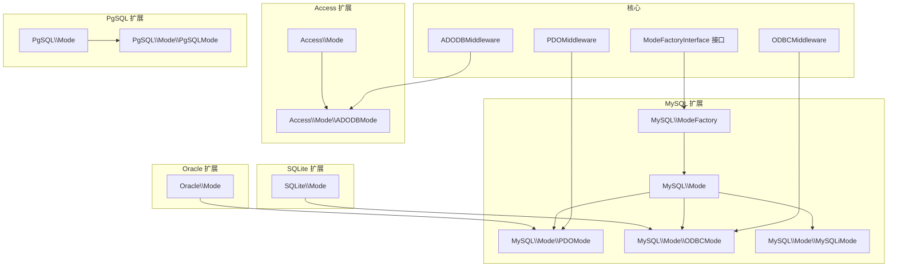
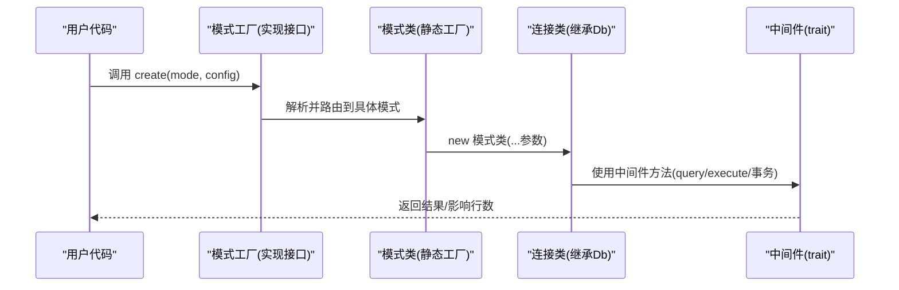
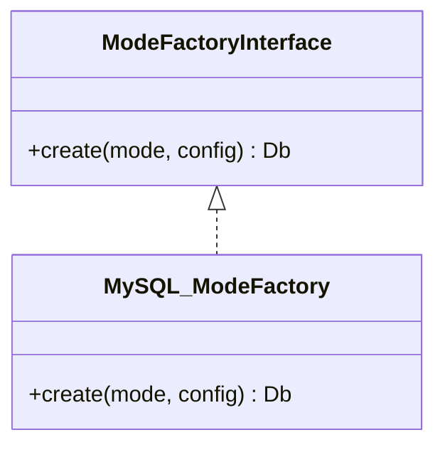
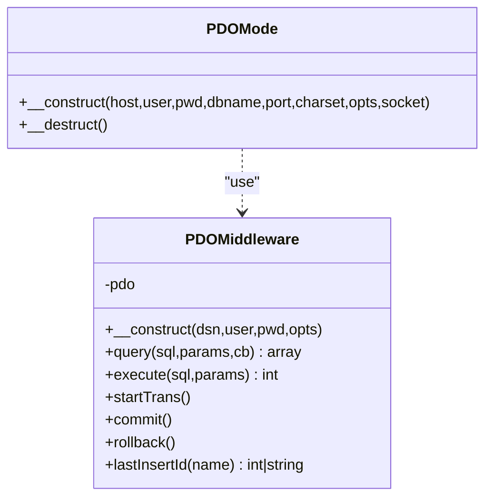
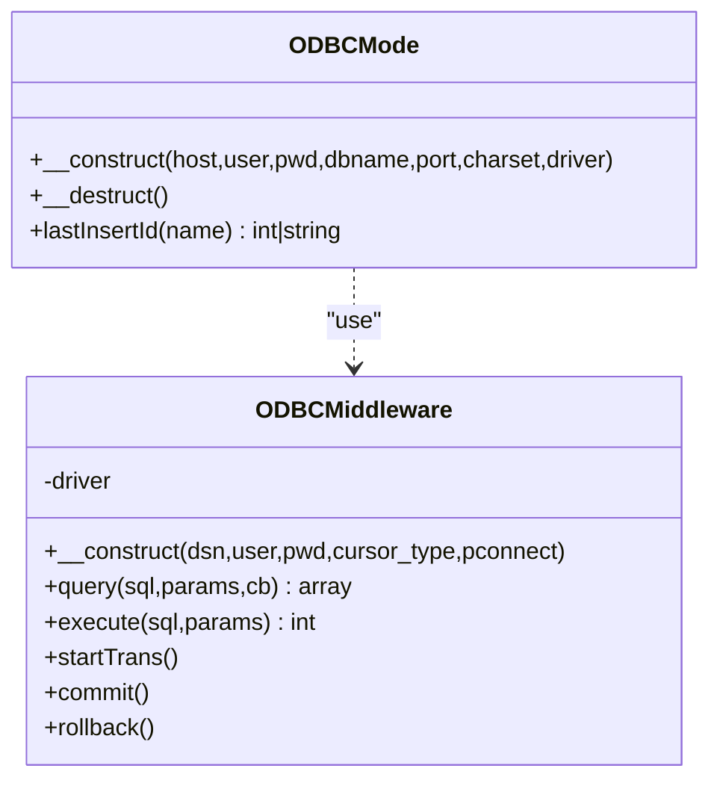
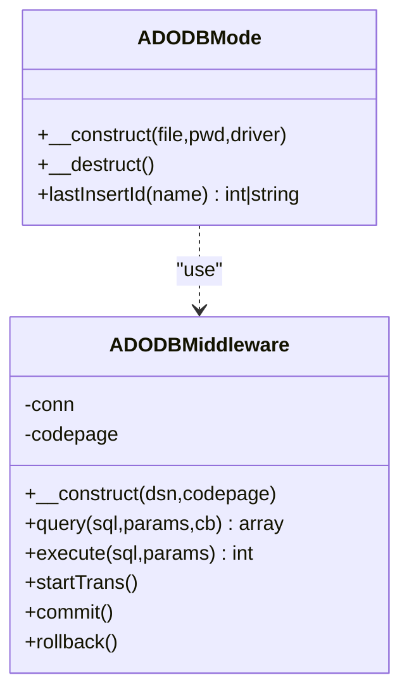
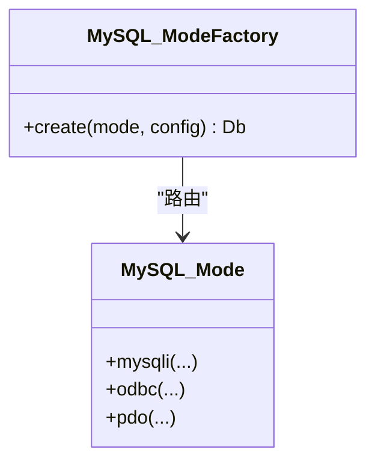
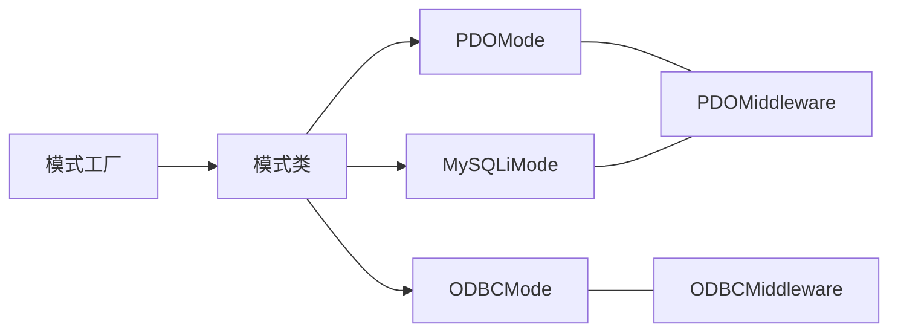

# 连接模式扩展

<cite>
**本文引用的文件**
- [src/Core/ModeFactoryInterface.php](file://src/Core/ModeFactoryInterface.php)
- [src/Middleware/PDOMiddleware.php](file://src/Middleware/PDOMiddleware.php)
- [src/Middleware/ODBCMiddleware.php](file://src/Middleware/ODBCMiddleware.php)
- [src/Middleware/ADODBMiddleware.php](file://src/Middleware/ADODBMiddleware.php)
- [src/Extend/MySQL/ModeFactory.php](file://src/Extend/MySQL/ModeFactory.php)
- [src/Extend/MySQL/Mode.php](file://src/Extend/MySQL/Mode.php)
- [src/Extend/Access/Mode.php](file://src/Extend/Access/Mode.php)
- [src/Extend/PgSQL/Mode.php](file://src/Extend/PgSQL/Mode.php)
- [src/Extend/SQLite/Mode.php](file://src/Extend/SQLite/Mode.php)
- [src/Extend/Oracle/Mode.php](file://src/Extend/Oracle/Mode.php)
- [src/Extend/MySQL/Mode/PDOMode.php](file://src/Extend/MySQL/Mode/PDOMode.php)
- [src/Extend/MySQL/Mode/ODBCMode.php](file://src/Extend/MySQL/Mode/ODBCMode.php)
- [src/Extend/MySQL/Mode/MySQLiMode.php](file://src/Extend/MySQL/Mode/MySQLiMode.php)
- [src/Extend/Access/Mode/ADODBMode.php](file://src/Extend/Access/Mode/ADODBMode.php)
- [src/Extend/PgSQL/Mode/PgSQLMode.php](file://src/Extend/PgSQL/Mode/PgSQLMode.php)
</cite>

## 目录
1. [简介](#简介)
2. [项目结构](#项目结构)
3. [核心组件](#核心组件)
4. [架构总览](#架构总览)
5. [详细组件分析](#详细组件分析)
6. [依赖关系分析](#依赖关系分析)
7. [性能考虑](#性能考虑)
8. [故障排查指南](#故障排查指南)
9. [结论](#结论)
10. [附录](#附录)

## 简介
本指南面向希望扩展“连接模式”的开发者，系统讲解如何在现有框架中实现新的数据库连接模式（PDO、ODBC、ADODB），包括：
- 实现 ModeFactoryInterface 接口的工厂类
- 开发连接中间件（Middleware）以统一封装底层驱动能力
- 处理连接参数与 DSN 构造
- 基于现有 MySQL/Access/PgSQL/SQLite/Oracle 的实现模式，给出自定义扩展步骤
- 连接池管理、错误处理、性能优化最佳实践
- 将新模式集成到现有驱动中的完整流程

## 项目结构
该项目采用“按数据库类型分包 + 模式工厂 + 中间件”的组织方式：
- 核心接口与中间件位于顶层目录
- 各数据库扩展位于 Extend/<DB>/ 下，包含 ModeFactory、Mode、Db、Feature、Query 等
- ModeFactory 负责根据传入的模式字符串选择具体连接类
- Mode 类提供静态工厂方法，封装不同模式的构造细节
- 中间件通过 trait 统一注入 query/execute/事务/自增 ID 等通用能力

图表来源
- [src/Core/ModeFactoryInterface.php:1-18](file://src/Core/ModeFactoryInterface.php#L1-L18)
- [src/Middleware/PDOMiddleware.php:1-129](file://src/Middleware/PDOMiddleware.php#L1-L129)
- [src/Middleware/ODBCMiddleware.php:1-100](file://src/Middleware/ODBCMiddleware.php#L1-L100)
- [src/Middleware/ADODBMiddleware.php:1-116](file://src/Middleware/ADODBMiddleware.php#L1-L116)
- [src/Extend/MySQL/ModeFactory.php:1-82](file://src/Extend/MySQL/ModeFactory.php#L1-L82)
- [src/Extend/MySQL/Mode.php:1-74](file://src/Extend/MySQL/Mode.php#L1-L74)
- [src/Extend/Access/Mode.php:1-51](file://src/Extend/Access/Mode.php#L1-L51)
- [src/Extend/PgSQL/Mode.php:1-59](file://src/Extend/PgSQL/Mode.php#L1-L59)
- [src/Extend/SQLite/Mode.php:1-56](file://src/Extend/SQLite/Mode.php#L1-L56)
- [src/Extend/Oracle/Mode.php:1-63](file://src/Extend/Oracle/Mode.php#L1-L63)

章节来源
- [src/Core/ModeFactoryInterface.php:1-18](file://src/Core/ModeFactoryInterface.php#L1-L18)
- [src/Extend/MySQL/ModeFactory.php:1-82](file://src/Extend/MySQL/ModeFactory.php#L1-L82)
- [src/Extend/MySQL/Mode.php:1-74](file://src/Extend/MySQL/Mode.php#L1-L74)

## 核心组件
- 模式工厂接口：定义 create(mode, config) 方法，用于按模式字符串创建具体连接实例
- 中间件层：以 trait 形式提供 query/execute/事务/自增 ID 等通用能力，屏蔽底层差异
- 模式类：集中暴露静态工厂方法，负责参数校验、DSN 构造与连接初始化
- 工厂类：解析配置，合并默认值，路由到具体模式类

章节来源
- [src/Core/ModeFactoryInterface.php:1-18](file://src/Core/ModeFactoryInterface.php#L1-L18)
- [src/Middleware/PDOMiddleware.php:1-129](file://src/Middleware/PDOMiddleware.php#L1-L129)
- [src/Middleware/ODBCMiddleware.php:1-100](file://src/Middleware/ODBCMiddleware.php#L1-L100)
- [src/Middleware/ADODBMiddleware.php:1-116](file://src/Middleware/ADODBMiddleware.php#L1-L116)
- [src/Extend/MySQL/ModeFactory.php:1-82](file://src/Extend/MySQL/ModeFactory.php#L1-L82)
- [src/Extend/MySQL/Mode.php:1-74](file://src/Extend/MySQL/Mode.php#L1-L74)

## 架构总览
下图展示了“模式工厂 → 模式类 → 连接类（继承 Db）+ 中间件”的典型调用链。

图表来源
- [src/Core/ModeFactoryInterface.php:1-18](file://src/Core/ModeFactoryInterface.php#L1-L18)
- [src/Extend/MySQL/ModeFactory.php:1-82](file://src/Extend/MySQL/ModeFactory.php#L1-L82)
- [src/Extend/MySQL/Mode.php:1-74](file://src/Extend/MySQL/Mode.php#L1-L74)
- [src/Extend/MySQL/Mode/PDOMode.php:1-53](file://src/Extend/MySQL/Mode/PDOMode.php#L1-L53)
- [src/Extend/MySQL/Mode/ODBCMode.php:1-61](file://src/Extend/MySQL/Mode/ODBCMode.php#L1-L61)
- [src/Extend/MySQL/Mode/MySQLiMode.php:1-251](file://src/Extend/MySQL/Mode/MySQLiMode.php#L1-L251)

## 详细组件分析

### 模式工厂接口与实现
- 接口职责：create(mode, config) → 返回 Db 实例
- 实现要点：默认值合并、模式分支、异常抛出、前缀设置等
- 示例参考：MySQL 的 ModeFactory

图表来源
- [src/Core/ModeFactoryInterface.php:1-18](file://src/Core/ModeFactoryInterface.php#L1-L18)
- [src/Extend/MySQL/ModeFactory.php:1-82](file://src/Extend/MySQL/ModeFactory.php#L1-L82)

章节来源
- [src/Core/ModeFactoryInterface.php:1-18](file://src/Core/ModeFactoryInterface.php#L1-L18)
- [src/Extend/MySQL/ModeFactory.php:1-82](file://src/Extend/MySQL/ModeFactory.php#L1-L82)

### PDO 模式（推荐）
- 中间件能力：构造 PDO、prepare/execute、fetch 循环、事务、lastInsertId
- 连接类：根据 host/dbname/port/socket/charset 构造 DSN 并初始化
- 适用场景：跨数据库、可移植性强、生态完善

图表来源
- [src/Middleware/PDOMiddleware.php:1-129](file://src/Middleware/PDOMiddleware.php#L1-L129)
- [src/Extend/MySQL/Mode/PDOMode.php:1-53](file://src/Extend/MySQL/Mode/PDOMode.php#L1-L53)

章节来源
- [src/Middleware/PDOMiddleware.php:1-129](file://src/Middleware/PDOMiddleware.php#L1-L129)
- [src/Extend/MySQL/Mode/PDOMode.php:1-53](file://src/Extend/MySQL/Mode/PDOMode.php#L1-L53)

### ODBC 模式
- 中间件能力：prepare/execute/fetch/freeResult、事务控制（autocommit/commit/rollback）
- 连接类：根据 driver/host/dbname/port/charset 构造 DSN
- 注意事项：ODBC 返回字段类型多为字符串，需上层做类型转换

图表来源
- [src/Middleware/ODBCMiddleware.php:1-100](file://src/Middleware/ODBCMiddleware.php#L1-L100)
- [src/Extend/MySQL/Mode/ODBCMode.php:1-61](file://src/Extend/MySQL/Mode/ODBCMode.php#L1-L61)

章节来源
- [src/Middleware/ODBCMiddleware.php:1-100](file://src/Middleware/ODBCMiddleware.php#L1-L100)
- [src/Extend/MySQL/Mode/ODBCMode.php:1-61](file://src/Extend/MySQL/Mode/ODBCMode.php#L1-L61)

### ADODB 模式（Windows/OLEDB）
- 中间件能力：COM 对象生命周期、RecordSet 遍历、事务 Begin/Commit/Rollback
- 连接类：基于 Provider/DataSource/Jet OLEDB:Database Password 构造 DSN
- 适用场景：Windows 环境访问 Access 等数据源

图表来源
- [src/Middleware/ADODBMiddleware.php:1-116](file://src/Middleware/ADODBMiddleware.php#L1-L116)
- [src/Extend/Access/Mode/ADODBMode.php:1-60](file://src/Extend/Access/Mode/ADODBMode.php#L1-L60)

章节来源
- [src/Middleware/ADODBMiddleware.php:1-116](file://src/Middleware/ADODBMiddleware.php#L1-L116)
- [src/Extend/Access/Mode/ADODBMode.php:1-60](file://src/Extend/Access/Mode/ADODBMode.php#L1-L60)

### MySQL 模式族
- 模式类提供 mysqli/odbc/pdo 三种静态工厂方法
- ModeFactory 支持默认参数合并与模式路由
- MySQLiMode 自带多语句执行、类型推断绑定、事务与自增 ID

图表来源
- [src/Extend/MySQL/Mode.php:1-74](file://src/Extend/MySQL/Mode.php#L1-L74)
- [src/Extend/MySQL/ModeFactory.php:1-82](file://src/Extend/MySQL/ModeFactory.php#L1-L82)

章节来源
- [src/Extend/MySQL/Mode.php:1-74](file://src/Extend/MySQL/Mode.php#L1-L74)
- [src/Extend/MySQL/ModeFactory.php:1-82](file://src/Extend/MySQL/ModeFactory.php#L1-L82)

### 其他数据库模式族
- Access：提供 ADODB/ODBC/PDO 三种模式
- PgSQL：提供 ODBC/PDO/PgSQL 原生命令
- SQLite：提供 ODBC/PDO/SQLite3 三种模式
- Oracle：提供 OCI/ODBC/PDO 三种模式

章节来源
- [src/Extend/Access/Mode.php:1-51](file://src/Extend/Access/Mode.php#L1-L51)
- [src/Extend/PgSQL/Mode.php:1-59](file://src/Extend/PgSQL/Mode.php#L1-L59)
- [src/Extend/SQLite/Mode.php:1-56](file://src/Extend/SQLite/Mode.php#L1-L56)
- [src/Extend/Oracle/Mode.php:1-63](file://src/Extend/Oracle/Mode.php#L1-L63)

## 依赖关系分析
- 模式工厂依赖模式类的静态工厂方法
- 连接类依赖 Db 基类与对应中间件 trait
- 中间件依赖底层扩展（PDO/ODBC/COM）
- 不同数据库扩展之间通过相同的接口与模式类保持一致的调用体验

图表来源
- [src/Extend/MySQL/ModeFactory.php:1-82](file://src/Extend/MySQL/ModeFactory.php#L1-L82)
- [src/Extend/MySQL/Mode.php:1-74](file://src/Extend/MySQL/Mode.php#L1-L74)
- [src/Extend/MySQL/Mode/PDOMode.php:1-53](file://src/Extend/MySQL/Mode/PDOMode.php#L1-L53)
- [src/Extend/MySQL/Mode/ODBCMode.php:1-61](file://src/Extend/MySQL/Mode/ODBCMode.php#L1-L61)
- [src/Extend/MySQL/Mode/MySQLiMode.php:1-251](file://src/Extend/MySQL/Mode/MySQLiMode.php#L1-L251)
- [src/Middleware/PDOMiddleware.php:1-129](file://src/Middleware/PDOMiddleware.php#L1-L129)
- [src/Middleware/ODBCMiddleware.php:1-100](file://src/Middleware/ODBCMiddleware.php#L1-L100)

## 性能考虑
- 连接复用与长连接
  - ODBC 支持 pconnect 参数；PgSQL 支持长连接标志；MySQLi 支持 socket/flags
  - 在高并发场景优先考虑复用已有连接，避免频繁握手
- 预处理与绑定
  - 优先使用 ? 占位符与绑定参数，减少 SQL 注入风险与解析开销
  - PDO/MySQLi 的 prepare/bind 流程已在中间件中封装
- 结果集处理
  - 大结果集建议使用回调逐行消费，避免一次性加载内存
  - ODBC 的 fetchArray/PGSQL 的游标遍历均支持回调
- 事务批处理
  - 将多个写操作放入事务块，减少提交次数
- 字符集与编码
  - 明确 charset，避免隐式转换带来的性能损耗
- 错误与超时
  - 设置合理的 busy_timeout（SQLite）、超时（ODBC）、异常模式（PDO）

## 故障排查指南
- PDO 异常包装
  - query/execute 捕获 PDOException 并抛出统一 DatabaseException，便于定位 SQL 与参数
- ODBC 类型问题
  - ODBC 返回字段多为字符串，需在上层做显式类型转换
- ADODB 执行失败
  - 执行失败时抛出统一异常，检查 DSN 与 Provider 配置
- MySQLi 绑定类型
  - bind_param 的 vtypes 需根据参数自动推断，确保类型匹配
- 事务一致性
  - startTrans/commit/rollback 必须成对出现；PGSQL/ODBC/ADO 的事务 API 名称略有差异，注意调用

章节来源
- [src/Middleware/PDOMiddleware.php:1-129](file://src/Middleware/PDOMiddleware.php#L1-L129)
- [src/Middleware/ODBCMiddleware.php:1-100](file://src/Middleware/ODBCMiddleware.php#L1-L100)
- [src/Middleware/ADODBMiddleware.php:1-116](file://src/Middleware/ADODBMiddleware.php#L1-L116)
- [src/Extend/MySQL/Mode/MySQLiMode.php:1-251](file://src/Extend/MySQL/Mode/MySQLiMode.php#L1-L251)
- [src/Extend/PgSQL/Mode/PgSQLMode.php:1-140](file://src/Extend/PgSQL/Mode/PgSQLMode.php#L1-L140)

## 结论
通过“模式工厂 + 模式类 + 中间件 + 连接类”的分层设计，项目实现了对多种数据库连接模式的统一抽象与扩展。遵循本文的开发步骤与最佳实践，即可快速实现新的连接模式并无缝集成到现有驱动体系中。

## 附录

### 自定义连接模式开发步骤
- 步骤一：实现模式工厂接口
  - 新建类实现接口的 create(mode, config)，合并默认配置，按模式分支创建具体连接类实例
  - 参考路径：[src/Core/ModeFactoryInterface.php:1-18](file://src/Core/ModeFactoryInterface.php#L1-L18)、[src/Extend/MySQL/ModeFactory.php:1-82](file://src/Extend/MySQL/ModeFactory.php#L1-L82)

- 步骤二：开发连接中间件（可选）
  - 若底层驱动差异较大，建议抽取 trait，统一 query/execute/事务/自增 ID 等方法
  - 参考路径：[src/Middleware/PDOMiddleware.php:1-129](file://src/Middleware/PDOMiddleware.php#L1-L129)、[src/Middleware/ODBCMiddleware.php:1-100](file://src/Middleware/ODBCMiddleware.php#L1-L100)、[src/Middleware/ADODBMiddleware.php:1-116](file://src/Middleware/ADODBMiddleware.php#L1-L116)

- 步骤三：创建连接类
  - 继承 Db，构造函数中完成 DSN/参数拼装与连接初始化
  - 如需中间件，使用 use trait
  - 参考路径：[src/Extend/MySQL/Mode/PDOMode.php:1-53](file://src/Extend/MySQL/Mode/PDOMode.php#L1-L53)、[src/Extend/MySQL/Mode/ODBCMode.php:1-61](file://src/Extend/MySQL/Mode/ODBCMode.php#L1-L61)、[src/Extend/Access/Mode/ADODBMode.php:1-60](file://src/Extend/Access/Mode/ADODBMode.php#L1-L60)

- 步骤四：在模式类中注册静态工厂方法
  - 在目标数据库扩展的 Mode 类中新增静态方法，返回新连接类实例
  - 参考路径：[src/Extend/MySQL/Mode.php:1-74](file://src/Extend/MySQL/Mode.php#L1-L74)、[src/Extend/Access/Mode.php:1-51](file://src/Extend/Access/Mode.php#L1-L51)、[src/Extend/PgSQL/Mode.php:1-59](file://src/Extend/PgSQL/Mode.php#L1-L59)、[src/Extend/SQLite/Mode.php:1-56](file://src/Extend/SQLite/Mode.php#L1-L56)、[src/Extend/Oracle/Mode.php:1-63](file://src/Extend/Oracle/Mode.php#L1-L63)

- 步骤五：集成到工厂
  - 在工厂类的 switch 分支中增加新模式分支，映射到新连接类
  - 参考路径：[src/Extend/MySQL/ModeFactory.php:1-82](file://src/Extend/MySQL/ModeFactory.php#L1-L82)

- 步骤六：参数与 DSN 规范化
  - 明确参数键名与默认值，统一 DSN 构造逻辑，保证跨平台兼容
  - 参考路径：[src/Extend/MySQL/Mode/PDOMode.php:1-53](file://src/Extend/MySQL/Mode/PDOMode.php#L1-L53)、[src/Extend/MySQL/Mode/ODBCMode.php:1-61](file://src/Extend/MySQL/Mode/ODBCMode.php#L1-L61)

- 步骤七：错误处理与日志
  - 包装底层异常为统一异常类型，保留 SQL 与参数上下文
  - 参考路径：[src/Middleware/PDOMiddleware.php:1-129](file://src/Middleware/PDOMiddleware.php#L1-L129)、[src/Middleware/ADODBMiddleware.php:1-116](file://src/Middleware/ADODBMiddleware.php#L1-L116)

- 步骤八：性能优化与连接池
  - 长连接/复用连接、批量写入事务、回调流式读取、合理设置字符集与超时
  - 参考路径：[src/Middleware/ODBCMiddleware.php:1-100](file://src/Middleware/ODBCMiddleware.php#L1-L100)、[src/Extend/PgSQL/Mode/PgSQLMode.php:1-140](file://src/Extend/PgSQL/Mode/PgSQLMode.php#L1-L140)

- 步骤九：测试与验证
  - 编写单元测试覆盖 create/mode/static factory/中间件行为
  - 参考现有测试组织方式与断言风格