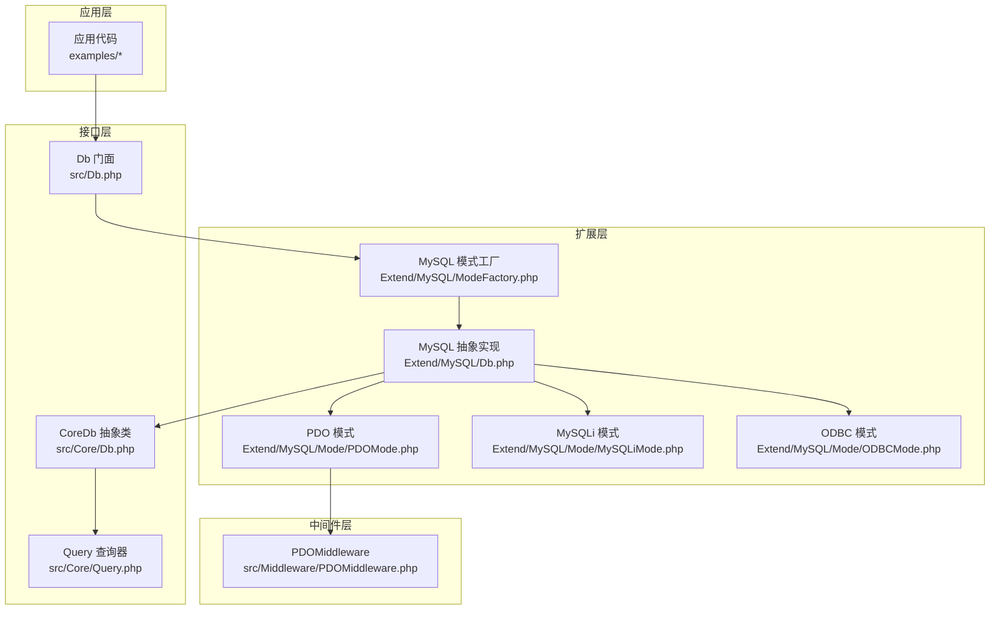
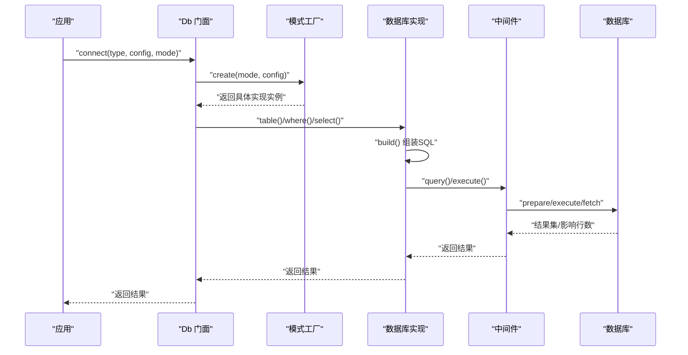
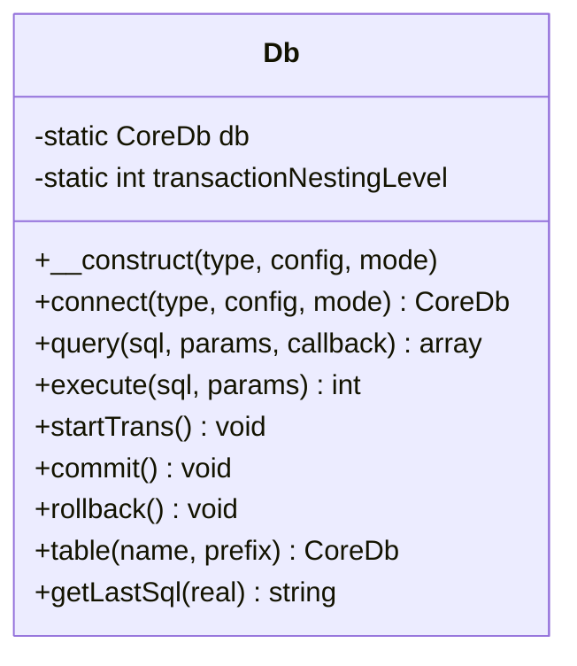
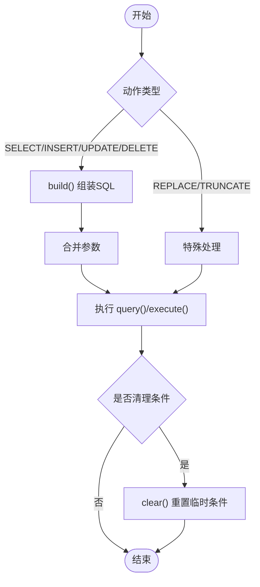
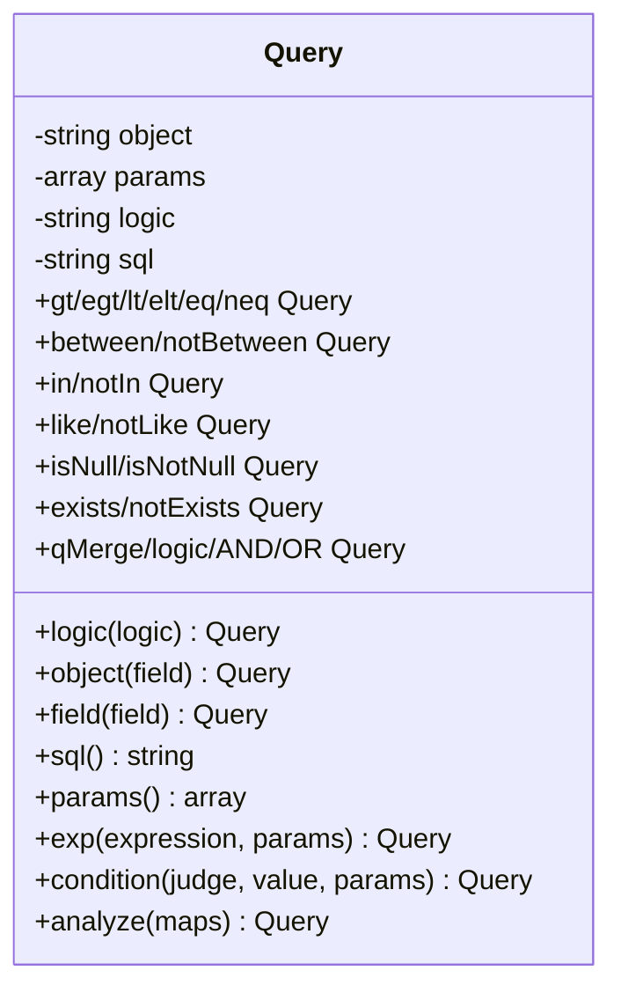
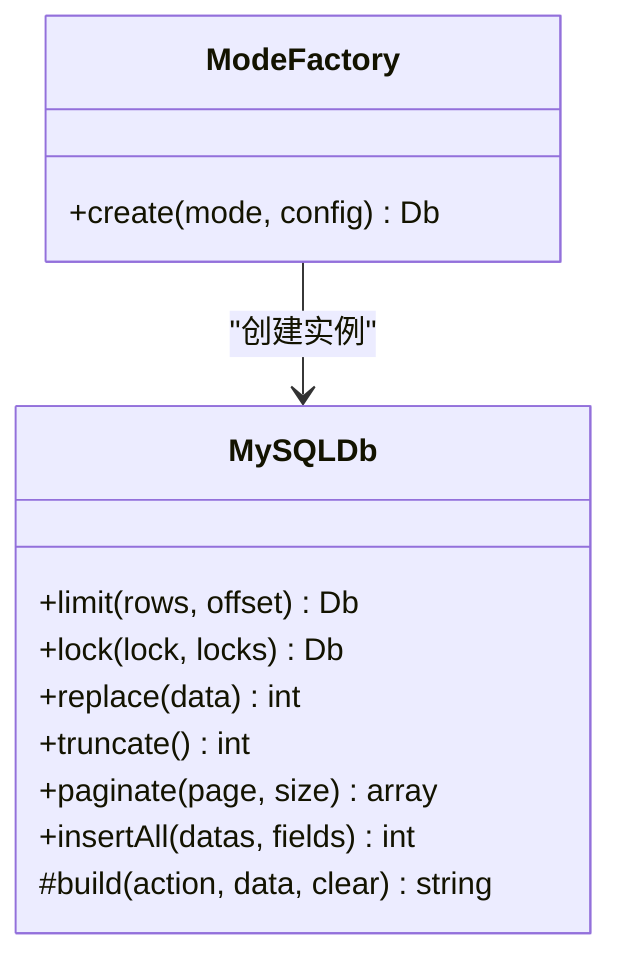
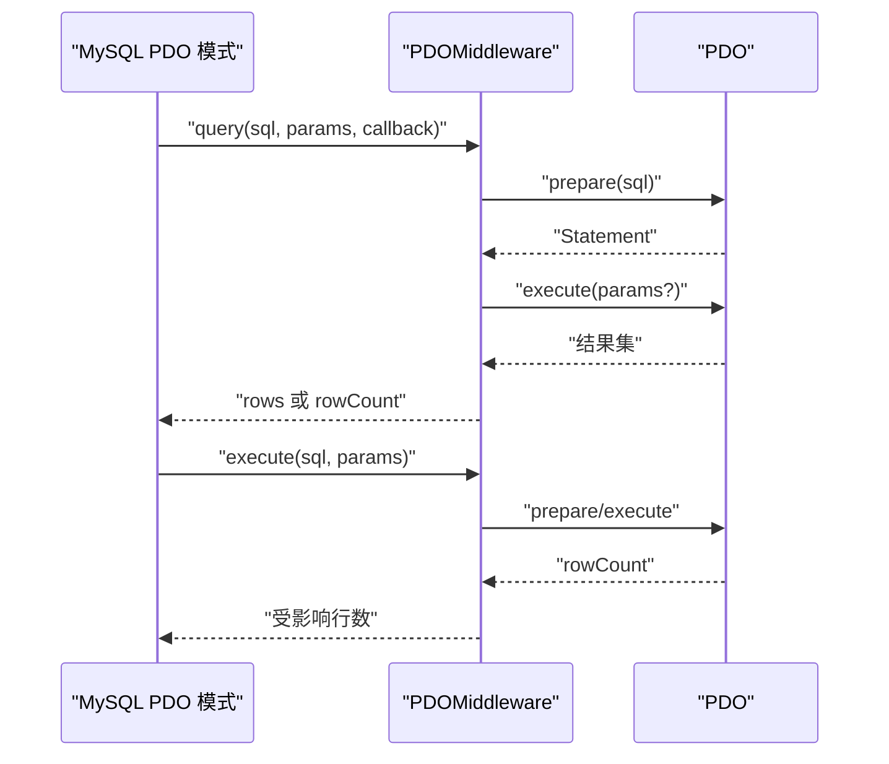
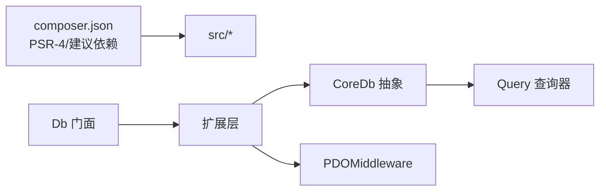
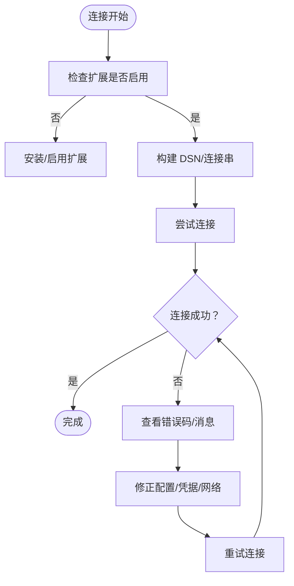

# 故障排除

<cite>
**本文档引用的文件**   
- [composer.json](file://composer.json)
- [Db.php](file://src/Db.php)
- [Core/Db.php](file://src/Core/Db.php)
- [Core/Query.php](file://src/Core/Query.php)
- [Extend/MySQL/ModeFactory.php](file://src/Extend/MySQL/ModeFactory.php)
- [Extend/MySQL/Db.php](file://src/Extend/MySQL/Db.php)
- [Extend/MySQL/Mode/PDOMode.php](file://src/Extend/MySQL/Mode/PDOMode.php)
- [Extend/MySQL/Mode/MySQLiMode.php](file://src/Extend/MySQL/Mode/MySQLiMode.php)
- [Extend/MySQL/Mode/ODBCMode.php](file://src/Extend/MySQL/Mode/ODBCMode.php)
- [Middleware/PDOMiddleware.php](file://src/Middleware/PDOMiddleware.php)
- [examples/db_connect.php](file://examples/db_connect.php)
- [examples/db_select.php](file://examples/db_select.php)
- [tests/Extend/SQLSRV/Mode/TestODBCMode.php](file://tests/Extend/SQLSRV/Mode/TestODBCMode.php)
- [tests/Extend/PgSQL/Mode/TestODBCMode.php](file://tests/Extend/PgSQL/Mode/TestODBCMode.php)
- [tests/Extend/Oracle/Driver/TestOCI.php](file://tests/Extend/Oracle/Driver/TestOCI.php)
- [tests/Extend/PgSQL/Driver/TestPgSQL.php](file://tests/Extend/PgSQL/Driver/TestPgSQL.php)
- [tests/TestDb.php](file://tests/TestDb.php)
</cite>

## 目录
1. [简介](#简介)
2. [项目结构](#项目结构)
3. [核心组件](#核心组件)
4. [架构总览](#架构总览)
5. [详细组件分析](#详细组件分析)
6. [依赖关系分析](#依赖关系分析)
7. [性能考虑](#性能考虑)
8. [故障排除指南](#故障排除指南)
9. [结论](#结论)
10. [附录](#附录)

## 简介
本指南面向使用 FizeDatabase 的开发者与运维人员，提供系统化的故障排除方法与实践建议。内容覆盖安装与环境准备、配置错误定位、连接失败排查、查询异常处理、事务与并发问题、跨数据库类型（MySQL、PostgreSQL、Oracle、SQL Server、SQLite）的特定问题，以及日志分析、错误追踪与性能诊断等实用技巧。同时给出社区支持与获取帮助的渠道。

## 项目结构
FizeDatabase 采用分层与扩展设计：
- 核心层：抽象数据库基类与查询器，提供统一的查询构建与执行接口。
- 扩展层：按数据库类型划分目录，每种数据库提供多种连接模式（PDO、MySQLi、ODBC），并通过模式工厂统一创建。
- 中间件层：封装 PDO/ODBC 等底层交互细节，集中处理异常转换与事务控制。
- 示例与测试：提供最小可用示例与覆盖各数据库模式的单元测试，便于复现与验证问题。

**图表来源**
- [Db.php:13-56](file://src/Db.php#L13-L56)
- [Core/Db.php:13-135](file://src/Core/Db.php#L13-L135)
- [Core/Query.php:13-105](file://src/Core/Query.php#L13-L105)
- [Extend/MySQL/ModeFactory.php:21-80](file://src/Extend/MySQL/ModeFactory.php#L21-L80)
- [Extend/MySQL/Db.php:11-152](file://src/Extend/MySQL/Db.php#L11-L152)
- [Extend/MySQL/Mode/PDOMode.php:29-42](file://src/Extend/MySQL/Mode/PDOMode.php#L29-L42)
- [Extend/MySQL/Mode/MySQLiMode.php:42-65](file://src/Extend/MySQL/Mode/MySQLiMode.php#L42-L65)
- [Extend/MySQL/Mode/ODBCMode.php:29-39](file://src/Extend/MySQL/Mode/ODBCMode.php#L29-L39)
- [Middleware/PDOMiddleware.php:26-34](file://src/Middleware/PDOMiddleware.php#L26-L34)

**章节来源**
- [composer.json:11-37](file://composer.json#L11-L37)
- [Db.php:13-56](file://src/Db.php#L13-L56)
- [Core/Db.php:13-135](file://src/Core/Db.php#L13-L135)
- [Core/Query.php:13-105](file://src/Core/Query.php#L13-L105)
- [Extend/MySQL/ModeFactory.php:21-80](file://src/Extend/MySQL/ModeFactory.php#L21-L80)
- [Extend/MySQL/Db.php:11-152](file://src/Extend/MySQL/Db.php#L11-L152)
- [Extend/MySQL/Mode/PDOMode.php:29-42](file://src/Extend/MySQL/Mode/PDOMode.php#L29-L42)
- [Extend/MySQL/Mode/MySQLiMode.php:42-65](file://src/Extend/MySQL/Mode/MySQLiMode.php#L42-L65)
- [Extend/MySQL/Mode/ODBCMode.php:29-39](file://src/Extend/MySQL/Mode/ODBCMode.php#L29-L39)
- [Middleware/PDOMiddleware.php:26-34](file://src/Middleware/PDOMiddleware.php#L26-L34)

## 核心组件
- 门面 Db：提供静态入口，负责根据数据库类型与模式创建连接，并代理查询、执行、事务等操作。
- 抽象核心 CoreDb：定义查询构建、执行、事务、缓存等通用能力；派生类按数据库方言实现差异。
- 查询器 Query：将数组/对象条件解析为 SQL 片段与参数，支持 AND/OR 组合、表达式、IN/LIKE/BETWEEN 等。
- 模式工厂 ModeFactory：根据配置与模式选择具体驱动实现（PDO/MySQLi/ODBC）。
- 中间件 PDOMiddleware：封装 PDO 的 prepare/execute/fetch/closeCursor 等流程与异常转换。

**章节来源**
- [Db.php:32-140](file://src/Db.php#L32-L140)
- [Core/Db.php:105-135](file://src/Core/Db.php#L105-L135)
- [Core/Query.php:102-105](file://src/Core/Query.php#L102-L105)
- [Extend/MySQL/ModeFactory.php:21-80](file://src/Extend/MySQL/ModeFactory.php#L21-L80)
- [Middleware/PDOMiddleware.php:51-93](file://src/Middleware/PDOMiddleware.php#L51-L93)

## 架构总览
FizeDatabase 的调用链路如下：应用通过 Db 门面发起请求，门面经由模式工厂创建具体数据库实现，再由实现类调用中间件完成底层交互。查询器贯穿于条件组装阶段，确保 SQL 安全与可维护性。

**图表来源**
- [Db.php:32-140](file://src/Db.php#L32-L140)
- [Extend/MySQL/ModeFactory.php:21-80](file://src/Extend/MySQL/ModeFactory.php#L21-L80)
- [Extend/MySQL/Db.php:129-152](file://src/Extend/MySQL/Db.php#L129-L152)
- [Middleware/PDOMiddleware.php:51-93](file://src/Middleware/PDOMiddleware.php#L51-L93)

## 详细组件分析

### 组件A：Db 门面与连接生命周期
- 职责：创建/持有连接实例，提供静态代理方法（query/execute/table/getLastSql），管理事务嵌套计数。
- 关键点：构造函数通过模式工厂创建具体实现；静态方法直接委托给内部连接实例；事务开始/提交/回滚受嵌套计数保护。
- 常见问题：未正确初始化连接导致 getLastSql 返回空；多次嵌套事务导致回滚提前结束。

**图表来源**
- [Db.php:32-140](file://src/Db.php#L32-L140)

**章节来源**
- [Db.php:32-140](file://src/Db.php#L32-L140)

### 组件B：CoreDb 抽象与查询构建
- 职责：统一的 SQL 组装（SELECT/INSERT/UPDATE/DELETE/REPLACE/TRUNCATE），参数绑定，条件拼接，缓存与最后 SQL 输出。
- 关键点：build() 根据动作类型组装 SQL 并合并参数；clear() 清理一次性条件；getLastSql() 支持真实 SQL 与预处理 SQL。
- 常见问题：非法 SQL 动作被拒绝；未清理条件导致重复查询污染；参数绑定顺序与数量不匹配。

**图表来源**
- [Core/Db.php:583-637](file://src/Core/Db.php#L583-L637)

**章节来源**
- [Core/Db.php:583-637](file://src/Core/Db.php#L583-L637)

### 组件C：Query 查询器
- 职责：将数组/表达式条件解析为 SQL 片段与参数，支持 between/in/like/isNull 等常用谓词及组合逻辑。
- 关键点：analyze() 解析多维条件数组；merge()/qMerge() 支持 Query 对象组合；exp()/condition() 控制参数绑定策略。
- 常见问题：字符串值未正确转义或绑定；IN/BETWEEN 参数类型与占位符混用；逻辑组合（AND/OR）误用。

**图表来源**
- [Core/Query.php:13-105](file://src/Core/Query.php#L13-L105)

**章节来源**
- [Core/Query.php:383-568](file://src/Core/Query.php#L383-L568)

### 组件D：MySQL 模式工厂与实现
- 模式工厂：根据 mode 选择 mysqli/pdo/odbc，合并默认配置，设置表前缀。
- MySQL 抽象实现：扩展 LIMIT/LOCK/分页/批量插入等 MySQL 特性；build() 支持 REPLACE/TRUNCATE。
- 常见问题：模式不支持（如传入未知 mode）；端口/字符集/套接字/SSL 参数配置不当；ODBC 驱动名称不匹配。

**图表来源**
- [Extend/MySQL/ModeFactory.php:21-80](file://src/Extend/MySQL/ModeFactory.php#L21-L80)
- [Extend/MySQL/Db.php:11-152](file://src/Extend/MySQL/Db.php#L11-L152)

**章节来源**
- [Extend/MySQL/ModeFactory.php:21-80](file://src/Extend/MySQL/ModeFactory.php#L21-L80)
- [Extend/MySQL/Db.php:11-152](file://src/Extend/MySQL/Db.php#L11-L152)

### 组件E：PDO 中间件
- 职责：封装 PDO 的 prepare/execute/fetch/closeCursor，统一异常转换为数据库异常，提供事务与 lastInsertId。
- 常见问题：PDO 扩展缺失；DSN/用户名/密码/选项不正确；异常未捕获导致中断。

**图表来源**
- [Extend/MySQL/Mode/PDOMode.php:29-42](file://src/Extend/MySQL/Mode/PDOMode.php#L29-L42)
- [Middleware/PDOMiddleware.php:51-93](file://src/Middleware/PDOMiddleware.php#L51-L93)

**章节来源**
- [Extend/MySQL/Mode/PDOMode.php:29-42](file://src/Extend/MySQL/Mode/PDOMode.php#L29-L42)
- [Middleware/PDOMiddleware.php:51-93](file://src/Middleware/PDOMiddleware.php#L51-L93)

## 依赖关系分析
- Composer 自动加载 PSR-4 映射至 src 目录；开发依赖包含 PHPUnit；建议依赖包含各类数据库扩展（PDO/MySQLi/ODBC/OCI/PgSQL/SQLite/SQLSRV）。
- Db 门面依赖扩展层的模式工厂；核心 Db 依赖查询器；PDO 模式依赖 PDOMiddleware。

**图表来源**
- [composer.json:11-37](file://composer.json#L11-L37)
- [Db.php:5-6](file://src/Db.php#L5-L6)
- [Core/Db.php:5-6](file://src/Core/Db.php#L5-L6)
- [Core/Query.php:6-7](file://src/Core/Query.php#L6-L7)

**章节来源**
- [composer.json:11-37](file://composer.json#L11-L37)
- [Db.php:5-6](file://src/Db.php#L5-L6)
- [Core/Db.php:5-6](file://src/Core/Db.php#L5-L6)
- [Core/Query.php:6-7](file://src/Core/Query.php#L6-L7)

## 性能考虑
- 查询缓存：CoreDb 支持按真实 SQL 缓存结果集，减少重复查询开销；适用于稳定查询场景。
- 分页：MySQL 抽象提供分页方法，结合 SQL_CALC_FOUND_ROWS 与 FOUND_ROWS() 可减少二次统计成本。
- 流式遍历：支持回调式 fetch，避免一次性拉取大结果集造成内存压力。
- 参数绑定：优先使用占位符绑定，避免字符串拼接带来的性能与安全问题。

**章节来源**
- [Core/Db.php:696-711](file://src/Core/Db.php#L696-L711)
- [Extend/MySQL/Db.php:187-203](file://src/Extend/MySQL/Db.php#L187-L203)

## 故障排除指南

### 一、安装与环境准备
- PHP 版本要求：确保 PHP 版本满足 composer.json 中的最低要求。
- 扩展建议：根据目标数据库与模式启用相应扩展（PDO/MySQLi/ODBC/OCI/PgSQL/SQLite/SQLSRV）。若缺少扩展，连接将失败或出现未定义行为。
- 自动加载：确认 vendor/autoload.php 正确引入，PSR-4 命名空间映射正常。

**章节来源**
- [composer.json:16-37](file://composer.json#L16-L37)
- [Db.php:1-14](file://src/Db.php#L1-L14)

### 二、配置错误定位
- 数据库类型与模式：确保 type 与 mode 在对应扩展目录下存在且受支持。例如 MySQL 支持 mysqli/pdo/odbc。
- 默认配置合并：模式工厂会合并默认配置，检查端口、字符集、前缀、选项等是否符合预期。
- DSN/连接串：PDO/ODBC 需要正确的 DSN/连接串；MySQLi 支持 real_connect 与 SSL 参数；Oracle/SQL Server/PgSQL 有各自的连接方式与参数。

**章节来源**
- [Extend/MySQL/ModeFactory.php:24-34](file://src/Extend/MySQL/ModeFactory.php#L24-L34)
- [Extend/MySQL/Mode/PDOMode.php:31-41](file://src/Extend/MySQL/Mode/PDOMode.php#L31-L41)
- [Extend/MySQL/Mode/MySQLiMode.php:42-65](file://src/Extend/MySQL/Mode/MySQLiMode.php#L42-L65)
- [Extend/MySQL/Mode/ODBCMode.php:31-38](file://src/Extend/MySQL/Mode/ODBCMode.php#L31-L38)

### 三、连接失败排查
- PDO 连接异常：检查用户名、密码、主机、端口、数据库名、字符集、选项；确认 PDO 扩展已启用。
- MySQLi 连接异常：检查 real_connect/ssl_set/flags/socket 等参数；关注 errno/error 输出。
- ODBC 连接异常：确认驱动名称、服务器、数据库、端口、字符集；不同平台驱动名称可能不同。
- Oracle/SQL Server/PgSQL：参考对应驱动的连接方法与错误处理。

**图表来源**
- [Middleware/PDOMiddleware.php:26-34](file://src/Middleware/PDOMiddleware.php#L26-L34)
- [Extend/MySQL/Mode/MySQLiMode.php:60-62](file://src/Extend/MySQL/Mode/MySQLiMode.php#L60-L62)
- [Extend/MySQL/Mode/ODBCMode.php:31-38](file://src/Extend/MySQL/Mode/ODBCMode.php#L31-L38)

**章节来源**
- [Middleware/PDOMiddleware.php:26-34](file://src/Middleware/PDOMiddleware.php#L26-L34)
- [Extend/MySQL/Mode/MySQLiMode.php:60-62](file://src/Extend/MySQL/Mode/MySQLiMode.php#L60-L62)
- [Extend/MySQL/Mode/ODBCMode.php:31-38](file://src/Extend/MySQL/Mode/ODBCMode.php#L31-L38)

### 四、查询异常处理
- 非法 SQL 动作：build() 对不支持的动作抛出异常，检查 SQL 动作是否为 DELETE/INSERT/REPLACE/SELECT/UPDATE。
- 参数绑定：确保问号占位符与绑定参数一一对应；字符串值需正确转义或使用占位符绑定。
- 查询器条件：使用数组条件时，注意组合逻辑与字段名；IN/BETWEEN/LIKE 等谓词的参数类型与占位符混用问题。
- 回调式查询：使用回调可降低内存占用，但需确保回调逻辑健壮。

**章节来源**
- [Core/Db.php:608-610](file://src/Core/Db.php#L608-L610)
- [Core/Query.php:145-164](file://src/Core/Query.php#L145-L164)

### 五、事务与并发问题
- 嵌套事务：Db 门面维护事务嵌套计数，仅在最外层开始/提交/回滚；避免错误嵌套导致提前回滚。
- 模式事务：PDO/MySQLi/ODBC 模式分别提供事务方法；确保在同连接上下文中使用。
- 并发冲突：合理设置隔离级别与锁策略；必要时使用显式锁或悲观/乐观锁。

**章节来源**
- [Db.php:84-114](file://src/Db.php#L84-L114)
- [Middleware/PDOMiddleware.php:98-117](file://src/Middleware/PDOMiddleware.php#L98-L117)
- [Extend/MySQL/Mode/MySQLiMode.php:220-239](file://src/Extend/MySQL/Mode/MySQLiMode.php#L220-L239)
- [Extend/MySQL/Mode/ODBCMode.php:29-39](file://src/Extend/MySQL/Mode/ODBCMode.php#L29-L39)

### 六、跨数据库类型特定问题
- MySQL
  - PDO：检查 DSN、字符集、选项；确保 ERRMODE_EXCEPTION 已设置。
  - MySQLi：real_connect/ssl_set/flags/socket 参数；多语句查询需谨慎。
  - ODBC：驱动名称与平台相关；lastInsertId 使用特定 SQL。
- PostgreSQL
  - ODBC 模式：参考测试用例验证事务与回滚行为。
  - PgSQL 驱动：支持错误严重级别、socket、trace、事务状态等特性。
- Oracle
  - OCI 连接与错误：connect/error 方法返回错误信息；支持持久连接、TAF 回调、LOB 操作等。
- SQL Server
  - ODBC 模式：参考测试用例验证事务与回滚行为。
- SQLite
  - 模式工厂与模式：参考 SQLite 目录下的模式实现与工厂。

**章节来源**
- [Extend/MySQL/Mode/PDOMode.php:29-42](file://src/Extend/MySQL/Mode/PDOMode.php#L29-L42)
- [Extend/MySQL/Mode/MySQLiMode.php:42-65](file://src/Extend/MySQL/Mode/MySQLiMode.php#L42-L65)
- [Extend/MySQL/Mode/ODBCMode.php:31-38](file://src/Extend/MySQL/Mode/ODBCMode.php#L31-L38)
- [tests/Extend/PgSQL/Mode/TestODBCMode.php:87-117](file://tests/Extend/PgSQL/Mode/TestODBCMode.php#L87-L117)
- [tests/Extend/PgSQL/Driver/TestPgSQL.php:848-886](file://tests/Extend/PgSQL/Driver/TestPgSQL.php#L848-L886)
- [tests/Extend/Oracle/Driver/TestOCI.php:111-143](file://tests/Extend/Oracle/Driver/TestOCI.php#L111-L143)
- [tests/Extend/SQLSRV/Mode/TestODBCMode.php:88-125](file://tests/Extend/SQLSRV/Mode/TestODBCMode.php#L88-L125)

### 七、系统化调试方法与工具
- 日志分析
  - 使用 Db::getLastSql(true) 获取真实 SQL，核对参数绑定与拼接是否正确。
  - 在生产环境避免直接执行日志 SQL，仅用于排错。
- 错误追踪
  - PDO 中间件将底层异常包装为数据库异常，包含 SQL 与参数，便于定位。
  - 检查异常消息与错误码，结合 DSN/凭据/网络进行排查。
- 性能诊断
  - 使用查询缓存减少重复查询；对大结果集采用回调式遍历。
  - 分页查询结合统计查询，避免全表扫描。
- 示例与测试
  - 使用 examples 下的最小示例快速复现问题。
  - 参考各数据库模式的测试用例，验证事务、回滚、连接等行为。

**章节来源**
- [Db.php:136-139](file://src/Db.php#L136-L139)
- [Middleware/PDOMiddleware.php:69-71](file://src/Middleware/PDOMiddleware.php#L69-L71)
- [examples/db_connect.php:6-38](file://examples/db_connect.php#L6-L38)
- [examples/db_select.php:6-21](file://examples/db_select.php#L6-L21)

### 八、常见问题清单与解决方案
- 安装问题
  - 现象：类未找到/自动加载失败
  - 排查：确认 vendor/autoload.php 引入；PSR-4 命名空间映射；Composer 安装完整
- 配置错误
  - 现象：连接超时/认证失败/字符集乱码
  - 排查：核对 host/port/user/password/dbname/charset/socket/driver；检查 SSL/选项
- 连接失败
  - 现象：PDO/MySQLi/ODBC 报错
  - 排查：扩展是否启用；DSN/连接串是否正确；防火墙/端口；凭据是否过期
- 查询异常
  - 现象：参数不匹配/非法动作/结果为空
  - 排查：核对占位符与参数数量；检查 SQL 动作；使用查询器数组条件规范
- 事务问题
  - 现象：嵌套事务回滚提前/提交失败
  - 排查：检查嵌套计数；确保同一连接上下文；参考测试用例验证行为
- 跨数据库类型
  - 现象：驱动名称不匹配/OCI/SQL Server/PgSQL 行为差异
  - 排查：核对驱动名称与平台；参考对应测试用例；检查方言差异

**章节来源**
- [composer.json:16-37](file://composer.json#L16-L37)
- [Extend/MySQL/ModeFactory.php:24-34](file://src/Extend/MySQL/ModeFactory.php#L24-L34)
- [Middleware/PDOMiddleware.php:26-34](file://src/Middleware/PDOMiddleware.php#L26-L34)
- [Core/Db.php:608-610](file://src/Core/Db.php#L608-L610)
- [Db.php:84-114](file://src/Db.php#L84-L114)
- [tests/Extend/PgSQL/Mode/TestODBCMode.php:87-117](file://tests/Extend/PgSQL/Mode/TestODBCMode.php#L87-L117)
- [tests/Extend/SQLSRV/Mode/TestODBCMode.php:88-125](file://tests/Extend/SQLSRV/Mode/TestODBCMode.php#L88-L125)
- [tests/Extend/Oracle/Driver/TestOCI.php:111-143](file://tests/Extend/Oracle/Driver/TestOCI.php#L111-L143)

## 结论
通过理解 FizeDatabase 的分层架构与组件职责，结合系统化的调试方法与跨数据库类型的特定问题排查，能够高效定位并解决大多数连接、查询与事务问题。建议在开发与生产环境中遵循参数绑定、查询缓存、流式遍历与日志分析的最佳实践，持续优化性能与稳定性。

## 附录
- 社区支持与获取帮助
  - GitHub Issues：在仓库中提交问题，附带最小可复现示例与环境信息。
  - 文档与示例：参考 examples 与 tests 目录，快速验证问题与修复方案。
  - 扩展与版本：根据 composer.json 的建议依赖，确保所需扩展已安装并启用。

**章节来源**
- [examples/db_connect.php:1-39](file://examples/db_connect.php#L1-L39)
- [examples/db_select.php:1-22](file://examples/db_select.php#L1-L22)
- [tests/TestDb.php:1-51](file://tests/TestDb.php#L1-L51)