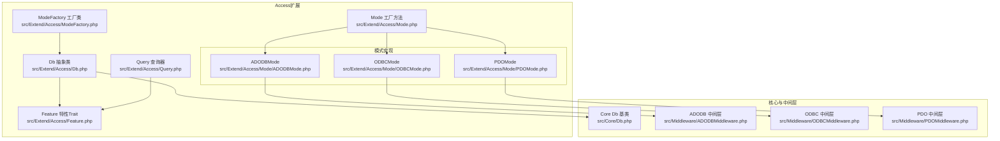
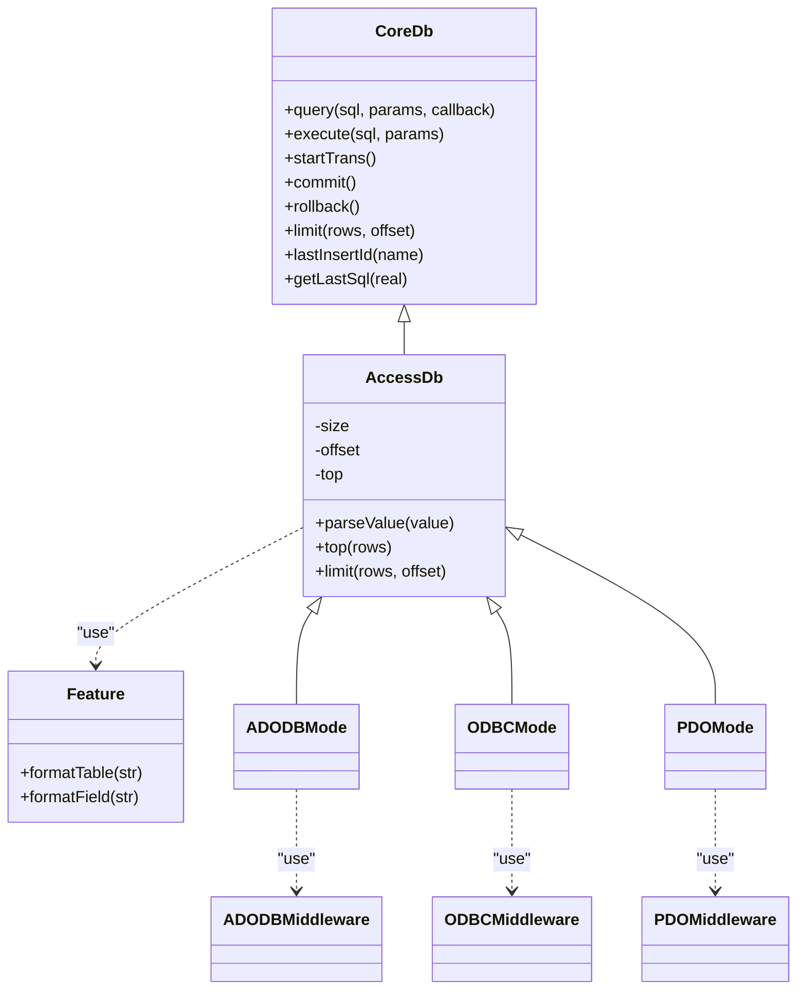
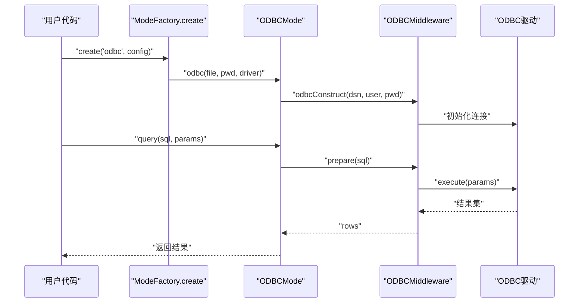
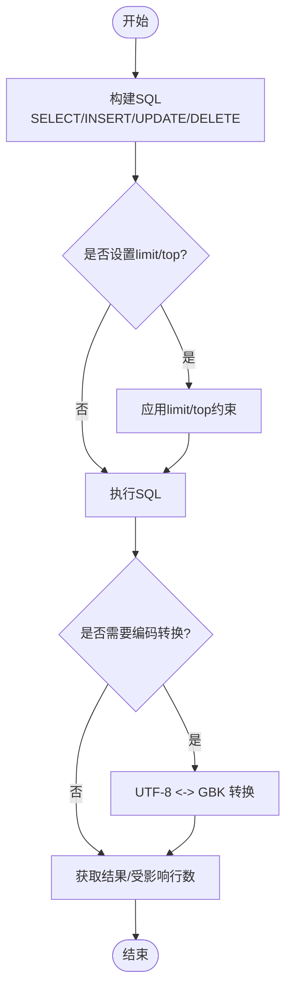

# Access驱动

<cite>
**本文引用的文件**
- [src/Extend/Access/Db.php](file://src/Extend/Access/Db.php)
- [src/Extend/Access/ModeFactory.php](file://src/Extend/Access/ModeFactory.php)
- [src/Extend/Access/Feature.php](file://src/Extend/Access/Feature.php)
- [src/Extend/Access/Query.php](file://src/Extend/Access/Query.php)
- [src/Extend/Access/Mode.php](file://src/Extend/Access/Mode.php)
- [src/Extend/Access/Mode/ADODBMode.php](file://src/Extend/Access/Mode/ADODBMode.php)
- [src/Extend/Access/Mode/ODBCMode.php](file://src/Extend/Access/Mode/ODBCMode.php)
- [src/Extend/Access/Mode/PDOMode.php](file://src/Extend/Access/Mode/PDOMode.php)
- [src/Core/Db.php](file://src/Core/Db.php)
- [src/Middleware/ADODBMiddleware.php](file://src/Middleware/ADODBMiddleware.php)
- [src/Middleware/ODBCMiddleware.php](file://src/Middleware/ODBCMiddleware.php)
- [src/Middleware/PDOMiddleware.php](file://src/Middleware/PDOMiddleware.php)
- [composer.json](file://composer.json)
- [tests/Extend/Access/Mode/TestADODBMode.php](file://tests/Extend/Access/Mode/TestADODBMode.php)
- [tests/Extend/Access/Mode/TestODBCMode.php](file://tests/Extend/Access/Mode/TestODBCMode.php)
- [tests/Extend/Access/Mode/TestPDOMode.php](file://tests/Extend/Access/Mode/TestPDOMode.php)
</cite>

## 目录
1. [简介](#简介)
2. [项目结构](#项目结构)
3. [核心组件](#核心组件)
4. [架构总览](#架构总览)
5. [详细组件分析](#详细组件分析)
6. [依赖关系分析](#依赖关系分析)
7. [性能与兼容性](#性能与兼容性)
8. [故障排查指南](#故障排查指南)
9. [结论](#结论)
10. [附录](#附录)

## 简介
本章节面向希望在FizeDatabase中使用Microsoft Access数据库的开发者，系统讲解Access驱动的配置与使用要点，包括：
- 文件路径配置与真实路径解析
- 密码数据库的处理方式
- Jet/Ace数据库引擎要求与驱动选择
- Access特有的查询语法与限制（如TOP、@@IDENTITY）
- 宏与报表支持现状
- 配置示例、文件权限与跨平台兼容性
- 驱动局限性与适用场景

## 项目结构
Access驱动位于扩展模块中，采用“模式工厂 + 多模式实现”的架构，分别提供ADODB、ODBC、PDO三种连接方式，并通过统一的Db基类与特性Trait实现一致的查询接口。

图示来源
- [src/Extend/Access/Db.php:1-73](file://src/Extend/Access/Db.php#L1-L73)
- [src/Extend/Access/Feature.php:1-51](file://src/Extend/Access/Feature.php#L1-L51)
- [src/Extend/Access/Query.php:1-14](file://src/Extend/Access/Query.php#L1-L14)
- [src/Extend/Access/Mode.php:1-51](file://src/Extend/Access/Mode.php#L1-L51)
- [src/Extend/Access/ModeFactory.php:1-49](file://src/Extend/Access/ModeFactory.php#L1-L49)
- [src/Extend/Access/Mode/ADODBMode.php:1-60](file://src/Extend/Access/Mode/ADODBMode.php#L1-L60)
- [src/Extend/Access/Mode/ODBCMode.php:1-94](file://src/Extend/Access/Mode/ODBCMode.php#L1-L94)
- [src/Extend/Access/Mode/PDOMode.php:1-146](file://src/Extend/Access/Mode/PDOMode.php#L1-L146)
- [src/Core/Db.php:1-800](file://src/Core/Db.php#L1-L800)
- [src/Middleware/ADODBMiddleware.php:1-116](file://src/Middleware/ADODBMiddleware.php#L1-L116)
- [src/Middleware/ODBCMiddleware.php:1-100](file://src/Middleware/ODBCMiddleware.php#L1-L100)
- [src/Middleware/PDOMiddleware.php:1-129](file://src/Middleware/PDOMiddleware.php#L1-L129)

章节来源
- [src/Extend/Access/Db.php:1-73](file://src/Extend/Access/Db.php#L1-L73)
- [src/Extend/Access/ModeFactory.php:1-49](file://src/Extend/Access/ModeFactory.php#L1-L49)
- [src/Extend/Access/Mode.php:1-51](file://src/Extend/Access/Mode.php#L1-L51)
- [src/Extend/Access/Feature.php:1-51](file://src/Extend/Access/Feature.php#L1-L51)
- [src/Extend/Access/Query.php:1-14](file://src/Extend/Access/Query.php#L1-L14)
- [src/Core/Db.php:1-800](file://src/Core/Db.php#L1-L800)
- [src/Middleware/ADODBMiddleware.php:1-116](file://src/Middleware/ADODBMiddleware.php#L1-L116)
- [src/Middleware/ODBCMiddleware.php:1-100](file://src/Middleware/ODBCMiddleware.php#L1-L100)
- [src/Middleware/PDOMiddleware.php:1-129](file://src/Middleware/PDOMiddleware.php#L1-L129)

## 核心组件
- 抽象数据库类：提供统一的查询构建、参数绑定、事务控制等能力；Access特有实现覆盖了TOP、limit模拟、值安全化等。
- 特性Trait：负责表名、字段名的方括号格式化，避免保留字冲突与特殊字符问题。
- 模式工厂：根据传入的模式（adodb/odbc/pdo）创建对应实例，并合并默认配置（密码、前缀、驱动名）。
- 模式实现：三种模式均继承自Db，分别通过COM/ADO、ODBC扩展、PDO扩展访问Access数据库。
- 中间层：封装底层连接、执行、事务、异常处理等细节，屏蔽不同驱动差异。

章节来源
- [src/Extend/Access/Db.php:1-73](file://src/Extend/Access/Db.php#L1-L73)
- [src/Extend/Access/Feature.php:1-51](file://src/Extend/Access/Feature.php#L1-L51)
- [src/Extend/Access/ModeFactory.php:1-49](file://src/Extend/Access/ModeFactory.php#L1-L49)
- [src/Extend/Access/Mode.php:1-51](file://src/Extend/Access/Mode.php#L1-L51)
- [src/Core/Db.php:1-800](file://src/Core/Db.php#L1-L800)

## 架构总览
Access驱动整体采用“统一抽象 + 多模式实现 + 中间层适配”的设计，确保上层API一致，同时兼顾Windows平台下不同驱动栈的可用性。

图示来源
- [src/Core/Db.php:1-800](file://src/Core/Db.php#L1-L800)
- [src/Extend/Access/Db.php:1-73](file://src/Extend/Access/Db.php#L1-L73)
- [src/Extend/Access/Feature.php:1-51](file://src/Extend/Access/Feature.php#L1-L51)
- [src/Extend/Access/Mode/ADODBMode.php:1-60](file://src/Extend/Access/Mode/ADODBMode.php#L1-L60)
- [src/Extend/Access/Mode/ODBCMode.php:1-94](file://src/Extend/Access/Mode/ODBCMode.php#L1-L94)
- [src/Extend/Access/Mode/PDOMode.php:1-146](file://src/Extend/Access/Mode/PDOMode.php#L1-L146)
- [src/Middleware/ADODBMiddleware.php:1-116](file://src/Middleware/ADODBMiddleware.php#L1-L116)
- [src/Middleware/ODBCMiddleware.php:1-100](file://src/Middleware/ODBCMiddleware.php#L1-L100)
- [src/Middleware/PDOMiddleware.php:1-129](file://src/Middleware/PDOMiddleware.php#L1-L129)

## 详细组件分析

### 文件路径与连接配置
- 文件路径：所有模式均对传入的Access文件路径进行真实路径解析，确保在不同运行环境下定位正确。
- 连接参数：
  - file：Access数据库文件绝对或相对路径（经realpath解析）
  - password：数据库密码（可选）
  - driver：驱动名称（可选，不同模式有默认值）
  - prefix：表前缀（通过工厂合并配置）

章节来源
- [src/Extend/Access/Mode/ADODBMode.php:24-34](file://src/Extend/Access/Mode/ADODBMode.php#L24-L34)
- [src/Extend/Access/Mode/ODBCMode.php:23-30](file://src/Extend/Access/Mode/ODBCMode.php#L23-L30)
- [src/Extend/Access/Mode/PDOMode.php:25-35](file://src/Extend/Access/Mode/PDOMode.php#L25-L35)
- [src/Extend/Access/ModeFactory.php:23-47](file://src/Extend/Access/ModeFactory.php#L23-L47)

### 密码数据库处理
- ADODB模式：通过连接字符串参数设置数据库密码。
- ODBC模式：通过ODBC连接字符串的密码参数设置。
- PDO模式：通过ODBC DSN附加PWD参数设置。

章节来源
- [src/Extend/Access/Mode/ADODBMode.php:30-32](file://src/Extend/Access/Mode/ADODBMode.php#L30-L32)
- [src/Extend/Access/Mode/ODBCMode.php:28-29](file://src/Extend/Access/Mode/ODBCMode.php#L28-L29)
- [src/Extend/Access/Mode/PDOMode.php:30-33](file://src/Extend/Access/Mode/PDOMode.php#L30-L33)

### Jet/Ace数据库引擎要求
- ADODB模式默认使用ACE OLE DB提供程序，需在目标系统安装Access数据库引擎。
- ODBC/PDO模式默认使用Microsoft Access ODBC驱动，同样依赖系统已安装相应驱动。

章节来源
- [src/Extend/Access/Mode/ADODBMode.php:26-28](file://src/Extend/Access/Mode/ADODBMode.php#L26-L28)
- [src/Extend/Access/Mode/ODBCMode.php:25-27](file://src/Extend/Access/Mode/ODBCMode.php#L25-L27)
- [src/Extend/Access/Mode/PDOMode.php:27-29](file://src/Extend/Access/Mode/PDOMode.php#L27-L29)

### 查询语法与特性
- 方括号格式化：表名与字段名若未显式包含方括号且非子查询/别名表达式，将自动包裹，规避保留字与特殊字符问题。
- TOP子句：提供top方法，用于限制返回记录数（与LIMIT语义相近但语法不同）。
- LIMIT模拟：通过size与offset属性实现简单的分页模拟。
- 值安全化：针对字符串、布尔、NULL进行安全化处理，避免注入风险。

章节来源
- [src/Extend/Access/Feature.php:16-49](file://src/Extend/Access/Feature.php#L16-L49)
- [src/Extend/Access/Db.php:54-71](file://src/Extend/Access/Db.php#L54-L71)
- [src/Extend/Access/Db.php:22-32](file://src/Extend/Access/Db.php#L22-L32)

### 宏与报表支持
- 当前实现未提供宏与报表的专用API或封装，Access特有的宏与报表功能不在本驱动范围内。
- 若需使用宏/报表，可在应用层通过ODBC/ADO原生命令或外部工具完成，不建议在ORM层直接调用。

### 事务与标识列
- 事务：三种模式均支持事务开始、提交、回滚。
- 标识列：Access使用@@IDENTITY获取最后插入ID，各模式均提供lastInsertId方法。

章节来源
- [src/Extend/Access/Mode/ADODBMode.php:53-58](file://src/Extend/Access/Mode/ADODBMode.php#L53-L58)
- [src/Extend/Access/Mode/ODBCMode.php:88-92](file://src/Extend/Access/Mode/ODBCMode.php#L88-L92)
- [src/Extend/Access/Mode/PDOMode.php:139-144](file://src/Extend/Access/Mode/PDOMode.php#L139-L144)
- [src/Middleware/ADODBMiddleware.php:95-114](file://src/Middleware/ADODBMiddleware.php#L95-L114)
- [src/Middleware/ODBCMiddleware.php:79-98](file://src/Middleware/ODBCMiddleware.php#L79-L98)
- [src/Middleware/PDOMiddleware.php:98-117](file://src/Middleware/PDOMiddleware.php#L98-L117)

### 三模式对比与使用建议
- ADODB模式
  - 优点：直接使用COM/ADO，语法接近原生Access；事务与查询较为稳定。
  - 限制：依赖Windows COM环境与Access数据库引擎。
- ODBC模式
  - 优点：跨语言通用性强；在某些部署环境下更易获得驱动。
  - 限制：需要进行UTF-8与GBK编码转换；不支持prepare，使用exec执行。
- PDO模式
  - 优点：标准化PDO接口；支持标准预处理。
  - 限制：通过ODBC桥接，部分特性可能受限；lastInsertId通过原生查询实现。

章节来源
- [src/Extend/Access/Mode/ADODBMode.php:13-60](file://src/Extend/Access/Mode/ADODBMode.php#L13-L60)
- [src/Extend/Access/Mode/ODBCMode.php:13-94](file://src/Extend/Access/Mode/ODBCMode.php#L13-L94)
- [src/Extend/Access/Mode/PDOMode.php:15-146](file://src/Extend/Access/Mode/PDOMode.php#L15-L146)

### 配置示例与最佳实践
- 基本配置
  - file：数据库文件路径（建议使用绝对路径或realpath后的路径）
  - password：数据库密码（可选）
  - driver：驱动名称（可省略，使用默认值）
  - prefix：表前缀（可选）
- 推荐步骤
  - 在Windows系统安装Access数据库引擎或ODBC驱动
  - 确保Web/CLI进程对数据库文件具有读写权限
  - 使用模式工厂创建实例，传入配置数组
  - 如需分页，优先使用limit方法（模拟），或结合top使用
- 注意事项
  - ODBC/PDO模式涉及编码转换，注意参数与结果的字符集一致性
  - 不要在生产环境中暴露数据库密码

章节来源
- [src/Extend/Access/ModeFactory.php:23-47](file://src/Extend/Access/ModeFactory.php#L23-L47)
- [src/Extend/Access/Mode/ADODBMode.php:24-34](file://src/Extend/Access/Mode/ADODBMode.php#L24-L34)
- [src/Extend/Access/Mode/ODBCMode.php:23-30](file://src/Extend/Access/Mode/ODBCMode.php#L23-L30)
- [src/Extend/Access/Mode/PDOMode.php:25-35](file://src/Extend/Access/Mode/PDOMode.php#L25-L35)

### API调用流程（以ODBC模式为例）

图示来源
- [src/Extend/Access/ModeFactory.php:23-47](file://src/Extend/Access/ModeFactory.php#L23-L47)
- [src/Extend/Access/Mode/ODBCMode.php:23-67](file://src/Extend/Access/Mode/ODBCMode.php#L23-L67)
- [src/Middleware/ODBCMiddleware.php:28-61](file://src/Middleware/ODBCMiddleware.php#L28-L61)

### 查询构建与执行流程（Access特有）

图示来源
- [src/Core/Db.php:583-637](file://src/Core/Db.php#L583-L637)
- [src/Extend/Access/Db.php:54-71](file://src/Extend/Access/Db.php#L54-L71)
- [src/Extend/Access/Mode/ODBCMode.php:50-66](file://src/Extend/Access/Mode/ODBCMode.php#L50-L66)
- [src/Extend/Access/Mode/PDOMode.php:55-94](file://src/Extend/Access/Mode/PDOMode.php#L55-L94)

## 依赖关系分析
- Composer建议扩展：ext-odbc、ext-pdo_odbc、ext-pdo等，用于启用不同模式。
- 平台依赖：ADODB模式依赖Windows COM与Access数据库引擎；ODBC/PDO模式依赖系统已安装的Access ODBC驱动。

章节来源
- [composer.json:20-37](file://composer.json#L20-L37)

## 性能与兼容性
- 性能特征
  - ODBC模式不支持prepare，使用exec执行，适合简单脚本场景；复杂查询建议谨慎使用。
  - PDO模式具备预处理能力，适合参数化查询较多的场景。
  - ADODB模式在Windows环境下通常响应较快，适合轻量级应用。
- 兼容性
  - Windows：推荐使用ADODB或ODBC/PDO模式。
  - 非Windows：需确认目标系统是否安装Access数据库引擎或ODBC驱动。
- 编码与字符集
  - ODBC/PDO模式在执行前后进行UTF-8与GBK之间的转换，需确保输入参数与数据库字符集匹配。

章节来源
- [src/Extend/Access/Mode/ODBCMode.php:50-66](file://src/Extend/Access/Mode/ODBCMode.php#L50-L66)
- [src/Extend/Access/Mode/PDOMode.php:55-94](file://src/Extend/Access/Mode/PDOMode.php#L55-L94)
- [src/Extend/Access/Mode/ADODBMode.php:19-33](file://src/Extend/Access/Mode/ADODBMode.php#L19-L33)

## 故障排查指南
- 连接失败
  - 确认系统已安装Access数据库引擎或ODBC驱动
  - 检查file路径是否正确且可访问
  - 若使用密码，确认password与driver参数正确
- 事务异常
  - 确保在ODBC模式下关闭自动提交后再开始事务
  - 捕获异常并检查错误信息
- 编码问题
  - ODBC/PDO模式下注意参数与结果的编码转换
  - 避免混合使用不同编码的字符串
- 测试验证
  - 可参考测试用例对三种模式进行功能验证

章节来源
- [tests/Extend/Access/Mode/TestADODBMode.php:11-154](file://tests/Extend/Access/Mode/TestADODBMode.php#L11-L154)
- [tests/Extend/Access/Mode/TestODBCMode.php:11-154](file://tests/Extend/Access/Mode/TestODBCMode.php#L11-L154)
- [tests/Extend/Access/Mode/TestPDOMode.php:11-143](file://tests/Extend/Access/Mode/TestPDOMode.php#L11-L143)

## 结论
FizeDatabase的Access驱动提供了统一的API与多模式实现，能够满足在Windows环境下对Access数据库的基本操作需求。ADODB模式适合快速集成，ODBC/PDO模式提供了更强的标准化与可移植性。在使用过程中需关注文件路径、密码、编码与平台依赖等问题，并结合自身场景选择合适的模式。

## 附录
- 模式工厂入口：ModeFactory::create(mode, config)
- 常用方法：table、where、field、group、having、order、join、limit、select、insert、update、delete、page、count、fetch、startTrans、commit、rollback、lastInsertId
- 特性方法：formatTable、formatField（由Feature Trait提供）