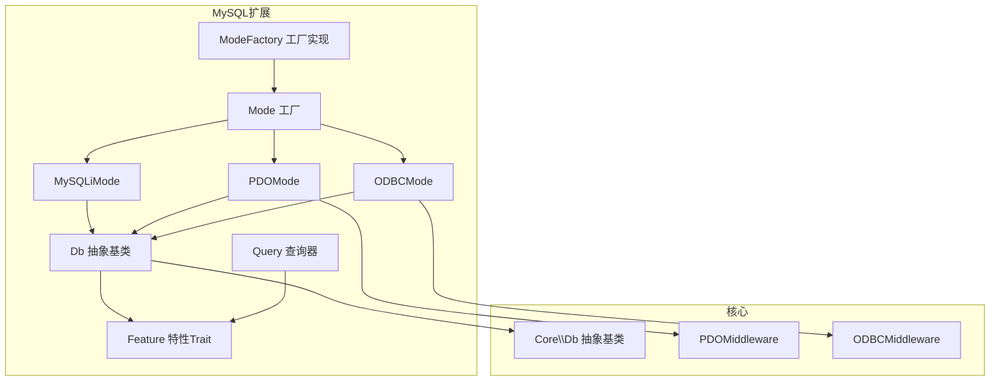
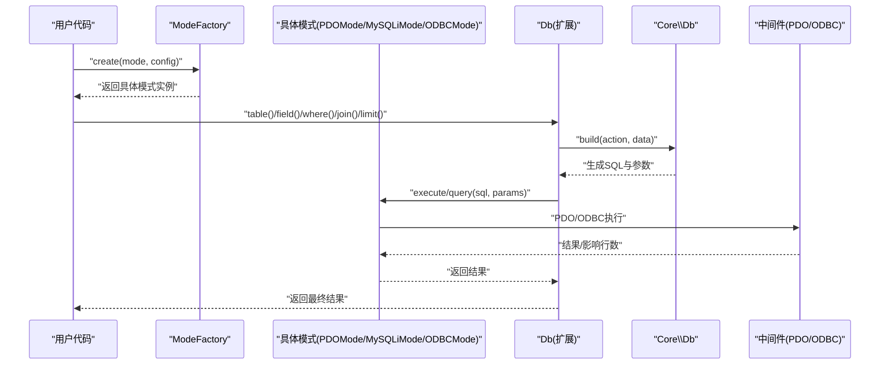
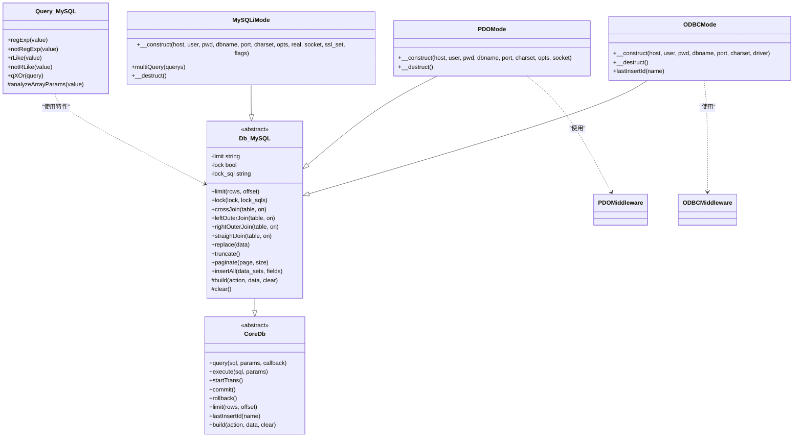
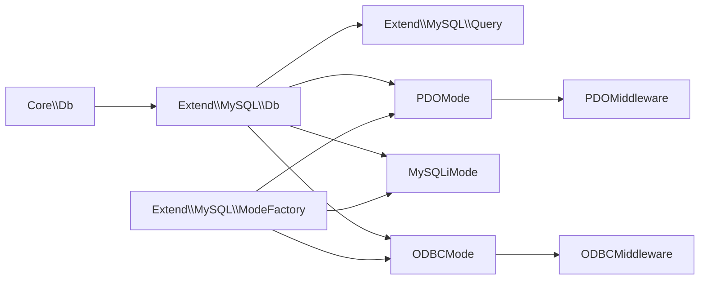

# MySQL驱动

<cite>
**本文引用的文件**
- [Db.php](file://src/Extend/MySQL/Db.php)
- [Feature.php](file://src/Extend/MySQL/Feature.php)
- [Query.php](file://src/Extend/MySQL/Query.php)
- [Mode.php](file://src/Extend/MySQL/Mode.php)
- [ModeFactory.php](file://src/Extend/MySQL/ModeFactory.php)
- [MySQLiMode.php](file://src/Extend/MySQL/Mode/MySQLiMode.php)
- [PDOMode.php](file://src/Extend/MySQL/Mode/PDOMode.php)
- [ODBCMode.php](file://src/Extend/MySQL/Mode/ODBCMode.php)
- [Db.php（核心）](file://src/Core/Db.php)
- [PDOMiddleware.php](file://src/Middleware/PDOMiddleware.php)
- [ODBCMiddleware.php](file://src/Middleware/ODBCMiddleware.php)
- [composer.json](file://composer.json)
- [db_connect.php](file://examples/db_connect.php)
- [TestDb.php](file://tests/Extend/MySQL/TestDb.php)
- [TestPDOMode.php](file://tests/Extend/MySQL/Mode/TestPDOMode.php)
- [TestMySQLiMode.php](file://tests/Extend/MySQL/Mode/TestMySQLiMode.php)
</cite>

## 目录
1. [简介](#简介)
2. [项目结构](#项目结构)
3. [核心组件](#核心组件)
4. [架构总览](#架构总览)
5. [详细组件分析](#详细组件分析)
6. [依赖关系分析](#依赖关系分析)
7. [性能与优化建议](#性能与优化建议)
8. [故障排查指南](#故障排查指南)
9. [结论](#结论)
10. [附录](#附录)

## 简介
本章节面向希望在FizeDatabase中使用MySQL数据库驱动的开发者，系统介绍MySQL驱动的配置与使用方法，涵盖连接配置选项、MySQL特有语法支持（LIMIT、LOCK、CROSS JOIN、OUTER JOIN、STRAIGHT_JOIN）、正则匹配（REGEXP/RLIKE）、分页（SQL_CALC_FOUND_ROWS）以及批量插入等特性，并提供性能优化建议、最佳实践、常见问题解决方案，以及与其他数据库驱动的差异与迁移注意事项。

## 项目结构
MySQL驱动位于扩展目录下，采用“抽象基类 + 多模式实现”的架构设计：
- 抽象基类负责通用SQL拼装、条件构建、分页与批量插入等通用能力
- 具体模式实现分别封装不同底层扩展（PDO、MySQLi、ODBC）
- 中间件层提供PDO/ODBC的通用执行与事务控制能力
- 工厂类负责根据配置创建具体模式实例

图表来源
- [Db.php:11-246](file://src/Extend/MySQL/Db.php#L11-L246)
- [Query.php:12-91](file://src/Extend/MySQL/Query.php#L12-L91)
- [Mode.php:14-74](file://src/Extend/MySQL/Mode.php#L14-L74)
- [ModeFactory.php:21-82](file://src/Extend/MySQL/ModeFactory.php#L21-L82)
- [MySQLiMode.php:14-251](file://src/Extend/MySQL/Mode/MySQLiMode.php#L14-L251)
- [PDOMode.php:14-53](file://src/Extend/MySQL/Mode/PDOMode.php#L14-L53)
- [ODBCMode.php:15-61](file://src/Extend/MySQL/Mode/ODBCMode.php#L15-L61)
- [Db.php（核心）:13-800](file://src/Core/Db.php#L13-L800)
- [PDOMiddleware.php:12-129](file://src/Middleware/PDOMiddleware.php#L12-L129)
- [ODBCMiddleware.php:11-100](file://src/Middleware/ODBCMiddleware.php#L11-L100)

章节来源
- [Mode.php:14-74](file://src/Extend/MySQL/Mode.php#L14-L74)
- [ModeFactory.php:21-82](file://src/Extend/MySQL/ModeFactory.php#L21-L82)
- [Db.php（核心）:13-800](file://src/Core/Db.php#L13-L800)

## 核心组件
- 抽象基类 Db（MySQL扩展）
  - 负责LIMIT、LOCK、CROSS JOIN、OUTER JOIN、STRAIGHT_JOIN、REPLACE、TRUNCATE、分页（SQL_CALC_FOUND_ROWS）、批量插入等MySQL特有能力
  - 继承自核心Db，复用通用SQL拼装与条件构建
- 查询器 Query（MySQL扩展）
  - 支持REGEXP、NOT REGEXP、RLIKE、NOT RLIKE正则条件
  - 支持XOR组合条件
- 模式工厂 ModeFactory
  - 根据配置创建具体模式实例（PDO、MySQLi、ODBC）
  - 提供默认参数合并与异常处理
- 模式实现
  - MySQLiMode：基于mysqli扩展，支持real_connect、SSL、多语句查询
  - PDOMode：基于PDO，通过中间件完成查询、执行、事务
  - ODBCMode：基于ODBC，通过中间件完成查询、执行、事务

章节来源
- [Db.php:11-246](file://src/Extend/MySQL/Db.php#L11-L246)
- [Query.php:12-91](file://src/Extend/MySQL/Query.php#L12-L91)
- [ModeFactory.php:21-82](file://src/Extend/MySQL/ModeFactory.php#L21-L82)
- [MySQLiMode.php:14-251](file://src/Extend/MySQL/Mode/MySQLiMode.php#L14-L251)
- [PDOMode.php:14-53](file://src/Extend/MySQL/Mode/PDOMode.php#L14-L53)
- [ODBCMode.php:15-61](file://src/Extend/MySQL/Mode/ODBCMode.php#L15-L61)

## 架构总览
MySQL驱动的整体调用流程如下：

图表来源
- [ModeFactory.php:21-82](file://src/Extend/MySQL/ModeFactory.php#L21-L82)
- [Db.php:129-152](file://src/Extend/MySQL/Db.php#L129-L152)
- [Db.php（核心）:583-637](file://src/Core/Db.php#L583-L637)
- [PDOMiddleware.php:51-93](file://src/Middleware/PDOMiddleware.php#L51-L93)
- [ODBCMiddleware.php:48-74](file://src/Middleware/ODBCMiddleware.php#L48-L74)

## 详细组件分析

### 连接配置与工厂
- 支持的连接模式
  - mysqli：适合传统场景，注意其未来趋势与兼容性
  - pdo：强烈推荐，跨平台、生态完善
  - odbc：通用适配，ODBC返回类型统一为字符串（需注意）
- 工厂默认参数
  - port、charset、prefix、opts、real、socket、ssl_set、flags、driver
- 工厂创建流程
  - 合并默认配置
  - 根据mode选择构造函数
  - 设置表前缀并返回实例

章节来源
- [ModeFactory.php:21-82](file://src/Extend/MySQL/ModeFactory.php#L21-L82)
- [Mode.php:33-72](file://src/Extend/MySQL/Mode.php#L33-L72)

### MySQL特有语法与功能

#### LIMIT
- 作用：限制查询返回的记录数与偏移量
- 实现：在build阶段追加LIMIT子句
- 使用：链式调用limit(rows, offset?)

章节来源
- [Db.php:36-44](file://src/Extend/MySQL/Db.php#L36-L44)
- [Db.php:144-152](file://src/Extend/MySQL/Db.php#L144-L152)

#### LOCK（表级写锁）
- 作用：显式声明当前查询涉及的表写锁，便于并发控制
- 实现：内部维护lock与lock_sql状态，在build阶段追加LOCK语句
- 注意：仅在扩展Db中提供，核心Db未暴露此能力

章节来源
- [Db.php:53-65](file://src/Extend/MySQL/Db.php#L53-L65)
- [Db.php:114-120](file://src/Extend/MySQL/Db.php#L114-L120)
- [Db.php:129-152](file://src/Extend/MySQL/Db.php#L129-L152)

#### JOIN变体
- CROSS JOIN：笛卡尔积连接
- LEFT/RIGHT OUTER JOIN：外连接
- STRAIGHT_JOIN：非标准SQL，强制连接顺序（不建议使用）
- 实现：统一通过join(type)实现，扩展Db提供便捷方法

章节来源
- [Db.php:73-98](file://src/Extend/MySQL/Db.php#L73-L98)
- [Db.php（核心）:408-430](file://src/Core/Db.php#L408-L430)

#### 正则表达式条件
- Query支持REGEXP、NOT REGEXP、RLIKE、NOT RLIKE
- 数组条件解析支持上述关键字

章节来源
- [Query.php:21-54](file://src/Extend/MySQL/Query.php#L21-L54)
- [Query.php:60-79](file://src/Extend/MySQL/Query.php#L60-L79)

#### 分页（SQL_CALC_FOUND_ROWS）
- 通过paginate(page, size)实现
- 自动注入SQL_CALC_FOUND_ROWS并使用FOUND_ROWS()获取总数

章节来源
- [Db.php:187-203](file://src/Extend/MySQL/Db.php#L187-L203)

#### REPLACE与TRUNCATE
- REPLACE：以“替换”方式插入，返回自增ID
- TRUNCATE：清空表（不允许带WHERE）

章节来源
- [Db.php:159-177](file://src/Extend/MySQL/Db.php#L159-L177)

#### 批量插入
- insertAll(data_sets, fields?)：一次SQL写入多条记录
- 通过解析字段与占位符生成VALUES列表

章节来源
- [Db.php:237-244](file://src/Extend/MySQL/Db.php#L237-L244)
- [Db.php:212-229](file://src/Extend/MySQL/Db.php#L212-L229)

### 模式实现细节

#### PDO模式（推荐）
- DSN组成：host、port、unix_socket、charset
- 通过中间件完成prepare/execute、事务、lastInsertId
- 适合跨平台与现代PHP环境

章节来源
- [PDOMode.php:29-42](file://src/Extend/MySQL/Mode/PDOMode.php#L29-L42)
- [PDOMiddleware.php:26-128](file://src/Middleware/PDOMiddleware.php#L26-L128)

#### MySQLi模式
- 支持real_connect、SSL配置、多语句查询
- bind_param类型推断与引用绑定
- lastInsertId读取

章节来源
- [MySQLiMode.php:42-65](file://src/Extend/MySQL/Mode/MySQLiMode.php#L42-L65)
- [MySQLiMode.php:115-164](file://src/Extend/MySQL/Mode/MySQLiMode.php#L115-L164)
- [MySQLiMode.php:172-215](file://src/Extend/MySQL/Mode/MySQLiMode.php#L172-L215)
- [MySQLiMode.php:246-249](file://src/Extend/MySQL/Mode/MySQLiMode.php#L246-L249)

#### ODBC模式
- DSN可选driver、port、charset
- 返回类型统一为字符串（需注意）
- 通过中间件完成事务与lastInsertId

章节来源
- [ODBCMode.php:29-39](file://src/Extend/MySQL/Mode/ODBCMode.php#L29-L39)
- [ODBCMiddleware.php:28-99](file://src/Middleware/ODBCMiddleware.php#L28-L99)
- [ODBCMode.php:55-59](file://src/Extend/MySQL/Mode/ODBCMode.php#L55-L59)

### 类关系图（代码级）

图表来源
- [Db.php（核心）:13-800](file://src/Core/Db.php#L13-L800)
- [Db.php:11-246](file://src/Extend/MySQL/Db.php#L11-L246)
- [Query.php:12-91](file://src/Extend/MySQL/Query.php#L12-L91)
- [PDOMode.php:14-53](file://src/Extend/MySQL/Mode/PDOMode.php#L14-L53)
- [MySQLiMode.php:14-251](file://src/Extend/MySQL/Mode/MySQLiMode.php#L14-L251)
- [ODBCMode.php:15-61](file://src/Extend/MySQL/Mode/ODBCMode.php#L15-L61)
- [PDOMiddleware.php:12-129](file://src/Middleware/PDOMiddleware.php#L12-L129)
- [ODBCMiddleware.php:11-100](file://src/Middleware/ODBCMiddleware.php#L11-L100)

## 依赖关系分析
- 扩展Db依赖核心Db的SQL拼装与条件构建
- 查询器Query依赖扩展Db的特性Trait，实现MySQL特有条件
- 模式实现均继承扩展Db，分别注入PDO/ODBC中间件或MySQLi驱动
- 工厂类集中管理配置与实例创建，避免分散配置

图表来源
- [Db.php（核心）:13-800](file://src/Core/Db.php#L13-L800)
- [Db.php:11-246](file://src/Extend/MySQL/Db.php#L11-L246)
- [Query.php:12-91](file://src/Extend/MySQL/Query.php#L12-L91)
- [ModeFactory.php:21-82](file://src/Extend/MySQL/ModeFactory.php#L21-L82)
- [PDOMiddleware.php:12-129](file://src/Middleware/PDOMiddleware.php#L12-L129)
- [ODBCMiddleware.php:11-100](file://src/Middleware/ODBCMiddleware.php#L11-L100)

章节来源
- [ModeFactory.php:21-82](file://src/Extend/MySQL/ModeFactory.php#L21-L82)

## 性能与优化建议
- 优先使用PDO模式（PDOMode），具备更好的跨平台性与生态支持
- 合理使用LIMIT与ORDER，避免全表扫描；必要时建立索引
- 使用分页时结合SQL_CALC_FOUND_ROWS减少二次COUNT查询
- 批量插入使用insertAll，减少网络往返
- 事务中尽量缩短持有锁的时间，避免长事务
- 正则匹配（REGEXP/RLIKE）成本较高，尽量用索引或预处理替代
- ODBC模式返回类型统一为字符串，避免隐式类型转换带来的开销

## 故障排查指南
- 连接失败
  - 检查主机、端口、用户名、密码、数据库名与字符集
  - PDO模式确认扩展已安装（建议安装pdo_mysql）
  - ODBC模式确认驱动名称与DSN正确
- 事务异常
  - 确认数据库引擎支持事务（如InnoDB）
  - 检查startTrans/commit/rollback成对使用
- 正则条件无效
  - 确认Query使用REGEXP/RLIKE关键字或数组条件
- ODBC类型问题
  - ODBC返回均为字符串，需自行转换类型
- 多语句查询（MySQLi）
  - multiQuery返回多结果集，注意逐个释放资源

章节来源
- [PDOMiddleware.php:51-93](file://src/Middleware/PDOMiddleware.php#L51-L93)
- [ODBCMiddleware.php:48-74](file://src/Middleware/ODBCMiddleware.php#L48-L74)
- [MySQLiMode.php:85-106](file://src/Extend/MySQL/Mode/MySQLiMode.php#L85-L106)
- [ODBCMode.php:55-59](file://src/Extend/MySQL/Mode/ODBCMode.php#L55-L59)

## 结论
FizeDatabase的MySQL驱动提供了完善的连接模式、丰富的SQL特性与良好的扩展性。推荐优先使用PDO模式，配合扩展Db提供的MySQL特有语法与工具方法，能够高效、安全地完成大多数数据库操作。在生产环境中，建议结合索引、事务与批量写入策略，进一步提升性能与稳定性。

## 附录

### 配置示例与参数说明
- 基本连接
  - host：数据库主机
  - user：用户名
  - password：密码
  - dbname：数据库名
- 可选参数
  - port：端口（PDO/ODBC可选；MySQLi默认3306）
  - charset：字符集（默认utf8）
  - prefix：表前缀
  - opts：PDO/MySQLi附加选项
  - real：MySQLi real_connect开关
  - socket：Unix Socket路径（PDO/MySQLi可选）
  - ssl_set：SSL配置（MySQLi）
  - flags：MySQLi客户端标志
  - driver：ODBC驱动名称（可选）

章节来源
- [ModeFactory.php:24-34](file://src/Extend/MySQL/ModeFactory.php#L24-L34)
- [Mode.php:33-72](file://src/Extend/MySQL/Mode.php#L33-L72)
- [MySQLiMode.php:42-65](file://src/Extend/MySQL/Mode/MySQLiMode.php#L42-L65)
- [PDOMode.php:29-42](file://src/Extend/MySQL/Mode/PDOMode.php#L29-L42)
- [ODBCMode.php:29-39](file://src/Extend/MySQL/Mode/ODBCMode.php#L29-L39)

### 使用示例（路径）
- 示例入口：[db_connect.php:1-39](file://examples/db_connect.php#L1-L39)
- 测试用例（PDO模式）：[TestPDOMode.php:11-129](file://tests/Extend/MySQL/Mode/TestPDOMode.php#L11-L129)
- 测试用例（MySQLi模式）：[TestMySQLiMode.php:11-139](file://tests/Extend/MySQL/Mode/TestMySQLiMode.php#L11-L139)
- MySQL扩展测试（分页等）：[TestDb.php:11-70](file://tests/Extend/MySQL/TestDb.php#L11-L70)

### 与其他数据库驱动的差异与迁移
- PDO vs MySQLi
  - PDO更通用，跨数据库友好；MySQLi偏向MySQL特性
  - 迁移时注意数据类型与错误处理差异
- ODBC
  - 通用适配，但返回类型统一为字符串，需显式转换
  - 适合在Windows或受限环境下使用
- 迁移建议
  - 统一使用扩展Db提供的接口（limit、join、paginate等）
  - 将正则条件替换为索引或预处理方案
  - 在事务中保持最小化持有锁时间

章节来源
- [Db.php（核心）:13-800](file://src/Core/Db.php#L13-L800)
- [Db.php:11-246](file://src/Extend/MySQL/Db.php#L11-L246)
- [PDOMiddleware.php:12-129](file://src/Middleware/PDOMiddleware.php#L12-L129)
- [ODBCMiddleware.php:11-100](file://src/Middleware/ODBCMiddleware.php#L11-L100)