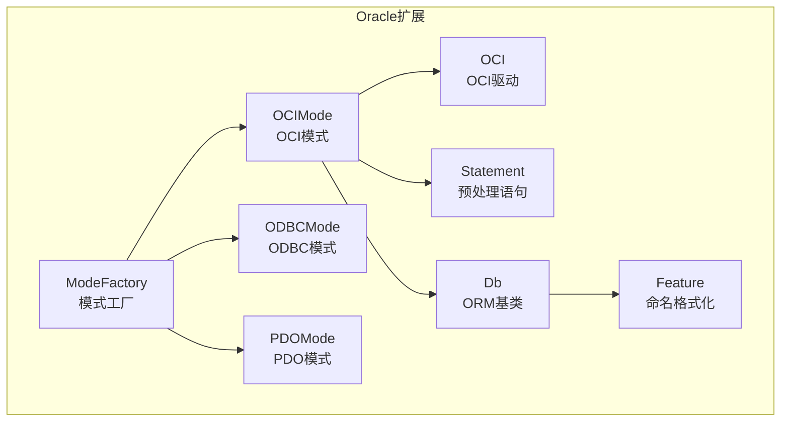
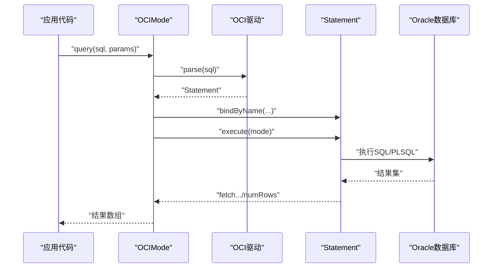
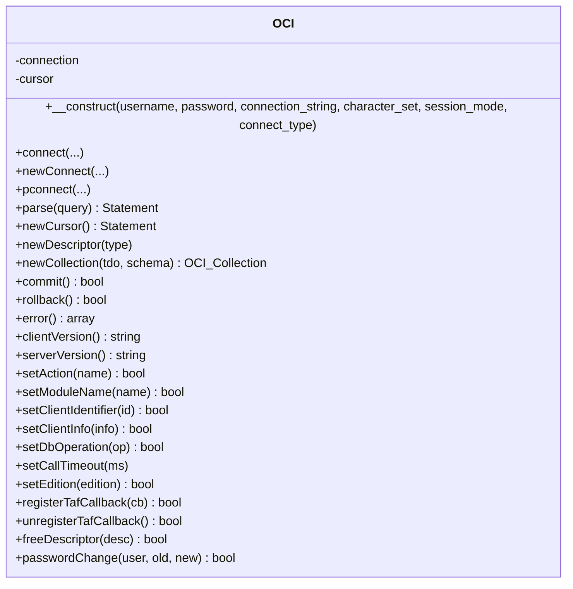
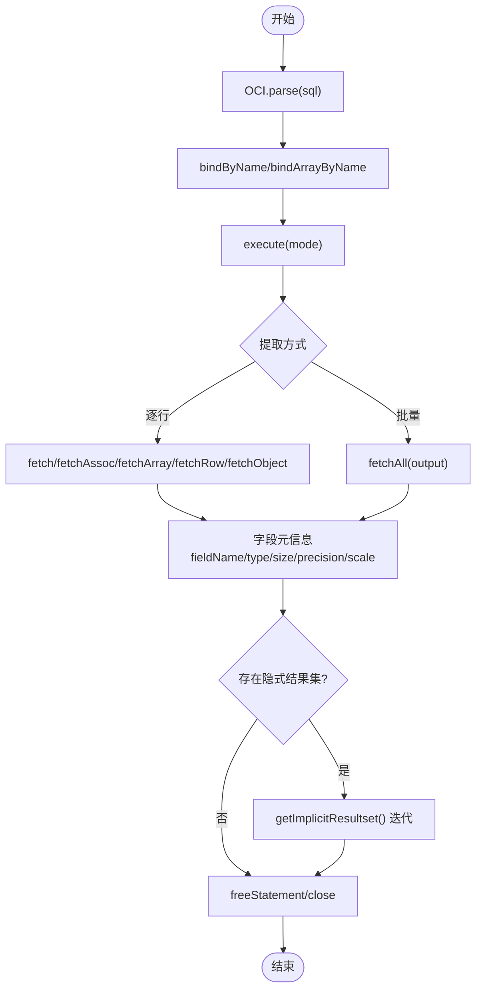
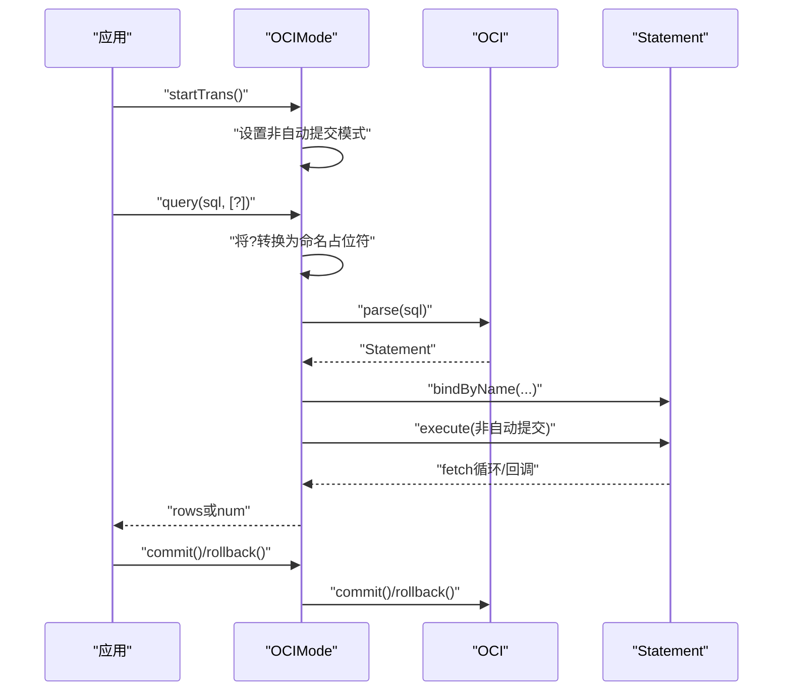
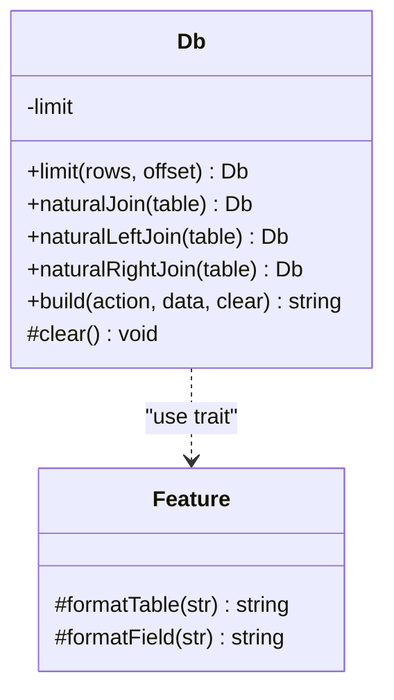
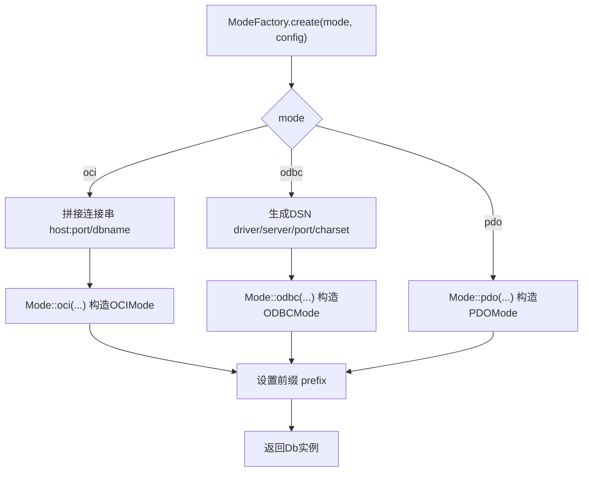
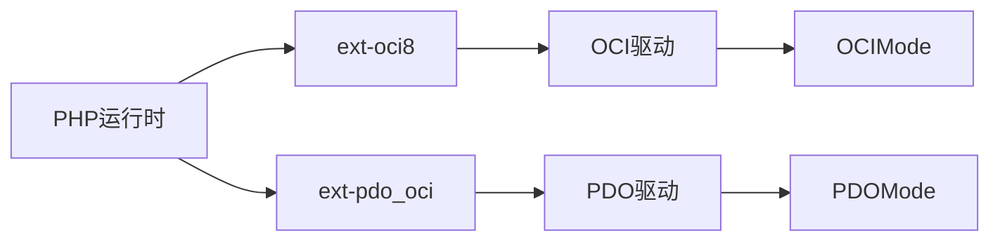

# Oracle驱动

<cite>
**本文引用的文件**
- [OCI.php](file://src/Extend/Oracle/Driver/OCI.php)
- [Statement.php](file://src/Extend/Oracle/Driver/Statement.php)
- [OCIMode.php](file://src/Extend/Oracle/Mode/OCIMode.php)
- [Db.php](file://src/Extend/Oracle/Db.php)
- [Feature.php](file://src/Extend/Oracle/Feature.php)
- [ModeFactory.php](file://src/Extend/Oracle/ModeFactory.php)
- [composer.json](file://composer.json)
- [TestOCI.php](file://tests/Extend/Oracle/Driver/TestOCI.php)
- [TestOCIMode.php](file://tests/Extend/Oracle/Mode/TestOCIMode.php)
</cite>

## 目录
1. [简介](#简介)
2. [项目结构](#项目结构)
3. [核心组件](#核心组件)
4. [架构总览](#架构总览)
5. [详细组件分析](#详细组件分析)
6. [依赖关系分析](#依赖关系分析)
7. [性能考虑](#性能考虑)
8. [故障排查指南](#故障排查指南)
9. [结论](#结论)
10. [附录](#附录)

## 简介
本章节面向希望在FizeDatabase中使用Oracle数据库的开发者，系统讲解Oracle驱动的配置与使用，包括：
- SID/连接串格式与不同连接类型的使用
- PL/SQL块执行与存储过程调用
- Oracle特有数据类型、序列、触发器、分区表的适配与注意事项
- 配置示例、性能调优与内存管理策略
- OCI扩展依赖及Windows/Linux环境差异提示

## 项目结构
Oracle驱动位于扩展目录下，采用“模式+驱动”的分层设计：
- 模式层：OCIMode、ODBCMode、PDOMode（PDO模式由其他文件提供）
- 驱动层：OCI（基于ext-oci8）、Statement（预处理封装）
- ORM适配层：Db（ORM基类）、Feature（命名格式化）

图示来源
- [ModeFactory.php:21-74](file://src/Extend/Oracle/ModeFactory.php#L21-L74)
- [OCIMode.php:13-38](file://src/Extend/Oracle/Mode/OCIMode.php#L13-L38)
- [Db.php:13-15](file://src/Extend/Oracle/Db.php#L13-L15)
- [Feature.php:8-46](file://src/Extend/Oracle/Feature.php#L8-L46)
- [OCI.php:14-51](file://src/Extend/Oracle/Driver/OCI.php#L14-L51)
- [Statement.php:8-32](file://src/Extend/Oracle/Driver/Statement.php#L8-L32)

章节来源
- [ModeFactory.php:21-74](file://src/Extend/Oracle/ModeFactory.php#L21-L74)
- [OCIMode.php:13-38](file://src/Extend/Oracle/Mode/OCIMode.php#L13-L38)
- [Db.php:13-15](file://src/Extend/Oracle/Db.php#L13-L15)
- [Feature.php:8-46](file://src/Extend/Oracle/Feature.php#L8-L46)
- [OCI.php:14-51](file://src/Extend/Oracle/Driver/OCI.php#L14-L51)
- [Statement.php:8-32](file://src/Extend/Oracle/Driver/Statement.php#L8-L32)

## 核心组件
- OCI驱动：封装ext-oci8的连接、事务、元数据、LOBS、集合、隐式结果集等能力
- Statement预处理：封装绑定、提取、字段元信息、隐式结果集等
- OCIMode模式：面向ORM的查询/执行入口，支持事务、lastInsertId（序列）
- Db与Feature：统一表/字段命名格式化（Oracle默认双引号包裹），支持LIMIT拼接
- ModeFactory：根据配置选择OCI/ODBC/PDO模式并构造Db实例

章节来源
- [OCI.php:14-395](file://src/Extend/Oracle/Driver/OCI.php#L14-L395)
- [Statement.php:8-317](file://src/Extend/Oracle/Driver/Statement.php#L8-L317)
- [OCIMode.php:13-154](file://src/Extend/Oracle/Mode/OCIMode.php#L13-L154)
- [Db.php:13-116](file://src/Extend/Oracle/Db.php#L13-L116)
- [Feature.php:8-46](file://src/Extend/Oracle/Feature.php#L8-L46)
- [ModeFactory.php:21-74](file://src/Extend/Oracle/ModeFactory.php#L21-L74)

## 架构总览
Oracle驱动的典型调用链如下：

图示来源
- [OCIMode.php:55-84](file://src/Extend/Oracle/Mode/OCIMode.php#L55-L84)
- [OCI.php:246-250](file://src/Extend/Oracle/Driver/OCI.php#L246-L250)
- [Statement.php:107-111](file://src/Extend/Oracle/Driver/Statement.php#L107-L111)

## 详细组件分析

### OCI驱动（连接与会话）
- 支持三种连接类型：默认、新连接、持久连接
- 提供事务提交/回滚、错误获取、客户端/服务器版本查询
- 提供会话级属性设置：动作、模块、客户端标识、客户端信息、数据库操作、调用超时、版本（Edition）
- TAF回调注册/注销（高可用特性）
- LOB/集合/游标/隐式结果集等高级能力

图示来源
- [OCI.php:14-395](file://src/Extend/Oracle/Driver/OCI.php#L14-L395)

章节来源
- [OCI.php:51-64](file://src/Extend/Oracle/Driver/OCI.php#L51-L64)
- [OCI.php:120-131](file://src/Extend/Oracle/Driver/OCI.php#L120-L131)
- [OCI.php:208-219](file://src/Extend/Oracle/Driver/OCI.php#L208-L219)
- [OCI.php:272-283](file://src/Extend/Oracle/Driver/OCI.php#L272-L283)
- [OCI.php:319-384](file://src/Extend/Oracle/Driver/OCI.php#L319-L384)
- [OCI.php:355-394](file://src/Extend/Oracle/Driver/OCI.php#L355-L394)

### 预处理语句（Statement）
- 绑定：按名称绑定、数组绑定、定义列
- 执行：支持自动/非自动提交模式
- 结果提取：关联/数字/对象/行提取，批量提取
- 元数据：字段名、类型、精度、刻度、大小、是否为空
- 资源管理：取消、释放语句、隐式结果集迭代
- 性能：预提取行数设置

图示来源
- [Statement.php:107-111](file://src/Extend/Oracle/Driver/Statement.php#L107-L111)
- [Statement.php:121-124](file://src/Extend/Oracle/Driver/Statement.php#L121-L124)
- [Statement.php:131-161](file://src/Extend/Oracle/Driver/Statement.php#L131-L161)
- [Statement.php:262-269](file://src/Extend/Oracle/Driver/Statement.php#L262-L269)

章节来源
- [Statement.php:73-76](file://src/Extend/Oracle/Driver/Statement.php#L73-L76)
- [Statement.php:107-111](file://src/Extend/Oracle/Driver/Statement.php#L107-L111)
- [Statement.php:131-161](file://src/Extend/Oracle/Driver/Statement.php#L131-L161)
- [Statement.php:262-269](file://src/Extend/Oracle/Driver/Statement.php#L262-L269)
- [Statement.php:304-307](file://src/Extend/Oracle/Driver/Statement.php#L304-L307)

### OCIMode模式（ORM入口）
- query：支持问号占位符（内部转换为命名绑定），回调遍历
- execute：返回受影响行数
- 事务：startTrans切换非自动提交；commit/rollback委托OCI
- lastInsertId：通过序列currval获取（Oracle必须指定序列名）

图示来源
- [OCIMode.php:55-84](file://src/Extend/Oracle/Mode/OCIMode.php#L55-L84)
- [OCIMode.php:92-113](file://src/Extend/Oracle/Mode/OCIMode.php#L92-L113)
- [OCIMode.php:118-139](file://src/Extend/Oracle/Mode/OCIMode.php#L118-L139)
- [OCIMode.php:146-153](file://src/Extend/Oracle/Mode/OCIMode.php#L146-L153)

章节来源
- [OCIMode.php:55-84](file://src/Extend/Oracle/Mode/OCIMode.php#L55-L84)
- [OCIMode.php:92-113](file://src/Extend/Oracle/Mode/OCIMode.php#L92-L113)
- [OCIMode.php:118-139](file://src/Extend/Oracle/Mode/OCIMode.php#L118-L139)
- [OCIMode.php:146-153](file://src/Extend/Oracle/Mode/OCIMode.php#L146-L153)

### Db与Feature（命名格式化与LIMIT）
- Db重写limit/build逻辑，支持Oracle风格LIMIT拼接
- Feature统一表/字段命名格式化（默认加双引号，子查询/别名保持原样）

图示来源
- [Db.php:28-115](file://src/Extend/Oracle/Db.php#L28-L115)
- [Feature.php:16-45](file://src/Extend/Oracle/Feature.php#L16-L45)

章节来源
- [Db.php:28-115](file://src/Extend/Oracle/Db.php#L28-L115)
- [Feature.php:16-45](file://src/Extend/Oracle/Feature.php#L16-L45)

### ModeFactory（配置与模式选择）
- 支持oci/odbc/pdo三种模式
- oci模式：host/port/dbname拼接为连接串（host:port/dbname）
- odbc模式：生成DSN（含驱动、服务器、端口、字符集）
- pdo模式：主机、用户、密码、库、端口、字符集、PDO选项
- 默认字符集、前缀、会话模式、连接类型、附加选项可配置

图示来源
- [ModeFactory.php:21-74](file://src/Extend/Oracle/ModeFactory.php#L21-L74)

章节来源
- [ModeFactory.php:21-74](file://src/Extend/Oracle/ModeFactory.php#L21-L74)

## 依赖关系分析
- 扩展依赖：需要启用ext-oci8（OCI模式），以及可选的ext-pdo_oci（PDO模式）
- Composer建议：在require-dev中建议安装ext-oci8、ext-pdo_oci等扩展
- OCI模式直接依赖ext-oci8提供的oci_*系列函数；Statement进一步封装这些函数

图示来源
- [composer.json:20-37](file://composer.json#L20-L37)
- [OCI.php:12-13](file://src/Extend/Oracle/Driver/OCI.php#L12-L13)

章节来源
- [composer.json:20-37](file://composer.json#L20-L37)
- [OCI.php:12-13](file://src/Extend/Oracle/Driver/OCI.php#L12-L13)

## 性能考虑
- 预提取（Prefetch）：通过Statement::setPrefetch提升批量读取性能
- 隐式结果集：利用getImplicitResultset减少多次往返
- 事务批处理：startTrans后多条DML合并提交，降低网络交互
- 绑定参数：优先使用命名绑定，避免字符串拼接
- 字符集与编码：确保连接串与字符集一致，避免额外转换开销
- LOB操作：谨慎使用大对象，注意内存占用与IO路径

章节来源
- [Statement.php:304-307](file://src/Extend/Oracle/Driver/Statement.php#L304-L307)
- [Statement.php:262-269](file://src/Extend/Oracle/Driver/Statement.php#L262-L269)
- [OCIMode.php:118-139](file://src/Extend/Oracle/Mode/OCIMode.php#L118-L139)

## 故障排查指南
- 连接失败：检查用户名、密码、连接串格式；捕获并打印错误信息
- 事务问题：确认非自动提交模式下显式commit/rollback
- 字段类型异常：使用字段元数据接口（类型、精度、刻度、大小）核对映射
- LOB/集合：确保正确分配与释放描述符，避免资源泄漏
- 隐式结果集：逐个消费，防止后续语句无法获取结果
- TAF回调：在高可用场景下注册回调，关注事件类型与返回值

章节来源
- [OCI.php:137-143](file://src/Extend/Oracle/Driver/OCI.php#L137-L143)
- [OCI.php:291-294](file://src/Extend/Oracle/Driver/OCI.php#L291-L294)
- [OCI.php:391-394](file://src/Extend/Oracle/Driver/OCI.php#L391-L394)
- [Statement.php:262-269](file://src/Extend/Oracle/Driver/Statement.php#L262-L269)
- [TestOCI.php:138-144](file://tests/Extend/Oracle/Driver/TestOCI.php#L138-L144)

## 结论
FizeDatabase的Oracle驱动以OCI为核心，结合Statement实现对Oracle特性的完整覆盖。通过ModeFactory灵活选择连接模式，Db/Feature提供ORM层面的命名与LIMIT支持。配合事务、隐式结果集、预提取等机制，可在生产环境中实现高性能与稳定的Oracle访问。

## 附录

### Oracle连接串与SID配置
- OCI模式：连接串由host、port、dbname拼接为“host:port/dbname”
- ODBC模式：通过DSN组合驱动、服务器、端口、字符集等参数
- PDO模式：主机、用户、密码、库、端口、字符集、PDO选项

章节来源
- [ModeFactory.php:36-48](file://src/Extend/Oracle/ModeFactory.php#L36-L48)
- [ODBCMode.php:28-40](file://src/Extend/Oracle/Mode/ODBCMode.php#L28-L40)

### PL/SQL块执行与存储过程调用
- 使用OCI::parse解析PL/SQL块或BEGIN/END语句
- 通过bindByName绑定IN/OUT参数，必要时使用OCI_B_CURSOR处理REF CURSOR
- 使用getImplicitResultset消费多结果集

章节来源
- [TestOCI.php:357-384](file://tests/Extend/Oracle/Driver/TestOCI.php#L357-L384)
- [TestOCI.php:426-443](file://tests/Extend/Oracle/Driver/TestOCI.php#L426-L443)
- [Statement.php:262-269](file://src/Extend/Oracle/Driver/Statement.php#L262-L269)

### Oracle特有数据类型、序列、触发器与分区表
- 数据类型：通过字段元数据接口（类型、精度、刻度、大小）识别与映射
- 序列：lastInsertId通过序列currval获取（需指定序列名）
- 触发器：ORM侧无需特殊处理，按常规DML访问
- 分区表：ORM侧无特殊支持，按常规查询即可

章节来源
- [Statement.php:237-240](file://src/Extend/Oracle/Driver/Statement.php#L237-L240)
- [OCIMode.php:146-153](file://src/Extend/Oracle/Mode/OCIMode.php#L146-L153)

### 配置示例与最佳实践
- OCI模式：提供用户名、密码、host、port、dbname、字符集、会话模式、连接类型
- ODBC模式：提供用户、密码、SID（host/dbname）、端口、字符集、驱动名
- PDO模式：提供主机、用户、密码、库、端口、字符集、PDO选项
- 最佳实践：开启非自动提交批处理事务、合理设置预提取、使用命名绑定、及时释放资源

章节来源
- [ModeFactory.php:24-33](file://src/Extend/Oracle/ModeFactory.php#L24-L33)
- [OCIMode.php:55-84](file://src/Extend/Oracle/Mode/OCIMode.php#L55-L84)
- [OCIMode.php:118-139](file://src/Extend/Oracle/Mode/OCIMode.php#L118-L139)
- [Statement.php:304-307](file://src/Extend/Oracle/Driver/Statement.php#L304-L307)

### OCI扩展依赖与平台差异
- 必需扩展：ext-oci8（OCI模式）
- 可选扩展：ext-pdo_oci（PDO模式）
- 平台差异：OCI函数行为在不同PHP/Oracle版本间略有差异，建议在目标平台充分测试；Windows/Linux下DSN与驱动名配置不同

章节来源
- [composer.json:20-37](file://composer.json#L20-L37)
- [ODBCMode.php:30-33](file://src/Extend/Oracle/Mode/ODBCMode.php#L30-L33)