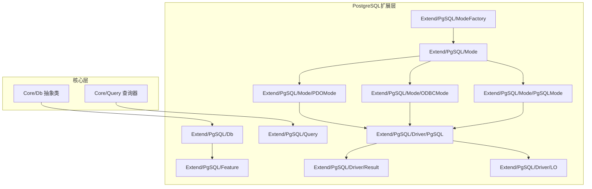
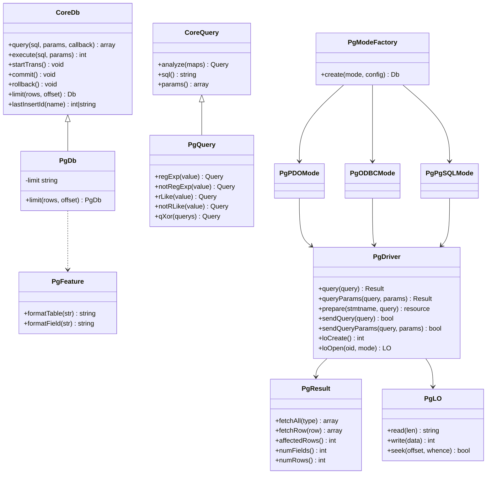
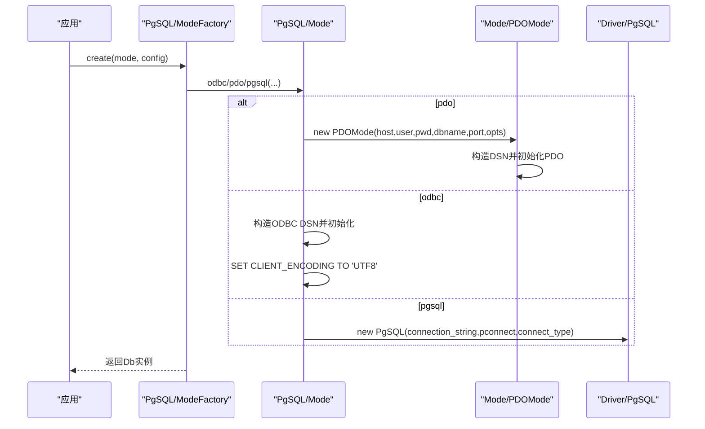
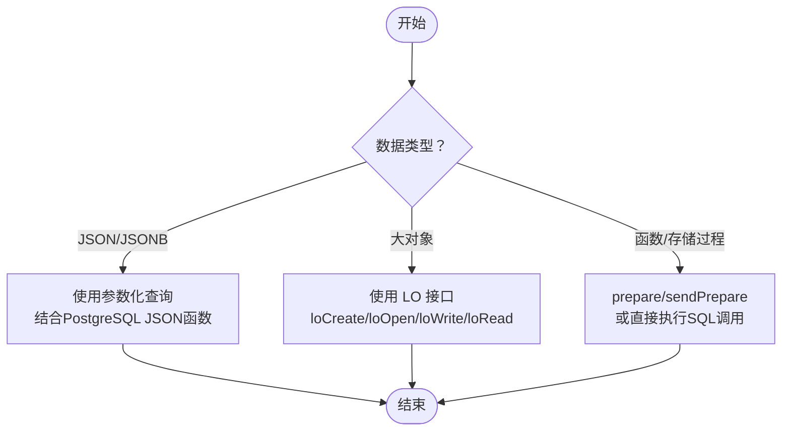
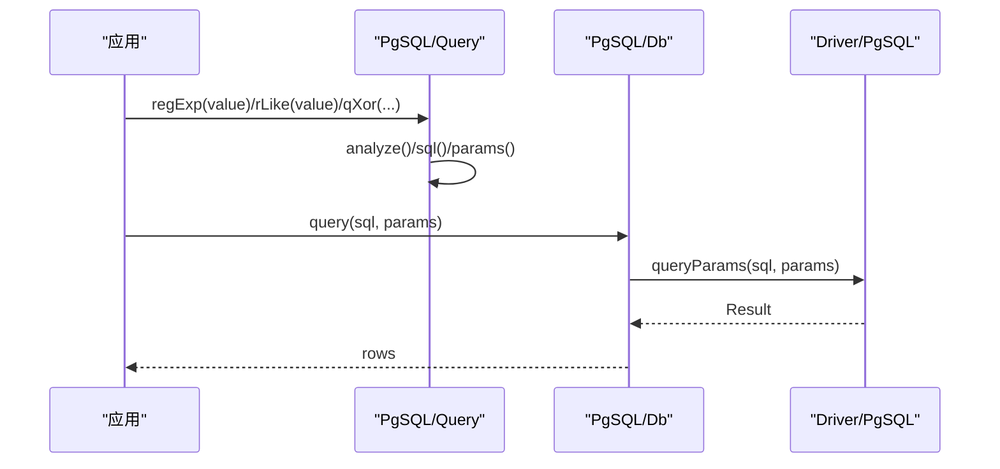
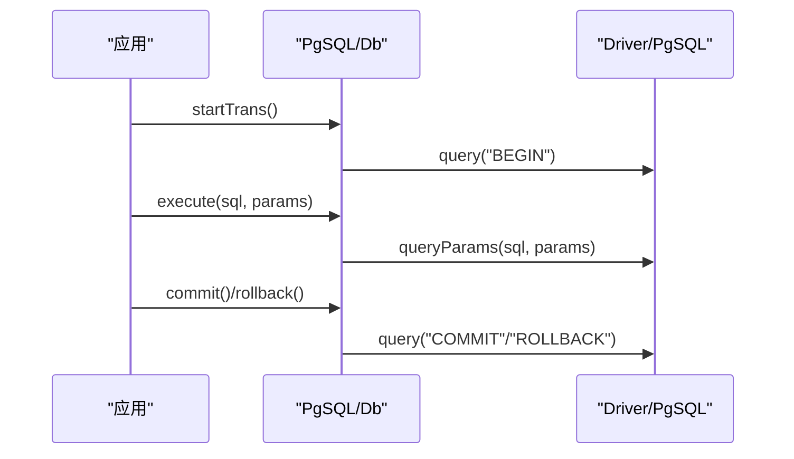
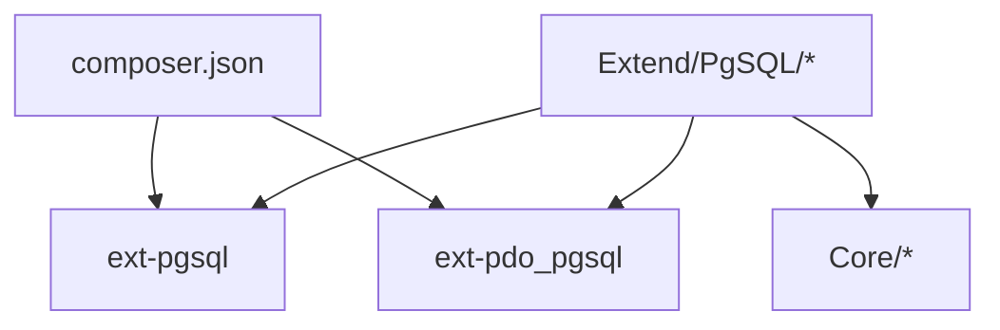

# PostgreSQL驱动

<cite>
**本文引用的文件**
- [src/Extend/PgSQL/Db.php](file://src/Extend/PgSQL/Db.php)
- [src/Extend/PgSQL/Feature.php](file://src/Extend/PgSQL/Feature.php)
- [src/Extend/PgSQL/Query.php](file://src/Extend/PgSQL/Query.php)
- [src/Extend/PgSQL/Mode.php](file://src/Extend/PgSQL/Mode.php)
- [src/Extend/PgSQL/ModeFactory.php](file://src/Extend/PgSQL/ModeFactory.php)
- [src/Extend/PgSQL/Mode/PgSQLMode.php](file://src/Extend/PgSQL/Mode/PgSQLMode.php)
- [src/Extend/PgSQL/Mode/PDOMode.php](file://src/Extend/PgSQL/Mode/PDOMode.php)
- [src/Extend/PgSQL/Mode/ODBCMode.php](file://src/Extend/PgSQL/Mode/ODBCMode.php)
- [src/Extend/PgSQL/Driver/PgSQL.php](file://src/Extend/PgSQL/Driver/PgSQL.php)
- [src/Extend/PgSQL/Driver/Result.php](file://src/Extend/PgSQL/Driver/Result.php)
- [src/Extend/PgSQL/Driver/LO.php](file://src/Extend/PgSQL/Driver/LO.php)
- [src/Core/Db.php](file://src/Core/Db.php)
- [src/Core/Query.php](file://src/Core/Query.php)
- [composer.json](file://composer.json)
</cite>

## 目录
1. [简介](#简介)
2. [项目结构](#项目结构)
3. [核心组件](#核心组件)
4. [架构总览](#架构总览)
5. [详细组件分析](#详细组件分析)
6. [依赖关系分析](#依赖关系分析)
7. [性能考虑](#性能考虑)
8. [故障排除指南](#故障排除指南)
9. [结论](#结论)
10. [附录](#附录)

## 简介
本章节面向希望在FizeDatabase框架中使用PostgreSQL数据库的开发者，系统讲解PostgreSQL驱动的实现与使用方法。内容覆盖连接配置、PostgreSQL特有数据类型支持、函数与存储过程调用、高级特性（如JSON、全文搜索、窗口函数）的使用思路、配置示例、性能优化策略以及常见问题排查。文档同时对比PostgreSQL与其他数据库的兼容性与差异，帮助读者在多数据库环境下做出合理选择。

## 项目结构
FizeDatabase采用分层+扩展模块的设计，PostgreSQL驱动位于扩展目录下，核心抽象位于Core层，PostgreSQL专属实现位于Extend/PgSQL目录。关键文件职责如下：
- Extend/PgSQL/Db.php：PostgreSQL数据库模型基类，提供LIMIT支持与特征混入。
- Extend/PgSQL/Feature.php：命名规范特征（表名、字段名加双引号）。
- Extend/PgSQL/Query.php：PostgreSQL查询器，支持REGEXP/RLIKE/XOR等特性。
- Extend/PgSQL/Mode.php：模式工厂入口，提供odbc/pdo/pgsql三种连接模式。
- Extend/PgSQL/ModeFactory.php：根据配置创建具体模式实例。
- Extend/PgSQL/Mode/PgSQLMode.php：基于原生pg扩展的模式实现。
- Extend/PgSQL/Mode/PDOMode.php：基于PDO的模式实现。
- Extend/PgSQL/Mode/ODBCMode.php：基于ODBC的模式实现。
- Extend/PgSQL/Driver/PgSQL.php：对PHP pg扩展的封装，提供查询、准备语句、大对象等能力。
- Extend/PgSQL/Driver/Result.php：结果集封装，提供多种取数与元数据访问方法。
- Extend/PgSQL/Driver/LO.php：大对象（Large Object）封装。
- Core/Db.php：数据库抽象基类，定义统一的查询/执行/事务/分页等接口。
- Core/Query.php：通用查询器，支持数组条件解析与多逻辑组合。
- composer.json：声明PHP版本与所需扩展（包括ext-pgsql、ext-pdo_pgsql）。

**图表来源**
- [src/Core/Db.php:13-102](file://src/Core/Db.php#L13-L102)
- [src/Core/Query.php:13-44](file://src/Core/Query.php#L13-L44)
- [src/Extend/PgSQL/Db.php:12-36](file://src/Extend/PgSQL/Db.php#L12-L36)
- [src/Extend/PgSQL/Feature.php:8-30](file://src/Extend/PgSQL/Feature.php#L8-L30)
- [src/Extend/PgSQL/Query.php:12-110](file://src/Extend/PgSQL/Query.php#L12-L110)
- [src/Extend/PgSQL/Mode.php:14-58](file://src/Extend/PgSQL/Mode.php#L14-L58)
- [src/Extend/PgSQL/ModeFactory.php:11-56](file://src/Extend/PgSQL/ModeFactory.php#L11-L56)
- [src/Extend/PgSQL/Mode/PDOMode.php:13-43](file://src/Extend/PgSQL/Mode/PDOMode.php#L13-L43)
- [src/Extend/PgSQL/Mode/ODBCMode.php:13-62](file://src/Extend/PgSQL/Mode/ODBCMode.php#L13-L62)
- [src/Extend/PgSQL/Mode/PgSQLMode.php:14-139](file://src/Extend/PgSQL/Mode/PgSQLMode.php#L14-L139)
- [src/Extend/PgSQL/Driver/PgSQL.php:8-662](file://src/Extend/PgSQL/Driver/PgSQL.php#L8-L662)
- [src/Extend/PgSQL/Driver/Result.php:8-273](file://src/Extend/PgSQL/Driver/Result.php#L8-L273)
- [src/Extend/PgSQL/Driver/LO.php:8-92](file://src/Extend/PgSQL/Driver/LO.php#L8-L92)

**章节来源**
- [src/Extend/PgSQL/Db.php:12-36](file://src/Extend/PgSQL/Db.php#L12-L36)
- [src/Extend/PgSQL/Feature.php:8-30](file://src/Extend/PgSQL/Feature.php#L8-L30)
- [src/Extend/PgSQL/Query.php:12-110](file://src/Extend/PgSQL/Query.php#L12-L110)
- [src/Extend/PgSQL/Mode.php:14-58](file://src/Extend/PgSQL/Mode.php#L14-L58)
- [src/Extend/PgSQL/ModeFactory.php:21-55](file://src/Extend/PgSQL/ModeFactory.php#L21-L55)
- [src/Extend/PgSQL/Mode/PDOMode.php:13-43](file://src/Extend/PgSQL/Mode/PDOMode.php#L13-L43)
- [src/Extend/PgSQL/Mode/ODBCMode.php:13-62](file://src/Extend/PgSQL/Mode/ODBCMode.php#L13-L62)
- [src/Extend/PgSQL/Mode/PgSQLMode.php:14-139](file://src/Extend/PgSQL/Mode/PgSQLMode.php#L14-L139)
- [src/Extend/PgSQL/Driver/PgSQL.php:8-662](file://src/Extend/PgSQL/Driver/PgSQL.php#L8-L662)
- [src/Extend/PgSQL/Driver/Result.php:8-273](file://src/Extend/PgSQL/Driver/Result.php#L8-L273)
- [src/Extend/PgSQL/Driver/LO.php:8-92](file://src/Extend/PgSQL/Driver/LO.php#L8-L92)
- [src/Core/Db.php:13-102](file://src/Core/Db.php#L13-L102)
- [src/Core/Query.php:13-44](file://src/Core/Query.php#L13-L44)
- [composer.json:16-37](file://composer.json#L16-L37)

## 核心组件
- 抽象基类与查询器
  - Core/Db.php定义了统一的数据库接口与SQL构建流程，包括字段、表、连接、事务、分页等抽象方法，确保不同数据库模式实现的一致性。
  - Core/Query.php提供数组条件解析、表达式拼接、逻辑组合等功能，支持多数据库适配。
- PostgreSQL专属实现
  - Extend/PgSQL/Db.php继承Core/Db，增加LIMIT支持与命名规范特征混入。
  - Extend/PgSQL/Feature.php提供表名/字段名加双引号的格式化规则，符合PostgreSQL标识符规范。
  - Extend/PgSQL/Query.php在通用查询器基础上，新增REGEXP/RLIKE/XOR等PostgreSQL友好特性，便于复杂条件表达。
- 模式工厂与连接模式
  - Extend/PgSQL/ModeFactory.php根据配置创建具体模式实例，支持默认端口、字符集、前缀、驱动与连接类型等参数。
  - Extend/PgSQL/Mode.php提供odbc/pdo/pgsql三种模式的静态工厂方法，分别对应ODBC、PDO与原生pg扩展。
  - Extend/PgSQL/Mode/PDOMode.php、Extend/PgSQL/Mode/ODBCMode.php、Extend/PgSQL/Mode/PgSQLMode.php分别封装不同底层驱动的连接与执行细节。
- 驱动与结果集
  - Extend/PgSQL/Driver/PgSQL.php封装pg扩展，提供查询、准备语句、大对象、通知、版本等能力。
  - Extend/PgSQL/Driver/Result.php封装结果集，提供多种取数与元数据访问方法。
  - Extend/PgSQL/Driver/LO.php封装大对象（Large Object）操作。

**章节来源**
- [src/Core/Db.php:13-102](file://src/Core/Db.php#L13-L102)
- [src/Core/Query.php:13-44](file://src/Core/Query.php#L13-L44)
- [src/Extend/PgSQL/Db.php:12-36](file://src/Extend/PgSQL/Db.php#L12-L36)
- [src/Extend/PgSQL/Feature.php:8-30](file://src/Extend/PgSQL/Feature.php#L8-L30)
- [src/Extend/PgSQL/Query.php:12-110](file://src/Extend/PgSQL/Query.php#L12-L110)
- [src/Extend/PgSQL/ModeFactory.php:21-55](file://src/Extend/PgSQL/ModeFactory.php#L21-L55)
- [src/Extend/PgSQL/Mode.php:14-58](file://src/Extend/PgSQL/Mode.php#L14-L58)
- [src/Extend/PgSQL/Mode/PDOMode.php:13-43](file://src/Extend/PgSQL/Mode/PDOMode.php#L13-L43)
- [src/Extend/PgSQL/Mode/ODBCMode.php:13-62](file://src/Extend/PgSQL/Mode/ODBCMode.php#L13-L62)
- [src/Extend/PgSQL/Mode/PgSQLMode.php:14-139](file://src/Extend/PgSQL/Mode/PgSQLMode.php#L14-L139)
- [src/Extend/PgSQL/Driver/PgSQL.php:8-662](file://src/Extend/PgSQL/Driver/PgSQL.php#L8-L662)
- [src/Extend/PgSQL/Driver/Result.php:8-273](file://src/Extend/PgSQL/Driver/Result.php#L8-L273)
- [src/Extend/PgSQL/Driver/LO.php:8-92](file://src/Extend/PgSQL/Driver/LO.php#L8-L92)

## 架构总览
PostgreSQL驱动通过模式工厂创建具体模式，模式内部持有底层驱动对象，统一对外暴露查询、执行、事务、分页等接口。查询器负责条件解析与SQL片段拼装，驱动负责与PostgreSQL交互。

**图表来源**
- [src/Core/Db.php:13-102](file://src/Core/Db.php#L13-L102)
- [src/Extend/PgSQL/Db.php:12-36](file://src/Extend/PgSQL/Db.php#L12-L36)
- [src/Extend/PgSQL/Feature.php:8-30](file://src/Extend/PgSQL/Feature.php#L8-L30)
- [src/Core/Query.php:13-44](file://src/Core/Query.php#L13-L44)
- [src/Extend/PgSQL/Query.php:12-110](file://src/Extend/PgSQL/Query.php#L12-L110)
- [src/Extend/PgSQL/ModeFactory.php:21-55](file://src/Extend/PgSQL/ModeFactory.php#L21-L55)
- [src/Extend/PgSQL/Mode/PDOMode.php:13-43](file://src/Extend/PgSQL/Mode/PDOMode.php#L13-L43)
- [src/Extend/PgSQL/Mode/ODBCMode.php:13-62](file://src/Extend/PgSQL/Mode/ODBCMode.php#L13-L62)
- [src/Extend/PgSQL/Mode/PgSQLMode.php:14-139](file://src/Extend/PgSQL/Mode/PgSQLMode.php#L14-L139)
- [src/Extend/PgSQL/Driver/PgSQL.php:8-662](file://src/Extend/PgSQL/Driver/PgSQL.php#L8-L662)
- [src/Extend/PgSQL/Driver/Result.php:8-273](file://src/Extend/PgSQL/Driver/Result.php#L8-L273)
- [src/Extend/PgSQL/Driver/LO.php:8-92](file://src/Extend/PgSQL/Driver/LO.php#L8-L92)

## 详细组件分析

### 连接配置与模式选择
- 模式工厂
  - ModeFactory.create(mode, config)根据mode选择odbc/pdo/pgsql模式，合并默认配置（端口、字符集、前缀、驱动、连接类型、opts），并返回具体Db实例。
  - 默认端口为5432，字符集为UTF8，支持前缀、驱动与连接类型等参数。
- 连接模式
  - pdo：通过DSN（pgsql:host=...;dbname=...;port=...）连接，支持opts自定义PDO选项。
  - odbc：构造ODBC DSN（DRIVER=...;SERVER=...;DATABASE=...;PORT=...），默认驱动为PostgreSQL ANSI，设置客户端编码为UTF8。
  - pgsql：使用原生pg扩展连接，支持长连接与连接类型控制。
- 最后插入ID
  - PgSQLMode与ODBCMode均提供lastInsertId(name)方法，通过currval('$name')获取序列值；PDOMode依赖PDO驱动行为。

**图表来源**
- [src/Extend/PgSQL/ModeFactory.php:21-55](file://src/Extend/PgSQL/ModeFactory.php#L21-L55)
- [src/Extend/PgSQL/Mode.php:27-57](file://src/Extend/PgSQL/Mode.php#L27-L57)
- [src/Extend/PgSQL/Mode/PDOMode.php:26-32](file://src/Extend/PgSQL/Mode/PDOMode.php#L26-L32)
- [src/Extend/PgSQL/Mode/ODBCMode.php:26-37](file://src/Extend/PgSQL/Mode/ODBCMode.php#L26-L37)
- [src/Extend/PgSQL/Mode/PgSQLMode.php:28-30](file://src/Extend/PgSQL/Mode/PgSQLMode.php#L28-L30)
- [src/Extend/PgSQL/Driver/PgSQL.php:22-27](file://src/Extend/PgSQL/Driver/PgSQL.php#L22-L27)

**章节来源**
- [src/Extend/PgSQL/ModeFactory.php:21-55](file://src/Extend/PgSQL/ModeFactory.php#L21-L55)
- [src/Extend/PgSQL/Mode.php:27-57](file://src/Extend/PgSQL/Mode.php#L27-L57)
- [src/Extend/PgSQL/Mode/PDOMode.php:26-32](file://src/Extend/PgSQL/Mode/PDOMode.php#L26-L32)
- [src/Extend/PgSQL/Mode/ODBCMode.php:26-37](file://src/Extend/PgSQL/Mode/ODBCMode.php#L26-L37)
- [src/Extend/PgSQL/Mode/PgSQLMode.php:28-30](file://src/Extend/PgSQL/Mode/PgSQLMode.php#L28-L30)

### PostgreSQL特有数据类型支持与函数/存储过程调用
- JSON与JSONB
  - PostgreSQL原生支持JSON/JSONB，可通过查询器与原生SQL进行读写。建议使用参数化查询避免注入，必要时结合PostgreSQL内置函数（如jsonb_set、jsonb_agg等）进行处理。
- 大对象（Large Object, LO）
  - Driver/PgSQL.php提供loCreate、loOpen、loImport、loExport、loUnlink等方法；Driver/LO.php封装LO读写与定位操作，适用于BLOB/大文本场景。
- 函数与存储过程
  - 通过Driver/PgSQL.php的prepare/sendPrepare/queryParams等方法，可执行预处理语句与函数调用；也可直接执行SQL调用存储过程。
- 元数据与版本
  - Driver/PgSQL.php提供metaData、version、parameterStatus等方法，便于运行时诊断与兼容性检查。

**图表来源**
- [src/Extend/PgSQL/Driver/PgSQL.php:345-398](file://src/Extend/PgSQL/Driver/PgSQL.php#L345-L398)
- [src/Extend/PgSQL/Driver/LO.php:20-91](file://src/Extend/PgSQL/Driver/LO.php#L20-L91)
- [src/Extend/PgSQL/Driver/PgSQL.php:464-467](file://src/Extend/PgSQL/Driver/PgSQL.php#L464-L467)
- [src/Extend/PgSQL/Driver/PgSQL.php:485-491](file://src/Extend/PgSQL/Driver/PgSQL.php#L485-L491)
- [src/Extend/PgSQL/Driver/PgSQL.php:406-409](file://src/Extend/PgSQL/Driver/PgSQL.php#L406-L409)
- [src/Extend/PgSQL/Driver/PgSQL.php:658-661](file://src/Extend/PgSQL/Driver/PgSQL.php#L658-L661)

**章节来源**
- [src/Extend/PgSQL/Driver/PgSQL.php:345-398](file://src/Extend/PgSQL/Driver/PgSQL.php#L345-L398)
- [src/Extend/PgSQL/Driver/LO.php:20-91](file://src/Extend/PgSQL/Driver/LO.php#L20-L91)
- [src/Extend/PgSQL/Driver/PgSQL.php:464-467](file://src/Extend/PgSQL/Driver/PgSQL.php#L464-L467)
- [src/Extend/PgSQL/Driver/PgSQL.php:485-491](file://src/Extend/PgSQL/Driver/PgSQL.php#L485-L491)
- [src/Extend/PgSQL/Driver/PgSQL.php:406-409](file://src/Extend/PgSQL/Driver/PgSQL.php#L406-L409)
- [src/Extend/PgSQL/Driver/PgSQL.php:658-661](file://src/Extend/PgSQL/Driver/PgSQL.php#L658-L661)

### 高级特性：正则、XOR、窗口函数与全文搜索
- 正则与RLIKE
  - Query.php新增regExp/notRegExp/rLike/notRLike方法，支持PostgreSQL风格的正则匹配；数组条件解析支持["REGEXP"/"RLIKE"/"NOT REGEXP"/"NOT RLIKE"]语法。
- XOR组合
  - Query.php提供qXor静态方法，支持将多个Query对象或数组条件以XOR形式组合，便于复杂布尔逻辑表达。
- 窗口函数
  - 通过原生SQL直接使用窗口函数（如rank、row_number等），查询器支持EXP表达式与原生SQL片段拼接。
- 全文搜索
  - PostgreSQL提供tsvector/tsquery与全文检索函数（如@@、to_tsvector、plainto_tsquery等）。可在查询器中使用exp或原生SQL进行全文检索构建。

**图表来源**
- [src/Extend/PgSQL/Query.php:21-109](file://src/Extend/PgSQL/Query.php#L21-L109)
- [src/Extend/PgSQL/Query.php:60-79](file://src/Extend/PgSQL/Query.php#L60-L79)
- [src/Extend/PgSQL/Db.php:27-35](file://src/Extend/PgSQL/Db.php#L27-L35)
- [src/Extend/PgSQL/Mode/PgSQLMode.php:49-76](file://src/Extend/PgSQL/Mode/PgSQLMode.php#L49-L76)
- [src/Extend/PgSQL/Driver/PgSQL.php:485-491](file://src/Extend/PgSQL/Driver/PgSQL.php#L485-L491)

**章节来源**
- [src/Extend/PgSQL/Query.php:21-109](file://src/Extend/PgSQL/Query.php#L21-L109)
- [src/Extend/PgSQL/Query.php:60-79](file://src/Extend/PgSQL/Query.php#L60-L79)
- [src/Extend/PgSQL/Db.php:27-35](file://src/Extend/PgSQL/Db.php#L27-L35)
- [src/Extend/PgSQL/Mode/PgSQLMode.php:49-76](file://src/Extend/PgSQL/Mode/PgSQLMode.php#L49-L76)

### 事务与分页
- 事务
  - PgSQLMode/ODBCMode通过Driver/PgSQL执行BEGIN/COMMIT/ROLLBACK；PDOMode依赖PDO事务机制。
- 分页
  - PgSQL/Db提供limit(rows, offset)方法，支持offset逗号分隔的LIMIT语法；Core/Db提供page(page, size)辅助方法。

**图表来源**
- [src/Extend/PgSQL/Mode/PgSQLMode.php:106-125](file://src/Extend/PgSQL/Mode/PgSQLMode.php#L106-L125)
- [src/Extend/PgSQL/Mode/ODBCMode.php:54-61](file://src/Extend/PgSQL/Mode/ODBCMode.php#L54-L61)
- [src/Extend/PgSQL/Mode/PDOMode.php:13-43](file://src/Extend/PgSQL/Mode/PDOMode.php#L13-L43)
- [src/Extend/PgSQL/Driver/PgSQL.php:499-505](file://src/Extend/PgSQL/Driver/PgSQL.php#L499-L505)

**章节来源**
- [src/Extend/PgSQL/Mode/PgSQLMode.php:106-125](file://src/Extend/PgSQL/Mode/PgSQLMode.php#L106-L125)
- [src/Extend/PgSQL/Mode/ODBCMode.php:54-61](file://src/Extend/PgSQL/Mode/ODBCMode.php#L54-L61)
- [src/Extend/PgSQL/Mode/PDOMode.php:13-43](file://src/Extend/PgSQL/Mode/PDOMode.php#L13-L43)
- [src/Extend/PgSQL/Db.php:27-35](file://src/Extend/PgSQL/Db.php#L27-L35)
- [src/Core/Db.php:784-789](file://src/Core/Db.php#L784-L789)

## 依赖关系分析
- 扩展需求
  - composer.json声明需要ext-pgsql与ext-pdo_pgsql，确保原生pg扩展与PDO PostgreSQL驱动可用。
- 模块耦合
  - Extend/PgSQL各模式均依赖Driver/PgSQL；Query/Db复用Core层抽象，保证跨数据库一致性。
- 外部依赖
  - ODBC模式依赖系统ODBC驱动（默认PostgreSQL ANSI）；PDO模式依赖PDO PostgreSQL驱动。

**图表来源**
- [composer.json:16-37](file://composer.json#L16-L37)
- [src/Extend/PgSQL/Mode/PDOMode.php:15-15](file://src/Extend/PgSQL/Mode/PDOMode.php#L15-L15)
- [src/Extend/PgSQL/Mode/ODBCMode.php:15-15](file://src/Extend/PgSQL/Mode/ODBCMode.php#L15-L15)
- [src/Extend/PgSQL/Mode/PgSQLMode.php:20-20](file://src/Extend/PgSQL/Mode/PgSQLMode.php#L20-L20)

**章节来源**
- [composer.json:16-37](file://composer.json#L16-L37)
- [src/Extend/PgSQL/Mode/PDOMode.php:15-15](file://src/Extend/PgSQL/Mode/PDOMode.php#L15-L15)
- [src/Extend/PgSQL/Mode/ODBCMode.php:15-15](file://src/Extend/PgSQL/Mode/ODBCMode.php#L15-L15)
- [src/Extend/PgSQL/Mode/PgSQLMode.php:20-20](file://src/Extend/PgSQL/Mode/PgSQLMode.php#L20-L20)

## 性能考虑
- 连接池与长连接
  - pgsql模式支持长连接参数，减少频繁建立/销毁连接的开销；需结合服务端连接数限制合理配置。
- 预处理语句
  - 优先使用queryParams/sendQueryParams等预处理接口，降低SQL注入风险并提升执行效率。
- 结果集处理
  - 使用回调遍历fetch可减少一次性加载大量数据带来的内存压力；必要时配合分页与游标。
- 大对象与二进制
  - 大对象操作建议分块读写，避免一次性传输大文件导致内存峰值过高。
- 索引与查询
  - 对高频过滤字段建立合适索引；利用PostgreSQL统计信息与EXPLAIN分析查询计划。

[本节为通用指导，无需列出具体文件来源]

## 故障排除指南
- 连接失败
  - 检查DSN/连接字符串、端口、用户名与密码；确认ext-pgsql/ext-pdo_pgsql已启用。
  - ODBC模式需确认系统已安装PostgreSQL ODBC驱动并正确配置。
- 编码问题
  - ODBC模式已设置客户端编码为UTF8；若仍异常，检查数据库字符集与客户端编码一致性。
- 事务与回滚
  - 确认事务边界与异常处理；PgSQLMode/ODBCMode/ PDOMode均提供startTrans/commit/rollback。
- 大对象操作
  - 使用loCreate/loOpen/loWrite/loRead等接口时，注意LO句柄生命周期与权限；导出/导入路径需具备读写权限。
- 错误信息获取
  - Driver/PgSQL.php提供lastError方法，用于获取最近一次错误信息；Result.php提供resultError/resultErrorField等结果级错误信息。

**章节来源**
- [src/Extend/PgSQL/Mode/ODBCMode.php:37-37](file://src/Extend/PgSQL/Mode/ODBCMode.php#L37-L37)
- [src/Extend/PgSQL/Mode/PgSQLMode.php:61-63](file://src/Extend/PgSQL/Mode/PgSQLMode.php#L61-L63)
- [src/Extend/PgSQL/Driver/PgSQL.php:327-330](file://src/Extend/PgSQL/Driver/PgSQL.php#L327-L330)
- [src/Extend/PgSQL/Driver/Result.php:250-253](file://src/Extend/PgSQL/Driver/Result.php#L250-L253)

## 结论
FizeDatabase的PostgreSQL驱动通过清晰的分层设计与统一的抽象接口，提供了对PostgreSQL特有功能的良好支持。借助查询器的数组条件解析、正则与XOR组合、大对象与JSON/JSONB处理能力，开发者可以在保持代码可移植性的同时充分利用PostgreSQL的高级特性。结合合理的连接策略、预处理语句与结果集处理方式，可获得稳定且高性能的数据库访问体验。

[本节为总结性内容，无需列出具体文件来源]

## 附录

### 配置示例（文字描述）
- PDO模式
  - host、user、password、dbname、port（可选）、opts（可选）。
- ODBC模式
  - host、user、password、dbname、port（可选）、driver（可选，默认PostgreSQL ANSI）。
- 原生pg模式
  - connection_string（包含host/port/dbname/user/password等）、pconnect（是否长连接）、connect_type（连接类型）。

**章节来源**
- [src/Extend/PgSQL/ModeFactory.php:24-31](file://src/Extend/PgSQL/ModeFactory.php#L24-L31)
- [src/Extend/PgSQL/Mode.php:27-57](file://src/Extend/PgSQL/Mode.php#L27-L57)
- [src/Extend/PgSQL/Mode/PDOMode.php:26-32](file://src/Extend/PgSQL/Mode/PDOMode.php#L26-L32)
- [src/Extend/PgSQL/Mode/ODBCMode.php:26-37](file://src/Extend/PgSQL/Mode/ODBCMode.php#L26-L37)
- [src/Extend/PgSQL/Mode/PgSQLMode.php:28-30](file://src/Extend/PgSQL/Mode/PgSQLMode.php#L28-L30)

### 兼容性与差异
- 标识符与关键字
  - PostgreSQL使用双引号包裹标识符，Feature.php提供格式化规则，避免关键字冲突。
- LIMIT语法
  - PgSQL/Db支持offset逗号分隔的LIMIT语法；Core/Db提供通用分页接口。
- 正则与布尔逻辑
  - Query.php新增REGEXP/RLIKE/XOR支持，满足PostgreSQL常用表达习惯。
- 大对象与JSON
  - Driver/LO与JSON/JSONB原生支持，便于处理二进制与半结构化数据。

**章节来源**
- [src/Extend/PgSQL/Feature.php:16-29](file://src/Extend/PgSQL/Feature.php#L16-L29)
- [src/Extend/PgSQL/Db.php:27-35](file://src/Extend/PgSQL/Db.php#L27-L35)
- [src/Extend/PgSQL/Query.php:21-109](file://src/Extend/PgSQL/Query.php#L21-L109)
- [src/Extend/PgSQL/Driver/LO.php:20-91](file://src/Extend/PgSQL/Driver/LO.php#L20-L91)
- [src/Extend/PgSQL/Driver/PgSQL.php:345-398](file://src/Extend/PgSQL/Driver/PgSQL.php#L345-L398)