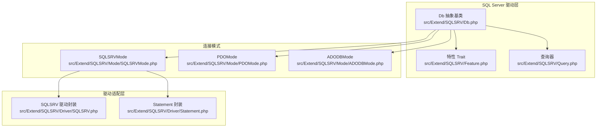
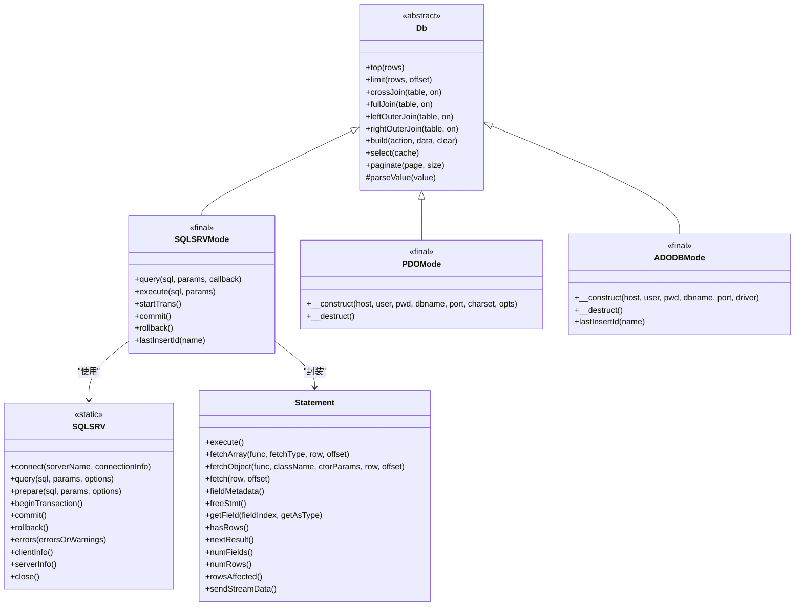
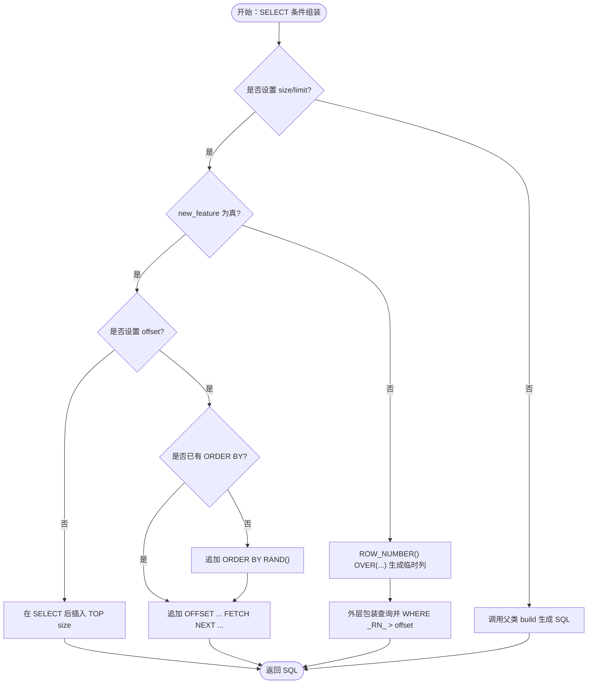
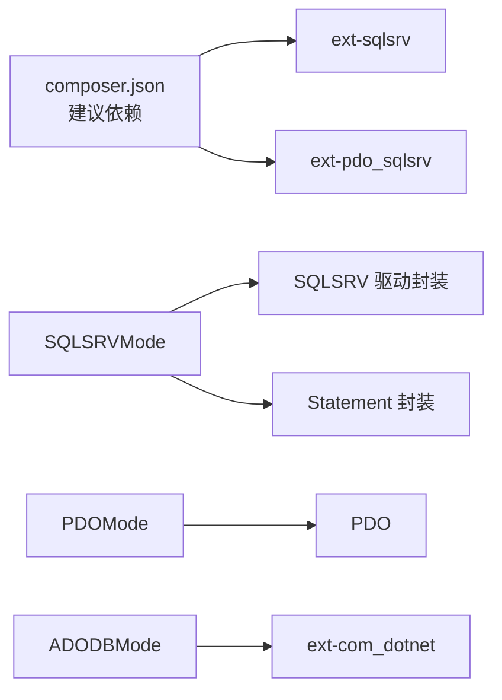

# SQL Server驱动

<cite>
**本文引用的文件**
- [src/Extend/SQLSRV/Db.php](file://src/Extend/SQLSRV/Db.php)
- [src/Extend/SQLSRV/Feature.php](file://src/Extend/SQLSRV/Feature.php)
- [src/Extend/SQLSRV/Query.php](file://src/Extend/SQLSRV/Query.php)
- [src/Extend/SQLSRV/Driver/SQLSRV.php](file://src/Extend/SQLSRV/Driver/SQLSRV.php)
- [src/Extend/SQLSRV/Driver/Statement.php](file://src/Extend/SQLSRV/Driver/Statement.php)
- [src/Extend/SQLSRV/Mode/SQLSRVMode.php](file://src/Extend/SQLSRV/Mode/SQLSRVMode.php)
- [src/Extend/SQLSRV/Mode/PDOMode.php](file://src/Extend/SQLSRV/Mode/PDOMode.php)
- [src/Extend/SQLSRV/Mode/ADODBMode.php](file://src/Extend/SQLSRV/Mode/ADODBMode.php)
- [src/Core/Db.php](file://src/Core/Db.php)
- [src/Db.php](file://src/Db.php)
- [composer.json](file://composer.json)
- [tests/Extend/SQLSRV/Mode/TestSQLSRVMode.php](file://tests/Extend/SQLSRV/Mode/TestSQLSRVMode.php)
</cite>

## 目录
1. [简介](#简介)
2. [项目结构](#项目结构)
3. [核心组件](#核心组件)
4. [架构总览](#架构总览)
5. [详细组件分析](#详细组件分析)
6. [依赖关系分析](#依赖关系分析)
7. [性能考虑](#性能考虑)
8. [故障排除指南](#故障排除指南)
9. [结论](#结论)
10. [附录](#附录)

## 简介
本章节面向使用 FizeDatabase 的 SQL Server 驱动（php_sqlsrv / php_pdo_sqlsrv）的开发者，系统讲解以下内容：
- 连接字符串格式与认证方式（Windows 身份验证与 SQL 认证）
- T-SQL 特有语法支持（TOP、OFFSET/FETCH、函数与存储过程调用）
- 驱动配置示例、性能优化建议与跨平台兼容性说明
- SQLSRV 扩展版本差异与常见问题排查

## 项目结构
SQL Server 驱动位于 Extend/SQLSRV 目录，采用“模式工厂 + 多模式”的架构设计，支持三种连接模式：
- SQLSRVMode：基于 php_sqlsrv.dll 的官方驱动
- PDOMode：基于 PDO + php_pdo_sqlsrv.dll
- ADODBMode：基于 COM/ADO（通过 php_com_dotnet）

图表来源
- [src/Extend/SQLSRV/Db.php:1-231](file://src/Extend/SQLSRV/Db.php#L1-L231)
- [src/Extend/SQLSRV/Feature.php:1-51](file://src/Extend/SQLSRV/Feature.php#L1-L51)
- [src/Extend/SQLSRV/Query.php:1-14](file://src/Extend/SQLSRV/Query.php#L1-L14)
- [src/Extend/SQLSRV/Driver/SQLSRV.php:1-176](file://src/Extend/SQLSRV/Driver/SQLSRV.php#L1-L176)
- [src/Extend/SQLSRV/Driver/Statement.php:1-196](file://src/Extend/SQLSRV/Driver/Statement.php#L1-L196)
- [src/Extend/SQLSRV/Mode/SQLSRVMode.php:1-131](file://src/Extend/SQLSRV/Mode/SQLSRVMode.php#L1-L131)
- [src/Extend/SQLSRV/Mode/PDOMode.php:1-71](file://src/Extend/SQLSRV/Mode/PDOMode.php#L1-L71)
- [src/Extend/SQLSRV/Mode/ADODBMode.php:1-62](file://src/Extend/SQLSRV/Mode/ADODBMode.php#L1-L62)

章节来源
- [src/Extend/SQLSRV/Db.php:1-231](file://src/Extend/SQLSRV/Db.php#L1-L231)
- [src/Extend/SQLSRV/Driver/SQLSRV.php:1-176](file://src/Extend/SQLSRV/Driver/SQLSRV.php#L1-L176)
- [src/Extend/SQLSRV/Mode/SQLSRVMode.php:1-131](file://src/Extend/SQLSRV/Mode/SQLSRVMode.php#L1-L131)
- [src/Extend/SQLSRV/Mode/PDOMode.php:1-71](file://src/Extend/SQLSRV/Mode/PDOMode.php#L1-L71)
- [src/Extend/SQLSRV/Mode/ADODBMode.php:1-62](file://src/Extend/SQLSRV/Mode/ADODBMode.php#L1-L62)

## 核心组件
- Db 抽象类与特性
  - Db 抽象类提供 SQL 组装、分页、TOP 与 OFFSET/FETCH 两种分页策略等能力；Feature trait 提供表名/字段名的方括号转义规则。
  - Query 类复用 Feature，确保查询器具备相同的标识符转义行为。

- 驱动封装
  - SQLSRV 驱动封装负责连接、事务、prepare/query、错误收集、客户端/服务器信息等。
  - Statement 封装负责执行、遍历、元数据、影响行数、流式数据发送等。

- 连接模式
  - SQLSRVMode：直接使用 php_sqlsrv.dll，适合 Windows 平台高性能场景。
  - PDOMode：使用 PDO + php_pdo_sqlsrv.dll，跨平台友好，配置灵活。
  - ADODBMode：通过 COM/ADO 连接，兼容性好但性能较低，适合历史系统迁移。

章节来源
- [src/Extend/SQLSRV/Db.php:1-231](file://src/Extend/SQLSRV/Db.php#L1-L231)
- [src/Extend/SQLSRV/Feature.php:1-51](file://src/Extend/SQLSRV/Feature.php#L1-L51)
- [src/Extend/SQLSRV/Query.php:1-14](file://src/Extend/SQLSRV/Query.php#L1-L14)
- [src/Extend/SQLSRV/Driver/SQLSRV.php:1-176](file://src/Extend/SQLSRV/Driver/SQLSRV.php#L1-L176)
- [src/Extend/SQLSRV/Driver/Statement.php:1-196](file://src/Extend/SQLSRV/Driver/Statement.php#L1-L196)
- [src/Extend/SQLSRV/Mode/SQLSRVMode.php:1-131](file://src/Extend/SQLSRV/Mode/SQLSRVMode.php#L1-L131)
- [src/Extend/SQLSRV/Mode/PDOMode.php:1-71](file://src/Extend/SQLSRV/Mode/PDOMode.php#L1-L71)
- [src/Extend/SQLSRV/Mode/ADODBMode.php:1-62](file://src/Extend/SQLSRV/Mode/ADODBMode.php#L1-L62)

## 架构总览
SQL Server 驱动通过统一的 Db 接口向上提供能力，底层由具体模式实现连接与执行细节。Db 抽象类在 SELECT 时根据 new_feature 决定使用 TOP 还是 OFFSET/FETCH 分页策略；在非新特性模式下，内部通过 ROW_NUMBER 实现分页并自动剔除临时列。

图表来源
- [src/Extend/SQLSRV/Db.php:1-231](file://src/Extend/SQLSRV/Db.php#L1-L231)
- [src/Extend/SQLSRV/Mode/SQLSRVMode.php:1-131](file://src/Extend/SQLSRV/Mode/SQLSRVMode.php#L1-L131)
- [src/Extend/SQLSRV/Mode/PDOMode.php:1-71](file://src/Extend/SQLSRV/Mode/PDOMode.php#L1-L71)
- [src/Extend/SQLSRV/Mode/ADODBMode.php:1-62](file://src/Extend/SQLSRV/Mode/ADODBMode.php#L1-L62)
- [src/Extend/SQLSRV/Driver/SQLSRV.php:1-176](file://src/Extend/SQLSRV/Driver/SQLSRV.php#L1-L176)
- [src/Extend/SQLSRV/Driver/Statement.php:1-196](file://src/Extend/SQLSRV/Driver/Statement.php#L1-L196)

## 详细组件分析

### SQL Server 连接与认证
- SQLSRVMode（php_sqlsrv.dll）
  - 连接参数：主机、用户、密码、数据库、端口、字符集映射（GBK→UTF-8）。
  - 连接信息键：UID、PWD、Database、CharacterSet（非 UTF-8 时设置）。
  - 事务：beginTransaction、commit、rollback。
  - lastInsertId：通过查询系统变量获取最新标识。

- PDOMode（PDO + php_pdo_sqlsrv.dll）
  - DSN：sqlsrv:Server={host}[,{port}];Database={dbname}。
  - 字符集：通过 PDO 选项控制编码（默认 UTF-8 或默认编码）。
  - 事务：继承 PDO 事务接口。
  - lastInsertId：通过查询系统变量获取最新标识。

- ADODBMode（COM/ADO）
  - DSN：Provider={driver};Server={host}[:port];Database={dbname};Uid={user};Pwd={pwd}。
  - 驱动选择：SQLNCLI11（较快）、sqloledb（兼容性更好）。
  - lastInsertId：通过查询系统变量获取最新标识。

章节来源
- [src/Extend/SQLSRV/Mode/SQLSRVMode.php:1-131](file://src/Extend/SQLSRV/Mode/SQLSRVMode.php#L1-L131)
- [src/Extend/SQLSRV/Mode/PDOMode.php:1-71](file://src/Extend/SQLSRV/Mode/PDOMode.php#L1-L71)
- [src/Extend/SQLSRV/Mode/ADODBMode.php:1-62](file://src/Extend/SQLSRV/Mode/ADODBMode.php#L1-L62)

### SQL Server 特有语法与分页
- TOP 子句
  - Db::top() 在 SELECT 语句中插入 TOP N。
- OFFSET/FETCH 分页
  - new_feature=true 时，若未指定 ORDER BY，则自动追加 ORDER BY RAND()，否则直接使用 OFFSET ... FETCH NEXT ... ROWS ONLY。
- 旧版分页（new_feature=false）
  - 通过 ROW_NUMBER() OVER(...) 生成行号，外层筛选行号范围，自动去除临时列。

图表来源
- [src/Extend/SQLSRV/Db.php:133-185](file://src/Extend/SQLSRV/Db.php#L133-L185)

章节来源
- [src/Extend/SQLSRV/Db.php:1-231](file://src/Extend/SQLSRV/Db.php#L1-L231)

### 存储过程、标量函数与表值函数调用
- 存储过程
  - 使用 query/execute 执行 CALL 语句，参数按问号占位符绑定。
- 标量函数
  - 在 SELECT 中作为表达式调用，例如 SELECT dbo.fn_name(...) FROM ...。
- 表值函数
  - 在 FROM 子句中作为表使用，例如 SELECT * FROM dbo.tvf_name(...)。

章节来源
- [src/Extend/SQLSRV/Driver/SQLSRV.php:148-156](file://src/Extend/SQLSRV/Driver/SQLSRV.php#L148-L156)
- [src/Extend/SQLSRV/Driver/Statement.php:51-54](file://src/Extend/SQLSRV/Driver/Statement.php#L51-L54)

### 驱动配置示例与最佳实践
- SQLSRVMode（php_sqlsrv.dll）
  - 连接参数：host、user、pwd、dbname、port（可选）、charset（默认 GBK，会映射为 UTF-8）。
  - 适用场景：Windows 平台、对性能敏感的应用。
- PDOMode（PDO + php_pdo_sqlsrv.dll）
  - DSN：sqlsrv:Server={host}[,{port}];Database={dbname}。
  - 选项：PDO::SQLSRV_ATTR_ENCODING 控制编码。
  - 适用场景：跨平台、配置灵活。
- ADODBMode（COM/ADO）
  - Provider：SQLNCLI11（更快）或 sqloledb（兼容性更好）。
  - 适用场景：历史系统迁移或 COM 环境受限。

章节来源
- [src/Extend/SQLSRV/Mode/SQLSRVMode.php:32-49](file://src/Extend/SQLSRV/Mode/SQLSRVMode.php#L32-L49)
- [src/Extend/SQLSRV/Mode/PDOMode.php:32-59](file://src/Extend/SQLSRV/Mode/PDOMode.php#L32-L59)
- [src/Extend/SQLSRV/Mode/ADODBMode.php:27-38](file://src/Extend/SQLSRV/Mode/ADODBMode.php#L27-L38)

### 错误处理与事务管理
- 错误处理
  - SQLSRV 驱动封装提供 errors() 方法获取错误列表，包含 SQLSTATE、code、message。
  - 构造阶段若连接失败，抛出异常。
- 事务
  - 支持 beginTransaction、commit、rollback。
  - Db 静态类提供嵌套事务计数，避免重复开启事务。

章节来源
- [src/Extend/SQLSRV/Driver/SQLSRV.php:26-34](file://src/Extend/SQLSRV/Driver/SQLSRV.php#L26-L34)
- [src/Extend/SQLSRV/Driver/SQLSRV.php:109-112](file://src/Extend/SQLSRV/Driver/SQLSRV.php#L109-L112)
- [src/Db.php:82-114](file://src/Db.php#L82-L114)

## 依赖关系分析
- 扩展依赖
  - composer.json 建议安装 ext-sqlsrv 与 ext-pdo_sqlsrv，以启用 SQL Server 驱动。
- 模式耦合
  - SQLSRVMode 与 PDOMode、ADODBMode 均继承自 Db 抽象类，共享统一接口。
  - SQLSRVMode 依赖 SQLSRV 驱动封装与 Statement 封装。

图表来源
- [composer.json:20-37](file://composer.json#L20-L37)
- [src/Extend/SQLSRV/Mode/SQLSRVMode.php:1-131](file://src/Extend/SQLSRV/Mode/SQLSRVMode.php#L1-L131)
- [src/Extend/SQLSRV/Driver/SQLSRV.php:1-176](file://src/Extend/SQLSRV/Driver/SQLSRV.php#L1-L176)
- [src/Extend/SQLSRV/Driver/Statement.php:1-196](file://src/Extend/SQLSRV/Driver/Statement.php#L1-L196)
- [src/Extend/SQLSRV/Mode/PDOMode.php:1-71](file://src/Extend/SQLSRV/Mode/PDOMode.php#L1-L71)
- [src/Extend/SQLSRV/Mode/ADODBMode.php:1-62](file://src/Extend/SQLSRV/Mode/ADODBMode.php#L1-L62)

章节来源
- [composer.json:20-37](file://composer.json#L20-L37)
- [src/Extend/SQLSRV/Mode/SQLSRVMode.php:1-131](file://src/Extend/SQLSRV/Mode/SQLSRVMode.php#L1-L131)
- [src/Extend/SQLSRV/Mode/PDOMode.php:1-71](file://src/Extend/SQLSRV/Mode/PDOMode.php#L1-L71)
- [src/Extend/SQLSRV/Mode/ADODBMode.php:1-62](file://src/Extend/SQLSRV/Mode/ADODBMode.php#L1-L62)

## 性能考虑
- 连接模式选择
  - Windows 生产环境优先 SQLSRVMode（php_sqlsrv.dll），性能更优。
  - 跨平台或容器化部署优先 PDOMode（PDO + php_pdo_sqlsrv.dll）。
- 分页策略
  - 新版 SQL Server（2012+）建议启用 new_feature，使用 OFFSET/FETCH 分页，避免 ROW_NUMBER 包裹带来的额外开销。
- 参数化与预处理
  - 使用 query/execute 的参数绑定，避免拼接 SQL，降低注入风险并提升缓存命中率。
- 流式数据
  - 对于大字段或流式数据，使用 Statement::sendStreamData() 分块传输，减少内存占用。

章节来源
- [src/Extend/SQLSRV/Db.php:27-31](file://src/Extend/SQLSRV/Db.php#L27-L31)
- [src/Extend/SQLSRV/Db.php:151-174](file://src/Extend/SQLSRV/Db.php#L151-L174)
- [src/Extend/SQLSRV/Driver/Statement.php:191-194](file://src/Extend/SQLSRV/Driver/Statement.php#L191-L194)

## 故障排除指南
- 连接失败
  - 检查扩展是否启用：ext-sqlsrv 与 ext-pdo_sqlsrv。
  - 核对服务器名、端口、数据库名、凭据。
  - 使用 SQLSRV::errors() 获取错误详情。
- 字符集问题
  - SQLSRVMode：当 charset 非 UTF-8 时设置 CharacterSet。
  - PDOMode：通过 PDO 选项设置 SQLSRV_ATTR_ENCODING。
- 分页异常
  - 若 new_feature=false，确保查询包含 ORDER BY，否则会自动追加 RAND() 排序。
- 事务问题
  - 使用 Db 静态类的嵌套事务计数，避免重复开启。
- 单元测试参考
  - 可参考 TestSQLSRVMode 的构造、事务、lastInsertId、查询等用例，定位问题。

章节来源
- [src/Extend/SQLSRV/Driver/SQLSRV.php:26-34](file://src/Extend/SQLSRV/Driver/SQLSRV.php#L26-L34)
- [src/Extend/SQLSRV/Driver/SQLSRV.php:109-112](file://src/Extend/SQLSRV/Driver/SQLSRV.php#L109-L112)
- [src/Extend/SQLSRV/Mode/SQLSRVMode.php:34-48](file://src/Extend/SQLSRV/Mode/SQLSRVMode.php#L34-L48)
- [src/Extend/SQLSRV/Mode/PDOMode.php:44-58](file://src/Extend/SQLSRV/Mode/PDOMode.php#L44-L58)
- [tests/Extend/SQLSRV/Mode/TestSQLSRVMode.php:11-124](file://tests/Extend/SQLSRV/Mode/TestSQLSRVMode.php#L11-L124)

## 结论
FizeDatabase 的 SQL Server 驱动提供了统一抽象与多模式适配，既能满足 Windows 平台高性能需求（SQLSRVMode），也能兼顾跨平台与灵活性（PDOMode）。通过 Db 抽象类的分页策略与 SQLSRV 驱动封装的事务、错误处理能力，开发者可以稳定地完成 SQL Server 的日常开发任务。建议在生产环境中优先选择 SQLSRVMode，并结合 OFFSET/FETCH 分页与参数化查询提升性能与安全性。

## 附录

### SQL Server 驱动版本差异与兼容性
- php_sqlsrv.dll
  - 官方支持，性能优异，推荐用于 Windows 环境。
- php_pdo_sqlsrv.dll
  - 跨平台友好，配置灵活，适合容器化与多平台部署。
- COM/ADO（ADODBMode）
  - 兼容性最好，适合历史系统迁移，性能相对较低。

章节来源
- [src/Extend/SQLSRV/Mode/SQLSRVMode.php:12-14](file://src/Extend/SQLSRV/Mode/SQLSRVMode.php#L12-L14)
- [src/Extend/SQLSRV/Mode/PDOMode.php:13-17](file://src/Extend/SQLSRV/Mode/PDOMode.php#L13-L17)
- [src/Extend/SQLSRV/Mode/ADODBMode.php:12-13](file://src/Extend/SQLSRV/Mode/ADODBMode.php#L12-L13)