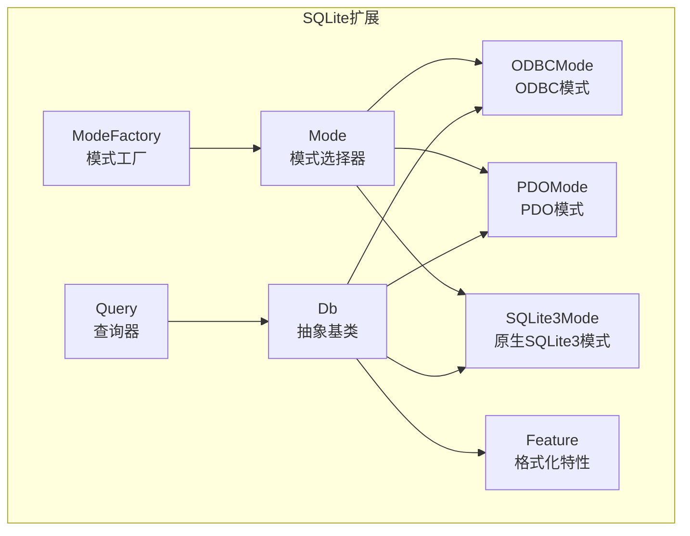
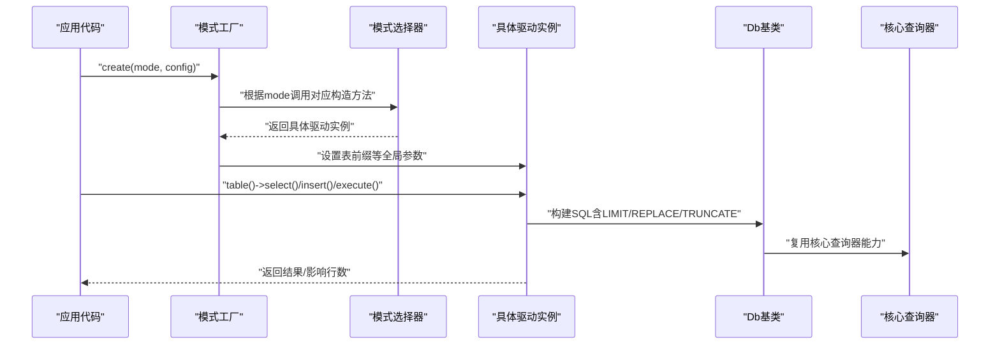
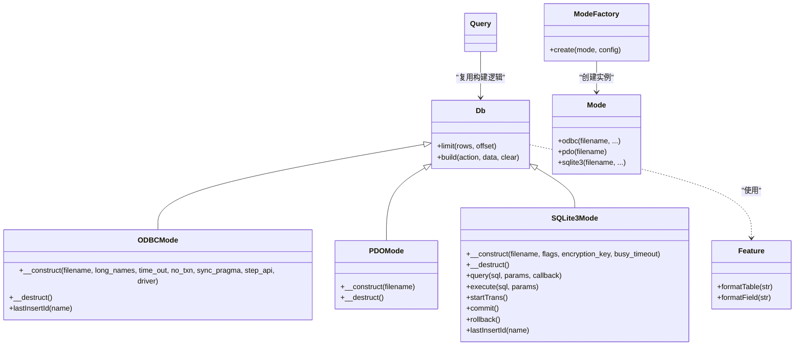
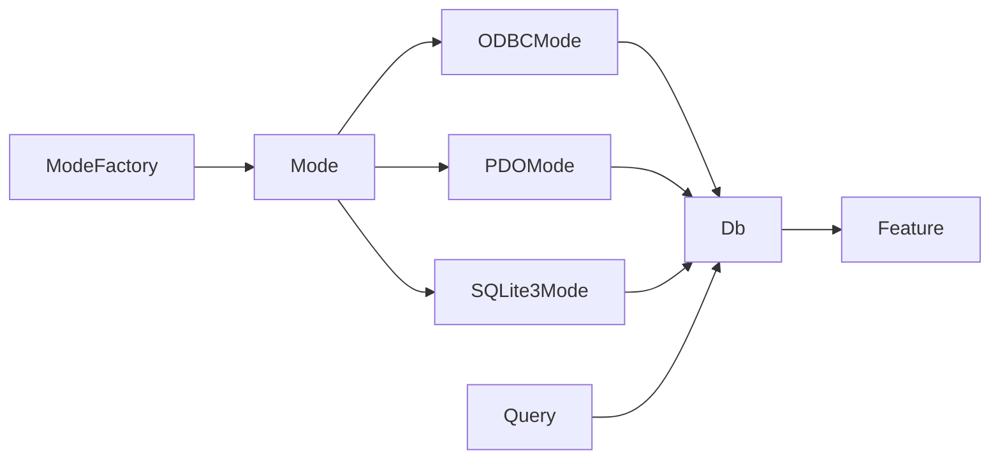

# SQLite驱动

<cite>
**本文档引用的文件**
- [src/Extend/SQLite/ModeFactory.php](file://src/Extend/SQLite/ModeFactory.php)
- [src/Extend/SQLite/Mode.php](file://src/Extend/SQLite/Mode.php)
- [src/Extend/SQLite/Db.php](file://src/Extend/SQLite/Db.php)
- [src/Extend/SQLite/Feature.php](file://src/Extend/SQLite/Feature.php)
- [src/Extend/SQLite/Query.php](file://src/Extend/SQLite/Query.php)
- [src/Extend/SQLite/Mode/ODBCMode.php](file://src/Extend/SQLite/Mode/ODBCMode.php)
- [src/Extend/SQLite/Mode/PDOMode.php](file://src/Extend/SQLite/Mode/PDOMode.php)
- [src/Extend/SQLite/Mode/SQLite3Mode.php](file://src/Extend/SQLite/Mode/SQLite3Mode.php)
- [tests/Extend/SQLite/Mode/TestODBCMode.php](file://tests/Extend/SQLite/Mode/TestODBCMode.php)
- [tests/Extend/SQLite/Mode/TestPDOMode.php](file://tests/Extend/SQLite/Mode/TestPDOMode.php)
- [tests/Extend/SQLite/Mode/TestSQLite3Mode.php](file://tests/Extend/SQLite/Mode/TestSQLite3Mode.php)
</cite>

## 目录
1. [简介](#简介)
2. [项目结构](#项目结构)
3. [核心组件](#核心组件)
4. [架构总览](#架构总览)
5. [详细组件分析](#详细组件分析)
6. [依赖关系分析](#依赖关系分析)
7. [性能与适用场景](#性能与适用场景)
8. [故障排查指南](#故障排查指南)
9. [结论](#结论)
10. [附录：配置示例与最佳实践](#附录配置示例与最佳实践)

## 简介
本章节面向希望在FizeDatabase中使用SQLite数据库驱动的开发者，系统讲解SQLite驱动的三种连接模式（ODBC、PDO、SQLite3）的文件路径配置、内存数据库与持久化数据库的区别、SQLite特有的SQL语法与扩展能力、配置示例、文件权限与多进程访问注意事项，以及SQLite的ACID特性、性能特点与适用场景。

## 项目结构
FizeDatabase的SQLite驱动位于扩展模块中，采用“按功能域分层”的组织方式：
- 驱动入口与工厂：通过模式工厂根据配置创建具体驱动实例
- 模式选择器：集中提供三种模式的静态构造方法
- 具体模式实现：分别封装ODBC、PDO、原生SQLite3的连接与执行细节
- 公共基类与特性：提供SQL构建、表/字段格式化等通用能力
- 查询器：继承核心查询器并复用SQLite特性

图表来源
- [src/Extend/SQLite/ModeFactory.php:1-62](file://src/Extend/SQLite/ModeFactory.php#L1-L62)
- [src/Extend/SQLite/Mode.php:1-56](file://src/Extend/SQLite/Mode.php#L1-L56)
- [src/Extend/SQLite/Db.php:1-69](file://src/Extend/SQLite/Db.php#L1-L69)
- [src/Extend/SQLite/Feature.php:1-57](file://src/Extend/SQLite/Feature.php#L1-L57)
- [src/Extend/SQLite/Query.php:1-16](file://src/Extend/SQLite/Query.php#L1-L16)
- [src/Extend/SQLite/Mode/ODBCMode.php:1-57](file://src/Extend/SQLite/Mode/ODBCMode.php#L1-L57)
- [src/Extend/SQLite/Mode/PDOMode.php:1-36](file://src/Extend/SQLite/Mode/PDOMode.php#L1-L36)
- [src/Extend/SQLite/Mode/SQLite3Mode.php:1-169](file://src/Extend/SQLite/Mode/SQLite3Mode.php#L1-L169)

章节来源
- [src/Extend/SQLite/ModeFactory.php:1-62](file://src/Extend/SQLite/ModeFactory.php#L1-L62)
- [src/Extend/SQLite/Mode.php:1-56](file://src/Extend/SQLite/Mode.php#L1-L56)
- [src/Extend/SQLite/Db.php:1-69](file://src/Extend/SQLite/Db.php#L1-L69)
- [src/Extend/SQLite/Feature.php:1-57](file://src/Extend/SQLite/Feature.php#L1-L57)
- [src/Extend/SQLite/Query.php:1-16](file://src/Extend/SQLite/Query.php#L1-L16)
- [src/Extend/SQLite/Mode/ODBCMode.php:1-57](file://src/Extend/SQLite/Mode/ODBCMode.php#L1-L57)
- [src/Extend/SQLite/Mode/PDOMode.php:1-36](file://src/Extend/SQLite/Mode/PDOMode.php#L1-L36)
- [src/Extend/SQLite/Mode/SQLite3Mode.php:1-169](file://src/Extend/SQLite/Mode/SQLite3Mode.php#L1-L169)

## 核心组件
- 模式工厂（ModeFactory）：根据传入的模式字符串与配置数组，创建对应的SQLite驱动实例，并设置表前缀等全局参数。
- 模式选择器（Mode）：提供三种静态构造方法，分别对应ODBC、PDO、原生SQLite3模式。
- 抽象基类（Db）：封装SQLite特有的SQL构建逻辑（如LIMIT拼接）、REPLACE/ TRUNCATE语句支持，以及表/字段格式化能力。
- 特性（Feature）：提供表名与字段名的格式化策略，确保生成的SQL符合SQLite命名约定。
- 查询器（Query）：基于核心查询器，复用SQLite特性，占位符统一为问号。
- 具体模式实现（ODBCMode、PDOMode、SQLite3Mode）：分别封装不同底层驱动的连接、执行、事务与资源释放细节。

章节来源
- [src/Extend/SQLite/ModeFactory.php:1-62](file://src/Extend/SQLite/ModeFactory.php#L1-L62)
- [src/Extend/SQLite/Mode.php:1-56](file://src/Extend/SQLite/Mode.php#L1-L56)
- [src/Extend/SQLite/Db.php:1-69](file://src/Extend/SQLite/Db.php#L1-L69)
- [src/Extend/SQLite/Feature.php:1-57](file://src/Extend/SQLite/Feature.php#L1-L57)
- [src/Extend/SQLite/Query.php:1-16](file://src/Extend/SQLite/Query.php#L1-L16)
- [src/Extend/SQLite/Mode/ODBCMode.php:1-57](file://src/Extend/SQLite/Mode/ODBCMode.php#L1-L57)
- [src/Extend/SQLite/Mode/PDOMode.php:1-36](file://src/Extend/SQLite/Mode/PDOMode.php#L1-L36)
- [src/Extend/SQLite/Mode/SQLite3Mode.php:1-169](file://src/Extend/SQLite/Mode/SQLite3Mode.php#L1-L169)

## 架构总览
下图展示了从应用到SQLite驱动的调用链路与关键交互点，包括模式工厂如何根据配置选择具体模式，以及各模式如何封装底层连接与执行。

图表来源
- [src/Extend/SQLite/ModeFactory.php:21-60](file://src/Extend/SQLite/ModeFactory.php#L21-L60)
- [src/Extend/SQLite/Mode.php:28-54](file://src/Extend/SQLite/Mode.php#L28-L54)
- [src/Extend/SQLite/Db.php:44-67](file://src/Extend/SQLite/Db.php#L44-L67)
- [src/Extend/SQLite/Query.php:12-15](file://src/Extend/SQLite/Query.php#L12-L15)

## 详细组件分析

### 模式工厂（ModeFactory）
- 负责解析传入的模式字符串与配置数组，合并默认参数，然后委托给模式选择器创建具体实例。
- 支持的模式：odbc、sqlite3、pdo；默认为pdo。
- 在创建实例后设置表前缀，便于后续所有表名统一加前缀。

章节来源
- [src/Extend/SQLite/ModeFactory.php:21-60](file://src/Extend/SQLite/ModeFactory.php#L21-L60)

### 模式选择器（Mode）
- 提供三种静态构造方法：
  - odbc：支持长名、超时、事务控制、同步策略、StepAPI及可选驱动名等参数。
  - pdo：使用标准DSN“sqlite:”指定数据库文件。
  - sqlite3：支持打开标志、加密密钥、忙碌超时等参数。
- 三种模式均继承自Db抽象基类，共享SQL构建与格式化能力。

章节来源
- [src/Extend/SQLite/Mode.php:28-54](file://src/Extend/SQLite/Mode.php#L28-L54)

### 抽象基类（Db）
- 重写SQL构建逻辑：
  - 支持REPLACE INTO与TRUNCATE TABLE语句的特殊处理。
  - 在非REPLACE/ TRUNCATE场景下委托父类构建，并在末尾追加LIMIT子句。
- 提供limit(rows, offset?)方法，支持链式调用，内部维护limit字符串。
- 复用Feature特性进行表名与字段名格式化，避免关键字冲突。

章节来源
- [src/Extend/SQLite/Db.php:44-67](file://src/Extend/SQLite/Db.php#L44-L67)
- [src/Extend/SQLite/Db.php:27-35](file://src/Extend/SQLite/Db.php#L27-L35)
- [src/Extend/SQLite/Feature.php:16-55](file://src/Extend/SQLite/Feature.php#L16-L55)

### 特性（Feature）
- 表名格式化：若未包含反引号且不包含“.”、不包含“SELECT”片段、不包含“AS”，则自动包裹反引号。
- 字段名格式化：对“*”、已带反引号、包含“.”、包含“SELECT”片段、包含“AS”、以“)”结尾的情况不做处理，否则包裹反引号。
- 该特性确保生成的SQL在SQLite环境下更安全、兼容性更好。

章节来源
- [src/Extend/SQLite/Feature.php:16-55](file://src/Extend/SQLite/Feature.php#L16-L55)

### 查询器（Query）
- 继承核心查询器，复用其构建SQL的能力。
- 占位符统一为问号，适配SQLite的原生预处理语法。

章节来源
- [src/Extend/SQLite/Query.php:12-15](file://src/Extend/SQLite/Query.php#L12-L15)

### ODBC模式（ODBCMode）
- 默认使用“SQLite3 ODBC Driver”作为驱动名，可通过参数指定。
- 通过ODBC中间件完成连接与资源管理。
- lastInsertId通过执行“SELECT LAST_INSERT_ROWID()”获取。

章节来源
- [src/Extend/SQLite/Mode/ODBCMode.php:28-55](file://src/Extend/SQLite/Mode/ODBCMode.php#L28-L55)

### PDO模式（PDOMode）
- 使用DSN“sqlite:”连接数据库文件。
- 通过PDO中间件完成连接与资源管理。

章节来源
- [src/Extend/SQLite/Mode/PDOMode.php:21-34](file://src/Extend/SQLite/Mode/PDOMode.php#L21-L34)

### 原生SQLite3模式（SQLite3Mode）
- 直接使用PHP内置SQLite3扩展，支持打开标志、加密密钥与忙碌超时。
- query/execute方法支持问号占位符与自动类型绑定（整型、浮点、BLOB、NULL、文本）。
- 事务接口：startTrans/commit/rollback映射到原生命令。
- lastInsertId通过原生lastInsertRowID获取。

章节来源
- [src/Extend/SQLite/Mode/SQLite3Mode.php:29-89](file://src/Extend/SQLite/Mode/SQLite3Mode.php#L29-L89)
- [src/Extend/SQLite/Mode/SQLite3Mode.php:96-130](file://src/Extend/SQLite/Mode/SQLite3Mode.php#L96-L130)
- [src/Extend/SQLite/Mode/SQLite3Mode.php:136-157](file://src/Extend/SQLite/Mode/SQLite3Mode.php#L136-L157)
- [src/Extend/SQLite/Mode/SQLite3Mode.php:164-167](file://src/Extend/SQLite/Mode/SQLite3Mode.php#L164-L167)

### 类关系图

图表来源
- [src/Extend/SQLite/Db.php:12-69](file://src/Extend/SQLite/Db.php#L12-L69)
- [src/Extend/SQLite/Mode/ODBCMode.php:13-57](file://src/Extend/SQLite/Mode/ODBCMode.php#L13-L57)
- [src/Extend/SQLite/Mode/PDOMode.php:13-36](file://src/Extend/SQLite/Mode/PDOMode.php#L13-L36)
- [src/Extend/SQLite/Mode/SQLite3Mode.php:14-169](file://src/Extend/SQLite/Mode/SQLite3Mode.php#L14-L169)
- [src/Extend/SQLite/ModeFactory.php:11-62](file://src/Extend/SQLite/ModeFactory.php#L11-L62)
- [src/Extend/SQLite/Mode.php:14-56](file://src/Extend/SQLite/Mode.php#L14-L56)
- [src/Extend/SQLite/Query.php:12-15](file://src/Extend/SQLite/Query.php#L12-L15)
- [src/Extend/SQLite/Feature.php:8-57](file://src/Extend/SQLite/Feature.php#L8-L57)

## 依赖关系分析
- 模式工厂依赖模式选择器与具体模式类，负责实例化与参数注入。
- 具体模式类均继承Db抽象基类，复用SQL构建与格式化能力。
- 查询器依赖核心查询器并复用Db的构建逻辑。
- 各模式通过中间件完成底层连接与资源管理。

图表来源
- [src/Extend/SQLite/ModeFactory.php:21-60](file://src/Extend/SQLite/ModeFactory.php#L21-L60)
- [src/Extend/SQLite/Mode.php:28-54](file://src/Extend/SQLite/Mode.php#L28-L54)
- [src/Extend/SQLite/Db.php:12-14](file://src/Extend/SQLite/Db.php#L12-L14)
- [src/Extend/SQLite/Query.php:12-15](file://src/Extend/SQLite/Query.php#L12-L15)
- [src/Extend/SQLite/Feature.php:8-9](file://src/Extend/SQLite/Feature.php#L8-L9)

章节来源
- [src/Extend/SQLite/ModeFactory.php:21-60](file://src/Extend/SQLite/ModeFactory.php#L21-L60)
- [src/Extend/SQLite/Mode.php:28-54](file://src/Extend/SQLite/Mode.php#L28-L54)
- [src/Extend/SQLite/Db.php:12-14](file://src/Extend/SQLite/Db.php#L12-L14)
- [src/Extend/SQLite/Query.php:12-15](file://src/Extend/SQLite/Query.php#L12-L15)
- [src/Extend/SQLite/Feature.php:8-9](file://src/Extend/SQLite/Feature.php#L8-L9)

## 性能与适用场景
- 性能特点
  - 原生SQLite3模式通常具有更低的调用开销，适合高并发写入与复杂查询场景。
  - PDO模式具备良好的跨平台一致性，但可能略高于原生模式。
  - ODBC模式受驱动与系统配置影响较大，适合已有ODBC基础设施的环境。
- ACID特性
  - SQLite遵循ACID：原子性（事务）、一致性（约束）、隔离性（默认串行化）、持久性（WAL/常规模式）。
- 适用场景
  - 小型应用、嵌入式系统、开发测试、单机离线应用。
  - 对数据完整性要求高、并发度适中的业务。

[本节为通用指导，无需特定文件引用]

## 故障排查指南
- 连接失败
  - 检查数据库文件路径是否存在、权限是否正确（见附录）。
  - ODBC模式需确认系统已安装对应驱动并可用。
- 事务问题
  - 确认使用startTrans/commit/rollback成对调用。
- 并发与锁
  - SQLite在写入时会加锁，可通过调整busy_timeout或使用WAL模式缓解。
- lastInsertId异常
  - 不同模式下lastInsertId的实现不同，请确认使用的模式与方法。

章节来源
- [src/Extend/SQLite/Mode/ODBCMode.php:51-55](file://src/Extend/SQLite/Mode/ODBCMode.php#L51-L55)
- [src/Extend/SQLite/Mode/SQLite3Mode.php:164-167](file://src/Extend/SQLite/Mode/SQLite3Mode.php#L164-L167)

## 结论
FizeDatabase的SQLite驱动提供了三种稳定可靠的连接模式，覆盖从原生扩展到ODBC/PDO的广泛需求。通过模式工厂与模式选择器，用户可以便捷地在不同运行环境中切换；Db基类与Feature特性保证了SQL构建与命名安全；Query复用核心能力，简化了上层使用。结合合理的配置与运维策略，SQLite可在多种场景中发挥出色表现。

[本节为总结，无需特定文件引用]

## 附录：配置示例与最佳实践

### 文件路径配置与内存/持久化数据库
- 持久化数据库
  - 使用绝对或相对路径指向磁盘上的.db文件，确保进程有读写权限。
- 内存数据库
  - 使用特殊文件名（如“:memory:”）可启用内存数据库，适合临时数据与测试。
  - 注意：内存数据库仅在当前进程生命周期内有效，进程结束即销毁。

[本小节为概念说明，无需特定文件引用]

### 配置示例（基于模式工厂）
- ODBC模式
  - 关键参数：file、long_names、time_out、no_txn、sync_pragma、step_api、driver
  - 示例用途：已有ODBC生态或Windows环境
- PDO模式
  - 关键参数：file
  - 示例用途：跨平台、简单配置
- SQLite3模式
  - 关键参数：file、flags、encryption_key、busy_timeout
  - 示例用途：高性能、原生能力

章节来源
- [src/Extend/SQLite/ModeFactory.php:24-35](file://src/Extend/SQLite/ModeFactory.php#L24-L35)
- [src/Extend/SQLite/Mode.php:28-54](file://src/Extend/SQLite/Mode.php#L28-L54)

### 文件权限与多进程访问
- 权限建议
  - 数据库文件所在目录与文件需赋予运行进程读写权限。
  - 避免多进程同时写入导致锁竞争，必要时使用队列或互斥机制。
- 多进程注意事项
  - SQLite默认串行化，写入阻塞较明显；可通过合理设计降低写入频率或使用WAL模式（视SQLite版本与部署环境）。
  - busy_timeout用于避免因锁等待直接失败，建议根据业务场景适当增大。

[本小节为通用指导，无需特定文件引用]

### SQLite特有的SQL语法与扩展
- 语法支持
  - REPLACE INTO：用于存在即更新的场景。
  - TRUNCATE TABLE：快速清空表（在SQLite中等价于DELETE FROM ...无WHERE条件）。
  - LIMIT子句：Db基类支持在构建SQL时追加LIMIT。
- 内建函数与扩展
  - lastInsertId：不同模式下实现不同，ODBC通过SQL查询，原生SQLite3通过原生API。
  - 事务：startTrans/commit/rollback映射到原生命令。
  - 占位符：Query统一使用“?”占位符，适配原生SQLite3与PDO。

章节来源
- [src/Extend/SQLite/Db.php:46-55](file://src/Extend/SQLite/Db.php#L46-L55)
- [src/Extend/SQLite/Db.php:59-61](file://src/Extend/SQLite/Db.php#L59-L61)
- [src/Extend/SQLite/Mode/ODBCMode.php:51-55](file://src/Extend/SQLite/Mode/ODBCMode.php#L51-L55)
- [src/Extend/SQLite/Mode/SQLite3Mode.php:136-157](file://src/Extend/SQLite/Mode/SQLite3Mode.php#L136-L157)
- [src/Extend/SQLite/Query.php:12-15](file://src/Extend/SQLite/Query.php#L12-L15)

### 测试参考
- ODBC模式测试：验证构造、析构、lastInsertId与查询流程
- PDO模式测试：验证构造、析构、lastInsertId与查询流程
- SQLite3模式测试：验证构造、析构、lastInsertId与查询流程

章节来源
- [tests/Extend/SQLite/Mode/TestODBCMode.php:11-52](file://tests/Extend/SQLite/Mode/TestODBCMode.php#L11-L52)
- [tests/Extend/SQLite/Mode/TestPDOMode.php:11-53](file://tests/Extend/SQLite/Mode/TestPDOMode.php#L11-L53)
- [tests/Extend/SQLite/Mode/TestSQLite3Mode.php:11-51](file://tests/Extend/SQLite/Mode/TestSQLite3Mode.php#L11-L51)