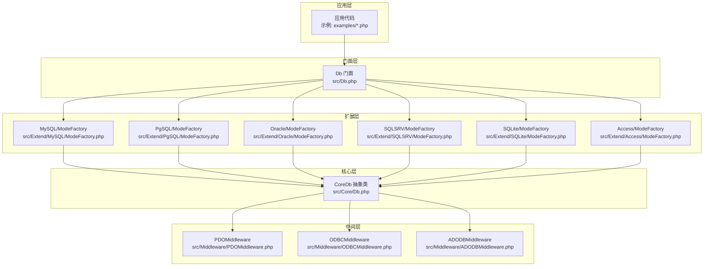
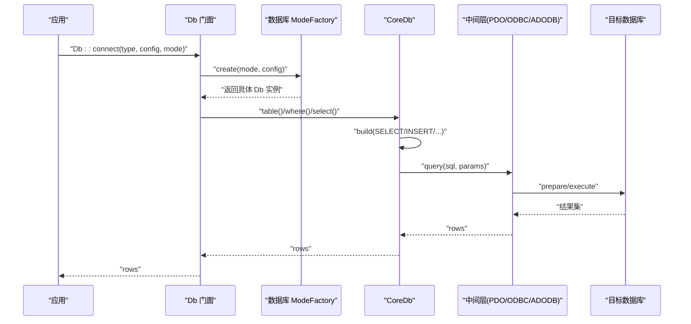

# 数据库驱动

<cite>
**本文引用的文件**
- [composer.json](file://composer.json)
- [Db.php](file://src/Db.php)
- [Core/Db.php](file://src/Core/Db.php)
- [Middleware/PDOMiddleware.php](file://src/Middleware/PDOMiddleware.php)
- [Middleware/ODBCMiddleware.php](file://src/Middleware/ODBCMiddleware.php)
- [Middleware/ADODBMiddleware.php](file://src/Middleware/ADODBMiddleware.php)
- [Extend/MySQL/ModeFactory.php](file://src/Extend/MySQL/ModeFactory.php)
- [Extend/MySQL/Mode.php](file://src/Extend/MySQL/Mode.php)
- [Extend/Oracle/ModeFactory.php](file://src/Extend/Oracle/ModeFactory.php)
- [Extend/PgSQL/ModeFactory.php](file://src/Extend/PgSQL/ModeFactory.php)
- [Extend/SQLSRV/ModeFactory.php](file://src/Extend/SQLSRV/ModeFactory.php)
- [Extend/SQLite/ModeFactory.php](file://src/Extend/SQLite/ModeFactory.php)
- [Extend/Access/ModeFactory.php](file://src/Extend/Access/ModeFactory.php)
- [examples/db_connect.php](file://examples/db_connect.php)
- [examples/db_select.php](file://examples/db_select.php)
</cite>

## 目录
1. [简介](#简介)
2. [项目结构](#项目结构)
3. [核心组件](#核心组件)
4. [架构总览](#架构总览)
5. [详细组件分析](#详细组件分析)
6. [依赖关系分析](#依赖关系分析)
7. [性能考量](#性能考量)
8. [故障排查指南](#故障排查指南)
9. [结论](#结论)
10. [附录](#附录)

## 简介
本文件系统性梳理 FizeDatabase 支持的数据库驱动与连接模式，覆盖 MySQL、PostgreSQL、Oracle、SQL Server、SQLite、Access 六类数据库。内容包括：
- 各数据库的连接配置要点、可用连接模式（PDO、ODBC、部分数据库特有模式）与默认行为
- 特殊功能与差异（如序列、游标、事务控制、字符集）
- 性能特点与最佳实践
- 兼容性与迁移策略
- 常见问题与排障建议
- 实际配置示例与代码片段路径

## 项目结构
项目采用“核心抽象 + 扩展驱动 + 中间层”的分层设计：
- 核心层：统一的查询构建与事务接口（Core/Db.php），提供链式 API 与 SQL 组装
- 扩展层：各数据库的 ModeFactory 与 Mode，负责解析配置、选择连接模式并实例化具体驱动
- 中间层：PDO/ODBC/ADODB 三类通用中间层，封装底层驱动的执行、事务与错误处理
- 入口门面：Db.php 提供静态便捷入口与事务嵌套计数

图表来源
- [Db.php:1-141](file://src/Db.php#L1-L141)
- [Core/Db.php:1-800](file://src/Core/Db.php#L1-L800)
- [Extend/MySQL/ModeFactory.php:1-82](file://src/Extend/MySQL/ModeFactory.php#L1-L82)
- [Extend/PgSQL/ModeFactory.php:1-57](file://src/Extend/PgSQL/ModeFactory.php#L1-L57)
- [Extend/Oracle/ModeFactory.php:1-76](file://src/Extend/Oracle/ModeFactory.php#L1-L76)
- [Extend/SQLSRV/ModeFactory.php:1-56](file://src/Extend/SQLSRV/ModeFactory.php#L1-L56)
- [Extend/SQLite/ModeFactory.php:1-62](file://src/Extend/SQLite/ModeFactory.php#L1-L62)
- [Extend/Access/ModeFactory.php:1-49](file://src/Extend/Access/ModeFactory.php#L1-L49)
- [Middleware/PDOMiddleware.php:1-129](file://src/Middleware/PDOMiddleware.php#L1-L129)
- [Middleware/ODBCMiddleware.php:1-100](file://src/Middleware/ODBCMiddleware.php#L1-L100)
- [Middleware/ADODBMiddleware.php:1-116](file://src/Middleware/ADODBMiddleware.php#L1-L116)

章节来源
- [Db.php:1-141](file://src/Db.php#L1-L141)
- [Core/Db.php:1-800](file://src/Core/Db.php#L1-L800)

## 核心组件
- 门面入口：Db 提供静态方法 connect 与 query/execute/table/startTrans/commit/rollback 等，内部通过对应数据库的 ModeFactory 选择具体模式并创建 CoreDb 实例
- 核心抽象：Core/Db.php 定义统一的查询构建器（field/table/join/group/order/where 等）与 CRUD 接口，同时提供事务抽象与 SQL 日志能力
- 中间层：PDO/ODBC/ADODB 三种通用中间层分别封装底层驱动的 prepare/execute/fetch、事务与异常转换

章节来源
- [Db.php:1-141](file://src/Db.php#L1-L141)
- [Core/Db.php:1-800](file://src/Core/Db.php#L1-L800)
- [Middleware/PDOMiddleware.php:1-129](file://src/Middleware/PDOMiddleware.php#L1-L129)
- [Middleware/ODBCMiddleware.php:1-100](file://src/Middleware/ODBCMiddleware.php#L1-L100)
- [Middleware/ADODBMiddleware.php:1-116](file://src/Middleware/ADODBMiddleware.php#L1-L116)

## 架构总览
下图展示一次典型查询从应用到数据库的调用链路，以及不同数据库模式对中间层的影响。

图表来源
- [Db.php:49-56](file://src/Db.php#L49-L56)
- [Extend/MySQL/ModeFactory.php:21-80](file://src/Extend/MySQL/ModeFactory.php#L21-L80)
- [Core/Db.php:583-637](file://src/Core/Db.php#L583-L637)
- [Middleware/PDOMiddleware.php:51-72](file://src/Middleware/PDOMiddleware.php#L51-L72)

## 详细组件分析

### MySQL
- 支持模式
  - pdo：推荐，基于 PDO
  - mysqli：传统扩展，注意未来淘汰风险
  - odbc：通用适配
- 关键配置项（来自 ModeFactory 默认合并）
  - host、user、password、dbname、port、charset、prefix、opts、real、socket、ssl_set、flags、driver
- 特殊功能
  - 支持 SSL 连接参数（启用与证书路径等）
  - 支持 socket 连接（非 Windows 场景）
- 性能与最佳实践
  - 优先使用 pdo；如需高性能可评估 mysqli（谨慎）
  - 合理设置 charset 与连接选项 opts
  - 大批量读取建议使用回调遍历以降低内存占用
- 示例与片段路径
  - 连接与查询示例：[examples/db_connect.php:14](file://examples/db_connect.php#L14)
  - 查询日志示例：[examples/db_select.php:19](file://examples/db_select.php#L19)
- 差异与兼容
  - 不同模式的 DSN/连接字符串差异较大，需严格按模式配置
- 迁移策略
  - 从 mysqli 迁移到 pdo，调整配置项与字符集设置
- 常见问题
  - SSL 参数不完整导致连接失败
  - 字符集与排序规则不一致引发乱码

章节来源
- [Extend/MySQL/ModeFactory.php:1-82](file://src/Extend/MySQL/ModeFactory.php#L1-L82)
- [Extend/MySQL/Mode.php:1-74](file://src/Extend/MySQL/Mode.php#L1-L74)
- [examples/db_connect.php:14](file://examples/db_connect.php#L14)
- [examples/db_select.php:19](file://examples/db_select.php#L19)

### PostgreSQL
- 支持模式
  - pdo：推荐
  - pgsql：原生命令字符串
  - odbc：通用适配
- 关键配置项（来自 ModeFactory 默认合并）
  - host、user、password、dbname、port、charset、prefix、driver、pconnect、connect_type、opts
- 特殊功能
  - pgsql 模式使用 host/port/dbname/user/password 组合的连接字符串
  - 支持持久连接 pconnect
- 性能与最佳实践
  - 使用 pdo 时合理设置 opts；pgsql 模式可结合 pconnect
  - 注意默认端口 5432
- 示例与片段路径
  - 连接与查询示例：[examples/db_connect.php:32](file://examples/db_connect.php#L32)
- 差异与兼容
  - pgsql 模式与 pdo 的 DSN/连接字符串差异显著
- 迁移策略
  - 从 pgsql 切换到 pdo，统一使用 DSN 方式
- 常见问题
  - 连接字符串拼写错误
  - 字符集与数据库默认字符集不一致

章节来源
- [Extend/PgSQL/ModeFactory.php:1-57](file://src/Extend/PgSQL/ModeFactory.php#L1-L57)

### Oracle
- 支持模式
  - pdo：推荐
  - oci：原生扩展
  - odbc：通用适配
- 关键配置项（来自 ModeFactory 默认合并）
  - host、username（注意字段名）、password、dbname、port、charset、prefix、session_mode、connect_type、opts、driver
- 特殊功能
  - oci 模式支持 session_mode 与 connect_type
  - 支持 SID/主机串组合
- 性能与最佳实践
  - 优先 pdo；oci 模式注意会话与连接类型参数
- 示例与片段路径
  - 连接与查询示例：[examples/db_connect.php:32](file://examples/db_connect.php#L32)
- 差异与兼容
  - oci 与 pdo 的连接参数差异较大
- 迁移策略
  - 从 oci 切换到 pdo，统一使用 DSN 方式
- 常见问题
  - 连接字符串格式错误
  - 字符集与 NLS_LANG 不匹配

章节来源
- [Extend/Oracle/ModeFactory.php:1-76](file://src/Extend/Oracle/ModeFactory.php#L1-L76)

### SQL Server
- 支持模式
  - pdo：推荐
  - sqlsrv：原生扩展
  - adodb：Windows COM
  - odbc：通用适配
- 关键配置项（来自 ModeFactory 默认合并）
  - host、user、password、dbname、port、charset、prefix、new_feature、driver、opts
- 特殊功能
  - sqlsrv 模式支持 charset
  - new_feature 标记（由 ModeFactory 注入）
- 性能与最佳实践
  - Windows 环境可考虑 adodb；跨平台优先 pdo/sqlsrv
- 示例与片段路径
  - 连接与查询示例：[examples/db_connect.php:32](file://examples/db_connect.php#L32)
- 差异与兼容
  - sqlsrv 与 pdo 的 DSN/连接字符串差异较大
- 迁移策略
  - 从 sqlsrv 切换到 pdo，统一使用 DSN 方式
- 常见问题
  - Windows 环境 COM 初始化失败
  - 字符集与 collation 不一致

章节来源
- [Extend/SQLSRV/ModeFactory.php:1-56](file://src/Extend/SQLSRV/ModeFactory.php#L1-L56)

### SQLite
- 支持模式
  - pdo：推荐
  - sqlite3：原生扩展
  - odbc：通用适配
- 关键配置项（来自 ModeFactory 默认合并）
  - file、prefix、long_names、time_out、no_txn、sync_pragma、step_api、driver、flags、encryption_key、busy_timeout
- 特殊功能
  - 支持加密密钥 encryption_key
  - 支持 busy_timeout 控制忙等待
- 性能与最佳实践
  - sqlite3 模式适合轻量场景；生产环境建议使用 pdo 并开启 WAL/页大小等优化
- 示例与片段路径
  - 连接与查询示例：[examples/db_connect.php:32](file://examples/db_connect.php#L32)
- 差异与兼容
  - sqlite3 与 pdo 的 DSN/文件路径差异较大
- 迁移策略
  - 从 sqlite3 切换到 pdo，统一使用 DSN 方式
- 常见问题
  - 文件权限不足
  - 加密密钥错误导致无法打开

章节来源
- [Extend/SQLite/ModeFactory.php:1-62](file://src/Extend/SQLite/ModeFactory.php#L1-L62)

### Access
- 支持模式
  - adodb：Windows COM
  - pdo：通过 ODBC 驱动
  - odbc：通用适配
- 关键配置项（来自 ModeFactory 默认合并）
  - file、password、prefix、driver
- 特殊功能
  - adodb 模式通过 COM 驱动访问 Access
- 性能与最佳实践
  - 仅限 Windows 环境；跨平台建议使用 SQLite 或其他数据库
- 示例与片段路径
  - 连接与查询示例：[examples/db_connect.php:32](file://examples/db_connect.php#L32)
- 差异与兼容
  - adodb 与 pdo/odbc 的连接参数差异较大
- 迁移策略
  - 从 Access 迁移至 SQLite 或 MySQL，统一使用 PDO
- 常见问题
  - Windows 环境 COM 初始化失败
  - ODBC 驱动缺失

章节来源
- [Extend/Access/ModeFactory.php:1-49](file://src/Extend/Access/ModeFactory.php#L1-L49)

### 通用中间层（PDO/ODBC/ADODB）
- PDO 中间层
  - 统一 prepare/execute/fetch 流程，开启异常模式，提供事务与 lastInsertId 封装
  - 适合跨数据库的通用方案
- ODBC 中间层
  - 通过 ODBC 驱动执行 SQL，注意返回类型多为字符串
  - 适合无原生扩展的环境
- ADODB 中间层
  - Windows 环境通过 COM 访问数据库，适合 Access 等
  - 需确保 COM 可用与编码设置正确

章节来源
- [Middleware/PDOMiddleware.php:1-129](file://src/Middleware/PDOMiddleware.php#L1-L129)
- [Middleware/ODBCMiddleware.php:1-100](file://src/Middleware/ODBCMiddleware.php#L1-L100)
- [Middleware/ADODBMiddleware.php:1-116](file://src/Middleware/ADODBMiddleware.php#L1-L116)

## 依赖关系分析
- Composer 自动加载与建议扩展
  - PSR-4 命名空间映射至 src
  - 建议安装各数据库对应的 PHP 扩展以启用对应模式
- 运行时依赖
  - PDO/ODBC/ADODB 中间层依赖对应扩展或 COM
  - 各数据库模式依赖相应扩展（如 mysqli、oci8、sqlsrv、sqlite3）

章节来源
- [composer.json:11-46](file://composer.json#L11-L46)

## 性能考量
- 通用建议
  - 优先使用 PDO 模式，便于切换与统一管理
  - 大结果集遍历使用回调方式减少内存占用
  - 合理设置字符集与排序规则，避免额外转换开销
  - 事务批处理时注意嵌套事务计数与回滚点
- 数据库特定建议
  - MySQL：使用 socket 连接（非 Windows）可降低网络开销；SSL 参数齐全
  - PostgreSQL：合理设置 pconnect 与 opts；注意默认端口
  - SQL Server：Windows 环境可考虑 adodb；跨平台优先 pdo/sqlsrv
  - SQLite：生产环境建议启用 WAL、合适的页大小与缓存；设置 busy_timeout
  - Oracle：oci 模式注意会话与连接类型参数；字符集与 NLS_LANG 保持一致

## 故障排查指南
- 连接失败
  - 检查 host/port/dbname/user/password 是否正确
  - 确认对应扩展已安装（pdo_*、ext-mysqli、ext-oci8、ext-sqlsrv、ext-sqlite3 等）
  - Windows 环境确认 COM 可用（Access/ADODB）
- 字符集与排序规则
  - 统一设置 charset，并确保数据库默认字符集一致
- 事务相关
  - 注意嵌套事务计数，避免提前提交或回滚
- 结果类型
  - ODBC 返回多为字符串，需在应用层做类型转换
- 错误定位
  - 使用 getLastSql(real=true) 输出真实 SQL 与绑定参数，辅助定位问题

章节来源
- [Db.php:136-140](file://src/Db.php#L136-L140)
- [Core/Db.php:199-206](file://src/Core/Db.php#L199-L206)
- [Middleware/PDOMiddleware.php:69-72](file://src/Middleware/PDOMiddleware.php#L69-L72)
- [Middleware/ODBCMiddleware.php:48-61](file://src/Middleware/ODBCMiddleware.php#L48-L61)
- [Middleware/ADODBMiddleware.php:53-74](file://src/Middleware/ADODBMiddleware.php#L53-L74)

## 结论
FizeDatabase 通过统一的核心抽象与灵活的扩展工厂，为多种数据库提供了清晰、可扩展的连接与查询能力。推荐优先使用 PDO 模式以获得更好的可移植性与生态支持；在特定平台或历史遗留系统中，可按需选用 mysqli/oci/sqlsrv/sqlite3/adodb/odbc 等模式。遵循本文的配置要点、性能建议与迁移策略，可在不同数据库之间平滑切换并获得稳定表现。

## 附录
- 配置示例与代码片段路径
  - MySQL 连接与查询：[examples/db_connect.php:14](file://examples/db_connect.php#L14)
  - 查询日志输出：[examples/db_select.php:19](file://examples/db_select.php#L19)
- 模式工厂与模式类
  - MySQL：[Extend/MySQL/ModeFactory.php:21-80](file://src/Extend/MySQL/ModeFactory.php#L21-L80)，[Extend/MySQL/Mode.php:33-72](file://src/Extend/MySQL/Mode.php#L33-L72)
  - PostgreSQL：[Extend/PgSQL/ModeFactory.php:21-54](file://src/Extend/PgSQL/ModeFactory.php#L21-L54)
  - Oracle：[Extend/Oracle/ModeFactory.php:21-73](file://src/Extend/Oracle/ModeFactory.php#L21-L73)
  - SQL Server：[Extend/SQLSRV/ModeFactory.php:23-53](file://src/Extend/SQLSRV/ModeFactory.php#L23-L53)
  - SQLite：[Extend/SQLite/ModeFactory.php:21-59](file://src/Extend/SQLite/ModeFactory.php#L21-L59)
  - Access：[Extend/Access/ModeFactory.php:23-46](file://src/Extend/Access/ModeFactory.php#L23-L46)
- 中间层实现
  - PDO：[Middleware/PDOMiddleware.php:51-127](file://src/Middleware/PDOMiddleware.php#L51-L127)
  - ODBC：[Middleware/ODBCMiddleware.php:48-98](file://src/Middleware/ODBCMiddleware.php#L48-L98)
  - ADODB：[Middleware/ADODBMiddleware.php:53-114](file://src/Middleware/ADODBMiddleware.php#L53-L114)