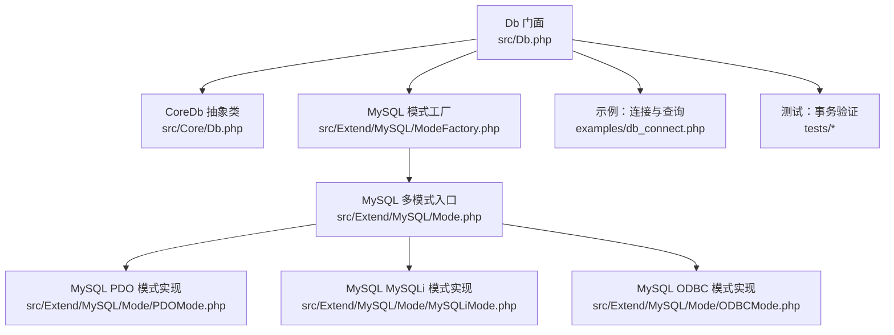
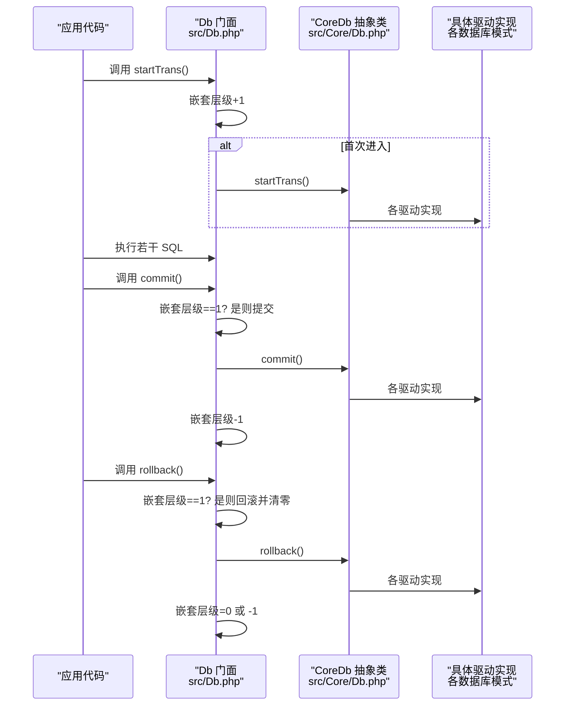
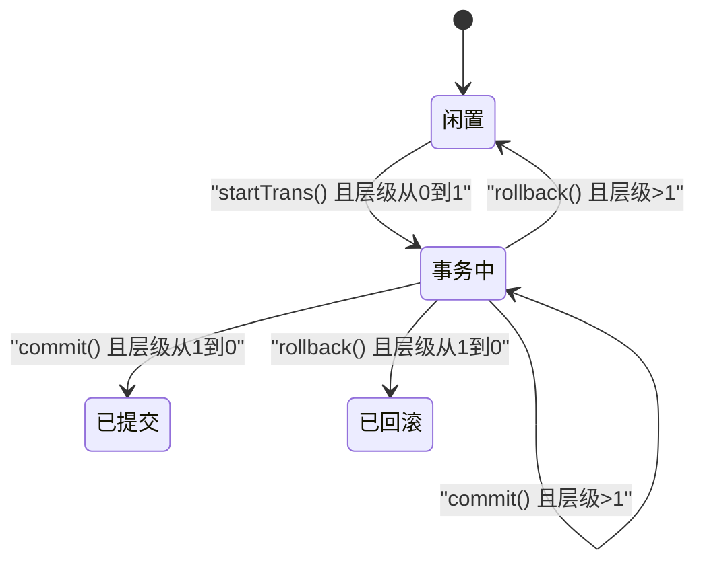
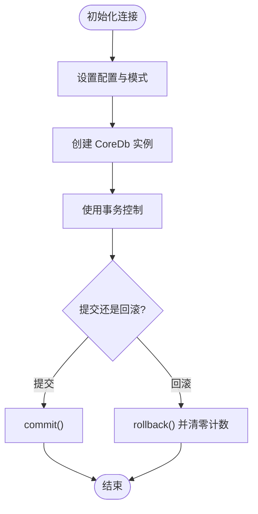
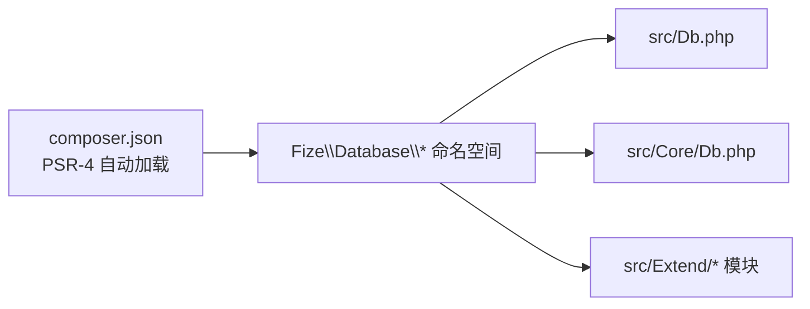

# 事务管理

<cite>
**本文引用的文件**
- [src/Db.php](file://src/Db.php)
- [src/Core/Db.php](file://src/Core/Db.php)
- [src/Extend/MySQL/ModeFactory.php](file://src/Extend/MySQL/ModeFactory.php)
- [src/Extend/MySQL/Mode.php](file://src/Extend/MySQL/Mode.php)
- [src/Extend/MySQL/Db.php](file://src/Extend/MySQL/Db.php)
- [examples/db_connect.php](file://examples/db_connect.php)
- [composer.json](file://composer.json)
- [tests/Extend/MySQL/Mode/TestPDOMode.php](file://tests/Extend/MySQL/Mode/TestPDOMode.php)
- [tests/Extend/SQLSRV/Mode/TestPDOMode.php](file://tests/Extend/SQLSRV/Mode/TestPDOMode.php)
- [tests/Extend/PgSQL/Mode/TestPgSQLMode.php](file://tests/Extend/PgSQL/Mode/TestPgSQLMode.php)
- [tests/Extend/SQLite/Mode/TestSQLite3Mode.php](file://tests/Extend/SQLite/Mode/TestSQLite3Mode.php)
- [tests/Extend/SQLite/Mode/TestPDOMode.php](file://tests/Extend/SQLite/Mode/TestPDOMode.php)
- [tests/Extend/Oracle/Mode/TestOCIMode.php](file://tests/Extend/Oracle/Mode/TestOCIMode.php)
</cite>

## 目录
1. [简介](#简介)
2. [项目结构](#项目结构)
3. [核心组件](#核心组件)
4. [架构概览](#架构概览)
5. [详细组件分析](#详细组件分析)
6. [依赖分析](#依赖分析)
7. [性能考虑](#性能考虑)
8. [故障排查指南](#故障排查指南)
9. [结论](#结论)
10. [附录](#附录)

## 简介
本章节系统性介绍 FizeDatabase 的事务管理能力，覆盖 startTrans()、commit()、rollback() 的使用方式与嵌套事务支持；解释事务状态管理与错误回滚机制；提供简单事务、复杂业务流程事务、嵌套事务处理的实践路径；并给出事务性能优化、死锁预防、错误处理与监控的最佳实践，以及与数据库连接的集成与生命周期管理。

## 项目结构
FizeDatabase 采用分层与多驱动模式设计：
- 入口与门面：Db 作为静态门面，负责连接创建、表选择、SQL 执行与事务控制（计数与委派）。
- 核心抽象：CoreDb 抽象类定义统一接口（query、execute、startTrans、commit、rollback 等），并提供通用查询构建与工具方法。
- 驱动扩展：Extend 下按数据库类型划分（MySQL、PgSQL、SQLite、SQLSRV、Oracle 等），每类提供 ModeFactory 与多种连接模式（PDO、MySQLi、ODBC）。
- 示例与测试：examples 展示基本连接与查询；tests 验证各驱动的事务行为（commit/rollback）。

图表来源
- [src/Db.php:1-141](file://src/Db.php#L1-L141)
- [src/Core/Db.php:1-200](file://src/Core/Db.php#L1-L200)
- [src/Extend/MySQL/ModeFactory.php:1-82](file://src/Extend/MySQL/ModeFactory.php#L1-L82)
- [src/Extend/MySQL/Mode.php:1-74](file://src/Extend/MySQL/Mode.php#L1-L74)
- [examples/db_connect.php:1-39](file://examples/db_connect.php#L1-L39)

章节来源
- [src/Db.php:1-141](file://src/Db.php#L1-L141)
- [src/Core/Db.php:1-200](file://src/Core/Db.php#L1-L200)
- [src/Extend/MySQL/ModeFactory.php:1-82](file://src/Extend/MySQL/ModeFactory.php#L1-L82)
- [src/Extend/MySQL/Mode.php:1-74](file://src/Extend/MySQL/Mode.php#L1-L74)
- [examples/db_connect.php:1-39](file://examples/db_connect.php#L1-L39)

## 核心组件
- 事务状态与计数
  - 门面层维护事务嵌套层级计数，确保只有最外层事务开启/提交/回滚时才真正调用底层驱动。
  - 计数归零策略：当回滚发生在最内层时，强制将计数归零，避免后续 commit 误触发。
- 事务三要素
  - startTrans()：递增计数，首次调用时委派给底层 CoreDb 实现。
  - commit()：仅在计数回到 1 时提交，随后递减计数。
  - rollback()：仅在计数回到 1 时回滚并归零计数，否则仅递减计数。
- 驱动一致性
  - CoreDb 抽象类声明了 startTrans、commit、rollback 的规范，具体数据库驱动需实现这些方法。
  - 测试覆盖表明主流驱动（MySQL、SQLSRV、PgSQL、SQLite、Oracle）均支持事务的开始、提交与回滚。

章节来源
- [src/Db.php:81-114](file://src/Db.php#L81-L114)
- [src/Core/Db.php:121-134](file://src/Core/Db.php#L121-L134)
- [tests/Extend/MySQL/Mode/TestPDOMode.php:92-128](file://tests/Extend/MySQL/Mode/TestPDOMode.php#L92-L128)
- [tests/Extend/SQLSRV/Mode/TestPDOMode.php:88-124](file://tests/Extend/SQLSRV/Mode/TestPDOMode.php#L88-L124)
- [tests/Extend/PgSQL/Mode/TestPgSQLMode.php:82-102](file://tests/Extend/PgSQL/Mode/TestPgSQLMode.php#L82-L102)
- [tests/Extend/SQLite/Mode/TestSQLite3Mode.php:104-121](file://tests/Extend/SQLite/Mode/TestSQLite3Mode.php#L104-L121)
- [tests/Extend/SQLite/Mode/TestPDOMode.php:104-121](file://tests/Extend/SQLite/Mode/TestPDOMode.php#L104-L121)
- [tests/Extend/Oracle/Mode/TestOCIMode.php:55-106](file://tests/Extend/Oracle/Mode/TestOCIMode.php#L55-L106)

## 架构概览
事务管理在门面层与驱动层之间的交互如下：

图表来源
- [src/Db.php:81-114](file://src/Db.php#L81-L114)
- [src/Core/Db.php:121-134](file://src/Core/Db.php#L121-L134)

## 详细组件分析

### 事务状态与嵌套控制
- 嵌套事务支持
  - 通过门面层的嵌套层级计数，实现“只在外层开启/提交/回滚”的语义，避免重复开启事务导致的异常。
  - 回滚时强制将计数归零，确保后续 commit 不会误触发。
- 状态机示意

图表来源
- [src/Db.php:81-114](file://src/Db.php#L81-L114)

章节来源
- [src/Db.php:81-114](file://src/Db.php#L81-L114)

### 事务生命周期与连接集成
- 连接创建
  - 通过 Db::__construct 或 Db::connect 指定数据库类型、配置与模式（PDO/MySQLi/ODBC），返回 CoreDb 实例。
  - 模式工厂根据配置创建具体驱动实例，并设置表前缀等属性。
- 生命周期
  - 事务在当前连接上下文中生效；同一连接内的多次 startTrans/commit/rollback 在门面层受控。
  - 建议在请求/任务边界明确开启与结束事务，避免长连接上的事务悬挂。

图表来源
- [src/Db.php:32-56](file://src/Db.php#L32-L56)
- [src/Extend/MySQL/ModeFactory.php:21-80](file://src/Extend/MySQL/ModeFactory.php#L21-L80)
- [examples/db_connect.php:14-38](file://examples/db_connect.php#L14-L38)

章节来源
- [src/Db.php:32-56](file://src/Db.php#L32-L56)
- [src/Extend/MySQL/ModeFactory.php:21-80](file://src/Extend/MySQL/ModeFactory.php#L21-L80)
- [examples/db_connect.php:14-38](file://examples/db_connect.php#L14-L38)

### 事务隔离级别
- 本仓库未提供显式的隔离级别设置接口。隔离级别的控制通常由底层驱动或数据库方言决定。
- 若需设置隔离级别，请参考对应驱动的文档或在事务开始前执行数据库特定的 SET 语句（例如 MySQL 的 SESSION 级别设置）。

章节来源
- [src/Core/Db.php:121-134](file://src/Core/Db.php#L121-L134)

### 错误回滚机制
- 回滚时机
  - 在最外层事务（层级计数回到 1）时执行回滚，并将计数归零，防止后续 commit 误触发。
- 异常处理建议
  - 将事务包裹在 try/catch 中，捕获业务异常后调用 rollback()，并在 finally 中确保计数不会泄漏。
  - 对于底层驱动抛出的异常，建议转换为业务可识别的异常类型，便于统一处理。

章节来源
- [src/Db.php:106-114](file://src/Db.php#L106-L114)

### 事务使用示例与最佳实践

- 简单事务
  - 场景：单条更新或插入后立即提交。
  - 步骤：startTrans() → 执行 SQL → commit()。
  - 参考测试：MySQL/PgSQL/SQLite/SQLSRV/Oracle 的事务提交与回滚测试。
  
  章节来源
  - [tests/Extend/MySQL/Mode/TestPDOMode.php:92-108](file://tests/Extend/MySQL/Mode/TestPDOMode.php#L92-L108)
  - [tests/Extend/PgSQL/Mode/TestPgSQLMode.php:82-87](file://tests/Extend/PgSQL/Mode/TestPgSQLMode.php#L82-L87)
  - [tests/Extend/SQLite/Mode/TestSQLite3Mode.php:104-115](file://tests/Extend/SQLite/Mode/TestSQLite3Mode.php#L104-L115)
  - [tests/Extend/SQLSRV/Mode/TestPDOMode.php:88-98](file://tests/Extend/SQLSRV/Mode/TestPDOMode.php#L88-L98)
  - [tests/Extend/Oracle/Mode/TestOCIMode.php:62-82](file://tests/Extend/Oracle/Mode/TestOCIMode.php#L62-L82)

- 复杂业务流程事务
  - 场景：多表写入、条件判断、分支处理。
  - 步骤：startTrans() → 逐步执行 SQL → 根据业务结果决定 commit() 或 rollback()。
  - 建议：将每个分支的 SQL 包裹在独立的 try/catch 中，失败即回滚，成功则继续。

- 嵌套事务处理
  - 场景：在已有事务中再次调用 startTrans()，内部事务结束后再 commit。
  - 行为：内部 startTrans() 仅增加层级计数；只有最外层 commit() 才真正提交；最内层 rollback() 会将计数归零并回滚。
  - 参考测试：各驱动的 startTrans/commit/rollback 组合验证。

  章节来源
  - [src/Db.php:81-114](file://src/Db.php#L81-L114)
  - [tests/Extend/MySQL/Mode/TestPDOMode.php:111-128](file://tests/Extend/MySQL/Mode/TestPDOMode.php#L111-L128)
  - [tests/Extend/SQLSRV/Mode/TestPDOMode.php:107-124](file://tests/Extend/SQLSRV/Mode/TestPDOMode.php#L107-L124)
  - [tests/Extend/PgSQL/Mode/TestPgSQLMode.php:90-102](file://tests/Extend/PgSQL/Mode/TestPgSQLMode.php#L90-L102)
  - [tests/Extend/SQLite/Mode/TestSQLite3Mode.php:104-121](file://tests/Extend/SQLite/Mode/TestSQLite3Mode.php#L104-L121)
  - [tests/Extend/Oracle/Mode/TestOCIMode.php:85-106](file://tests/Extend/Oracle/Mode/TestOCIMode.php#L85-L106)

## 依赖分析
- Composer 自动加载
  - PSR-4 映射 Fize\Database\* 到 src 目录，确保 Db 门面与 CoreDb 抽象类、各驱动类可被正确加载。
- 外部扩展建议
  - 根据目标数据库安装对应 PHP 扩展（PDO_*、mysqli、pgsql、sqlsrv、oci8 等），以启用相应模式。

图表来源
- [composer.json:11-18](file://composer.json#L11-L18)

章节来源
- [composer.json:11-18](file://composer.json#L11-L18)

## 性能考虑
- 减少事务范围
  - 将耗时的 I/O（文件、网络）移出事务块，缩短锁持有时间。
- 合理批量写入
  - 使用批量插入/更新减少往返次数，但注意内存与锁竞争。
- 避免长事务
  - 在请求边界及时提交或回滚，避免连接池中的事务悬挂。
- 读写分离与锁优化
  - 对热点表使用合适的索引，减少锁冲突；必要时使用 SELECT ... LOCK IN SHARE MODE 或排他锁（视驱动支持）。

## 故障排查指南
- 常见问题
  - 事务未生效：确认是否在最外层调用 commit()，中间层的 commit() 不会真正提交。
  - 回滚后仍可见变更：检查是否在错误的层级调用了 rollback()，或是否存在并发连接共享同一连接。
  - 死锁：调整访问顺序、缩小事务范围、重试策略。
- 排查步骤
  - 使用 CoreDb::getLastSql(real=true) 输出真实 SQL 与参数，核对事务边界。
  - 在测试环境中复现：参考各驱动的事务测试用例，定位问题出现在哪一层。

章节来源
- [src/Db.php:136-139](file://src/Db.php#L136-L139)
- [tests/Extend/MySQL/Mode/TestPDOMode.php:92-128](file://tests/Extend/MySQL/Mode/TestPDOMode.php#L92-L128)
- [tests/Extend/SQLSRV/Mode/TestPDOMode.php:88-124](file://tests/Extend/SQLSRV/Mode/TestPDOMode.php#L88-L124)
- [tests/Extend/PgSQL/Mode/TestPgSQLMode.php:82-102](file://tests/Extend/PgSQL/Mode/TestPgSQLMode.php#L82-L102)
- [tests/Extend/SQLite/Mode/TestSQLite3Mode.php:104-121](file://tests/Extend/SQLite/Mode/TestSQLite3Mode.php#L104-L121)
- [tests/Extend/SQLite/Mode/TestPDOMode.php:104-121](file://tests/Extend/SQLite/Mode/TestPDOMode.php#L104-L121)
- [tests/Extend/Oracle/Mode/TestOCIMode.php:55-106](file://tests/Extend/Oracle/Mode/TestOCIMode.php#L55-L106)

## 结论
FizeDatabase 的事务管理通过门面层的嵌套计数实现了稳健的嵌套事务支持，配合各驱动的统一抽象，保证了跨数据库的一致体验。结合本文提供的最佳实践与排错建议，可在不同数据库与业务场景中安全高效地使用事务。

## 附录
- 快速上手
  - 连接与查询：参考示例文件，设置默认连接或创建新连接。
  - 事务三步曲：startTrans() → 执行业务 → commit()/rollback()。
- 参考测试
  - 各数据库驱动的事务提交与回滚测试，可作为编写业务事务的模板。

章节来源
- [examples/db_connect.php:14-38](file://examples/db_connect.php#L14-L38)
- [tests/Extend/MySQL/Mode/TestPDOMode.php:92-128](file://tests/Extend/MySQL/Mode/TestPDOMode.php#L92-L128)
- [tests/Extend/SQLSRV/Mode/TestPDOMode.php:88-124](file://tests/Extend/SQLSRV/Mode/TestPDOMode.php#L88-L124)
- [tests/Extend/PgSQL/Mode/TestPgSQLMode.php:82-102](file://tests/Extend/PgSQL/Mode/TestPgSQLMode.php#L82-L102)
- [tests/Extend/SQLite/Mode/TestSQLite3Mode.php:104-121](file://tests/Extend/SQLite/Mode/TestSQLite3Mode.php#L104-L121)
- [tests/Extend/SQLite/Mode/TestPDOMode.php:104-121](file://tests/Extend/SQLite/Mode/TestPDOMode.php#L104-L121)
- [tests/Extend/Oracle/Mode/TestOCIMode.php:55-106](file://tests/Extend/Oracle/Mode/TestOCIMode.php#L55-L106)