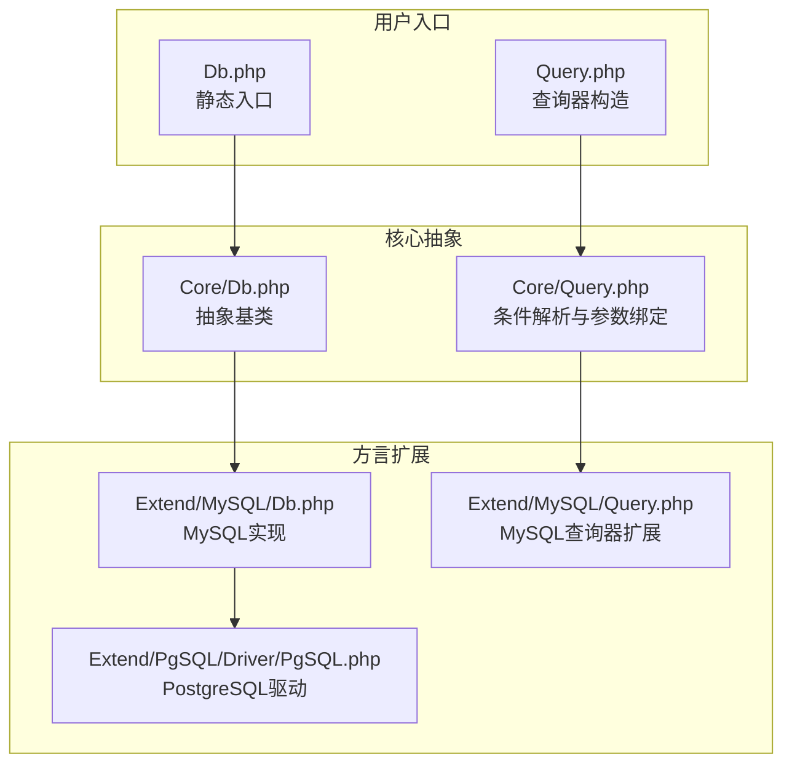
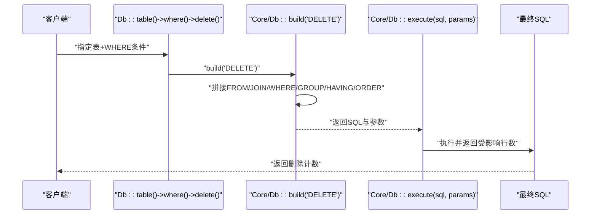
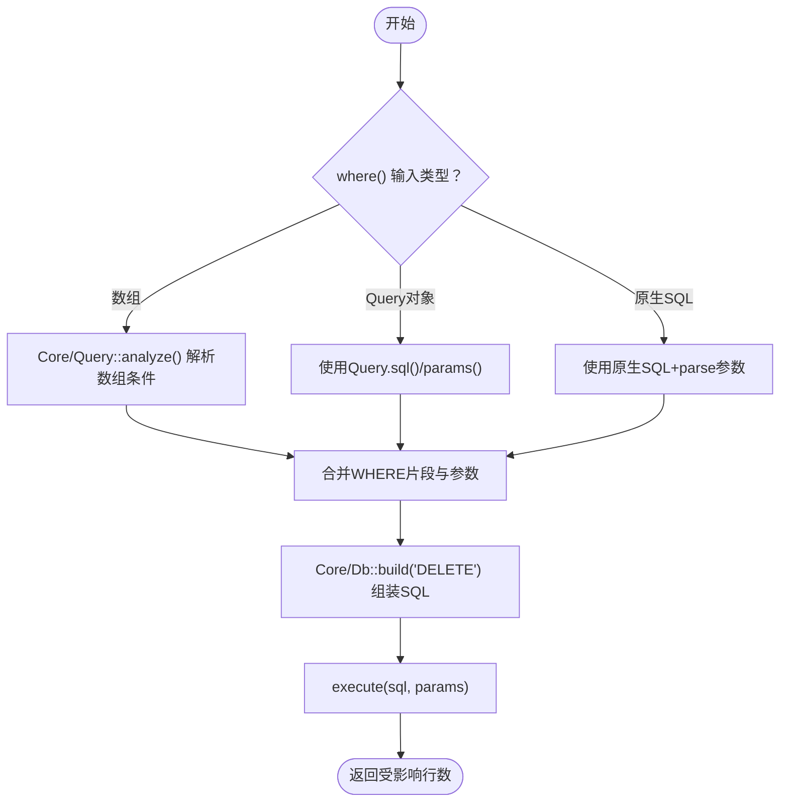
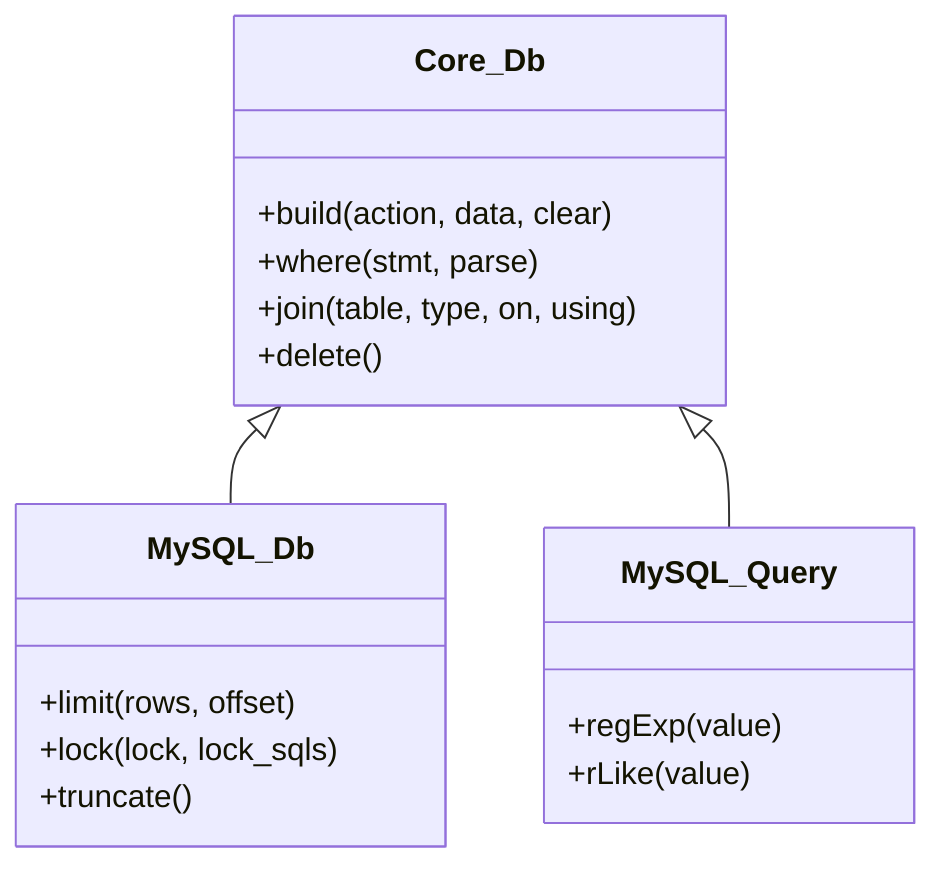
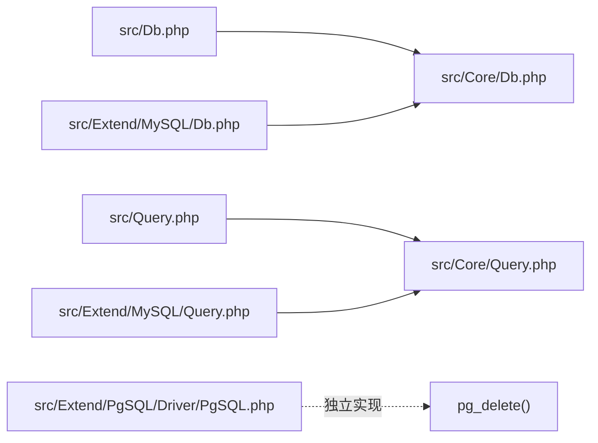

# 删除操作

<cite>
**本文引用的文件**
- [src/Core/Db.php](file://src/Core/Db.php)
- [src/Core/Query.php](file://src/Core/Query.php)
- [src/Query.php](file://src/Query.php)
- [src/Db.php](file://src/Db.php)
- [examples/db_delete.php](file://examples/db_delete.php)
- [src/Extend/MySQL/Db.php](file://src/Extend/MySQL/Db.php)
- [src/Extend/MySQL/Query.php](file://src/Extend/MySQL/Query.php)
- [src/Extend/PgSQL/Driver/PgSQL.php](file://src/Extend/PgSQL/Driver/PgSQL.php)
- [src/Core/Feature.php](file://src/Core/Feature.php)
- [src/Extend/Access/Feature.php](file://src/Extend/Access/Feature.php)
- [src/Extend/Oracle/Feature.php](file://src/Extend/Oracle/Feature.php)
</cite>

## 目录
1. [简介](#简介)
2. [项目结构](#项目结构)
3. [核心组件](#核心组件)
4. [架构总览](#架构总览)
5. [详细组件分析](#详细组件分析)
6. [依赖关系分析](#依赖关系分析)
7. [性能考量](#性能考量)
8. [故障排查指南](#故障排查指南)
9. [结论](#结论)
10. [附录](#附录)

## 简介
本章节系统阐述 FizeDatabase 的删除（DELETE）操作能力，覆盖以下关键点：
- delete() 方法的使用方式与返回值含义（受影响行数）
- 条件删除与批量删除的实现路径
- WHERE 条件的构建、参数绑定与预处理语句的安全使用
- 多表关联删除的实现思路与注意事项
- 数据保护、软删除、错误处理与性能优化最佳实践
- 与查询构建器的集成以及删除计数的获取

## 项目结构
围绕删除功能的关键目录与文件如下：
- 核心抽象层：Core/Db.php 提供 delete() 抽象与 SQL 组装
- 查询构建器：Core/Query.php 提供条件解析与参数绑定
- 适配器入口：Db.php 与 Query.php 提供面向用户的静态/链式接口
- 数据库方言扩展：MySQL/Db.php、MySQL/Query.php、PgSQL/Driver/PgSQL.php 等
- 字段/表名格式化：各 Feature trait 提供方言差异处理

**图示来源**
- [src/Db.php:1-141](file://src/Db.php#L1-L141)
- [src/Query.php:1-130](file://src/Query.php#L1-L130)
- [src/Core/Db.php:13-941](file://src/Core/Db.php#L13-L941)
- [src/Core/Query.php:1-621](file://src/Core/Query.php#L1-L621)
- [src/Extend/MySQL/Db.php:1-246](file://src/Extend/MySQL/Db.php#L1-L246)
- [src/Extend/MySQL/Query.php:1-91](file://src/Extend/MySQL/Query.php#L1-L91)
- [src/Extend/PgSQL/Driver/PgSQL.php:154-192](file://src/Extend/PgSQL/Driver/PgSQL.php#L154-L192)

**章节来源**
- [src/Db.php:1-141](file://src/Db.php#L1-L141)
- [src/Query.php:1-130](file://src/Query.php#L1-L130)
- [src/Core/Db.php:13-941](file://src/Core/Db.php#L13-L941)
- [src/Core/Query.php:1-621](file://src/Core/Query.php#L1-L621)

## 核心组件
- Core/Db::delete()：删除入口，负责组装 DELETE 语句并执行，返回受影响行数
- Core/Query：条件解析器，支持数组条件、表达式、IN/BETWEEN/LIKE/EXISTS 等，自动参数绑定
- Extend/MySQL/Db：继承 Core/Db，补充 LIMIT、LOCK、TRUNCATE 等方言特性
- Extend/MySQL/Query：继承 Core/Query，扩展 REGEXP/RLIKE/XOR 等 MySQL 特有语法
- Extend/PgSQL/Driver/PgSQL：提供 PostgreSQL 方言的 delete()（pg_delete）

**章节来源**
- [src/Core/Db.php:678-682](file://src/Core/Db.php#L678-L682)
- [src/Core/Query.php:1-621](file://src/Core/Query.php#L1-L621)
- [src/Extend/MySQL/Db.php:1-246](file://src/Extend/MySQL/Db.php#L1-L246)
- [src/Extend/MySQL/Query.php:1-91](file://src/Extend/MySQL/Query.php#L1-L91)
- [src/Extend/PgSQL/Driver/PgSQL.php:181-192](file://src/Extend/PgSQL/Driver/PgSQL.php#L181-L192)

## 架构总览
删除流程从用户入口开始，经由查询构建器解析 WHERE 条件，组装 DELETE 语句并执行，返回受影响行数。

**图示来源**
- [src/Db.php:124-127](file://src/Db.php#L124-L127)
- [src/Core/Db.php:335-359](file://src/Core/Db.php#L335-L359)
- [src/Core/Db.php:583-637](file://src/Core/Db.php#L583-L637)
- [src/Core/Db.php:678-682](file://src/Core/Db.php#L678-L682)

## 详细组件分析

### delete() 方法与返回值
- Core/Db::delete()：调用 build('DELETE') 组装 SQL，然后 execute() 执行，返回受影响行数
- 返回值可用于判断是否删除了目标记录，便于上层业务做二次校验或日志记录

**章节来源**
- [src/Core/Db.php:678-682](file://src/Core/Db.php#L678-L682)

### WHERE 条件构建与参数绑定
- 支持三种 where() 输入：
  - 数组条件：自动解析为 Query 对象，生成 SQL 片段与参数数组
  - Query 对象：直接复用其 sql() 与 params()
  - 原生 SQL 预处理语句：直接拼接，配合 parse 参数数组
- Core/Query::analyze() 支持多种条件类型（=、<>、>, >=、<、<=、BETWEEN、IN、LIKE、IS NULL/NOT NULL、EXISTS/NOT EXISTS、EXP 等），并自动处理参数绑定
- 参数绑定采用问号占位符，避免 SQL 注入风险

**图示来源**
- [src/Core/Db.php:335-359](file://src/Core/Db.php#L335-L359)
- [src/Core/Query.php:521-568](file://src/Core/Query.php#L521-L568)

**章节来源**
- [src/Core/Db.php:335-359](file://src/Core/Db.php#L335-L359)
- [src/Core/Query.php:1-621](file://src/Core/Query.php#L1-L621)

### 预处理语句与安全使用
- 占位符统一为问号（?），参数通过 params 数组绑定，避免字符串拼接引发注入
- Core/Db::getLastSql(real) 可输出最终 SQL（real=true）用于调试，但不建议直接执行

**章节来源**
- [src/Core/Db.php:199-206](file://src/Core/Db.php#L199-L206)
- [src/Core/Db.php:178-190](file://src/Core/Db.php#L178-L190)

### 多表关联删除
- Core/Db::build('DELETE') 会在 DELETE 语句后追加 JOIN、WHERE、GROUP、HAVING、ORDER 等子句
- 通过 join()/leftJoin()/rightJoin()/innerJoin() 等方法可实现多表关联
- 注意：不同数据库对 DELETE JOIN 的支持程度不同，需结合具体方言

**图示来源**
- [src/Core/Db.php:583-637](file://src/Core/Db.php#L583-L637)
- [src/Extend/MySQL/Db.php:1-246](file://src/Extend/MySQL/Db.php#L1-L246)
- [src/Extend/MySQL/Query.php:1-91](file://src/Extend/MySQL/Query.php#L1-L91)

**章节来源**
- [src/Core/Db.php:408-430](file://src/Core/Db.php#L408-L430)
- [src/Extend/MySQL/Db.php:36-65](file://src/Extend/MySQL/Db.php#L36-L65)

### 批量删除
- 通过 where() 指定范围条件（如 IN、BETWEEN、LIKE、EXISTS 等）即可实现批量删除
- Core/Query::in()、between()、like()、exists() 等方法均支持参数绑定，保证安全性

**章节来源**
- [src/Core/Query.php:295-338](file://src/Core/Query.php#L295-L338)
- [src/Core/Query.php:233-245](file://src/Core/Query.php#L233-L245)
- [src/Core/Query.php:346-358](file://src/Core/Query.php#L346-L358)
- [src/Core/Query.php:267-287](file://src/Core/Query.php#L267-L287)

### 示例与用法指引
- 简单删除：先 table() 指定表，再 where() 设置条件，最后 delete() 执行
- 条件删除：where() 支持数组、Query 对象或原生 SQL 预处理语句
- 多表关联删除：先 join() 等建立关联，再 delete()

示例参考：
- [examples/db_delete.php:1-18](file://examples/db_delete.php#L1-L18)

**章节来源**
- [examples/db_delete.php:1-18](file://examples/db_delete.php#L1-L18)

### 与查询构建器的集成
- Db::table('table')->where([...])->delete() 是最常见用法
- Query::and()/or()/qMerge() 可组合复杂条件，再传入 where()
- 分页/统计等查询能力可与删除配合使用（例如先统计再删除）

**章节来源**
- [src/Query.php:115-128](file://src/Query.php#L115-L128)
- [src/Query.php:85-108](file://src/Query.php#L85-L108)

### 删除计数的获取
- delete() 返回受影响行数，可用于断言或日志
- Core/Db::getLastSql(true) 可输出最终 SQL 用于审计与排错

**章节来源**
- [src/Core/Db.php:678-682](file://src/Core/Db.php#L678-L682)
- [src/Core/Db.php:199-206](file://src/Core/Db.php#L199-L206)

## 依赖关系分析
- 用户入口 Db.php 与 Query.php 依赖 Core 层
- MySQL/Db.php 与 MySQL/Query.php 继承 Core/Db 与 Core/Query，扩展方言特性
- PgSQL/Driver/PgSQL.php 提供独立的 delete() 实现（pg_delete），与 Core/Db 的 delete() 并行存在

**图示来源**
- [src/Db.php:1-141](file://src/Db.php#L1-L141)
- [src/Query.php:1-130](file://src/Query.php#L1-L130)
- [src/Core/Db.php:13-941](file://src/Core/Db.php#L13-L941)
- [src/Core/Query.php:1-621](file://src/Core/Query.php#L1-L621)
- [src/Extend/PgSQL/Driver/PgSQL.php:181-192](file://src/Extend/PgSQL/Driver/PgSQL.php#L181-L192)

**章节来源**
- [src/Db.php:1-141](file://src/Db.php#L1-L141)
- [src/Query.php:1-130](file://src/Query.php#L1-L130)
- [src/Core/Db.php:13-941](file://src/Core/Db.php#L13-L941)
- [src/Core/Query.php:1-621](file://src/Core/Query.php#L1-L621)

## 性能考量
- 使用参数绑定（?）与预处理语句，避免重复编译与注入风险
- WHERE 条件尽量使用索引字段，减少全表扫描
- 批量删除优先使用范围条件（IN/BETWEEN/LIKE/EXISTS），避免逐条删除
- 多表关联删除时，合理使用 JOIN 与 WHERE，避免笛卡尔积
- 对于超大数据量删除，建议分批执行并配合事务控制

## 故障排查指南
- 删除计数为 0：检查 where() 条件是否正确；可通过 Core/Db::getLastSql(true) 输出最终 SQL 核对
- SQL 注入风险：确保始终使用参数绑定，不要拼接字符串
- 方言差异：不同数据库对 DELETE JOIN 支持不同，必要时改写为子查询或分步删除
- PostgreSQL 删除：若使用 PgSQL 方言，可考虑使用 PgSQL::delete()（pg_delete），但需评估兼容性

**章节来源**
- [src/Core/Db.php:199-206](file://src/Core/Db.php#L199-L206)
- [src/Extend/PgSQL/Driver/PgSQL.php:181-192](file://src/Extend/PgSQL/Driver/PgSQL.php#L181-L192)

## 结论
FizeDatabase 的删除操作以 Core/Db::delete() 为核心，配合 Core/Query 的强大条件解析与参数绑定机制，既保证了安全性，又提供了灵活的 WHERE 构建能力。通过与查询构建器的深度集成，可轻松实现简单删除、条件删除与批量删除；在多表关联场景下，结合 JOIN 与 WHERE 可满足复杂删除需求。建议在生产环境中严格使用参数绑定、合理设计索引、分批处理大批量删除，并根据数据库方言选择合适的删除策略。

## 附录
- 字段/表名格式化：各方言通过 Feature trait 提供 formatTable/formatField，确保标识符在不同数据库中的正确性
- 示例文件：examples/db_delete.php 展示了基本删除流程与 SQL 输出

**章节来源**
- [src/Core/Feature.php:1-32](file://src/Core/Feature.php#L1-L32)
- [src/Extend/Access/Feature.php:1-50](file://src/Extend/Access/Feature.php#L1-L50)
- [src/Extend/Oracle/Feature.php:1-46](file://src/Extend/Oracle/Feature.php#L1-L46)
- [examples/db_delete.php:1-18](file://examples/db_delete.php#L1-L18)