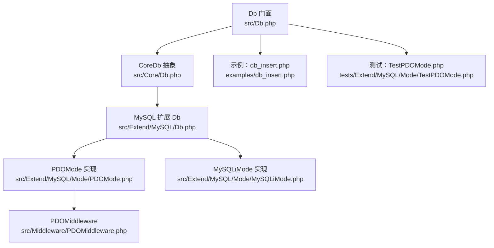
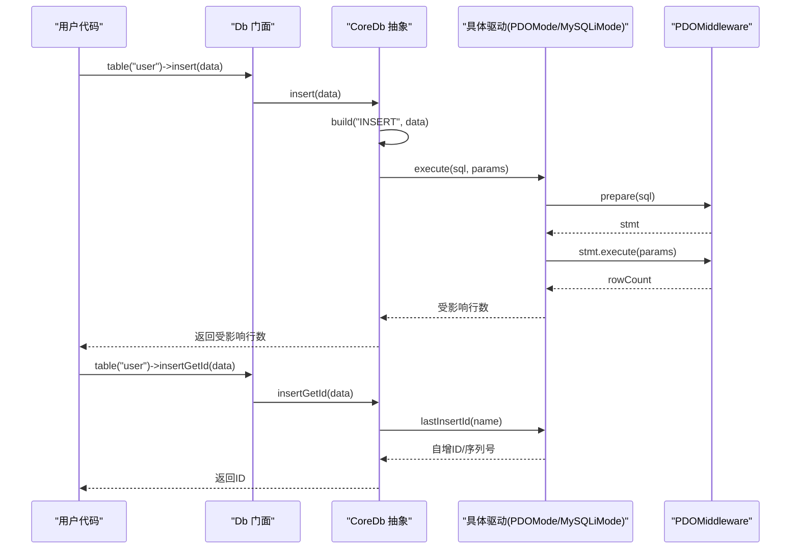
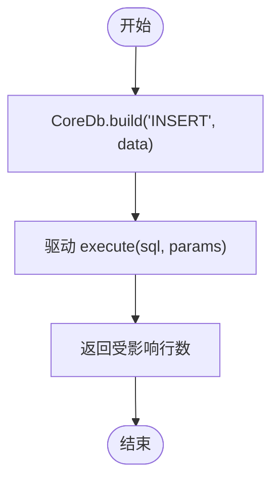
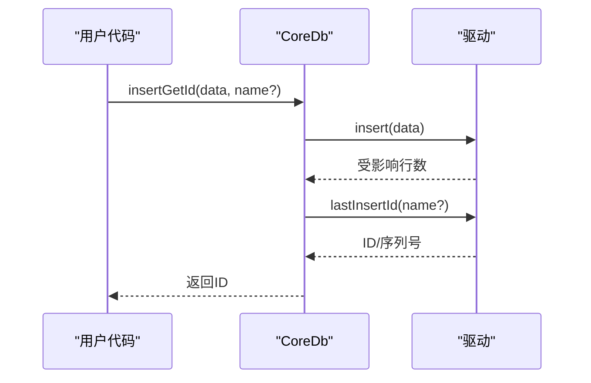
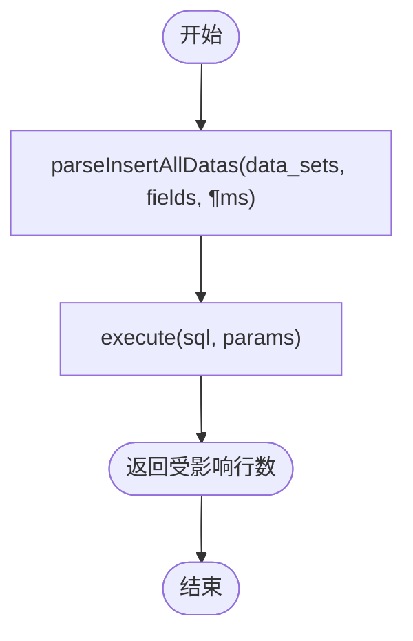
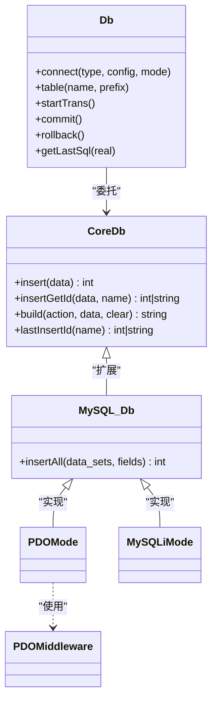

# 插入操作

<cite>
**本文引用的文件**
- [src/Db.php](file://src/Db.php)
- [src/Core/Db.php](file://src/Core/Db.php)
- [src/Extend/MySQL/Db.php](file://src/Extend/MySQL/Db.php)
- [src/Extend/MySQL/Mode/PDOMode.php](file://src/Extend/MySQL/Mode/PDOMode.php)
- [src/Extend/MySQL/Mode/MySQLiMode.php](file://src/Extend/MySQL/Mode/MySQLiMode.php)
- [src/Middleware/PDOMiddleware.php](file://src/Middleware/PDOMiddleware.php)
- [examples/db_insert.php](file://examples/db_insert.php)
- [tests/Extend/MySQL/Mode/TestPDOMode.php](file://tests/Extend/MySQL/Mode/TestPDOMode.php)
- [tests/Extend/PgSQL/Driver/TestPgSQL.php](file://tests/Extend/PgSQL/Driver/TestPgSQL.php)
- [src/Extend/Oracle/Mode/OCIMode.php](file://src/Extend/Oracle/Mode/OCIMode.php)
- [src/Extend/PgSQL/Driver/PgSQL.php](file://src/Extend/PgSQL/Driver/PgSQL.php)
</cite>

## 目录
1. [简介](#简介)
2. [项目结构](#项目结构)
3. [核心组件](#核心组件)
4. [架构总览](#架构总览)
5. [详细组件分析](#详细组件分析)
6. [依赖关系分析](#依赖关系分析)
7. [性能考量](#性能考量)
8. [故障排查指南](#故障排查指南)
9. [结论](#结论)
10. [附录](#附录)

## 简介
本文系统性介绍 FizeDatabase 的插入操作能力，覆盖单条插入与批量插入、数据格式化与参数绑定、预处理语句的安全使用、返回自增ID与序列号、与数据库事务的集成以及最佳实践。内容面向不同技术背景的读者，既提供高层概览，也给出代码级图示与来源定位。

## 项目结构
围绕插入功能的关键目录与文件如下：
- 入口与门面：Db（静态门面，负责连接与事务）
- 核心抽象：Core/Db（统一的SQL构建、执行、lastInsertId接口）
- MySQL 扩展：Extend/MySQL/Db（扩展构建INSERT/REPLACE/TRUNCATE与insertAll）
- MySQL 驱动实现：PDOMode、MySQLiMode（PDO与MySQLi两种底层实现）
- 中间件：PDOMiddleware（PDO通用执行、事务、lastInsertId封装）
- 示例与测试：examples/db_insert.php、TestPDOMode.php、TestPgSQL.php 等

图表来源
- [src/Db.php:1-141](file://src/Db.php#L1-L141)
- [src/Core/Db.php:1-800](file://src/Core/Db.php#L1-L800)
- [src/Extend/MySQL/Db.php:1-246](file://src/Extend/MySQL/Db.php#L1-L246)
- [src/Extend/MySQL/Mode/PDOMode.php:1-53](file://src/Extend/MySQL/Mode/PDOMode.php#L1-L53)
- [src/Extend/MySQL/Mode/MySQLiMode.php:1-251](file://src/Extend/MySQL/Mode/MySQLiMode.php#L1-L251)
- [src/Middleware/PDOMiddleware.php:1-129](file://src/Middleware/PDOMiddleware.php#L1-L129)
- [examples/db_insert.php:1-29](file://examples/db_insert.php#L1-L29)
- [tests/Extend/MySQL/Mode/TestPDOMode.php:1-130](file://tests/Extend/MySQL/Mode/TestPDOMode.php#L1-L130)

章节来源
- [src/Db.php:1-141](file://src/Db.php#L1-L141)
- [src/Core/Db.php:1-800](file://src/Core/Db.php#L1-L800)

## 核心组件
- Db 门面：提供静态方法创建连接、执行SQL、管理事务、选择表、获取最后SQL等。
- CoreDb 抽象：定义 insert()/insertGetId()、构建 INSERT/UPDATE/DELETE/SELECT 的SQL骨架、参数绑定、lastInsertId 接口。
- MySQL 扩展 Db：在 CoreDb 基础上增加 insertAll() 批量插入、REPLACE/ TRUNCATE 支持。
- PDOMode/MySQLiMode：具体驱动实现，分别通过 PDO 与 MySQLi 执行SQL、绑定参数、返回影响行数、lastInsertId。
- PDOMiddleware：封装 PDO 的 prepare/execute、事务控制、lastInsertId。

章节来源
- [src/Db.php:1-141](file://src/Db.php#L1-L141)
- [src/Core/Db.php:640-660](file://src/Core/Db.php#L640-L660)
- [src/Extend/MySQL/Db.php:237-244](file://src/Extend/MySQL/Db.php#L237-L244)
- [src/Middleware/PDOMiddleware.php:51-127](file://src/Middleware/PDOMiddleware.php#L51-L127)

## 架构总览
插入流程从门面 Db 出发，经 CoreDb 抽象完成SQL构建与执行，再由具体驱动实现执行与返回自增ID。

图表来源
- [src/Db.php:124-127](file://src/Db.php#L124-L127)
- [src/Core/Db.php:644-660](file://src/Core/Db.php#L644-L660)
- [src/Extend/MySQL/Db.php:237-244](file://src/Extend/MySQL/Db.php#L237-L244)
- [src/Middleware/PDOMiddleware.php:80-93](file://src/Middleware/PDOMiddleware.php#L80-L93)

## 详细组件分析

### 单条插入 insert()
- 功能：将键值对映射为 INSERT 语句，自动参数化，返回受影响行数。
- 关键点：
  - 通过 CoreDb::build("INSERT", data) 组装 SQL 与参数。
  - 通过驱动 execute(sql, params) 执行并返回影响行数。
- 使用方式（示例路径）：
  - [examples/db_insert.php:20](file://examples/db_insert.php#L20)
  - [tests/Extend/MySQL/Mode/TestPDOMode.php:34](file://tests/Extend/MySQL/Mode/TestPDOMode.php#L34)

图表来源
- [src/Core/Db.php:583-648](file://src/Core/Db.php#L583-L648)
- [src/Extend/MySQL/Db.php:237-244](file://src/Extend/MySQL/Db.php#L237-L244)

章节来源
- [src/Core/Db.php:640-648](file://src/Core/Db.php#L640-L648)
- [examples/db_insert.php:20](file://examples/db_insert.php#L20)
- [tests/Extend/MySQL/Mode/TestPDOMode.php:34](file://tests/Extend/MySQL/Mode/TestPDOMode.php#L34)

### 返回自增ID的插入 insertGetId()
- 功能：先执行插入，再调用 lastInsertId() 获取自增ID或序列号。
- 注意：
  - 不同数据库/驱动对 lastInsertId 的行为不同，需传入序列名（如 Oracle 必须指定）。
- 使用方式（示例路径）：
  - [examples/db_insert.php:27](file://examples/db_insert.php#L27)
  - [tests/Extend/MySQL/Mode/TestPDOMode.php:37](file://tests/Extend/MySQL/Mode/TestPDOMode.php#L37)
  - [src/Extend/Oracle/Mode/OCIMode.php:146-153](file://src/Extend/Oracle/Mode/OCIMode.php#L146-L153)

图表来源
- [src/Core/Db.php:656-660](file://src/Core/Db.php#L656-L660)
- [src/Extend/Oracle/Mode/OCIMode.php:146-153](file://src/Extend/Oracle/Mode/OCIMode.php#L146-L153)

章节来源
- [src/Core/Db.php:656-660](file://src/Core/Db.php#L656-L660)
- [examples/db_insert.php:27](file://examples/db_insert.php#L27)
- [tests/Extend/MySQL/Mode/TestPDOMode.php:37](file://tests/Extend/MySQL/Mode/TestPDOMode.php#L37)

### 批量插入 insertAll()
- 功能：一次 INSERT 多行，减少网络往返，提高吞吐。
- 关键点：
  - 通过 MySQL 扩展 Db::parseInsertAllDatas 组装字段与多组值占位。
  - 参数按序绑定，返回受影响行数。
- 使用方式（示例路径）：
  - [src/Extend/MySQL/Db.php:237-244](file://src/Extend/MySQL/Db.php#L237-L244)

图表来源
- [src/Extend/MySQL/Db.php:212-244](file://src/Extend/MySQL/Db.php#L212-L244)

章节来源
- [src/Extend/MySQL/Db.php:206-244](file://src/Extend/MySQL/Db.php#L206-L244)

### 数据格式化与参数绑定
- 字段与表名格式化：由 Feature trait 的 formatField/formatTable 提供（默认透传，可在具体驱动中覆写）。
- 值绑定策略：
  - INSERT/UPDATE 数据解析时，将每个值作为占位符 "?" 并追加到参数数组，确保预处理绑定。
  - MySQLi 驱动在执行时根据 PHP 值类型推断 bind_param 的类型标记串，保证类型安全。
- 安全性：
  - 仅通过占位符绑定，避免拼接导致的注入风险。
  - 日志输出使用安全化函数（仅用于调试，不建议直接执行）。

章节来源
- [src/Core/Db.php:506-520](file://src/Core/Db.php#L506-L520)
- [src/Core/Db.php:528-543](file://src/Core/Db.php#L528-L543)
- [src/Core/Db.php:160-170](file://src/Core/Db.php#L160-L170)
- [src/Extend/MySQL/Mode/MySQLiMode.php:123-202](file://src/Extend/MySQL/Mode/MySQLiMode.php#L123-L202)

### 预处理语句与参数绑定
- PDO 实现：prepare + execute，参数数组直接绑定。
- MySQLi 实现：prepare 后根据值类型动态构造类型标记串并绑定。
- 通用流程：构建 SQL -> 绑定参数 -> 执行 -> 返回影响行数。

章节来源
- [src/Middleware/PDOMiddleware.php:51-93](file://src/Middleware/PDOMiddleware.php#L51-L93)
- [src/Extend/MySQL/Mode/MySQLiMode.php:115-215](file://src/Extend/MySQL/Mode/MySQLiMode.php#L115-L215)

### 与数据库事务的集成
- 门面 Db 提供 startTrans/commit/rollback，支持嵌套计数。
- 驱动层通过 PDO/MySQLi 的事务 API 实现提交与回滚。
- 建议：批量插入或多表联动时，使用事务包裹，失败回滚，成功提交。

章节来源
- [src/Db.php:84-114](file://src/Db.php#L84-L114)
- [src/Middleware/PDOMiddleware.php:98-117](file://src/Middleware/PDOMiddleware.php#L98-L117)
- [tests/Extend/MySQL/Mode/TestPDOMode.php:84-128](file://tests/Extend/MySQL/Mode/TestPDOMode.php#L84-L128)

### lastInsertId() 的使用
- PDO：直接调用 PDO::lastInsertId(name)。
- MySQLi：在 INSERT/REPLACE 后记录 stmt->insert_id。
- Oracle：必须显式传入序列名，通过查询序列当前值返回。
- PostgreSQL：可通过驱动层的 insert 方法或查询 lastOID 等方式获取（见 PgSQL 驱动）。

章节来源
- [src/Middleware/PDOMiddleware.php:124-127](file://src/Middleware/PDOMiddleware.php#L124-L127)
- [src/Extend/MySQL/Mode/MySQLiMode.php:209-211](file://src/Extend/MySQL/Mode/MySQLiMode.php#L209-L211)
- [src/Extend/Oracle/Mode/OCIMode.php:146-153](file://src/Extend/Oracle/Mode/OCIMode.php#L146-L153)
- [src/Extend/PgSQL/Driver/PgSQL.php:318-321](file://src/Extend/PgSQL/Driver/PgSQL.php#L318-L321)

### 各数据库/驱动的插入差异
- MySQL（PDO/MySQLi）：支持 insert()/insertGetId()/insertAll()；lastInsertId 由驱动提供。
- Oracle：insertGetId 必须传入序列名；lastInsertId 通过查询序列当前值。
- PostgreSQL：可使用驱动层的 insert 方法，或通过查询 lastOID 等方式获取。

章节来源
- [src/Extend/MySQL/Db.php:237-244](file://src/Extend/MySQL/Db.php#L237-L244)
- [src/Extend/Oracle/Mode/OCIMode.php:146-153](file://src/Extend/Oracle/Mode/OCIMode.php#L146-L153)
- [src/Extend/PgSQL/Driver/PgSQL.php:318-321](file://src/Extend/PgSQL/Driver/PgSQL.php#L318-L321)

## 依赖关系分析
- Db 门面依赖具体驱动工厂（通过类型与模式创建），并将请求转发至 CoreDb。
- CoreDb 抽象定义统一接口，具体驱动实现各自 execute/query/lastInsertId。
- PDOMiddleware 为 PDO 驱动提供统一的执行与事务封装。

图表来源
- [src/Db.php:32-56](file://src/Db.php#L32-L56)
- [src/Core/Db.php:644-660](file://src/Core/Db.php#L644-L660)
- [src/Extend/MySQL/Db.php:237-244](file://src/Extend/MySQL/Db.php#L237-L244)
- [src/Extend/MySQL/Mode/PDOMode.php:14-53](file://src/Extend/MySQL/Mode/PDOMode.php#L14-L53)
- [src/Extend/MySQL/Mode/MySQLiMode.php:14-251](file://src/Extend/MySQL/Mode/MySQLiMode.php#L14-L251)
- [src/Middleware/PDOMiddleware.php:12-129](file://src/Middleware/PDOMiddleware.php#L12-L129)

章节来源
- [src/Db.php:1-141](file://src/Db.php#L1-L141)
- [src/Core/Db.php:1-800](file://src/Core/Db.php#L1-L800)

## 性能考量
- 使用参数绑定与预处理语句，避免字符串拼接带来的性能与安全问题。
- 批量插入优先使用 insertAll()，减少网络往返与SQL解析开销。
- 在高并发场景下，合理使用事务，避免长事务占用资源。
- 对于只读查询，可利用 CoreDb 的查询缓存机制（select/cached）降低重复查询成本（注意：插入不适用此缓存）。

## 故障排查指南
- 插入失败或异常：
  - 检查参数绑定顺序与类型，确保与占位符一一对应。
  - 查看最后真实SQL（getDb()->getLastSql(true)）辅助定位。
  - 捕获并记录异常信息，结合 SQL 与参数定位问题。
- 自增ID/序列号异常：
  - 确认数据库表是否具备自增主键或序列。
  - Oracle 必须传入序列名；PostgreSQL 可通过驱动层 insert 或查询 lastOID。
- 事务问题：
  - 确认嵌套事务计数正确，避免提前提交或回滚。
  - 在测试中验证 commit/rollback 的行为。

章节来源
- [src/Core/Db.php:199-206](file://src/Core/Db.php#L199-L206)
- [src/Middleware/PDOMiddleware.php:69-92](file://src/Middleware/PDOMiddleware.php#L69-L92)
- [tests/Extend/MySQL/Mode/TestPDOMode.php:84-128](file://tests/Extend/MySQL/Mode/TestPDOMode.php#L84-L128)

## 结论
FizeDatabase 的插入操作以 CoreDb 抽象为核心，统一了 INSERT/REPLACE/TRUNCATE 与批量插入的构建与执行；通过 PDO/MySQLi 等驱动实现参数绑定、事务与自增ID/序列号的获取。配合门面 Db 的连接与事务管理，可满足从简单单条插入到复杂批量插入与跨表事务的多种场景。建议在生产环境遵循参数绑定、事务封装与性能优化的最佳实践，确保安全性与稳定性。

## 附录
- 示例与测试参考：
  - 单条插入与自增ID：[examples/db_insert.php:20-28](file://examples/db_insert.php#L20-L28)
  - 批量插入与事务：[tests/Extend/MySQL/Mode/TestPDOMode.php:84-128](file://tests/Extend/MySQL/Mode/TestPDOMode.php#L84-L128)
  - PostgreSQL 插入：[tests/Extend/PgSQL/Driver/TestPgSQL.php:417-428](file://tests/Extend/PgSQL/Driver/TestPgSQL.php#L417-L428)