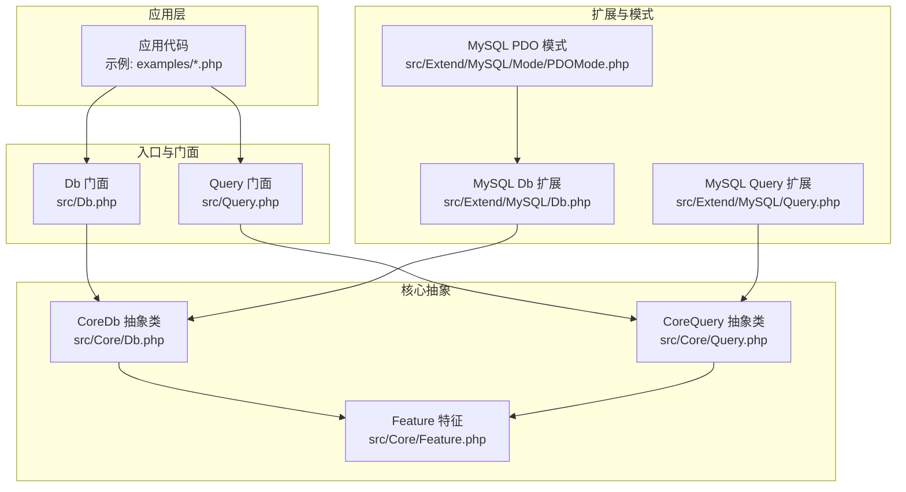
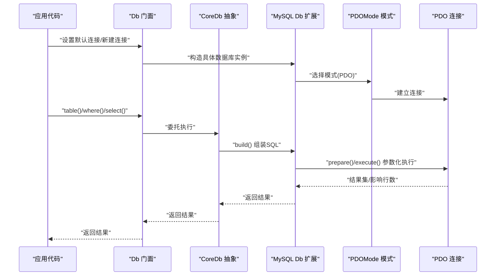
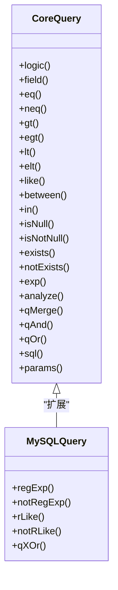
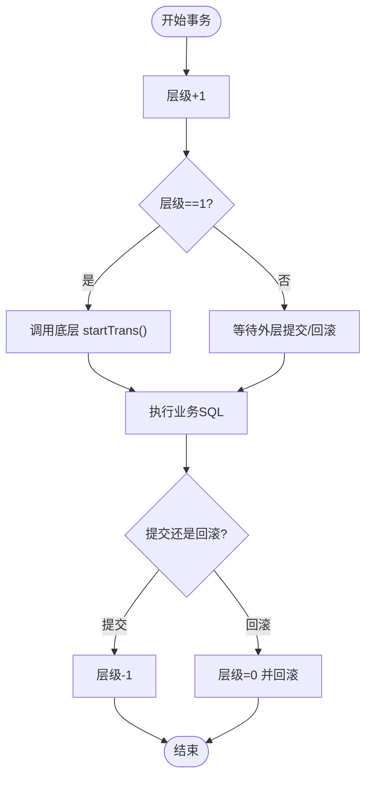
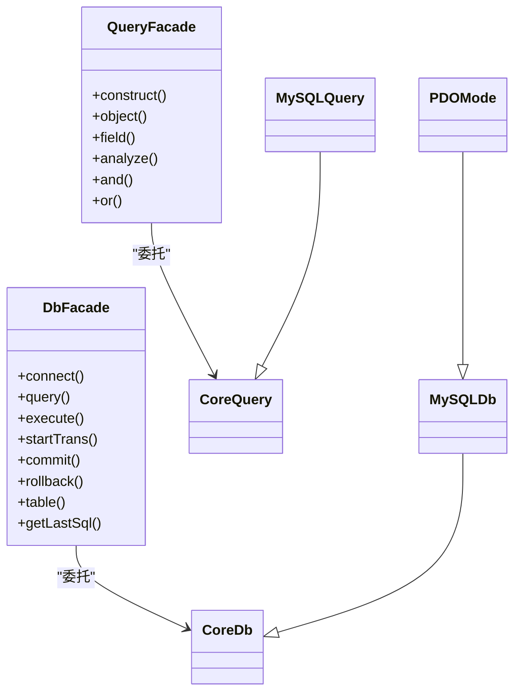

# 数据操作

<cite>
**本文引用的文件**
- [src/Db.php](file://src/Db.php)
- [src/Query.php](file://src/Query.php)
- [src/Core/Db.php](file://src/Core/Db.php)
- [src/Core/Query.php](file://src/Core/Query.php)
- [src/Core/Feature.php](file://src/Core/Feature.php)
- [src/Extend/MySQL/Db.php](file://src/Extend/MySQL/Db.php)
- [src/Extend/MySQL/Query.php](file://src/Extend/MySQL/Query.php)
- [src/Extend/MySQL/Mode/PDOMode.php](file://src/Extend/MySQL/Mode/PDOMode.php)
- [examples/db_connect.php](file://examples/db_connect.php)
- [examples/db_insert.php](file://examples/db_insert.php)
- [examples/db_select.php](file://examples/db_select.php)
- [examples/db_update.php](file://examples/db_update.php)
- [examples/db_delete.php](file://examples/db_delete.php)
- [examples/db_paginate.php](file://examples/db_paginate.php)
</cite>

## 目录
1. [简介](#简介)
2. [项目结构](#项目结构)
3. [核心组件](#核心组件)
4. [架构总览](#架构总览)
5. [详细组件分析](#详细组件分析)
6. [依赖关系分析](#依赖关系分析)
7. [性能考量](#性能考量)
8. [故障排查指南](#故障排查指南)
9. [结论](#结论)
10. [附录](#附录)

## 简介
本章节面向使用者与开发者，系统化介绍 FizeDatabase 的数据操作 API，覆盖 CRUD（创建、读取、更新、删除）的实现方式与最佳实践，涵盖批量操作、事务处理、数据验证与安全绑定、参数化查询、预处理语句、与数据库事务的集成以及错误处理机制。文档同时提供从简单到复杂的实际操作场景与示例路径，帮助快速落地。

## 项目结构
FizeDatabase 采用“核心抽象 + 驱动扩展 + 查询器 + 中间件”的分层设计：
- 核心层：定义通用的数据库抽象能力与查询器基类，屏蔽具体驱动差异。
- 扩展层：针对不同数据库类型（如 MySQL、PgSQL、Oracle、SQLSRV、Access、SQLite）提供适配实现，并在扩展层内进一步细分模式（PDO、ODBC、MySQLi 等）。
- 查询器：提供链式条件构建与参数绑定，支持数组化条件解析与多逻辑组合。
- 中间件：封装底层驱动交互细节（如 PDO），统一 query/execute 接口。

图表来源
- [src/Db.php:1-141](file://src/Db.php#L1-L141)
- [src/Query.php:1-130](file://src/Query.php#L1-L130)
- [src/Core/Db.php:1-800](file://src/Core/Db.php#L1-L800)
- [src/Core/Query.php:1-621](file://src/Core/Query.php#L1-L621)
- [src/Core/Feature.php:1-33](file://src/Core/Feature.php#L1-L33)
- [src/Extend/MySQL/Db.php:1-246](file://src/Extend/MySQL/Db.php#L1-L246)
- [src/Extend/MySQL/Query.php:1-91](file://src/Extend/MySQL/Query.php#L1-L91)
- [src/Extend/MySQL/Mode/PDOMode.php:1-53](file://src/Extend/MySQL/Mode/PDOMode.php#L1-L53)

章节来源
- [src/Db.php:1-141](file://src/Db.php#L1-L141)
- [src/Query.php:1-130](file://src/Query.php#L1-L130)
- [src/Core/Db.php:1-800](file://src/Core/Db.php#L1-L800)
- [src/Core/Query.php:1-621](file://src/Core/Query.php#L1-L621)
- [src/Core/Feature.php:1-33](file://src/Core/Feature.php#L1-L33)
- [src/Extend/MySQL/Db.php:1-246](file://src/Extend/MySQL/Db.php#L1-L246)
- [src/Extend/MySQL/Query.php:1-91](file://src/Extend/MySQL/Query.php#L1-L91)
- [src/Extend/MySQL/Mode/PDOMode.php:1-53](file://src/Extend/MySQL/Mode/PDOMode.php#L1-L53)

## 核心组件
- Db 门面与 CoreDb 抽象：提供静态入口与实例化能力，封装 CRUD、事务、分页、查询缓存、SQL 日志等通用能力；具体数据库类型通过扩展类实现。
- Query 门面与 CoreQuery 抽象：提供链式条件构建、数组条件解析、逻辑组合（AND/OR/XOR）、表达式与函数条件、IN/LIKE/BETWEEN/EXISTS 等丰富语法。
- Feature 特征：提供表名与字段名格式化钩子，便于扩展层按需实现差异化转义或标识符包裹策略。
- 扩展与模式：以 MySQL 为例，Db/Query 扩展在核心之上增加 LIMIT/LOCK/REPLACE/TRUNCATE/Paginate 等 MySQL 特性；PDOMode 通过中间件封装 PDO 连接与生命周期。

章节来源
- [src/Db.php:1-141](file://src/Db.php#L1-L141)
- [src/Core/Db.php:1-800](file://src/Core/Db.php#L1-L800)
- [src/Core/Query.php:1-621](file://src/Core/Query.php#L1-L621)
- [src/Core/Feature.php:1-33](file://src/Core/Feature.php#L1-L33)
- [src/Extend/MySQL/Db.php:1-246](file://src/Extend/MySQL/Db.php#L1-L246)
- [src/Extend/MySQL/Query.php:1-91](file://src/Extend/MySQL/Query.php#L1-L91)

## 架构总览
下图展示从应用到数据库的调用链路与关键职责：

图表来源
- [src/Db.php:1-141](file://src/Db.php#L1-L141)
- [src/Extend/MySQL/Db.php:1-246](file://src/Extend/MySQL/Db.php#L1-L246)
- [src/Extend/MySQL/Mode/PDOMode.php:1-53](file://src/Extend/MySQL/Mode/PDOMode.php#L1-L53)

## 详细组件分析

### CRUD 基础 API
- 创建（插入）
  - 单条插入：Db::table('table')->insert([...]) 返回受影响行数。
  - 插入并返回自增 ID：Db::table('table')->insertGetId([...])。
  - 批量插入：MySQL 扩展提供 insertAll([...], fields?)，支持多值一次提交。
- 读取（查询）
  - 列表查询：Db::table('table')->where([...])->limit(n)->select()。
  - 单条查询：find()/findOrNull()，前者未找到抛异常，后者返回 null。
  - 单值查询：value('field')，支持默认值与强制数字转换。
  - 某列数组：column('field')。
  - 计数：count('*'|'field')。
  - 分页：MySQL 扩展提供 paginate(page, size)，返回 [总数, 结果集, 总页数]。
- 更新：Db::table('table')->where([...])->update([...])，支持原样 SQL 表达式写入。
- 删除：Db::table('table')->where([...])->delete()。

章节来源
- [src/Core/Db.php:644-800](file://src/Core/Db.php#L644-L800)
- [src/Extend/MySQL/Db.php:187-244](file://src/Extend/MySQL/Db.php#L187-L244)

### 查询器与条件构建
- 链式条件：field()/eq()/neq()/gt()/egt()/lt()/elt()/like()/between()/in()/isNull()/isNotNull() 等。
- 复杂条件：analyze(array) 支持数组化条件，自动解析组合逻辑（AND/OR/XOR）与多种判断符。
- 表达式与函数：exp() 支持原生表达式与参数绑定；exists()/notExists() 支持子查询。
- 逻辑组合：qMerge('AND'|'OR'|'XOR', ...) 或 and()/or() 门面方法。

图表来源
- [src/Core/Query.php:1-621](file://src/Core/Query.php#L1-L621)
- [src/Extend/MySQL/Query.php:1-91](file://src/Extend/MySQL/Query.php#L1-L91)

章节来源
- [src/Core/Query.php:1-621](file://src/Core/Query.php#L1-L621)
- [src/Extend/MySQL/Query.php:1-91](file://src/Extend/MySQL/Query.php#L1-L91)

### 参数绑定与预处理语句
- 统一占位符：问号 '?'，由 CoreDb/Query 在构建 SQL 时自动拼接与参数收集。
- 自动转义与安全：parseValue/getRealSql 仅用于日志输出与调试，不建议直接执行；参数绑定确保 SQL 注入防护。
- 表达式安全：exp() 支持参数绑定；字符串值在必要时会被加引号处理；复杂表达式可直接传入原生 SQL 片段（需自行保证安全性）。

章节来源
- [src/Core/Db.php:154-190](file://src/Core/Db.php#L154-L190)
- [src/Core/Query.php:145-164](file://src/Core/Query.php#L145-L164)

### 事务处理与嵌套
- 嵌套事务计数：Db 内部维护 transactionNestingLevel，startTrans() 增加层级，commit()/rollback() 在层级回到 1 时才真正提交或回滚。
- 事务隔离：通过 CoreDb 抽象定义 startTrans/commit/rollback，具体驱动实现由扩展类完成。

图表来源
- [src/Db.php:84-114](file://src/Db.php#L84-L114)
- [src/Core/Db.php:122-134](file://src/Core/Db.php#L122-L134)

章节来源
- [src/Db.php:84-114](file://src/Db.php#L84-L114)
- [src/Core/Db.php:122-134](file://src/Core/Db.php#L122-L134)

### 批量操作与数据验证
- 批量插入：MySQL 扩展提供 insertAll，支持多组数据一次提交，减少往返次数。
- 数据验证：建议在业务层对输入进行校验；查询器在 condition/exp/in/between 等处对字符串值进行安全判定与绑定，避免注入风险。

章节来源
- [src/Extend/MySQL/Db.php:237-244](file://src/Extend/MySQL/Db.php#L237-L244)
- [src/Core/Query.php:145-164](file://src/Core/Query.php#L145-L164)

### 数据类型处理与字段/表名格式化
- 字段与表名格式化：Feature trait 提供 formatField/formatTable 钩子，扩展层可按数据库方言实现差异化处理。
- 值类型处理：parseValue 将布尔、字符串、NULL 等类型安全化，仅用于日志输出。

章节来源
- [src/Core/Feature.php:18-31](file://src/Core/Feature.php#L18-L31)
- [src/Core/Db.php:160-170](file://src/Core/Db.php#L160-L170)

### 与数据库事务的集成与错误处理
- 事务集成：Db 门面与 CoreDb 抽象解耦具体驱动，MySQL 扩展在 build() 中追加 LIMIT/LOCK 等特性，不影响事务边界。
- 错误处理：CoreDb 抛出 DatabaseException；Db::find() 未找到记录抛出 DataNotFoundException；建议在业务层捕获并记录。

章节来源
- [src/Core/Db.php:105-134](file://src/Core/Db.php#L105-L134)
- [src/Core/Db.php:733-740](file://src/Core/Db.php#L733-L740)

## 依赖关系分析
- 门面依赖：Db/Query 门面分别委托 CoreDb/CoreQuery，扩展类（如 MySQL）继承 Core 并实现具体行为。
- 模式依赖：PDOMode 通过中间件封装 PDO 生命周期与连接细节，向上暴露统一接口。
- 查询器依赖：CoreDb/Query 依赖 Feature 进行标识符格式化；MySQL Query 扩展在 CoreQuery 基础上增加正则匹配等特性。

图表来源
- [src/Db.php:1-141](file://src/Db.php#L1-L141)
- [src/Query.php:1-130](file://src/Query.php#L1-L130)
- [src/Core/Db.php:1-800](file://src/Core/Db.php#L1-L800)
- [src/Core/Query.php:1-621](file://src/Core/Query.php#L1-L621)
- [src/Extend/MySQL/Db.php:1-246](file://src/Extend/MySQL/Db.php#L1-L246)
- [src/Extend/MySQL/Query.php:1-91](file://src/Extend/MySQL/Query.php#L1-L91)
- [src/Extend/MySQL/Mode/PDOMode.php:1-53](file://src/Extend/MySQL/Mode/PDOMode.php#L1-L53)

章节来源
- [src/Db.php:1-141](file://src/Db.php#L1-L141)
- [src/Query.php:1-130](file://src/Query.php#L1-L130)
- [src/Core/Db.php:1-800](file://src/Core/Db.php#L1-L800)
- [src/Core/Query.php:1-621](file://src/Core/Query.php#L1-L621)
- [src/Extend/MySQL/Db.php:1-246](file://src/Extend/MySQL/Db.php#L1-L246)
- [src/Extend/MySQL/Query.php:1-91](file://src/Extend/MySQL/Query.php#L1-L91)
- [src/Extend/MySQL/Mode/PDOMode.php:1-53](file://src/Extend/MySQL/Mode/PDOMode.php#L1-L53)

## 性能考量
- 查询缓存：CoreDb::select() 支持基于最终 SQL 的结果缓存，减少重复查询开销。
- 分页：MySQL 扩展 paginate() 使用 SQL_CALC_FOUND_ROWS 与 FOUND_ROWS()，避免二次 COUNT 查询。
- 批量插入：insertAll() 一次性提交多组数据，降低网络往返与事务开销。
- 避免不必要的字符串拼接：优先使用参数绑定与表达式构建，减少 SQL 重组成本。

章节来源
- [src/Core/Db.php:700-711](file://src/Core/Db.php#L700-L711)
- [src/Extend/MySQL/Db.php:187-203](file://src/Extend/MySQL/Db.php#L187-L203)
- [src/Extend/MySQL/Db.php:237-244](file://src/Extend/MySQL/Db.php#L237-L244)

## 故障排查指南
- 未找到记录：Db::find() 会在无结果时抛出 DataNotFoundException，检查 where 条件与表名前缀。
- 非法 SQL：build() 对非法动作抛出 DatabaseException，确认只使用 INSERT/DELETE/SELECT/UPDATE/REPLACE/TRUNCATE 等受支持的动作。
- SQL 注入风险：仅通过参数绑定与查询器表达式构建 SQL，避免直接拼接用户输入；日志输出使用 getRealSql() 仅作调试参考。
- 事务问题：若嵌套事务未正确提交/回滚，检查 startTrans/commit/rollback 层级是否匹配；确保最外层事务负责最终提交。

章节来源
- [src/Core/Db.php:583-610](file://src/Core/Db.php#L583-L610)
- [src/Core/Db.php:733-740](file://src/Core/Db.php#L733-L740)
- [src/Db.php:84-114](file://src/Db.php#L84-L114)

## 结论
FizeDatabase 通过“门面 + 核心抽象 + 扩展 + 模式 + 查询器”的架构，提供了统一、安全、高性能的数据操作体验。其参数化查询、丰富的条件构建、事务嵌套、分页与批量插入等能力，既适合简单场景也适用于复杂业务。建议在生产环境遵循参数绑定、查询缓存与事务最小化原则，结合具体数据库方言特性（如 MySQL 的 REPLACE/LOCK/Paginate）获得最佳性能与稳定性。

## 附录

### 实战示例路径
- 连接与基础查询
  - [示例：连接与查询:1-39](file://examples/db_connect.php#L1-L39)
  - [示例：条件查询:1-22](file://examples/db_select.php#L1-L22)
- 插入与自增 ID
  - [示例：插入与日志 SQL:1-29](file://examples/db_insert.php#L1-L29)
- 更新与原样表达式
  - [示例：更新与原样表达式:1-22](file://examples/db_update.php#L1-L22)
- 删除
  - [示例：删除:1-18](file://examples/db_delete.php#L1-L18)
- 分页
  - [示例：分页:1-22](file://examples/db_paginate.php#L1-L22)

### API 一览（按功能分类）
- 连接与门面
  - Db::connect(type, config, mode?)
  - Db::table(name, prefix?)
  - Db::getLastSql(real?)
- 查询
  - Db::query(sql, params?, callback?)
  - Db::execute(sql, params?)
  - CoreDb::select(cache?), find(), findOrNull(), value(field, default?, force?), column(field), count(field?)
- 条件与查询器
  - CoreDb::where(statements, parse?)
  - CoreDb::having(statements, parse?)
  - CoreDb::field(fields), group(fields), order(...)
  - CoreDb::join/table/alias/limit/page/union/...
  - Query::analyze(map[]), and(...), or(...), qMerge(...)
- CRUD
  - CoreDb::insert(data), insertGetId(data, name?)
  - CoreDb::update(data), delete()
  - MySQL::replace(data), truncate()
  - MySQL::insertAll(datas[], fields?)
- 事务
  - Db::startTrans(), commit(), rollback()

章节来源
- [src/Db.php:49-139](file://src/Db.php#L49-L139)
- [src/Core/Db.php:644-800](file://src/Core/Db.php#L644-L800)
- [src/Core/Query.php:521-568](file://src/Core/Query.php#L521-L568)
- [src/Extend/MySQL/Db.php:159-177](file://src/Extend/MySQL/Db.php#L159-L177)
- [src/Extend/MySQL/Db.php:237-244](file://src/Extend/MySQL/Db.php#L237-L244)