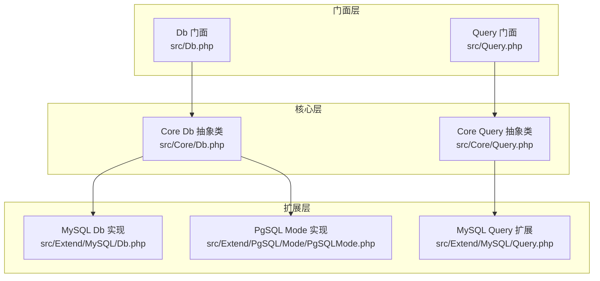
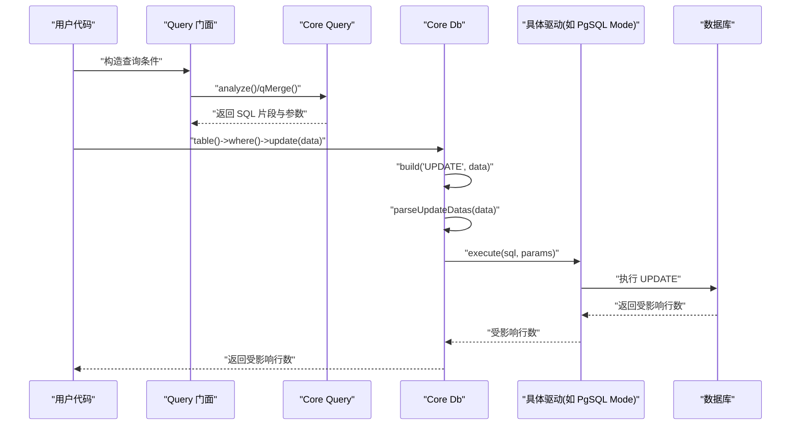
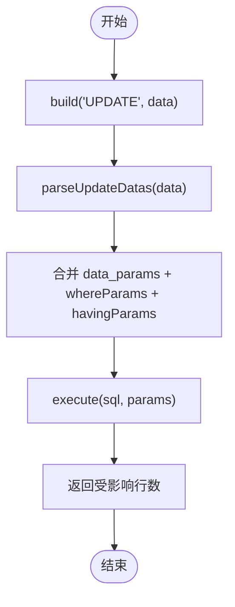
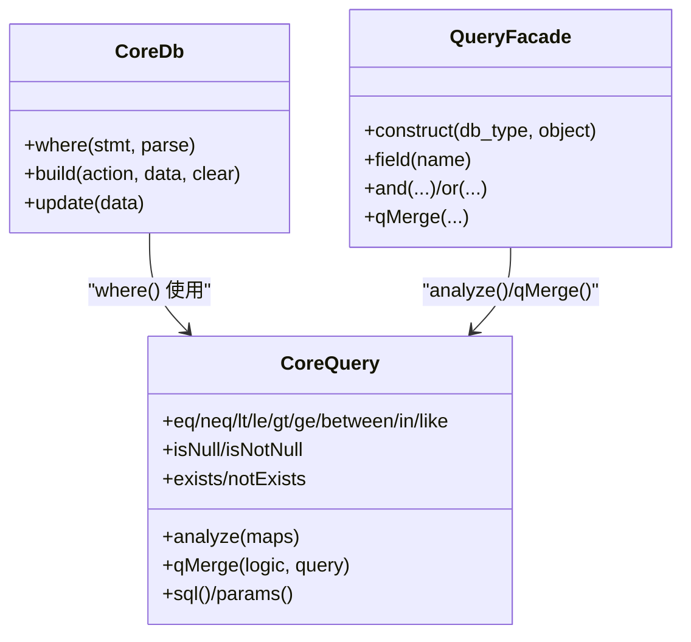
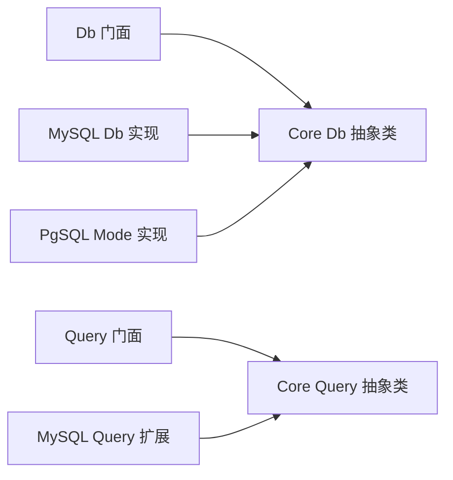

# 更新操作

<cite>
**本文引用的文件**
- [src/Core/Db.php](file://src/Core/Db.php)
- [src/Core/Query.php](file://src/Core/Query.php)
- [src/Db.php](file://src/Db.php)
- [src/Query.php](file://src/Query.php)
- [examples/db_update.php](file://examples/db_update.php)
- [src/Extend/MySQL/Db.php](file://src/Extend/MySQL/Db.php)
- [src/Extend/MySQL/Query.php](file://src/Extend/MySQL/Query.php)
- [src/Extend/PgSQL/Mode/PgSQLMode.php](file://src/Extend/PgSQL/Mode/PgSQLMode.php)
</cite>

## 目录
1. [简介](#简介)
2. [项目结构](#项目结构)
3. [核心组件](#核心组件)
4. [架构概览](#架构概览)
5. [详细组件分析](#详细组件分析)
6. [依赖关系分析](#依赖关系分析)
7. [性能考量](#性能考量)
8. [故障排查指南](#故障排查指南)
9. [结论](#结论)
10. [附录](#附录)

## 简介
本文系统阐述 FizeDatabase 的更新操作能力，重点覆盖：
- update() 方法的使用方式与实现机制
- 条件更新与批量更新的实现路径
- 数据格式化、参数绑定、WHERE 条件构建
- 多种更新场景（简单字段更新、复杂条件更新、多表关联更新）
- 数据验证、条件构建、错误处理与性能优化最佳实践
- 与查询构建器的集成以及 updateGetId() 的使用说明

## 项目结构
FizeDatabase 采用分层设计：
- 核心层：Core 层提供抽象的数据库操作能力（Db 抽象类、Query 抽象类）
- 扩展层：针对不同数据库（MySQL、PgSQL、SQLite、Oracle、Access）提供具体实现
- 门面层：Db、Query 门面类，提供静态便捷入口
- 示例与测试：examples 提供使用示例，tests 提供单元测试

图表来源
- [src/Db.php:1-141](file://src/Db.php#L1-L141)
- [src/Query.php:1-130](file://src/Query.php#L1-L130)
- [src/Core/Db.php:1-941](file://src/Core/Db.php#L1-L941)
- [src/Core/Query.php:1-621](file://src/Core/Query.php#L1-L621)
- [src/Extend/MySQL/Db.php:1-246](file://src/Extend/MySQL/Db.php#L1-L246)
- [src/Extend/MySQL/Query.php:1-91](file://src/Extend/MySQL/Query.php#L1-L91)
- [src/Extend/PgSQL/Mode/PgSQLMode.php:1-139](file://src/Extend/PgSQL/Mode/PgSQLMode.php#L1-L139)

章节来源
- [src/Db.php:1-141](file://src/Db.php#L1-L141)
- [src/Query.php:1-130](file://src/Query.php#L1-L130)
- [src/Core/Db.php:1-941](file://src/Core/Db.php#L1-L941)
- [src/Core/Query.php:1-621](file://src/Core/Query.php#L1-L621)

## 核心组件
- Core Db 抽象类：提供 update()、build()、where()、parseUpdateDatas() 等核心更新能力；封装参数绑定、SQL 构建与执行流程
- Core Query 抽象类：提供条件解析、表达式拼装、参数绑定等能力，支持 between、in、like、exists 等多种条件
- 门面 Db/Query：提供静态便捷入口，简化用户使用
- 扩展 Db（如 MySQL Db、PgSQL Mode）：在 Core Db 基础上实现具体数据库的差异（如 LIMIT、锁、占位符等）

章节来源
- [src/Core/Db.php:684-700](file://src/Core/Db.php#L684-L700)
- [src/Core/Db.php:528-543](file://src/Core/Db.php#L528-L543)
- [src/Core/Db.php:583-637](file://src/Core/Db.php#L583-L637)
- [src/Core/Query.php:138-377](file://src/Core/Query.php#L138-L377)
- [src/Db.php:1-141](file://src/Db.php#L1-L141)
- [src/Query.php:1-130](file://src/Query.php#L1-L130)

## 架构概览
更新操作的整体流程如下：
- 通过门面 Db/Query 设置表、条件、字段
- Core Db.build() 将数据与条件拼装为 UPDATE 语句
- 执行 execute() 并返回受影响行数
- 可选：使用 setInc()/setDec() 实现原子自增/自减
- 可选：使用 setValue() 快速设置单字段

图表来源
- [src/Db.php:124-127](file://src/Db.php#L124-L127)
- [src/Query.php:35-39](file://src/Query.php#L35-L39)
- [src/Core/Db.php:583-637](file://src/Core/Db.php#L583-L637)
- [src/Core/Db.php:689-693](file://src/Core/Db.php#L689-L693)
- [src/Extend/PgSQL/Mode/PgSQLMode.php:84-101](file://src/Extend/PgSQL/Mode/PgSQLMode.php#L84-L101)

## 详细组件分析

### update() 方法详解
- 功能：根据传入的数据数组生成 UPDATE 语句并执行，返回受影响行数
- 数据格式化：parseUpdateDatas() 将数组转换为 SET 子句，支持原样 SQL 与参数绑定两种模式
- 参数绑定：将值逐个加入参数数组，确保安全
- 条件集成：build() 在 UPDATE 中拼接 WHERE/HAVING/GROUP/ORDER 等子句
- 返回值：受影响的记录数

图表来源
- [src/Core/Db.php:583-637](file://src/Core/Db.php#L583-L637)
- [src/Core/Db.php:528-543](file://src/Core/Db.php#L528-L543)
- [src/Core/Db.php:689-693](file://src/Core/Db.php#L689-L693)

章节来源
- [src/Core/Db.php:684-700](file://src/Core/Db.php#L684-L700)
- [src/Core/Db.php:528-543](file://src/Core/Db.php#L528-L543)
- [src/Core/Db.php:583-637](file://src/Core/Db.php#L583-L637)

### 条件更新与 WHERE 构建
- where() 支持三种输入：
  - 条件数组：自动解析为 SQL 片段与参数
  - Query 对象：直接复用其 SQL 与参数
  - 原生 SQL 预处理语句：手动绑定参数
- Core Query 提供丰富的条件方法：eq/neq/lt/le/gt/ge/between/in/like/isNull/isNotNull/exists/notExists 等
- 门面 Query::and/or/qMerge 提供多条件组合

图表来源
- [src/Core/Db.php:335-359](file://src/Core/Db.php#L335-L359)
- [src/Core/Query.php:521-568](file://src/Core/Query.php#L521-L568)
- [src/Query.php:35-129](file://src/Query.php#L35-L129)

章节来源
- [src/Core/Db.php:335-359](file://src/Core/Db.php#L335-L359)
- [src/Core/Query.php:138-377](file://src/Core/Query.php#L138-L377)
- [src/Query.php:79-129](file://src/Query.php#L79-L129)

### 数据格式化与参数绑定
- parseUpdateDatas()：将数组转换为 SET 子句
  - 若值为数组（且长度为 1），则视为原样 SQL 片段（例如自增表达式）
  - 否则使用占位符 "?" 并将值加入参数数组
- getRealSql()：将预处理语句与参数拼接为真实 SQL（仅用于日志输出）
- Core Db::getLastSql(real)：返回最终 SQL 或预处理 SQL

章节来源
- [src/Core/Db.php:528-543](file://src/Core/Db.php#L528-L543)
- [src/Core/Db.php:178-190](file://src/Core/Db.php#L178-L190)
- [src/Core/Db.php:199-206](file://src/Core/Db.php#L199-L206)

### 复杂条件与多表关联更新
- 多表关联：通过 join()/innerJoin()/leftJoin()/rightJoin() 构建 JOIN 子句
- 条件复杂：使用 Query::and/or/qMerge 或条件数组的多维嵌套
- 注意：UPDATE 语句中可包含 JOIN、WHERE、GROUP、HAVING、ORDER 等子句，最终由 build() 拼装

章节来源
- [src/Core/Db.php:408-463](file://src/Core/Db.php#L408-L463)
- [src/Core/Db.php:583-637](file://src/Core/Db.php#L583-L637)
- [src/Core/Query.php:570-619](file://src/Core/Query.php#L570-L619)

### 原子自增/自减与单字段更新
- setInc(field, step)：将字段值增加 step
- setDec(field, step)：将字段值减少 step
- setValue(field, value)：快速设置单字段值
- 以上均通过 update() 实现，保证原子性与一致性

章节来源
- [src/Core/Db.php:847-881](file://src/Core/Db.php#L847-L881)
- [src/Core/Db.php:689-693](file://src/Core/Db.php#L689-L693)

### 与查询构建器的集成
- 门面 Query::construct(db_type) 返回对应数据库类型的 Query 实例
- Query::field()/and()/or()/qMerge() 提供链式条件组合
- Query::analyze() 支持数组条件解析，兼容多种表达式

章节来源
- [src/Query.php:24-39](file://src/Query.php#L24-L39)
- [src/Query.php:60-129](file://src/Query.php#L60-L129)
- [src/Core/Query.php:521-568](file://src/Core/Query.php#L521-L568)

### updateGetId() 的使用
- Core Db::insertGetId(data, name)：先插入再返回自增 ID
- 未提供 updateGetId() 方法：若需在更新后获取 ID，可在更新前查询或使用数据库触发器/序列
- PostgreSQL 的 lastInsertId() 需要指定序列名

章节来源
- [src/Core/Db.php:656-660](file://src/Core/Db.php#L656-L660)
- [src/Extend/PgSQL/Mode/PgSQLMode.php:132-138](file://src/Extend/PgSQL/Mode/PgSQLMode.php#L132-L138)

### 实际使用示例与场景
- 简单字段更新：见示例文件，使用 table()->where()->update()
- 复杂条件更新：使用 Query::and/or/qMerge 或条件数组
- 多表关联更新：结合 join()/innerJoin()/leftJoin()/rightJoin()

章节来源
- [examples/db_update.php:1-22](file://examples/db_update.php#L1-L22)
- [src/Query.php:115-129](file://src/Query.php#L115-L129)
- [src/Core/Db.php:408-463](file://src/Core/Db.php#L408-L463)

## 依赖关系分析
- 门面 Db/Query 依赖 Core Db/Query
- 具体数据库实现（如 MySQL Db、PgSQL Mode）继承 Core Db
- Query 门面根据数据库类型动态选择对应 Query 实现

图表来源
- [src/Db.php:1-141](file://src/Db.php#L1-L141)
- [src/Query.php:1-130](file://src/Query.php#L1-L130)
- [src/Core/Db.php:1-941](file://src/Core/Db.php#L1-L941)
- [src/Core/Query.php:1-621](file://src/Core/Query.php#L1-L621)
- [src/Extend/MySQL/Db.php:1-246](file://src/Extend/MySQL/Db.php#L1-L246)
- [src/Extend/MySQL/Query.php:1-91](file://src/Extend/MySQL/Query.php#L1-L91)
- [src/Extend/PgSQL/Mode/PgSQLMode.php:1-139](file://src/Extend/PgSQL/Mode/PgSQLMode.php#L1-L139)

章节来源
- [src/Db.php:1-141](file://src/Db.php#L1-L141)
- [src/Query.php:1-130](file://src/Query.php#L1-L130)
- [src/Core/Db.php:1-941](file://src/Core/Db.php#L1-L941)
- [src/Core/Query.php:1-621](file://src/Core/Query.php#L1-L621)

## 性能考量
- 使用参数绑定避免 SQL 注入，同时减少解析开销
- 复杂条件尽量使用 Query 门面的链式方法，便于复用与维护
- 对于大量更新，建议使用事务包裹，减少多次往返
- 使用 where() 限定更新范围，避免全表扫描
- PostgreSQL 的 lastInsertId() 需要序列名，避免不必要的查询

章节来源
- [src/Core/Db.php:178-190](file://src/Core/Db.php#L178-L190)
- [src/Extend/PgSQL/Mode/PgSQLMode.php:132-138](file://src/Extend/PgSQL/Mode/PgSQLMode.php#L132-L138)

## 故障排查指南
- SQL 注入与安全：仅使用参数绑定，避免直接拼接
- 参数顺序：确保参数数组与占位符一一对应
- 日志定位：使用 getLastSql(true) 查看最终 SQL
- 错误处理：具体驱动在执行失败时抛出异常，捕获并记录

章节来源
- [src/Core/Db.php:178-190](file://src/Core/Db.php#L178-L190)
- [src/Core/Db.php:199-206](file://src/Core/Db.php#L199-L206)
- [src/Extend/PgSQL/Mode/PgSQLMode.php:96-98](file://src/Extend/PgSQL/Mode/PgSQLMode.php#L96-L98)

## 结论
FizeDatabase 的更新操作以 Core Db 为核心，通过 build() 与 parseUpdateDatas() 实现安全高效的 UPDATE 语句生成；配合 Core Query 的丰富条件能力与门面 Query 的便捷入口，能够覆盖从简单字段更新到复杂多表关联更新的广泛场景。建议在生产环境中严格使用参数绑定、合理使用事务、精准限定 WHERE 条件，并利用 getLastSql() 进行调试与审计。

## 附录
- 示例文件：examples/db_update.php 展示了基本更新流程
- MySQL 扩展：提供 LIMIT、锁、分页等增强能力
- PgSQL Mode：展示不同数据库在占位符与返回值上的差异

章节来源
- [examples/db_update.php:1-22](file://examples/db_update.php#L1-L22)
- [src/Extend/MySQL/Db.php:1-246](file://src/Extend/MySQL/Db.php#L1-L246)
- [src/Extend/PgSQL/Mode/PgSQLMode.php:1-139](file://src/Extend/PgSQL/Mode/PgSQLMode.php#L1-L139)