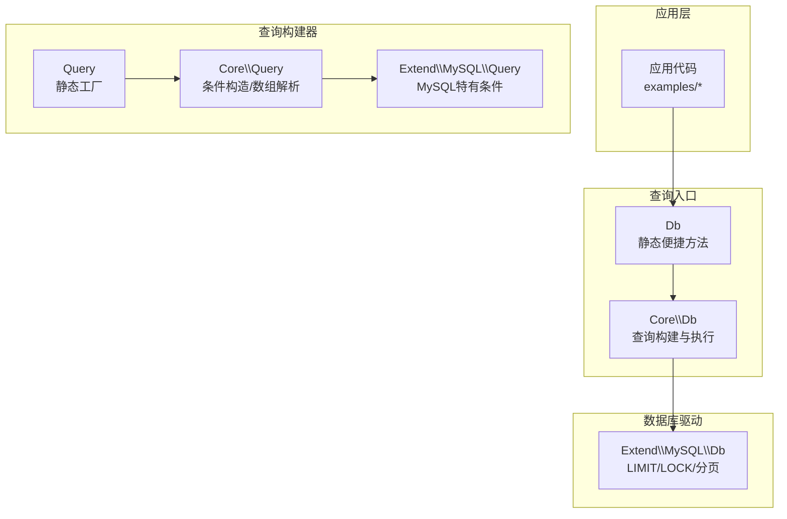
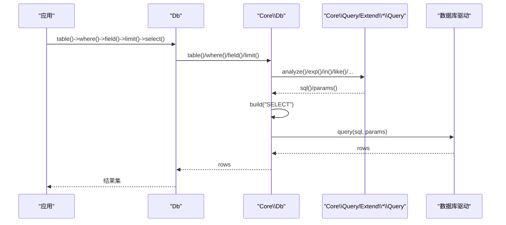
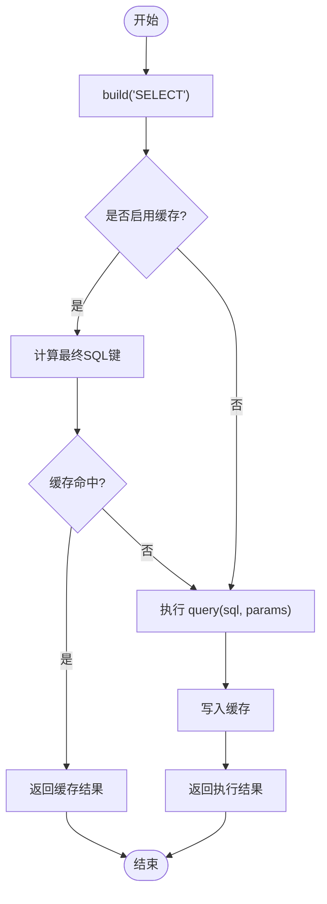
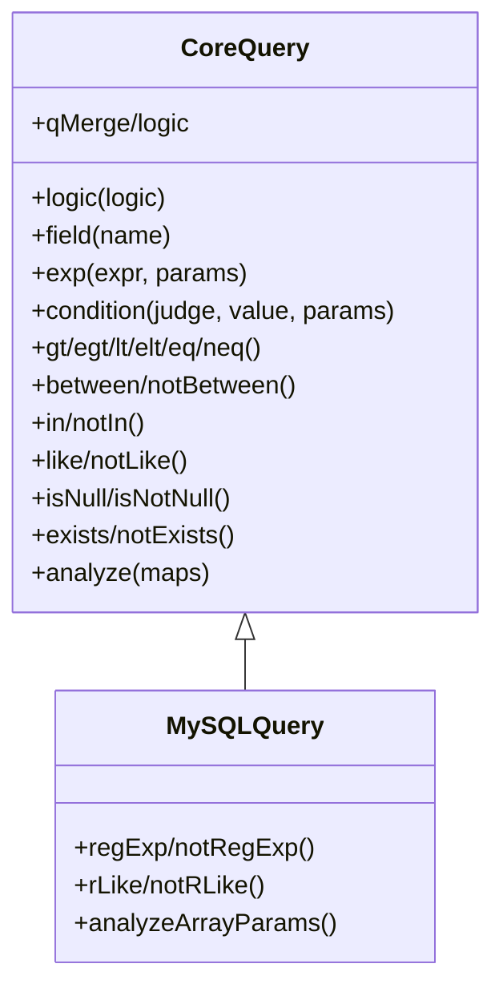
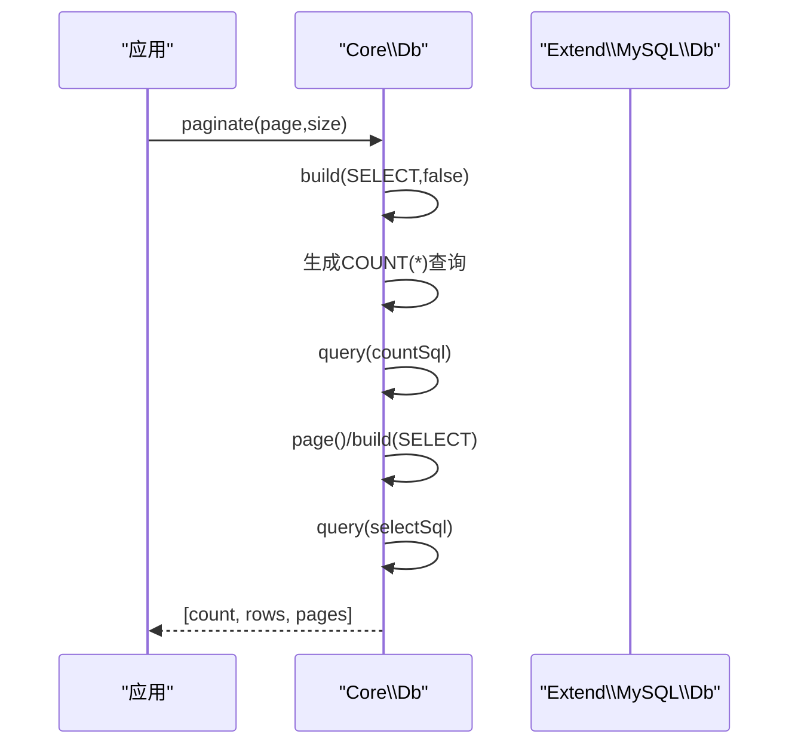
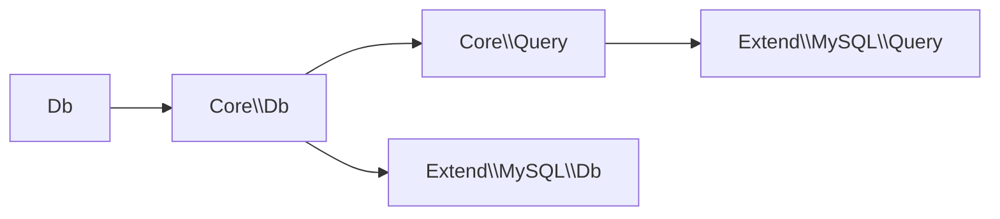

# 查询操作

<cite>
**本文引用的文件**
- [src/Db.php](file://src/Db.php)
- [src/Query.php](file://src/Query.php)
- [src/Core/Db.php](file://src/Core/Db.php)
- [src/Core/Query.php](file://src/Core/Query.php)
- [src/Extend/MySQL/Db.php](file://src/Extend/MySQL/Db.php)
- [src/Extend/MySQL/Query.php](file://src/Extend/MySQL/Query.php)
- [examples/db_select.php](file://examples/db_select.php)
- [examples/db_paginate.php](file://examples/db_paginate.php)
- [examples/db_connect.php](file://examples/db_connect.php)
- [tests/Core/TestQuery.php](file://tests/Core/TestQuery.php)
</cite>

## 目录
1. [简介](#简介)
2. [项目结构](#项目结构)
3. [核心组件](#核心组件)
4. [架构总览](#架构总览)
5. [详细组件分析](#详细组件分析)
6. [依赖关系分析](#依赖关系分析)
7. [性能考量](#性能考量)
8. [故障排查指南](#故障排查指南)
9. [结论](#结论)
10. [附录](#附录)

## 简介
本文系统梳理 FizeDatabase 的查询操作能力，围绕 select()、find()、findOrNull()、value()、column() 等查询方法展开，深入解释其使用方式、结果集缓存机制、分页查询、字段选择、数据类型处理，并结合查询构建器（Query）的深度集成与结果集处理流程，给出多种查询场景的实践路径与最佳实践，包括简单查询、复杂条件查询、联表查询、聚合查询。同时提供查询优化、缓存策略、错误处理与性能监控的建议。

## 项目结构
- 核心查询入口位于 Db 与 Core\Db，Db 提供静态便捷方法，Core\Db 实现具体查询构建与执行。
- 查询构建器 Query 与 Core\Query 提供链式条件构造与数组解析能力。
- 不同数据库驱动通过 Extend 下的子目录扩展，如 MySQL、PgSQL、SQLSRV、SQLite 等，各自继承 Core 层能力并补充方言特性。
- 示例与测试覆盖了典型查询场景与边界行为。

图表来源
- [src/Db.php:1-141](file://src/Db.php#L1-L141)
- [src/Core/Db.php:1-941](file://src/Core/Db.php#L1-L941)
- [src/Query.php:1-130](file://src/Query.php#L1-L130)
- [src/Core/Query.php:1-621](file://src/Core/Query.php#L1-L621)
- [src/Extend/MySQL/Db.php:1-246](file://src/Extend/MySQL/Db.php#L1-L246)
- [src/Extend/MySQL/Query.php:1-91](file://src/Extend/MySQL/Query.php#L1-L91)

章节来源
- [src/Db.php:1-141](file://src/Db.php#L1-L141)
- [src/Core/Db.php:1-941](file://src/Core/Db.php#L1-L941)
- [src/Query.php:1-130](file://src/Query.php#L1-L130)
- [src/Core/Query.php:1-621](file://src/Core/Query.php#L1-L621)
- [src/Extend/MySQL/Db.php:1-246](file://src/Extend/MySQL/Db.php#L1-L246)
- [src/Extend/MySQL/Query.php:1-91](file://src/Extend/MySQL/Query.php#L1-L91)

## 核心组件
- Db：对外暴露静态便捷方法，封装连接、事务、查询入口与 SQL 日志。
- Core\Db：实现查询构建（field、where、group、having、order、join、union、limit 等）、执行（select/find/findOrNull/value/column/paginate/count/sum/min/max/avg 等），内置结果集缓存。
- Query/Core\Query：链式条件构造与数组解析，支持 EXP、IN、BETWEEN、LIKE、IS NULL/NOT NULL、EXISTS/NOT EXISTS 等，以及 AND/OR 组合。
- Extend\MySQL\Db/Query：MySQL 方言扩展，如 LIMIT 语法、LOCK、STRAIGHT_JOIN、REGEXP/RLIKE 等。

章节来源
- [src/Db.php:1-141](file://src/Db.php#L1-L141)
- [src/Core/Db.php:1-941](file://src/Core/Db.php#L1-L941)
- [src/Core/Query.php:1-621](file://src/Core/Query.php#L1-L621)
- [src/Extend/MySQL/Db.php:1-246](file://src/Extend/MySQL/Db.php#L1-L246)
- [src/Extend/MySQL/Query.php:1-91](file://src/Extend/MySQL/Query.php#L1-L91)

## 架构总览
查询从应用层发起，经 Db 静态入口进入 Core\Db，由 Core\Db 组装 SQL 并执行；条件由 Query/Core\Query 构建或解析数组；不同数据库驱动在 Core\Db 基础上扩展方言能力；查询结果可通过 select()/find()/findOrNull()/value()/column() 获取，支持缓存与回调遍历。

图表来源
- [src/Db.php:124-127](file://src/Db.php#L124-L127)
- [src/Core/Db.php:335-359](file://src/Core/Db.php#L335-L359)
- [src/Core/Db.php:583-637](file://src/Core/Db.php#L583-L637)
- [src/Core/Query.php:521-568](file://src/Core/Query.php#L521-L568)
- [src/Extend/MySQL/Db.php:129-152](file://src/Extend/MySQL/Db.php#L129-L152)

## 详细组件分析

### 查询方法：select()/find()/findOrNull()/value()/column()
- select(cache=true)
  - 构建 SELECT SQL，按需使用缓存；缓存键基于最终真实 SQL（getLastSql(true)）。
  - 适合批量获取记录，支持回调遍历（见 Core\Db::fetch）。
- findOrNull(cache=false)
  - 自动 limit(1) 后 select，无记录返回 null。
- find(cache=false)
  - 无记录时抛出 DataNotFoundException。
- value(field, default=null, force=false)
  - 仅取某字段的单值，可强制转数字；内部通过 field([...]) + findOrNull 实现。
- column(field)
  - 仅取某字段的数组，内部通过 fetch 遍历收集。

图表来源
- [src/Core/Db.php:700-711](file://src/Core/Db.php#L700-L711)

章节来源
- [src/Core/Db.php:695-776](file://src/Core/Db.php#L695-L776)

### 查询构建器：Query/Core\Query 与数组解析
- 链式条件
  - exp(expression, params)：原生表达式，支持绑定参数。
  - condition(judge, value, params)：通用判断符（>, >=, <, <=, =, <>, LIKE 等）。
  - gt/egt/lt/elt/eq/neq/between/notBetween/isNull/isNotNull/in/notIn/like/notLike/exists/notExists 等。
- 数组解析 analyze(maps)
  - 支持多种数组格式：字段名=>值、字段名=>['操作', 参数...]、字段名=>['EXP', 表达式, 绑定]、EXISTS/NOT EXISTS 等。
  - 支持组合逻辑（AND/OR）与多字段多次定义。
- 与 Db::where 的集成
  - Db::where 接受数组、Query 对象或原生 SQL+参数，内部实例化对应方言 Query 并解析。

图表来源
- [src/Core/Query.php:1-621](file://src/Core/Query.php#L1-L621)
- [src/Extend/MySQL/Query.php:1-91](file://src/Extend/MySQL/Query.php#L1-L91)

章节来源
- [src/Core/Query.php:1-621](file://src/Core/Query.php#L1-L621)
- [src/Extend/MySQL/Query.php:1-91](file://src/Extend/MySQL/Query.php#L1-L91)
- [tests/Core/TestQuery.php:1-787](file://tests/Core/TestQuery.php#L1-L787)

### 分页查询：page()/paginate()
- page(page, size)
  - 基于 limit(rows, offset) 实现简易分页。
- paginate(page, size)
  - 通过 COUNT(*) 计算总数，再执行分页查询，返回 [总数, 记录数组, 总页数]。
  - MySQL 版本使用 SQL_CALC_FOUND_ROWS 与 FOUND_ROWS() 的优化方案。

图表来源
- [src/Core/Db.php:891-908](file://src/Core/Db.php#L891-L908)
- [src/Extend/MySQL/Db.php:187-203](file://src/Extend/MySQL/Db.php#L187-L203)

章节来源
- [src/Core/Db.php:891-908](file://src/Core/Db.php#L891-L908)
- [src/Extend/MySQL/Db.php:187-203](file://src/Extend/MySQL/Db.php#L187-L203)
- [examples/db_paginate.php:1-22](file://examples/db_paginate.php#L1-L22)

### 字段选择与数据类型处理
- field(fields)
  - 支持字符串原样与数组格式；数组可指定别名（别名=>实际字段）。
- value(field, default, force)
  - 仅取单值，可强制转换为数字类型。
- column(field)
  - 遍历结果集，收集某一字段的数组。

章节来源
- [src/Core/Db.php:228-244](file://src/Core/Db.php#L228-L244)
- [src/Core/Db.php:749-776](file://src/Core/Db.php#L749-L776)

### 结果集缓存机制
- 缓存位置：Core\Db::$cacheRows（静态数组）。
- 缓存键：最终真实 SQL（getLastSql(true)）。
- 触发点：select(cache=true)；find/findOrNull/value/column 默认不使用缓存。
- 注意：缓存为进程内静态存储，跨请求需自行管理。

章节来源
- [src/Core/Db.php:95](file://src/Core/Db.php#L95)
- [src/Core/Db.php:700-711](file://src/Core/Db.php#L700-L711)

### 与查询构建器的深度集成
- Db::where
  - 接收数组、Query 对象或原生 SQL+参数；数组通过方言 Query::analyze 解析。
- Query::and/or/qMerge/qAnd/qOr
  - 提供多条件组合能力，支持数组与 Query 对象混合组合。
- Db::join/innerJoin/leftJoin/rightJoin/crossJoin/straightJoin
  - MySQL 特有的 JOIN 类型在 Extend\MySQL\Db 中提供。

章节来源
- [src/Core/Db.php:335-359](file://src/Core/Db.php#L335-L359)
- [src/Query.php:85-129](file://src/Query.php#L85-L129)
- [src/Extend/MySQL/Db.php:67-109](file://src/Extend/MySQL/Db.php#L67-L109)

### 实际代码示例与场景
- 简单查询
  - 使用 Db::table()->where()->limit()->select() 获取列表。
  - 参考：[examples/db_connect.php:16-22](file://examples/db_connect.php#L16-L22)
- 复杂条件查询
  - 使用数组条件或 Query 对象；支持 BETWEEN、IN、LIKE、EXISTS 等。
  - 参考：[tests/Core/TestQuery.php:306-770](file://tests/Core/TestQuery.php#L306-L770)
- 联表查询
  - 使用 join/leftJoin/innerJoin 等；MySQL 特有类型见 Extend\MySQL\Db。
  - 参考：[src/Extend/MySQL/Db.php:408-463](file://src/Extend/MySQL/Db.php#L408-L463)
- 聚合查询
  - count()/sum()/min()/max()/avg() 基于 value(field) 实现。
  - 参考：[src/Core/Db.php:796-845](file://src/Core/Db.php#L796-L845)

## 依赖关系分析
- Db 依赖 Core\Db 与 Extend\* 的 ModeFactory，动态创建具体驱动实例。
- Core\Db 依赖 Core\Query 或方言 Query（如 Extend\MySQL\Query）进行条件解析。
- Extend\MySQL\Db 在 Core\Db 基础上扩展 LIMIT、LOCK、分页与 MySQL 特有 JOIN/REGEXP 等。

图表来源
- [src/Db.php:32-40](file://src/Db.php#L32-L40)
- [src/Core/Db.php:335-359](file://src/Core/Db.php#L335-L359)
- [src/Core/Query.php:521-568](file://src/Core/Query.php#L521-L568)
- [src/Extend/MySQL/Db.php:129-152](file://src/Extend/MySQL/Db.php#L129-L152)

章节来源
- [src/Db.php:32-40](file://src/Db.php#L32-L40)
- [src/Core/Db.php:335-359](file://src/Core/Db.php#L335-L359)
- [src/Core/Query.php:521-568](file://src/Core/Query.php#L521-L568)
- [src/Extend/MySQL/Db.php:129-152](file://src/Extend/MySQL/Db.php#L129-L152)

## 性能考量
- 结果集缓存
  - select(cache=true) 使用最终真实 SQL 作为键，避免重复执行相同查询。
  - 建议：对高并发、低变化的查询开启缓存；对频繁变更的查询关闭缓存。
- 避免不必要的字段加载
  - 明确 field 选择，减少列传输与内存占用。
- LIMIT 与分页
  - 使用 page()/limit() 控制返回行数；paginate() 通过 COUNT 与 LIMIT 获取总数与分页数据。
- 遍历大结果集
  - 使用 fetch + 回调逐行处理，降低内存峰值。
- SQL 日志与安全
  - getLastSql(true) 输出最终 SQL 仅用于调试与日志，不可直接执行。

章节来源
- [src/Core/Db.php:700-711](file://src/Core/Db.php#L700-L711)
- [src/Core/Db.php:668-672](file://src/Core/Db.php#L668-L672)
- [src/Core/Db.php:199-206](file://src/Core/Db.php#L199-L206)

## 故障排查指南
- 记录不存在
  - find() 无记录时抛出异常；findOrNull() 返回 null。根据业务选择合适方法。
- SQL 注入与参数绑定
  - 使用 Query::condition/exp 的参数绑定机制；避免拼接原始字符串。
- 错误日志
  - 使用 Db::getLastSql(true) 获取最终 SQL 便于定位问题。
- 调试建议
  - 先用 Query::sql()/params() 检查条件片段与绑定参数，再执行查询。

章节来源
- [src/Core/Db.php:733-740](file://src/Core/Db.php#L733-L740)
- [src/Core/Db.php:199-206](file://src/Core/Db.php#L199-L206)
- [src/Core/Query.php:113-136](file://src/Core/Query.php#L113-L136)

## 结论
FizeDatabase 的查询体系以 Core\Db 为核心，通过 Query/Core\Query 提供强大的条件构造与数组解析能力，并在不同数据库驱动上扩展方言特性。select()/find()/findOrNull()/value()/column() 覆盖常见查询需求，配合分页与缓存机制，能够高效支撑大多数业务场景。建议在高并发与大数据量场景下合理使用缓存、限制字段、控制分页与遍历策略，确保性能与稳定性。

## 附录
- 快速示例路径
  - 简单查询：[examples/db_connect.php:16-22](file://examples/db_connect.php#L16-L22)
  - 条件查询与数组解析：[tests/Core/TestQuery.php:306-770](file://tests/Core/TestQuery.php#L306-L770)
  - 分页查询：[examples/db_paginate.php:17-21](file://examples/db_paginate.php#L17-L21)
- 关键方法参考
  - 查询入口：Db::table()->where()->field()->limit()->select()
  - 聚合与统计：count()/sum()/min()/max()/avg()
  - 分页：page()/paginate()
  - 字段取值：value()/column()