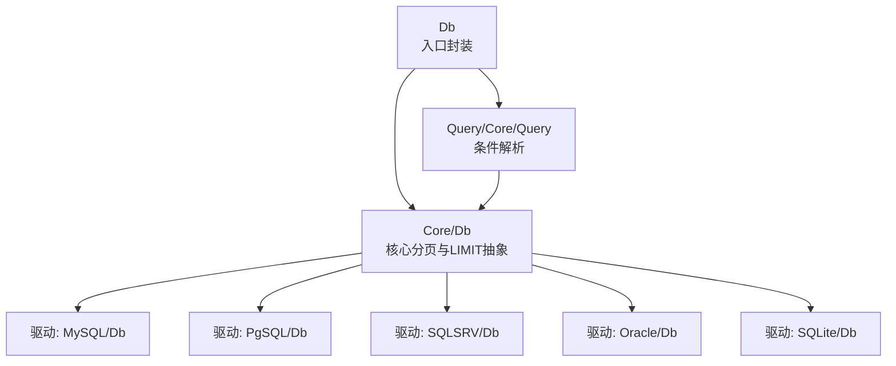
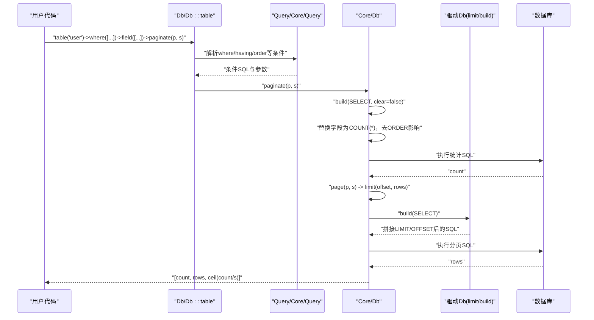
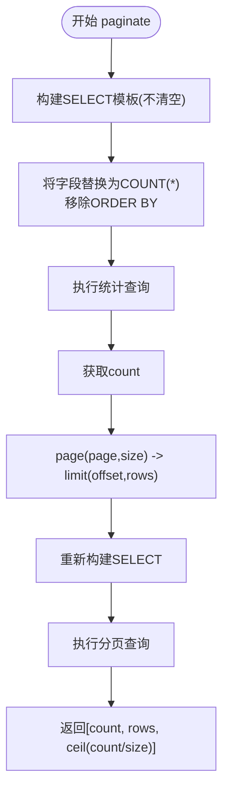
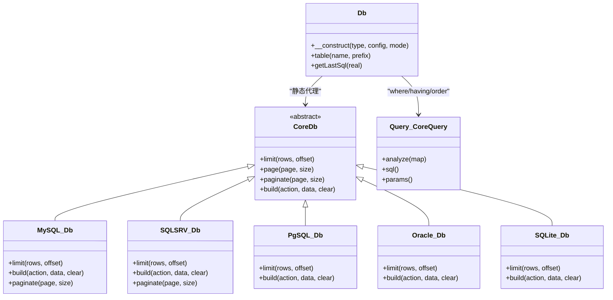

# 分页查询

<cite>
**本文引用的文件**
- [src/Db.php](file://src/Db.php)
- [src/Core/Db.php](file://src/Core/Db.php)
- [src/Query.php](file://src/Query.php)
- [src/Core/Query.php](file://src/Core/Query.php)
- [examples/db_paginate.php](file://examples/db_paginate.php)
- [src/Extend/MySQL/Db.php](file://src/Extend/MySQL/Db.php)
- [src/Extend/MySQL/Query.php](file://src/Extend/MySQL/Query.php)
- [src/Extend/PgSQL/Db.php](file://src/Extend/PgSQL/Db.php)
- [src/Extend/PgSQL/Query.php](file://src/Extend/PgSQL/Query.php)
- [src/Extend/SQLSRV/Db.php](file://src/Extend/SQLSRV/Db.php)
- [src/Extend/Oracle/Db.php](file://src/Extend/Oracle/Db.php)
- [src/Extend/SQLite/Db.php](file://src/Extend/SQLite/Db.php)
</cite>

## 目录
1. [简介](#简介)
2. [项目结构](#项目结构)
3. [核心组件](#核心组件)
4. [架构总览](#架构总览)
5. [详细组件分析](#详细组件分析)
6. [依赖关系分析](#依赖关系分析)
7. [性能考量](#性能考量)
8. [故障排查指南](#故障排查指南)
9. [结论](#结论)
10. [附录](#附录)

## 简介
本章节系统讲解 FizeDatabase 查询构建器的分页查询能力，围绕 LIMIT/OFFSET 的使用、分页实现原理、不同数据库的语法差异与兼容处理、以及面向大数据量的性能优化策略展开。文档同时提供完整的实现示例路径与最佳实践，帮助读者在不同数据库类型下稳定高效地实现分页。

## 项目结构
FizeDatabase 将分页能力抽象在核心类中，并通过各数据库驱动实现具体语法适配。分页相关的关键位置如下：
- 入口与静态封装：Db 类负责连接初始化与静态方法代理
- 核心查询与分页：Core/Db 提供通用的分页逻辑与 LIMIT/OFFSET 抽象
- 驱动适配：各数据库扩展在 Db 驱动中实现 limit/build 与特定语法（如 MySQL 的 SQL_CALC_FOUND_ROWS、SQLSRV 的 OFFSET/FETCH）
- 查询器：Query/Core/Query 提供条件解析与 SQL 片段拼装，为分页提供 WHERE/HAVING/ORDER 等上下文
- 示例：examples/db_paginate.php 展示了如何使用 paginate 获取总数、记录与总页数

图表来源
- [src/Db.php:1-141](file://src/Db.php#L1-L141)
- [src/Core/Db.php:13-941](file://src/Core/Db.php#L13-L941)
- [src/Extend/MySQL/Db.php:1-246](file://src/Extend/MySQL/Db.php#L1-L246)
- [src/Extend/PgSQL/Db.php:1-37](file://src/Extend/PgSQL/Db.php#L1-L37)
- [src/Extend/SQLSRV/Db.php:1-231](file://src/Extend/SQLSRV/Db.php#L1-L231)
- [src/Extend/Oracle/Db.php:1-117](file://src/Extend/Oracle/Db.php#L1-L117)
- [src/Extend/SQLite/Db.php:1-69](file://src/Extend/SQLite/Db.php#L1-L69)
- [src/Query.php:1-130](file://src/Query.php#L1-L130)
- [src/Core/Query.php:1-621](file://src/Core/Query.php#L1-L621)

章节来源
- [src/Db.php:1-141](file://src/Db.php#L1-L141)
- [src/Core/Db.php:13-941](file://src/Core/Db.php#L13-L941)
- [src/Query.php:1-130](file://src/Query.php#L1-L130)
- [src/Core/Query.php:1-621](file://src/Core/Query.php#L1-L621)

## 核心组件
- Db 入口封装：提供静态方法代理与连接创建，便于通过 Db::table(...) -> where(...) -> field(...) -> paginate(...) 的链式调用
- Core/Db 分页与 LIMIT 抽象：定义 limit(rows, offset?) 抽象方法；提供 page(page, size) 将页码转换为 LIMIT/OFFSET；提供 paginate(page, size) 返回 [count, rows, total_pages]
- 驱动 Db：在各自驱动中实现 limit/build，拼接数据库特定的分页语法（如 MySQL 的 LIMIT offset,row；SQLSRV 的 OFFSET ... FETCH ...；Oracle/PgSQL/SQLite 的 LIMIT offset,row）
- Query/Core/Query：解析 where/having/order 等条件，为分页提供稳定的 SQL 上下文

章节来源
- [src/Db.php:1-141](file://src/Db.php#L1-L141)
- [src/Core/Db.php:136-152](file://src/Core/Db.php#L136-L152)
- [src/Core/Db.php:784-789](file://src/Core/Db.php#L784-L789)
- [src/Core/Db.php:883-908](file://src/Core/Db.php#L883-L908)
- [src/Extend/MySQL/Db.php:36-44](file://src/Extend/MySQL/Db.php#L36-L44)
- [src/Extend/SQLSRV/Db.php:75-80](file://src/Extend/SQLSRV/Db.php#L75-L80)
- [src/Extend/Oracle/Db.php:28-36](file://src/Extend/Oracle/Db.php#L28-L36)
- [src/Extend/PgSQL/Db.php:27-35](file://src/Extend/PgSQL/Db.php#L27-L35)
- [src/Extend/SQLite/Db.php:27-35](file://src/Extend/SQLite/Db.php#L27-L35)

## 架构总览
分页流程由两步组成：
1) 统计总数：复制 SELECT 语句并将字段替换为 COUNT(*)，去除 ORDER BY 对 COUNT 的影响，执行统计查询
2) 查询分页数据：调用 page(page, size) 转换为 LIMIT/OFFSET，重新构建 SELECT 并执行查询

图表来源
- [src/Core/Db.php:883-908](file://src/Core/Db.php#L883-L908)
- [src/Core/Db.php:784-789](file://src/Core/Db.php#L784-L789)
- [src/Core/Db.php:583-637](file://src/Core/Db.php#L583-L637)
- [src/Extend/MySQL/Db.php:187-203](file://src/Extend/MySQL/Db.php#L187-L203)
- [src/Extend/SQLSRV/Db.php:133-185](file://src/Extend/SQLSRV/Db.php#L133-L185)
- [src/Extend/PgSQL/Db.php:27-35](file://src/Extend/PgSQL/Db.php#L27-L35)
- [src/Extend/Oracle/Db.php:28-36](file://src/Extend/Oracle/Db.php#L28-L36)
- [src/Extend/SQLite/Db.php:27-35](file://src/Extend/SQLite/Db.php#L27-L35)

## 详细组件分析

### 分页实现原理与流程
- 统计总数：复制当前 SELECT 的 SQL 模板，将字段部分替换为 COUNT(*)，并移除 ORDER BY（避免排序对 COUNT 的影响），执行统计查询得到 count
- 分页查询：调用 page(page, size) 将页码转换为 offset 与 rows，随后重新构建 SELECT 并执行，得到 rows
- 结果返回：返回 [count, rows, ceil(count/size)]

图表来源
- [src/Core/Db.php:883-908](file://src/Core/Db.php#L883-L908)
- [src/Core/Db.php:784-789](file://src/Core/Db.php#L784-L789)

章节来源
- [src/Core/Db.php:883-908](file://src/Core/Db.php#L883-L908)
- [src/Core/Db.php:784-789](file://src/Core/Db.php#L784-L789)

### LIMIT 与 OFFSET 的使用
- 抽象接口：Core/Db 定义 limit(rows, offset?) 为抽象方法，由各驱动实现
- 页码转 LIMIT：Core/Db::page 将 page 与 size 转换为 offset=(page-1)*size，然后调用 limit(size, offset)
- 驱动适配：
  - MySQL：LIMIT offset,row
  - SQLSRV：支持 OFFSET ... FETCH ...（新特性）或通过 ROW_NUMBER() + TOP 包裹（旧特性）
  - Oracle/PgSQL/SQLite：LIMIT offset,row
- 注意：SQLSRV 在无 ORDER BY 时 OFFSET 需配合 ORDER BY，否则自动使用 RAND() 保证可排序性

章节来源
- [src/Core/Db.php:136-152](file://src/Core/Db.php#L136-L152)
- [src/Core/Db.php:784-789](file://src/Core/Db.php#L784-L789)
- [src/Extend/MySQL/Db.php:36-44](file://src/Extend/MySQL/Db.php#L36-L44)
- [src/Extend/SQLSRV/Db.php:75-80](file://src/Extend/SQLSRV/Db.php#L75-L80)
- [src/Extend/SQLSRV/Db.php:144-185](file://src/Extend/SQLSRV/Db.php#L144-L185)
- [src/Extend/Oracle/Db.php:28-36](file://src/Extend/Oracle/Db.php#L28-L36)
- [src/Extend/PgSQL/Db.php:27-35](file://src/Extend/PgSQL/Db.php#L27-L35)
- [src/Extend/SQLite/Db.php:27-35](file://src/Extend/SQLite/Db.php#L27-L35)

### 不同数据库的分页语法与兼容处理
- MySQL
  - 通用分页：LIMIT offset,row
  - 专用优化：SQL_CALC_FOUND_ROWS + FOUND_ROWS()，先查“估算行数”，再查数据，减少一次全表扫描
- SQLSRV
  - 新特性：OFFSET ... FETCH ...（需配合 ORDER BY）
  - 旧特性：通过 ROW_NUMBER() OVER(...) + TOP 包裹实现分页，兼容低版本
- Oracle
  - 采用 LIMIT offset,row 的拼接方式
- PostgreSQL
  - 采用 LIMIT offset,row 的拼接方式
- SQLite
  - 采用 LIMIT offset,row 的拼接方式

章节来源
- [src/Extend/MySQL/Db.php:187-203](file://src/Extend/MySQL/Db.php#L187-L203)
- [src/Extend/SQLSRV/Db.php:144-185](file://src/Extend/SQLSRV/Db.php#L144-L185)
- [src/Extend/Oracle/Db.php:104-115](file://src/Extend/Oracle/Db.php#L104-L115)
- [src/Extend/PgSQL/Db.php:104-115](file://src/Extend/PgSQL/Db.php#L104-L115)
- [src/Extend/SQLite/Db.php:44-67](file://src/Extend/SQLite/Db.php#L44-L67)

### 查询器与分页上下文
- Query/Core/Query 负责 where/having/order/group 等条件解析，确保分页统计与查询的上下文一致
- Core/Db::paginate 在统计阶段会移除 ORDER BY，避免排序对 COUNT 的影响
- 通过 Query 对象可组合复杂条件，不影响分页的正确性

章节来源
- [src/Core/Query.php:1-621](file://src/Core/Query.php#L1-L621)
- [src/Query.php:1-130](file://src/Query.php#L1-L130)
- [src/Core/Db.php:894-897](file://src/Core/Db.php#L894-L897)

### 完整分页实现示例
- 示例路径：examples/db_paginate.php 展示了从连接、构造查询到分页输出的完整链式调用
- 输出内容：count、总页数、分页记录、最终 SQL（包含 LIMIT/OFFSET）

章节来源
- [examples/db_paginate.php:1-22](file://examples/db_paginate.php#L1-L22)

## 依赖关系分析
- Db 静态入口依赖驱动工厂（通过扩展命名空间下的 ModeFactory 创建具体连接）
- Core/Db 为所有驱动的抽象基类，定义分页与 LIMIT 抽象
- 各驱动 Db 重写 limit/build，实现数据库特定语法
- Query/Core/Query 为条件解析提供统一接口，被 Core/Db::where/having/order 使用

图表来源
- [src/Db.php:1-141](file://src/Db.php#L1-L141)
- [src/Core/Db.php:13-941](file://src/Core/Db.php#L13-L941)
- [src/Extend/MySQL/Db.php:1-246](file://src/Extend/MySQL/Db.php#L1-L246)
- [src/Extend/SQLSRV/Db.php:1-231](file://src/Extend/SQLSRV/Db.php#L1-L231)
- [src/Extend/PgSQL/Db.php:1-37](file://src/Extend/PgSQL/Db.php#L1-L37)
- [src/Extend/Oracle/Db.php:1-117](file://src/Extend/Oracle/Db.php#L1-L117)
- [src/Extend/SQLite/Db.php:1-69](file://src/Extend/SQLite/Db.php#L1-L69)
- [src/Core/Query.php:1-621](file://src/Core/Query.php#L1-L621)

## 性能考量
- 统计查询优化
  - MySQL：优先使用 SQL_CALC_FOUND_ROWS + FOUND_ROWS()，避免重复扫描
  - 通用方案：确保统计 SQL 与查询 SQL 的 WHERE 条件一致，避免 ORDER BY 影响 COUNT
- 大数据量分页
  - 避免深分页：OFFSET 过大导致性能下降，建议使用“基于游标的翻页”（如基于上次最大主键）
  - 索引优化：确保 ORDER BY 字段与过滤条件建立合适索引，尽量让查询走覆盖索引
  - 查询计划：使用 EXPLAIN/EXPLAIN QUERY PLAN 分析执行计划，关注回表次数与扫描行数
- 驱动差异
  - SQLSRV 新特性 OFFSET/FETCH 更高效；旧特性通过 ROW_NUMBER() 包裹，注意中间列的清理
  - Oracle/PgSQL/SQLite 的 LIMIT 语法简单，性能取决于索引设计

章节来源
- [src/Extend/MySQL/Db.php:187-203](file://src/Extend/MySQL/Db.php#L187-L203)
- [src/Core/Db.php:894-897](file://src/Core/Db.php#L894-L897)
- [src/Extend/SQLSRV/Db.php:144-185](file://src/Extend/SQLSRV/Db.php#L144-L185)
- [src/Extend/SQLSRV/Db.php:216-229](file://src/Extend/SQLSRV/Db.php#L216-L229)

## 故障排查指南
- SQLSRV 无 ORDER BY 导致 OFFSET 失败
  - 现象：OFFSET 需要 ORDER BY，否则自动使用 RAND()
  - 处理：在分页前明确设置 order，或在驱动层自动补充 ORDER BY
- 统计与查询上下文不一致
  - 现象：COUNT 与 SELECT 条件不一致导致总数不准
  - 处理：确保 where/having/group/order 等条件在统计与查询阶段一致；统计阶段移除 ORDER BY
- MySQL FOUND_ROWS() 与 SQL_CALC_FOUND_ROWS
  - 现象：未使用 SQL_CALC_FOUND_ROWS 导致 FOUND_ROWS() 无效
  - 处理：使用驱动提供的 paginate 或手动使用 SQL_CALC_FOUND_ROWS
- 旧版 SQLSRV 中间列残留
  - 现象：ROW_NUMBER() 包裹产生的中间列未清理
  - 处理：驱动在 select/paginate 中自动清理中间列

章节来源
- [src/Extend/SQLSRV/Db.php:151-157](file://src/Extend/SQLSRV/Db.php#L151-L157)
- [src/Extend/SQLSRV/Db.php:168-174](file://src/Extend/SQLSRV/Db.php#L168-L174)
- [src/Extend/SQLSRV/Db.php:194-205](file://src/Extend/SQLSRV/Db.php#L194-L205)
- [src/Extend/SQLSRV/Db.php:216-229](file://src/Extend/SQLSRV/Db.php#L216-L229)
- [src/Core/Db.php:894-897](file://src/Core/Db.php#L894-L897)
- [src/Extend/MySQL/Db.php:187-203](file://src/Extend/MySQL/Db.php#L187-L203)

## 结论
FizeDatabase 的分页查询通过 Core/Db 的抽象与各驱动的具体实现，提供了统一的链式 API 与跨数据库的兼容性。其核心在于：
- 统一的 page -> limit(offset, rows) 映射
- 统计与查询上下文的一致性保障
- 针对不同数据库的语法适配与性能优化（如 MySQL 的 SQL_CALC_FOUND_ROWS、SQLSRV 的 OFFSET/FETCH 与 ROW_NUMBER() 包裹）

在实际工程中，建议结合索引设计与查询计划分析，优先采用覆盖索引与合适的 ORDER BY，避免深度 OFFSET 导致的性能问题。

## 附录
- 示例路径：examples/db_paginate.php
- 关键实现路径：
  - Core/Db::paginate：[src/Core/Db.php:883-908](file://src/Core/Db.php#L883-L908)
  - Core/Db::page：[src/Core/Db.php:784-789](file://src/Core/Db.php#L784-L789)
  - Core/Db::limit 抽象：[src/Core/Db.php:136-152](file://src/Core/Db.php#L136-L152)
  - MySQL 专用分页：[src/Extend/MySQL/Db.php:187-203](file://src/Extend/MySQL/Db.php#L187-L203)
  - SQLSRV 适配与 OFFSET/FETCH：[src/Extend/SQLSRV/Db.php:144-185](file://src/Extend/SQLSRV/Db.php#L144-L185)
  - Oracle/PgSQL/SQLite LIMIT 适配：[src/Extend/Oracle/Db.php:104-115](file://src/Extend/Oracle/Db.php#L104-L115), [src/Extend/PgSQL/Db.php:104-115](file://src/Extend/PgSQL/Db.php#L104-L115), [src/Extend/SQLite/Db.php:44-67](file://src/Extend/SQLite/Db.php#L44-L67)
  - 查询器条件解析：[src/Core/Query.php:1-621](file://src/Core/Query.php#L1-L621), [src/Query.php:1-130](file://src/Query.php#L1-L130)