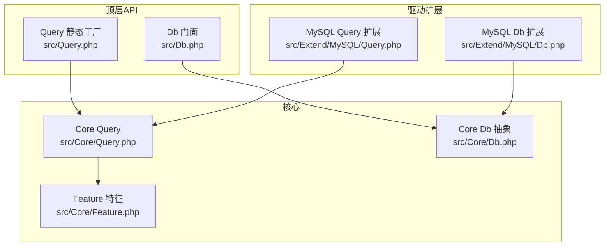
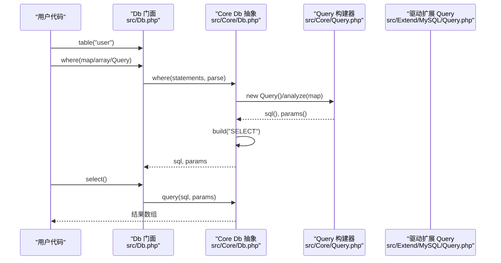
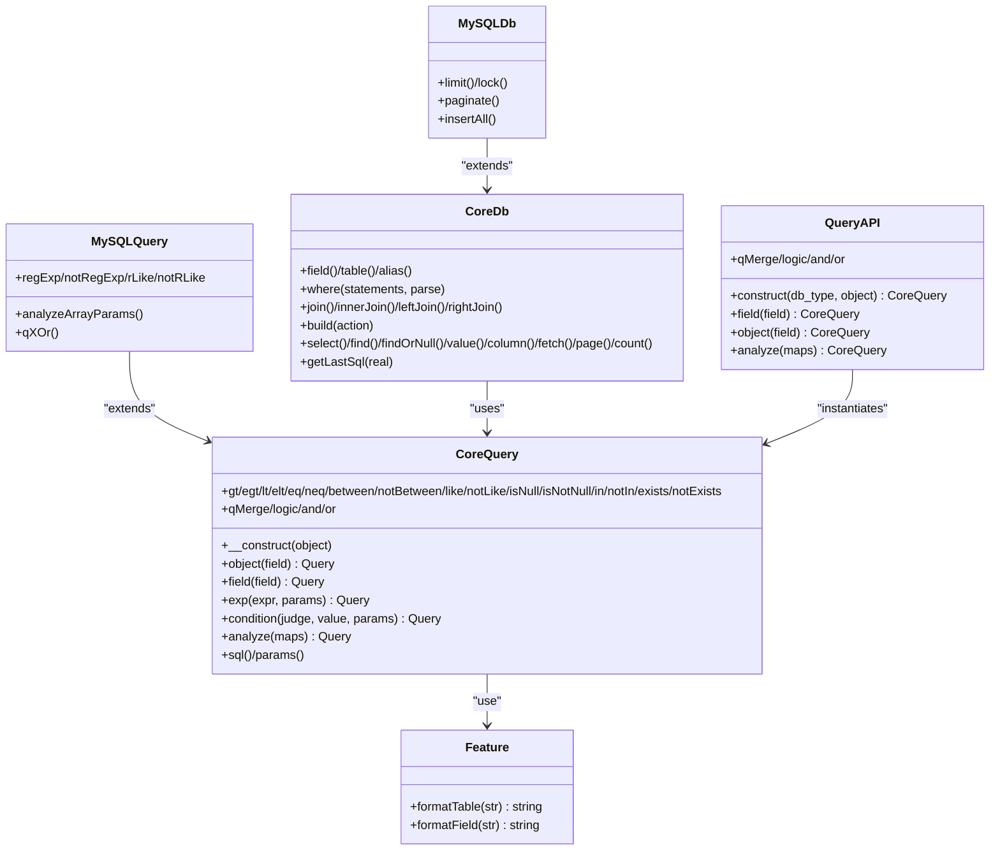

# 基础查询

<cite>
**本文引用的文件**
- [src/Core/Query.php](file://src/Core/Query.php)
- [src/Query.php](file://src/Query.php)
- [src/Core/Db.php](file://src/Core/Db.php)
- [src/Db.php](file://src/Db.php)
- [src/Extend/MySQL/Query.php](file://src/Extend/MySQL/Query.php)
- [src/Extend/MySQL/Db.php](file://src/Extend/MySQL/Db.php)
- [src/Core/Feature.php](file://src/Core/Feature.php)
- [examples/db_select.php](file://examples/db_select.php)
- [tests/Core/TestQuery.php](file://tests/Core/TestQuery.php)
- [composer.json](file://composer.json)
</cite>

## 目录
1. [简介](#简介)
2. [项目结构](#项目结构)
3. [核心组件](#核心组件)
4. [架构总览](#架构总览)
5. [详细组件分析](#详细组件分析)
6. [依赖关系分析](#依赖关系分析)
7. [性能考量](#性能考量)
8. [故障排查指南](#故障排查指南)
9. [结论](#结论)
10. [附录](#附录)

## 简介
本章节聚焦于 FizeDatabase 查询构建器的基础查询能力，系统讲解如何通过链式 API 构建简单的 SELECT 查询，涵盖字段选择、表指定、基本条件设置；详解 Query 类的构造与静态方法，演示 field()、object() 等基础方法的应用场景；并通过从简单到复杂的查询示例（单表查询、多字段选择、基本 WHERE 条件）帮助读者快速掌握。同时，阐明查询构建器与原生 SQL 的映射关系，并给出将链式调用转换为标准 SQL 语句的方法与注意事项。

## 项目结构
- 核心查询构建器位于 Core 层，提供通用的条件拼装与 SQL 片段生成能力。
- 顶层 API 通过 Db 门面与 Query 静态工厂方法对外暴露，便于快速构建查询。
- 不同数据库驱动在 Extend 下提供差异化实现（如 MySQL 的正则匹配、XOR 组合等），但基础链式 API 保持一致。
- 示例与测试覆盖了常见查询场景，便于对照学习。

图表来源
- [src/Db.php:13-141](file://src/Db.php#L13-L141)
- [src/Query.php:12-130](file://src/Query.php#L12-L130)
- [src/Core/Query.php:13-621](file://src/Core/Query.php#L13-L621)
- [src/Core/Db.php:13-800](file://src/Core/Db.php#L13-L800)
- [src/Extend/MySQL/Query.php:12-91](file://src/Extend/MySQL/Query.php#L12-L91)
- [src/Extend/MySQL/Db.php:11-246](file://src/Extend/MySQL/Db.php#L11-L246)
- [src/Core/Feature.php:10-33](file://src/Core/Feature.php#L10-L33)

章节来源
- [src/Db.php:13-141](file://src/Db.php#L13-L141)
- [src/Query.php:12-130](file://src/Query.php#L12-L130)
- [src/Core/Db.php:13-800](file://src/Core/Db.php#L13-L800)
- [src/Core/Query.php:13-621](file://src/Core/Query.php#L13-L621)
- [src/Extend/MySQL/Query.php:12-91](file://src/Extend/MySQL/Query.php#L12-L91)
- [src/Extend/MySQL/Db.php:11-246](file://src/Extend/MySQL/Db.php#L11-L246)
- [src/Core/Feature.php:10-33](file://src/Core/Feature.php#L10-L33)

## 核心组件
- Query（核心）：负责条件拼装、占位符绑定、表达式扩展、数组条件解析、查询对象合并等。
- Query（静态工厂）：提供 construct、field、object、analyze、and/or 等静态方法，简化实例化与组合。
- Db（核心抽象）：负责 SELECT/INSERT/UPDATE/DELETE 的 SQL 组装、参数绑定、执行与结果返回。
- Db（顶层门面）：提供 table、getLastSql 等便捷方法，贯穿链式调用与最终执行。
- MySQL 扩展 Query/Db：在核心基础上增加正则匹配、XOR 组合等特性。

章节来源
- [src/Core/Query.php:13-621](file://src/Core/Query.php#L13-L621)
- [src/Query.php:12-130](file://src/Query.php#L12-L130)
- [src/Core/Db.php:13-800](file://src/Core/Db.php#L13-L800)
- [src/Db.php:13-141](file://src/Db.php#L13-L141)
- [src/Extend/MySQL/Query.php:12-91](file://src/Extend/MySQL/Query.php#L12-L91)
- [src/Extend/MySQL/Db.php:11-246](file://src/Extend/MySQL/Db.php#L11-L246)

## 架构总览
查询构建器的链式调用通过 Core Query 逐步拼装 WHERE 条件与 SQL 片段，Db 在最终阶段将字段、表、JOIN、WHERE、GROUP/HAVING、ORDER、UNION 等整合为完整 SQL 并执行。顶层 Db::table(...) 指定表，Db::where(...) 接收 Query/数组/原生 SQL，Db::select() 触发构建与执行。

图表来源
- [src/Db.php:124-139](file://src/Db.php#L124-L139)
- [src/Core/Db.php:335-359](file://src/Core/Db.php#L335-L359)
- [src/Core/Db.php:583-637](file://src/Core/Db.php#L583-L637)
- [src/Core/Query.php:521-568](file://src/Core/Query.php#L521-L568)
- [src/Extend/MySQL/Query.php:60-79](file://src/Extend/MySQL/Query.php#L60-L79)

## 详细组件分析

### Query 类（核心）
- 构造方法与对象设定
  - 构造函数接收可选对象（通常为字段名），内部委托 object() 完成格式化与存储。
  - object() 与 field() 均用于设定“当前操作对象/字段”，二者在核心 Query 中等价，field() 是 object() 的别名。
- 条件拼装
  - exp()：追加原始表达式，支持占位符与参数绑定；根据是否已有 SQL 片段与当前对象决定拼接方式。
  - condition()：基于判断符与值拼接条件，自动判断是否需要参数绑定；支持显式禁用绑定（false）与自动判断（null）。
  - gt/egt/lt/elt/eq/neq/between/notBetween/like/notLike/isNull/isNotNull/in/notIn/exists/notExists 等便捷方法均基于 condition/exp 实现。
- 数组条件解析 analyze()
  - 支持多种数组格式：键为字段名时，键值可为标量（等同 EQ）、null（等同 IS NULL）、数组（包含多种操作与参数）。
  - 支持 EXISTS/NOT EXISTS、BETWEEN/NOT BETWEEN、IN/NOT IN、LIKE/NOT LIKE、EXPRESSION、CONDITION 等丰富语法。
  - 自动处理组合逻辑（AND/OR），并在每次迭代时重置逻辑（除非显式传入）。
- 查询对象合并
  - qMerge/qAnd/qOr：将多个 Query 或数组条件合并为复合条件。
  - static::merge：静态合并两个 Query 对象，返回新的 Query 实例。
- 辅助方法
  - sql()/params()：分别返回已拼装的 SQL 片段与绑定参数数组，便于调试与日志输出。
  - logic()：设置当前条件的组合逻辑（默认 AND）。

章节来源
- [src/Core/Query.php:41-74](file://src/Core/Query.php#L41-L74)
- [src/Core/Query.php:113-136](file://src/Core/Query.php#L113-L136)
- [src/Core/Query.php:145-164](file://src/Core/Query.php#L145-L164)
- [src/Core/Query.php:171-256](file://src/Core/Query.php#L171-L256)
- [src/Core/Query.php:267-287](file://src/Core/Query.php#L267-L287)
- [src/Core/Query.php:295-338](file://src/Core/Query.php#L295-L338)
- [src/Core/Query.php:346-377](file://src/Core/Query.php#L346-L377)
- [src/Core/Query.php:383-512](file://src/Core/Query.php#L383-L512)
- [src/Core/Query.php:521-568](file://src/Core/Query.php#L521-L568)
- [src/Core/Query.php:585-619](file://src/Core/Query.php#L585-L619)
- [src/Core/Query.php:92-105](file://src/Core/Query.php#L92-L105)
- [src/Core/Query.php:54-58](file://src/Core/Query.php#L54-L58)

### Query 静态工厂
- construct(db_type, object)：按数据库类型动态定位扩展 Query 类并实例化。
- field(field_name)/object(object)：创建并返回对应类型的 Query 实例。
- analyze(maps)：解析数组条件并返回 Query 实例，便于链式复用。
- qMerge/logic/and/or：静态组合多个 Query 或数组条件，返回组合后的 Query。

章节来源
- [src/Query.php:24-39](file://src/Query.php#L24-L39)
- [src/Query.php:48-63](file://src/Query.php#L48-L63)
- [src/Query.php:70-77](file://src/Query.php#L70-L77)
- [src/Query.php:85-108](file://src/Query.php#L85-L108)
- [src/Query.php:115-128](file://src/Query.php#L115-L128)

### Db（核心抽象）
- 字段与表
  - field(fields)：支持字符串与数组（含别名），默认字段为空时 SELECT 会回退为 *。
  - table(name, prefix)：设置当前表与表前缀。
  - alias(alias)：设置表别名。
- 条件与连接
  - where(statements, parse)：支持 Query 对象、数组条件、原生 SQL 预处理语句；自动解析并绑定参数。
  - join/innerJoin/leftJoin/rightJoin/crossJoin/leftOuterJoin/rightOuterJoin/straightJoin：支持多种 JOIN 变体。
- 组装与执行
  - build("SELECT")：将字段、表、别名、JOIN、WHERE、GROUP、HAVING、UNION、ORDER 等整合为完整 SQL。
  - select(cache)/find/findOrNull/value/column/fetch/page/count：提供丰富的查询与取值能力。
- 工具方法
  - getLastSql(real)：返回预处理 SQL 或最终 SQL（用于日志与调试）。

章节来源
- [src/Core/Db.php:228-244](file://src/Core/Db.php#L228-L244)
- [src/Core/Db.php:263-270](file://src/Core/Db.php#L263-L270)
- [src/Core/Db.php:277-281](file://src/Core/Db.php#L277-L281)
- [src/Core/Db.php:335-359](file://src/Core/Db.php#L335-L359)
- [src/Core/Db.php:408-430](file://src/Core/Db.php#L408-L430)
- [src/Core/Db.php:583-637](file://src/Core/Db.php#L583-L637)
- [src/Core/Db.php:700-711](file://src/Core/Db.php#L700-L711)
- [src/Core/Db.php:718-740](file://src/Core/Db.php#L718-L740)
- [src/Core/Db.php:749-761](file://src/Core/Db.php#L749-L761)
- [src/Core/Db.php:768-776](file://src/Core/Db.php#L768-L776)
- [src/Core/Db.php:784-789](file://src/Core/Db.php#L784-L789)
- [src/Core/Db.php:796-799](file://src/Core/Db.php#L796-L799)
- [src/Core/Db.php:199-206](file://src/Core/Db.php#L199-L206)

### Db（顶层门面）
- table(name, prefix)：返回 CoreDb 实例，支持链式调用。
- getLastSql(real)：返回最后执行的 SQL（预处理或真实 SQL）。
- query/execute/startTrans/commit/rollback：底层执行与事务控制。

章节来源
- [src/Db.php:124-139](file://src/Db.php#L124-L139)
- [src/Db.php:136-139](file://src/Db.php#L136-L139)
- [src/Db.php:65-79](file://src/Db.php#L65-L79)
- [src/Db.php:84-114](file://src/Db.php#L84-L114)

### MySQL 扩展 Query/Db
- MySQL Query 扩展
  - regExp/notRegExp/rLike/notRLike：正则匹配相关条件。
  - analyzeArrayParams()：覆盖数组解析，支持 REGEXP/RLIKE/NOT REGEXP/NOT RLIKE。
  - qXOr()：XOR 组合查询对象。
- MySQL Db 扩展
  - limit(rows, offset)：支持标准 LIMIT 语法。
  - lock(lock, lock_sqls)：表级写锁（MySQL 特性）。
  - paginate(page, size)：分页封装，使用 SQL_CALC_FOUND_ROWS 与 FOUND_ROWS()。
  - insertAll(data_sets, fields)：批量插入。

章节来源
- [src/Extend/MySQL/Query.php:21-54](file://src/Extend/MySQL/Query.php#L21-L54)
- [src/Extend/MySQL/Query.php:60-89](file://src/Extend/MySQL/Query.php#L60-L89)
- [src/Extend/MySQL/Db.php:36-44](file://src/Extend/MySQL/Db.php#L36-L44)
- [src/Extend/MySQL/Db.php:53-65](file://src/Extend/MySQL/Db.php#L53-L65)
- [src/Extend/MySQL/Db.php:187-203](file://src/Extend/MySQL/Db.php#L187-L203)
- [src/Extend/MySQL/Db.php:237-244](file://src/Extend/MySQL/Db.php#L237-L244)

## 依赖关系分析
- Query 依赖 Feature（字段/表名格式化）。
- Db 依赖 Core Query（where 条件解析）与具体驱动 Query（若存在）。
- Db 门面依赖驱动 ModeFactory 创建具体 CoreDb 实例。
- Query 静态工厂根据 db_type 动态定位扩展 Query 类。

图表来源
- [src/Core/Feature.php:10-33](file://src/Core/Feature.php#L10-L33)
- [src/Core/Query.php:13-621](file://src/Core/Query.php#L13-L621)
- [src/Query.php:12-130](file://src/Query.php#L12-L130)
- [src/Core/Db.php:13-800](file://src/Core/Db.php#L13-L800)
- [src/Extend/MySQL/Query.php:12-91](file://src/Extend/MySQL/Query.php#L12-L91)
- [src/Extend/MySQL/Db.php:11-246](file://src/Extend/MySQL/Db.php#L11-L246)

章节来源
- [src/Core/Feature.php:10-33](file://src/Core/Feature.php#L10-L33)
- [src/Core/Query.php:13-621](file://src/Core/Query.php#L13-L621)
- [src/Query.php:12-130](file://src/Query.php#L12-L130)
- [src/Core/Db.php:13-800](file://src/Core/Db.php#L13-L800)
- [src/Extend/MySQL/Query.php:12-91](file://src/Extend/MySQL/Query.php#L12-L91)
- [src/Extend/MySQL/Db.php:11-246](file://src/Extend/MySQL/Db.php#L11-L246)

## 性能考量
- 参数绑定优先：使用 condition/exp 的参数绑定可避免字符串拼接带来的性能与安全问题。
- 缓存查询结果：Db::select(cache=true) 会对相同 SQL 的查询结果进行缓存，减少重复执行。
- LIMIT 与分页：合理使用 limit/page/paginate，避免一次性加载大量数据。
- 字段选择：尽量明确 field()，避免 SELECT *，减少网络与内存开销。

## 故障排查指南
- 条件未生效
  - 检查 where() 是否传入了正确的 Query/数组/原生 SQL；确认 analyze() 的数组格式是否符合规范。
  - 使用 Db::getLastSql(true) 查看最终 SQL 与绑定参数，核对占位符与值是否匹配。
- 组合逻辑错误
  - 使用 logic('AND'|'OR') 显式设置组合逻辑；数组条件中也可在末尾传入连接逻辑。
- 参数绑定异常
  - 对字符串值，exp(condition) 会自动判断是否需要绑定；必要时显式传入绑定数组。
- 日志与调试
  - 通过 Db::getLastSql(false) 查看预处理 SQL，Db::getLastSql(true) 查看最终 SQL。

章节来源
- [src/Core/Db.php:199-206](file://src/Core/Db.php#L199-L206)
- [src/Core/Query.php:145-164](file://src/Core/Query.php#L145-L164)
- [src/Core/Query.php:113-136](file://src/Core/Query.php#L113-L136)

## 结论
FizeDatabase 的查询构建器以 Core Query 为核心，通过链式 API 将字段、表、条件、连接、排序、分组等逐步拼装为完整 SQL。顶层 Db 门面与 Query 静态工厂提供了简洁易用的入口，配合驱动扩展（如 MySQL）可覆盖更多数据库特性。通过合理使用 field()/where()/join()/order()/limit()/select() 等方法，即可从简单到复杂地构建各种查询，并借助 getLastSql() 将链式调用直观地映射为标准 SQL 语句。

## 附录

### 基础查询示例（从简单到复杂）
- 单表查询
  - 使用 Db::table('user')->select() 获取全部字段与记录。
  - 使用 Db::table('user')->field(['id','name'])->select() 指定字段。
- 多字段选择
  - field(['id','name','sex']) 或 field('id,name,sex')。
  - 支持别名：field(['alias'=>'real_field'])。
- 基本 WHERE 条件
  - where(['name'=>'张三']) 等价于 name='张三'。
  - where(['age'=>['>=',18]]) 等价于 age>=18。
  - where(['status'=>['IN',[1,2,3]]]) 等价于 status IN (1,2,3)。
  - where(['name'=>['LIKE','%张%']]) 等价于 name LIKE '%张%'。
  - where(['deleted'=>['IS NULL']]) 等价于 deleted IS NULL。
  - where(['created'=>['BETWEEN',[1600000000,1700000000]]]) 等价于 created BETWEEN 1600000000 AND 1700000000。
- 复合条件与组合逻辑
  - where(['name'=>['LIKE','%张%'],'age'=>['>=',18],'OR']) 等价于 name LIKE '%张%' OR age>=18。
  - 使用 Query 对象链式组合：new Query()->field('name')->like('%张%')->logic('OR')->field('age')->egt(18)。
- 与原生 SQL 的映射
  - Db::getLastSql(false) 返回预处理 SQL（含 ? 占位符）。
  - Db::getLastSql(true) 返回最终 SQL（已替换占位符的真实语句）。
  - 示例参考：examples/db_select.php 与 tests/Core/TestQuery.php 中的断言与输出。

章节来源
- [examples/db_select.php:15-21](file://examples/db_select.php#L15-L21)
- [tests/Core/TestQuery.php:25-40](file://tests/Core/TestQuery.php#L25-L40)
- [tests/Core/TestQuery.php:306-770](file://tests/Core/TestQuery.php#L306-L770)
- [src/Core/Db.php:199-206](file://src/Core/Db.php#L199-L206)