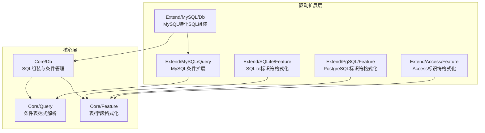
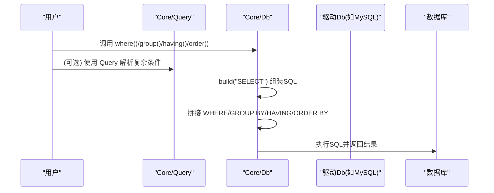
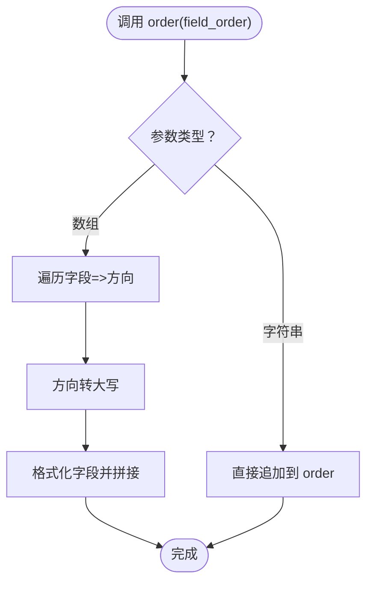
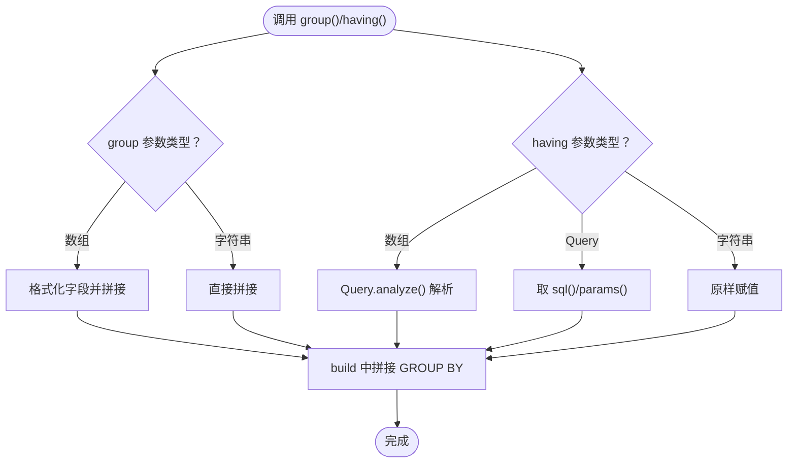
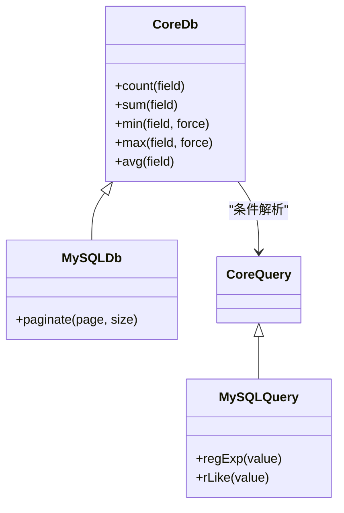
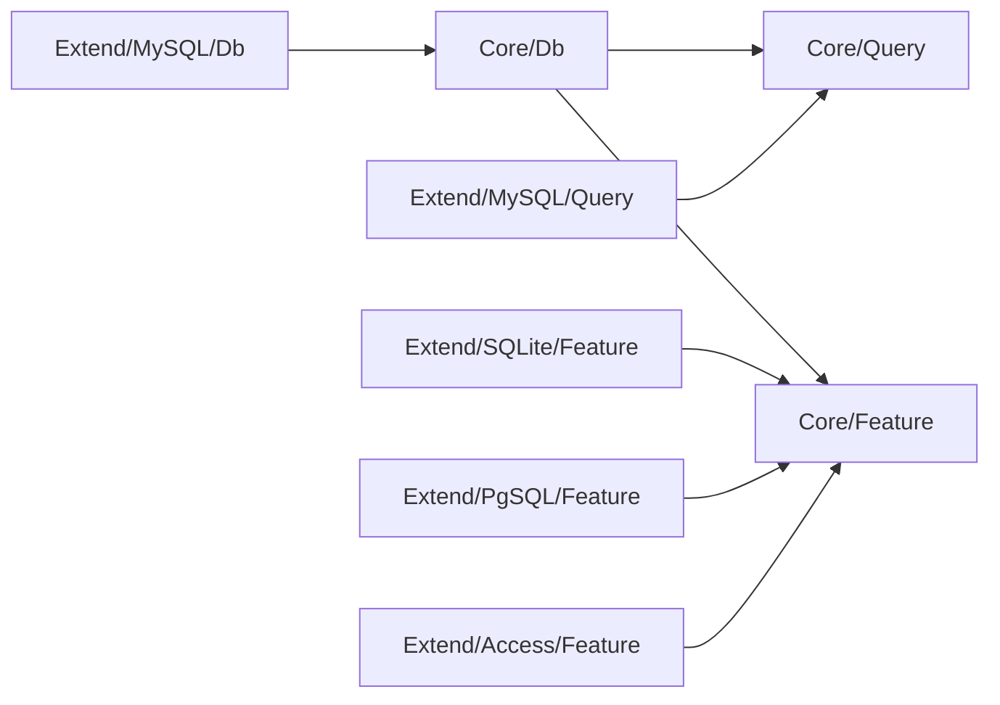

# 排序与分组

<cite>
**本文引用的文件**
- [src/Core/Db.php](file://src/Core/Db.php)
- [src/Core/Query.php](file://src/Core/Query.php)
- [src/Extend/MySQL/Db.php](file://src/Extend/MySQL/Db.php)
- [src/Extend/MySQL/Query.php](file://src/Extend/MySQL/Query.php)
- [src/Core/Feature.php](file://src/Core/Feature.php)
- [src/Extend/SQLite/Feature.php](file://src/Extend/SQLite/Feature.php)
- [src/Extend/PgSQL/Feature.php](file://src/Extend/PgSQL/Feature.php)
- [src/Extend/Access/Feature.php](file://src/Extend/Access/Feature.php)
- [examples/db_select.php](file://examples/db_select.php)
- [composer.json](file://composer.json)
</cite>

## 目录
1. [简介](#简介)
2. [项目结构](#项目结构)
3. [核心组件](#核心组件)
4. [架构总览](#架构总览)
5. [详细组件分析](#详细组件分析)
6. [依赖关系分析](#依赖关系分析)
7. [性能考量](#性能考量)
8. [故障排查指南](#故障排查指南)
9. [结论](#结论)
10. [附录](#附录)

## 简介
本文聚焦 FizeDatabase 查询构建器的“排序（ORDER BY）与分组（GROUP BY）”能力，系统阐述：
- ORDER BY 的实现方式：单字段与多字段排序、升序/降序控制
- GROUP BY 的使用方法：与聚合函数配合、HAVING 的应用场景与与 WHERE 的区别
- 实战示例：统计数据查询、报表生成等常见业务场景
- 性能影响与优化策略：索引、覆盖索引、避免不必要的排序与分组

## 项目结构
围绕排序与分组功能，核心代码位于 Core 与驱动扩展层：
- Core 层提供通用的 SQL 组装与条件解析能力
- 驱动扩展层（如 MySQL、PgSQL、SQLite、Access）提供差异化特性与方言支持
- Query 类负责条件表达式的解析与拼接

图表来源
- [src/Core/Db.php:13-120](file://src/Core/Db.php#L13-L120)
- [src/Core/Query.php:13-60](file://src/Core/Query.php#L13-L60)
- [src/Core/Feature.php:10-32](file://src/Core/Feature.php#L10-L32)
- [src/Extend/MySQL/Db.php:11-20](file://src/Extend/MySQL/Db.php#L11-L20)
- [src/Extend/MySQL/Query.php:12-20](file://src/Extend/MySQL/Query.php#L12-L20)
- [src/Extend/SQLite/Feature.php:8-30](file://src/Extend/SQLite/Feature.php#L8-L30)
- [src/Extend/PgSQL/Feature.php:8-30](file://src/Extend/PgSQL/Feature.php#L8-L30)
- [src/Extend/Access/Feature.php:8-50](file://src/Extend/Access/Feature.php#L8-L50)

章节来源
- [src/Core/Db.php:13-120](file://src/Core/Db.php#L13-L120)
- [src/Core/Query.php:13-60](file://src/Core/Query.php#L13-L60)
- [src/Core/Feature.php:10-32](file://src/Core/Feature.php#L10-L32)
- [src/Extend/MySQL/Db.php:11-20](file://src/Extend/MySQL/Db.php#L11-L20)
- [src/Extend/MySQL/Query.php:12-20](file://src/Extend/MySQL/Query.php#L12-L20)
- [src/Extend/SQLite/Feature.php:8-30](file://src/Extend/SQLite/Feature.php#L8-L30)
- [src/Extend/PgSQL/Feature.php:8-30](file://src/Extend/PgSQL/Feature.php#L8-L30)
- [src/Extend/Access/Feature.php:8-50](file://src/Extend/Access/Feature.php#L8-L50)

## 核心组件
- Core/Db：提供 field、group、having、order、where、select 等方法；负责将各子句拼接到最终 SQL 中
- Core/Query：提供条件表达式解析、数组条件分析、查询器合并等能力
- 驱动扩展 Db/Query：在 Core 基础上补充方言特性（如 MySQL 的 REGEXP、LIMIT 等）

章节来源
- [src/Core/Db.php:283-325](file://src/Core/Db.php#L283-L325)
- [src/Core/Db.php:361-393](file://src/Core/Db.php#L361-L393)
- [src/Core/Query.php:383-568](file://src/Core/Query.php#L383-L568)
- [src/Extend/MySQL/Query.php:12-54](file://src/Extend/MySQL/Query.php#L12-L54)

## 架构总览
排序与分组在 SQL 组装阶段的顺序如下：WHERE → GROUP BY → HAVING → ORDER BY。Core/Db 在 build 方法中按此顺序拼接子句。

图表来源
- [src/Core/Db.php:583-637](file://src/Core/Db.php#L583-L637)
- [src/Core/Db.php:618-630](file://src/Core/Db.php#L618-L630)
- [src/Core/Query.php:521-568](file://src/Core/Query.php#L521-L568)

章节来源
- [src/Core/Db.php:583-637](file://src/Core/Db.php#L583-L637)
- [src/Core/Db.php:618-630](file://src/Core/Db.php#L618-L630)

## 详细组件分析

### ORDER BY 子句
- 支持单字段与多字段排序，支持升序/降序控制
- 多字段排序时，按传入顺序依次作为排序键
- 升降序通过传入“ASC/DESC”控制，内部统一转换为大写

实现要点
- Core/Db::order 接收数组或字符串
  - 数组形式：键为字段名，值为排序方向（如 ASC/DESC）
  - 字符串形式：原样拼接（需自行保证语法正确）
- 字段名通过 formatField 格式化，避免歧义与注入风险
- ORDER BY 子句在 build 中最后拼接

图表来源
- [src/Core/Db.php:303-325](file://src/Core/Db.php#L303-L325)
- [src/Core/Feature.php:24-31](file://src/Core/Feature.php#L24-L31)

章节来源
- [src/Core/Db.php:303-325](file://src/Core/Db.php#L303-L325)
- [src/Core/Feature.php:24-31](file://src/Core/Feature.php#L24-L31)

### GROUP BY 子句与 HAVING 子句
- Core/Db::group 支持数组或字符串形式的分组字段
  - 数组时自动格式化并以逗号连接
  - 字符串时原样拼接（需自行保证语法正确）
- Core/Db::having 支持数组、Query 对象或原生 SQL
  - 数组通过 Core/Query.analyze 解析
  - Query 对象直接取其 sql()/params()
  - 原生 SQL 与参数数组分别赋给 having/havingParams
- HAVING 与 WHERE 的区别
  - WHERE 作用于原始行集合，过滤参与聚合的行
  - HAVING 作用于聚合后的分组结果，对分组进行筛选

图表来源
- [src/Core/Db.php:283-300](file://src/Core/Db.php#L283-L300)
- [src/Core/Db.php:361-393](file://src/Core/Db.php#L361-L393)
- [src/Core/Query.php:521-568](file://src/Core/Query.php#L521-L568)

章节来源
- [src/Core/Db.php:283-300](file://src/Core/Db.php#L283-L300)
- [src/Core/Db.php:361-393](file://src/Core/Db.php#L361-L393)
- [src/Core/Query.php:521-568](file://src/Core/Query.php#L521-L568)

### 聚合函数与统计查询
- Core/Db 提供常用聚合方法：count、sum、min、max、avg
- 与 group/having 配合，可实现分组统计、报表生成等场景

图表来源
- [src/Core/Db.php:791-845](file://src/Core/Db.php#L791-L845)
- [src/Extend/MySQL/Db.php:187-203](file://src/Extend/MySQL/Db.php#L187-L203)
- [src/Extend/MySQL/Query.php:12-54](file://src/Extend/MySQL/Query.php#L12-L54)

章节来源
- [src/Core/Db.php:791-845](file://src/Core/Db.php#L791-L845)
- [src/Extend/MySQL/Db.php:187-203](file://src/Extend/MySQL/Db.php#L187-L203)
- [src/Extend/MySQL/Query.php:12-54](file://src/Extend/MySQL/Query.php#L12-L54)

### 示例：排序与分组实战
以下示例展示常见业务场景，基于 Core/Db 的 API 组合实现：

- 单字段降序排序
  - 使用 order("field DESC")
- 多字段排序（先按类别升序，再按金额降序）
  - 使用 order(["category"=>"ASC","amount"=>"DESC"])
- 分组统计与筛选
  - 使用 group("department") 与 having(["salary_avg"=>["GT",5000]]) 配合 avg 聚合
- 报表生成
  - 使用 field(["dept","count(*)","sum(amount)"])、group("dept")、order(["count(*)"=>"DESC"])

说明
- 上述示例均通过 Core/Db 的链式 API 组合实现，最终由 build 拼接为标准 SQL

章节来源
- [src/Core/Db.php:283-325](file://src/Core/Db.php#L283-L325)
- [src/Core/Db.php:361-393](file://src/Core/Db.php#L361-L393)
- [src/Core/Db.php:791-845](file://src/Core/Db.php#L791-L845)

## 依赖关系分析
- Core/Db 依赖 Core/Feature 进行表/字段格式化
- 驱动扩展 Db/Query 依赖 Core/Query 的条件解析能力
- 不同数据库方言通过 Feature trait 提供差异化的标识符格式化

图表来源
- [src/Core/Db.php:13-120](file://src/Core/Db.php#L13-L120)
- [src/Core/Query.php:13-60](file://src/Core/Query.php#L13-L60)
- [src/Core/Feature.php:10-32](file://src/Core/Feature.php#L10-L32)
- [src/Extend/MySQL/Db.php:11-20](file://src/Extend/MySQL/Db.php#L11-L20)
- [src/Extend/MySQL/Query.php:12-20](file://src/Extend/MySQL/Query.php#L12-L20)
- [src/Extend/SQLite/Feature.php:8-30](file://src/Extend/SQLite/Feature.php#L8-L30)
- [src/Extend/PgSQL/Feature.php:8-30](file://src/Extend/PgSQL/Feature.php#L8-L30)
- [src/Extend/Access/Feature.php:8-50](file://src/Extend/Access/Feature.php#L8-L50)

章节来源
- [src/Core/Db.php:13-120](file://src/Core/Db.php#L13-L120)
- [src/Core/Query.php:13-60](file://src/Core/Query.php#L13-L60)
- [src/Core/Feature.php:10-32](file://src/Core/Feature.php#L10-L32)
- [src/Extend/MySQL/Db.php:11-20](file://src/Extend/MySQL/Db.php#L11-L20)
- [src/Extend/MySQL/Query.php:12-20](file://src/Extend/MySQL/Query.php#L12-L20)
- [src/Extend/SQLite/Feature.php:8-30](file://src/Extend/SQLite/Feature.php#L8-L30)
- [src/Extend/PgSQL/Feature.php:8-30](file://src/Extend/PgSQL/Feature.php#L8-L30)
- [src/Extend/Access/Feature.php:8-50](file://src/Extend/Access/Feature.php#L8-L50)

## 性能考量
- 排序（ORDER BY）
  - 尽量使用索引列作为排序键，避免对无索引列排序导致的临时排序与文件排序
  - 多字段排序时，优先选择最能区分记录的列作为首排序键
  - 仅在必要时使用 ORDER BY，避免对大数据集进行昂贵的排序
- 分组（GROUP BY）
  - 使用覆盖索引（包含分组与聚合所需的所有列）减少回表
  - 控制分组基数，避免过度细分导致内存压力与临时表
  - 合理使用 HAVING 过滤后再分组，减少中间结果集规模
- 聚合函数
  - count(*) 通常最快；count(列) 会忽略 NULL 值
  - sum/min/max/avg 在某些数据库上可利用索引范围优化
- 方言差异
  - MySQL 的 LIMIT 与分页：结合索引与合适的 offset 策略
  - PostgreSQL/SQLite 的标识符格式化对索引可见性与查询计划有影响，需确保格式化规则与索引一致

## 故障排查指南
- ORDER BY 无效
  - 检查排序字段是否在索引中；确认字段名格式化是否正确
  - 若使用字符串原样拼接，检查大小写与关键字冲突
- GROUP BY 报错或结果异常
  - 确认分组字段已在 SELECT 中出现（严格模式下）
  - 检查字段名格式化是否与表结构一致
- HAVING 未生效
  - 确认聚合函数是否正确使用（如 avg、sum 等）
  - 区分 WHERE 与 HAVING 的作用时机：WHERE 在分组前过滤，HAVING 在分组后过滤
- SQL 注入与格式化
  - 优先使用 Query.analyze 或链式 API，避免直接拼接 SQL
  - 确保 formatField/formatTable 的方言适配正确

章节来源
- [src/Core/Db.php:283-325](file://src/Core/Db.php#L283-L325)
- [src/Core/Db.php:361-393](file://src/Core/Db.php#L361-L393)
- [src/Core/Feature.php:24-31](file://src/Core/Feature.php#L24-L31)
- [src/Extend/SQLite/Feature.php:32-55](file://src/Extend/SQLite/Feature.php#L32-L55)
- [src/Extend/PgSQL/Feature.php:16-29](file://src/Extend/PgSQL/Feature.php#L16-L29)
- [src/Extend/Access/Feature.php:16-49](file://src/Extend/Access/Feature.php#L16-L49)

## 结论
FizeDatabase 的排序与分组能力建立在清晰的链式 API 之上，通过 Core/Db 的 build 流程将 WHERE/GROUP BY/HAVING/ORDER BY 有序拼接。合理运用数组形式的多字段排序、与聚合函数配合的分组统计以及 HAVING 的分组后筛选，可高效实现统计数据查询与报表生成等常见业务需求。同时，遵循索引设计与覆盖索引原则，可显著降低排序与分组的性能开销。

## 附录
- 快速参考
  - 排序：order(["field"=>"ASC/DESC"]) 或 order("field DESC")
  - 分组：group(["dept","job"]) 或 group("dept")
  - 筛选：having(["avg_salary"=>["GT",5000]])
  - 聚合：count/sum/min/max/avg
- 示例入口
  - 参考示例脚本与 Composer 自动加载配置，快速运行与验证

章节来源
- [examples/db_select.php:1-22](file://examples/db_select.php#L1-L22)
- [composer.json:11-15](file://composer.json#L11-L15)