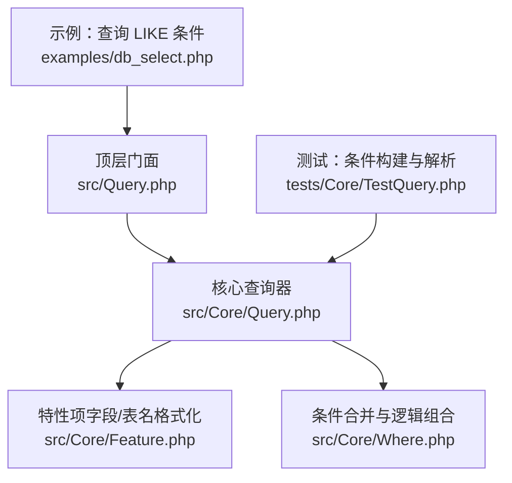
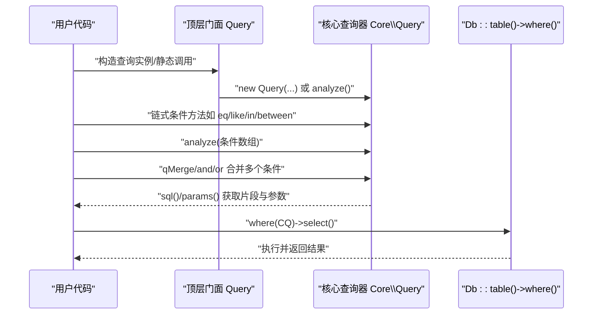
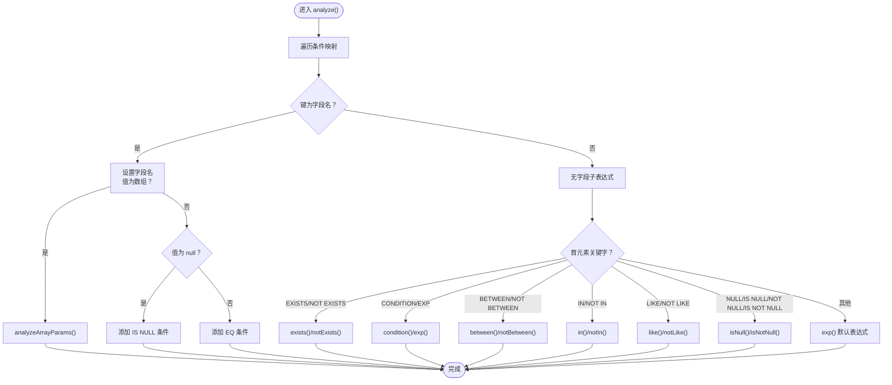
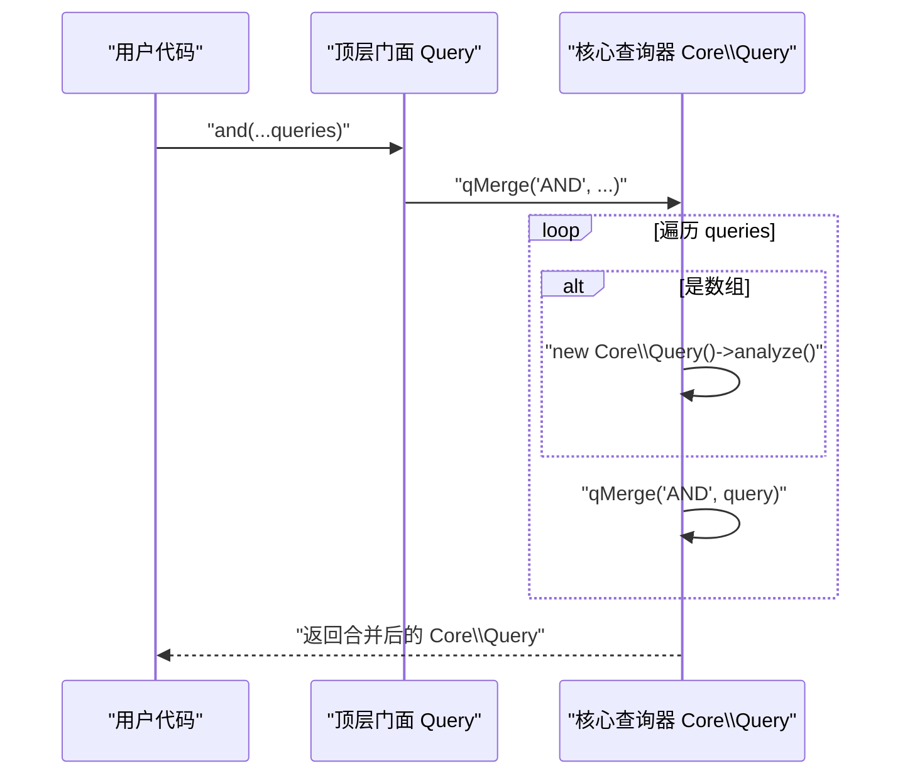
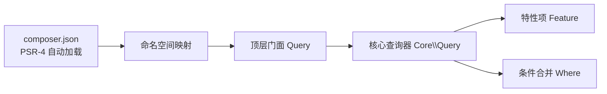

# 条件构建

<cite>
**本文引用的文件**
- [src/Core/Query.php](file://src/Core/Query.php)
- [src/Core/Where.php](file://src/Core/Where.php)
- [src/Query.php](file://src/Query.php)
- [examples/db_select.php](file://examples/db_select.php)
- [tests/Core/TestQuery.php](file://tests/Core/TestQuery.php)
- [composer.json](file://composer.json)
- [src/Core/Feature.php](file://src/Core/Feature.php)
</cite>

## 目录
1. [简介](#简介)
2. [项目结构](#项目结构)
3. [核心组件](#核心组件)
4. [架构总览](#架构总览)
5. [详细组件分析](#详细组件分析)
6. [依赖关系分析](#依赖关系分析)
7. [性能考量](#性能考量)
8. [故障排查指南](#故障排查指南)
9. [结论](#结论)
10. [附录](#附录)

## 简介
本章节聚焦于 FizeDatabase 查询构建器的条件构建能力，系统讲解如何通过多种比较操作符（等于、不等于、大于、小于、LIKE、IN、BETWEEN）与 EXISTS/NOT EXISTS 子查询，以及 AND/OR 逻辑组合，构建安全、灵活且可维护的查询条件。重点覆盖：
- 各类比较操作符的使用方法与行为差异
- 复杂条件的组合方式（AND、OR）
- 条件数组的解析机制与 analyze() 方法工作原理
- 安全性与 SQL 注入防护策略
- 丰富示例：单条件、多条件组合、嵌套条件等

## 项目结构
FizeDatabase 的条件构建主要由 Core 层的 Query 类与 Where 特性类提供，顶层 Query 静态门面负责构造具体数据库驱动下的 Query 实例，并提供条件数组解析与查询对象合并能力。

图表来源
- [src/Query.php:1-130](file://src/Query.php#L1-L130)
- [src/Core/Query.php:1-621](file://src/Core/Query.php#L1-L621)
- [src/Core/Where.php:1-66](file://src/Core/Where.php#L1-L66)
- [src/Core/Feature.php:1-33](file://src/Core/Feature.php#L1-L33)
- [examples/db_select.php:1-22](file://examples/db_select.php#L1-L22)
- [tests/Core/TestQuery.php:1-787](file://tests/Core/TestQuery.php#L1-L787)

章节来源
- [src/Query.php:1-130](file://src/Query.php#L1-L130)
- [src/Core/Query.php:1-621](file://src/Core/Query.php#L1-L621)
- [src/Core/Where.php:1-66](file://src/Core/Where.php#L1-L66)
- [src/Core/Feature.php:1-33](file://src/Core/Feature.php#L1-L33)
- [examples/db_select.php:1-22](file://examples/db_select.php#L1-L22)
- [tests/Core/TestQuery.php:1-787](file://tests/Core/TestQuery.php#L1-L787)

## 核心组件
- 顶层门面 Query：负责根据数据库类型构造具体驱动的 Query 实例，提供 analyze()、qMerge()/and()/or() 等静态入口，简化调用。
- 核心查询器 Core\Query：提供所有条件构建方法（gt/egt/lt/elt/eq/neq、like/notLike、in/notIn、between/notBetween、isNull/isNotNull、exists/notExists、exp、condition），以及 analyze() 数组解析与查询对象合并（qMerge/qAnd/qOr）。
- 特性项 Feature：提供字段/表名格式化钩子，便于扩展不同数据库的标识符处理。
- 条件合并 Where：提供逻辑组合（AND/OR）与查询对象合并能力，支持数组与 Query 对象混合合并。

章节来源
- [src/Query.php:1-130](file://src/Query.php#L1-L130)
- [src/Core/Query.php:1-621](file://src/Core/Query.php#L1-L621)
- [src/Core/Where.php:1-66](file://src/Core/Where.php#L1-L66)
- [src/Core/Feature.php:1-33](file://src/Core/Feature.php#L1-L33)

## 架构总览
条件构建的整体流程如下：
- 通过顶层门面构造 Query 实例
- 使用链式方法或 analyze() 数组解析构建条件
- 使用 qMerge()/and()/or() 组合多个条件或查询对象
- 最终通过 Db::table()->where() 执行查询

图表来源
- [src/Query.php:35-129](file://src/Query.php#L35-L129)
- [src/Core/Query.php:92-105](file://src/Core/Query.php#L92-L105)
- [src/Core/Query.php:521-568](file://src/Core/Query.php#L521-L568)
- [src/Core/Query.php:585-619](file://src/Core/Query.php#L585-L619)

## 详细组件分析

### 比较操作符与条件方法
- 等于/不等于/大于/小于/大于等于/小于等于
  - 提供 eq/neq/gt/lt/egt/elt 等便捷方法
  - 底层统一委托 condition()，支持自动参数绑定与安全拼接
- LIKE/NOT LIKE
  - like()/notLike() 支持绑定参数与前置修饰
- IN/NOT IN
  - in()/notIn() 支持数组与字符串两种输入；当包含特殊字符时自动使用占位符，避免注入风险
- BETWEEN/NOT BETWEEN
  - between()/notBetween() 自动识别参数是否需要占位符
- IS NULL/IS NOT NULL
  - isNull()/isNotNull() 直接生成相应表达式

章节来源
- [src/Core/Query.php:166-245](file://src/Core/Query.php#L166-L245)
- [src/Core/Query.php:295-338](file://src/Core/Query.php#L295-L338)
- [src/Core/Query.php:346-377](file://src/Core/Query.php#L346-L377)

### EXP 与通用 condition
- exp()
  - 允许直接传入表达式与参数，支持自动参数绑定
- condition()
  - 核心条件拼装方法，支持三种参数模式：
    - params=false：禁用参数绑定，直接拼接（仅在明确必要时使用）
    - params=null 且 value 为字符串：若字符串包含逗号、等号、比较符、引号、括号、问号或空白，则强制使用占位符绑定
    - 其他：按传入 params 绑定

章节来源
- [src/Core/Query.php:108-164](file://src/Core/Query.php#L108-L164)

### 条件数组解析 analyze()
analyze() 支持多种键值形态与参数形式，自动推断字段、操作符、值与组合逻辑：

- 键为字段名
  - 值为数组：进入 analyzeArrayParams() 分支解析
  - 值为 null：等价 IS NULL
  - 值为标量：等价 EQ
- 键为空或非字符串
  - 视为无字段子表达式，首元素作为关键字（如 EXISTS/NOT EXISTS/CONDITION/EXP/BETWEEN/IN/LIKE/NULL/IS NULL/NOT NULL/NOT BETWEEN/NOT IN/NOT LIKE 等）

analyzeArrayParams() 关键分支：
- BETWEEN/NOT BETWEEN：支持 2/3/4 参数形式，自动推断边界与组合逻辑
- CONDITION/EXP：支持判断符、值、参数与组合逻辑的灵活组合
- EQ/NEQ/GT/LT/EGT/ELT/IN/NOT IN/LIKE/NOT LIKE/NULL/IS NULL/NOT NULL/IS NOT NULL：大小写不敏感，支持别名
- 默认：视为完整表达式，交由 exp() 处理

图表来源
- [src/Core/Query.php:521-568](file://src/Core/Query.php#L521-L568)
- [src/Core/Query.php:383-512](file://src/Core/Query.php#L383-L512)

章节来源
- [src/Core/Query.php:521-568](file://src/Core/Query.php#L521-L568)
- [src/Core/Query.php:383-512](file://src/Core/Query.php#L383-L512)

### 逻辑组合：AND/OR 与查询对象合并
- qMerge()/qAnd()/qOr()
  - 支持传入 Query 对象或可被 analyze() 解析的数组
  - 自动将多个条件以括号包裹并用 AND/OR 连接
  - 合并后参数数组保持一致，便于执行阶段统一绑定
- 顶层门面提供的 and()/or()/qMerge() 静态方法
  - 便于快速组合多个条件或数组

图表来源
- [src/Query.php:85-129](file://src/Query.php#L85-L129)
- [src/Core/Query.php:585-619](file://src/Core/Query.php#L585-L619)

章节来源
- [src/Query.php:85-129](file://src/Query.php#L85-L129)
- [src/Core/Query.php:585-619](file://src/Core/Query.php#L585-L619)

### 示例与用法指引
以下示例均来自测试与示例文件，展示不同场景下的条件构建方式（路径引用代替具体代码内容）：
- 单字段 LIKE 条件：[examples/db_select.php:15-21](file://examples/db_select.php#L15-L21)
- BETWEEN/NOT BETWEEN：[tests/Core/TestQuery.php:386-414](file://tests/Core/TestQuery.php#L386-L414)
- CONDITION/EXP/原始表达式：[tests/Core/TestQuery.php:505-532](file://tests/Core/TestQuery.php#L505-L532)
- IN/NOT IN：[tests/Core/TestQuery.php:554-582](file://tests/Core/TestQuery.php#L554-L582)
- LIKE/NOT LIKE：[tests/Core/TestQuery.php:584-612](file://tests/Core/TestQuery.php#L584-L612)
- NULL/IS NULL/IS NOT NULL：[tests/Core/TestQuery.php:683-704](file://tests/Core/TestQuery.php#L683-L704)
- EXISTS/NOT EXISTS：[tests/Core/TestQuery.php:708-745](file://tests/Core/TestQuery.php#L708-L745)
- 多条件组合（AND/OR）：[tests/Core/TestQuery.php:747-770](file://tests/Core/TestQuery.php#L747-L770)

章节来源
- [examples/db_select.php:15-21](file://examples/db_select.php#L15-L21)
- [tests/Core/TestQuery.php:386-414](file://tests/Core/TestQuery.php#L386-L414)
- [tests/Core/TestQuery.php:505-532](file://tests/Core/TestQuery.php#L505-L532)
- [tests/Core/TestQuery.php:554-582](file://tests/Core/TestQuery.php#L554-L582)
- [tests/Core/TestQuery.php:584-612](file://tests/Core/TestQuery.php#L584-L612)
- [tests/Core/TestQuery.php:683-704](file://tests/Core/TestQuery.php#L683-L704)
- [tests/Core/TestQuery.php:708-745](file://tests/Core/TestQuery.php#L708-L745)
- [tests/Core/TestQuery.php:747-770](file://tests/Core/TestQuery.php#L747-L770)

### 安全性与 SQL 注入防护
- 自动参数绑定
  - in()/between()/condition() 在检测到值包含特殊字符时，自动使用占位符与参数数组绑定，避免注入
  - exp() 支持显式传入参数数组进行绑定
- condition() 的三种绑定策略
  - params=false：禁用绑定（仅在明确必要时使用）
  - params=null 且 value 为字符串：若字符串包含逗号、等号、比较符、引号、括号、问号或空白，则强制绑定
  - 其他：按传入 params 绑定
- 字段/表名格式化
  - 通过 Feature trait 的 formatField/formatTable 提供扩展点，便于在不同数据库中对标识符进行转义或格式化

章节来源
- [src/Core/Query.php:295-338](file://src/Core/Query.php#L295-L338)
- [src/Core/Query.php:235-244](file://src/Core/Query.php#L235-L244)
- [src/Core/Query.php:145-164](file://src/Core/Query.php#L145-L164)
- [src/Core/Feature.php:18-31](file://src/Core/Feature.php#L18-L31)

## 依赖关系分析
- 顶层门面依赖核心查询器与数据库驱动命名空间
- 核心查询器依赖特性项 Trait 以提供格式化能力
- 条件合并 Where 与核心查询器协同，支持查询对象合并与逻辑组合

图表来源
- [composer.json:11-18](file://composer.json#L11-L18)
- [src/Query.php:24-39](file://src/Query.php#L24-L39)
- [src/Core/Query.php:15](file://src/Core/Query.php#L15)
- [src/Core/Where.php:30-64](file://src/Core/Where.php#L30-L64)

章节来源
- [composer.json:11-18](file://composer.json#L11-L18)
- [src/Query.php:24-39](file://src/Query.php#L24-L39)
- [src/Core/Query.php:15](file://src/Core/Query.php#L15)
- [src/Core/Where.php:30-64](file://src/Core/Where.php#L30-L64)

## 性能考量
- 占位符与参数绑定
  - in()/between()/condition() 在检测到特殊字符时使用占位符，避免重复转义与字符串拼接开销
- 表达式直写
  - exp() 支持直接拼接表达式，适合复杂表达式场景；但需确保输入可控，避免不必要的字符串拼接
- 查询对象合并
  - qMerge()/and()/or() 会合并参数数组，减少执行阶段的参数传递成本

[本节为通用指导，无需列出章节来源]

## 故障排查指南
- LIKE/IN/BETWEEN 参数未绑定导致注入或报错
  - 检查值是否包含特殊字符，确认是否触发了占位符绑定
  - 若需要显式控制绑定，使用 condition()/exp() 的 params 参数
- EXISTS/NOT EXISTS 误用字段名
  - exists()/notExists() 不依赖 object，若设置了 object 会在内部暂存并还原，避免影响
- 组合逻辑错误
  - analyze() 默认将组合逻辑设为 AND，可在数组中显式传入组合逻辑参数
- 多次对同一字段设置条件
  - 使用数组键为字符串的多条规则，或通过多次调用链式方法实现

章节来源
- [src/Core/Query.php:267-287](file://src/Core/Query.php#L267-L287)
- [src/Core/Query.php:524-568](file://src/Core/Query.php#L524-L568)
- [tests/Core/TestQuery.php:747-770](file://tests/Core/TestQuery.php#L747-L770)

## 结论
FizeDatabase 的条件构建器通过清晰的方法族、灵活的数组解析与严谨的参数绑定策略，提供了安全、易用且可扩展的条件构建能力。结合 AND/OR 组合与查询对象合并，能够覆盖从简单单条件到复杂嵌套查询的广泛场景。建议在涉及动态输入时优先使用自动绑定策略，避免手写 SQL 拼接带来的安全风险。

[本节为总结性内容，无需列出章节来源]

## 附录
- 快速参考
  - 比较：eq/neq/gt/lt/egt/elt
  - 范围：between/notBetween
  - 模糊：like/notLike
  - 集合：in/notIn
  - 空值：isNull/isNotNull
  - 子查询：exists/notExists
  - 表达式：exp(condition)
  - 数组解析：analyze()
  - 组合：and()/or()/qMerge()

[本节为概览性内容，无需列出章节来源]