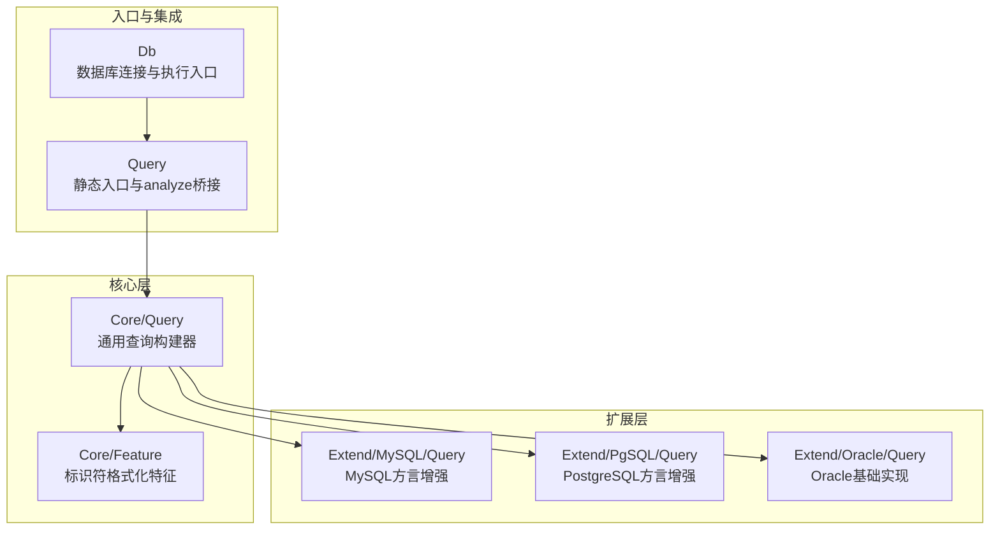
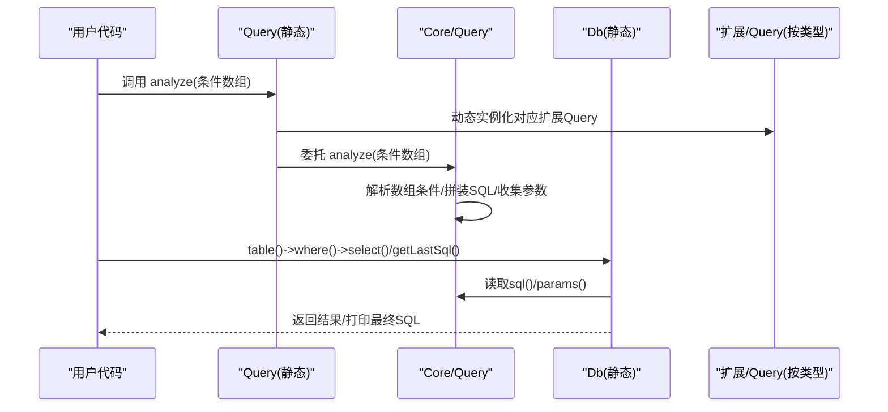
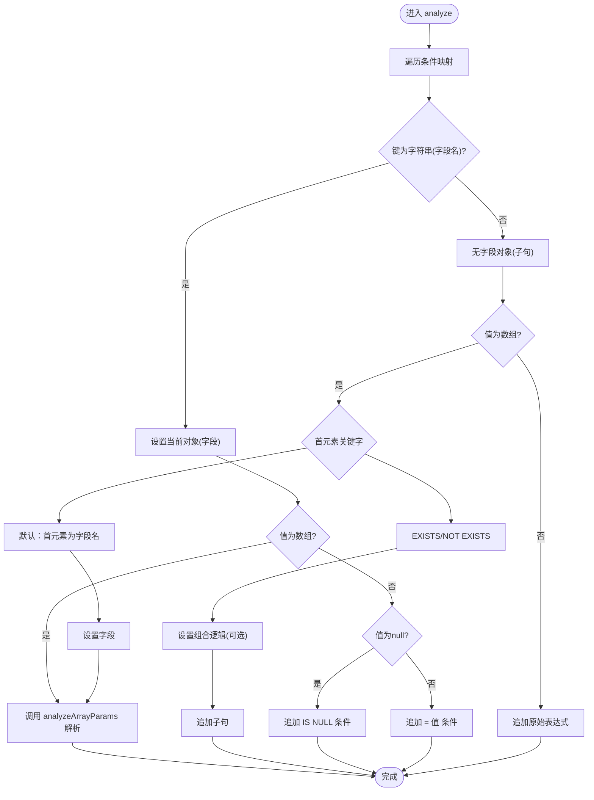
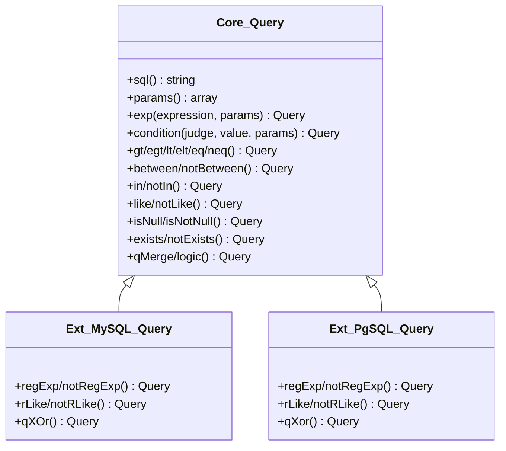
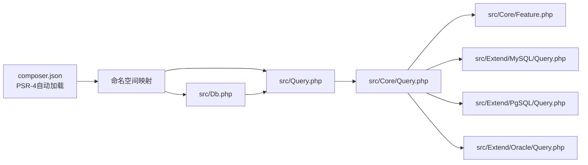

# 查询分析与优化

<cite>
**本文引用的文件**
- [src/Query.php](file://src/Query.php)
- [src/Core/Query.php](file://src/Core/Query.php)
- [src/Core/Feature.php](file://src/Core/Feature.php)
- [src/Db.php](file://src/Db.php)
- [src/Extend/MySQL/Query.php](file://src/Extend/MySQL/Query.php)
- [src/Extend/PgSQL/Query.php](file://src/Extend/PgSQL/Query.php)
- [src/Extend/PgSQL/Feature.php](file://src/Extend/PgSQL/Feature.php)
- [src/Extend/SQLSRV/Feature.php](file://src/Extend/SQLSRV/Feature.php)
- [src/Extend/Oracle/Query.php](file://src/Extend/Oracle/Query.php)
- [src/Extend/MySQL/Feature.php](file://src/Extend/MySQL/Feature.php)
- [src/Extend/SQLite/Feature.php](file://src/Extend/SQLite/Feature.php)
- [src/Extend/Access/Feature.php](file://src/Extend/Access/Feature.php)
- [examples/db_select.php](file://examples/db_select.php)
- [composer.json](file://composer.json)
</cite>

## 目录
1. [简介](#简介)
2. [项目结构](#项目结构)
3. [核心组件](#核心组件)
4. [架构总览](#架构总览)
5. [详细组件分析](#详细组件分析)
6. [依赖关系分析](#依赖关系分析)
7. [性能考量](#性能考量)
8. [故障排查指南](#故障排查指南)
9. [结论](#结论)
10. [附录](#附录)

## 简介
本文件系统性阐述 FizeDatabase 查询构建器的查询分析与优化能力，重点覆盖以下方面：
- analyze() 方法的工作机制与条件数组格式规范
- 条件数组的解析流程与兼容策略
- SQL 生成机制与多数据库方言适配（含标识符转义）
- 查询性能分析方法与工具使用建议
- 查询优化最佳实践：索引使用、查询重写、执行计划分析
- 常见性能问题的识别与解决思路

## 项目结构
FizeDatabase 采用“核心层 + 扩展层”的分层设计：
- 核心层提供通用查询构建能力（条件拼装、SQL 片段与参数管理、组合逻辑等）
- 扩展层针对不同数据库类型提供方言适配与特性增强（如 MySQL 的 REGEXP、PostgreSQL 的 XOR 组合）

图表来源
- [src/Query.php:12-129](file://src/Query.php#L12-L129)
- [src/Core/Query.php:13-621](file://src/Core/Query.php#L13-L621)
- [src/Core/Feature.php:10-32](file://src/Core/Feature.php#L10-L32)
- [src/Extend/MySQL/Query.php:12-90](file://src/Extend/MySQL/Query.php#L12-L90)
- [src/Extend/PgSQL/Query.php:12-111](file://src/Extend/PgSQL/Query.php#L12-L111)
- [src/Extend/Oracle/Query.php:12-15](file://src/Extend/Oracle/Query.php#L12-L15)
- [src/Db.php:13-140](file://src/Db.php#L13-L140)

章节来源
- [src/Query.php:12-129](file://src/Query.php#L12-L129)
- [src/Core/Query.php:13-621](file://src/Core/Query.php#L13-L621)
- [src/Db.php:13-140](file://src/Db.php#L13-L140)

## 核心组件
- 查询构建器入口：静态类负责根据数据库类型选择具体实现，并提供 analyze()/qMerge()/and()/or() 等便捷方法
- 核心查询器：负责条件拼装、占位符管理、SQL 片段生成、参数绑定、查询组合
- 方言适配特征：对表名/字段名进行差异化转义，确保跨数据库兼容
- 数据库入口：封装连接、执行、事务与 SQL 日志输出

章节来源
- [src/Query.php:12-129](file://src/Query.php#L12-L129)
- [src/Core/Query.php:13-621](file://src/Core/Query.php#L13-L621)
- [src/Core/Feature.php:10-32](file://src/Core/Feature.php#L10-L32)
- [src/Db.php:13-140](file://src/Db.php#L13-L140)

## 架构总览
查询构建器从“静态入口”进入，经由“核心查询器”生成 SQL 片段与参数，再由“数据库入口”执行或输出。

图表来源
- [src/Query.php:69-129](file://src/Query.php#L69-L129)
- [src/Core/Query.php:521-568](file://src/Core/Query.php#L521-L568)
- [src/Db.php:136-140](file://src/Db.php#L136-L140)

## 详细组件分析

### analyze() 方法工作机制与条件数组规范
- 入口：静态入口类提供 analyze()，内部委托到当前数据库类型的扩展查询器
- 核心解析：核心查询器逐条解析键值对，支持“字段名键”和“无键子句”
- 条件数组格式要点
  - 字段名键：键为字段名，值为标量或数组
  - 子句无键：值为数组时，首元素为关键字（如 EXISTS/NOT EXISTS/IN/NOT IN/LIKE 等），其余为参数；值为字符串时视为原始表达式
  - 数组条件的参数形态
    - 二元：[运算符, 值]
    - 三元：[运算符, 值, 组合逻辑] 或 [运算符, 值, 绑定参数]
    - 多元：[运算符, 值, 绑定参数, 组合逻辑] 等
  - 特殊关键字
    - BETWEEN/NOT BETWEEN：支持多种参数形态，自动归一化
    - CONDITION：显式指定运算符与值
    - EXP：直接拼接表达式，可选绑定参数
    - NULL/IS NULL / NOT NULL/IS NOT NULL：支持在第二位传入组合逻辑
    - EXISTS/NOT EXISTS：需提供子查询表达式与可选绑定参数
- 组合逻辑
  - 默认按 AND 组合；可在数组条件第三位或通过逻辑方法显式设置
  - analyze() 会为每条规则设置默认逻辑，避免遗漏

图表来源
- [src/Core/Query.php:521-568](file://src/Core/Query.php#L521-L568)
- [src/Core/Query.php:383-512](file://src/Core/Query.php#L383-L512)

章节来源
- [src/Query.php:69-129](file://src/Query.php#L69-L129)
- [src/Core/Query.php:521-568](file://src/Core/Query.php#L521-L568)
- [src/Core/Query.php:383-512](file://src/Core/Query.php#L383-L512)

### SQL 生成机制与参数绑定
- 占位符约定：统一使用问号占位符
- 表达式拼装：exp() 将表达式与参数分别维护，支持自动/手动参数绑定
- 条件方法族：gt/egt/lt/elt/eq/neq/between/notBetween/in/notIn/like/notLike/isNull/isNotNull 等
- 子查询：exists/notExists 支持传入表达式与绑定参数
- 组合逻辑：qMerge/qAnd/qOr/qXOr（部分数据库扩展提供）将多个查询对象合并为复合条件

图表来源
- [src/Core/Query.php:92-621](file://src/Core/Query.php#L92-L621)
- [src/Extend/MySQL/Query.php:12-90](file://src/Extend/MySQL/Query.php#L12-L90)
- [src/Extend/PgSQL/Query.php:12-111](file://src/Extend/PgSQL/Query.php#L12-L111)

章节来源
- [src/Core/Query.php:92-621](file://src/Core/Query.php#L92-L621)
- [src/Extend/MySQL/Query.php:12-90](file://src/Extend/MySQL/Query.php#L12-L90)
- [src/Extend/PgSQL/Query.php:12-111](file://src/Extend/PgSQL/Query.php#L12-L111)

### 数据库方言适配与标识符转义
- 方言差异点
  - MySQL：使用反引号包裹标识符，支持 REGEXP/RLIKE/XOR 组合
  - PostgreSQL：使用双引号包裹标识符，支持 REGEXP/RLIKE/XOR 组合
  - SQL Server：使用方括号包裹标识符
  - Oracle/Access：使用双引号包裹标识符
- 转义策略
  - 当输入已是带定界符或包含子查询/别名等复杂表达式时，不做二次转义
  - 星号、表达式闭包等特殊场景保持原样
- 影响范围
  - 表名/字段名格式化仅影响标识符，不影响表达式内容

章节来源
- [src/Extend/MySQL/Feature.php:16-55](file://src/Extend/MySQL/Feature.php#L16-L55)
- [src/Extend/PgSQL/Feature.php:16-29](file://src/Extend/PgSQL/Feature.php#L16-L29)
- [src/Extend/SQLSRV/Feature.php:16-49](file://src/Extend/SQLSRV/Feature.php#L16-L49)
- [src/Extend/Oracle/Query.php:12-15](file://src/Extend/Oracle/Query.php#L12-L15)
- [src/Extend/Access/Feature.php:16-49](file://src/Extend/Access/Feature.php#L16-L49)

### SQL 生成与执行流程（示例）
- 示例展示：构造条件数组、拼接 where、限制条数、执行查询并输出最终 SQL
- 关键点：getDb()->table()->where()->limit()->select()，随后getDb()->getLastSql(real=true) 输出最终 SQL

章节来源
- [examples/db_select.php:15-21](file://examples/db_select.php#L15-L21)
- [src/Db.php:136-140](file://src/Db.php#L136-L140)

## 依赖关系分析
- 静态入口依赖扩展工厂动态创建具体查询器
- 核心查询器依赖特征 trait 提供的标识符格式化
- 数据库入口依赖模式工厂创建具体驱动实例

图表来源
- [composer.json:11-15](file://composer.json#L11-L15)
- [src/Query.php:12-129](file://src/Query.php#L12-L129)
- [src/Core/Query.php:13-621](file://src/Core/Query.php#L13-L621)
- [src/Core/Feature.php:10-32](file://src/Core/Feature.php#L10-L32)
- [src/Extend/MySQL/Query.php:12-90](file://src/Extend/MySQL/Query.php#L12-L90)
- [src/Extend/PgSQL/Query.php:12-111](file://src/Extend/PgSQL/Query.php#L12-L111)
- [src/Extend/Oracle/Query.php:12-15](file://src/Extend/Oracle/Query.php#L12-L15)
- [src/Db.php:13-140](file://src/Db.php#L13-L140)

章节来源
- [composer.json:11-15](file://composer.json#L11-L15)
- [src/Query.php:12-129](file://src/Query.php#L12-L129)
- [src/Db.php:13-140](file://src/Db.php#L13-L140)

## 性能考量
- 参数绑定与占位符
  - 使用问号占位符与参数数组，避免字符串拼接引发的注入风险与解析开销
  - 对包含特殊字符或表达式的值，自动采用占位符绑定，减少转义成本
- 条件拼装策略
  - 合理使用 BETWEEN/IN/EXISTS 等原生子句，避免手写复杂表达式
  - 在数组条件中明确组合逻辑，减少默认 AND 导致的额外括号
- 方言与标识符
  - 正确的标识符转义可避免因大小写/保留字导致的隐式转换与回退
- SQL 输出与调试
  - 通过 getLastSql(real=false/true) 查看预处理语句与最终 SQL，辅助定位性能瓶颈

章节来源
- [src/Core/Query.php:113-164](file://src/Core/Query.php#L113-L164)
- [src/Core/Query.php:295-328](file://src/Core/Query.php#L295-L328)
- [src/Core/Query.php:570-619](file://src/Core/Query.php#L570-L619)
- [src/Db.php:136-140](file://src/Db.php#L136-L140)

## 故障排查指南
- 条件数组格式错误
  - 症状：解析无效、组合逻辑异常
  - 排查：确认数组元素数量与顺序，关键字大小写，必要时显式传入组合逻辑
- 表达式与参数混用
  - 症状：绑定参数未生效或 SQL 语法错误
  - 排查：使用 condition/exp 时明确传入绑定参数；对字符串值优先采用占位符绑定
- EXISTS 子句
  - 症状：子查询未正确拼接
  - 排查：确保提供子查询表达式与可选绑定参数，必要时设置组合逻辑
- 标识符转义问题
  - 症状：大小写敏感、保留字冲突
  - 排查：检查特征 trait 的转义策略，确认输入是否已包含定界符或复杂表达式

章节来源
- [src/Core/Query.php:540-565](file://src/Core/Query.php#L540-L565)
- [src/Core/Query.php:267-287](file://src/Core/Query.php#L267-L287)
- [src/Extend/MySQL/Feature.php:16-55](file://src/Extend/MySQL/Feature.php#L16-L55)
- [src/Extend/PgSQL/Feature.php:16-29](file://src/Extend/PgSQL/Feature.php#L16-L29)
- [src/Extend/SQLSRV/Feature.php:16-49](file://src/Extend/SQLSRV/Feature.php#L16-L49)

## 结论
FizeDatabase 查询构建器通过“静态入口 + 核心查询器 + 方言适配”的架构，提供了：
- 规范化的条件数组解析与灵活的组合逻辑
- 统一的参数绑定与 SQL 片段管理
- 面向多数据库的标识符转义与特性增强
配合 getLastSql() 等工具，可有效支撑查询性能分析与优化实践。

## 附录
- 快速参考
  - 条件数组：字段名键、无键子句、关键字与参数形态
  - 组合逻辑：AND/OR/XOR（部分数据库扩展）
  - 方言特性：MySQL(REGEXP/RLIKE/XOR)、PostgreSQL(REGEXP/RLIKE/XOR)、SQL Server(方括号)、Oracle/Access(双引号)
  - 调试方法：getDb()->getLastSql(real=true/false)