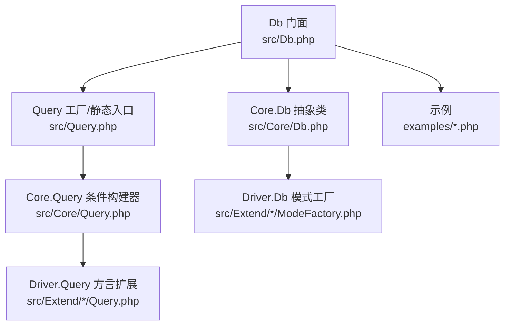
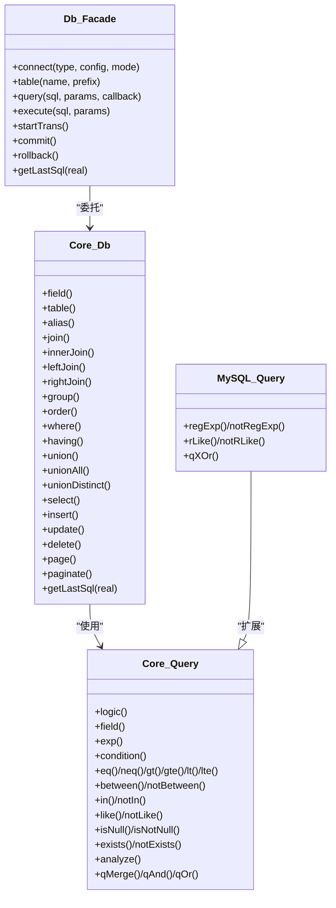
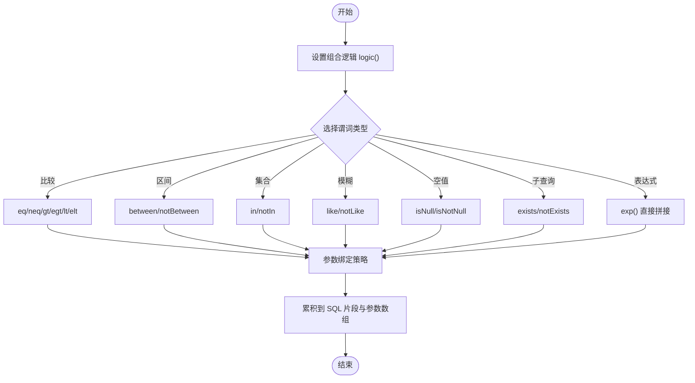
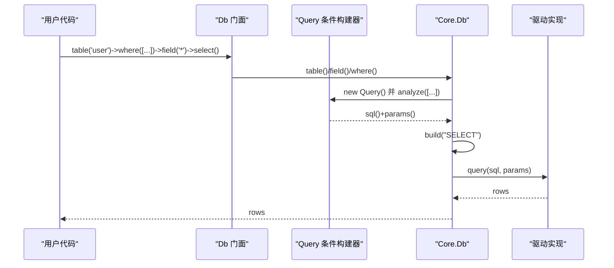
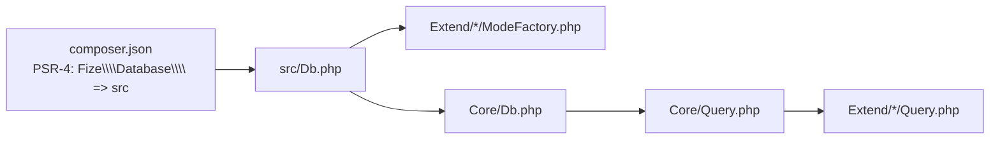

# 查询构建器

<cite>
**本文引用的文件**
- [src/Query.php](file://src/Query.php)
- [src/Core/Query.php](file://src/Core/Query.php)
- [src/Core/Where.php](file://src/Core/Where.php)
- [src/Core/Db.php](file://src/Core/Db.php)
- [src/Db.php](file://src/Db.php)
- [src/Core/Feature.php](file://src/Core/Feature.php)
- [src/Extend/MySQL/Query.php](file://src/Extend/MySQL/Query.php)
- [src/Extend/MySQL/ModeFactory.php](file://src/Extend/MySQL/ModeFactory.php)
- [examples/db_select.php](file://examples/db_select.php)
- [examples/db_insert.php](file://examples/db_insert.php)
- [examples/db_update.php](file://examples/db_update.php)
- [examples/db_delete.php](file://examples/db_delete.php)
- [examples/db_paginate.php](file://examples/db_paginate.php)
- [composer.json](file://composer.json)
</cite>

## 更新摘要
**所做更改**
- 新增条件构建器详细说明，涵盖所有谓词类型和组合逻辑
- 完善JOIN查询操作的实现细节和使用方法
- 补充排序和分组功能的完整说明
- 详细说明分页查询的实现机制和最佳实践
- 增加查询构建器与原生SQL的转换关系说明
- 补充性能优化建议和安全防护措施

## 目录
1. [简介](#简介)
2. [项目结构](#项目结构)
3. [核心组件](#核心组件)
4. [架构总览](#架构总览)
5. [详细组件分析](#详细组件分析)
6. [依赖关系分析](#依赖关系分析)
7. [性能考量](#性能考量)
8. [故障排查指南](#故障排查指南)
9. [结论](#结论)
10. [附录](#附录)

## 简介
本文件系统性阐述 FizeDatabase 的链式查询构建器能力，覆盖 SELECT、INSERT、UPDATE、DELETE 的链式构建；条件构建器（Query）的多种谓词（比较、区间、集合、模糊、空值、EXISTS/NOT EXISTS、正则等）；JOIN 查询、排序与分组、分页查询；以及与原生 SQL 的关系与转换机制。文档同时提供最佳实践、性能优化建议与安全防护要点，帮助读者高效、安全地编写复杂 SQL。

## 项目结构
- 核心查询构建器位于 Core 层，提供通用的链式条件构造与 SQL 片段拼装能力。
- 面向具体数据库的扩展位于 Extend 下，按数据库类型划分，复用 Core 能力并补充方言特性。
- Db 门面类提供静态入口，负责连接创建、表选择、条件设置、执行与事务控制。
- 示例目录提供常见查询场景的使用范式。

**图表来源**
- [src/Db.php:1-141](file://src/Db.php#L1-L141)
- [src/Query.php:1-130](file://src/Query.php#L1-L130)
- [src/Core/Query.php:1-621](file://src/Core/Query.php#L1-L621)
- [src/Core/Db.php:1-941](file://src/Core/Db.php#L1-L941)
- [src/Extend/MySQL/ModeFactory.php:1-82](file://src/Extend/MySQL/ModeFactory.php#L1-L82)
- [src/Extend/MySQL/Query.php:1-91](file://src/Extend/MySQL/Query.php#L1-L91)

**章节来源**
- [src/Db.php:1-141](file://src/Db.php#L1-L141)
- [src/Query.php:1-130](file://src/Query.php#L1-L130)
- [src/Core/Db.php:1-941](file://src/Core/Db.php#L1-L941)
- [src/Extend/MySQL/ModeFactory.php:1-82](file://src/Extend/MySQL/ModeFactory.php#L1-L82)
- [src/Extend/MySQL/Query.php:1-91](file://src/Extend/MySQL/Query.php#L1-L91)

## 核心组件
- Query 条件构建器：提供链式条件构造、表达式拼接、参数绑定、AND/OR 组合、数组条件解析等能力。
- Core.Db：封装 SELECT/INSERT/UPDATE/DELETE 的 SQL 组装、WHERE/HAVING/JOIN/GROUP/ORDER/UNION 的拼装与执行。
- Db 门面：提供静态入口，负责连接创建、表选择、条件设置、执行与事务控制。
- Feature 特性：提供表名/字段名格式化钩子，便于方言适配。

**章节来源**
- [src/Core/Query.php:1-621](file://src/Core/Query.php#L1-L621)
- [src/Core/Db.php:1-941](file://src/Core/Db.php#L1-L941)
- [src/Db.php:1-141](file://src/Db.php#L1-L141)
- [src/Core/Feature.php:1-33](file://src/Core/Feature.php#L1-L33)

## 架构总览
查询构建器采用"门面 + 抽象 + 方言扩展"的分层设计：
- 门面 Db 负责连接与静态 API。
- Core.Db 负责 SQL 组装与执行。
- Core.Query 负责条件片段与参数绑定。
- Extend/*/Query 在 Core.Query 基础上扩展方言特性（如 MySQL 正则）。
- Extend/*/ModeFactory 根据模式创建具体驱动实例。

**图表来源**
- [src/Db.php:1-141](file://src/Db.php#L1-L141)
- [src/Core/Db.php:1-941](file://src/Core/Db.php#L1-L941)
- [src/Core/Query.php:1-621](file://src/Core/Query.php#L1-L621)
- [src/Extend/MySQL/Query.php:1-91](file://src/Extend/MySQL/Query.php#L1-L91)

## 详细组件分析

### 条件构建器 Core.Query
- 组合逻辑：支持通过 logic() 设置 AND/OR，默认 AND。
- 字段与表达式：field() 指定当前比较对象；exp() 直接拼接表达式并绑定参数。
- 比较谓词：eq/neq/gt/egt/lt/elt。
- 区间谓词：between/notBetween。
- 集合谓词：in/notIn。
- 模糊匹配：like/notLike。
- 空值判断：isNull/isNotNull。
- 子查询：exists/notExists。
- 数组解析：analyze() 将数组条件映射为链式调用，支持多参数与组合逻辑。
- 组合：qMerge/qAnd/qOr 将多个 Query 对象按逻辑组合。
- 参数绑定策略：字符串值根据是否包含敏感字符决定是否使用占位符绑定，避免注入。

**图表来源**
- [src/Core/Query.php:1-621](file://src/Core/Query.php#L1-L621)

**章节来源**
- [src/Core/Query.php:1-621](file://src/Core/Query.php#L1-L621)

### 方言扩展：MySQL Query
- 在 Core.Query 基础上新增正则与 RLIKE 谓词。
- 提供 XOR 组合能力（qXOr），满足特定数据库方言需求。

**章节来源**
- [src/Extend/MySQL/Query.php:1-91](file://src/Extend/MySQL/Query.php#L1-L91)

### Core.Db：SQL 组装与执行
- 字段与别名：field()/alias()。
- 表与前缀：table()/prefix()。
- JOIN：join()/innerJoin()/leftJoin()/rightJoin()，支持 ON/USING。
- 分组与排序：group()/order()。
- 条件：where()/having()，支持数组、Query 对象、原生 SQL 三种输入。
- 聚合：count()/sum()/min()/max()/avg()。
- 插入/更新/删除/查询：insert()/update()/delete()/select()/find()/findOrNull()/value()/column()。
- 分页：page()/paginate()，内部通过复制 SELECT 语句并替换字段为 COUNT(*) 计算总数，规避 ORDER BY 对 COUNT 的影响。
- 事务：startTrans()/commit()/rollback()。
- 日志：getLastSql(real) 输出预处理 SQL 或最终 SQL。

**图表来源**
- [src/Db.php:1-141](file://src/Db.php#L1-L141)
- [src/Core/Db.php:1-941](file://src/Core/Db.php#L1-L941)
- [src/Core/Query.php:1-621](file://src/Core/Query.php#L1-L621)

**章节来源**
- [src/Core/Db.php:1-941](file://src/Core/Db.php#L1-L941)

### Db 门面与连接工厂
- Db::__construct() 通过 Extend/*/ModeFactory::create() 创建具体驱动实例，并初始化 Query 工厂。
- Db::connect() 直接返回驱动实例，便于自定义模式。
- Db::getLastSql() 透传至底层驱动，支持输出预处理 SQL 或最终 SQL。

**章节来源**
- [src/Db.php:1-141](file://src/Db.php#L1-L141)
- [src/Extend/MySQL/ModeFactory.php:1-82](file://src/Extend/MySQL/ModeFactory.php#L1-L82)

### 查询构建器与原生 SQL 的关系与转换
- Query::analyze() 将数组条件映射为链式调用，最终由 Core.Db::build() 拼装为完整 SQL。
- Core.Db::getRealSql() 将预处理 SQL 与绑定参数拼接为最终 SQL，用于日志输出（不建议直接执行）。
- where()/having() 支持直接传入原生 SQL 与参数数组，实现与原生 SQL 的无缝衔接。

**章节来源**
- [src/Core/Query.php:521-568](file://src/Core/Query.php#L521-L568)
- [src/Core/Db.php:178-206](file://src/Core/Db.php#L178-L206)
- [src/Core/Db.php:335-393](file://src/Core/Db.php#L335-L393)

### 链式 API 使用示例与最佳实践
- SELECT 查询
  - 使用 where() 传入数组条件，结合 field()/group()/order()/limit()/page()/paginate()。
  - 示例路径：[examples/db_select.php:1-22](file://examples/db_select.php#L1-L22)
- INSERT 插入
  - 使用 insert() 传入字段数组，支持原样 SQL 写入（数组元素为 ["原样表达"]）。
  - 示例路径：[examples/db_insert.php:1-29](file://examples/db_insert.php#L1-L29)
- UPDATE 更新
  - 使用 update() 传入字段数组，支持原样 SQL 写入与自增/自减。
  - 示例路径：[examples/db_update.php:1-22](file://examples/db_update.php#L1-L22)
- DELETE 删除
  - 使用 delete() 结合 where()。
  - 示例路径：[examples/db_delete.php:1-18](file://examples/db_delete.php#L1-L18)
- 分页查询
  - 使用 paginate() 获取总数、记录与总页数；或使用 page()/limit() 自行控制。
  - 示例路径：[examples/db_paginate.php:1-22](file://examples/db_paginate.php#L1-L22)

**章节来源**
- [examples/db_select.php:1-22](file://examples/db_select.php#L1-L22)
- [examples/db_insert.php:1-29](file://examples/db_insert.php#L1-L29)
- [examples/db_update.php:1-22](file://examples/db_update.php#L1-L22)
- [examples/db_delete.php:1-18](file://examples/db_delete.php#L1-L18)
- [examples/db_paginate.php:1-22](file://examples/db_paginate.php#L1-L22)

### 条件构建器详解

#### 基本条件操作
- **逻辑组合**：logic() 设置 AND/OR 组合逻辑，默认 AND
- **字段设置**：field() 和 object() 指定当前比较对象
- **表达式拼接**：exp() 直接拼接 SQL 表达式并绑定参数

#### 比较谓词
- **相等比较**：eq($value) 等价于 = $value
- **不等比较**：neq($value) 等价于 <> $value
- **大小比较**：gt($value)/gte($value)/lt($value)/elt($value)
- **区间比较**：between($value1, $value2) 和 notBetween($value1, $value2)

#### 集合与模糊匹配
- **集合包含**：in($values) 和 notIn($values)
- **模糊匹配**：like($pattern) 和 notLike($pattern)
- **空值判断**：isNull() 和 isNotNull()

#### 子查询支持
- **EXISTS**：exists($expression, $params = null, $premodifier = '')
- **NOT EXISTS**：notExists($expression, $params = null)

#### 数组条件解析
analyze() 方法支持复杂的数组条件格式：
- 基本格式：['field' => $value]
- 比较格式：['field' => ['操作符', '值']]
- 复杂格式：['field' => ['操作符', '值', '绑定参数', '组合逻辑']]

**章节来源**
- [src/Core/Query.php:1-621](file://src/Core/Query.php#L1-L621)

### JOIN 查询操作

#### JOIN 类型支持
Core.Db 提供完整的 JOIN 操作支持：

- **标准 JOIN**：join($table, $type = "JOIN", $on = null, $using = null)
- **内连接**：innerJoin($table, $on = null)
- **左连接**：leftJoin($table, $on = null)
- **右连接**：rightJoin($table, $on = null)

#### JOIN 条件设置
- **ON 条件**：支持复杂的 ON 表达式
- **USING 条件**：简化相同字段连接
- **表别名**：支持表名和别名的灵活配置

#### 表名格式化
- 支持表前缀设置：prefix($prefix)
- 支持表别名：alias($alias)
- 自动表名格式化：formatTable($str)

**章节来源**
- [src/Core/Db.php:395-463](file://src/Core/Db.php#L395-L463)

### 排序与分组功能

#### 排序设置
- **order() 方法**：支持字符串原样和数组格式
- **数组格式**：['field1' => 'ASC', 'field2' => 'DESC']
- **字符串格式**：直接传入 ORDER BY 子句

#### 分组设置
- **group() 方法**：支持字符串和数组格式
- **多字段分组**：自动处理逗号分隔
- **字段格式化**：自动调用 formatField()

#### HAVING 条件
- **having() 方法**：与 where() 类似，支持三种输入格式
- **参数绑定**：完全支持参数绑定
- **查询器集成**：可直接使用 Query 对象

**章节来源**
- [src/Core/Db.php:283-325](file://src/Core/Db.php#L283-L325)
- [src/Core/Db.php:368-393](file://src/Core/Db.php#L368-L393)

### 分页查询实现

#### 分页机制
Core.Db 提供两种分页方式：

- **简易分页**：page($page, $size = 10)
  - 基于 LIMIT 实现
  - 支持偏移量计算
  - 简单易用

- **完整分页**：paginate($page, $size = 10)
  - 自动计算总数
  - 返回 [count, rows, total_pages]
  - 内部优化避免 ORDER BY 影响 COUNT

#### 分页优化策略
- **COUNT 优化**：移除 ORDER BY 子句影响
- **SQL 复制**：复制 SELECT 语句进行计数
- **参数传递**：保持原有参数绑定

**章节来源**
- [src/Core/Db.php:783-789](file://src/Core/Db.php#L783-L789)
- [src/Core/Db.php:891-908](file://src/Core/Db.php#L891-L908)

### 聚合函数支持

#### 常用聚合函数
- **COUNT**：count($field = "*")
- **SUM**：sum($field)
- **MIN**：min($field, $force = true)
- **MAX**：max($field, $force = true)
- **AVG**：avg($field)

#### 聚合查询特点
- **value() 方法**：通用值获取
- **参数绑定**：完全支持参数绑定
- **类型强制**：支持数值类型强制转换

**章节来源**
- [src/Core/Db.php:796-845](file://src/Core/Db.php#L796-L845)

## 依赖关系分析
- Composer 自动加载 PSR-4 映射到 src 目录。
- Db 门面依赖 Extend/*/ModeFactory 创建驱动实例。
- Core.Db 依赖 Core.Query 进行条件解析与 SQL 片段拼装。
- Extend/*/Query 继承 Core.Query 并扩展方言特性。

**图表来源**
- [composer.json:1-47](file://composer.json#L1-L47)
- [src/Db.php:1-141](file://src/Db.php#L1-L141)
- [src/Core/Db.php:1-941](file://src/Core/Db.php#L1-L941)
- [src/Core/Query.php:1-621](file://src/Core/Query.php#L1-L621)
- [src/Extend/MySQL/Query.php:1-91](file://src/Extend/MySQL/Query.php#L1-L91)

**章节来源**
- [composer.json:1-47](file://composer.json#L1-L47)
- [src/Db.php:1-141](file://src/Db.php#L1-L141)
- [src/Core/Db.php:1-941](file://src/Core/Db.php#L1-L941)
- [src/Core/Query.php:1-621](file://src/Core/Query.php#L1-L621)
- [src/Extend/MySQL/Query.php:1-91](file://src/Extend/MySQL/Query.php#L1-L91)

## 性能考量
- 使用 where()/having() 的数组条件或 Query 对象，避免手写复杂 SQL，减少拼接错误与重复解析成本。
- 优先使用参数绑定（?）而非字符串拼接，降低解析开销与注入风险。
- 分页时先 COUNT 再取数据，避免 ORDER BY 对 COUNT 的干扰；必要时去除 ORDER BY 以加速计数。
- 大批量插入使用 insertAll() 减少多次往返。
- 使用 select() 的缓存机制（默认开启）避免重复查询相同 SQL。
- 合理使用 field() 指定字段，避免 SELECT *。
- 使用 limit()/page() 控制返回行数，避免全表扫描。
- JOIN 查询时注意索引使用，避免笛卡尔积。
- 复杂条件使用 Query 对象组合，提高可读性和维护性。

## 故障排查指南
- SQL 注入与参数绑定
  - 确保传入字符串值被正确识别为绑定参数或原样写入；避免直接拼接用户输入。
  - 使用 Query::condition() 的自动绑定策略或显式传入参数数组。
- 条件解析异常
  - 数组条件需遵循约定格式；analyze() 支持多参数与组合逻辑，确保参数顺序与类型正确。
- 日志与调试
  - 使用 Db::getLastSql(true) 查看最终 SQL，定位参数绑定问题；注意该输出不应用于执行。
- 事务嵌套
  - startTrans()/commit()/rollback() 支持嵌套计数，确保成对调用与正确提交/回滚。
- JOIN 查询问题
  - 确认表名格式化和别名设置正确。
  - 检查 ON 条件的字段引用是否正确。
- 分页性能问题
  - 大数据量分页时考虑使用索引优化。
  - 避免在 ORDER BY 中使用函数，影响索引使用。

**章节来源**
- [src/Core/Query.php:145-164](file://src/Core/Query.php#L145-L164)
- [src/Core/Db.php:199-206](file://src/Core/Db.php#L199-L206)
- [src/Db.php:84-114](file://src/Db.php#L84-L114)

## 结论
FizeDatabase 的查询构建器通过"门面 + 抽象 + 方言扩展"的架构，提供了统一、安全、可扩展的链式查询能力。其条件构建器覆盖广泛谓词与组合方式，配合 Core.Db 的 SQL 组装与分页、事务、聚合等功能，能够高效构建从简单到复杂的 SQL。建议在实践中坚持参数绑定、明确字段、合理分页与缓存，以获得更好的安全性与性能表现。

## 附录
- 常用 API 快速索引
  - 条件：logic()/field()/exp()/eq()/neq()/gt()/egt()/lt()/elt()/between()/notBetween()/in()/notIn()/like()/notLike()/isNull()/isNotNull()/exists()/notExists()/analyze()/qMerge()/qAnd()/qOr()
  - 查询：field()/table()/alias()/join()/innerJoin()/leftJoin()/rightJoin()/group()/order()/where()/having()/union()/unionAll()/unionDistinct()/select()/find()/findOrNull()/value()/column()/count()/sum()/min()/max()/avg()/paginate()/page()
  - 写入：insert()/insertGetId()/insertAll()/update()/delete()/setValue()/setInc()/setDec()
  - 事务：startTrans()/commit()/rollback()
  - MySQL 特有：regExp()/notRegExp()/rLike()/notRLike()/qXOr()