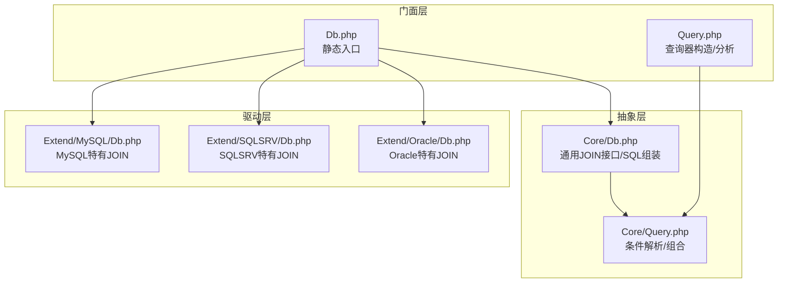
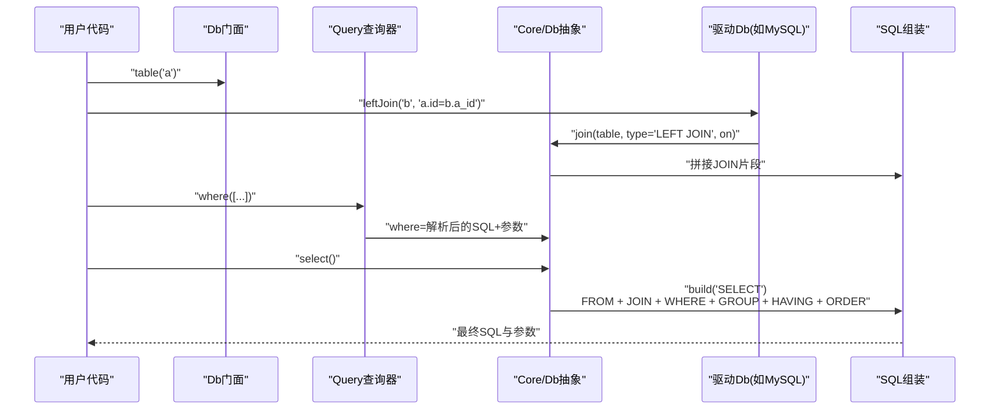
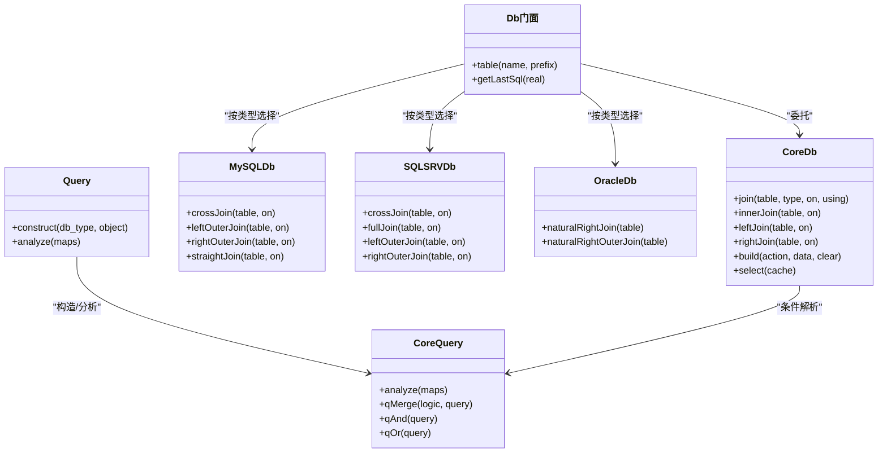

# 连接查询

<cite>
**本文引用的文件**
- [src/Db.php](file://src/Db.php)
- [src/Query.php](file://src/Query.php)
- [src/Core/Db.php](file://src/Core/Db.php)
- [src/Core/Query.php](file://src/Core/Query.php)
- [src/Extend/MySQL/Db.php](file://src/Extend/MySQL/Db.php)
- [src/Extend/SQLSRV/Db.php](file://src/Extend/SQLSRV/Db.php)
- [src/Extend/Oracle/Db.php](file://src/Extend/Oracle/Db.php)
- [examples/db_select.php](file://examples/db_select.php)
- [tests/Core/TestDb.php](file://tests/Core/TestDb.php)
</cite>

## 目录
1. [简介](#简介)
2. [项目结构](#项目结构)
3. [核心组件](#核心组件)
4. [架构总览](#架构总览)
5. [详细组件分析](#详细组件分析)
6. [依赖关系分析](#依赖关系分析)
7. [性能考虑](#性能考虑)
8. [故障排查指南](#故障排查指南)
9. [结论](#结论)
10. [附录](#附录)

## 简介
本章节系统性介绍 FizeDatabase 查询构建器的连接查询能力，覆盖以下要点：
- 支持的连接类型：INNER JOIN、LEFT JOIN、RIGHT JOIN、FULL JOIN（视数据库驱动）、以及特定驱动扩展的 JOIN 变体（如 MySQL 的 CROSS JOIN、STRAIGHT_JOIN，SQLSRV 的 FULL JOIN、LEFT/RIGHT OUTER JOIN，Oracle 的 NATURAL RIGHT JOIN/OUTER JOIN）。
- 在链式调用中添加连接条件的方式，明确区分 ON 条件与 WHERE 条件的作用域与执行顺序。
- 多表连接的实际示例与复杂业务场景下的查询构建思路。
- 连接查询的性能优化策略（索引、查询计划、避免笛卡尔积、减少不必要的 JOIN）。
- 连接查询与子查询的选择原则与适用场景。

## 项目结构
FizeDatabase 将“数据库抽象层”与“具体驱动层”解耦，连接查询相关的关键代码分布如下：
- 抽象层：Core/Db.php 提供通用的 JOIN 接口与 SQL 组装；Core/Query.php 提供条件解析与组合能力。
- 驱动层：各数据库扩展在各自 Db.php 中补充特定 JOIN 类型与方言差异（如 MySQL、SQLSRV、Oracle）。
- 门面层：Db.php 提供静态入口；Query.php 提供查询器构造与分析能力。
- 示例与测试：examples/db_select.php 展示基本查询；tests/Core/TestDb.php 包含 JOIN 相关测试骨架。

图表来源
- [src/Db.php:1-141](file://src/Db.php#L1-L141)
- [src/Query.php:1-130](file://src/Query.php#L1-L130)
- [src/Core/Db.php:1-941](file://src/Core/Db.php#L1-L941)
- [src/Core/Query.php:1-621](file://src/Core/Query.php#L1-L621)
- [src/Extend/MySQL/Db.php:1-246](file://src/Extend/MySQL/Db.php#L1-L246)
- [src/Extend/SQLSRV/Db.php:1-231](file://src/Extend/SQLSRV/Db.php#L1-L231)
- [src/Extend/Oracle/Db.php:68-116](file://src/Extend/Oracle/Db.php#L68-L116)

章节来源
- [src/Db.php:1-141](file://src/Db.php#L1-L141)
- [src/Query.php:1-130](file://src/Query.php#L1-L130)
- [src/Core/Db.php:1-941](file://src/Core/Db.php#L1-L941)
- [src/Core/Query.php:1-621](file://src/Core/Query.php#L1-L621)
- [src/Extend/MySQL/Db.php:1-246](file://src/Extend/MySQL/Db.php#L1-L246)
- [src/Extend/SQLSRV/Db.php:1-231](file://src/Extend/SQLSRV/Db.php#L1-L231)
- [src/Extend/Oracle/Db.php:68-116](file://src/Extend/Oracle/Db.php#L68-L116)

## 核心组件
- 抽象数据库类 Core/Db.php
  - 提供 join()/innerJoin()/leftJoin()/rightJoin() 等通用接口，支持 ON 条件与 USING 字段。
  - 在 build(SELECT) 时将 JOIN 片段拼接到 FROM 之后、WHERE 之前。
- 查询器 Core/Query.php
  - 提供 analyze() 将数组条件解析为 SQL 片段与参数，支持 EXISTS/NOT EXISTS、IN/NOT IN、LIKE、BETWEEN 等。
  - 支持 qMerge()/qAnd()/qOr() 组合多个 Query 对象。
- 驱动扩展 Db.php
  - MySQL：crossJoin/leftOuterJoin/rightOuterJoin/straightJoin。
  - SQLSRV：fullJoin/leftOuterJoin/rightOuterJoin/crossJoin。
  - Oracle：naturalRightJoin/naturalRightOuterJoin。
- 门面 Db.php 与查询器工厂 Query.php
  - Db::table()->join()->where()->select() 形成链式调用。
  - Query::construct()/analyze() 用于从数组快速构建复杂条件。

章节来源
- [src/Core/Db.php:395-463](file://src/Core/Db.php#L395-L463)
- [src/Core/Db.php:574-637](file://src/Core/Db.php#L574-L637)
- [src/Core/Query.php:383-568](file://src/Core/Query.php#L383-L568)
- [src/Core/Query.php:570-620](file://src/Core/Query.php#L570-L620)
- [src/Extend/MySQL/Db.php:67-109](file://src/Extend/MySQL/Db.php#L67-L109)
- [src/Extend/SQLSRV/Db.php:82-124](file://src/Extend/SQLSRV/Db.php#L82-L124)
- [src/Extend/Oracle/Db.php:68-86](file://src/Extend/Oracle/Db.php#L68-L86)
- [src/Db.php:124-139](file://src/Db.php#L124-L139)
- [src/Query.php:35-77](file://src/Query.php#L35-L77)

## 架构总览
连接查询在抽象层与驱动层之间的交互流程如下：

图表来源
- [src/Db.php:124-139](file://src/Db.php#L124-L139)
- [src/Core/Db.php:395-463](file://src/Core/Db.php#L395-L463)
- [src/Core/Db.php:574-637](file://src/Core/Db.php#L574-L637)
- [src/Core/Query.php:383-568](file://src/Core/Query.php#L383-L568)

## 详细组件分析

### 通用 JOIN 接口与 SQL 组装
- join(table, type, on=null, using=null)
  - 支持字符串或 [表名, 别名, 前缀] 数组形式的表名。
  - 自动格式化表名与别名；可同时追加 ON 条件或 USING 字段。
- innerJoin/leftJoin/rightJoin
  - 基于 join 的便捷封装。
- build(SELECT) 时的拼接顺序
  - SELECT ... FROM 主表 JOIN ... WHERE ... GROUP BY ... HAVING ... ORDER BY ...
  - JOIN 片段在 WHERE 之前，确保过滤尽早生效，减少中间结果集。

章节来源
- [src/Core/Db.php:395-430](file://src/Core/Db.php#L395-L430)
- [src/Core/Db.php:432-463](file://src/Core/Db.php#L432-L463)
- [src/Core/Db.php:595-631](file://src/Core/Db.php#L595-L631)

### 驱动特定 JOIN 类型
- MySQL
  - crossJoin/leftOuterJoin/rightOuterJoin/straightJoin
- SQLSRV
  - fullJoin/leftOuterJoin/rightOuterJoin/crossJoin
- Oracle
  - naturalRightJoin/naturalRightOuterJoin

章节来源
- [src/Extend/MySQL/Db.php:67-109](file://src/Extend/MySQL/Db.php#L67-L109)
- [src/Extend/SQLSRV/Db.php:82-124](file://src/Extend/SQLSRV/Db.php#L82-L124)
- [src/Extend/Oracle/Db.php:68-86](file://src/Extend/Oracle/Db.php#L68-L86)

### ON 条件与 WHERE 条件的区别
- ON 条件
  - 在 JOIN 语法中指定关联规则，影响中间结果集的形成。
  - 由 join()/leftJoin()/innerJoin()/rightJoin() 的 on 参数传入。
- WHERE 条件
  - 在 SELECT 的 WHERE 子句中，对最终结果集进行过滤。
  - 通过 Db::where([...]) 或 Db::where("...") 传入。
- 执行顺序
  - 先 JOIN（应用 ON），再 WHERE（应用 WHERE），最后 GROUP/HAVING/ORDER。
  - 将可过滤性强的条件尽量前置到 WHERE，有助于减少中间结果集规模。

章节来源
- [src/Core/Db.php:395-430](file://src/Core/Db.php#L395-L430)
- [src/Core/Db.php:595-631](file://src/Core/Db.php#L595-L631)

### 多表连接与复杂业务场景
- 三表及以上连接
  - 逐次调用 join()/leftJoin()/innerJoin()/rightJoin()，并在每一步提供精确的 ON 条件。
  - 将可过滤条件放入 where([...])，利用 Query::analyze() 支持的多种条件类型（IN/LIKE/BETWEEN/EXISTS 等）。
- 示例路径
  - 基本查询示例：[examples/db_select.php:15-21](file://examples/db_select.php#L15-L21)
  - JOIN 测试骨架：[tests/Core/TestDb.php:26-189](file://tests/Core/TestDb.php#L26-L189)

章节来源
- [examples/db_select.php:15-21](file://examples/db_select.php#L15-L21)
- [tests/Core/TestDb.php:26-189](file://tests/Core/TestDb.php#L26-L189)

### 查询器与条件解析
- Query::construct()/analyze()
  - 将数组条件映射为 SQL 片段与参数，支持 EXP/IN/NOT IN/LIKE/NOT LIKE/BETWEEN/NOT BETWEEN/IS NULL/IS NOT NULL/EXISTS/NOT EXISTS 等。
- qMerge/qAnd/qOr
  - 将多个 Query 对象按 AND/OR 组合，便于复杂业务条件的模块化管理。

章节来源
- [src/Query.php:35-77](file://src/Query.php#L35-L77)
- [src/Core/Query.php:383-568](file://src/Core/Query.php#L383-L568)
- [src/Core/Query.php:570-620](file://src/Core/Query.php#L570-L620)

### 连接查询与子查询的关系与选择
- 连接查询适用于“两表或多表之间存在稳定外键/索引关联”的场景，性能通常优于子查询。
- 子查询适用于“需要先计算一组值再过滤”的场景，如 EXISTS/NOT EXISTS 或标量子查询。
- 选择原则
  - 若能用等值 JOIN 并建立合适索引，优先 JOIN。
  - 若需要聚合或去重后再过滤，可考虑子查询。
  - 对于大数据量，尽量将过滤条件前置到 WHERE，减少中间结果集。

（本节为概念性说明，不直接分析具体文件）

## 依赖关系分析
- Db 门面依赖 Core/Db 抽象与各驱动 Db 扩展。
- Query 查询器依赖 Core/Query 抽象，用于条件解析与组合。
- 驱动 Db 扩展在抽象 Db 的基础上增加方言化 JOIN 类型。

图表来源
- [src/Db.php:124-139](file://src/Db.php#L124-L139)
- [src/Core/Db.php:395-463](file://src/Core/Db.php#L395-L463)
- [src/Core/Db.php:574-637](file://src/Core/Db.php#L574-L637)
- [src/Extend/MySQL/Db.php:67-109](file://src/Extend/MySQL/Db.php#L67-L109)
- [src/Extend/SQLSRV/Db.php:82-124](file://src/Extend/SQLSRV/Db.php#L82-L124)
- [src/Extend/Oracle/Db.php:68-86](file://src/Extend/Oracle/Db.php#L68-L86)
- [src/Query.php:35-77](file://src/Query.php#L35-L77)
- [src/Core/Query.php:383-568](file://src/Core/Query.php#L383-L568)
- [src/Core/Query.php:570-620](file://src/Core/Query.php#L570-L620)

章节来源
- [src/Db.php:124-139](file://src/Db.php#L124-L139)
- [src/Core/Db.php:395-463](file://src/Core/Db.php#L395-L463)
- [src/Core/Db.php:574-637](file://src/Core/Db.php#L574-L637)
- [src/Extend/MySQL/Db.php:67-109](file://src/Extend/MySQL/Db.php#L67-L109)
- [src/Extend/SQLSRV/Db.php:82-124](file://src/Extend/SQLSRV/Db.php#L82-L124)
- [src/Extend/Oracle/Db.php:68-86](file://src/Extend/Oracle/Db.php#L68-L86)
- [src/Query.php:35-77](file://src/Query.php#L35-L77)
- [src/Core/Query.php:383-568](file://src/Core/Query.php#L383-L568)
- [src/Core/Query.php:570-620](file://src/Core/Query.php#L570-L620)

## 性能考虑
- 索引与连接键
  - 为 JOIN 的 ON 条件字段建立合适的索引，尤其是外键列与频繁过滤列。
- 过滤下推
  - 将可过滤性强的 WHERE 条件尽早下推，减少中间结果集规模。
- 避免笛卡尔积
  - 确保每个 JOIN 都有明确的 ON 条件；多表连接时逐步细化过滤。
- 减少不必要的 JOIN
  - 若可通过子查询或投影裁剪替代，优先选择代价更低的方案。
- 分页与排序
  - 在 SQLSRV/MySQL 等驱动中，合理使用 limit/top 与 order by，避免全表扫描。
- 查询计划
  - 结合数据库 EXPLAIN/Execution Plan 分析，确认索引命中与访问路径。

（本节提供通用指导，不直接分析具体文件）

## 故障排查指南
- SQL 片段拼接问题
  - 使用 Db::getLastSql(true) 查看最终 SQL 与参数，核对 JOIN 片段与 WHERE 条件顺序。
- 参数绑定异常
  - 确认 Query::analyze() 与 where([...]) 的参数绑定是否正确传递。
- 驱动方言差异
  - 不同驱动支持的 JOIN 类型不同，若出现语法错误，请检查驱动扩展提供的方法（如 fullJoin/crossJoin/leftOuterJoin 等）。
- 测试定位
  - 参考测试骨架中 JOIN 相关用例位置，逐步缩小问题范围。

章节来源
- [src/Core/Db.php:199-206](file://src/Core/Db.php#L199-L206)
- [src/Core/Query.php:383-568](file://src/Core/Query.php#L383-L568)
- [tests/Core/TestDb.php:26-189](file://tests/Core/TestDb.php#L26-L189)

## 结论
FizeDatabase 的连接查询能力通过抽象层与驱动层的清晰分离，既保证了跨数据库的一致使用体验，又允许针对特定数据库方言扩展 JOIN 类型。在链式调用中，ON 条件与 WHERE 条件的职责明确、顺序固定，配合 Query 查询器的条件解析能力，能够高效构建复杂的多表连接查询。结合索引、过滤下推与查询计划分析，可显著提升连接查询的性能表现。

## 附录
- 快速上手
  - 选择数据库类型与配置，初始化 Db 门面。
  - 使用 Db::table('主表')->join(...)->where([...])->select() 完成查询。
- 常见连接类型
  - INNER JOIN：取两表共有记录。
  - LEFT JOIN：保留左表全部记录。
  - RIGHT JOIN：保留右表全部记录。
  - FULL JOIN：保留两表全部记录（SQLSRV 支持）。
  - 特定驱动扩展：MySQL 的 CROSS JOIN、STRAIGHT_JOIN；SQLSRV 的 FULL JOIN、LEFT/RIGHT OUTER JOIN；Oracle 的 NATURAL RIGHT JOIN/OUTER JOIN。

章节来源
- [src/Db.php:124-139](file://src/Db.php#L124-L139)
- [src/Core/Db.php:432-463](file://src/Core/Db.php#L432-L463)
- [src/Extend/MySQL/Db.php:67-109](file://src/Extend/MySQL/Db.php#L67-L109)
- [src/Extend/SQLSRV/Db.php:82-124](file://src/Extend/SQLSRV/Db.php#L82-L124)
- [src/Extend/Oracle/Db.php:68-86](file://src/Extend/Oracle/Db.php#L68-L86)