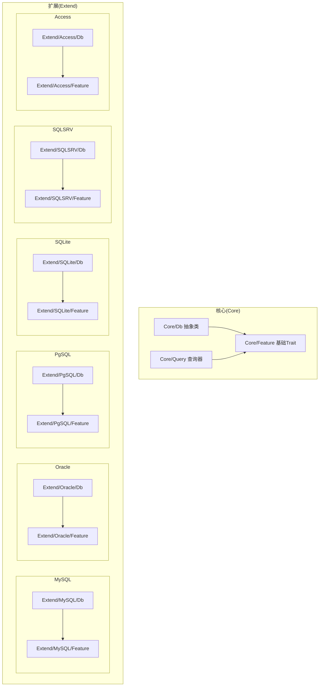
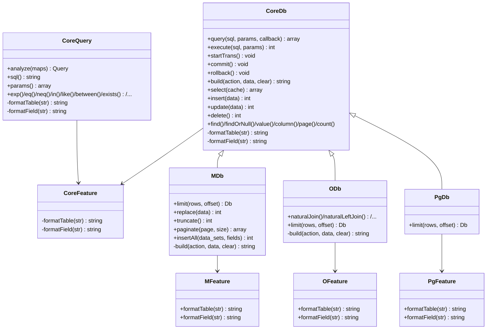
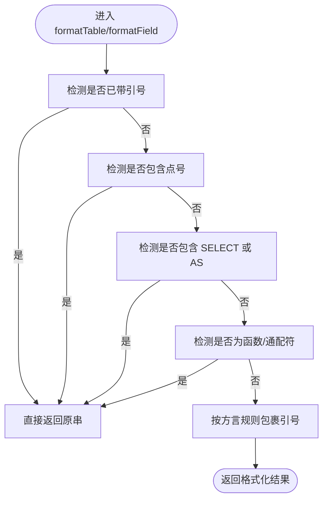
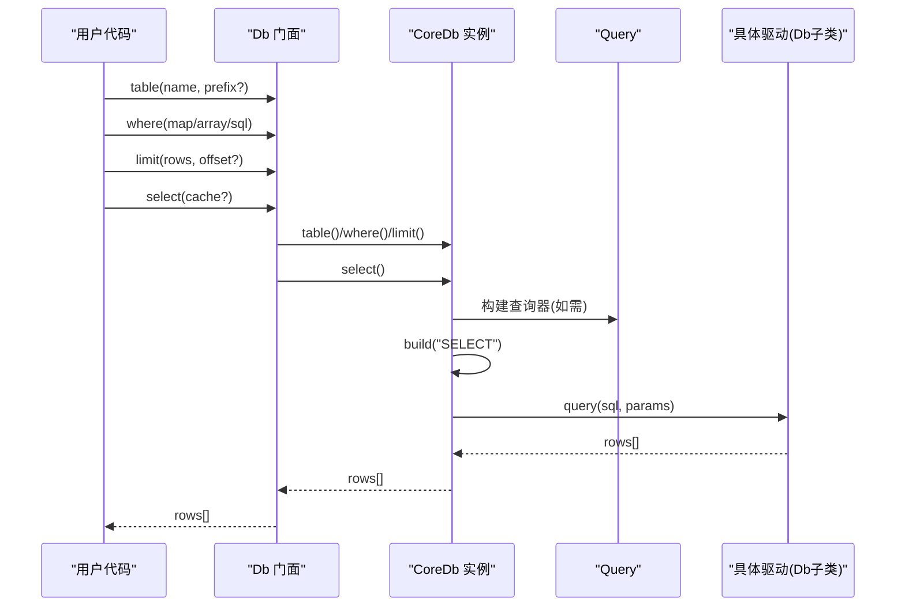
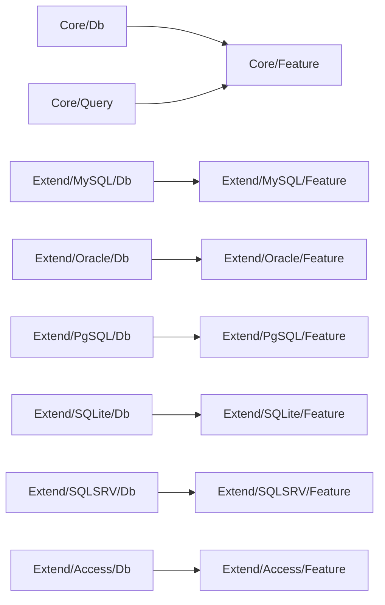

# Feature Trait机制

<cite>
**本文引用的文件**
- [src/Core/Feature.php](file://src/Core/Feature.php)
- [src/Core/Db.php](file://src/Core/Db.php)
- [src/Extend/MySQL/Feature.php](file://src/Extend/MySQL/Feature.php)
- [src/Extend/Oracle/Feature.php](file://src/Extend/Oracle/Feature.php)
- [src/Extend/PgSQL/Feature.php](file://src/Extend/PgSQL/Feature.php)
- [src/Extend/SQLite/Feature.php](file://src/Extend/SQLite/Feature.php)
- [src/Extend/SQLSRV/Feature.php](file://src/Extend/SQLSRV/Feature.php)
- [src/Extend/Access/Feature.php](file://src/Extend/Access/Feature.php)
- [src/Core/Query.php](file://src/Core/Query.php)
- [src/Extend/MySQL/Db.php](file://src/Extend/MySQL/Db.php)
- [src/Extend/Oracle/Db.php](file://src/Extend/Oracle/Db.php)
- [src/Extend/PgSQL/Db.php](file://src/Extend/PgSQL/Db.php)
- [examples/db_select.php](file://examples/db_select.php)
- [examples/db_insert.php](file://examples/db_insert.php)
- [composer.json](file://composer.json)
</cite>

## 目录
1. [简介](#简介)
2. [项目结构](#项目结构)
3. [核心组件](#核心组件)
4. [架构总览](#架构总览)
5. [详细组件分析](#详细组件分析)
6. [依赖关系分析](#依赖关系分析)
7. [性能考量](#性能考量)
8. [故障排查指南](#故障排查指南)
9. [结论](#结论)
10. [附录](#附录)

## 简介
本文围绕 FizeDatabase 中 Feature Trait 的设计与应用展开，系统阐释其如何为 Db 抽象类提供功能增强，包括特性组合、代码复用与模块化设计；说明 Trait 在数据库功能扩展中的作用（查询、事务、结果处理等）；对比 Trait 与继承的关系，并给出基于 Trait 的扩展开发指南与最佳实践。

## 项目结构
该项目采用分层+按数据库类型扩展的组织方式：
- Core 层：提供通用抽象与基础设施（Db 抽象类、Feature 基础 Trait、Query 查询器）
- Extend 层：按数据库类型细分（MySQL、Oracle、PgSQL、SQLite、SQLSRV、Access），每个类型包含 Db、Feature、Query、ModeFactory 等
- 示例与测试：examples 展示典型用法，tests 覆盖各驱动与模式
- 自动加载：通过 composer.json 的 PSR-4 将命名空间映射到 src 目录

图表来源
- [src/Core/Db.php:13-15](file://src/Core/Db.php#L13-L15)
- [src/Core/Feature.php:10-32](file://src/Core/Feature.php#L10-L32)
- [src/Core/Query.php:13-15](file://src/Core/Query.php#L13-L15)
- [src/Extend/MySQL/Db.php:11-13](file://src/Extend/MySQL/Db.php#L11-L13)
- [src/Extend/MySQL/Feature.php:8-56](file://src/Extend/MySQL/Feature.php#L8-L56)
- [src/Extend/Oracle/Db.php:13-15](file://src/Extend/Oracle/Db.php#L13-L15)
- [src/Extend/Oracle/Feature.php:8-46](file://src/Extend/Oracle/Feature.php#L8-L46)
- [src/Extend/PgSQL/Db.php:12-14](file://src/Extend/PgSQL/Db.php#L12-L14)
- [src/Extend/PgSQL/Feature.php:8-30](file://src/Extend/PgSQL/Feature.php#L8-L30)
- [src/Extend/SQLite/Db.php](file://src/Extend/SQLite/Db.php)
- [src/Extend/SQLite/Feature.php:8-56](file://src/Extend/SQLite/Feature.php#L8-L56)
- [src/Extend/SQLSRV/Db.php](file://src/Extend/SQLSRV/Db.php)
- [src/Extend/SQLSRV/Feature.php:8-50](file://src/Extend/SQLSRV/Feature.php#L8-L50)
- [src/Extend/Access/Db.php](file://src/Extend/Access/Db.php)
- [src/Extend/Access/Feature.php:8-50](file://src/Extend/Access/Feature.php#L8-L50)

章节来源
- [composer.json:11-14](file://composer.json#L11-L14)

## 核心组件
- Core/Db 抽象类：定义数据库操作的统一接口与通用构建流程，内置 Feature Trait，提供查询、插入、更新、删除、分页、计数等能力，并通过抽象方法对接具体驱动的执行细节。
- Core/Feature 基础 Trait：提供 formatTable 与 formatField 两个受保护方法，作为“格式化钩子”，允许子类或扩展按方言定制标识符包装策略。
- Core/Query 查询器：同样 use Core/Feature，支持数组条件解析、表达式拼接、参数绑定、逻辑合并等，最终产出 SQL 片段与参数数组供 Db.build 使用。
- 各数据库扩展的 Feature Trait：覆盖 formatTable/formatField，针对不同数据库的标识符引用规则（反引号、双引号、方括号等）进行差异化处理。
- 各数据库扩展的 Db 类：继承 Core/Db 并 use 对应 Feature，按各自方言扩展语法（如 MySQL 的 REPLACE、TRUNCATE、LIMIT 语法，Oracle 的 NATURAL JOIN 等）。

章节来源
- [src/Core/Db.php:13-15](file://src/Core/Db.php#L13-L15)
- [src/Core/Feature.php:10-32](file://src/Core/Feature.php#L10-L32)
- [src/Core/Query.php:13-15](file://src/Core/Query.php#L13-L15)
- [src/Extend/MySQL/Db.php:11-13](file://src/Extend/MySQL/Db.php#L11-L13)
- [src/Extend/Oracle/Db.php:13-15](file://src/Extend/Oracle/Db.php#L13-L15)
- [src/Extend/PgSQL/Db.php:12-14](file://src/Extend/PgSQL/Db.php#L12-L14)

## 架构总览
Feature Trait 的核心价值在于“行为复用 + 方言适配”的解耦设计。核心抽象类持有通用逻辑，扩展类通过 use Feature 注入方言化的标识符格式化策略，从而实现：
- 特性组合：扩展类可叠加多个特性（Trait），按需组合功能
- 代码复用：避免在每个驱动中重复实现相同的 SQL 组装与查询流程
- 模块化设计：将“方言差异”收敛到 Feature 层，保持上层接口稳定

图表来源
- [src/Core/Db.php:13-15](file://src/Core/Db.php#L13-L15)
- [src/Core/Feature.php:10-32](file://src/Core/Feature.php#L10-L32)
- [src/Core/Query.php:13-15](file://src/Core/Query.php#L13-L15)
- [src/Extend/MySQL/Db.php:11-13](file://src/Extend/MySQL/Db.php#L11-L13)
- [src/Extend/MySQL/Feature.php:8-56](file://src/Extend/MySQL/Feature.php#L8-L56)
- [src/Extend/Oracle/Db.php:13-15](file://src/Extend/Oracle/Db.php#L13-L15)
- [src/Extend/Oracle/Feature.php:8-46](file://src/Extend/Oracle/Feature.php#L8-L46)
- [src/Extend/PgSQL/Db.php:12-14](file://src/Extend/PgSQL/Db.php#L12-L14)
- [src/Extend/PgSQL/Feature.php:8-30](file://src/Extend/PgSQL/Feature.php#L8-L30)

## 详细组件分析

### Feature Trait 的设计与职责
- 基础职责：提供 formatTable 与 formatField 两个受保护方法，作为“方言钩子”，由具体 Feature 覆盖以适配不同数据库的标识符引用规则。
- 设计原则：
  - 黑盒兼容：对外输入字符串是否已格式化未知，Trait 内部需具备幂等与边界识别能力（如已带引号、包含子查询、AS 别名、函数调用等场景）
  - 保守封装：仅暴露必要的格式化能力，不改变上层调用契约
  - 可组合性：扩展类可同时 use 多个特性，形成“功能 + 方言”的复合能力

章节来源
- [src/Core/Feature.php:10-32](file://src/Core/Feature.php#L10-L32)

### Core/Db 如何使用 Feature
- Db 抽象类 use Core/Feature，从而在以下位置调用格式化钩子：
  - 字段别名与字段列表渲染：field()、order()、group()、having() 等
  - JOIN/表名处理：join()、table()、alias() 等
  - SQL 组装：build() 中对表名、字段名进行格式化
- 事务与查询：Db 定义了 query/execute/startTrans/commit/rollback 等抽象方法，具体驱动实现这些细节

章节来源
- [src/Core/Db.php:13-15](file://src/Core/Db.php#L13-L15)
- [src/Core/Db.php:228-244](file://src/Core/Db.php#L228-L244)
- [src/Core/Db.php:307-325](file://src/Core/Db.php#L307-L325)
- [src/Core/Db.php:335-359](file://src/Core/Db.php#L335-L359)
- [src/Core/Db.php:583-637](file://src/Core/Db.php#L583-L637)

### 各数据库扩展的 Feature 差异化
- MySQL：对表名与字段名默认加反引号，保留子查询、AS、函数调用等场景不包裹
- Oracle：默认加双引号，保留子查询、AS 等场景
- PgSQL：统一加双引号
- SQLite：与 MySQL 类似，但对通配符、函数调用、AS 场景有细致判断
- SQLSRV/Access：默认加方括号，保留子查询、AS、函数调用等场景

图表来源
- [src/Extend/MySQL/Feature.php:16-30](file://src/Extend/MySQL/Feature.php#L16-L30)
- [src/Extend/Oracle/Feature.php:16-27](file://src/Extend/Oracle/Feature.php#L16-L27)
- [src/Extend/PgSQL/Feature.php:16-29](file://src/Extend/PgSQL/Feature.php#L16-L29)
- [src/Extend/SQLite/Feature.php:16-30](file://src/Extend/SQLite/Feature.php#L16-L30)
- [src/Extend/SQLSRV/Feature.php:16-27](file://src/Extend/SQLSRV/Feature.php#L16-L27)
- [src/Extend/Access/Feature.php:16-27](file://src/Extend/Access/Feature.php#L16-L27)

章节来源
- [src/Extend/MySQL/Feature.php:8-56](file://src/Extend/MySQL/Feature.php#L8-L56)
- [src/Extend/Oracle/Feature.php:8-46](file://src/Extend/Oracle/Feature.php#L8-L46)
- [src/Extend/PgSQL/Feature.php:8-30](file://src/Extend/PgSQL/Feature.php#L8-L30)
- [src/Extend/SQLite/Feature.php:8-56](file://src/Extend/SQLite/Feature.php#L8-L56)
- [src/Extend/SQLSRV/Feature.php:8-50](file://src/Extend/SQLSRV/Feature.php#L8-L50)
- [src/Extend/Access/Feature.php:8-50](file://src/Extend/Access/Feature.php#L8-L50)

### 查询器 Core/Query 如何协同 Feature
- Query 同样 use Core/Feature，用于在条件解析阶段对字段名进行格式化
- analyze() 将数组条件转换为 SQL 片段与参数数组，供 Db.where()/having() 使用
- exp()/eq()/in()/like()/between()/exists() 等方法在拼接表达式时调用格式化钩子，确保字段与表名符合方言规范

章节来源
- [src/Core/Query.php:13-15](file://src/Core/Query.php#L13-L15)
- [src/Core/Query.php:521-568](file://src/Core/Query.php#L521-L568)
- [src/Core/Query.php:113-164](file://src/Core/Query.php#L113-L164)

### 事务管理与嵌套控制
- 顶层静态门面 Db 提供事务入口（开始/提交/回滚），内部维护嵌套层级，避免重复开启/过早提交
- 具体驱动由 Core/Db 的抽象方法实现底层事务协议

章节来源
- [src/Db.php:32-114](file://src/Db.php#L32-L114)
- [src/Core/Db.php:122-134](file://src/Core/Db.php#L122-L134)

### 结果处理与缓存
- select() 支持可选缓存，基于最终 SQL 文本作为键缓存结果集，减少重复查询
- find()/findOrNull()/value()/column() 等便捷方法在 Db 层实现，底层仍依赖 query()/execute()

章节来源
- [src/Core/Db.php:700-711](file://src/Core/Db.php#L700-L711)
- [src/Core/Db.php:718-740](file://src/Core/Db.php#L718-L740)
- [src/Core/Db.php:749-761](file://src/Core/Db.php#L749-L761)
- [src/Core/Db.php:768-776](file://src/Core/Db.php#L768-L776)

### 典型使用流程（序列图）

图表来源
- [src/Db.php:124-127](file://src/Db.php#L124-L127)
- [src/Db.php:65-68](file://src/Db.php#L65-L68)
- [src/Core/Db.php:335-359](file://src/Core/Db.php#L335-L359)
- [src/Core/Db.php:700-711](file://src/Core/Db.php#L700-L711)
- [src/Core/Query.php:521-568](file://src/Core/Query.php#L521-L568)

## 依赖关系分析
- 组件耦合
  - Core/Db 与 Core/Feature：强依赖（格式化钩子贯穿 SQL 组装）
  - 各扩展 Db 与对应 Feature：强依赖（方言差异由 Feature 提供）
  - Core/Query 与 Core/Feature：强依赖（条件解析阶段需要格式化）
  - Db 门面与 Core/Db：弱依赖（静态代理，便于快速使用）
- 外部依赖
  - composer.json 声明 PHP 版本与扩展建议，驱动能力取决于所安装扩展

图表来源
- [src/Core/Db.php:13-15](file://src/Core/Db.php#L13-L15)
- [src/Core/Query.php:13-15](file://src/Core/Query.php#L13-L15)
- [src/Extend/MySQL/Db.php:11-13](file://src/Extend/MySQL/Db.php#L11-L13)
- [src/Extend/Oracle/Db.php:13-15](file://src/Extend/Oracle/Db.php#L13-L15)
- [src/Extend/PgSQL/Db.php:12-14](file://src/Extend/PgSQL/Db.php#L12-L14)
- [src/Extend/SQLite/Db.php](file://src/Extend/SQLite/Db.php)
- [src/Extend/SQLSRV/Db.php](file://src/Extend/SQLSRV/Db.php)
- [src/Extend/Access/Db.php](file://src/Extend/Access/Db.php)

章节来源
- [composer.json:16-37](file://composer.json#L16-L37)

## 性能考量
- SQL 缓存：Db::select() 支持基于最终 SQL 文本的缓存，可显著降低重复查询开销
- 参数绑定：Db::build() 将 whereParams/havingParams 合并，Query::analyze() 严格区分绑定参数，避免字符串拼接带来的性能与安全问题
- 格式化成本：Feature 的格式化钩子在关键路径（字段/表名）被频繁调用，建议在 Feature 中尽量减少正则与字符串操作次数，必要时进行幂等判断

章节来源
- [src/Core/Db.php:700-711](file://src/Core/Db.php#L700-L711)
- [src/Core/Db.php:583-637](file://src/Core/Db.php#L583-L637)
- [src/Core/Query.php:521-568](file://src/Core/Query.php#L521-L568)

## 故障排查指南
- SQL 注入与标识符异常
  - 现象：字段/表名未正确引用导致语法错误
  - 排查：确认扩展 Db 是否 use 正确的 Feature；检查 formatTable/formatField 的覆盖逻辑是否覆盖到目标场景（如子查询、函数、AS 别名）
- 参数绑定不生效
  - 现象：条件值未被绑定，直接拼接进 SQL
  - 排查：核对 Query::condition() 的参数绑定策略；确保传入数组值或明确传参
- 事务嵌套问题
  - 现象：多次 startTrans 导致提交/回滚时机异常
  - 排查：确认 Db 门面的嵌套层级控制逻辑是否被正确调用

章节来源
- [src/Core/Query.php:145-164](file://src/Core/Query.php#L145-L164)
- [src/Db.php:84-114](file://src/Db.php#L84-L114)

## 结论
Feature Trait 在 FizeDatabase 中实现了“方言差异隔离 + 通用逻辑复用”的平衡。通过 Core/Feature 提供格式化钩子，扩展 Db use 对应 Feature，既保证了上层接口的一致性，又让各数据库方言差异得到集中管理。配合 Core/Query 的条件解析与 Db 门面的事务控制，形成了清晰、可扩展、易维护的数据库抽象体系。

## 附录

### Trait 与继承的关系
- 继承：扩展 Db 类继承 Core/Db，获得通用能力与抽象接口
- 组合：扩展 Db use 对应 Feature，注入方言化格式化策略
- 优势：相比多重继承，Trait 更灵活，避免“钻石问题”，便于按需组合

章节来源
- [src/Extend/MySQL/Db.php:11-13](file://src/Extend/MySQL/Db.php#L11-L13)
- [src/Extend/Oracle/Db.php:13-15](file://src/Extend/Oracle/Db.php#L13-L15)
- [src/Extend/PgSQL/Db.php:12-14](file://src/Extend/PgSQL/Db.php#L12-L14)

### 开发指南与扩展建议
- 新增数据库方言的步骤
  1) 在 Extend/<DB>/ 下创建 Feature.php，覆盖 formatTable/formatField，遵循现有方言的判断逻辑
  2) 在 Extend/<DB>/ 下创建 Db.php，继承 Core/Db 并 use 新 Feature，按需扩展方言语法（如 LIMIT、特殊 JOIN、批量插入等）
  3) 在 Extend/<DB>/ 下创建 Query.php（可选），若需要针对该方言的查询器行为做差异化
  4) 在 Extend/<DB>/ 下创建 ModeFactory.php 与 Mode 相关类，负责连接与执行模式
  5) 在 examples/ 与 tests/ 中补充用例与测试
- 设计要点
  - 保持 Db 的公共 API 稳定，仅通过 Feature 钩子扩展方言差异
  - Query 的条件解析尽量复用 Core/Query 的通用逻辑，仅在必要处覆写
  - 事务与错误处理保持与 Core/Db 的一致性
- 示例参考
  - 查询示例：[examples/db_select.php:18-21](file://examples/db_select.php#L18-L21)
  - 插入示例：[examples/db_insert.php:20-28](file://examples/db_insert.php#L20-L28)

章节来源
- [src/Extend/MySQL/Feature.php:8-56](file://src/Extend/MySQL/Feature.php#L8-L56)
- [src/Extend/MySQL/Db.php:129-152](file://src/Extend/MySQL/Db.php#L129-L152)
- [src/Extend/Oracle/Feature.php:8-46](file://src/Extend/Oracle/Feature.php#L8-L46)
- [src/Extend/PgSQL/Feature.php:8-30](file://src/Extend/PgSQL/Feature.php#L8-L30)
- [examples/db_select.php:18-21](file://examples/db_select.php#L18-L21)
- [examples/db_insert.php:20-28](file://examples/db_insert.php#L20-L28)