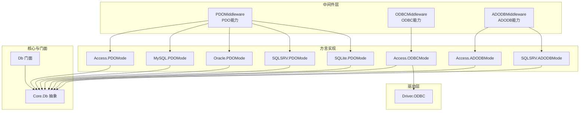
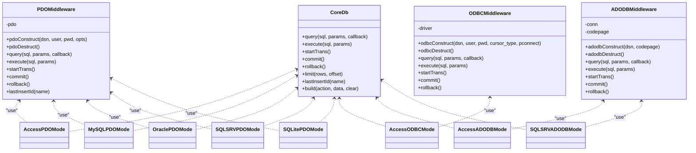
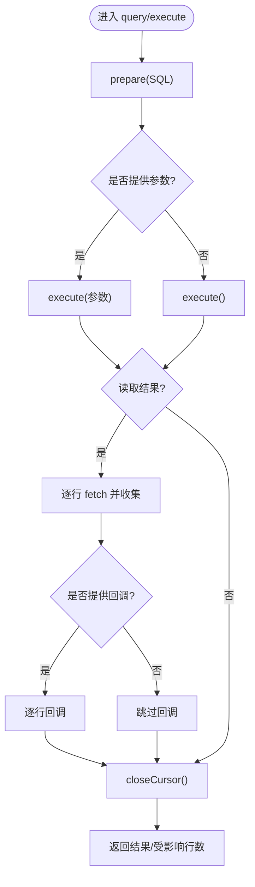
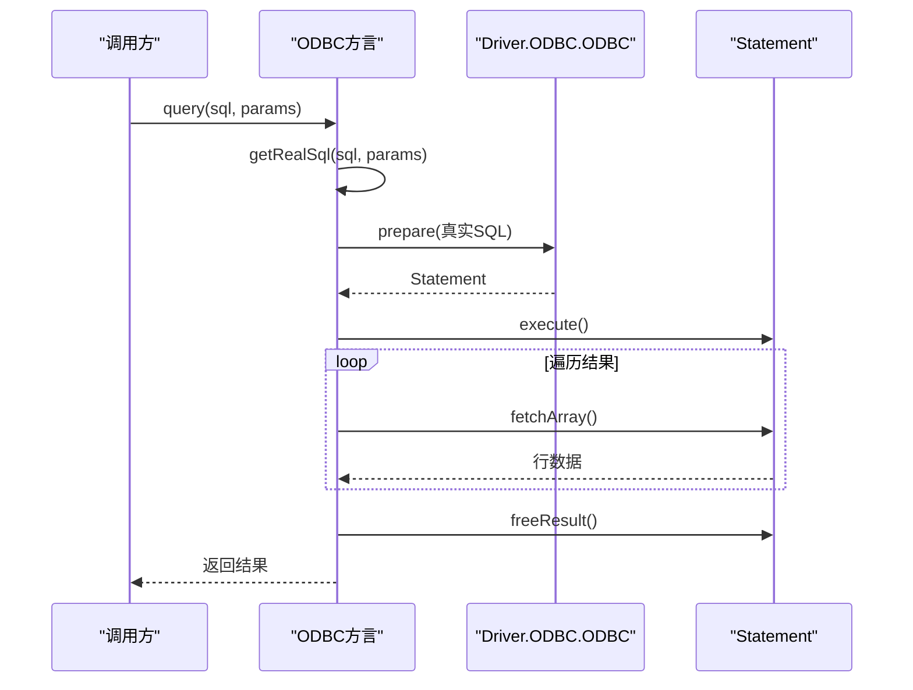
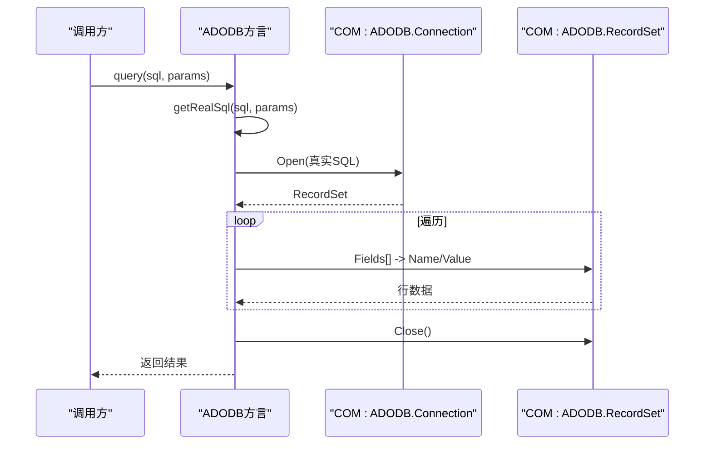
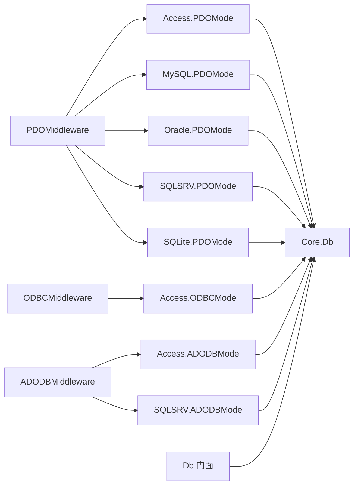

# 中间件模式

<cite>
**本文引用的文件**
- [PDOMiddleware.php](file://src/Middleware/PDOMiddleware.php)
- [ODBCMiddleware.php](file://src/Middleware/ODBCMiddleware.php)
- [ADODBMiddleware.php](file://src/Middleware/ADODBMiddleware.php)
- [Db.php（核心）](file://src/Core/Db.php)
- [Db.php（门面）](file://src/Db.php)
- [PDOMode.php（Access）](file://src/Extend/Access/Mode/PDOMode.php)
- [PDOMode.php（MySQL）](file://src/Extend/MySQL/Mode/PDOMode.php)
- [PDOMode.php（Oracle）](file://src/Extend/Oracle/Mode/PDOMode.php)
- [PDOMode.php（SQLSRV）](file://src/Extend/SQLSRV/Mode/PDOMode.php)
- [PDOMode.php（SQLite）](file://src/Extend/SQLite/Mode/PDOMode.php)
- [ODBCMode.php（Access）](file://src/Extend/Access/Mode/ODBCMode.php)
- [ADODBMode.php（Access）](file://src/Extend/Access/Mode/ADODBMode.php)
- [ADODBMode.php（SQLSRV）](file://src/Extend/SQLSRV/Mode/ADODBMode.php)
- [ODBC.php（驱动）](file://src/Driver/ODBC/ODBC.php)
- [composer.json](file://composer.json)
</cite>

## 目录
1. [简介](#简介)
2. [项目结构](#项目结构)
3. [核心组件](#核心组件)
4. [架构总览](#架构总览)
5. [组件详解](#组件详解)
6. [依赖关系分析](#依赖关系分析)
7. [性能考量](#性能考量)
8. [故障排查指南](#故障排查指南)
9. [结论](#结论)
10. [附录：中间件开发指南与最佳实践](#附录中间件开发指南与最佳实践)

## 简介
本文件系统性解析 FizeDatabase 的中间件模式架构，重点剖析 PDOMiddleware、ODBCMiddleware、ADODBMiddleware 三类中间件的设计思想与实现细节，并说明其在数据库连接管理中的职责边界：连接建立、参数处理、错误拦截、生命周期管理与状态维护。同时对比中间件模式与传统继承模式的优势，给出可复用、可配置、易扩展的中间件开发指南与最佳实践。

## 项目结构
- 中间件层位于 src/Middleware，采用 PHP Trait 将通用能力下沉，供各数据库方言的 Mode 类组合使用。
- 具体方言实现位于 src/Extend/<Driver>/Mode，每个驱动提供 PDO/ODBC/ADODB 三种模式，分别对应不同的底层连接与执行策略。
- 核心抽象 Db 位于 src/Core，定义统一的查询/执行/事务/构建 SQL 等接口；门面 Db 位于 src，提供静态入口与事务嵌套计数。
- 驱动层（如 ODBC）位于 src/Driver，封装底层资源与异常。

图表来源
- [PDOMiddleware.php:12-128](file://src/Middleware/PDOMiddleware.php#L12-L128)
- [ODBCMiddleware.php:11-99](file://src/Middleware/ODBCMiddleware.php#L11-L99)
- [ADODBMiddleware.php:11-115](file://src/Middleware/ADODBMiddleware.php#L11-L115)
- [PDOMode.php（Access）:15-145](file://src/Extend/Access/Mode/PDOMode.php#L15-L145)
- [PDOMode.php（MySQL）:14-52](file://src/Extend/MySQL/Mode/PDOMode.php#L14-L52)
- [PDOMode.php（Oracle）:13-49](file://src/Extend/Oracle/Mode/PDOMode.php#L13-L49)
- [PDOMode.php（SQLSRV）:18-70](file://src/Extend/SQLSRV/Mode/PDOMode.php#L18-L70)
- [PDOMode.php（SQLite）:13-35](file://src/Extend/SQLite/Mode/PDOMode.php#L13-L35)
- [ODBCMode.php（Access）:13-93](file://src/Extend/Access/Mode/ODBCMode.php#L13-L93)
- [ADODBMode.php（Access）:13-59](file://src/Extend/Access/Mode/ADODBMode.php#L13-L59)
- [ADODBMode.php（SQLSRV）:14-61](file://src/Extend/SQLSRV/Mode/ADODBMode.php#L14-L61)
- [ODBC.php（驱动）:15-340](file://src/Driver/ODBC/ODBC.php#L15-L340)
- [Db.php（核心）:13-134](file://src/Core/Db.php#L13-L134)
- [Db.php（门面）:13-140](file://src/Db.php#L13-L140)

章节来源
- [composer.json:11-37](file://composer.json#L11-L37)

## 核心组件
- 中间件（Trait）：将连接、执行、事务、游标/结果集处理等共性逻辑下沉，避免在每个方言类重复实现。
- 方言模式（Mode）：通过 use Trait 组合中间件能力，仅负责 DSN 构造、参数适配、字符集处理、lastInsertId 差异化等。
- 核心 Db：定义统一的 SQL 构建、查询/执行、事务接口与缓存策略。
- 门面 Db：提供静态入口、事务嵌套计数与代理转发。

章节来源
- [PDOMiddleware.php:12-128](file://src/Middleware/PDOMiddleware.php#L12-L128)
- [ODBCMiddleware.php:11-99](file://src/Middleware/ODBCMiddleware.php#L11-L99)
- [ADODBMiddleware.php:11-115](file://src/Middleware/ADODBMiddleware.php#L11-L115)
- [Db.php（核心）:13-134](file://src/Core/Db.php#L13-L134)
- [Db.php（门面）:13-140](file://src/Db.php#L13-L140)

## 架构总览
中间件模式将“连接与执行”的横切关注点从具体方言实现中剥离，形成可插拔的能力块。每个方言仅需关心自身差异点（如 DSN、字符集、lastInsertId），并通过统一接口与核心 Db 协作。

图表来源
- [PDOMiddleware.php:12-128](file://src/Middleware/PDOMiddleware.php#L12-L128)
- [ODBCMiddleware.php:11-99](file://src/Middleware/ODBCMiddleware.php#L11-L99)
- [ADODBMiddleware.php:11-115](file://src/Middleware/ADODBMiddleware.php#L11-L115)
- [PDOMode.php（Access）:15-145](file://src/Extend/Access/Mode/PDOMode.php#L15-L145)
- [PDOMode.php（MySQL）:14-52](file://src/Extend/MySQL/Mode/PDOMode.php#L14-L52)
- [PDOMode.php（Oracle）:13-49](file://src/Extend/Oracle/Mode/PDOMode.php#L13-L49)
- [PDOMode.php（SQLSRV）:18-70](file://src/Extend/SQLSRV/Mode/PDOMode.php#L18-L70)
- [PDOMode.php（SQLite）:13-35](file://src/Extend/SQLite/Mode/PDOMode.php#L13-L35)
- [ODBCMode.php（Access）:13-93](file://src/Extend/Access/Mode/ODBCMode.php#L13-L93)
- [ADODBMode.php（Access）:13-59](file://src/Extend/Access/Mode/ADODBMode.php#L13-L59)
- [ADODBMode.php（SQLSRV）:14-61](file://src/Extend/SQLSRV/Mode/ADODBMode.php#L14-L61)
- [Db.php（核心）:13-134](file://src/Core/Db.php#L13-L134)

## 组件详解

### PDOMiddleware（PDO 中间件）
- 设计思想：以 PDO 为核心，提供统一的 prepare/execute/fetch/事务控制与 lastInsertId 能力，屏蔽不同驱动间的差异。
- 生命周期：pdoConstruct 在方言构造中调用，pdoDestruct 在方言析构中调用，确保连接释放。
- 参数处理：支持问号占位符，自动设置错误模式为异常，便于统一捕获。
- 错误拦截：将底层 PDOException 包装为统一的 DatabaseException，携带 SQL 与参数上下文。
- 事务管理：封装 beginTransaction/commit/rollBack。
- lastInsertId：委托 PDO 实现。

图表来源
- [PDOMiddleware.php:51-93](file://src/Middleware/PDOMiddleware.php#L51-L93)

章节来源
- [PDOMiddleware.php:12-128](file://src/Middleware/PDOMiddleware.php#L12-L128)

### ODBCMiddleware（ODBC 中间件）
- 设计思想：通过 Driver\ODBC\ODBC 封装底层 ODBC 资源，提供 prepare/exec/fetch/freeResult/事务控制。
- 生命周期：odbcConstruct 创建 ODBC 对象，odbcDestruct 调用 close 释放资源。
- 参数处理：ODBC 不支持真正的预处理，方言通过 getRealSql 生成真实 SQL 再 exec 执行。
- 错误拦截：底层异常包装为 DriverException，再由方言转换为 DatabaseException。
- 事务管理：通过 driver->autocommit(false)/commit/rollback 控制。
- lastInsertId：部分方言（如 Access）通过原生命令获取。

图表来源
- [ODBCMiddleware.php:48-61](file://src/Middleware/ODBCMiddleware.php#L48-L61)
- [ODBC.php（驱动）:212-219](file://src/Driver/ODBC/ODBC.php#L212-L219)
- [ODBC.php（驱动）:166-173](file://src/Driver/ODBC/ODBC.php#L166-L173)

章节来源
- [ODBCMiddleware.php:11-99](file://src/Middleware/ODBCMiddleware.php#L11-L99)
- [ODBC.php（驱动）:15-340](file://src/Driver/ODBC/ODBC.php#L15-L340)

### ADODBMiddleware（ADODB 中间件）
- 设计思想：通过 COM("ADODB.Connection") 进行连接与执行，提供 RecordSet 遍历与事务控制。
- 生命周期：adodbConstruct 创建 COM 连接，adodbDestruct 关闭并置空。
- 参数处理：模拟问号占位符，通过 getRealSql 生成真实 SQL 后执行。
- 错误拦截：执行失败时抛出 DatabaseException。
- 事务管理：BeginTrans/CommitTrans/RollbackTrans。
- lastInsertId：通过查询 @@IDENTITY 获取。

图表来源
- [ADODBMiddleware.php:53-74](file://src/Middleware/ADODBMiddleware.php#L53-L74)
- [ADODBMiddleware.php:95-114](file://src/Middleware/ADODBMiddleware.php#L95-L114)

章节来源
- [ADODBMiddleware.php:11-115](file://src/Middleware/ADODBMiddleware.php#L11-L115)

### 方言实现与差异化
- Access.PDOMode：针对 Access 的 DSN 与字符集（UTF-8<->GBK）转换，覆盖 query/execute 的错误信息编码转换，lastInsertId 使用原生查询。
- MySQL.PDOMode / Oracle.PDOMode / SQLSRV.PDOMode / SQLite.PDOMode：集中于 DSN 构造与 PDO 选项，其余沿用 PDOMiddleware。
- Access.ODBCMode：ODBC 不支持 prepare，使用 exec 执行真实 SQL，同样处理字符集转换与 lastInsertId。
- Access.ADODBMode / SQLSRV.ADODBMode：通过 COM 驱动连接，lastInsertId 通过查询 @@IDENTITY。

章节来源
- [PDOMode.php（Access）:15-145](file://src/Extend/Access/Mode/PDOMode.php#L15-L145)
- [PDOMode.php（MySQL）:14-52](file://src/Extend/MySQL/Mode/PDOMode.php#L14-L52)
- [PDOMode.php（Oracle）:13-49](file://src/Extend/Oracle/Mode/PDOMode.php#L13-L49)
- [PDOMode.php（SQLSRV）:18-70](file://src/Extend/SQLSRV/Mode/PDOMode.php#L18-L70)
- [PDOMode.php（SQLite）:13-35](file://src/Extend/SQLite/Mode/PDOMode.php#L13-L35)
- [ODBCMode.php（Access）:13-93](file://src/Extend/Access/Mode/ODBCMode.php#L13-L93)
- [ADODBMode.php（Access）:13-59](file://src/Extend/Access/Mode/ADODBMode.php#L13-L59)
- [ADODBMode.php（SQLSRV）:14-61](file://src/Extend/SQLSRV/Mode/ADODBMode.php#L14-L61)

## 依赖关系分析
- 中间件与方言：通过 use Trait 组合，降低耦合度，增强内聚性。
- 方言与核心：均实现 Core\Db 的抽象接口，保证统一行为契约。
- 门面与核心：Db 门面持有 CoreDb 实例，提供静态入口与事务嵌套计数。
- 外部依赖：PDO/ODBC/ADODB 扩展，以及 iconv、COM 等运行时环境。

图表来源
- [PDOMiddleware.php:12-128](file://src/Middleware/PDOMiddleware.php#L12-L128)
- [ODBCMiddleware.php:11-99](file://src/Middleware/ODBCMiddleware.php#L11-L99)
- [ADODBMiddleware.php:11-115](file://src/Middleware/ADODBMiddleware.php#L11-L115)
- [PDOMode.php（Access）:15-145](file://src/Extend/Access/Mode/PDOMode.php#L15-L145)
- [ODBCMode.php（Access）:13-93](file://src/Extend/Access/Mode/ODBCMode.php#L13-L93)
- [ADODBMode.php（Access）:13-59](file://src/Extend/Access/Mode/ADODBMode.php#L13-L59)
- [ADODBMode.php（SQLSRV）:14-61](file://src/Extend/SQLSRV/Mode/ADODBMode.php#L14-L61)
- [Db.php（核心）:13-134](file://src/Core/Db.php#L13-L134)
- [Db.php（门面）:13-140](file://src/Db.php#L13-L140)

章节来源
- [Db.php（核心）:13-134](file://src/Core/Db.php#L13-L134)
- [Db.php（门面）:13-140](file://src/Db.php#L13-L140)

## 性能考量
- 预处理与绑定：PDOMiddleware 优先使用 prepare/execute，减少 SQL 注入风险与重复编译开销。
- 结果集遍历：ODBC/ADODB 通过逐行 fetch/遍历，注意回调与内存占用平衡。
- 字符集转换：Access 系列在 UTF-8 与 GBK 之间转换，涉及多次 iconv，建议批量处理或减少不必要的转换。
- 事务嵌套：门面层通过嵌套计数避免重复提交/回滚，减少业务层负担。
- 查询缓存：Core\Db 提供基于最终 SQL 的静态缓存，减少重复查询成本。

[本节为通用性能讨论，无需列出章节来源]

## 故障排查指南
- PDO 异常：统一包装为 DatabaseException，检查异常消息与原始 SQL/参数，定位绑定参数与语法问题。
- ODBC 错误：Driver\ODBC\ODBC 将底层错误包装为 DriverException，检查连接字符串、驱动版本与中文支持。
- ADODB 错误：执行失败抛出 DatabaseException，确认 Provider、Server、端口与凭据。
- 字符集问题：Access 相关实现包含 UTF-8<->GBK 转换，若出现乱码，核对方言构造参数与系统编码。
- 事务异常：确认嵌套计数与 begin/commit/rollback 的配对，避免提前提交或遗漏回滚。

章节来源
- [PDOMiddleware.php:69-71](file://src/Middleware/PDOMiddleware.php#L69-L71)
- [ODBC.php（驱动）:41-45](file://src/Driver/ODBC/ODBC.php#L41-L45)
- [ADODBMiddleware.php:87-88](file://src/Middleware/ADODBMiddleware.php#L87-L88)
- [PDOMode.php（Access）:64-78](file://src/Extend/Access/Mode/PDOMode.php#L64-L78)
- [ODBCMode.php（Access）:50-52](file://src/Extend/Access/Mode/ODBCMode.php#L50-L52)
- [Db.php（门面）:84-114](file://src/Db.php#L84-L114)

## 结论
中间件模式通过 Trait 将连接与执行的横切逻辑下沉，使各数据库方言仅聚焦差异化实现，显著提升了代码复用率、配置灵活性与扩展便利性。配合 Core\Db 的统一接口与 Db 门面的静态入口，系统在保持一致行为的同时，具备良好的可维护性与可测试性。

[本节为总结性内容，无需列出章节来源]

## 附录：中间件开发指南与最佳实践
- 设计原则
  - 保持中间件纯功能特性，避免与具体方言耦合。
  - 明确生命周期钩子：构造/析构，确保资源正确释放。
  - 统一错误处理：将底层异常包装为领域异常，保留 SQL 与参数上下文。
- 接口一致性
  - query/execute/startTrans/commit/rollback/lastInsertId 必须在中间件中提供一致签名。
  - 对于不支持的功能（如某些方言的 lastInsertId），应在方言层提供替代方案并文档化。
- 参数与绑定
  - 优先使用预处理与绑定，避免字符串拼接。
  - 对于不支持预处理的驱动，务必在方言层完成 getRealSql 后再执行。
- 字符集与编码
  - 针对 Access 等历史驱动，明确 UTF-8 与 GBK 的转换边界，避免重复转换。
- 事务与并发
  - 使用嵌套计数或类似机制，避免重复提交/回滚。
  - 长连接场景下，确保析构阶段及时释放资源。
- 测试与验证
  - 为每种中间件编写单元测试，覆盖成功路径、异常路径与边界条件。
  - 针对不同驱动版本与操作系统环境进行回归测试。

[本节为通用指导，无需列出章节来源]