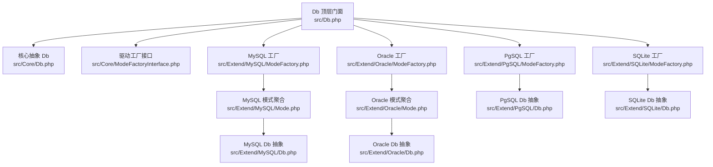
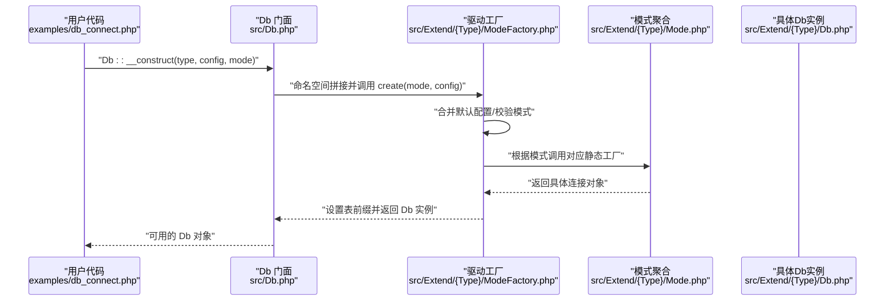
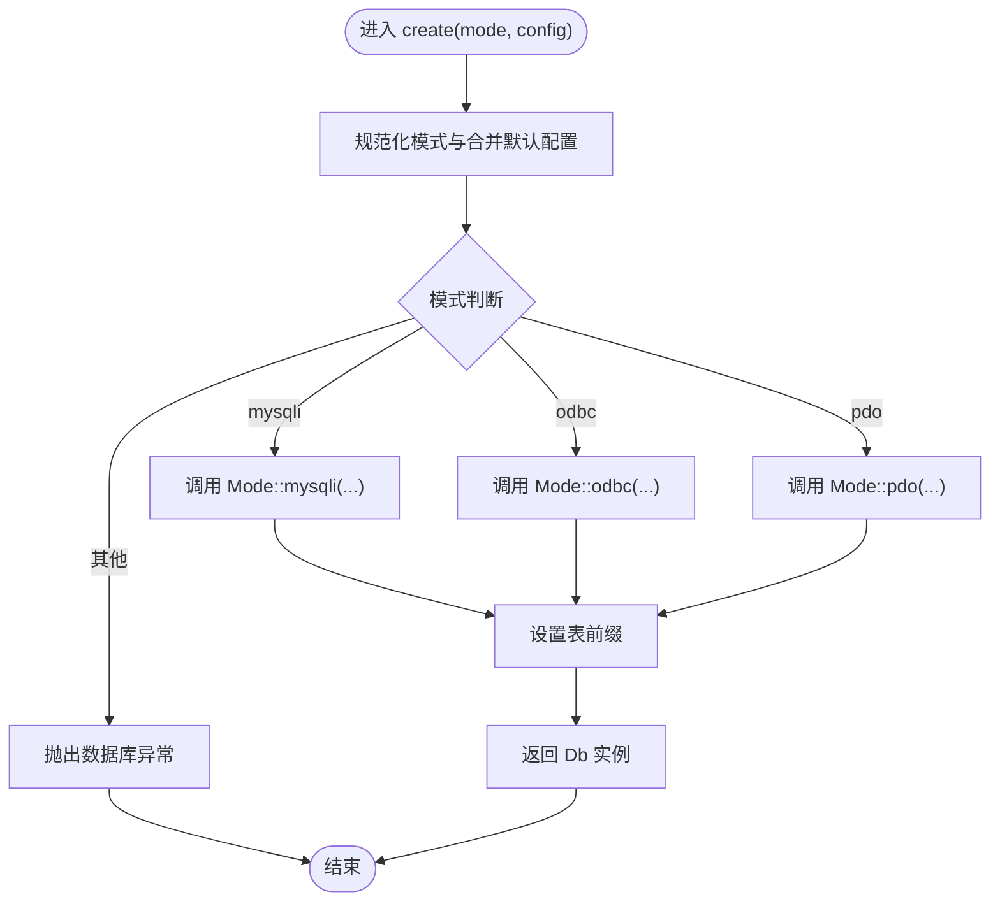
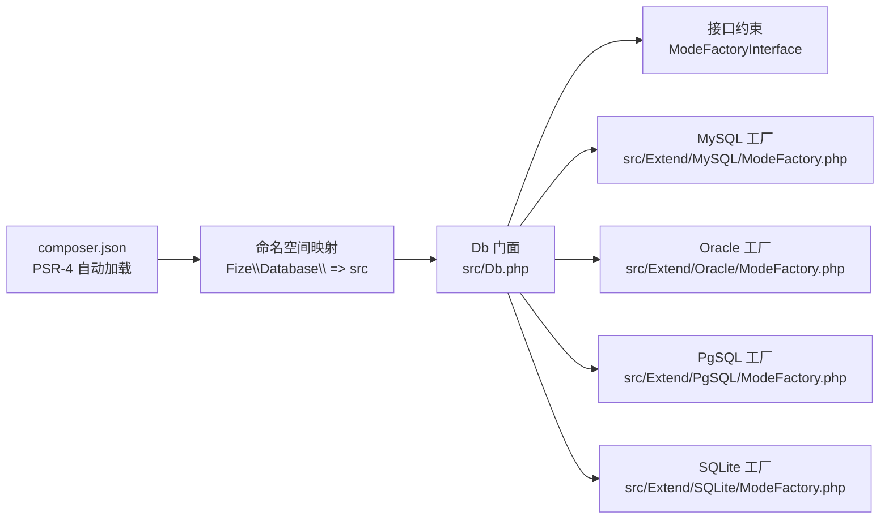

# 工厂模式应用

<cite>
**本文引用的文件**
- [src/Core/ModeFactoryInterface.php](file://src/Core/ModeFactoryInterface.php)
- [src/Db.php](file://src/Db.php)
- [src/Core/Db.php](file://src/Core/Db.php)
- [src/Extend/MySQL/ModeFactory.php](file://src/Extend/MySQL/ModeFactory.php)
- [src/Extend/Oracle/ModeFactory.php](file://src/Extend/Oracle/ModeFactory.php)
- [src/Extend/PgSQL/ModeFactory.php](file://src/Extend/PgSQL/ModeFactory.php)
- [src/Extend/SQLite/ModeFactory.php](file://src/Extend/SQLite/ModeFactory.php)
- [src/Extend/MySQL/Mode.php](file://src/Extend/MySQL/Mode.php)
- [src/Extend/Oracle/Mode.php](file://src/Extend/Oracle/Mode.php)
- [src/Extend/MySQL/Db.php](file://src/Extend/MySQL/Db.php)
- [src/Extend/Oracle/Db.php](file://src/Extend/Oracle/Db.php)
- [src/Extend/PgSQL/Db.php](file://src/Extend/PgSQL/Db.php)
- [src/Extend/SQLite/Db.php](file://src/Extend/SQLite/Db.php)
- [examples/db_connect.php](file://examples/db_connect.php)
- [composer.json](file://composer.json)
- [tests/Extend/MySQL/TestModeFactory.php](file://tests/Extend/MySQL/TestModeFactory.php)
</cite>

## 目录
1. [简介](#简介)
2. [项目结构](#项目结构)
3. [核心组件](#核心组件)
4. [架构总览](#架构总览)
5. [详细组件分析](#详细组件分析)
6. [依赖分析](#依赖分析)
7. [性能考虑](#性能考虑)
8. [故障排查指南](#故障排查指南)
9. [结论](#结论)
10. [附录](#附录)

## 简介
本文件围绕 FizeDatabase 中“工厂模式”的设计与实现展开，系统阐述 ModeFactoryInterface 接口的设计思想，以及如何通过工厂模式实现数据库连接的创建与管理。文档重点对比 MySQL、PostgreSQL、Oracle、SQLite 等不同数据库驱动的 ModeFactory 实现差异，并总结工厂模式在连接管理中的优势（解耦合、可扩展性、配置灵活性）。最后给出最佳实践与扩展指南，帮助开发者为新数据库类型快速实现工厂。

## 项目结构
FizeDatabase 采用“核心抽象 + 驱动扩展”的分层组织方式：
- 核心层位于 src/Core，定义通用抽象与接口（如核心 Db 抽象类与 ModeFactoryInterface）。
- 扩展层位于 src/Extend/<Driver>，每个数据库驱动包含独立的 ModeFactory、Mode、Db、Query 等组件。
- 顶层入口类 src/Db 作为静态门面，负责根据数据库类型动态定位对应驱动的 ModeFactory 并创建连接。

图表来源
- [src/Db.php:1-141](file://src/Db.php#L1-L141)
- [src/Core/ModeFactoryInterface.php:1-18](file://src/Core/ModeFactoryInterface.php#L1-L18)
- [src/Extend/MySQL/ModeFactory.php:1-82](file://src/Extend/MySQL/ModeFactory.php#L1-L82)
- [src/Extend/Oracle/ModeFactory.php:1-76](file://src/Extend/Oracle/ModeFactory.php#L1-L76)
- [src/Extend/PgSQL/ModeFactory.php:1-57](file://src/Extend/PgSQL/ModeFactory.php#L1-L57)
- [src/Extend/SQLite/ModeFactory.php:1-62](file://src/Extend/SQLite/ModeFactory.php#L1-L62)
- [src/Extend/MySQL/Mode.php:1-74](file://src/Extend/MySQL/Mode.php#L1-L74)
- [src/Extend/Oracle/Mode.php:1-63](file://src/Extend/Oracle/Mode.php#L1-L63)
- [src/Extend/MySQL/Db.php:1-246](file://src/Extend/MySQL/Db.php#L1-L246)
- [src/Extend/Oracle/Db.php:1-117](file://src/Extend/Oracle/Db.php#L1-L117)
- [src/Extend/PgSQL/Db.php:1-37](file://src/Extend/PgSQL/Db.php#L1-L37)
- [src/Extend/SQLite/Db.php:1-69](file://src/Extend/SQLite/Db.php#L1-L69)

章节来源
- [src/Db.php:1-141](file://src/Db.php#L1-L141)
- [composer.json:1-47](file://composer.json#L1-L47)

## 核心组件
- ModeFactoryInterface：定义统一的工厂接口，约束 create 方法签名，确保所有驱动工厂具备一致的创建能力。
- Db 顶层门面：对外暴露静态方法，内部通过反射式命名空间拼接定位具体驱动工厂，屏蔽上层对驱动细节的感知。
- 各驱动 ModeFactory：实现具体连接创建逻辑，统一处理默认配置合并、模式选择与异常处理。
- Mode 聚合类：为同一驱动内多种连接模式（如 PDO、ODBC、特定扩展）提供静态工厂方法，集中管理模式构造。
- 各驱动 Db 抽象：在核心 Db 基础上扩展方言特性（如 LIMIT、特殊 JOIN、分页策略等），保证 SQL 生成与行为一致性。

章节来源
- [src/Core/ModeFactoryInterface.php:1-18](file://src/Core/ModeFactoryInterface.php#L1-L18)
- [src/Db.php:1-141](file://src/Db.php#L1-L141)
- [src/Core/Db.php:1-800](file://src/Core/Db.php#L1-L800)

## 架构总览
工厂模式在本项目中的作用是“解耦上层调用与底层驱动实现”。Db 顶层门面通过数据库类型参数动态定位对应驱动的 ModeFactory，再由工厂根据连接模式（如 pdo、odbc、mysqli/oci/pqsql/sqlite3 等）创建具体的 Db 实例。这种设计使得：
- 上层无需关心具体驱动细节；
- 新增数据库驱动只需实现 ModeFactoryInterface 与对应的 Mode/Db 组件；
- 配置项集中管理，便于扩展与维护。

图表来源
- [examples/db_connect.php:1-39](file://examples/db_connect.php#L1-L39)
- [src/Db.php:32-56](file://src/Db.php#L32-L56)
- [src/Extend/MySQL/ModeFactory.php:21-80](file://src/Extend/MySQL/ModeFactory.php#L21-L80)
- [src/Extend/MySQL/Mode.php:14-74](file://src/Extend/MySQL/Mode.php#L14-L74)

## 详细组件分析

### 接口设计：ModeFactoryInterface
- 设计思想：通过统一接口约束工厂的 create 方法，确保所有驱动工厂具备一致的“模式+配置”创建能力；接口最小化，降低耦合度。
- 关键点：静态方法签名固定，返回类型为 Db 抽象，便于上层统一使用。

章节来源
- [src/Core/ModeFactoryInterface.php:8-17](file://src/Core/ModeFactoryInterface.php#L8-L17)

### 顶层门面：Db
- 动态定位工厂：通过命名空间拼接定位驱动工厂类，避免硬编码分支。
- 连接创建：支持两种入口：构造函数设置默认连接，静态 connect 返回新连接。
- 事务与查询：封装事务嵌套、查询与执行、表前缀设置等通用能力。

章节来源
- [src/Db.php:32-56](file://src/Db.php#L32-L56)
- [src/Db.php:84-114](file://src/Db.php#L84-L114)

### MySQL 工厂：ModeFactory（MySQL）
- 默认配置：统一合并默认参数（端口、字符集、前缀、opts、real/socket/ssl/flags/driver 等）。
- 模式分支：支持 mysqli、odbc、pdo 三种模式，分别调用 Mode 聚合类对应静态工厂。
- 异常处理：未知模式抛出数据库异常，提示错误模式。
- 后置处理：设置表前缀并返回 Db 实例。

图表来源
- [src/Extend/MySQL/ModeFactory.php:21-80](file://src/Extend/MySQL/ModeFactory.php#L21-L80)
- [src/Extend/MySQL/Mode.php:33-72](file://src/Extend/MySQL/Mode.php#L33-L72)

章节来源
- [src/Extend/MySQL/ModeFactory.php:21-80](file://src/Extend/MySQL/ModeFactory.php#L21-L80)
- [src/Extend/MySQL/Mode.php:14-74](file://src/Extend/MySQL/Mode.php#L14-L74)

### Oracle 工厂：ModeFactory（Oracle）
- 默认配置：包含端口、字符集、前缀、会话模式、连接类型、opts、driver 等。
- 模式分支：oci、odbc、pdo 三种模式，oci 模式需拼接连接串（主机:端口/库名）。
- 异常处理：未知模式抛异常。
- 后置处理：设置表前缀并返回 Db 实例。

章节来源
- [src/Extend/Oracle/ModeFactory.php:21-74](file://src/Extend/Oracle/ModeFactory.php#L21-L74)
- [src/Extend/Oracle/Mode.php:27-61](file://src/Extend/Oracle/Mode.php#L27-L61)

### PgSQL 工厂：ModeFactory（PostgreSQL）
- 默认配置：端口默认 5432、字符集 UTF8、前缀、driver、pconnect、connect_type、opts。
- 模式分支：odbc、pgsql（基于连接串）、pdo。
- 特殊处理：pgsql 模式通过 host/port/dbname/user/password 组装连接串。
- 后置处理：设置表前缀并返回 Db 实例。

章节来源
- [src/Extend/PgSQL/ModeFactory.php:21-55](file://src/Extend/PgSQL/ModeFactory.php#L21-L55)
- [src/Extend/PgSQL/Mode.php:14-62](file://src/Extend/PgSQL/Mode.php#L14-L62)

### SQLite 工厂：ModeFactory（SQLite）
- 默认配置：前缀、long_names、time_out、no_txn、sync_pragma、step_api、driver、flags、encryption_key、busy_timeout。
- 模式分支：odbc、sqlite3、pdo。
- 特殊处理：sqlite3 模式接收文件路径与 flags、加密密钥、忙等待超时等参数。
- 后置处理：设置表前缀并返回 Db 实例。

章节来源
- [src/Extend/SQLite/ModeFactory.php:21-60](file://src/Extend/SQLite/ModeFactory.php#L21-L60)
- [src/Extend/SQLite/Mode.php:14-62](file://src/Extend/SQLite/Mode.php#L14-L62)

### 驱动 Db 抽象：方言增强
- MySQL Db：支持 REPLACE、TRUNCATE、LIMIT、LOCK 等特性，提供 paginate 分页辅助。
- Oracle Db：支持 NATURAL JOIN 系列、LIMIT 语法适配。
- PgSQL Db：提供 LIMIT 语法适配。
- SQLite Db：支持 REPLACE、TRUNCATE、LIMIT 语法适配。

章节来源
- [src/Extend/MySQL/Db.php:129-152](file://src/Extend/MySQL/Db.php#L129-L152)
- [src/Extend/MySQL/Db.php:170-177](file://src/Extend/MySQL/Db.php#L170-L177)
- [src/Extend/MySQL/Db.php:187-203](file://src/Extend/MySQL/Db.php#L187-L203)
- [src/Extend/Oracle/Db.php:104-115](file://src/Extend/Oracle/Db.php#L104-L115)
- [src/Extend/PgSQL/Db.php:27-36](file://src/Extend/PgSQL/Db.php#L27-L36)
- [src/Extend/SQLite/Db.php:44-67](file://src/Extend/SQLite/Db.php#L44-L67)

### 使用示例与测试
- 示例：通过 Db 门面以指定类型与模式创建连接，并执行查询。
- 测试：验证工厂 create 方法返回有效对象。

章节来源
- [examples/db_connect.php:14-22](file://examples/db_connect.php#L14-L22)
- [tests/Extend/MySQL/TestModeFactory.php:19-22](file://tests/Extend/MySQL/TestModeFactory.php#L19-L22)

## 依赖分析
- 命名空间与自动加载：composer.json 定义 PSR-4 自动加载规则，确保 Db 门面与各驱动工厂可被正确解析。
- 外部扩展建议：composer.json 的 suggest 字段列出各数据库驱动扩展，便于运行时启用对应模式（如 pdo_mysql、pdo_pgsql、pdo_oci、pdo_sqlite、mysqli、oci8、odbc、pg_*、sqlite3、sqlsrv 等）。
- 工厂耦合关系：Db 门面仅依赖 ModeFactoryInterface，具体实现通过命名空间拼接延迟绑定，降低编译期耦合。

图表来源
- [composer.json:11-18](file://composer.json#L11-L18)
- [src/Db.php:35-55](file://src/Db.php#L35-L55)
- [src/Core/ModeFactoryInterface.php:8-17](file://src/Core/ModeFactoryInterface.php#L8-L17)

章节来源
- [composer.json:11-37](file://composer.json#L11-L37)
- [src/Db.php:35-55](file://src/Db.php#L35-L55)

## 性能考虑
- 工厂创建成本：工厂仅做配置合并与模式分发，创建开销低；实际性能瓶颈通常在数据库驱动与网络。
- 连接复用：建议结合上层业务使用连接池或长连接策略（若驱动支持），减少频繁创建销毁带来的开销。
- SQL 构建缓存：核心 Db 提供查询结果缓存机制，可降低重复查询成本（注意缓存键与参数变化）。
- 模式选择：PDO 通常具备更好的跨平台与扩展性；特定场景可选用原生命令模式（如 MySQL mysqli、PgSQL pgsql、SQLite sqlite3），但需权衡可移植性。

## 故障排查指南
- 未知模式异常：当传入的模式不在工厂支持范围内时会抛出异常。检查模式名称与驱动工厂支持列表。
- 配置缺失：不同驱动的默认配置不同，若缺少必要参数（如 Oracle 连接串、PgSQL 连接串、SQLite 文件路径等），需补齐配置。
- 扩展未安装：若选择的模式依赖 PHP 扩展（如 pdo_mysql、pdo_pgsql、pdo_oci、mysqli、oci8、odbc、pg_*、sqlite3、sqlsrv 等），需确认扩展已安装并启用。
- 事务嵌套：Db 门面实现了事务嵌套计数，确保外层事务控制正确提交/回滚。

章节来源
- [src/Extend/MySQL/ModeFactory.php:75-77](file://src/Extend/MySQL/ModeFactory.php#L75-L77)
- [src/Db.php:84-114](file://src/Db.php#L84-L114)
- [composer.json:20-37](file://composer.json#L20-L37)

## 结论
FizeDatabase 通过 ModeFactoryInterface 将“连接创建”从上层调用中剥离，配合 Db 门面与各驱动工厂，实现了高内聚、低耦合的数据库连接管理方案。工厂模式的优势体现在：
- 解耦合：上层仅依赖接口，不感知具体驱动实现；
- 可扩展性：新增数据库驱动只需实现工厂与模式聚合；
- 配置灵活性：统一默认配置合并与模式分支，兼顾易用性与定制性。

## 附录

### 工厂模式最佳实践与扩展指南
- 实现步骤
  1) 在 src/Extend/<NewDriver>/ 下创建 ModeFactory 类，实现 ModeFactoryInterface::create。
  2) 在 src/Extend/<NewDriver>/ 下创建 Mode 聚合类，提供静态工厂方法（如 pdo、odbc、native 等）。
  3) 在 src/Extend/<NewDriver>/ 下创建 Db 抽象类，覆盖 build/limit 等方言特性。
  4) 在 composer.json 的 autoload 中确保命名空间映射正确。
- 配置约定
  - 统一合并默认配置，避免遗漏关键参数；
  - 明确各模式所需的最小参数集合（如 Oracle 连接串、PgSQL 连接串、SQLite 文件路径）。
- 错误处理
  - 对未知模式抛出明确异常信息；
  - 对关键参数缺失进行前置校验与提示。
- 测试建议
  - 编写工厂 create 方法的单元测试，覆盖所有支持模式；
  - 验证 Db 抽象的 SQL 生成与方言特性。

章节来源
- [src/Core/ModeFactoryInterface.php:8-17](file://src/Core/ModeFactoryInterface.php#L8-L17)
- [src/Extend/MySQL/ModeFactory.php:21-80](file://src/Extend/MySQL/ModeFactory.php#L21-L80)
- [src/Extend/Oracle/ModeFactory.php:21-74](file://src/Extend/Oracle/ModeFactory.php#L21-L74)
- [src/Extend/PgSQL/ModeFactory.php:21-55](file://src/Extend/PgSQL/ModeFactory.php#L21-L55)
- [src/Extend/SQLite/ModeFactory.php:21-60](file://src/Extend/SQLite/ModeFactory.php#L21-L60)
- [composer.json:11-18](file://composer.json#L11-L18)