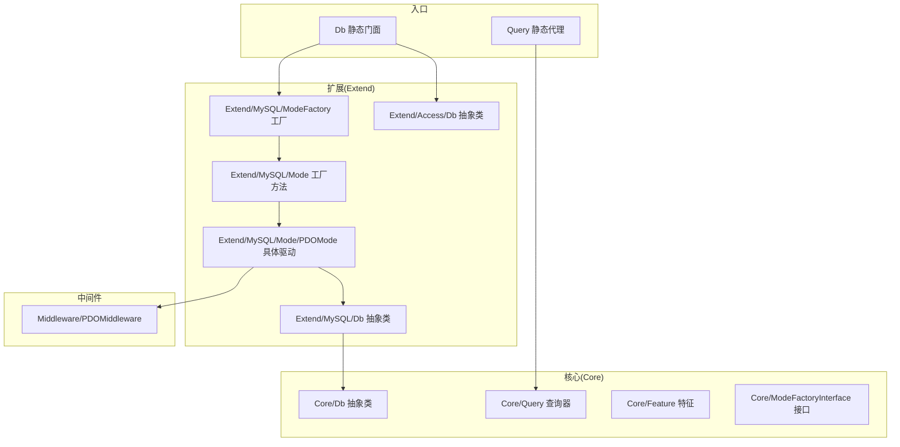
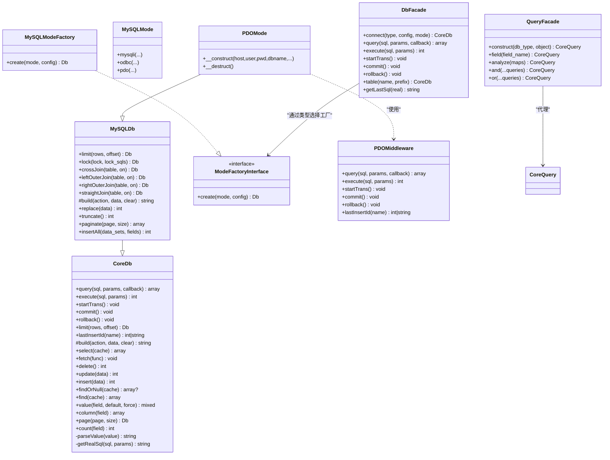
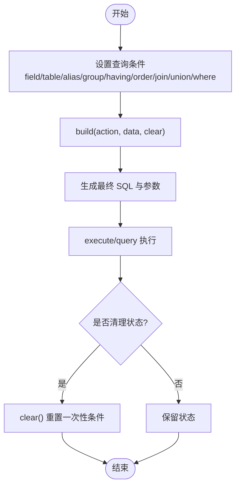
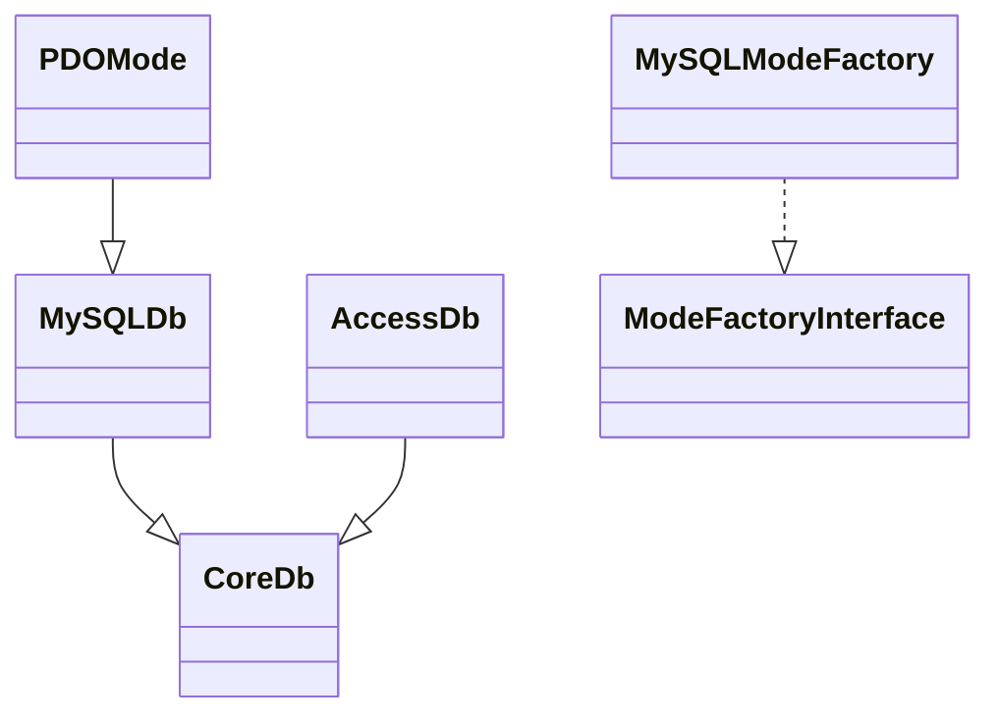
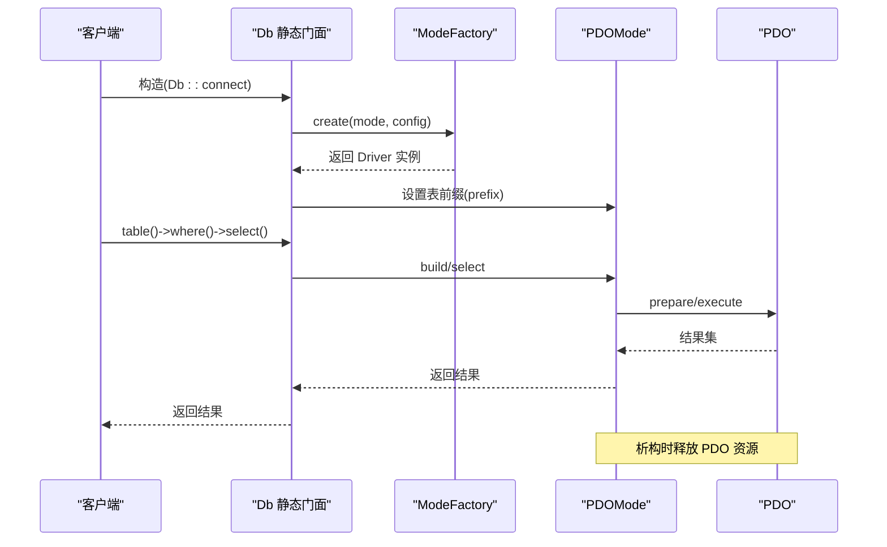
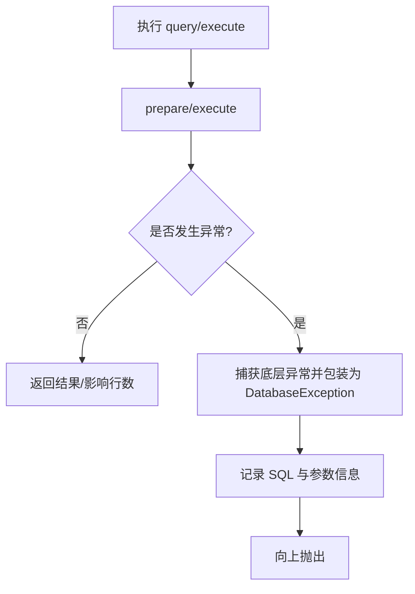
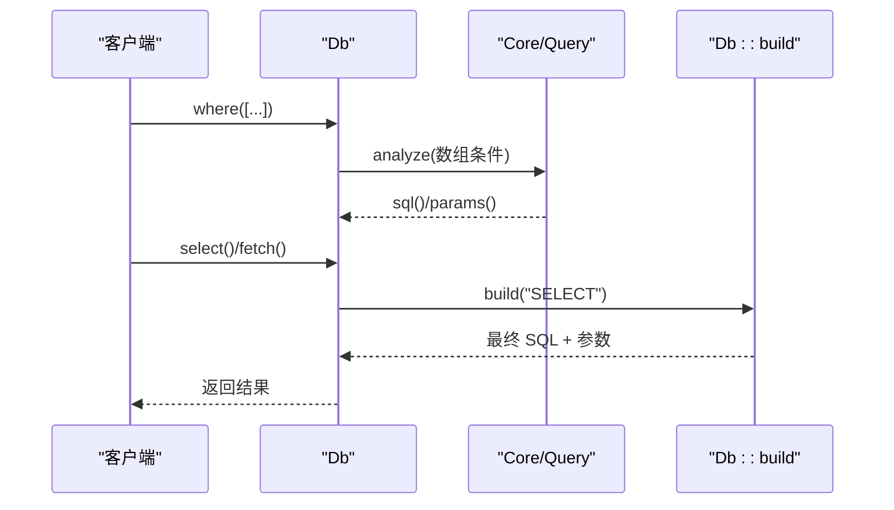
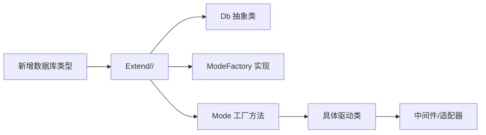
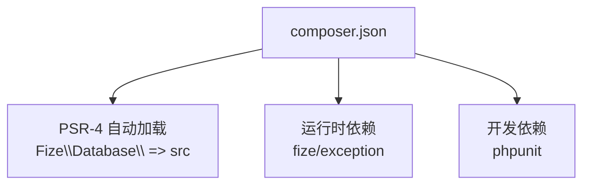

# 数据库抽象层

<cite>
**本文引用的文件**
- [src/Core/Db.php](file://src/Core/Db.php)
- [src/Db.php](file://src/Db.php)
- [src/Core/Query.php](file://src/Core/Query.php)
- [src/Query.php](file://src/Query.php)
- [src/Core/Feature.php](file://src/Core/Feature.php)
- [src/Core/ModeFactoryInterface.php](file://src/Core/ModeFactoryInterface.php)
- [src/Extend/MySQL/Db.php](file://src/Extend/MySQL/Db.php)
- [src/Extend/MySQL/ModeFactory.php](file://src/Extend/MySQL/ModeFactory.php)
- [src/Extend/MySQL/Mode.php](file://src/Extend/MySQL/Mode.php)
- [src/Extend/MySQL/Mode/PDOMode.php](file://src/Extend/MySQL/Mode/PDOMode.php)
- [src/Extend/Access/Db.php](file://src/Extend/Access/Db.php)
- [src/Middleware/PDOMiddleware.php](file://src/Middleware/PDOMiddleware.php)
- [composer.json](file://composer.json)
- [examples/db_connect.php](file://examples/db_connect.php)
</cite>

## 目录
1. [简介](#简介)
2. [项目结构](#项目结构)
3. [核心组件](#核心组件)
4. [架构总览](#架构总览)
5. [详细组件分析](#详细组件分析)
6. [依赖分析](#依赖分析)
7. [性能考虑](#性能考虑)
8. [故障排查指南](#故障排查指南)
9. [结论](#结论)
10. [附录](#附录)

## 简介
本文件系统性阐述 FizeDatabase 的数据库抽象层设计原理与实现机制，重点围绕 Core/Db 抽象类的设计思想、属性与方法职责、与具体数据库实现的关系、生命周期与资源清理、异常处理策略等进行深入解析，并提供面向初学者的概念性理解与面向高级开发者的扩展指导。

## 项目结构
该项目采用“核心抽象 + 多数据库扩展 + 工厂 + 中间件”的分层组织方式：
- Core 层：定义通用抽象接口与公共能力（查询器、特征、模式工厂接口、核心 Db 抽象类）
- Extend 层：按数据库类型划分子包，每个子包包含各自的 Db 抽象类、ModeFactory、Mode 工厂与具体驱动实现
- Middleware 层：封装底层驱动交互（如 PDO），屏蔽差异
- Db/Query：对外静态入口与查询器静态代理，负责根据数据库类型选择对应实现

**图表来源**
- [src/Core/Db.php:13-135](file://src/Core/Db.php#L13-L135)
- [src/Core/Query.php:13-105](file://src/Core/Query.php#L13-L105)
- [src/Core/Feature.php:10-32](file://src/Core/Feature.php#L10-L32)
- [src/Core/ModeFactoryInterface.php:8-17](file://src/Core/ModeFactoryInterface.php#L8-L17)
- [src/Extend/MySQL/Db.php:11-152](file://src/Extend/MySQL/Db.php#L11-L152)
- [src/Extend/MySQL/ModeFactory.php:11-80](file://src/Extend/MySQL/ModeFactory.php#L11-L80)
- [src/Extend/MySQL/Mode.php:14-73](file://src/Extend/MySQL/Mode.php#L14-L73)
- [src/Extend/MySQL/Mode/PDOMode.php:14-52](file://src/Extend/MySQL/Mode/PDOMode.php#L14-L52)
- [src/Extend/Access/Db.php:13-72](file://src/Extend/Access/Db.php#L13-L72)
- [src/Middleware/PDOMiddleware.php:12-128](file://src/Middleware/PDOMiddleware.php#L12-L128)
- [src/Db.php:13-140](file://src/Db.php#L13-L140)
- [src/Query.php:12-129](file://src/Query.php#L12-L129)

**章节来源**
- [composer.json:11-18](file://composer.json#L11-L18)
- [src/Db.php:13-140](file://src/Db.php#L13-L140)
- [src/Query.php:12-129](file://src/Query.php#L12-L129)

## 核心组件
本节聚焦 Core/Db 抽象类的设计与职责，解释其如何为不同数据库驱动提供统一接口，并说明与具体实现的关系。

- 抽象方法与职责
  - query：执行查询并返回结果集，支持回调逐行遍历
  - execute：执行写操作并返回受影响行数
  - startTrans/commit/rollback：事务控制
  - limit：统一 LIMIT 语义（由具体驱动实现适配）
  - lastInsertId：返回最后插入 ID 或序列值
- 属性与状态
  - 查询构建状态：distinct、field、tablePrefix、tableName、alias、where、whereParams、group、having、havingParams、order、join、union、sql、params
  - 查询缓存：静态缓存 rows，按最终 SQL 字符串键缓存结果
- 查询构建与执行流程
  - 链式设置条件（field、table、alias、group、having、order、join、union、where）
  - build(action, data, clear)：根据动作类型拼装 SQL 并合并参数
  - select/fetch/delete/update/insert/replace/truncate/count/value/column/page/paginate 等高层封装
- 安全与兼容
  - parseValue：对预处理语句中的值进行安全化处理（供日志/调试使用）
  - getRealSql：将问号占位与绑定参数拼接为最终 SQL（仅供日志）

**章节来源**
- [src/Core/Db.php:13-135](file://src/Core/Db.php#L13-L135)
- [src/Core/Db.php:160-206](file://src/Core/Db.php#L160-L206)
- [src/Core/Db.php:583-637](file://src/Core/Db.php#L583-L637)
- [src/Core/Db.php:644-800](file://src/Core/Db.php#L644-L800)

## 架构总览
抽象层通过“抽象类 + 工厂 + 中间件”的组合实现多数据库驱动的统一接口：
- 抽象类 Core/Db 定义统一的查询 DSL 与执行流程
- Extend/*/Db 抽象类覆盖特定方言（如 MySQL 的 LIMIT、LOCK、REPLACE、TRUNCATE、分页）
- ModeFactoryInterface 与具体工厂（如 Extend/MySQL/ModeFactory）负责根据模式创建具体驱动实例
- 中间件（如 Middleware/PDOMiddleware）封装 PDO/ODBC/ADODB 等底层差异
- Db/Query 作为静态门面与查询器代理，按数据库类型动态定位对应实现

**图表来源**
- [src/Core/Db.php:13-135](file://src/Core/Db.php#L13-L135)
- [src/Extend/MySQL/Db.php:11-152](file://src/Extend/MySQL/Db.php#L11-L152)
- [src/Core/ModeFactoryInterface.php:8-17](file://src/Core/ModeFactoryInterface.php#L8-L17)
- [src/Extend/MySQL/ModeFactory.php:11-80](file://src/Extend/MySQL/ModeFactory.php#L11-L80)
- [src/Extend/MySQL/Mode.php:14-73](file://src/Extend/MySQL/Mode.php#L14-L73)
- [src/Extend/MySQL/Mode/PDOMode.php:14-52](file://src/Extend/MySQL/Mode/PDOMode.php#L14-L52)
- [src/Middleware/PDOMiddleware.php:12-128](file://src/Middleware/PDOMiddleware.php#L12-L128)
- [src/Db.php:13-140](file://src/Db.php#L13-L140)
- [src/Query.php:12-129](file://src/Query.php#L12-L129)

## 详细组件分析

### Core/Db 抽象类设计思想
- 统一查询 DSL：通过 field/table/alias/group/having/order/join/union/where 等方法构建 SQL 片段，最终由 build 汇总
- 分离关注点：抽象类负责“如何拼装 SQL”，具体驱动负责“如何执行 SQL”
- 可扩展性：通过 Feature trait 提供 formatTable/formatField 等钩子，允许不同数据库对标识符进行差异化处理
- 生命周期：提供 clear/clear 与 build 的配合，避免状态污染；析构函数预留清理空间
- 错误处理：通过 getRealSql/getLastSql 辅助日志与排错；异常统一包装为 DatabaseException

**图表来源**
- [src/Core/Db.php:583-637](file://src/Core/Db.php#L583-L637)
- [src/Core/Db.php:550-571](file://src/Core/Db.php#L550-L571)

**章节来源**
- [src/Core/Db.php:13-135](file://src/Core/Db.php#L13-L135)
- [src/Core/Db.php:583-637](file://src/Core/Db.php#L583-L637)
- [src/Core/Db.php:550-571](file://src/Core/Db.php#L550-L571)

### 抽象类与具体数据库实现的关系
- Extend/*/Db 抽象类继承 Core/Db，覆盖 limit/build 等以适配方言特性（如 MySQL 的 LIMIT、LOCK、REPLACE、TRUNCATE、分页）
- 通过 Feature trait 提供格式化钩子，不同数据库可按需覆写（如 Access 的 parseValue 与 TOP/LIMIT 语义映射）
- 通过 ModeFactoryInterface 与具体工厂创建具体驱动实例，实现“按类型 + 模式”选择驱动

**图表来源**
- [src/Extend/MySQL/Db.php:11-152](file://src/Extend/MySQL/Db.php#L11-L152)
- [src/Extend/Access/Db.php:13-72](file://src/Extend/Access/Db.php#L13-L72)
- [src/Core/ModeFactoryInterface.php:8-17](file://src/Core/ModeFactoryInterface.php#L8-L17)
- [src/Extend/MySQL/ModeFactory.php:11-80](file://src/Extend/MySQL/ModeFactory.php#L11-L80)
- [src/Extend/MySQL/Mode/PDOMode.php:14-52](file://src/Extend/MySQL/Mode/PDOMode.php#L14-L52)

**章节来源**
- [src/Extend/MySQL/Db.php:11-152](file://src/Extend/MySQL/Db.php#L11-L152)
- [src/Extend/Access/Db.php:13-72](file://src/Extend/Access/Db.php#L13-L72)
- [src/Core/ModeFactoryInterface.php:8-17](file://src/Core/ModeFactoryInterface.php#L8-L17)
- [src/Extend/MySQL/ModeFactory.php:11-80](file://src/Extend/MySQL/ModeFactory.php#L11-L80)

### 生命周期管理与资源清理
- PDO 驱动通过 PDOMiddleware 在析构时释放 PDO 资源，确保连接及时回收
- Core/Db 的 clear() 重置一次性条件，避免跨查询状态污染
- Db 静态门面维护单一 DB 实例与事务嵌套计数，保证事务边界正确

**图表来源**
- [src/Db.php:26-56](file://src/Db.php#L26-L56)
- [src/Extend/MySQL/ModeFactory.php:21-80](file://src/Extend/MySQL/ModeFactory.php#L21-L80)
- [src/Extend/MySQL/Mode/PDOMode.php:29-51](file://src/Extend/MySQL/Mode/PDOMode.php#L29-L51)
- [src/Middleware/PDOMiddleware.php:39-42](file://src/Middleware/PDOMiddleware.php#L39-L42)

**章节来源**
- [src/Middleware/PDOMiddleware.php:39-42](file://src/Middleware/PDOMiddleware.php#L39-L42)
- [src/Core/Db.php:550-571](file://src/Core/Db.php#L550-L571)
- [src/Db.php:26-56](file://src/Db.php#L26-L56)

### 异常处理策略
- 中间件捕获底层异常并统一包装为 DatabaseException，携带 SQL 与参数便于定位问题
- Core/Db 的 getRealSql/getLastSql 用于生成最终 SQL 日志，辅助排错
- 查询器 Query 在条件解析时对字符串与表达式进行安全化处理，避免注入风险

**图表来源**
- [src/Middleware/PDOMiddleware.php:51-93](file://src/Middleware/PDOMiddleware.php#L51-L93)
- [src/Core/Db.php:178-206](file://src/Core/Db.php#L178-L206)

**章节来源**
- [src/Middleware/PDOMiddleware.php:51-93](file://src/Middleware/PDOMiddleware.php#L51-L93)
- [src/Core/Db.php:178-206](file://src/Core/Db.php#L178-L206)

### 查询器与条件构建
- Core/Query 提供丰富的条件表达式（=、<>、<、<=、>、>=、LIKE、IN、NOT IN、BETWEEN、EXISTS、IS NULL 等）
- Query::analyze 将数组条件解析为 SQL 片段与参数数组，支持组合逻辑 AND/OR
- Db::where/having 支持数组、Query 对象与原生 SQL 预处理语句三种输入

**图表来源**
- [src/Core/Db.php:335-393](file://src/Core/Db.php#L335-L393)
- [src/Core/Query.php:521-568](file://src/Core/Query.php#L521-L568)
- [src/Core/Db.php:583-637](file://src/Core/Db.php#L583-L637)

**章节来源**
- [src/Core/Db.php:335-393](file://src/Core/Db.php#L335-L393)
- [src/Core/Query.php:521-568](file://src/Core/Query.php#L521-L568)

### 多数据库支持与扩展指导
- 通过 Extend/*/Db 抽象类与 ModeFactory 实现“按数据库类型 + 模式”选择驱动
- 新增数据库类型步骤（示例以 MySQL 为例）：
  1) 在 Extend/<DB>/ 下创建 Db 抽象类，继承 Core/Db 并实现方言特性
  2) 实现 Extend/<DB>/ModeFactory 实现 ModeFactoryInterface::create
  3) 在 Extend/<DB>/Mode 中提供工厂方法创建具体驱动
  4) 具体驱动类继承 Extend/<DB>/Db，并使用相应中间件（如 PDOMiddleware）
  5) 在 Db/Query 静态代理中按数据库类型映射到对应 Query 实现

**图表来源**
- [src/Extend/MySQL/Db.php:11-152](file://src/Extend/MySQL/Db.php#L11-L152)
- [src/Extend/MySQL/ModeFactory.php:11-80](file://src/Extend/MySQL/ModeFactory.php#L11-L80)
- [src/Extend/MySQL/Mode.php:14-73](file://src/Extend/MySQL/Mode.php#L14-L73)
- [src/Extend/MySQL/Mode/PDOMode.php:14-52](file://src/Extend/MySQL/Mode/PDOMode.php#L14-L52)
- [src/Middleware/PDOMiddleware.php:12-128](file://src/Middleware/PDOMiddleware.php#L12-L128)

**章节来源**
- [src/Extend/MySQL/Db.php:11-152](file://src/Extend/MySQL/Db.php#L11-L152)
- [src/Extend/MySQL/ModeFactory.php:11-80](file://src/Extend/MySQL/ModeFactory.php#L11-L80)
- [src/Extend/MySQL/Mode.php:14-73](file://src/Extend/MySQL/Mode.php#L14-L73)
- [src/Extend/MySQL/Mode/PDOMode.php:14-52](file://src/Extend/MySQL/Mode/PDOMode.php#L14-L52)

## 依赖分析
- Composer 自动加载 PSR-4 映射至 src 目录
- 运行时依赖 fize/exception 提供统一异常体系
- 开发期依赖 phpunit 进行测试

**图表来源**
- [composer.json:11-18](file://composer.json#L11-L18)
- [composer.json:43-46](file://composer.json#L43-L46)

**章节来源**
- [composer.json:11-18](file://composer.json#L11-L18)
- [composer.json:16-37](file://composer.json#L16-L37)

## 性能考虑
- 查询缓存：Db::select 支持按最终 SQL 字符串缓存结果，减少重复查询开销
- fetch 与 select：fetch 通过回调逐行处理，减少中间转换，适合大数据量场景
- 参数绑定：统一使用问号占位与参数绑定，避免字符串拼接带来的性能与安全问题
- 分页：MySQL 的 paginate 使用 SQL_CALC_FOUND_ROWS 与 FOUND_ROWS()，减少二次统计查询

**章节来源**
- [src/Core/Db.php:700-711](file://src/Core/Db.php#L700-L711)
- [src/Core/Db.php:668-672](file://src/Core/Db.php#L668-L672)
- [src/Extend/MySQL/Db.php:187-203](file://src/Extend/MySQL/Db.php#L187-L203)

## 故障排查指南
- 查看最终 SQL：使用 Db::getLastSql(true) 输出 getRealSql 后的最终 SQL，核对参数绑定
- 事务嵌套：Db 静态门面维护事务嵌套计数，确保外层提交/回滚时才真正执行
- 异常定位：中间件捕获底层异常并包装为 DatabaseException，携带 SQL 与参数，便于快速定位
- 查询器调试：Query::analyze 支持数组条件解析，结合 SQL 与参数输出进行验证

**章节来源**
- [src/Core/Db.php:199-206](file://src/Core/Db.php#L199-L206)
- [src/Db.php:84-114](file://src/Db.php#L84-L114)
- [src/Middleware/PDOMiddleware.php:69-92](file://src/Middleware/PDOMiddleware.php#L69-L92)
- [src/Core/Query.php:521-568](file://src/Core/Query.php#L521-L568)

## 结论
FizeDatabase 的数据库抽象层通过 Core/Db 抽象类统一查询 DSL 与执行流程，借助 Extend/*/Db 抽象类与 ModeFactory 工厂实现多数据库驱动的统一接口，中间件屏蔽底层差异，Db/Query 静态门面简化使用。该设计既保证了易用性，又具备良好的扩展性与可维护性，适合在多数据库环境下复用统一的查询能力。

## 附录
- 示例：连接与查询示例展示了如何通过 Db 静态门面设置默认连接并执行查询

**章节来源**
- [examples/db_connect.php:14-38](file://examples/db_connect.php#L14-L38)