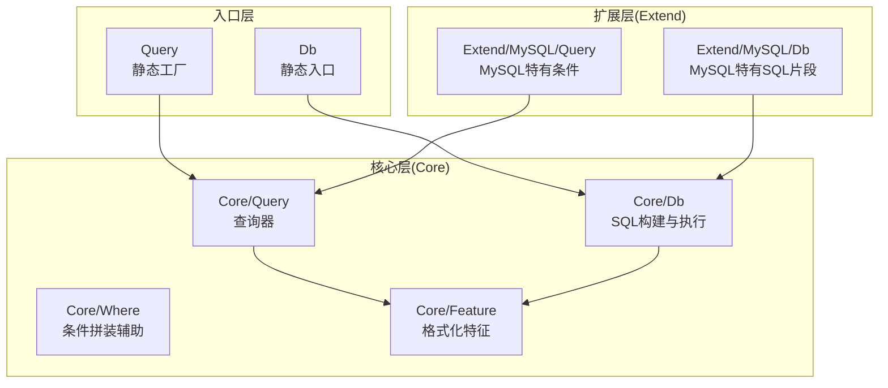
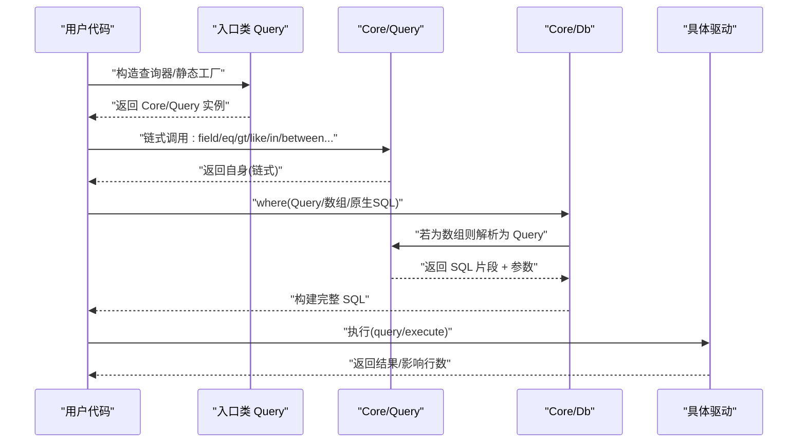
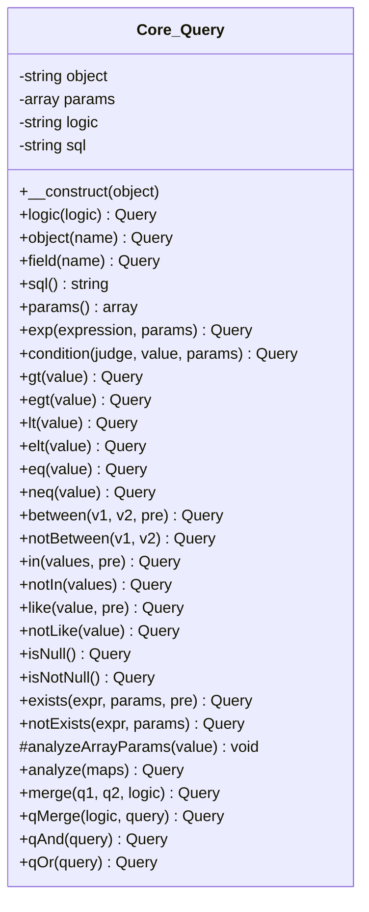
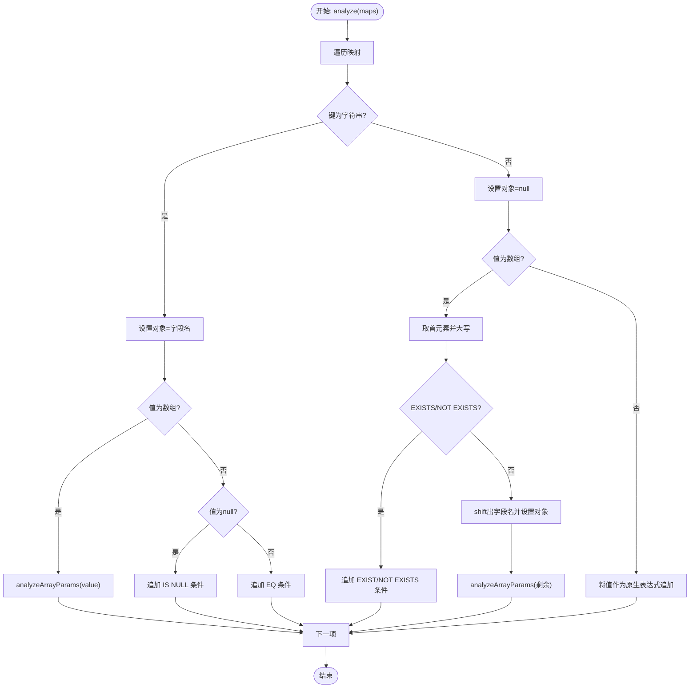
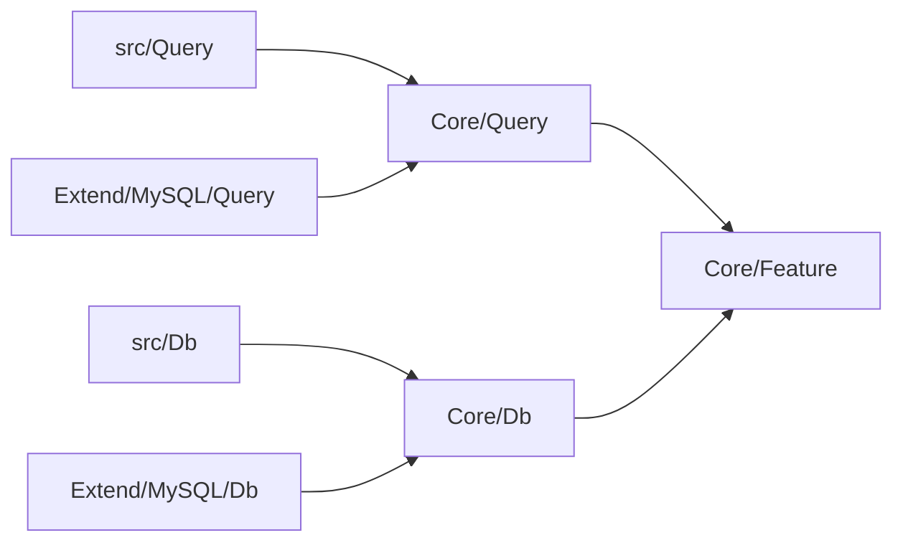

# 查询构建器模式

<cite>
**本文引用的文件**
- [src/Core/Query.php](file://src/Core/Query.php)
- [src/Core/Where.php](file://src/Core/Where.php)
- [src/Query.php](file://src/Query.php)
- [src/Core/Db.php](file://src/Core/Db.php)
- [src/Db.php](file://src/Db.php)
- [src/Core/Feature.php](file://src/Core/Feature.php)
- [src/Extend/MySQL/Query.php](file://src/Extend/MySQL/Query.php)
- [src/Extend/MySQL/Db.php](file://src/Extend/MySQL/Db.php)
- [examples/db_select.php](file://examples/db_select.php)
- [examples/db_insert.php](file://examples/db_insert.php)
- [examples/db_update.php](file://examples/db_update.php)
- [examples/db_paginate.php](file://examples/db_paginate.php)
- [tests/Core/TestQuery.php](file://tests/Core/TestQuery.php)
- [composer.json](file://composer.json)
</cite>

## 目录
1. [简介](#简介)
2. [项目结构](#项目结构)
3. [核心组件](#核心组件)
4. [架构总览](#架构总览)
5. [组件详解](#组件详解)
6. [依赖关系分析](#依赖关系分析)
7. [性能与安全](#性能与安全)
8. [故障排查指南](#故障排查指南)
9. [结论](#结论)
10. [附录：使用示例与最佳实践](#附录使用示例与最佳实践)

## 简介
本文件系统化解析 FizeDatabase 的查询构建器模式设计与实现，重点围绕 Core 层的 Query 类与 Where 类，阐述其链式调用的实现原理、SQL 片段构建流程、参数绑定机制；深入分析数组条件、Query 对象、原生 SQL 三种输入的解析算法；解释查询构建器的缓存机制、性能优化策略与安全性保障；并提供使用示例与最佳实践，帮助开发者掌握复杂 SQL 查询的构建技巧。

## 项目结构
仓库采用“核心层 + 扩展层 + 示例 + 测试”的组织方式：
- 核心层（Core）：Query、Where、Db、Feature 等基础能力
- 扩展层（Extend）：按数据库类型划分的驱动实现，如 MySQL、PgSQL、Oracle、SQLSRV、SQLite、Access、ODBC 等
- 示例（examples）：展示常见 CRUD 与分页用法
- 测试（tests）：覆盖核心 Query 与 Db 的行为验证

图示来源
- [src/Core/Query.php:13-621](file://src/Core/Query.php#L13-L621)
- [src/Core/Where.php:5-66](file://src/Core/Where.php#L5-L66)
- [src/Query.php:12-130](file://src/Query.php#L12-L130)
- [src/Core/Db.php:13-941](file://src/Core/Db.php#L13-L941)
- [src/Extend/MySQL/Query.php:12-91](file://src/Extend/MySQL/Query.php#L12-L91)
- [src/Extend/MySQL/Db.php:11-246](file://src/Extend/MySQL/Db.php#L11-L246)

章节来源
- [composer.json:11-15](file://composer.json#L11-L15)

## 核心组件
- Core/Query：面向条件表达式的查询构建器，支持链式调用、数组解析、原生表达式、子查询、IN/BETWEEN/LIKE/NULL 等多种条件，并负责 SQL 片段与参数的维护
- Core/Where：提供与 Query 类似的条件拼装能力（当前实现与 Query 的差异较小）
- Extend/MySQL/Query：在 Core/Query 基础上扩展 MySQL 特有的正则匹配（REGEXP/RLIKE）等条件
- Core/Db：负责将查询器产出的 SQL 片段与参数整合为完整 SQL 并执行，内置缓存、分页、锁表等高级特性
- Extend/MySQL/Db：在 Core/Db 基础上扩展 LIMIT、锁表、分页计算等 MySQL 特性
- 入口类：src/Query 与 src/Db 提供静态工厂与便捷入口，屏蔽具体驱动细节

章节来源
- [src/Core/Query.php:13-621](file://src/Core/Query.php#L13-L621)
- [src/Core/Where.php:5-66](file://src/Core/Where.php#L5-L66)
- [src/Query.php:12-130](file://src/Query.php#L12-L130)
- [src/Core/Db.php:13-941](file://src/Core/Db.php#L13-L941)
- [src/Extend/MySQL/Query.php:12-91](file://src/Extend/MySQL/Query.php#L12-L91)
- [src/Extend/MySQL/Db.php:11-246](file://src/Extend/MySQL/Db.php#L11-L246)

## 架构总览
查询构建器的整体工作流如下：
- 通过入口类（src/Query、src/Db）创建或获取查询器实例
- 使用链式 API 构建 WHERE/HAVING/JOIN/ORDER/GROUP 等片段
- Core/Db 将各片段与参数合并，生成最终 SQL
- 执行阶段由具体驱动完成，返回结果或影响行数
- 查询结果可选择使用内存缓存，避免重复执行相同 SQL

图示来源
- [src/Query.php:35-77](file://src/Query.php#L35-L77)
- [src/Core/Db.php:335-359](file://src/Core/Db.php#L335-L359)
- [src/Core/Db.php:583-637](file://src/Core/Db.php#L583-L637)

## 组件详解

### Query 类：链式调用与条件构建
- 链式调用：多数方法返回 $this，支持连续调用，便于构建复杂条件
- 对象与字段：object/field 指定当前比较对象（通常是字段），用于生成形如“字段 操作符 值”的表达式
- 组合逻辑：logic 指定当前条件与下一个条件之间的逻辑（默认 AND）
- 原生表达式：exp 接受任意 SQL 片段与可选参数，自动拼接到当前 SQL 片段中
- 条件方法族：gt、egt、lt、elt、eq、neq、between、notBetween、in、notIn、like、notLike、isNull、isNotNull、exists、notExists
- 数组解析：analyze 将“数组条件”解析为多个条件，支持多种简写与组合逻辑
- 查询器合并：qMerge/qAnd/qOr/qXOr（MySQL 扩展）将多个 Query 或数组合并为复合条件

图示来源
- [src/Core/Query.php:13-621](file://src/Core/Query.php#L13-L621)

章节来源
- [src/Core/Query.php:41-105](file://src/Core/Query.php#L41-L105)
- [src/Core/Query.php:113-164](file://src/Core/Query.php#L113-L164)
- [src/Core/Query.php:171-287](file://src/Core/Query.php#L171-L287)
- [src/Core/Query.php:295-377](file://src/Core/Query.php#L295-L377)
- [src/Core/Query.php:383-568](file://src/Core/Query.php#L383-L568)
- [src/Core/Query.php:570-621](file://src/Core/Query.php#L570-L621)

### 数组条件解析算法
数组条件支持多种形态，解析流程如下：
- 键为字符串：视为字段名，值为数组时进入 analyzeArrayParams 分支解析；值为 null 视为 IS NULL；值为标量视为 EQ
- 键为非字符串：视为“无字段名”的子语句，首元素为关键字（如 EXISTS/NOT EXISTS），其余为参数
- analyzeArrayParams 支持的操作包括：BETWEEN/NOT BETWEEN、CONDITION、>=/EGT、<=/ELT、=/EQ、EXP、>/>GT、IN、LIKE、</LT、!=/<>/NEQ、IS NULL/IS NOT NULL、NOT IN、NOT LIKE 等
- 组合逻辑：默认 AND；可通过第三个参数或特定写法指定 OR/XOR 等

图示来源
- [src/Core/Query.php:521-568](file://src/Core/Query.php#L521-L568)
- [src/Core/Query.php:383-512](file://src/Core/Query.php#L383-L512)

章节来源
- [src/Core/Query.php:521-568](file://src/Core/Query.php#L521-L568)
- [src/Core/Query.php:383-512](file://src/Core/Query.php#L383-L512)

### 参数绑定机制
- 占位符统一为“?”，由 Query 维护 params 数组，按顺序与 SQL 中的 ? 对应
- 自动绑定策略：
  - 字符串值在某些场景会被直接拼接（如 BETWEEN/IN 未检测到危险字符时），否则使用占位符并加入参数数组
  - condition/exp 显式传入数组参数时，直接合并到 params
  - between/in 等方法根据值是否包含危险字符决定是否使用占位符
- 安全性保障：
  - 对字符串值进行转义处理（如单引号包裹）
  - 对 LIKE/EXP 等场景，优先使用占位符绑定，避免注入
  - exists/notExists 等子查询场景，明确不使用对象字段参与拼接

章节来源
- [src/Core/Query.php:145-164](file://src/Core/Query.php#L145-L164)
- [src/Core/Query.php:233-245](file://src/Core/Query.php#L233-L245)
- [src/Core/Query.php:295-328](file://src/Core/Query.php#L295-L328)
- [src/Core/Query.php:113-136](file://src/Core/Query.php#L113-L136)

### Where 类：条件拼装辅助
- 提供与 Query 类类似的逻辑：logic、qMerge、qAnd、qOr
- 与 Query 的关系：Where 更偏向条件拼装的辅助角色，Query 为完整的查询器

章节来源
- [src/Core/Where.php:16-64](file://src/Core/Where.php#L16-L64)

### 扩展：MySQL 特有能力
- MySQL/Query 在 Core/Query 基础上新增 REGEXP、NOT REGEXP、RLIKE、NOT RLIKE 条件，以及 qXOr(XOR) 组合
- MySQL/Db 在 Core/Db 基础上新增 LIMIT、锁表（LOCK）、分页计算（SQL_CALC_FOUND_ROWS + FOUND_ROWS）

章节来源
- [src/Extend/MySQL/Query.php:21-91](file://src/Extend/MySQL/Query.php#L21-L91)
- [src/Extend/MySQL/Db.php:36-152](file://src/Extend/MySQL/Db.php#L36-L152)

## 依赖关系分析
- 入口层依赖核心层：src/Query 与 src/Db 通过命名空间定位到 Core/Query 与 Core/Db，并在运行时根据数据库类型动态选择扩展实现
- 核心层依赖扩展层：Core/Db 在 where/having 解析时，优先尝试加载与当前驱动同名的 Query 类，以支持方言特性
- 特征层：Feature 提供字段/表名格式化钩子，便于不同数据库差异化处理

图示来源
- [src/Query.php:35-77](file://src/Query.php#L35-L77)
- [src/Core/Db.php:335-359](file://src/Core/Db.php#L335-L359)
- [src/Core/Feature.php:10-33](file://src/Core/Feature.php#L10-L33)

章节来源
- [src/Query.php:24-77](file://src/Query.php#L24-L77)
- [src/Core/Db.php:335-359](file://src/Core/Db.php#L335-L359)
- [src/Core/Feature.php:10-33](file://src/Core/Feature.php#L10-L33)

## 性能与安全
- 性能优化
  - 查询缓存：Core/Db 在 select 中对真实 SQL（参数替换后的）做内存缓存，避免重复执行相同查询
  - 参数顺序绑定：统一“?”占位符，减少驱动差异带来的开销
  - 惰性拼接：先累积 SQL 片段与参数，最后一次性构建完整 SQL，降低中间态成本
- 安全保障
  - 自动转义与占位符优先：字符串值在必要时进行转义；涉及 LIKE/EXP 等场景优先使用占位符绑定
  - exists/notExists 明确不使用对象字段参与拼接，避免误拼接导致的逻辑错误
  - 字段/表名格式化：通过 Feature 钩子允许驱动定制标识符格式，减少歧义

章节来源
- [src/Core/Db.php:699-711](file://src/Core/Db.php#L699-L711)
- [src/Core/Db.php:177-190](file://src/Core/Db.php#L177-L190)
- [src/Core/Query.php:145-164](file://src/Core/Query.php#L145-L164)

## 故障排查指南
- 组合逻辑错误
  - 症状：条件之间逻辑不符合预期
  - 排查：确认是否正确调用 logic 或数组条件中是否提供了正确的组合逻辑参数
- 参数绑定异常
  - 症状：LIKE/EXP 等场景出现注入风险或参数错位
  - 排查：确保传入数组参数或显式使用占位符；避免在字符串值中直接拼接未转义内容
- EXISTS/NOT EXISTS 无效
  - 症状：子查询条件未生效
  - 排查：确认子查询 SQL 片段正确，且未误传对象字段
- MySQL 特性不可用
  - 症状：REGEXP/RLIKE/XOR 等报错
  - 排查：确认使用的是 MySQL 扩展驱动，并在 MySQL/Query 上调用相应方法

章节来源
- [src/Core/Query.php:267-287](file://src/Core/Query.php#L267-L287)
- [src/Extend/MySQL/Query.php:21-91](file://src/Extend/MySQL/Query.php#L21-L91)

## 结论
FizeDatabase 的查询构建器通过 Core/Query 与 Core/Db 的清晰分工，实现了链式条件构建、灵活的数组解析、统一的参数绑定与安全策略，并通过扩展层适配不同数据库方言。配合内存缓存与惰性拼接，既保证了易用性，也兼顾了性能与安全性。开发者可基于本文档提供的解析算法与最佳实践，快速构建复杂 SQL 查询。

## 附录：使用示例与最佳实践

### 使用示例
- 查询（LIKE、LIMIT）
  - 示例路径：[examples/db_select.php:15-21](file://examples/db_select.php#L15-L21)
- 插入（含参数化）
  - 示例路径：[examples/db_insert.php:16-28](file://examples/db_insert.php#L16-L28)
- 更新（原样 SQL 与参数化混合）
  - 示例路径：[examples/db_update.php:15-21](file://examples/db_update.php#L15-L21)
- 分页（MySQL 特有）
  - 示例路径：[examples/db_paginate.php:17-21](file://examples/db_paginate.php#L17-L21)

### 最佳实践
- 优先使用链式 API 构建条件，保持可读性与可维护性
- LIKE/EXP 等场景务必使用占位符绑定，避免直接拼接字符串
- 数组条件中明确组合逻辑，避免默认 AND 导致的歧义
- 复杂条件优先使用 Query 对象或原生表达式，必要时拆分为多个 Query 再合并
- 使用扩展驱动时，充分利用方言特性（如 MySQL 的 REGEXP/RLIKE/XOR）
- 合理使用缓存：对重复查询开启缓存，避免频繁执行相同 SQL

章节来源
- [examples/db_select.php:15-21](file://examples/db_select.php#L15-L21)
- [examples/db_insert.php:16-28](file://examples/db_insert.php#L16-L28)
- [examples/db_update.php:15-21](file://examples/db_update.php#L15-L21)
- [examples/db_paginate.php:17-21](file://examples/db_paginate.php#L17-L21)