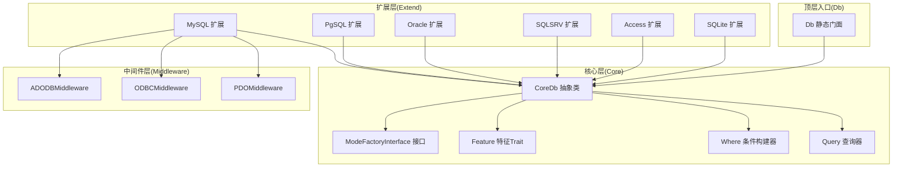
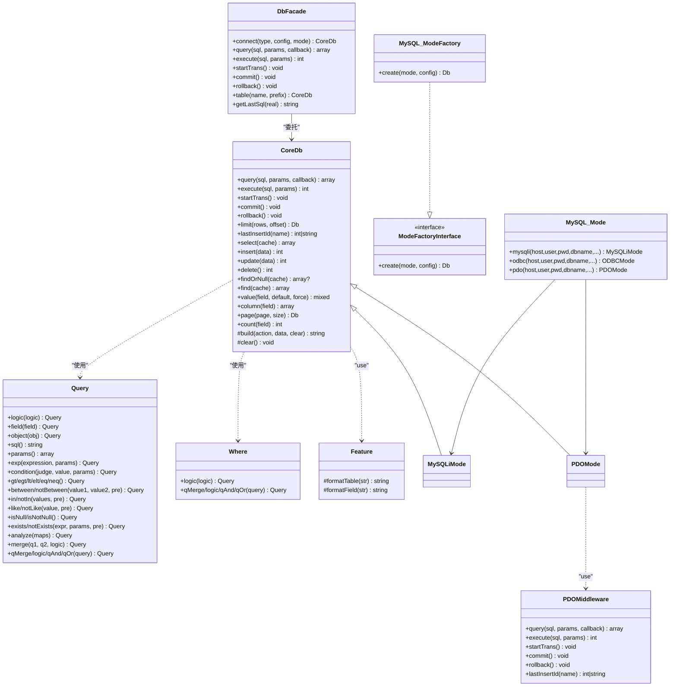
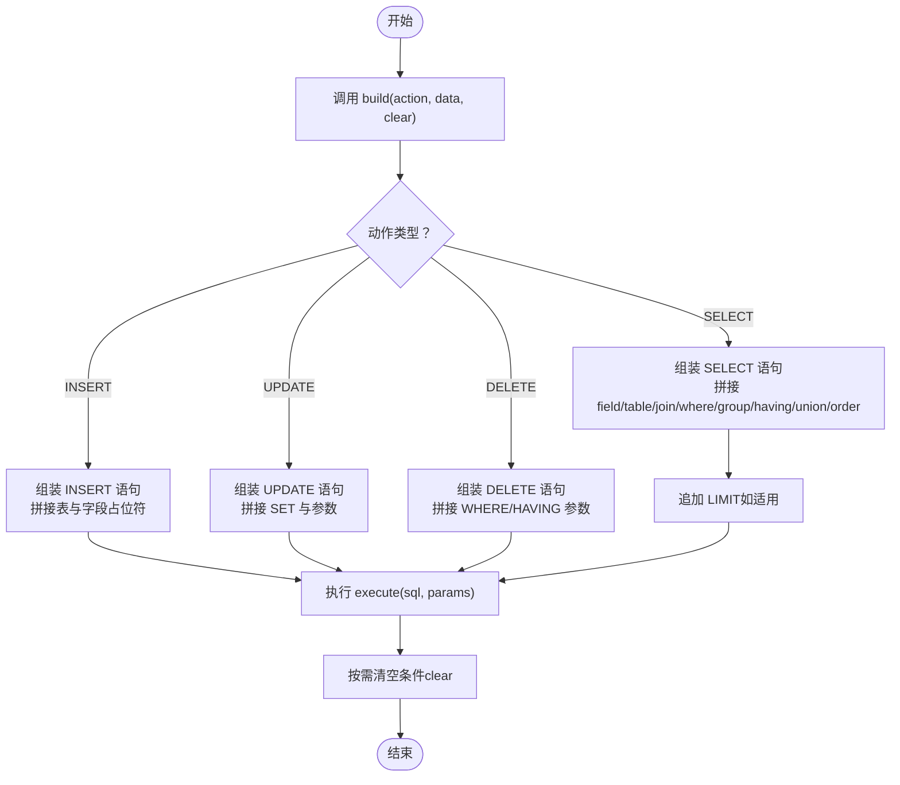
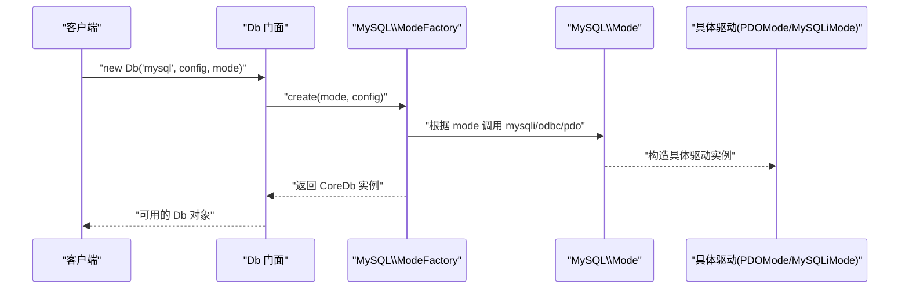
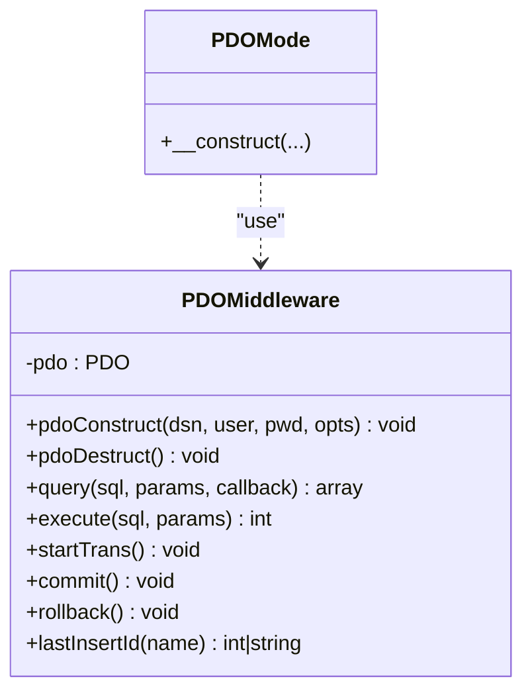
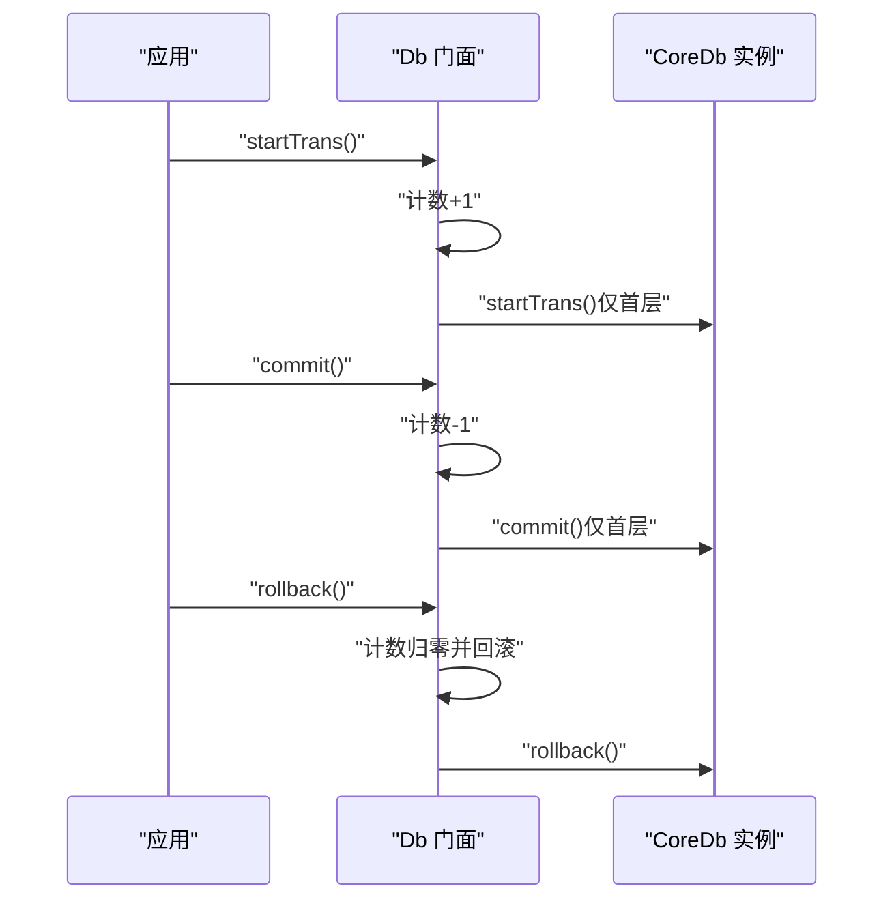
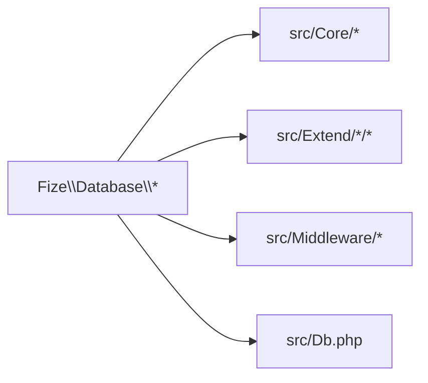

# 核心概念

<cite>
**本文引用的文件**   
- [src/Core/Db.php](file://src/Core/Db.php)
- [src/Core/Feature.php](file://src/Core/Feature.php)
- [src/Core/Query.php](file://src/Core/Query.php)
- [src/Core/Where.php](file://src/Core/Where.php)
- [src/Core/ModeFactoryInterface.php](file://src/Core/ModeFactoryInterface.php)
- [src/Db.php](file://src/Db.php)
- [src/Middleware/PDOMiddleware.php](file://src/Middleware/PDOMiddleware.php)
- [src/Extend/MySQL/ModeFactory.php](file://src/Extend/MySQL/ModeFactory.php)
- [src/Extend/MySQL/Mode.php](file://src/Extend/MySQL/Mode.php)
- [src/Extend/MySQL/Mode/PDOMode.php](file://src/Extend/MySQL/Mode/PDOMode.php)
- [src/Extend/MySQL/Mode/MySQLiMode.php](file://src/Extend/MySQL/Mode/MySQLiMode.php)
- [src/Extend/MySQL/Db.php](file://src/Extend/MySQL/Db.php)
- [examples/db_connect.php](file://examples/db_connect.php)
- [examples/db_select.php](file://examples/db_select.php)
- [composer.json](file://composer.json)
</cite>

## 目录
1. [简介](#简介)
2. [项目结构](#项目结构)
3. [核心组件](#核心组件)
4. [架构总览](#架构总览)
5. [详细组件分析](#详细组件分析)
6. [依赖分析](#依赖分析)
7. [性能考量](#性能考量)
8. [故障排查指南](#故障排查指南)
9. [结论](#结论)
10. [附录](#附录)

## 简介
本文件系统性阐述 FizeDatabase 的核心概念与设计原理，重点覆盖：
- 数据库抽象层的设计思想与职责分离
- 工厂模式在连接管理中的应用
- 中间件模式的架构优势与复用策略
- 链式查询构建器的工作原理与 Where 条件构建器实现机制
- Feature Trait 的作用与扩展点
- Query 类的设计模式与 Where 条件构建器的实现细节
- 面向初学者的概念性理解与面向高级开发者的实现细节
- 架构图与流程图帮助把握组件交互关系

## 项目结构
该项目采用“核心层 + 扩展层 + 中间件层”的分层组织方式：
- 核心层（Core）：定义通用抽象、查询构建器、特征项等
- 扩展层（Extend）：按数据库类型划分，提供具体驱动与工厂
- 中间件层（Middleware）：封装底层驱动能力（如 PDO）
- 顶层入口（Db）：对外提供静态便捷接口与连接生命周期管理



图表来源
- [src/Db.php:1-141](file://src/Db.php#L1-L141)
- [src/Core/Db.php:1-941](file://src/Core/Db.php#L1-L941)
- [src/Core/Query.php:1-621](file://src/Core/Query.php#L1-L621)
- [src/Core/Where.php:1-66](file://src/Core/Where.php#L1-L66)
- [src/Core/Feature.php:1-33](file://src/Core/Feature.php#L1-L33)
- [src/Core/ModeFactoryInterface.php:1-18](file://src/Core/ModeFactoryInterface.php#L1-L18)
- [src/Extend/MySQL/ModeFactory.php:1-82](file://src/Extend/MySQL/ModeFactory.php#L1-L82)
- [src/Extend/MySQL/Mode.php:1-74](file://src/Extend/MySQL/Mode.php#L1-L74)
- [src/Middleware/PDOMiddleware.php:1-129](file://src/Middleware/PDOMiddleware.php#L1-L129)

章节来源
- [composer.json:11-18](file://composer.json#L11-L18)

## 核心组件
- 抽象数据库 CoreDb：统一定义 CRUD、事务、链式条件、SQL 构建与缓存等能力，屏蔽具体驱动差异
- 查询构建器 CoreQuery：将数组/对象条件解析为 SQL 片段与参数，支持 AND/OR 组合、表达式、IN/BETWEEN/LIKE/EXISTS 等
- 条件构建器 CoreWhere：提供与 Query 类似的组合能力（兼容旧接口），便于直接拼装复杂 WHERE
- 特征 Trait CoreFeature：提供表名/字段名格式化钩子，供不同数据库方言定制
- 工厂接口 CoreModeFactoryInterface：约束扩展层工厂创建行为
- 顶层门面 Db：静态入口，负责连接初始化、事务嵌套计数、转发调用至 CoreDb
- 中间件 PDOMiddleware：封装 PDO 能力，提供 query/execute/事务/自增 ID 等
- MySQL 扩展：提供多种连接模式（PDO/ODBC/MySQLi），通过 ModeFactory 与 Mode 统一创建

章节来源
- [src/Core/Db.php:13-941](file://src/Core/Db.php#L13-L941)
- [src/Core/Query.php:13-621](file://src/Core/Query.php#L13-L621)
- [src/Core/Where.php:5-66](file://src/Core/Where.php#L5-L66)
- [src/Core/Feature.php:10-33](file://src/Core/Feature.php#L10-L33)
- [src/Core/ModeFactoryInterface.php:8-18](file://src/Core/ModeFactoryInterface.php#L8-L18)
- [src/Db.php:13-141](file://src/Db.php#L13-L141)
- [src/Middleware/PDOMiddleware.php:12-129](file://src/Middleware/PDOMiddleware.php#L12-L129)
- [src/Extend/MySQL/ModeFactory.php:11-82](file://src/Extend/MySQL/ModeFactory.php#L11-L82)
- [src/Extend/MySQL/Mode.php:14-74](file://src/Extend/MySQL/Mode.php#L14-L74)

## 架构总览
FizeDatabase 通过“抽象 + 工厂 + 中间件 + 门面”的组合实现：
- 抽象层统一接口，扩展层按数据库类型提供具体实现
- 工厂根据配置选择连接模式（PDO/ODBC/MySQLi）
- 中间件封装底层驱动，屏蔽异常与资源管理
- 顶层门面提供静态便捷 API，并维护事务嵌套状态



图表来源
- [src/Core/Db.php:13-941](file://src/Core/Db.php#L13-L941)
- [src/Core/Query.php:13-621](file://src/Core/Query.php#L13-L621)
- [src/Core/Where.php:5-66](file://src/Core/Where.php#L5-L66)
- [src/Core/Feature.php:10-33](file://src/Core/Feature.php#L10-L33)
- [src/Core/ModeFactoryInterface.php:8-18](file://src/Core/ModeFactoryInterface.php#L8-L18)
- [src/Db.php:13-141](file://src/Db.php#L13-L141)
- [src/Middleware/PDOMiddleware.php:12-129](file://src/Middleware/PDOMiddleware.php#L12-L129)
- [src/Extend/MySQL/ModeFactory.php:11-82](file://src/Extend/MySQL/ModeFactory.php#L11-L82)
- [src/Extend/MySQL/Mode.php:14-74](file://src/Extend/MySQL/Mode.php#L14-L74)
- [src/Extend/MySQL/Mode/MySQLiMode.php:14-251](file://src/Extend/MySQL/Mode/MySQLiMode.php#L14-L251)
- [src/Extend/MySQL/Mode/PDOMode.php:14-53](file://src/Extend/MySQL/Mode/PDOMode.php#L14-L53)

## 详细组件分析

### 抽象数据库 CoreDb：职责与设计
- 职责
  - 统一 CRUD、事务、LIMIT、缓存、链式条件（field/group/order/join/union/where/having/alias）
  - 统一 SQL 构建与参数绑定，支持“预处理语句 + 参数数组”的安全执行
  - 提供便捷方法：select/find/findOrNull/value/column/page/count 等
- 设计要点
  - 使用 Feature Trait 提供表/字段格式化钩子，便于方言适配
  - 将“条件组装”与“SQL 构建”解耦，where/having 支持数组/Query/原生 SQL 三种输入
  - clear/build 分离，避免重复拼接，提高可维护性
  - select 支持简单缓存，基于最终 SQL 文本缓存结果集



图表来源
- [src/Core/Db.php:583-637](file://src/Core/Db.php#L583-L637)

章节来源
- [src/Core/Db.php:13-941](file://src/Core/Db.php#L13-L941)

### 查询构建器 CoreQuery：设计模式与 Where 条件构建
- 设计模式
  - 流式接口（Fluent Interface）：所有条件方法返回 $this，支持链式调用
  - 组合模式：qMerge/qAnd/qOr 将多个 Query 对象组合为复合条件
  - 解析器模式：analyze 将数组条件映射为 SQL 片段与参数
- Where 条件构建机制
  - 支持表达式 exp、比较条件 condition、范围 between/notBetween、集合 in/notIn、模糊 like/notLike、空值 isNull/isNotNull、子查询 exists/notExists
  - analyze 支持多级数组语法，自动推断组合逻辑（AND/OR），兼容多种简写形式
  - 与 CoreDb::where/having 的协作：当传入数组或 Query 对象时，由 Query 解析并回填 SQL 与参数

```mermaid
sequenceDiagram
participant Client as "客户端"
participant Db as "CoreDb : : where"
participant Q as "CoreQuery : : analyze"
participant SQL as "SQL/参数"
Client->>Db : "where(数组/Query/原生SQL, 参数)"
alt 传入数组
Db->>Q : "new Query(); analyze(数组)"
Q-->>Db : "sql()/params()"
else 传入 Query 对象
Db->>Q : "直接读取 sql()/params()"
else 传入原生SQL
Db->>Db : "保存SQL与参数"
end
Db-->>Client : "$this链式"
```

图表来源
- [src/Core/Db.php:335-359](file://src/Core/Db.php#L335-L359)
- [src/Core/Db.php:369-393](file://src/Core/Db.php#L369-L393)
- [src/Core/Query.php:521-568](file://src/Core/Query.php#L521-L568)

章节来源
- [src/Core/Query.php:13-621](file://src/Core/Query.php#L13-L621)
- [src/Core/Db.php:335-393](file://src/Core/Db.php#L335-L393)

### 条件构建器 CoreWhere：兼容与扩展
- 作用：提供与 Query 类似的组合能力，便于直接拼装复杂 WHERE
- 与 Query 的关系：二者均支持 qMerge/qAnd/qOr 与逻辑组合，Where 更偏向“直接表达式”场景

章节来源
- [src/Core/Where.php:5-66](file://src/Core/Where.php#L5-L66)

### Feature Trait：扩展点与方言适配
- 作用：提供 formatTable/formatField 两个钩子，供具体数据库方言定制表名/字段名格式
- 应用：在扩展层（如 MySQL/PG/Oracle）可通过继承 CoreDb 并覆写 Feature 钩子实现差异化格式化

章节来源
- [src/Core/Feature.php:10-33](file://src/Core/Feature.php#L10-L33)
- [src/Core/Db.php:15-15](file://src/Core/Db.php#L15-L15)

### 工厂模式：连接管理与模式选择
- 工厂接口 CoreModeFactoryInterface：约束 create(mode, config) 返回 Db 实例
- MySQL 扩展工厂 ModeFactory：根据 mode（pdo/odbc/mysqli）与 config（主机、用户、密码、库、端口、字符集、前缀、选项等）创建具体连接
- 模式聚合 Mode：集中暴露 mysqli/odbc/pdo 三种构造方法，统一入口



图表来源
- [src/Db.php:32-56](file://src/Db.php#L32-L56)
- [src/Extend/MySQL/ModeFactory.php:21-80](file://src/Extend/MySQL/ModeFactory.php#L21-L80)
- [src/Extend/MySQL/Mode.php:33-72](file://src/Extend/MySQL/Mode.php#L33-L72)
- [src/Extend/MySQL/Mode/PDOMode.php:29-42](file://src/Extend/MySQL/Mode/PDOMode.php#L29-L42)
- [src/Extend/MySQL/Mode/MySQLiMode.php:42-65](file://src/Extend/MySQL/Mode/MySQLiMode.php#L42-L65)

章节来源
- [src/Core/ModeFactoryInterface.php:8-18](file://src/Core/ModeFactoryInterface.php#L8-L18)
- [src/Extend/MySQL/ModeFactory.php:11-82](file://src/Extend/MySQL/ModeFactory.php#L11-L82)
- [src/Extend/MySQL/Mode.php:14-74](file://src/Extend/MySQL/Mode.php#L14-L74)

### 中间件模式：PDO 封装与异常处理
- PDOMiddleware：封装 PDO 的 prepare/execute/fetch/事务/自增 ID 等，统一异常包装为 DatabaseException
- 在 PDOMode 中通过 use PDOMiddleware 复用能力，构造时拼装 DSN 并设置错误模式



图表来源
- [src/Middleware/PDOMiddleware.php:12-129](file://src/Middleware/PDOMiddleware.php#L12-L129)
- [src/Extend/MySQL/Mode/PDOMode.php:14-53](file://src/Extend/MySQL/Mode/PDOMode.php#L14-L53)

章节来源
- [src/Middleware/PDOMiddleware.php:12-129](file://src/Middleware/PDOMiddleware.php#L12-L129)
- [src/Extend/MySQL/Mode/PDOMode.php:14-53](file://src/Extend/MySQL/Mode/PDOMode.php#L14-L53)

### 顶层门面 Db：静态便捷 API 与事务嵌套
- 提供静态方法：connect/query/execute/startTrans/commit/rollback/table/getLastSql
- 事务嵌套：通过静态计数 transactionNestingLevel 控制嵌套事务的开启与提交/回滚时机



图表来源
- [src/Db.php:84-114](file://src/Db.php#L84-L114)

章节来源
- [src/Db.php:13-141](file://src/Db.php#L13-L141)

### 示例与使用路径
- 连接与查询示例展示了从门面初始化、链式条件构建到执行与日志输出的完整流程

章节来源
- [examples/db_connect.php:1-39](file://examples/db_connect.php#L1-L39)
- [examples/db_select.php:1-22](file://examples/db_select.php#L1-L22)

## 依赖分析
- 自动加载与命名空间
  - PSR-4 映射 Fize\Database\* → src 目录，确保扩展层（Extend/*）与中间件（Middleware/*）可被正确加载
- 外部依赖
  - PHP ≥ 7.1；建议版本 ≥ 7.2
  - 各数据库扩展依赖（PDO/ODBC/MySQLi/OCI/PgSQL/SQLSRV/SQLite3 等），由 composer.suggest 提示



图表来源
- [composer.json:11-18](file://composer.json#L11-L18)

章节来源
- [composer.json:11-47](file://composer.json#L11-L47)

## 性能考量
- 查询缓存：CoreDb::select 支持基于最终 SQL 文本的简单缓存，减少重复查询开销
- 预处理与参数绑定：统一使用问号占位符与参数数组，避免字符串拼接引发的性能与安全问题
- fetch vs select：遍历回调 fetch 在某些场景下略优于 select，但 select 更易用
- LIMIT 与分页：MySQL 扩展提供 paginate 与 page，结合 SQL_CALC_FOUND_ROWS 与 FOUND_ROWS() 实现高效分页统计

章节来源
- [src/Core/Db.php:699-711](file://src/Core/Db.php#L699-L711)
- [src/Extend/MySQL/Db.php:187-203](file://src/Extend/MySQL/Db.php#L187-L203)

## 故障排查指南
- 异常封装：中间件层将底层异常统一包装为 DatabaseException，携带 SQL 与参数信息，便于定位
- 常见问题
  - SQL 注入风险：严格使用参数绑定，避免字符串拼接
  - 事务嵌套：通过门面的嵌套计数控制，避免重复提交或提前回滚
  - 连接模式：确认配置的 mode 与扩展依赖匹配，避免找不到驱动

章节来源
- [src/Middleware/PDOMiddleware.php:69-92](file://src/Middleware/PDOMiddleware.php#L69-L92)
- [src/Db.php:84-114](file://src/Db.php#L84-L114)
- [src/Extend/MySQL/ModeFactory.php:75-77](file://src/Extend/MySQL/ModeFactory.php#L75-L77)

## 结论
FizeDatabase 通过清晰的分层与设计模式实现了：
- 抽象层统一接口与查询构建
- 工厂与模式选择实现灵活连接管理
- 中间件复用底层驱动能力并统一异常处理
- 顶层门面提供简洁 API 与事务嵌套控制
- Query/Where 提供强大的链式条件构建能力

这些设计既适合初学者快速上手，也为高级开发者提供了良好的扩展点与实现细节。

## 附录
- 使用建议
  - 优先使用 PDO 模式，具备更好的跨数据库一致性与生态支持
  - 条件构建优先使用数组/Query，复杂场景再使用原生 SQL
  - 合理利用缓存与 LIMIT，避免一次性拉取大量数据
  - 正确管理事务嵌套，避免并发与一致性问题