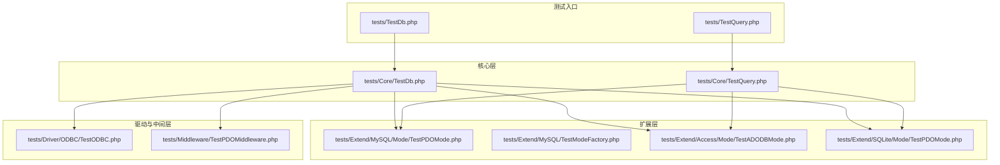
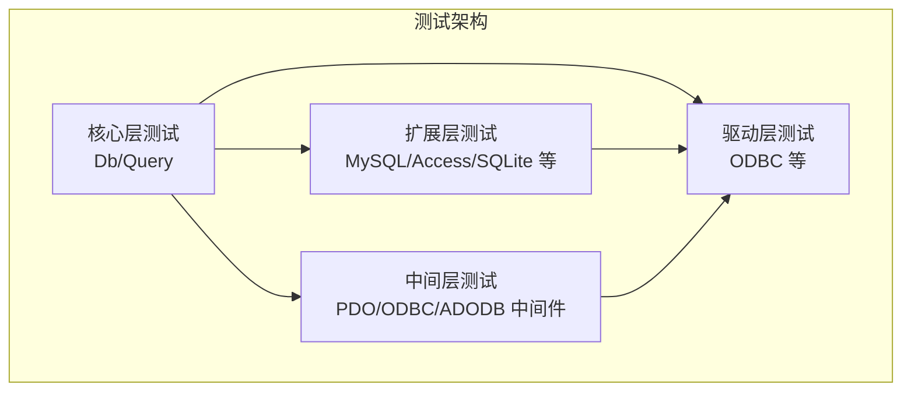
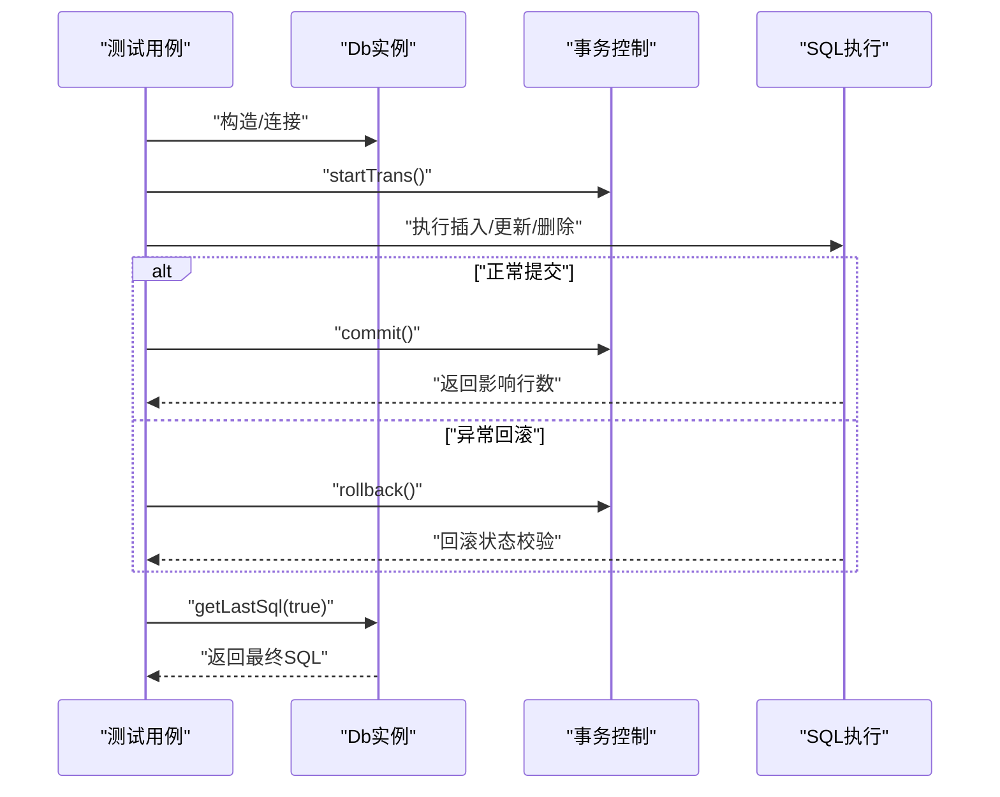
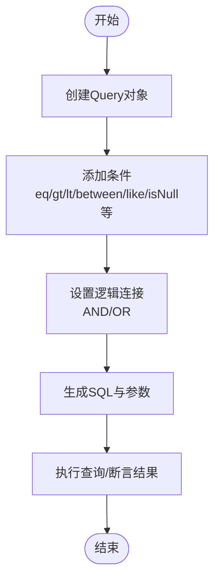
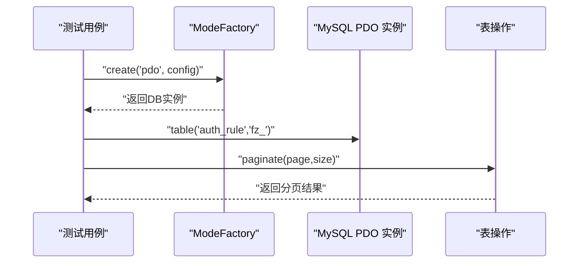
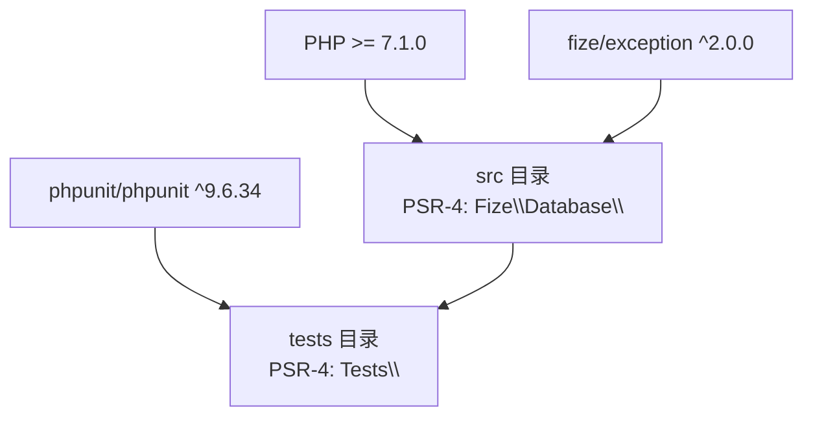

# 测试指南

<cite>
**本文引用的文件**
- [composer.json](file://composer.json)
- [README.md](file://README.md)
- [tests/TestDb.php](file://tests/TestDb.php)
- [tests/TestQuery.php](file://tests/TestQuery.php)
- [tests/Core/TestDb.php](file://tests/Core/TestDb.php)
- [tests/Core/TestQuery.php](file://tests/Core/TestQuery.php)
- [tests/Extend/MySQL/TestDb.php](file://tests/Extend/MySQL/TestDb.php)
- [tests/Extend/MySQL/TestModeFactory.php](file://tests/Extend/MySQL/TestModeFactory.php)
- [tests/Extend/MySQL/Mode/TestPDOMode.php](file://tests/Extend/MySQL/Mode/TestPDOMode.php)
- [tests/Extend/Access/Mode/TestADODBMode.php](file://tests/Extend/Access/Mode/TestADODBMode.php)
- [tests/Extend/SQLite/Mode/TestPDOMode.php](file://tests/Extend/SQLite/Mode/TestPDOMode.php)
- [tests/Driver/ODBC/TestODBC.php](file://tests/Driver/ODBC/TestODBC.php)
- [tests/Middleware/TestPDOMiddleware.php](file://tests/Middleware/TestPDOMiddleware.php)
</cite>

## 目录
1. [引言](#引言)
2. [项目结构](#项目结构)
3. [核心组件](#核心组件)
4. [架构总览](#架构总览)
5. [详细组件分析](#详细组件分析)
6. [依赖分析](#依赖分析)
7. [性能考虑](#性能考虑)
8. [故障排查指南](#故障排查指南)
9. [结论](#结论)
10. [附录](#附录)

## 引言
本测试指南聚焦于FizeDatabase的测试体系与测试方法，覆盖单元测试与集成测试的编写规范、测试环境搭建、测试数据准备、测试用例设计原则，并针对数据库连接、查询构建器、数据操作、事务等模块给出测试策略与最佳实践。同时提供常见问题的排查思路与调试技巧，以及如何运行测试套件与生成测试报告的建议。

## 项目结构
FizeDatabase采用分层结构（核心层-中间层-扩展层），测试同样按层次组织，便于按模块隔离验证：
- 根级测试入口：tests/TestDb.php、tests/TestQuery.php
- 核心层测试：tests/Core/TestDb.php、tests/Core/TestQuery.php
- 扩展层测试：按数据库类型划分，如MySQL、Access、Oracle、PgSQL、SQLSRV、SQLite等
- 驱动与中间层测试：tests/Driver、tests/Middleware

图表来源
- [tests/TestDb.php:1-51](file://tests/TestDb.php#L1-L51)
- [tests/TestQuery.php:1-51](file://tests/TestQuery.php#L1-L51)
- [tests/Core/TestDb.php:1-241](file://tests/Core/TestDb.php#L1-L241)
- [tests/Core/TestQuery.php:1-787](file://tests/Core/TestQuery.php#L1-L787)
- [tests/Extend/MySQL/Mode/TestPDOMode.php:1-130](file://tests/Extend/MySQL/Mode/TestPDOMode.php#L1-L130)
- [tests/Extend/MySQL/TestModeFactory.php:1-24](file://tests/Extend/MySQL/TestModeFactory.php#L1-L24)
- [tests/Extend/Access/Mode/TestADODBMode.php:1-154](file://tests/Extend/Access/Mode/TestADODBMode.php#L1-L154)
- [tests/Extend/SQLite/Mode/TestPDOMode.php:1-123](file://tests/Extend/SQLite/Mode/TestPDOMode.php#L1-L123)
- [tests/Driver/ODBC/TestODBC.php:1-120](file://tests/Driver/ODBC/TestODBC.php#L1-L120)
- [tests/Middleware/TestPDOMiddleware.php:1-11](file://tests/Middleware/TestPDOMiddleware.php#L1-L11)

章节来源
- [README.md:1-23](file://README.md#L1-L23)
- [composer.json:1-47](file://composer.json#L1-L47)

## 核心组件
- 数据库连接与操作测试：覆盖构造、连接、事务、最后SQL、表操作、查询执行等
- 查询构建器测试：覆盖条件构造、表达式、存在性检查、范围、模糊匹配、空值判断、数组映射分析等
- 扩展层测试：按数据库类型（MySQL、Access、SQLite等）与模式（PDO、ADODB等）分别验证
- 驱动与中间层测试：验证底层驱动能力与中间件适配

章节来源
- [tests/TestDb.php:1-51](file://tests/TestDb.php#L1-L51)
- [tests/TestQuery.php:1-51](file://tests/TestQuery.php#L1-L51)
- [tests/Core/TestDb.php:1-241](file://tests/Core/TestDb.php#L1-L241)
- [tests/Core/TestQuery.php:1-787](file://tests/Core/TestQuery.php#L1-L787)

## 架构总览
测试架构遵循“按层次分层、按功能细分”的策略，核心层测试直接面向Db与Query；扩展层测试面向具体数据库实现；驱动与中间层测试验证底层能力与适配。

图表来源
- [tests/Core/TestDb.php:1-241](file://tests/Core/TestDb.php#L1-L241)
- [tests/Core/TestQuery.php:1-787](file://tests/Core/TestQuery.php#L1-L787)
- [tests/Extend/MySQL/Mode/TestPDOMode.php:1-130](file://tests/Extend/MySQL/Mode/TestPDOMode.php#L1-L130)
- [tests/Extend/Access/Mode/TestADODBMode.php:1-154](file://tests/Extend/Access/Mode/TestADODBMode.php#L1-L154)
- [tests/Extend/SQLite/Mode/TestPDOMode.php:1-123](file://tests/Extend/SQLite/Mode/TestPDOMode.php#L1-L123)
- [tests/Driver/ODBC/TestODBC.php:1-120](file://tests/Driver/ODBC/TestODBC.php#L1-L120)
- [tests/Middleware/TestPDOMiddleware.php:1-11](file://tests/Middleware/TestPDOMiddleware.php#L1-L11)

## 详细组件分析

### 数据库连接与事务测试（核心层）
- 目标：验证Db构造、连接、事务控制（开始、提交、回滚）、最后SQL输出、表操作、查询执行等
- 关键点：
  - 使用真实数据库配置进行连接测试（主机、用户、密码、库名）
  - 事务测试应包含提交与回滚后的状态校验
  - 最后SQL输出用于断言SQL生成正确性
- 建议用例设计：
  - 连接成功与失败场景
  - 事务嵌套与异常回滚
  - 最后SQL与参数绑定一致性
  - 表前缀、分页、聚合函数等组合查询

图表来源
- [tests/Core/TestDb.php:41-69](file://tests/Core/TestDb.php#L41-L69)
- [tests/Core/TestDb.php:196-199](file://tests/Core/TestDb.php#L196-L199)
- [tests/Extend/MySQL/Mode/TestPDOMode.php:84-128](file://tests/Extend/MySQL/Mode/TestPDOMode.php#L84-L128)

章节来源
- [tests/Core/TestDb.php:1-241](file://tests/Core/TestDb.php#L1-L241)
- [tests/Extend/MySQL/Mode/TestPDOMode.php:1-130](file://tests/Extend/MySQL/Mode/TestPDOMode.php#L1-L130)

### 查询构建器测试（核心层）
- 目标：验证Query对象的条件构造、表达式、存在性检查、范围、模糊匹配、空值判断、数组映射分析等
- 关键点：
  - 条件链式调用与最终SQL生成
  - 参数绑定与占位符替换
  - 数组映射分析（多种格式）与逻辑连接
- 建议用例设计：
  - 单条件、多条件与逻辑连接
  - 范围（BETWEEN/NOT BETWEEN）、集合（IN/NOT IN）
  - 模糊匹配（LIKE/NOT LIKE）、空值判断（IS NULL/IS NOT NULL）
  - 原子表达式（EXP）与自定义条件（CONDITION）

图表来源
- [tests/Core/TestQuery.php:25-40](file://tests/Core/TestQuery.php#L25-L40)
- [tests/Core/TestQuery.php:172-180](file://tests/Core/TestQuery.php#L172-L180)
- [tests/Core/TestQuery.php:266-284](file://tests/Core/TestQuery.php#L266-L284)
- [tests/Core/TestQuery.php:306-770](file://tests/Core/TestQuery.php#L306-L770)

章节来源
- [tests/Core/TestQuery.php:1-787](file://tests/Core/TestQuery.php#L1-L787)

### 扩展层测试（MySQL/PDO）
- 目标：验证MySQL扩展下的表操作、分页、批量插入、交叉连接、锁等特性
- 关键点：
  - 使用ModeFactory创建PDO模式实例
  - 分页结果结构与数据一致性
  - 执行原生SQL与参数绑定
- 建议用例设计：
  - 分页边界与空集处理
  - 批量插入与唯一约束冲突
  - 连接类型（CROSS/LEFT/RIGHT/STRAIGHT JOIN）与锁机制

图表来源
- [tests/Extend/MySQL/TestModeFactory.php:11-22](file://tests/Extend/MySQL/TestModeFactory.php#L11-L22)
- [tests/Extend/MySQL/TestDb.php:11-23](file://tests/Extend/MySQL/TestDb.php#L11-L23)

章节来源
- [tests/Extend/MySQL/TestModeFactory.php:1-24](file://tests/Extend/MySQL/TestModeFactory.php#L1-L24)
- [tests/Extend/MySQL/TestDb.php:1-70](file://tests/Extend/MySQL/TestDb.php#L1-L70)

### 扩展层测试（Access/ADODB）
- 目标：验证Access数据库在ADODB模式下的连接、事务、SQL执行与最后插入ID
- 关键点：
  - Access数据库文件路径与密码配置
  - 事务提交与回滚后的数据一致性
- 建议用例设计：
  - 无密码与带密码数据库文件访问
  - 插入后lastInsertId校验
  - 原生SQL执行与结果断言

章节来源
- [tests/Extend/Access/Mode/TestADODBMode.php:1-154](file://tests/Extend/Access/Mode/TestADODBMode.php#L1-L154)

### 扩展层测试（SQLite/PDO）
- 目标：验证SQLite在PDO模式下的连接、事务、SQL执行与最后插入ID
- 关键点：
  - SQLite数据库文件路径
  - 事务提交与回滚后的数据一致性
- 建议用例设计：
  - 插入、更新、查询的组合验证
  - 事务回滚前后数据一致性

章节来源
- [tests/Extend/SQLite/Mode/TestPDOMode.php:1-123](file://tests/Extend/SQLite/Mode/TestPDOMode.php#L1-L123)

### 驱动与中间层测试（ODBC）
- 目标：验证ODBC驱动相关能力（如预处理、元数据、事务等）
- 关键点：
  - 当前测试骨架中多数方法为空，建议补充实际数据库配置与断言
- 建议用例设计：
  - 使用真实ODBC数据源配置
  - 预处理与元数据查询断言
  - 事务提交与回滚

章节来源
- [tests/Driver/ODBC/TestODBC.php:1-120](file://tests/Driver/ODBC/TestODBC.php#L1-L120)

### 中间层测试（PDO中间层）
- 目标：验证PDO中间层适配能力
- 关键点：
  - 当前测试骨架为空，建议补充对PDO中间件的断言
- 建议用例设计：
  - 中间层封装后的SQL执行与参数绑定
  - 与具体驱动的兼容性验证

章节来源
- [tests/Middleware/TestPDOMiddleware.php:1-11](file://tests/Middleware/TestPDOMiddleware.php#L1-L11)

## 依赖分析
- 测试框架：PHPUnit（版本要求见composer.json）
- 自动加载：PSR-4，核心代码与测试代码分别由src与tests目录自动加载
- 开发依赖：PHPUnit，建议在本地安装并使用vendor/bin/phpunit运行测试

图表来源
- [composer.json:16-46](file://composer.json#L16-L46)

章节来源
- [composer.json:1-47](file://composer.json#L1-47)

## 性能考虑
- 测试数据库选择：优先使用内存数据库或轻量数据库（如SQLite）以提升测试速度
- 批量插入与事务：在需要大量数据写入时，使用事务包裹以减少提交开销
- 参数化查询：统一使用参数绑定，避免重复解析与注入风险
- 断言粒度：合理拆分用例，避免单用例过大导致定位问题困难

## 故障排查指南
- 连接失败
  - 检查数据库配置（主机、用户、密码、库名）
  - 确认对应扩展已启用（PDO/ODBC/ADODB等）
- 事务未生效
  - 确认事务已提交（commit）而非仅回滚（rollback）
  - 校验事务块内SQL执行是否抛出异常
- SQL生成异常
  - 使用getLastSql(true)输出最终SQL，比对期望与实际
  - 检查参数绑定顺序与占位符数量
- 数据库驱动问题
  - 对ODBC/ADODB等驱动，确认数据源与权限配置
  - 在Access测试中，注意密码与文件路径

章节来源
- [tests/Core/TestDb.php:196-199](file://tests/Core/TestDb.php#L196-L199)
- [tests/Extend/MySQL/Mode/TestPDOMode.php:84-128](file://tests/Extend/MySQL/Mode/TestPDOMode.php#L84-L128)
- [tests/Extend/Access/Mode/TestADODBMode.php:99-152](file://tests/Extend/Access/Mode/TestADODBMode.php#L99-L152)
- [tests/Extend/SQLite/Mode/TestPDOMode.php:77-121](file://tests/Extend/SQLite/Mode/TestPDOMode.php#L77-L121)

## 结论
FizeDatabase的测试体系以分层与按功能细分的方式组织，核心层重点验证Db/Query行为，扩展层验证不同数据库与模式的适配，驱动与中间层验证底层能力。建议在现有骨架基础上完善断言与数据准备，结合事务与参数化查询的最佳实践，持续提升测试覆盖率与稳定性。

## 附录
- 运行测试套件
  - 安装依赖：composer install
  - 运行全部测试：vendor/bin/phpunit
  - 运行特定命名空间：vendor/bin/phpunit tests/Core
  - 生成测试报告：vendor/bin/phpunit --coverage-html ./report
- 测试数据准备
  - 准备真实数据库与测试表结构（user等）
  - 提前插入必要测试数据，确保查询断言稳定
- 测试用例设计原则
  - 单一职责：每个用例只验证一个行为
  - 可重复性：用例之间无耦合，可独立运行
  - 明确断言：对结果、SQL、事务状态进行明确断言