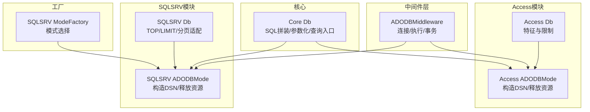
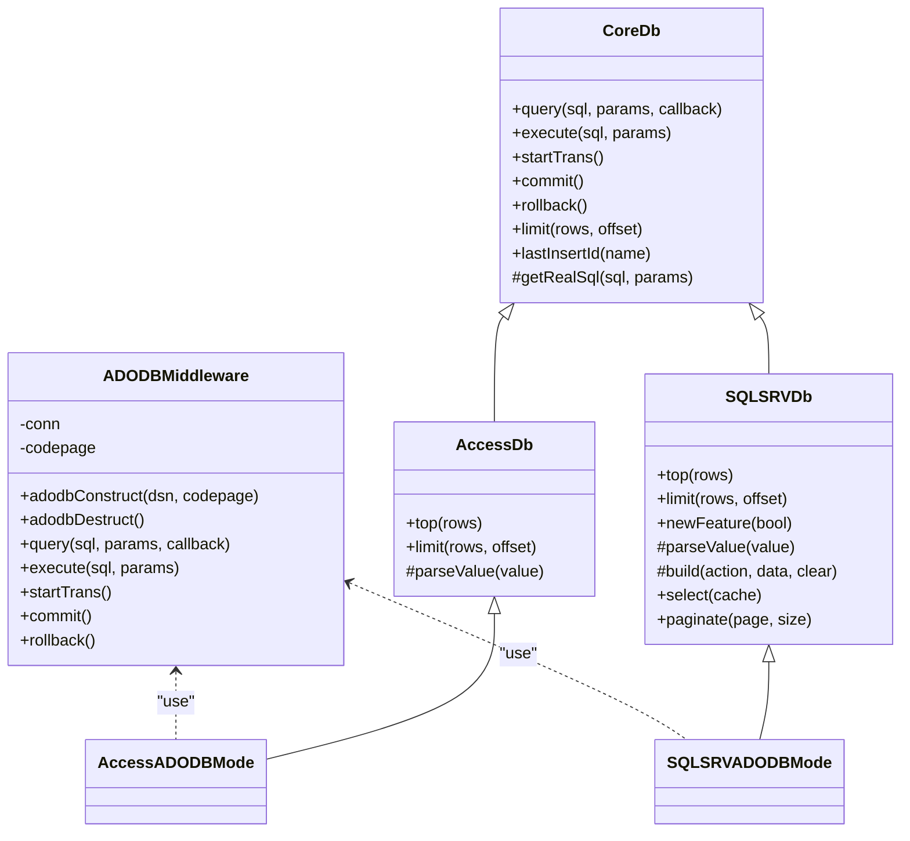
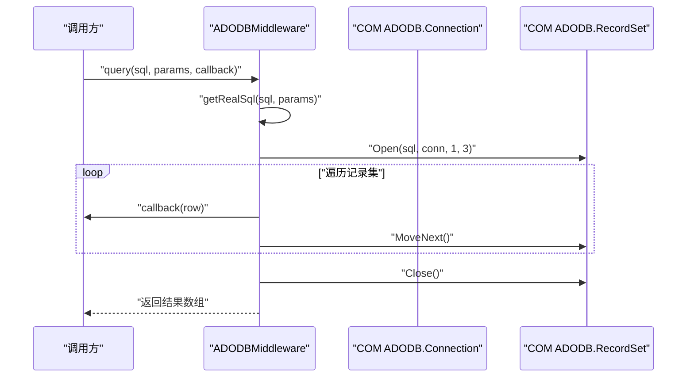
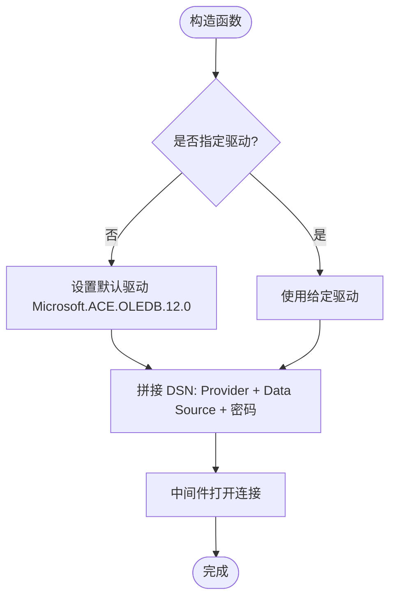
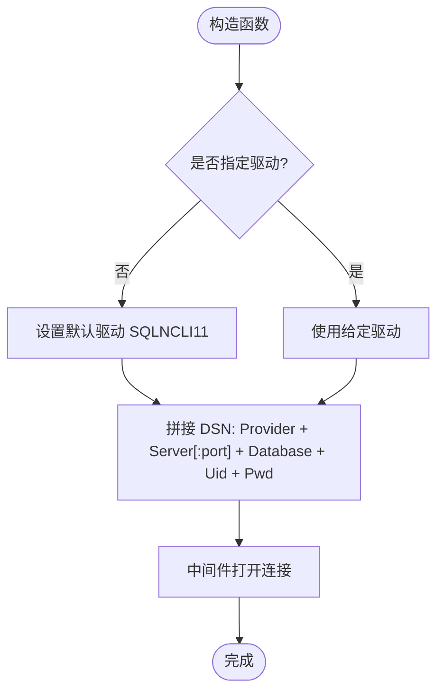
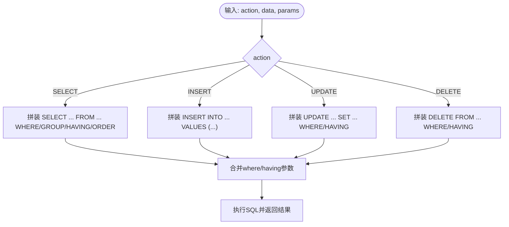
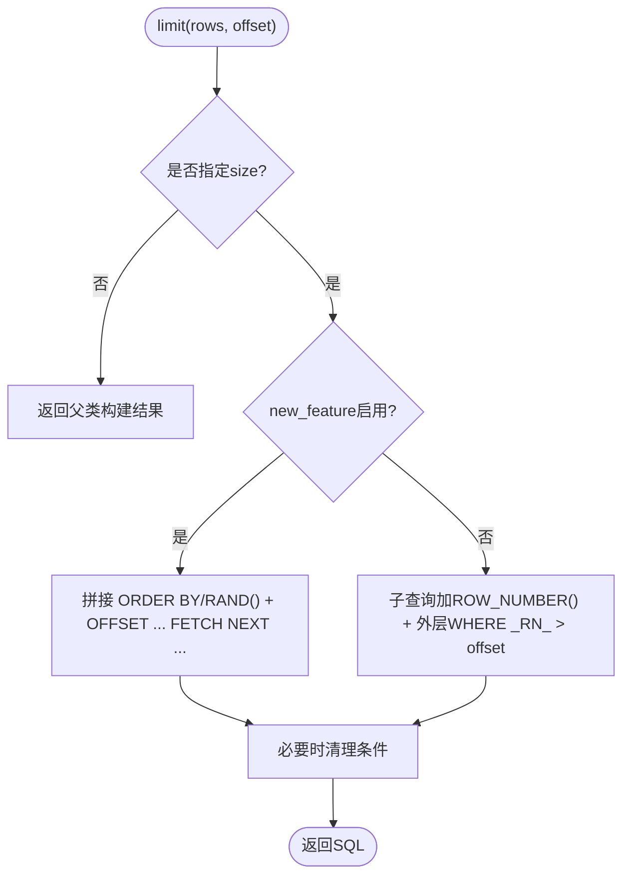
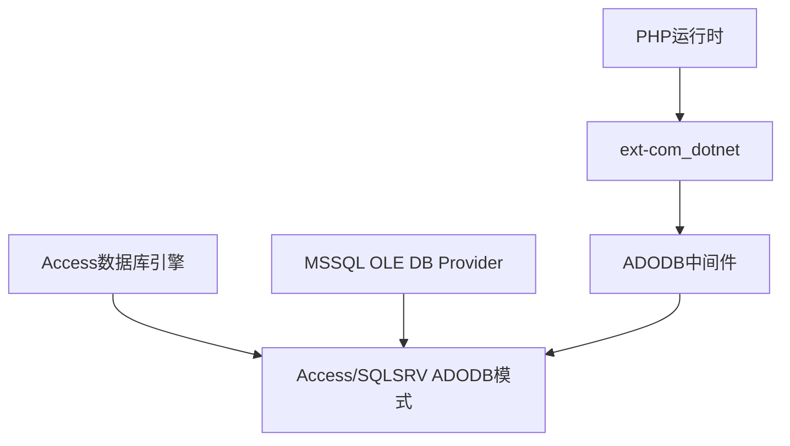

# ADODB连接模式

<cite>
**本文引用的文件**   
- [ADODB中间件 ADODBMiddleware.php](file://src/Middleware/ADODBMiddleware.php)
- [Access ADODB模式 ADODBMode.php](file://src/Extend/Access/Mode/ADODBMode.php)
- [SQLSRV ADODB模式 ADODBMode.php](file://src/Extend/SQLSRV/Mode/ADODBMode.php)
- [Access数据库基类 Db.php](file://src/Extend/Access/Db.php)
- [SQLSRV数据库基类 Db.php](file://src/Extend/SQLSRV/Db.php)
- [Access特征 Feature.php](file://src/Extend/Access/Feature.php)
- [SQLSRV特征 Feature.php](file://src/Extend/SQLSRV/Feature.php)
- [核心数据库基类 Db.php](file://src/Core/Db.php)
- [SQLSRV模式工厂 ModeFactory.php](file://src/Extend/SQLSRV/ModeFactory.php)
- [Access单元测试 TestADODBMode.php](file://tests/Extend/Access/Mode/TestADODBMode.php)
- [SQLSRV单元测试 TestADODBMode.php](file://tests/Extend/SQLSRV/Mode/TestADODBMode.php)
- [composer.json](file://composer.json)
</cite>

## 目录
1. [引言](#引言)
2. [项目结构](#项目结构)
3. [核心组件](#核心组件)
4. [架构总览](#架构总览)
5. [详细组件分析](#详细组件分析)
6. [依赖关系分析](#依赖关系分析)
7. [性能考量](#性能考量)
8. [故障排查指南](#故障排查指南)
9. [结论](#结论)
10. [附录](#附录)

## 引言
本文件系统性阐述基于COM组件的ADODB连接模式在本项目中的实现与使用方法。ADODB（ActiveX Data Objects）通过OLE DB Provider实现跨数据库访问，在Windows环境下对Access与MSSQL等数据库具有天然亲和力。本项目的ADODB中间件以PHP的COM扩展为基础，封装了连接管理、SQL执行、参数化处理、事务控制与数据类型处理等核心能力，并针对Access与MSSQL分别提供了专用模式类，确保在Windows平台上的稳定与高效。

## 项目结构
围绕ADODB模式的关键目录与文件如下：
- 中间件层：src/Middleware/ADODBMiddleware.php
- Access模式：src/Extend/Access/Mode/ADODBMode.php
- SQLSRV模式：src/Extend/SQLSRV/Mode/ADODBMode.php
- 数据库基类：src/Extend/Access/Db.php、src/Extend/SQLSRV/Db.php
- 特征工具：src/Extend/Access/Feature.php、src/Extend/SQLSRV/Feature.php
- 核心抽象：src/Core/Db.php
- 模式工厂（SQLSRV）：src/Extend/SQLSRV/ModeFactory.php
- 单元测试：tests/Extend/Access/Mode/TestADODBMode.php、tests/Extend/SQLSRV/Mode/TestADODBMode.php
- 依赖声明：composer.json

**图表来源**
- [ADODB中间件 ADODBMiddleware.php:11-115](file://src/Middleware/ADODBMiddleware.php#L11-L115)
- [Access数据库基类 Db.php:13-72](file://src/Extend/Access/Db.php#L13-L72)
- [SQLSRV数据库基类 Db.php:12-230](file://src/Extend/SQLSRV/Db.php#L12-L230)
- [Access ADODB模式 ADODBMode.php:13-59](file://src/Extend/Access/Mode/ADODBMode.php#L13-L59)
- [SQLSRV ADODB模式 ADODBMode.php:14-61](file://src/Extend/SQLSRV/Mode/ADODBMode.php#L14-L61)
- [核心数据库基类 Db.php:13-800](file://src/Core/Db.php#L13-L800)
- [SQLSRV模式工厂 ModeFactory.php:13-42](file://src/Extend/SQLSRV/ModeFactory.php#L13-L42)

**章节来源**
- [ADODB中间件 ADODBMiddleware.php:11-115](file://src/Middleware/ADODBMiddleware.php#L11-L115)
- [Access数据库基类 Db.php:13-72](file://src/Extend/Access/Db.php#L13-L72)
- [SQLSRV数据库基类 Db.php:12-230](file://src/Extend/SQLSRV/Db.php#L12-L230)
- [Access ADODB模式 ADODBMode.php:13-59](file://src/Extend/Access/Mode/ADODBMode.php#L13-L59)
- [SQLSRV ADODB模式 ADODBMode.php:14-61](file://src/Extend/SQLSRV/Mode/ADODBMode.php#L14-L61)
- [核心数据库基类 Db.php:13-800](file://src/Core/Db.php#L13-L800)
- [SQLSRV模式工厂 ModeFactory.php:13-42](file://src/Extend/SQLSRV/ModeFactory.php#L13-L42)

## 核心组件
- ADODB中间件（ADODBMiddleware）
  - 负责COM连接对象的创建与销毁、SQL执行、事务控制、以及记录集遍历回调。
  - 支持问号占位符的参数化处理，内部通过预处理拼接实现。
- Access ADODB模式（Access ADODBMode）
  - 通过OLE DB Provider连接Access数据库，支持密码保护的MDB文件。
  - 提供lastInsertId以获取自增主键。
- SQLSRV ADODB模式（SQLSRV ADODBMode）
  - 通过OLE DB Provider连接MSSQL数据库，支持指定驱动与端口。
  - 提供lastInsertId以获取自增主键。
- 数据库基类（Access/SQLSRV Db）
  - 统一的SQL拼装、参数绑定、查询入口与分页适配。
  - Access侧提供TOP与LIMIT模拟；SQLSRV侧提供新旧分页语法适配。
- 特征工具（Access/SQLSRV Feature）
  - 统一的表名与字段名格式化策略，确保方括号包裹与别名保留。
- 核心抽象（Core Db）
  - 抽象查询接口、参数化处理、SQL构建、CRUD入口与缓存机制。
- 模式工厂（SQLSRV ModeFactory）
  - 在adodb/odbc/pdo之间进行模式选择与实例化。

**章节来源**
- [ADODB中间件 ADODBMiddleware.php:11-115](file://src/Middleware/ADODBMiddleware.php#L11-L115)
- [Access ADODB模式 ADODBMode.php:13-59](file://src/Extend/Access/Mode/ADODBMode.php#L13-L59)
- [SQLSRV ADODB模式 ADODBMode.php:14-61](file://src/Extend/SQLSRV/Mode/ADODBMode.php#L14-L61)
- [Access数据库基类 Db.php:13-72](file://src/Extend/Access/Db.php#L13-L72)
- [SQLSRV数据库基类 Db.php:12-230](file://src/Extend/SQLSRV/Db.php#L12-L230)
- [Access特征 Feature.php:8-50](file://src/Extend/Access/Feature.php#L8-L50)
- [SQLSRV特征 Feature.php:8-50](file://src/Extend/SQLSRV/Feature.php#L8-L50)
- [核心数据库基类 Db.php:13-800](file://src/Core/Db.php#L13-L800)
- [SQLSRV模式工厂 ModeFactory.php:13-42](file://src/Extend/SQLSRV/ModeFactory.php#L13-L42)

## 架构总览
ADODB模式采用“中间件+领域模式”的分层设计：
- 中间件层统一处理COM连接、记录集读取、事务与异常。
- 领域层（Access/SQLSRV）负责DSN构造、资源释放与领域特有行为（如lastInsertId）。
- 核心层提供SQL构建与CRUD入口，屏蔽底层差异。
- 工厂层根据配置选择具体模式。

**图表来源**
- [核心数据库基类 Db.php:13-800](file://src/Core/Db.php#L13-L800)
- [ADODB中间件 ADODBMiddleware.php:11-115](file://src/Middleware/ADODBMiddleware.php#L11-L115)
- [Access数据库基类 Db.php:13-72](file://src/Extend/Access/Db.php#L13-L72)
- [SQLSRV数据库基类 Db.php:12-230](file://src/Extend/SQLSRV/Db.php#L12-L230)
- [Access ADODB模式 ADODBMode.php:13-59](file://src/Extend/Access/Mode/ADODBMode.php#L13-L59)
- [SQLSRV ADODB模式 ADODBMode.php:14-61](file://src/Extend/SQLSRV/Mode/ADODBMode.php#L14-L61)

## 详细组件分析

### ADODB中间件（连接管理与SQL执行）
- 连接管理
  - 通过COM组件创建ADODB.Connection，传入编码与DSN完成连接。
  - 析构时显式关闭连接并释放资源。
- SQL执行
  - query：支持问号占位符，内部预处理后执行，逐行读取记录集，支持回调逐行处理。
  - execute：执行非查询语句，返回受影响行数，失败时抛出数据库异常。
- 事务控制
  - startTrans/commit/rollback：封装ADO事务接口。
- 数据类型处理
  - 记录集字段值统一转换为字符串，便于跨数据库一致性处理。

**图表来源**
- [ADODB中间件 ADODBMiddleware.php:53-74](file://src/Middleware/ADODBMiddleware.php#L53-L74)

**章节来源**
- [ADODB中间件 ADODBMiddleware.php:11-115](file://src/Middleware/ADODBMiddleware.php#L11-L115)

### Access ADODB模式（Access数据库）
- DSN构造
  - 默认Provider为Microsoft.ACE.OLEDB.12.0，支持数据库密码。
  - 文件路径使用绝对路径，避免相对路径在不同运行环境下的不确定性。
- 资源释放
  - 析构时调用中间件的adodbDestruct，确保COM资源释放。
- lastInsertId
  - 通过查询@@IDENTITY获取最后插入ID，适配Access自增行为。

**图表来源**
- [Access ADODB模式 ADODBMode.php:24-34](file://src/Extend/Access/Mode/ADODBMode.php#L24-L34)

**章节来源**
- [Access ADODB模式 ADODBMode.php:13-59](file://src/Extend/Access/Mode/ADODBMode.php#L13-L59)
- [Access数据库基类 Db.php:13-72](file://src/Extend/Access/Db.php#L13-L72)

### SQLSRV ADODB模式（MSSQL数据库）
- DSN构造
  - 默认Provider为SQLNCLI11（SQL Server Native Client 11），可指定端口与用户凭据。
  - 支持通过driver参数切换至sqloledb等兼容驱动。
- 资源释放
  - 析构时调用中间件的adodbDestruct，确保COM资源释放。
- lastInsertId
  - 通过查询@@IDENTITY获取最后插入ID，适配MSSQL自增行为。

**图表来源**
- [SQLSRV ADODB模式 ADODBMode.php:27-39](file://src/Extend/SQLSRV/Mode/ADODBMode.php#L27-L39)

**章节来源**
- [SQLSRV ADODB模式 ADODBMode.php:14-61](file://src/Extend/SQLSRV/Mode/ADODBMode.php#L14-L61)
- [SQLSRV数据库基类 Db.php:12-230](file://src/Extend/SQLSRV/Db.php#L12-L230)

### SQL构建与参数化（核心层）
- 参数化处理
  - 通过getRealSql将问号占位符与参数数组拼接为最终SQL，避免直接拼接引发的注入风险。
- SQL构建
  - 支持SELECT/INSERT/UPDATE/DELETE的条件拼装，自动合并where/having参数。
- 查询入口
  - select/fetch/delete/update/insert等统一入口，屏蔽底层差异。

**图表来源**
- [核心数据库基类 Db.php:583-637](file://src/Core/Db.php#L583-L637)

**章节来源**
- [核心数据库基类 Db.php:13-800](file://src/Core/Db.php#L13-L800)

### 分页与LIMIT适配（SQLSRV）
- 新特性开关
  - new_feature=true时使用OFFSET/FETCH语法；否则使用ROW_NUMBER()模拟分页。
- 旧版分页
  - 在SELECT子句中加入ROW_NUMBER()，外层筛选_offset与_size，最后清理临时列。

**图表来源**
- [SQLSRV数据库基类 Db.php:144-185](file://src/Extend/SQLSRV/Db.php#L144-L185)

**章节来源**
- [SQLSRV数据库基类 Db.php:12-230](file://src/Extend/SQLSRV/Db.php#L12-L230)

## 依赖关系分析
- PHP扩展依赖
  - ext-com_dotnet：ADODB中间件依赖COM组件。
  - 其他扩展（PDO/ODBC/SQLSRV等）在本模式中非必需，但项目仍建议安装以支持多模式。
- 平台与驱动
  - Windows环境为ADODB模式的先决条件；Access需安装AccessDatabaseEngine；MSSQL需对应OLE DB Provider可用。
- 模式选择
  - SQLSRV模块可通过工厂在adodb/odbc/pdo之间切换，ADODB模式作为首选之一。

**图表来源**
- [composer.json:20-37](file://composer.json#L20-L37)
- [ADODB中间件 ADODBMiddleware.php:5-6](file://src/Middleware/ADODBMiddleware.php#L5-L6)
- [Access ADODB模式 ADODBMode.php:19-33](file://src/Extend/Access/Mode/ADODBMode.php#L19-L33)
- [SQLSRV ADODB模式 ADODBMode.php:29-38](file://src/Extend/SQLSRV/Mode/ADODBMode.php#L29-L38)

**章节来源**
- [composer.json:20-37](file://composer.json#L20-L37)

## 性能考量
- 记录集遍历
  - query支持回调逐行处理，减少内存峰值；适用于大数据量导出或流式处理。
- 查询缓存
  - Core Db提供select级别的查询结果缓存，避免重复执行相同SQL。
- 参数化与预处理
  - 通过getRealSql实现问号占位符的预处理，降低注入风险并提升执行效率。
- 分页策略
  - SQLSRV新特性下优先使用OFFSET/FETCH；旧特性下通过ROW_NUMBER()模拟，注意ORDER BY的必要性。

**章节来源**
- [ADODB中间件 ADODBMiddleware.php:53-74](file://src/Middleware/ADODBMiddleware.php#L53-L74)
- [核心数据库基类 Db.php:700-711](file://src/Core/Db.php#L700-L711)
- [SQLSRV数据库基类 Db.php:151-174](file://src/Extend/SQLSRV/Db.php#L151-L174)

## 故障排查指南
- 连接失败
  - 确认Windows环境与ext-com_dotnet已启用。
  - Access需安装AccessDatabaseEngine；MSSQL需确保OLE DB Provider可用。
  - DSN字符串正确性：Access需Data Source指向真实文件路径；SQLSRV需Server与端口正确。
- 事务问题
  - 确保startTrans/commit/rollback成对使用；异常时应调用rollback。
- 数据类型与编码
  - 中间件读取记录集字段值统一转为字符串，如需强类型，请在应用层自行转换。
- 测试验证
  - 可参考单元测试对构造、lastInsertId、事务与查询流程进行回归验证。

**章节来源**
- [Access单元测试 TestADODBMode.php:11-153](file://tests/Extend/Access/Mode/TestADODBMode.php#L11-L153)
- [SQLSRV单元测试 TestADODBMode.php:11-130](file://tests/Extend/SQLSRV/Mode/TestADODBMode.php#L11-L130)
- [ADODB中间件 ADODBMiddleware.php:95-114](file://src/Middleware/ADODBMiddleware.php#L95-L114)

## 结论
ADODB模式在Windows环境下为Access与MSSQL提供了稳定、直观的连接方案。通过中间件层的统一抽象，结合领域模式的DSN定制与资源管理，开发者可在不牺牲易用性的前提下获得良好的可维护性与可移植性。配合核心层的SQL构建与参数化机制，ADODB模式能够胜任从简单查询到复杂分页与事务处理的多种场景。

## 附录

### 适用场景
- Windows服务器部署，且已有AccessDatabaseEngine或MSSQL OLE DB Provider。
- 需要快速集成Access或MSSQL，且对PDO/ODBC生态依赖度不高。
- 需要通过COM组件直接访问数据库，避免额外的驱动管理成本。

### 配置示例（概念性说明）
- Access（Access ADODB模式）
  - 关键参数：数据库文件路径、密码、驱动名（可选）。
  - DSN要点：Provider、Data Source（绝对路径）、Jet OLEDB:Database Password（可选）。
- MSSQL（SQLSRV ADODB模式）
  - 关键参数：主机、用户名、密码、数据库名、端口（可选）、驱动名（可选）。
  - DSN要点：Provider、Server[:port]、Database、Uid、Pwd。

### 与PDO、ODBC的选择原则
- 选择ADODB（本模式）
  - Windows平台、COM可用、无需额外扩展、快速集成Access/MSSQL。
- 选择PDO
  - 跨平台友好、生态丰富、性能与可移植性优先。
- 选择ODBC
  - 需要通过标准ODBC桥接，兼容性强但可能增加一层抽象成本。