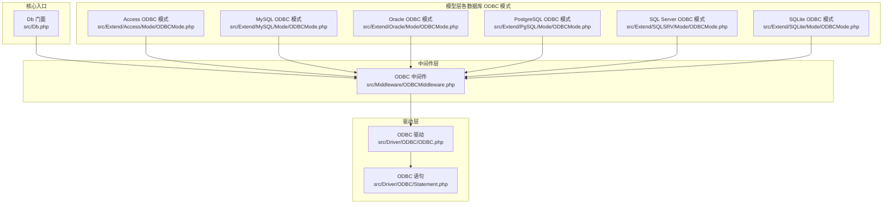
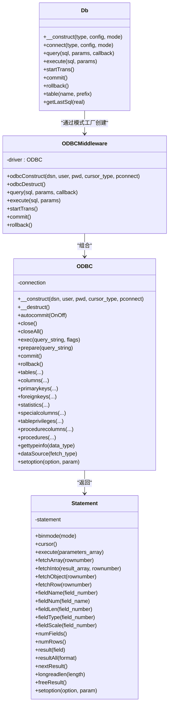
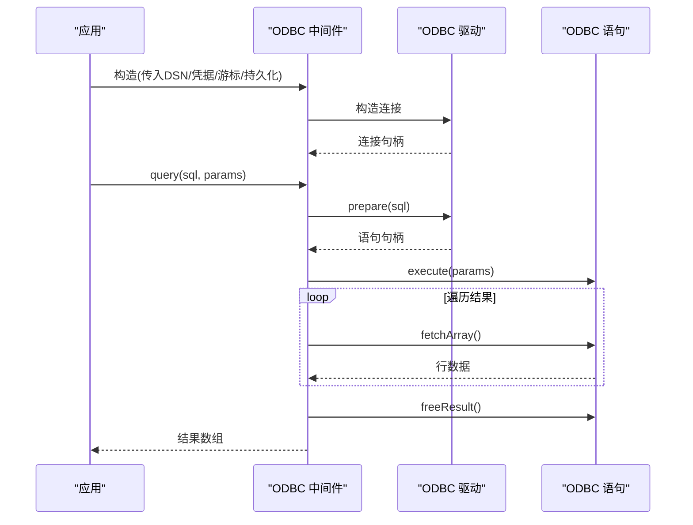
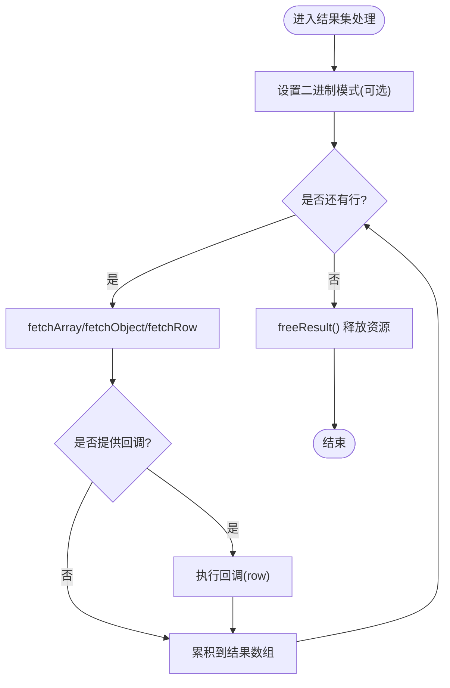
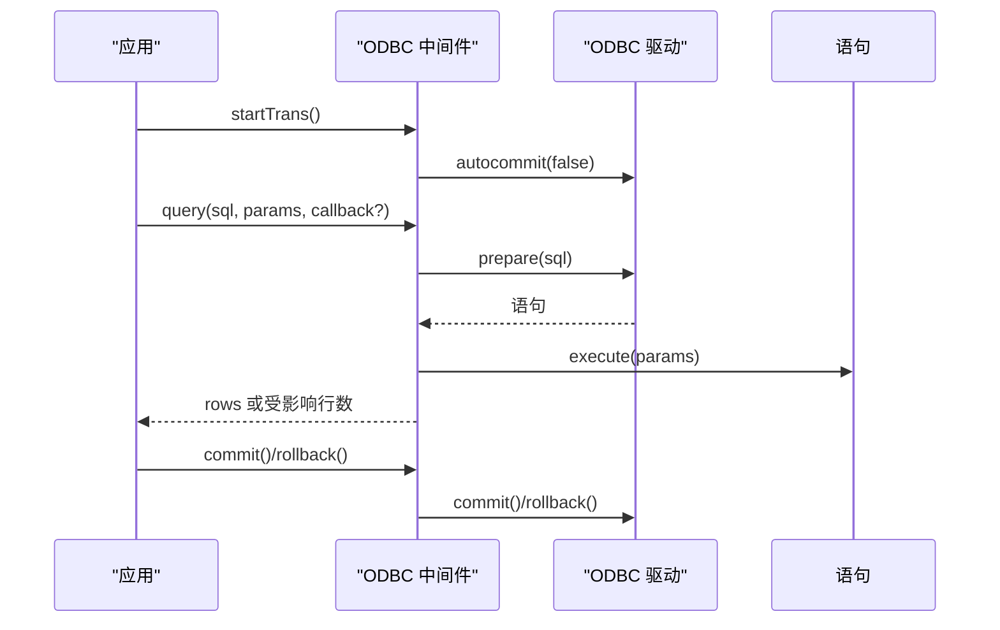
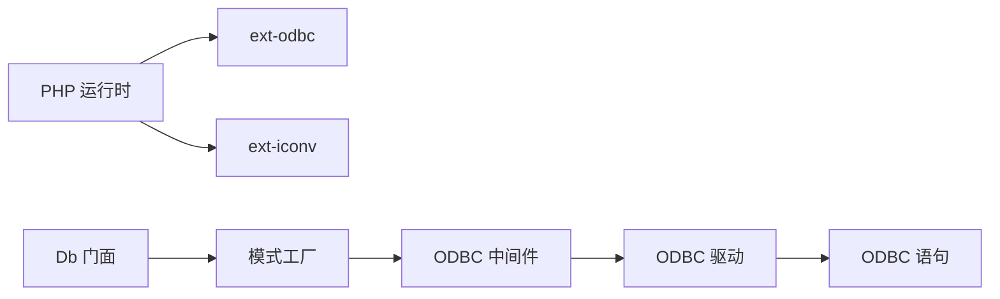

# ODBC连接模式

<cite>
**本文引用的文件**
- [ODBC.php](file://src/Driver/ODBC/ODBC.php)
- [Statement.php](file://src/Driver/ODBC/Statement.php)
- [ODBCMiddleware.php](file://src/Middleware/ODBCMiddleware.php)
- [ODBCMode.php（Access）](file://src/Extend/Access/Mode/ODBCMode.php)
- [ODBCMode.php（MySQL）](file://src/Extend/MySQL/Mode/ODBCMode.php)
- [ODBCMode.php（Oracle）](file://src/Extend/Oracle/Mode/ODBCMode.php)
- [ODBCMode.php（PgSQL）](file://src/Extend/PgSQL/Mode/ODBCMode.php)
- [ODBCMode.php（SQLSRV）](file://src/Extend/SQLSRV/Mode/ODBCMode.php)
- [ODBCMode.php（SQLite）](file://src/Extend/SQLite/Mode/ODBCMode.php)
- [Db.php](file://src/Db.php)
- [composer.json](file://composer.json)
- [TestODBCMode.php（Access）](file://tests/Extend/Access/Mode/TestODBCMode.php)
- [TestODBCMode.php（MySQL）](file://tests/Extend/MySQL/Mode/TestODBCMode.php)
- [TestODBCMode.php（SQLSRV）](file://tests/Extend/SQLSRV/Mode/TestODBCMode.php)
</cite>

## 目录
1. [简介](#简介)
2. [项目结构](#项目结构)
3. [核心组件](#核心组件)
4. [架构总览](#架构总览)
5. [组件详解](#组件详解)
6. [依赖关系分析](#依赖关系分析)
7. [性能与特性](#性能与特性)
8. [调试与故障排除](#调试与故障排除)
9. [结论](#结论)
10. [附录：跨平台配置示例](#附录跨平台配置示例)

## 简介
本文件系统性讲解基于PHP ODBC扩展的数据库访问模式，覆盖ODBC中间件工作原理、连接建立、语句执行、结果集处理、事务控制、驱动配置与跨平台适配，并结合仓库中的具体实现给出流程图、类图与实践建议。

## 项目结构
围绕ODBC模式的关键目录与文件如下：
- 驱动层：ODBC驱动与语句封装
- 中间件层：ODBC通用行为（连接、查询、执行、事务）
- 模型层：各数据库类型的ODBC模式实现
- 核心入口：Db门面与工厂创建
- 测试与示例：验证ODBC模式在Access、MySQL、SQL Server等场景的行为

图表来源
- [Db.php:1-141](file://src/Db.php#L1-L141)
- [ODBCMiddleware.php:1-100](file://src/Middleware/ODBCMiddleware.php#L1-L100)
- [ODBC.php:1-341](file://src/Driver/ODBC/ODBC.php#L1-L341)
- [Statement.php:1-256](file://src/Driver/ODBC/Statement.php#L1-L256)
- [ODBCMode.php（Access）:1-94](file://src/Extend/Access/Mode/ODBCMode.php#L1-L94)
- [ODBCMode.php（MySQL）:1-61](file://src/Extend/MySQL/Mode/ODBCMode.php#L1-L61)
- [ODBCMode.php（Oracle）:1-64](file://src/Extend/Oracle/Mode/ODBCMode.php#L1-L64)
- [ODBCMode.php（PgSQL）:1-63](file://src/Extend/PgSQL/Mode/ODBCMode.php#L1-L63)
- [ODBCMode.php（SQLSRV）:1-114](file://src/Extend/SQLSRV/Mode/ODBCMode.php#L1-L114)
- [ODBCMode.php（SQLite）:1-57](file://src/Extend/SQLite/Mode/ODBCMode.php#L1-L57)

章节来源
- [Db.php:1-141](file://src/Db.php#L1-L141)
- [ODBCMiddleware.php:1-100](file://src/Middleware/ODBCMiddleware.php#L1-L100)
- [ODBC.php:1-341](file://src/Driver/ODBC/ODBC.php#L1-L341)
- [Statement.php:1-256](file://src/Driver/ODBC/Statement.php#L1-L256)

## 核心组件
- ODBC驱动（ODBC.php）：封装底层odbc_*系列函数，负责连接、事务、元数据查询、SQL执行与预处理等。
- ODBC语句（Statement.php）：封装底层odbc_*结果集操作，提供取数、取列信息、二进制模式、长字段读取等能力。
- ODBC中间件（ODBCMiddleware.php）：为各数据库模型提供统一的构造、查询、执行、事务接口，屏蔽底层差异。
- 各数据库ODBC模式（Access/MySQL/Oracle/PgSQL/SQLSRV/SQLite）：按各自驱动与DSN规范构建连接，适配字符集与编码转换。

章节来源
- [ODBC.php:1-341](file://src/Driver/ODBC/ODBC.php#L1-L341)
- [Statement.php:1-256](file://src/Driver/ODBC/Statement.php#L1-L256)
- [ODBCMiddleware.php:1-100](file://src/Middleware/ODBCMiddleware.php#L1-L100)
- [ODBCMode.php（Access）:1-94](file://src/Extend/Access/Mode/ODBCMode.php#L1-L94)
- [ODBCMode.php（MySQL）:1-61](file://src/Extend/MySQL/Mode/ODBCMode.php#L1-L61)
- [ODBCMode.php（Oracle）:1-64](file://src/Extend/Oracle/Mode/ODBCMode.php#L1-L64)
- [ODBCMode.php（PgSQL）:1-63](file://src/Extend/PgSQL/Mode/ODBCMode.php#L1-L63)
- [ODBCMode.php（SQLSRV）:1-114](file://src/Extend/SQLSRV/Mode/ODBCMode.php#L1-L114)
- [ODBCMode.php（SQLite）:1-57](file://src/Extend/SQLite/Mode/ODBCMode.php#L1-L57)

## 架构总览
ODBC模式采用“门面 + 中间件 + 驱动 + 语句”的分层设计：
- 门面（Db）负责对外暴露统一API，并通过工厂创建具体模式实例。
- 中间件（ODBCMiddleware）提供统一的连接生命周期管理、查询/执行与事务控制。
- 驱动（ODBC）封装PHP ODBC扩展，提供连接、事务、元数据、SQL执行与预处理。
- 语句（Statement）封装结果集操作，提供多种取数方式与列元信息。

图表来源
- [Db.php:1-141](file://src/Db.php#L1-L141)
- [ODBCMiddleware.php:1-100](file://src/Middleware/ODBCMiddleware.php#L1-L100)
- [ODBC.php:1-341](file://src/Driver/ODBC/ODBC.php#L1-L341)
- [Statement.php:1-256](file://src/Driver/ODBC/Statement.php#L1-L256)

## 组件详解

### ODBC驱动（连接与事务）
- 连接建立：支持持久化与非持久化连接；支持游标类型参数；异常统一转为驱动异常。
- 事务控制：自动提交开关、提交、回滚。
- 元数据与SQL：支持多类元数据查询（表、列、主键、外键、权限、类型信息等），支持原生SQL执行与预处理。
- 资源管理：提供关闭当前连接与关闭全部连接的能力。

图表来源
- [ODBCMiddleware.php:48-61](file://src/Middleware/ODBCMiddleware.php#L48-L61)
- [ODBC.php:212-219](file://src/Driver/ODBC/ODBC.php#L212-L219)
- [Statement.php:56-88](file://src/Driver/ODBC/Statement.php#L56-L88)

章节来源
- [ODBC.php:33-46](file://src/Driver/ODBC/ODBC.php#L33-L46)
- [ODBC.php:63-74](file://src/Driver/ODBC/ODBC.php#L63-L74)
- [ODBC.php:136-142](file://src/Driver/ODBC/ODBC.php#L136-L142)
- [ODBC.php:166-173](file://src/Driver/ODBC/ODBC.php#L166-L173)
- [ODBC.php:212-219](file://src/Driver/ODBC/ODBC.php#L212-L219)

### ODBC语句（结果集处理）
- 取数方式：数组、对象、逐行、写入已有数组。
- 列元信息：列名、序号、类型、长度、精度、小数位等。
- 二进制与长字段：二进制模式、长字段读取长度。
- 多结果集：移动到下一个结果集。
- 资源释放：释放结果集内存。

图表来源
- [Statement.php:33-40](file://src/Driver/ODBC/Statement.php#L33-L40)
- [Statement.php:69-98](file://src/Driver/ODBC/Statement.php#L69-L98)
- [Statement.php:176-181](file://src/Driver/ODBC/Statement.php#L176-L181)

章节来源
- [Statement.php:27-40](file://src/Driver/ODBC/Statement.php#L27-L40)
- [Statement.php:69-98](file://src/Driver/ODBC/Statement.php#L69-L98)
- [Statement.php:115-170](file://src/Driver/ODBC/Statement.php#L115-L170)
- [Statement.php:188-191](file://src/Driver/ODBC/Statement.php#L188-L191)
- [Statement.php:197-200](file://src/Driver/ODBC/Statement.php#L197-L200)
- [Statement.php:226-233](file://src/Driver/ODBC/Statement.php#L226-L233)

### ODBC中间件（统一行为）
- 构造与析构：统一创建与关闭ODBC连接。
- 查询与执行：支持预处理语句与参数绑定；返回受影响行数或结果数组。
- 事务：统一开启、提交、回滚。

图表来源
- [ODBCMiddleware.php:48-74](file://src/Middleware/ODBCMiddleware.php#L48-L74)
- [ODBCMiddleware.php:79-98](file://src/Middleware/ODBCMiddleware.php#L79-L98)

章节来源
- [ODBCMiddleware.php:28-31](file://src/Middleware/ODBCMiddleware.php#L28-L31)
- [ODBCMiddleware.php:36-39](file://src/Middleware/ODBCMiddleware.php#L36-L39)
- [ODBCMiddleware.php:48-74](file://src/Middleware/ODBCMiddleware.php#L48-L74)
- [ODBCMiddleware.php:79-98](file://src/Middleware/ODBCMiddleware.php#L79-L98)

### 各数据库ODBC模式（DSN与驱动）
- Access：使用Access驱动，支持原生exec（不支持prepare），注意SQL与参数的编码转换。
- MySQL：默认使用MySQL ODBC 8.0 ANSI驱动，支持端口与字符集。
- Oracle：默认使用Oracle OraDB12Home1驱动，需指定序列名获取自增ID。
- PostgreSQL：默认ANSI驱动，设置客户端编码为UTF8。
- SQL Server：默认Native Client 11.0，支持主机与端口组合。
- SQLite：使用SQLite3 ODBC驱动，支持多项连接参数。

章节来源
- [ODBCMode.php（Access）:23-30](file://src/Extend/Access/Mode/ODBCMode.php#L23-L30)
- [ODBCMode.php（Access）:50-67](file://src/Extend/Access/Mode/ODBCMode.php#L50-L67)
- [ODBCMode.php（MySQL）:29-39](file://src/Extend/MySQL/Mode/ODBCMode.php#L29-L39)
- [ODBCMode.php（Oracle）:28-41](file://src/Extend/Oracle/Mode/ODBCMode.php#L28-L41)
- [ODBCMode.php（PgSQL）:26-38](file://src/Extend/PgSQL/Mode/ODBCMode.php#L26-L38)
- [ODBCMode.php（SQLSRV）:28-41](file://src/Extend/SQLSRV/Mode/ODBCMode.php#L28-L41)
- [ODBCMode.php（SQLite）:28-35](file://src/Extend/SQLite/Mode/ODBCMode.php#L28-L35)

## 依赖关系分析
- PHP扩展依赖：要求启用ext-odbc（以及部分数据库对应的PDO/扩展，如pdo_odbc等）。
- 类耦合：Db门面通过模式工厂创建具体模式；各模式复用ODBC中间件；中间件组合ODBC驱动；驱动返回语句对象供上层使用。
- 循环依赖：无明显循环依赖，分层清晰。

图表来源
- [composer.json:16-47](file://composer.json#L16-L47)
- [Db.php:32-56](file://src/Db.php#L32-L56)
- [ODBCMiddleware.php:11-31](file://src/Middleware/ODBCMiddleware.php#L11-L31)
- [ODBC.php:15-46](file://src/Driver/ODBC/ODBC.php#L15-L46)

章节来源
- [composer.json:16-47](file://composer.json#L16-L47)
- [Db.php:32-56](file://src/Db.php#L32-L56)

## 性能与特性
- 预处理与绑定：通过prepare+execute减少SQL拼接与编译开销，提升安全性与性能。
- 结果集遍历：支持多种取数方式，按需选择以平衡内存与CPU。
- 二进制与长字段：针对BLOB/CLOB等大字段设置合适的读取策略。
- 字符集与编码：不同数据库与驱动对中文支持差异较大，必要时切换驱动或调整字符集。
- 事务批处理：批量操作建议在事务内执行，减少往返与锁定时间。
- 持久连接：在高并发场景可考虑持久连接，但需关注资源占用与连接池策略。

[本节为通用性能讨论，无需列出章节来源]

## 调试与故障排除
- 异常与错误码：驱动层统一捕获底层异常并转换为驱动异常，便于定位。
- 错误信息：使用错误码与错误消息辅助诊断连接、语法与权限问题。
- 编码问题：中文乱码通常与ODBC驱动有关，可尝试更换驱动（如MySQL ANSI/Unicode）。
- Access特例：Access不支持prepare，需使用exec并进行SQL与参数的编码转换。
- SQL Server特例：同样涉及编码转换，确保参数与SQL均按目标编码处理。
- PostgreSQL特例：需显式设置客户端编码为UTF8以避免显示问题。

章节来源
- [ODBC.php:41-45](file://src/Driver/ODBC/ODBC.php#L41-L45)
- [ODBC.php:107-111](file://src/Driver/ODBC/ODBC.php#L107-L111)
- [ODBC.php:169-172](file://src/Driver/ODBC/ODBC.php#L169-L172)
- [ODBCMode.php（Access）:50-67](file://src/Extend/Access/Mode/ODBCMode.php#L50-L67)
- [ODBCMode.php（SQLSRV）:61-83](file://src/Extend/SQLSRV/Mode/ODBCMode.php#L61-L83)
- [ODBCMode.php（PgSQL）:36-38](file://src/Extend/PgSQL/Mode/ODBCMode.php#L36-L38)

## 结论
ODBC模式通过中间件抽象统一了连接、查询、执行与事务控制，结合各数据库的ODBC驱动与DSN配置，实现了跨数据库的一致访问体验。实践中需重点关注驱动选择、字符集与编码、结果集处理策略与事务批处理，以获得稳定与高性能的表现。

[本节为总结性内容，无需列出章节来源]

## 附录：跨平台配置示例
以下为常见数据库在Windows/Linux环境下使用ODBC的配置要点与参考路径（以仓库中模式类的构造逻辑为依据）：

- Access（Windows）
  - 驱动：Microsoft Access Driver (*.mdb, *.accdb)
  - DSN示例：Driver={Microsoft Access Driver (*.mdb, *.accdb)};DBQ=/path/to/file.accdb;Uid=;Pwd=;
  - 参考实现：[ODBCMode.php（Access）:23-30](file://src/Extend/Access/Mode/ODBCMode.php#L23-L30)

- MySQL（Windows/Linux）
  - 驱动：MySQL ODBC 8.0 ANSI Driver
  - DSN示例：Driver={MySQL ODBC 8.0 ANSI Driver};Server=host;Database=db;Uid=user;Pwd=pwd;Port=3306;Charset=utf8
  - 参考实现：[ODBCMode.php（MySQL）:29-39](file://src/Extend/MySQL/Mode/ODBCMode.php#L29-L39)

- Oracle（Windows/Linux）
  - 驱动：Oracle OraDB12Home1
  - DSN示例：Driver={Oracle OraDB12Home1};Server=sid;Uid=user;Pwd=pwd;CharSet=utf8
  - 参考实现：[ODBCMode.php（Oracle）:28-41](file://src/Extend/Oracle/Mode/ODBCMode.php#L28-L41)

- PostgreSQL（Windows/Linux）
  - 驱动：PostgreSQL ANSI
  - DSN示例：Driver={PostgreSQL ANSI};Server=host;Database=db;Uid=user;Pwd=pwd;Port=5432
  - 参考实现：[ODBCMode.php（PgSQL）:26-38](file://src/Extend/PgSQL/Mode/ODBCMode.php#L26-L38)

- SQL Server（Windows/Linux）
  - 驱动：SQL Server Native Client 11.0
  - DSN示例：Driver={SQL Server Native Client 11.0};Server=host,port;Database=db;Uid=user;Pwd=pwd
  - 参考实现：[ODBCMode.php（SQLSRV）:28-41](file://src/Extend/SQLSRV/Mode/ODBCMode.php#L28-L41)

- SQLite（Windows/Linux）
  - 驱动：SQLite3 ODBC Driver
  - DSN示例：Driver=SQLite3 ODBC Driver;Database=/path/to/db.sqlite;LongNames=0;Timeout=1000;NoTXN=0;SyncPragma=NORMAL;StepAPI=0
  - 参考实现：[ODBCMode.php（SQLite）:28-35](file://src/Extend/SQLite/Mode/ODBCMode.php#L28-L35)

章节来源
- [ODBCMode.php（Access）:23-30](file://src/Extend/Access/Mode/ODBCMode.php#L23-L30)
- [ODBCMode.php（MySQL）:29-39](file://src/Extend/MySQL/Mode/ODBCMode.php#L29-L39)
- [ODBCMode.php（Oracle）:28-41](file://src/Extend/Oracle/Mode/ODBCMode.php#L28-L41)
- [ODBCMode.php（PgSQL）:26-38](file://src/Extend/PgSQL/Mode/ODBCMode.php#L26-L38)
- [ODBCMode.php（SQLSRV）:28-41](file://src/Extend/SQLSRV/Mode/ODBCMode.php#L28-L41)
- [ODBCMode.php（SQLite）:28-35](file://src/Extend/SQLite/Mode/ODBCMode.php#L28-L35)