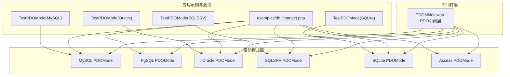
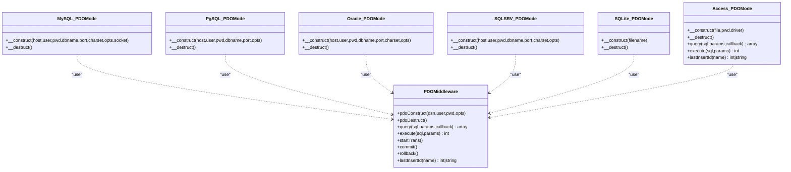
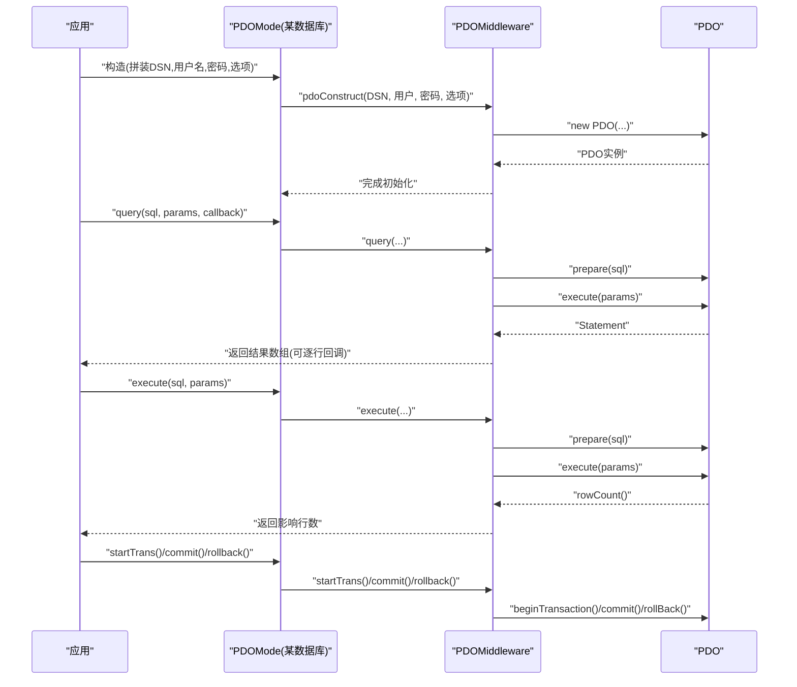

# PDO连接模式

<cite>
**本文引用的文件**
- [src/Middleware/PDOMiddleware.php](file://src/Middleware/PDOMiddleware.php)
- [src/Extend/MySQL/Mode/PDOMode.php](file://src/Extend/MySQL/Mode/PDOMode.php)
- [src/Extend/PgSQL/Mode/PDOMode.php](file://src/Extend/PgSQL/Mode/PDOMode.php)
- [src/Extend/Oracle/Mode/PDOMode.php](file://src/Extend/Oracle/Mode/PDOMode.php)
- [src/Extend/SQLSRV/Mode/PDOMode.php](file://src/Extend/SQLSRV/Mode/PDOMode.php)
- [src/Extend/SQLite/Mode/PDOMode.php](file://src/Extend/SQLite/Mode/PDOMode.php)
- [src/Extend/Access/Mode/PDOMode.php](file://src/Extend/Access/Mode/PDOMode.php)
- [examples/db_connect.php](file://examples/db_connect.php)
- [composer.json](file://composer.json)
- [tests/Extend/MySQL/Mode/TestPDOMode.php](file://tests/Extend/MySQL/Mode/TestPDOMode.php)
- [tests/Extend/Oracle/Mode/TestPDOMode.php](file://tests/Extend/Oracle/Mode/TestPDOMode.php)
- [tests/Extend/SQLSRV/Mode/TestPDOMode.php](file://tests/Extend/SQLSRV/Mode/TestPDOMode.php)
- [tests/Extend/SQLite/Mode/TestPDOMode.php](file://tests/Extend/SQLite/Mode/TestPDOMode.php)
</cite>

## 目录
1. [简介](#简介)
2. [项目结构](#项目结构)
3. [核心组件](#核心组件)
4. [架构总览](#架构总览)
5. [详细组件分析](#详细组件分析)
6. [依赖关系分析](#依赖关系分析)
7. [性能考虑](#性能考虑)
8. [故障排查指南](#故障排查指南)
9. [结论](#结论)
10. [附录](#附录)

## 简介
本文件系统性阐述基于PDO的连接模式实现与使用方法，重点覆盖以下方面：
- PDO中间件的核心能力：连接构造、SQL执行、参数绑定、事务管理、资源析构
- 各数据库的PDO DSN配置要点（MySQL、PostgreSQL、Oracle、SQL Server、SQLite、Access）
- 连接选项配置（字符集、错误模式、持久化等）与最佳实践
- 性能优化建议与常见问题解决方案
- 基于仓库内测试与示例的使用流程与验证路径

## 项目结构
围绕PDO模式的关键目录与文件如下：
- 中间件层：src/Middleware/PDOMiddleware.php 提供统一的PDO操作封装
- 驱动模式层：各数据库在 src/Extend/*/Mode/PDOMode.php 中实现具体DSN拼装与构造
- 示例与测试：examples/db_connect.php 展示如何以“PDO模式”接入数据库；tests/* 下包含各数据库PDO模式的单元测试
- 依赖声明：composer.json 明确PDO相关扩展建议与最低PHP版本要求

图表来源
- [src/Middleware/PDOMiddleware.php:12-128](file://src/Middleware/PDOMiddleware.php#L12-L128)
- [src/Extend/MySQL/Mode/PDOMode.php:14-52](file://src/Extend/MySQL/Mode/PDOMode.php#L14-L52)
- [src/Extend/PgSQL/Mode/PDOMode.php:13-43](file://src/Extend/PgSQL/Mode/PDOMode.php#L13-L43)
- [src/Extend/Oracle/Mode/PDOMode.php:13-49](file://src/Extend/Oracle/Mode/PDOMode.php#L13-L49)
- [src/Extend/SQLSRV/Mode/PDOMode.php:18-70](file://src/Extend/SQLSRV/Mode/PDOMode.php#L18-L70)
- [src/Extend/SQLite/Mode/PDOMode.php:13-35](file://src/Extend/SQLite/Mode/PDOMode.php#L13-L35)
- [src/Extend/Access/Mode/PDOMode.php:15-145](file://src/Extend/Access/Mode/PDOMode.php#L15-L145)
- [examples/db_connect.php:1-39](file://examples/db_connect.php#L1-L39)
- [tests/Extend/MySQL/Mode/TestPDOMode.php:1-130](file://tests/Extend/MySQL/Mode/TestPDOMode.php#L1-L130)
- [tests/Extend/Oracle/Mode/TestPDOMode.php:1-30](file://tests/Extend/Oracle/Mode/TestPDOMode.php#L1-L30)
- [tests/Extend/SQLSRV/Mode/TestPDOMode.php:1-126](file://tests/Extend/SQLSRV/Mode/TestPDOMode.php#L1-L126)
- [tests/Extend/SQLite/Mode/TestPDOMode.php:1-123](file://tests/Extend/SQLite/Mode/TestPDOMode.php#L1-L123)

章节来源
- [composer.json:11-37](file://composer.json#L11-L37)

## 核心组件
- PDO中间件（PDOMiddleware）
  - 负责PDO对象的创建、销毁、错误模式设置、SQL执行、参数绑定、事务控制、自增ID获取等
  - 统一了各数据库PDO模式的公共逻辑，避免重复实现
- 各数据库PDO模式（PDOMode）
  - 在各自命名空间下继承Db基类并通过use引入PDOMiddleware
  - 通过构造函数拼装符合目标数据库规范的DSN，并调用中间件完成PDO实例化
  - 针对特定数据库的字符集、编码、驱动差异进行适配（如SQL Server、Access）

章节来源
- [src/Middleware/PDOMiddleware.php:12-128](file://src/Middleware/PDOMiddleware.php#L12-L128)
- [src/Extend/MySQL/Mode/PDOMode.php:14-52](file://src/Extend/MySQL/Mode/PDOMode.php#L14-L52)
- [src/Extend/PgSQL/Mode/PDOMode.php:13-43](file://src/Extend/PgSQL/Mode/PDOMode.php#L13-L43)
- [src/Extend/Oracle/Mode/PDOMode.php:13-49](file://src/Extend/Oracle/Mode/PDOMode.php#L13-L49)
- [src/Extend/SQLSRV/Mode/PDOMode.php:18-70](file://src/Extend/SQLSRV/Mode/PDOMode.php#L18-L70)
- [src/Extend/SQLite/Mode/PDOMode.php:13-35](file://src/Extend/SQLite/Mode/PDOMode.php#L13-L35)
- [src/Extend/Access/Mode/PDOMode.php:15-145](file://src/Extend/Access/Mode/PDOMode.php#L15-L145)

## 架构总览
PDO模式采用“中间件+多驱动模式”的分层设计：
- 中间件层提供统一的PDO生命周期与操作API
- 驱动模式层负责按数据库类型拼装DSN与适配差异
- 应用通过Db工厂或直接实例化对应PDOMode完成连接与查询

图表来源
- [src/Middleware/PDOMiddleware.php:12-128](file://src/Middleware/PDOMiddleware.php#L12-L128)
- [src/Extend/MySQL/Mode/PDOMode.php:14-52](file://src/Extend/MySQL/Mode/PDOMode.php#L14-L52)
- [src/Extend/PgSQL/Mode/PDOMode.php:13-43](file://src/Extend/PgSQL/Mode/PDOMode.php#L13-L43)
- [src/Extend/Oracle/Mode/PDOMode.php:13-49](file://src/Extend/Oracle/Mode/PDOMode.php#L13-L49)
- [src/Extend/SQLSRV/Mode/PDOMode.php:18-70](file://src/Extend/SQLSRV/Mode/PDOMode.php#L18-L70)
- [src/Extend/SQLite/Mode/PDOMode.php:13-35](file://src/Extend/SQLite/Mode/PDOMode.php#L13-L35)
- [src/Extend/Access/Mode/PDOMode.php:15-145](file://src/Extend/Access/Mode/PDOMode.php#L15-L145)

## 详细组件分析

### PDO中间件（PDOMiddleware）
- 连接构造
  - 支持传入可选的PDO选项数组；默认开启异常错误模式
  - 通过内部pdoConstruct完成PDO实例化
- SQL执行
  - query：支持问号占位符参数绑定，可选回调逐行处理
  - execute：支持问号占位符参数绑定，返回受影响行数
- 事务管理
  - startTrans、commit、rollback分别委托PDO事务API
- 资源管理
  - 析构时置空PDO对象，避免资源泄漏
- 自增ID
  - lastInsertId委托PDO::lastInsertId

图表来源
- [src/Middleware/PDOMiddleware.php:26-127](file://src/Middleware/PDOMiddleware.php#L26-L127)
- [src/Extend/MySQL/Mode/PDOMode.php:29-41](file://src/Extend/MySQL/Mode/PDOMode.php#L29-L41)
- [src/Extend/SQLSRV/Mode/PDOMode.php:32-59](file://src/Extend/SQLSRV/Mode/PDOMode.php#L32-L59)

章节来源
- [src/Middleware/PDOMiddleware.php:12-128](file://src/Middleware/PDOMiddleware.php#L12-L128)

### MySQL PDO模式
- DSN构成：主机、数据库名、端口、Unix Socket、字符集
- 默认字符集：utf8
- 其他选项：可透传给pdoConstruct

章节来源
- [src/Extend/MySQL/Mode/PDOMode.php:14-52](file://src/Extend/MySQL/Mode/PDOMode.php#L14-L52)

### PostgreSQL PDO模式
- DSN构成：主机、数据库名、端口
- 无额外字符集参数，可通过选项或数据库侧配置保证编码一致

章节来源
- [src/Extend/PgSQL/Mode/PDOMode.php:13-43](file://src/Extend/PgSQL/Mode/PDOMode.php#L13-L43)

### Oracle PDO模式
- DSN构成：主机、端口、数据库名、字符集
- 与OCI驱动兼容，字符集通过DSN参数传递

章节来源
- [src/Extend/Oracle/Mode/PDOMode.php:13-49](file://src/Extend/Oracle/Mode/PDOMode.php#L13-L49)

### SQL Server PDO模式
- DSN构成：服务器、端口、数据库
- 字符集映射：UTF8映射为UTF-8；根据是否UTF-8选择不同的编码属性
- 通过选项设置大小写、错误模式、字符串化行为与SQLSRV编码属性

章节来源
- [src/Extend/SQLSRV/Mode/PDOMode.php:18-70](file://src/Extend/SQLSRV/Mode/PDOMode.php#L18-L70)

### SQLite PDO模式
- DSN构成：sqlite:文件路径
- 无需用户名/密码

章节来源
- [src/Extend/SQLite/Mode/PDOMode.php:13-35](file://src/Extend/SQLite/Mode/PDOMode.php#L13-L35)

### Access PDO模式
- DSN构成：通过ODBC驱动访问Access文件，支持密码
- 查询与执行前对SQL与参数进行UTF-8到GBK的编码转换，取回数据后还原回UTF-8
- 由于ODBC驱动限制，lastInsertId通过原生命令获取

章节来源
- [src/Extend/Access/Mode/PDOMode.php:15-145](file://src/Extend/Access/Mode/PDOMode.php#L15-L145)

### 使用流程与示例
- 示例脚本展示了如何以“PDO模式”连接数据库并执行查询
- 测试用例覆盖了构造、析构、查询、执行、事务、自增ID等场景

章节来源
- [examples/db_connect.php:1-39](file://examples/db_connect.php#L1-L39)
- [tests/Extend/MySQL/Mode/TestPDOMode.php:1-130](file://tests/Extend/MySQL/Mode/TestPDOMode.php#L1-L130)
- [tests/Extend/Oracle/Mode/TestPDOMode.php:1-30](file://tests/Extend/Oracle/Mode/TestPDOMode.php#L1-L30)
- [tests/Extend/SQLSRV/Mode/TestPDOMode.php:1-126](file://tests/Extend/SQLSRV/Mode/TestPDOMode.php#L1-L126)
- [tests/Extend/SQLite/Mode/TestPDOMode.php:1-123](file://tests/Extend/SQLite/Mode/TestPDOMode.php#L1-L123)

## 依赖关系分析
- PHP版本与扩展
  - 最低PHP版本要求见composer.json
  - 建议启用PDO及各数据库扩展（PDO、PDO_MySQL、PDO_PGSQL、PDO_OCI、PDO_SQLSRV、PDO_SQLITE、ODBC等）
- 运行时依赖
  - PDO中间件依赖PDO扩展
  - 各数据库PDO模式依赖对应扩展（如PDO_SQLSRV、PDO_SQLITE等）

```mermaid
graph LR
PHP["PHP >= 7.1.0"] --> EXT_PDO["ext-pdo_*"]
EXT_PDO --> MW["PDOMiddleware"]
MW --> MODE_MY["MySQL PDOMode"]
MW --> MODE_PG["PgSQL PDOMode"]
MW --> MODE_OR["Oracle PDOMode"]
MW --> MODE_SR["SQLSRV PDOMode"]
MW --> MODE_SQ["SQLite PDOMode"]
MW --> MODE_AC["Access PDOMode"]
```

图表来源
- [composer.json:16-37](file://composer.json#L16-L37)
- [src/Middleware/PDOMiddleware.php:5-7](file://src/Middleware/PDOMiddleware.php#L5-L7)

章节来源
- [composer.json:16-37](file://composer.json#L16-L37)

## 性能考虑
- 参数绑定与预处理
  - 使用问号占位符进行参数绑定，避免字符串拼接，提升安全与复用效率
- 结果集遍历
  - 使用fetch循环逐行读取，配合回调处理可降低内存峰值
- 事务批处理
  - 将多条写操作放入事务中提交，减少日志与刷盘开销
- 字符集与编码
  - 明确设置字符集，避免隐式转换带来的性能损耗与乱码风险
- 连接池与持久化
  - 如需长连接，可在选项中配置持久化；注意并发与资源回收策略
- 平台差异
  - SQL Server与Access在编码转换上的额外开销，建议尽量统一使用UTF-8并减少转换次数

## 故障排查指南
- 常见错误与定位
  - PDO异常：中间件捕获PDOException并抛出统一的数据库异常，便于定位SQL与参数
  - Access查询失败：检查UTF-8与GBK转换是否正确，确认ODBC驱动可用
  - SQL Server编码问题：确保字符集映射与选项设置一致（UTF-8/UTF-8）
- 调试建议
  - 使用getLastSql输出最终SQL与绑定参数，辅助定位问题
  - 在测试中逐步验证构造、查询、执行、事务、自增ID等关键流程
- 资源清理
  - 析构时确保PDO对象被置空，避免长时间持有连接导致资源泄露

章节来源
- [src/Middleware/PDOMiddleware.php:69-71](file://src/Middleware/PDOMiddleware.php#L69-L71)
- [src/Extend/Access/Mode/PDOMode.php:64-78](file://src/Extend/Access/Mode/PDOMode.php#L64-L78)
- [tests/Extend/MySQL/Mode/TestPDOMode.php:35-38](file://tests/Extend/MySQL/Mode/TestPDOMode.php#L35-L38)
- [tests/Extend/SQLSRV/Mode/TestPDOMode.php:37-39](file://tests/Extend/SQLSRV/Mode/TestPDOMode.php#L37-L39)
- [tests/Extend/SQLite/Mode/TestPDOMode.php:36-38](file://tests/Extend/SQLite/Mode/TestPDOMode.php#L36-L38)

## 结论
PDO模式通过中间件抽象与多驱动适配，实现了跨数据库的一致接口与良好扩展性。结合明确的DSN配置、参数绑定、事务管理与编码策略，可在多种数据库上获得稳定、高效的开发体验。建议在生产环境中配合完善的日志、监控与资源回收机制，持续优化性能与稳定性。

## 附录

### 各数据库PDO DSN配置要点
- MySQL
  - 关键参数：host、dbname、port、unix_socket、charset
  - 默认字符集：utf8
- PostgreSQL
  - 关键参数：host、dbname、port
- Oracle
  - 关键参数：host、port、dbname、charset
- SQL Server
  - 关键参数：Server、port、Database
  - 字符集映射：UTF8 → UTF-8；非UTF-8时设置SQLSRV编码属性
- SQLite
  - 关键参数：文件路径
- Access
  - 关键参数：Driver、DBQ、PWD
  - 注意：需进行UTF-8与GBK的双向转换

章节来源
- [src/Extend/MySQL/Mode/PDOMode.php:29-41](file://src/Extend/MySQL/Mode/PDOMode.php#L29-L41)
- [src/Extend/PgSQL/Mode/PDOMode.php:26-32](file://src/Extend/PgSQL/Mode/PDOMode.php#L26-L32)
- [src/Extend/Oracle/Mode/PDOMode.php:27-38](file://src/Extend/Oracle/Mode/PDOMode.php#L27-L38)
- [src/Extend/SQLSRV/Mode/PDOMode.php:32-59](file://src/Extend/SQLSRV/Mode/PDOMode.php#L32-L59)
- [src/Extend/SQLite/Mode/PDOMode.php:21-24](file://src/Extend/SQLite/Mode/PDOMode.php#L21-L24)
- [src/Extend/Access/Mode/PDOMode.php:25-34](file://src/Extend/Access/Mode/PDOMode.php#L25-L34)

### PDO连接选项配置建议
- 错误模式
  - 默认已启用异常模式，便于快速发现SQL错误
- 字符集与编码
  - MySQL/Oracle：通过DSN参数设置charset
  - SQL Server：根据是否UTF-8设置SQLSRV编码属性
  - Access：需进行显式编码转换
- 持久化连接
  - 可在选项中配置PDO::ATTR_PERSISTENT；谨慎使用长连接
- 其他常用选项
  - PDO::ATTR_CASE、PDO::ATTR_ERRMODE、PDO::ATTR_STRINGIFY_FETCHES 等

章节来源
- [src/Middleware/PDOMiddleware.php:33-33](file://src/Middleware/PDOMiddleware.php#L33-L33)
- [src/Extend/SQLSRV/Mode/PDOMode.php:44-58](file://src/Extend/SQLSRV/Mode/PDOMode.php#L44-L58)
- [src/Extend/Access/Mode/PDOMode.php:55-59](file://src/Extend/Access/Mode/PDOMode.php#L55-L59)