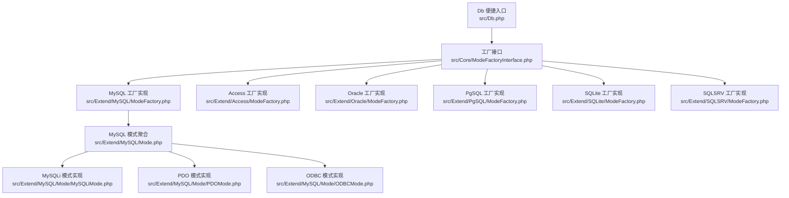
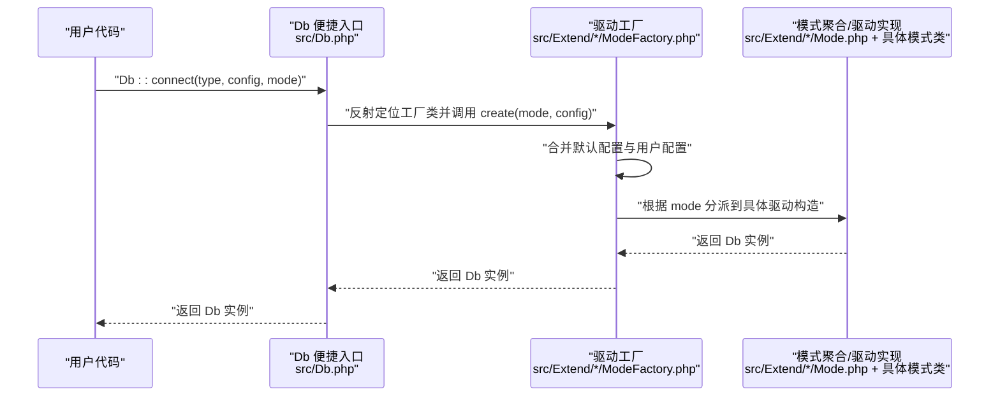
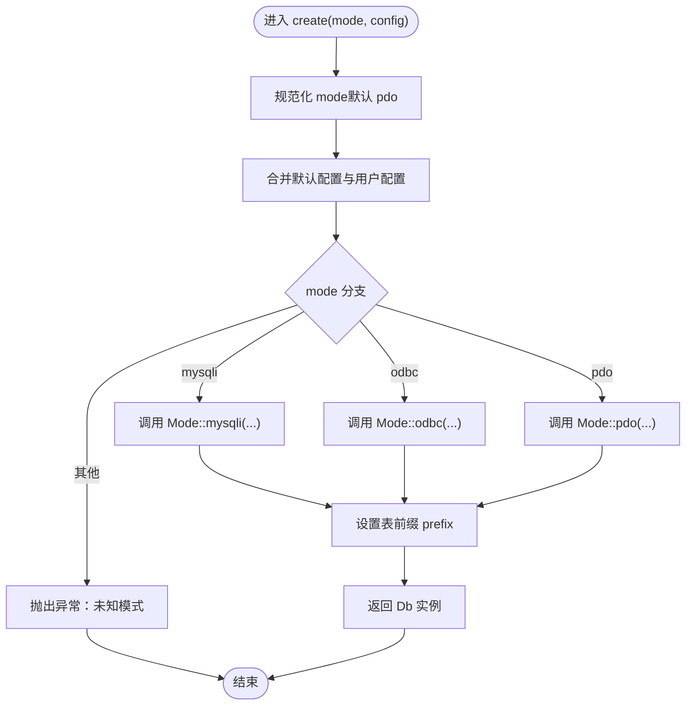
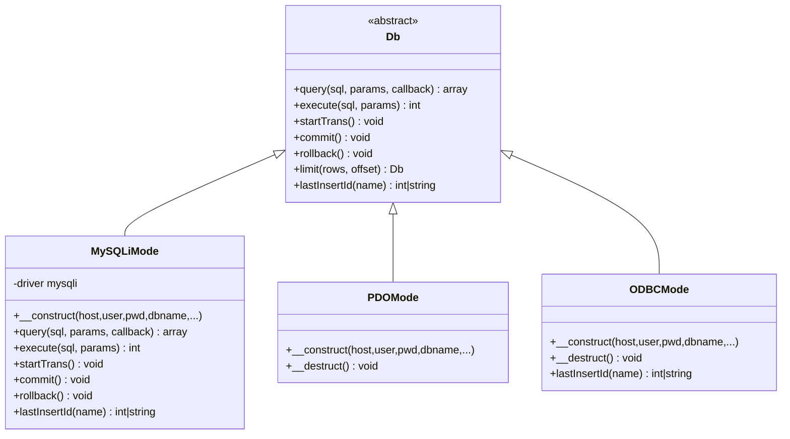
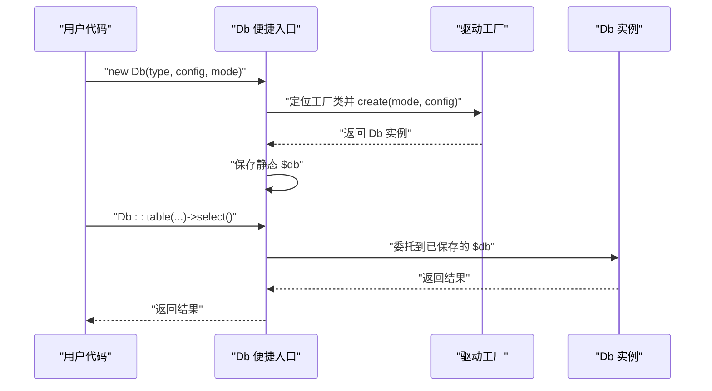
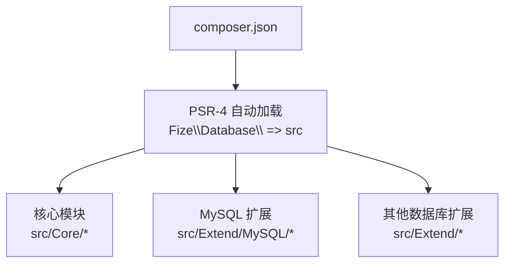

# 连接工厂

<cite>
**本文档引用的文件**
- [ModeFactoryInterface.php](file://src/Core/ModeFactoryInterface.php)
- [ModeFactory.php（MySQL）](file://src/Extend/MySQL/ModeFactory.php)
- [ModeFactory.php（Access）](file://src/Extend/Access/ModeFactory.php)
- [ModeFactory.php（Oracle）](file://src/Extend/Oracle/ModeFactory.php)
- [ModeFactory.php（PgSQL）](file://src/Extend/PgSQL/ModeFactory.php)
- [ModeFactory.php（SQLite）](file://src/Extend/SQLite/ModeFactory.php)
- [ModeFactory.php（SQLSRV）](file://src/Extend/SQLSRV/ModeFactory.php)
- [Db.php（核心抽象类）](file://src/Core/Db.php)
- [Db.php（便捷入口）](file://src/Db.php)
- [Mode.php（MySQL 模式聚合）](file://src/Extend/MySQL/Mode.php)
- [MySQLiMode.php](file://src/Extend/MySQL/Mode/MySQLiMode.php)
- [PDOMode.php](file://src/Extend/MySQL/Mode/PDOMode.php)
- [ODBCMode.php](file://src/Extend/MySQL/Mode/ODBCMode.php)
- [db_connect.php（示例）](file://examples/db_connect.php)
- [composer.json](file://composer.json)
</cite>

## 目录
1. [简介](#简介)
2. [项目结构](#项目结构)
3. [核心组件](#核心组件)
4. [架构总览](#架构总览)
5. [详细组件分析](#详细组件分析)
6. [依赖关系分析](#依赖关系分析)
7. [性能考量](#性能考量)
8. [故障排查指南](#故障排查指南)
9. [结论](#结论)
10. [附录：自定义连接工厂与扩展指南](#附录自定义连接工厂与扩展指南)

## 简介
本文件深入解析 FizeDatabase 的连接工厂设计模式与实现机制，围绕 ModeFactoryInterface 接口与各数据库驱动的工厂实现展开，阐明工厂模式如何实现数据库连接的统一创建与管理，并说明在多数据库场景下的优势与最佳实践。同时提供自定义连接工厂的开发指南与扩展方法。

## 项目结构
FizeDatabase 采用“核心抽象 + 驱动扩展”的分层组织方式：
- 核心层位于 src/Core，定义通用抽象与接口（如 Db 抽象类、ModeFactoryInterface 工厂接口）。
- 驱动扩展位于 src/Extend/<DB>，每个数据库提供独立的 ModeFactory 实现与 Mode 聚合类，内部再细分具体驱动实现（如 MySQL 的 MySQLiMode、PDOMode、ODBCMode）。
- 便捷入口位于 src/Db.php，对外暴露静态方法，内部通过工厂创建具体 Db 实例。
- 示例位于 examples，展示如何使用 Db 入口进行连接与查询。

图表来源
- [Db.php（便捷入口）:32-56](file://src/Db.php#L32-L56)
- [ModeFactoryInterface.php:8-16](file://src/Core/ModeFactoryInterface.php#L8-L16)
- [ModeFactory.php（MySQL）:21-80](file://src/Extend/MySQL/ModeFactory.php#L21-L80)
- [Mode.php（MySQL 模式聚合）:14-74](file://src/Extend/MySQL/Mode.php#L14-L74)
- [MySQLiMode.php:14-251](file://src/Extend/MySQL/Mode/MySQLiMode.php#L14-L251)
- [PDOMode.php:14-53](file://src/Extend/MySQL/Mode/PDOMode.php#L14-L53)
- [ODBCMode.php:15-61](file://src/Extend/MySQL/Mode/ODBCMode.php#L15-L61)

章节来源
- [Db.php（便捷入口）:32-56](file://src/Db.php#L32-L56)
- [ModeFactoryInterface.php:8-16](file://src/Core/ModeFactoryInterface.php#L8-L16)
- [ModeFactory.php（MySQL）:21-80](file://src/Extend/MySQL/ModeFactory.php#L21-L80)
- [Mode.php（MySQL 模式聚合）:14-74](file://src/Extend/MySQL/Mode.php#L14-L74)

## 核心组件
- 工厂接口 ModeFactoryInterface：定义统一的 create(mode, config) 静态工厂方法，约束所有驱动工厂的创建行为。
- 核心抽象类 Db：定义数据库操作的抽象方法（query、execute、startTrans、commit、rollback、limit、lastInsertId 等），并提供查询构建、缓存、日志等通用能力。
- 便捷入口 Db（顶层）：负责根据 type 动态定位对应驱动的 ModeFactory 并创建 Db 实例；同时提供静态代理方法供快速使用。
- 各数据库驱动工厂：基于统一接口，按需合并默认配置，根据 mode 分发到具体的驱动实现（如 MySQL 的 mysqli/pdo/odbc）。
- 模式聚合类 Mode：为某数据库提供静态工厂方法，封装具体驱动类的构造细节，简化工厂调用。

章节来源
- [ModeFactoryInterface.php:8-16](file://src/Core/ModeFactoryInterface.php#L8-L16)
- [Db.php（核心抽象类）:13-119](file://src/Core/Db.php#L13-L119)
- [Db.php（便捷入口）:32-56](file://src/Db.php#L32-L56)
- [Mode.php（MySQL 模式聚合）:14-74](file://src/Extend/MySQL/Mode.php#L14-L74)

## 架构总览
工厂模式在本项目中的作用：
- 统一入口：Db 便捷入口通过 type 定位驱动工厂，屏蔽底层差异。
- 多模式支持：同一驱动工厂根据 mode 参数选择不同底层实现（如 MySQL 的 mysqli/pdo/odbc）。
- 配置解耦：工厂合并默认配置与用户配置，避免调用方关心细节。
- 易扩展：新增数据库只需实现 ModeFactoryInterface，并在工厂内按模式分支创建对应 Db 实例。

图表来源
- [Db.php（便捷入口）:49-56](file://src/Db.php#L49-L56)
- [ModeFactory.php（MySQL）:21-80](file://src/Extend/MySQL/ModeFactory.php#L21-L80)
- [Mode.php（MySQL 模式聚合）:14-74](file://src/Extend/MySQL/Mode.php#L14-L74)

## 详细组件分析

### 工厂接口：ModeFactoryInterface
- 设计理念：通过统一接口约束所有驱动工厂的 create(mode, config) 行为，确保调用方无需关心具体驱动实现。
- 关键点：
  - create 为静态方法，便于直接通过类名调用。
  - 返回类型为 Db 抽象类，保证后续操作的一致性。
  - mode 为空时采用驱动默认值，config 为空时由各工厂自行合并默认值。

章节来源
- [ModeFactoryInterface.php:8-16](file://src/Core/ModeFactoryInterface.php#L8-L16)

### MySQL 工厂实现：ModeFactory（MySQL）
- 默认配置：包含端口、字符集、表前缀、驱动选项、是否 real 连接、socket、ssl_set、flags 等。
- 模式分发：
  - mysqli：调用 Mode::mysqli(...)，封装 MySQLi 驱动连接细节。
  - odbc：调用 Mode::odbc(...)，封装 ODBC 连接细节。
  - pdo：调用 Mode::pdo(...)，封装 PDO 连接细节。
- 错误处理：未知模式抛出异常，避免静默失败。
- 后置处理：设置表前缀 prefix。

图表来源
- [ModeFactory.php（MySQL）:21-80](file://src/Extend/MySQL/ModeFactory.php#L21-L80)

章节来源
- [ModeFactory.php（MySQL）:21-80](file://src/Extend/MySQL/ModeFactory.php#L21-L80)

### Access 工厂实现：ModeFactory（Access）
- 默认配置：包含密码、表前缀、驱动等。
- 模式分发：adodb/odbc/pdo，分别调用 Mode::adodb(...)、Mode::odbc(...)、Mode::pdo(...)。
- 后置处理：设置表前缀 prefix。

章节来源
- [ModeFactory.php（Access）:23-47](file://src/Extend/Access/ModeFactory.php#L23-L47)

### Oracle 工厂实现：ModeFactory（Oracle）
- 默认配置：包含端口、字符集、表前缀、会话模式、连接类型、驱动选项、驱动等。
- 模式分发：
  - oci：拼装连接串后调用 Mode::oci(...)。
  - odbc：拼装 SID 后调用 Mode::odbc(...)。
  - pdo：调用 Mode::pdo(...)。
- 后置处理：设置表前缀 prefix。

章节来源
- [ModeFactory.php（Oracle）:21-73](file://src/Extend/Oracle/ModeFactory.php#L21-L73)

### PgSQL 工厂实现：ModeFactory（PgSQL）
- 默认配置：包含端口、字符集、表前缀、驱动、持久连接、连接类型、驱动选项等。
- 模式分发：
  - odbc：调用 Mode::odbc(...)。
  - pgsql：拼装连接串后调用 Mode::pgsql(...)。
  - pdo：调用 Mode::pdo(...)。
- 后置处理：设置表前缀 prefix。

章节来源
- [ModeFactory.php（PgSQL）:21-54](file://src/Extend/PgSQL/ModeFactory.php#L21-L54)

### SQLite 工厂实现：ModeFactory（SQLite）
- 默认配置：包含表前缀、long_names、time_out、no_txn、sync_pragma、step_api、驱动、flags、加密密钥、busy_timeout 等。
- 模式分发：
  - odbc：调用 Mode::odbc(...)。
  - sqlite3：调用 Mode::sqlite3(...)。
  - pdo：调用 Mode::pdo(...)。
- 后置处理：设置表前缀 prefix。

章节来源
- [ModeFactory.php（SQLite）:21-59](file://src/Extend/SQLite/ModeFactory.php#L21-L59)

### SQLSRV 工厂实现：ModeFactory（SQLSRV）
- 默认配置：包含端口、表前缀、新特性开关、驱动、字符集、驱动选项等。
- 模式分发：
  - adodb/odbc/pdo/sqlsrv：分别调用对应 Mode::xxx(...)。
- 后置处理：设置表前缀 prefix 与新特性开关 newFeature。

章节来源
- [ModeFactory.php（SQLSRV）:23-53](file://src/Extend/SQLSRV/ModeFactory.php#L23-L53)

### 模式聚合与具体驱动实现（以 MySQL 为例）
- 模式聚合类 Mode：为 MySQL 提供静态工厂方法，封装具体驱动类（MySQLiMode、PDOMode、ODBCMode）的构造细节。
- 具体驱动实现：
  - MySQLiMode：基于 mysqli 扩展，支持 real_connect、SSL、socket 等高级特性。
  - PDOMode：基于 PDO，通过 DSN 组装与中间件完成连接。
  - ODBCMode：基于 ODBC，通过 DSN 与驱动名完成连接。

图表来源
- [Db.php（核心抽象类）:13-119](file://src/Core/Db.php#L13-L119)
- [MySQLiMode.php:14-251](file://src/Extend/MySQL/Mode/MySQLiMode.php#L14-L251)
- [PDOMode.php:14-53](file://src/Extend/MySQL/Mode/PDOMode.php#L14-L53)
- [ODBCMode.php:15-61](file://src/Extend/MySQL/Mode/ODBCMode.php#L15-L61)

章节来源
- [Mode.php（MySQL 模式聚合）:14-74](file://src/Extend/MySQL/Mode.php#L14-L74)
- [MySQLiMode.php:42-65](file://src/Extend/MySQL/Mode/MySQLiMode.php#L42-L65)
- [PDOMode.php:29-42](file://src/Extend/MySQL/Mode/PDOMode.php#L29-L42)
- [ODBCMode.php:29-39](file://src/Extend/MySQL/Mode/ODBCMode.php#L29-L39)

### 便捷入口：Db 类
- 初始化 connect：根据 type 动态定位驱动工厂类，调用 create(mode, config) 返回 Db 实例。
- 静态代理：提供 query/execute/startTrans/commit/rollback/table/getLastSql 等静态方法，内部委托给已初始化的 Db 实例。
- 事务嵌套：维护 transactionNestingLevel，支持嵌套事务控制。

图表来源
- [Db.php（便捷入口）:32-56](file://src/Db.php#L32-L56)
- [Db.php（便捷入口）:124-139](file://src/Db.php#L124-L139)

章节来源
- [Db.php（便捷入口）:32-56](file://src/Db.php#L32-L56)
- [Db.php（便捷入口）:84-114](file://src/Db.php#L84-L114)

### 示例：连接与查询
- 示例展示了通过 Db 便捷入口设置默认连接与创建新连接，并进行链式查询。
- 通过 Db::connect 可以在运行时动态创建不同配置的连接实例。

章节来源
- [db_connect.php（示例）:14-38](file://examples/db_connect.php#L14-L38)

## 依赖关系分析
- Composer 自动加载：PSR-4 命名空间映射至 src 目录，确保工厂与驱动类可被自动加载。
- 扩展建议：composer.json 中对各数据库扩展做了建议声明，便于在不同环境中启用相应驱动。

图表来源
- [composer.json:11-18](file://composer.json#L11-L18)

章节来源
- [composer.json:11-18](file://composer.json#L11-L18)

## 性能考量
- 查询缓存：核心 Db 抽象类内置查询结果缓存，select 支持缓存开关，减少重复查询开销。
- 预处理绑定：各驱动实现均支持问号占位符与参数绑定，降低 SQL 注入风险并提升执行效率。
- 模式选择：
  - PDO 作为跨数据库首选，具备良好的兼容性与生态。
  - MySQLi 在 MySQL 场景下具备更贴近底层的能力，适合对性能敏感的场景。
  - ODBC 适配通用场景，但注意其返回类型可能为字符串。
- 连接复用与生命周期：建议在应用层复用 Db 实例，避免频繁创建销毁带来的开销。

章节来源
- [Db.php（核心抽象类）:700-711](file://src/Core/Db.php#L700-L711)
- [MySQLiMode.php:115-164](file://src/Extend/MySQL/Mode/MySQLiMode.php#L115-L164)
- [PDOMode.php:29-42](file://src/Extend/MySQL/Mode/PDOMode.php#L29-L42)
- [ODBCMode.php:29-39](file://src/Extend/MySQL/Mode/ODBCMode.php#L29-L39)

## 故障排查指南
- 未知模式异常：当传入的 mode 不在工厂支持范围内时，工厂会抛出异常。请检查模式名称与驱动支持范围。
- 配置缺失：若缺少必要配置（如 host、user、password、dbname 等），请在 config 中补齐。
- 扩展未安装：若使用特定驱动（如 PDO/ODBC/MySQLi 等），请确认相应 PHP 扩展已安装并启用。
- 事务嵌套：Db 便捷入口对事务进行了嵌套计数，确保外层事务提交/回滚时才真正生效。

章节来源
- [ModeFactory.php（MySQL）:75-77](file://src/Extend/MySQL/ModeFactory.php#L75-L77)
- [ModeFactory.php（Access）:42-44](file://src/Extend/Access/ModeFactory.php#L42-L44)
- [ModeFactory.php（Oracle）:69-71](file://src/Extend/Oracle/ModeFactory.php#L69-L71)
- [ModeFactory.php（PgSQL）:49-51](file://src/Extend/PgSQL/ModeFactory.php#L49-L51)
- [ModeFactory.php（SQLite）:55-57](file://src/Extend/SQLite/ModeFactory.php#L55-L57)
- [ModeFactory.php（SQLSRV）:48-50](file://src/Extend/SQLSRV/ModeFactory.php#L48-L50)
- [Db.php（便捷入口）:84-114](file://src/Db.php#L84-L114)

## 结论
FizeDatabase 通过工厂接口与各驱动工厂实现，将数据库连接的创建过程标准化、可扩展化。工厂模式在多数据库支持中提供了统一入口与清晰的模式分发机制，配合核心抽象类与便捷入口，既保证了易用性，又兼顾了灵活性与性能。遵循本文档的最佳实践与扩展指南，可在不破坏现有架构的前提下快速接入新的数据库或驱动。

## 附录：自定义连接工厂与扩展指南
- 新增数据库步骤
  1) 在 src/Extend 下创建目录 <DB>，并在其中实现 ModeFactoryInterface 的工厂类，命名为 ModeFactory.php。
  2) 在工厂类中定义默认配置与模式分发逻辑，根据 mode 调用对应 Db 实例构造。
  3) 在 src/Extend/<DB> 下创建 Mode 聚合类，提供静态工厂方法，封装具体驱动实现。
  4) 在具体驱动实现中继承核心 Db 抽象类，实现 query/execute/startTrans/commit/rollback 等抽象方法。
  5) 在 Db 便捷入口中，无需修改即可通过 Db::connect('your_db', $config, $mode) 使用新工厂。
- 最佳实践
  - 统一配置命名：约定 config 键名，避免不同驱动之间的歧义。
  - 模式文档化：为每种模式提供简要说明与适用场景，便于团队协作。
  - 异常明确化：对未知模式与配置错误抛出明确异常，便于定位问题。
  - 性能优先：优先使用 PDO，必要时在特定数据库场景选用 MySQLi；避免不必要的多语句查询。
  - 测试覆盖：为新工厂与驱动实现编写单元测试，确保行为一致。
- 性能优化建议
  - 合理使用查询缓存：对重复查询开启缓存，减少数据库压力。
  - 参数绑定：始终使用预处理与参数绑定，避免字符串拼接。
  - 连接池/长连接：根据业务场景评估是否启用持久连接或连接池策略（需结合具体驱动支持情况）。

章节来源
- [ModeFactoryInterface.php:8-16](file://src/Core/ModeFactoryInterface.php#L8-L16)
- [ModeFactory.php（MySQL）:21-80](file://src/Extend/MySQL/ModeFactory.php#L21-L80)
- [Mode.php（MySQL 模式聚合）:14-74](file://src/Extend/MySQL/Mode.php#L14-L74)
- [Db.php（便捷入口）:32-56](file://src/Db.php#L32-L56)