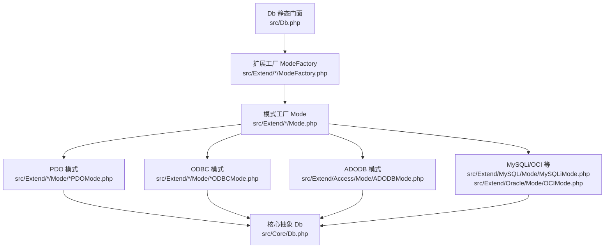
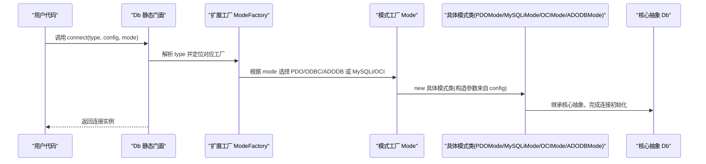
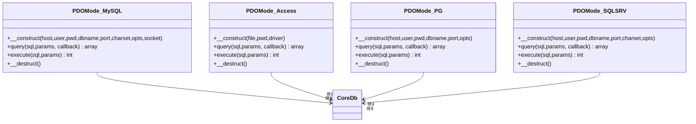
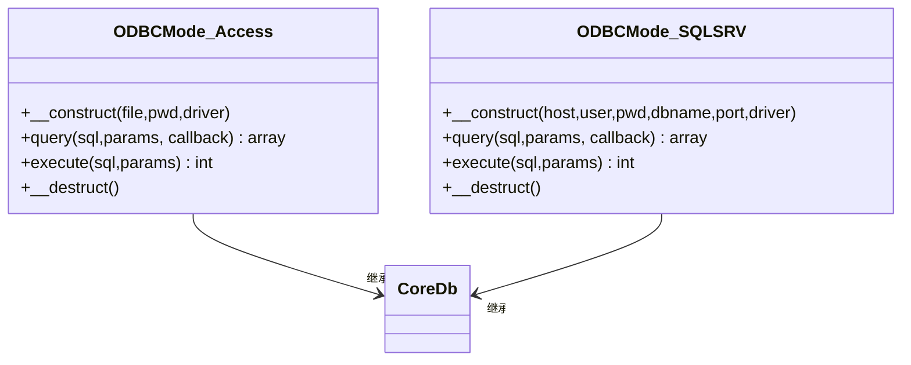
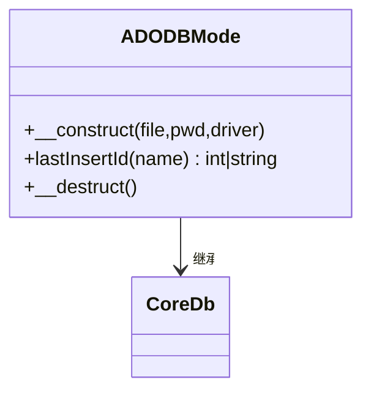
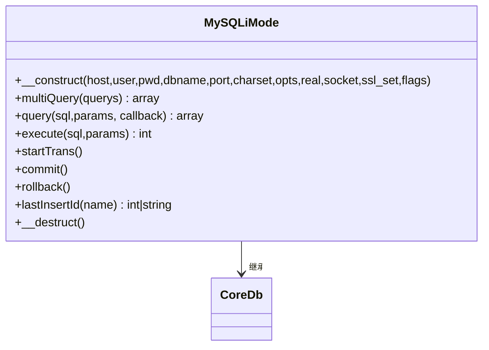
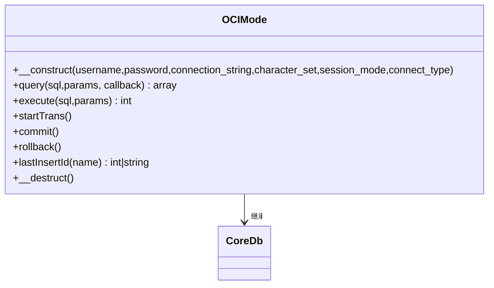
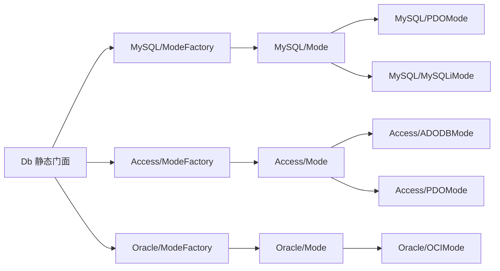

# 连接管理

<cite>
**本文引用的文件**
- [src/Db.php](file://src/Db.php)
- [src/Core/Db.php](file://src/Core/Db.php)
- [src/Extend/Access/ModeFactory.php](file://src/Extend/Access/ModeFactory.php)
- [src/Extend/MySQL/ModeFactory.php](file://src/Extend/MySQL/ModeFactory.php)
- [src/Extend/Oracle/ModeFactory.php](file://src/Extend/Oracle/ModeFactory.php)
- [src/Extend/Access/Mode.php](file://src/Extend/Access/Mode.php)
- [src/Extend/MySQL/Mode.php](file://src/Extend/MySQL/Mode.php)
- [src/Extend/Oracle/Mode.php](file://src/Extend/Oracle/Mode.php)
- [src/Extend/PgSQL/Mode.php](file://src/Extend/PgSQL/Mode.php)
- [src/Extend/SQLSRV/Mode.php](file://src/Extend/SQLSRV/Mode.php)
- [src/Extend/Access/Mode/ADODBMode.php](file://src/Extend/Access/Mode/ADODBMode.php)
- [src/Extend/Access/Mode/PDOMode.php](file://src/Extend/Access/Mode/PDOMode.php)
- [src/Extend/MySQL/Mode/PDOMode.php](file://src/Extend/MySQL/Mode/PDOMode.php)
- [src/Extend/MySQL/Mode/MySQLiMode.php](file://src/Extend/MySQL/Mode/MySQLiMode.php)
- [src/Extend/Oracle/Mode/OCIMode.php](file://src/Extend/Oracle/Mode/OCIMode.php)
</cite>

## 目录
1. [简介](#简介)
2. [项目结构](#项目结构)
3. [核心组件](#核心组件)
4. [架构总览](#架构总览)
5. [详细组件分析](#详细组件分析)
6. [依赖关系分析](#依赖关系分析)
7. [性能考量与选择建议](#性能考量与选择建议)
8. [故障排除指南](#故障排除指南)
9. [结论](#结论)
10. [附录：配置示例与最佳实践](#附录配置示例与最佳实践)

## 简介
本篇文档聚焦于 FizeDatabase 的数据库连接管理机制，系统阐述 PDO、ODBC、ADODB 三种连接模式在不同数据库扩展中的实现与差异，解析连接工厂的创建流程、连接生命周期与资源释放策略，并给出连接超时、重连、状态监控等高级能力的设计思路与落地建议。同时提供针对 MySQL、Oracle、PostgreSQL、SQL Server、Access 等数据库的配置要点与性能对比，帮助读者在不同场景下做出合理选择。

## 项目结构
FizeDatabase 采用“核心抽象 + 扩展适配 + 工厂模式”的分层设计：
- 核心层：统一的查询构建与事务接口（Core/Db 抽象类）
- 扩展层：按数据库类型划分的 ModeFactory 与 Mode 工厂方法，分别暴露 PDO、ODBC、ADODB（Access）或 MySQLi/OCI 等具体驱动
- 入口层：Db 静态门面，负责根据类型与模式创建连接并委派查询与执行

图表来源
- [src/Db.php:1-141](file://src/Db.php#L1-L141)
- [src/Core/Db.php:1-941](file://src/Core/Db.php#L1-L941)
- [src/Extend/MySQL/ModeFactory.php:1-82](file://src/Extend/MySQL/ModeFactory.php#L1-L82)
- [src/Extend/Access/ModeFactory.php:1-49](file://src/Extend/Access/ModeFactory.php#L1-L49)
- [src/Extend/Oracle/ModeFactory.php:1-76](file://src/Extend/Oracle/ModeFactory.php#L1-L76)
- [src/Extend/MySQL/Mode.php:1-74](file://src/Extend/MySQL/Mode.php#L1-L74)
- [src/Extend/Access/Mode.php:1-51](file://src/Extend/Access/Mode.php#L1-L51)
- [src/Extend/Oracle/Mode.php:1-63](file://src/Extend/Oracle/Mode.php#L1-L63)
- [src/Extend/PgSQL/Mode.php:1-59](file://src/Extend/PgSQL/Mode.php#L1-L59)
- [src/Extend/SQLSRV/Mode.php:1-80](file://src/Extend/SQLSRV/Mode.php#L1-L80)

章节来源
- [src/Db.php:1-141](file://src/Db.php#L1-L141)
- [src/Core/Db.php:1-941](file://src/Core/Db.php#L1-L941)

## 核心组件
- Db 静态门面：对外提供统一入口，内部通过扩展工厂创建具体连接实例；封装事务计数、表名与前缀设置、SQL 组装与执行等通用能力。
- Core/Db 抽象类：定义 query/execute/startTrans/commit/rollback 等抽象方法，以及查询构建器（field/group/order/join/union 等）与缓存机制。
- ModeFactory：按数据库类型聚合，负责解析模式参数，合并默认配置，调用 Mode 工厂方法创建具体连接。
- Mode 工厂方法：集中暴露 PDO/ODBC/ADODB（Access）或 MySQLi/OCI 等构造函数，屏蔽底层差异。
- 具体模式类：实现 PDO/ODBC/ADODB/MySQLi/OCI 等连接与执行细节，包含资源释放与错误处理。

章节来源
- [src/Db.php:1-141](file://src/Db.php#L1-L141)
- [src/Core/Db.php:1-941](file://src/Core/Db.php#L1-L941)

## 架构总览
下面以“Db → ModeFactory → Mode → 具体模式类 → 核心抽象 Db”的调用链路展示连接管理的整体流程。

图表来源
- [src/Db.php:32-56](file://src/Db.php#L32-L56)
- [src/Extend/MySQL/ModeFactory.php:21-80](file://src/Extend/MySQL/ModeFactory.php#L21-L80)
- [src/Extend/Access/ModeFactory.php:23-47](file://src/Extend/Access/ModeFactory.php#L23-L47)
- [src/Extend/Oracle/ModeFactory.php:21-74](file://src/Extend/Oracle/ModeFactory.php#L21-L74)
- [src/Extend/MySQL/Mode.php:14-74](file://src/Extend/MySQL/Mode.php#L14-L74)
- [src/Extend/Access/Mode.php:12-51](file://src/Extend/Access/Mode.php#L12-L51)
- [src/Extend/Oracle/Mode.php:14-63](file://src/Extend/Oracle/Mode.php#L14-L63)

## 详细组件分析

### 连接工厂与模式选择
- 工厂职责：根据 type 与 mode，合并默认配置，调用 Mode 工厂方法创建连接；若 mode 未显式指定，采用各数据库扩展的默认模式（如 MySQL 默认 PDO，Access 默认 ADODB）。
- 模式参数：不同数据库扩展的参数差异较大，例如 MySQL 支持 port、charset、opts、socket、ssl_set、flags 等；Oracle 支持 session_mode、connect_type；Access 支持 driver、password、file；SQL Server 支持 driver、charset 等。
- 前缀设置：工厂创建连接后统一设置表前缀，便于后续查询构建。

章节来源
- [src/Extend/MySQL/ModeFactory.php:21-80](file://src/Extend/MySQL/ModeFactory.php#L21-L80)
- [src/Extend/Access/ModeFactory.php:23-47](file://src/Extend/Access/ModeFactory.php#L23-L47)
- [src/Extend/Oracle/ModeFactory.php:21-74](file://src/Extend/Oracle/ModeFactory.php#L21-L74)

### PDO 模式（推荐）
- MySQL/PgSQL/SQL Server/Access 等均提供 PDO 实现，具备跨平台、预处理语句、字符集控制等优势。
- MySQL/PgSQL/SQL Server 的 PDO 构造参数包含 host、user、password、dbname、port、charset、opts、socket 等；Access 的 PDO 通过 ODBC 驱动连接，需注意字符集转换（UTF-8 与 GBK）。
- 生命周期：构造时建立连接，析构时释放资源；查询/执行过程中进行 prepare/execute/fetch，异常时抛出统一数据库异常。

图表来源
- [src/Extend/MySQL/Mode/PDOMode.php:1-53](file://src/Extend/MySQL/Mode/PDOMode.php#L1-L53)
- [src/Extend/Access/Mode/PDOMode.php:1-146](file://src/Extend/Access/Mode/PDOMode.php#L1-L146)
- [src/Extend/PgSQL/Mode.php:32-45](file://src/Extend/PgSQL/Mode.php#L32-L45)
- [src/Extend/SQLSRV/Mode.php:45-61](file://src/Extend/SQLSRV/Mode.php#L45-L61)

章节来源
- [src/Extend/MySQL/Mode/PDOMode.php:1-53](file://src/Extend/MySQL/Mode/PDOMode.php#L1-L53)
- [src/Extend/Access/Mode/PDOMode.php:1-146](file://src/Extend/Access/Mode/PDOMode.php#L1-L146)

### ODBC 模式
- 适用场景：通用性较强，适合通过 ODBC 驱动访问多种数据库；部分数据库（如 Access、SQL Server）可通过 ODBC 驱动连接。
- Access 的 ODBC 连接通过 Microsoft Access Driver 驱动实现，需注意字符集转换与参数绑定；SQL Server 的 ODBC 连接同样需要正确设置驱动与字符集。
- 生命周期：构造时生成 DSN，析构时释放资源；查询/执行过程与 PDO 类似，异常统一处理。

图表来源
- [src/Extend/Access/Mode/ADODBMode.php:13-60](file://src/Extend/Access/Mode/ADODBMode.php#L13-L60)
- [src/Extend/SQLSRV/Mode.php:30-43](file://src/Extend/SQLSRV/Mode.php#L30-L43)

章节来源
- [src/Extend/Access/Mode/ADODBMode.php:13-60](file://src/Extend/Access/Mode/ADODBMode.php#L13-L60)
- [src/Extend/SQLSRV/Mode.php:30-43](file://src/Extend/SQLSRV/Mode.php#L30-L43)

### ADODB 模式（Access）
- 通过 OLE DB Provider 连接 Access 数据库，支持密码保护与驱动选择；构造时生成 DSN，析构时释放资源。
- 特殊点：Access 的 lastInsertId 通过查询 @@IDENTITY 获取，与标准 PDO 不同。

图表来源
- [src/Extend/Access/Mode/ADODBMode.php:13-60](file://src/Extend/Access/Mode/ADODBMode.php#L13-L60)

章节来源
- [src/Extend/Access/Mode/ADODBMode.php:13-60](file://src/Extend/Access/Mode/ADODBMode.php#L13-L60)

### MySQLi 模式（谨慎使用）
- 通过 MySQLi 扩展直接连接 MySQL，支持 real_connect、SSL、套接字、选项等；构造时建立连接并设置字符集，析构时关闭连接。
- 特殊点：多语句查询非标准用法；事务通过 begin_transaction/commit/rollback 控制；lastInsertId 通过 stmt->insert_id 获取。

图表来源
- [src/Extend/MySQL/Mode/MySQLiMode.php:14-251](file://src/Extend/MySQL/Mode/MySQLiMode.php#L14-L251)

章节来源
- [src/Extend/MySQL/Mode/MySQLiMode.php:14-251](file://src/Extend/MySQL/Mode/MySQLiMode.php#L14-L251)

### Oracle OCI 模式
- 通过 OCI 扩展连接 Oracle，支持连接串、字符集、会话模式与连接类型；查询/执行中将 ? 占位符转换为 :$n 绑定变量。
- 事务通过 OCI_NO_AUTO_COMMIT/OCI_COMMIT_ON_SUCCESS 控制；lastInsertId 需要指定序列名。

图表来源
- [src/Extend/Oracle/Mode/OCIMode.php:13-155](file://src/Extend/Oracle/Mode/OCIMode.php#L13-L155)

章节来源
- [src/Extend/Oracle/Mode/OCIMode.php:13-155](file://src/Extend/Oracle/Mode/OCIMode.php#L13-L155)

### 连接生命周期与资源释放
- PDO/ODBC/ADODB：在具体模式类的构造中建立连接，在析构中释放；查询/执行过程使用 prepare/execute/fetch，异常统一抛出。
- MySQLi：构造时 real_connect，析构时 kill(thread_id) 与 close；多语句查询使用 multi_query。
- OCI：构造时创建 OCI 对象，析构时释放；查询/执行通过 parse/bindByName/execute/freeStatement。

章节来源
- [src/Extend/Access/Mode/PDOMode.php:37-44](file://src/Extend/Access/Mode/PDOMode.php#L37-L44)
- [src/Extend/MySQL/Mode/PDOMode.php:44-51](file://src/Extend/MySQL/Mode/PDOMode.php#L44-L51)
- [src/Extend/MySQL/Mode/MySQLiMode.php:67-76](file://src/Extend/MySQL/Mode/MySQLiMode.php#L67-L76)
- [src/Extend/Oracle/Mode/OCIMode.php:40-46](file://src/Extend/Oracle/Mode/OCIMode.php#L40-L46)

### 事务管理
- Db 静态门面维护事务嵌套层级，startTrans/commit/rollback 仅在最外层触发实际事务操作，避免重复提交或回滚。
- 各具体模式类实现 startTrans/commit/rollback，如 MySQLi 的 begin_transaction/commit/rollback，OCI 的会话模式切换。

章节来源
- [src/Db.php:84-114](file://src/Db.php#L84-L114)
- [src/Extend/MySQL/Mode/MySQLiMode.php:217-239](file://src/Extend/MySQL/Mode/MySQLiMode.php#L217-L239)
- [src/Extend/Oracle/Mode/OCIMode.php:115-139](file://src/Extend/Oracle/Mode/OCIMode.php#L115-L139)

### 查询构建与执行
- Core/Db 提供统一的查询构建器（field/group/order/join/union 等），并在 select/find/fetch/count 等方法中复用；支持缓存与 SQL 日志输出。
- 具体模式类仅负责将 SQL 与参数交给底层驱动执行，并处理异常与字符集转换（如 Access 的 UTF-8 ↔ GBK）。

章节来源
- [src/Core/Db.php:583-800](file://src/Core/Db.php#L583-L800)
- [src/Db.php:65-139](file://src/Db.php#L65-L139)

## 依赖关系分析
- Db 静态门面依赖扩展工厂；扩展工厂依赖模式工厂；模式工厂依赖具体模式类；具体模式类依赖核心抽象 Db。
- 不同数据库扩展的 ModeFactory 在默认模式、参数集合与默认值上存在差异，体现了“同一抽象、多态实现”的设计原则。

图表来源
- [src/Db.php:32-56](file://src/Db.php#L32-L56)
- [src/Extend/MySQL/ModeFactory.php:21-80](file://src/Extend/MySQL/ModeFactory.php#L21-L80)
- [src/Extend/Access/ModeFactory.php:23-47](file://src/Extend/Access/ModeFactory.php#L23-L47)
- [src/Extend/Oracle/ModeFactory.php:21-74](file://src/Extend/Oracle/ModeFactory.php#L21-L74)
- [src/Extend/MySQL/Mode.php:14-74](file://src/Extend/MySQL/Mode.php#L14-L74)
- [src/Extend/Access/Mode.php:12-51](file://src/Extend/Access/Mode.php#L12-L51)
- [src/Extend/Oracle/Mode.php:14-63](file://src/Extend/Oracle/Mode.php#L14-L63)

## 性能考量与选择建议
- 推荐优先使用 PDO 模式：跨平台、预处理语句、字符集可控、生态完善；MySQL/PgSQL/SQL Server/Access 均提供稳定实现。
- MySQLi 模式：功能丰富但已逐步被 PDO 替代，建议谨慎使用；若需极致性能或特定 MySQL 特性，可评估是否采用。
- ODBC 模式：通用性强，适合通过驱动桥接多种数据库；注意字符集转换与参数绑定差异。
- ADODB（Access）：OLE DB 方式，适合 Access 文件数据库；lastInsertId 通过查询实现，注意与 PDO 差异。
- Oracle：OCI 模式支持连接串、字符集、会话模式，适合企业级部署；注意 ? 与 :$n 绑定差异。

章节来源
- [src/Extend/MySQL/Mode.php:18-36](file://src/Extend/MySQL/Mode.php#L18-L36)
- [src/Extend/Access/Mode.php:16-25](file://src/Extend/Access/Mode.php#L16-L25)
- [src/Extend/Oracle/Mode.php:18-30](file://src/Extend/Oracle/Mode.php#L18-L30)

## 故障排除指南
- 连接失败
  - 检查 ModeFactory 默认模式与传入 mode 是否匹配目标数据库；确认 config 中 host/port/dbname/user/password/driver 等参数齐全。
  - MySQLi：real_connect 失败会抛出异常，检查 SSL、socket、flags、opts 等参数组合。
  - OCI：检查连接串、字符集、会话模式与连接类型。
- 字符集问题
  - Access 的 PDO 模式涉及 UTF-8 与 GBK 转换，确保 SQL 与参数在 prepare 前后正确编码。
- 事务异常
  - 确认嵌套事务计数与实际提交/回滚时机；避免在非最外层误触发 commit/rollback。
- 资源泄漏
  - 确保具体模式类的析构被调用（如 PDO/ODBC/ADODB/MySQLi/OCI），避免连接未释放导致资源耗尽。

章节来源
- [src/Extend/Access/Mode/PDOMode.php:53-144](file://src/Extend/Access/Mode/PDOMode.php#L53-L144)
- [src/Extend/MySQL/Mode/MySQLiMode.php:42-65](file://src/Extend/MySQL/Mode/MySQLiMode.php#L42-L65)
- [src/Extend/Oracle/Mode/OCIMode.php:35-46](file://src/Extend/Oracle/Mode/OCIMode.php#L35-L46)
- [src/Db.php:84-114](file://src/Db.php#L84-L114)

## 结论
FizeDatabase 通过“核心抽象 + 扩展工厂 + 模式工厂 + 具体模式类”的分层设计，实现了对 PDO、ODBC、ADODB 等多种连接模式的统一接入与差异化实现。PDO 模式在跨平台与生态方面具有明显优势，是大多数数据库的首选；ODBC 适合通用桥接场景；ADODB 适合 Access 文件数据库；MySQLi 与 OCI 分别面向 MySQL 与 Oracle 的特定需求。结合事务嵌套、查询构建与资源释放策略，可在保证稳定性的同时兼顾性能与可维护性。

## 附录：配置示例与最佳实践
- MySQL（PDO）
  - 关键参数：host、user、password、dbname、port、charset、opts、socket
  - 建议：开启持久化与合适的超时设置；生产环境启用 SSL；合理设置字符集与排序规则
- MySQL（MySQLi）
  - 关键参数：host、user、password、dbname、port、charset、opts、real、socket、ssl_set、flags
  - 建议：使用 real_connect 并提前设置 options 与 ssl_set；谨慎使用多语句查询
- Oracle（OCI）
  - 关键参数：username、password、connection_string、character_set、session_mode、connect_type
  - 建议：明确连接串格式；注意 ? 与 :$n 绑定差异；合理设置会话模式
- Access（PDO/ODBC/ADODB）
  - 关键参数：file、password、driver
  - 建议：注意 UTF-8 与 GBK 转换；ADODB/ODBC 需正确配置驱动；lastInsertId 通过查询实现
- SQL Server（PDO/ODBC/ADODB）
  - 关键参数：host、user、password、dbname、port、charset、driver
  - 建议：明确驱动与字符集；ODBC/ADODB 需正确配置驱动；PDO 注意字符集转换

章节来源
- [src/Extend/MySQL/ModeFactory.php:21-80](file://src/Extend/MySQL/ModeFactory.php#L21-L80)
- [src/Extend/Oracle/ModeFactory.php:21-74](file://src/Extend/Oracle/ModeFactory.php#L21-L74)
- [src/Extend/Access/ModeFactory.php:23-47](file://src/Extend/Access/ModeFactory.php#L23-L47)
- [src/Extend/SQLSRV/Mode.php:16-78](file://src/Extend/SQLSRV/Mode.php#L16-L78)